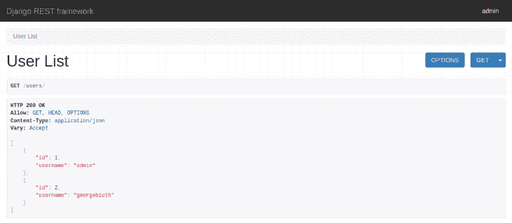
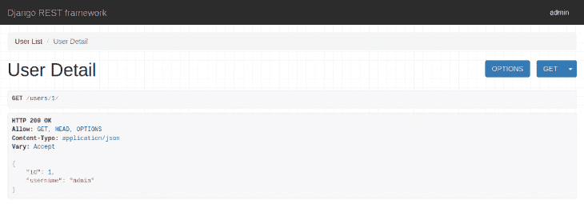
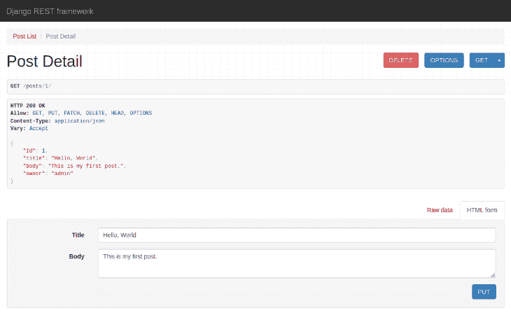
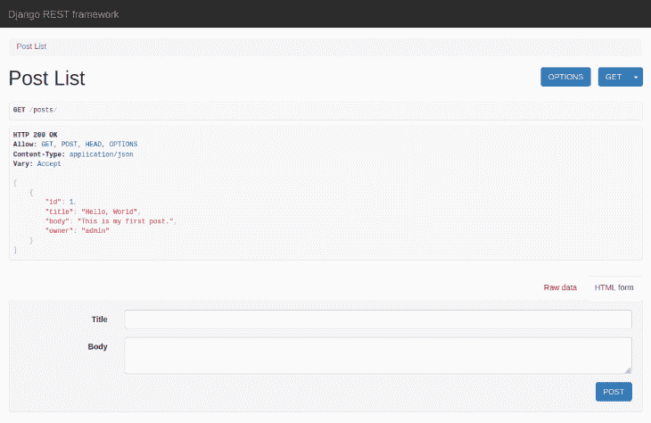
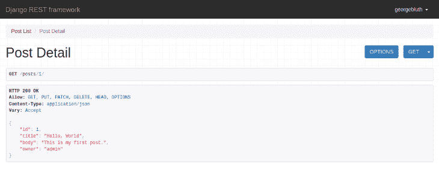
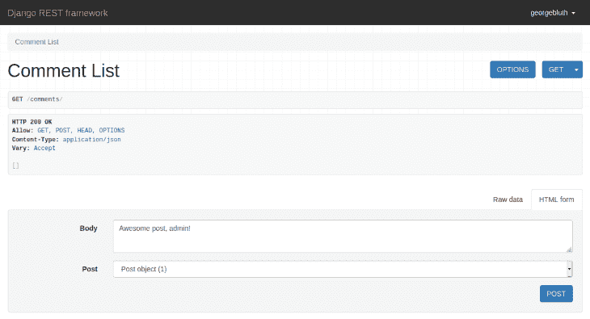
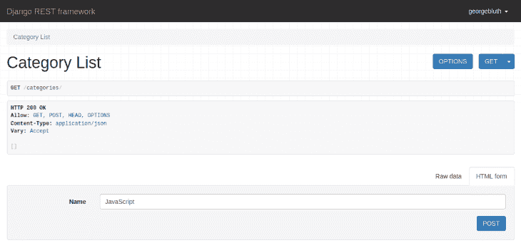
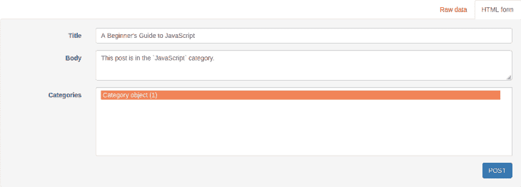

# 使用 Django REST 框架构建一个 blog - LogRocket Blog

> 原文：<https://blog.logrocket.com/use-django-rest-framework-to-build-a-blog/>

API 服务允许应用程序使用 JSON 编码的数据连接到其他应用程序。创建一个 API，并从任何 API 客户端或前端应用程序使用它。

Django REST 框架是一个用 [Django](https://www.djangoproject.com/) 构建 REST APIs 的工具包。在本教程中，您将使用 Django REST 框架构建一个博客 API。这个 API 将拥有用户、博客文章、评论和类别的端点。

您还将了解如何验证用户操作，以确保只有经过验证的用户才能修改您的应用程序数据。

该 API 项目展示了以下技能:

*   向 API 添加新的和现有的 Django 模型
*   使用通用 API 模式的内置序列化程序来序列化这些模型
*   创建视图和 URL 模式
*   定义多对一和多对多关系
*   验证用户操作
*   使用 Django REST 框架的可浏览 API

## 使用 Django REST 框架的先决条件

您应该在系统上安装了 [Python 3](https://www.python.org/downloads/) ，并且体验过与 REST APIs 的交互。您还应该熟悉关系数据库，包括主键和外键、数据库模型、迁移以及多对一和多对多关系。

您还需要一些 Python 和 Django 的经验。

## 设置 Python 环境

要创建一个新的 API 项目，首先要在工作目录中设置一个 Python 环境。在您的终端中运行以下命令:

```
python3 -m venv env
source env/bin/activate

```

> 在 Windows 上，改为运行`source env\Scripts\activate`。

确保从这个虚拟环境中运行本教程中的所有命令(确保在终端的输入行的开头看到`(env)`)。

> 要停用此环境，请运行`deactivate`。

接下来，将 Django 和 Django REST 框架安装到虚拟环境中:

```
pip install django
pip install djangorestframework

```

然后创建一个名为`blog`的新项目和一个名为`api`的 app:

```
django-admin startproject blog
cd blog
django-admin startapp api

```

从根`blog`目录(`manage.py`文件所在的位置)，同步初始数据库。这将运行`admin`、`auth`、`contenttypes`和`sessions`的迁移。

```
python manage.py migrate

```

您还需要一个`admin`用户来与 Django 管理站点和可浏览的 API 交互。从终端运行以下命令:

```
python manage.py createsuperuser --email [email protected] --username admin

```

设置您喜欢的任何密码(必须至少有八个字符)。请注意，如果您将密码设置为类似于`password123`的值，您可能会得到一个错误，提示您的密码太普通了。

要设置您的 Django REST 框架 API，请将`rest_framework`和您的`api`应用程序添加到`blog/blog/settings.py`:

```
INSTALLED_APPS = [
    # code omitted for brevity
    'rest_framework',
    'api.apps.ApiConfig',
]

```

添加`ApiConfig`对象允许你添加其他配置选项到你的应用程序中(参见 [AppConfig 文档](https://docs.djangoproject.com/en/3.1/_modules/django/apps/config/))。您不需要指定任何其他选项来完成本教程。

最后，在终端中使用以下命令启动本地开发服务器:

```
python manage.py runserver

```

导航到`[http://127.0.0.1:8000/admin](http://127.0.0.1:8000/admin)`并登录查看 Django 管理站点。点击**用户**查看您的新管理员用户或添加一两个新用户。

## 为 Django REST 框架创建用户 API

现在您已经有了一个`admin`用户和一两个其他用户，您将设置一个用户 API。这将允许从一组 API 端点对用户列表和单个用户进行只读访问。

### 用户序列化程序

Django REST 框架使用序列化器将查询集和模型实例翻译成 JSON 数据。序列化还决定了 API 在对客户端的响应中返回哪些数据。

Django 的用户是从`[django.contrib.auth](https://docs.djangoproject.com/en/3.1/ref/contrib/auth/)`中定义的`User`模型中创建的。

要为`User`模型创建一个序列化器，将以下内容添加到`blog/api/serializers.py`:

```
from rest_framework import serializers
from django.contrib.auth.models import User

class UserSerializer(serializers.ModelSerializer):
    class Meta:
        model = User
        fields = ['id', 'username']

```

如本例所示，从 Django 导入`User`模型，并从 Django REST 框架导入序列化器集合。

现在创建`UserSerializer`类，它应该继承自`[ModelSerializer](https://www.django-rest-framework.org/api-guide/serializers/#modelserializer)`类。

定义应该与此序列化程序关联的模型(`model = User`)。`fields`数组指示模型中的哪些字段应该包含在序列化程序中。例如，您还可以添加`first_name`和`last_name`字段。

`ModelSerializer`类生成基于相应模型字段的序列化器字段。这意味着您不需要为 serializer 字段手动指定任何属性，因为这些属性来自模型本身。

此序列化程序还创建简单的 create()和 update()方法。如果需要，这些可以被覆盖。

> 要了解更多关于`ModelSerializer`如何工作以及如何使用其他序列化程序对数据进行更多控制的信息，请参见[序列化程序](https://www.django-rest-framework.org/api-guide/serializers/)。

### 用户视图

有几种方法可以在 Django REST 框架中创建视图。为了可重用的功能和保持代码[干燥](https://en.wikipedia.org/wiki/Don%27t_repeat_yourself)，使用基于类的视图。

Django REST 框架基于`APIView`类提供了几个[通用视图类](https://www.django-rest-framework.org/api-guide/generic-views/#generic-views)。这些视图是为最常用的 API 模式设计的。

例如，`ListAPIView`用于只读端点，并提供了一个`get`方法处理程序。`ListCreateAPIView`类用于读写端点，并提供`get`和`post`方法处理程序。

要为您的用户列表创建只读视图和为单个用户创建只读视图，请将以下内容添加到`blog/api/views.py`:

```
from rest_framework import generics
from api import serializers
from django.contrib.auth.models import User

class UserList(generics.ListAPIView):
    queryset = User.objects.all()
    serializer_class = serializers.UserSerializer

class UserDetail(generics.RetrieveAPIView):
    queryset = User.objects.all()
    serializer_class = serializers.UserSerializer

```

如这段代码所示，导入 Django REST 框架的视图集合`generics`，以及前面步骤中定义的`User`模型和`UserSerializer`。`UserList`视图提供对用户列表的只读访问(通过`get`)；`UserDetail`视图向单个用户提供只读访问(通过`get`)。

视图名称应该采用以下形式:`{ModelName}List`和`{ModelName}Detail`分别用于对象列表和单个对象。

对于每个视图，`queryset`变量包含模型实例的列表，由`User.objects.all()`返回。应该将`serializer_class`设置为`UserSerializer`，它将序列化`User`数据。

在下一步中，您将为这些视图设置端点路径。

### 用户 URL 模式

有了模型、序列化器和用户的视图集，最后一步是为每个视图定义端点路径(Django 称之为“URL 模式”)。

* * *

### 更多来自 LogRocket 的精彩文章:

* * *

首先，在`blog/api/urls.py`中，添加以下内容:

```
from django.urls import path
from rest_framework.urlpatterns import format_suffix_patterns
from api import views

urlpatterns = [
    path('users/', views.UserList.as_view()),
    path('users/<int:pk>/', views.UserDetail.as_view()),
]

urlpatterns = format_suffix_patterns(urlpatterns)

```

在这里，您已经导入了 Django 的`path`函数和您的`api`应用程序的视图集合。

`path`函数创建一个元素，Django 用它来显示应用程序中的页面。为此，Django 首先通过将 URL 模式(例如，`users/`)与用户请求的 URL 进行匹配来找到正确的元素。然后它导入并调用相应的视图(例如，`UserList`)。

`<int:pk>`序列指的是作为主键的整数值(`pk`)。Django 捕获 URL 的这一部分，并将其作为关键字参数发送给视图。

在我们的例子中，`User`的主键是`id`字段，所以`example.com/users/1`将返回给用户`id`等于`1`。

在与这些 URL 模式(以及本教程后面将要创建的模式)交互之前，您需要将它们添加到 Django 项目中。将以下内容添加到`blog/blog/urls.py`:

```
from django.contrib import admin
from django.urls import path, include

urlpatterns = [
    path('admin/', admin.site.urls),
    path('', include('api.urls')),
]

```

要检查这些部分是否正常工作，请在浏览器中导航到`[http://127.0.0.1:8000/users](http://127.0.0.1:8000/users)`以查看应用程序的用户列表。



> 本教程使用 Django REST 框架的可浏览 API 来说明本教程中创建的端点。这个 GUI 提供了模拟前端客户端的身份验证和表单。如果您愿意，也可以使用`cURL`或`httpie`从终端测试您的 API。

记下您的`admin`用户的`id`值，并导航到该用户的端点。例如，如果`id`是`1`，导航到`[http://127.0.0.1:8000/users/1](http://127.0.0.1:8000/users/1)`。



总之，Django 的模型类是使用`UserSerializer`序列化的。这个序列化器向`UserList`和`UserDetail`视图提供数据，使用`users/`和`users/<int:pk>/` URL 模式访问这些数据。

## 创建发布 API

设置好基本的用户 API 后，您现在可以为博客创建一个完整的 API，包括帖子、评论和类别的端点。首先创建 Post API。

### 发布模型

在`blog/api/models.py`中，创建一个从 Django 的`Model`类继承的`Post`模型，并定义它的字段:

```
from django.db import models

class Post(models.Model):
    created = models.DateTimeField(auto_now_add=True)
    title = models.CharField(max_length=100, blank=True, default='')
    body = models.TextField(blank=True, default='')
    owner = models.ForeignKey('auth.User', related_name='posts', on_delete=models.CASCADE)

    class Meta:
        ordering = ['created']

```

字段类型对应于关系数据库中通常使用的字段类型。有关 Django 模型和字段类型的更多详细信息，请参见[模型](https://docs.djangoproject.com/en/3.1/topics/db/models/)。

注意，`ForeignKey`类型在当前模型和第一个参数中指出的模型(`auth.User`，也就是您一直在使用的`User`模型)之间创建了一个多对一的关系。

在这种情况下，一个用户可以是许多帖子的所有者，但是每个帖子只能有一个所有者。`owner`字段可能会在前端应用程序中使用，以检索用户并显示他们的用户名作为帖子的作者。

`related_name`参数允许您为当前模型(`posts`)而不是默认的(`post_set`)设置自定义访问名。在下一步中，这个帖子列表将被添加到`User`序列化器中，以完成多对一关系。

每次修改模型时，运行以下命令来更新数据库:

```
python manage.py makemigrations api
python manage.py migrate

```

因为这些是 Django 模型，就像你一直在使用的`User`模型，你的帖子可以通过在`blog/api/admin.py`中注册来从 Django 的管理站点进行修改:

```
from django.contrib import admin
from api.models import Post

admin.site.register(Post)

```

请注意，稍后您将能够从可浏览的 API 创建帖子。

现在，导航到`[http://127.0.0.1:8000/admin](http://127.0.0.1:8000/admin)`，点击**帖子**，并添加一些帖子。您会注意到这个表单中的`title`和`body`字段对应于由`Post`模型定义的`CharField`和`TextField`类型。

您也可以从现有用户中选择一个`owner`。当使用可浏览 API 创建文章时，您不需要选择用户。`owner`将自动设置为当前登录的用户。您将在下一步中进行设置。

### 后串行器

要将`Post`模型添加到 API 中，您将遵循一个类似于为`User`模型所遵循的过程。

首先需要序列化`Post`模型数据。在`blog/api/serializers.py`中，添加以下内容:

```
# code omitted for brevity
from api.models import Post

class PostSerializer(serializers.ModelSerializer):
    owner = serializers.ReadOnlyField(source='owner.username')

    class Meta:
        model = Post
        fields = ['id', 'title', 'body', 'owner']

class UserSerializer(serializers.ModelSerializer):
    posts = serializers.PrimaryKeyRelatedField(many=True, read_only=True)

    class Meta:
        model = User
        fields = ['id', 'username', 'posts']

```

如本例所示，从您的`api`应用程序导入`Post`模型，并创建一个从`ModelSerializer`类继承的`PostSerializer`。设置此序列化程序要使用的模型和字段。

`ReadOnlyField`是一个字段类，它返回一个未经修改的值。在这种情况下，它用于返回所有者的`username`字段，而不是默认的`id`字段。

接下来，向`UserSerializer`添加一个`posts`字段。帖子和用户之间的多对一关系是由前面步骤中的`Post`模型定义的。字段名(`posts`)应该等于`Post.owner`字段的`related_field`参数。如果在之前的步骤中没有显示`related_field`值，将`posts`更改为`post_set`(默认值)。

`PrimaryKeyRelatedField`表示多对一关系中的帖子列表(`many=True`表示不止一个帖子)。

注意，如果不设置`read_only=True`，默认情况下`posts`字段将具有写权限。这意味着在创建用户时，您可以手动设置属于该用户的帖子列表。这很可能不是你想要的行为。

再次导航到`[http://127.0.0.1:8000/users](http://127.0.0.1:8000/users)`以查看每个用户的`posts`字段。

> 注意，`posts`的列表实际上是 post `id`值的列表。您可以使用`[HyperlinkedModelSerializer](https://www.django-rest-framework.org/api-guide/serializers/#hyperlinkedmodelserializer)`返回一个 URL 列表。

### 发布视图

下一步是为 Post API 创建一组视图。将以下内容添加到`blog/api/views.py`:

```
# code omitted for brevity
from api.models import Post

class PostList(generics.ListCreateAPIView):
    queryset = Post.objects.all()
    serializer_class = serializers.PostSerializer

    def perform_create(self, serializer):
        serializer.save(owner=self.request.user)

class PostDetail(generics.RetrieveUpdateDestroyAPIView):
    queryset = Post.objects.all()
    serializer_class = serializers.PostSerializer

# code omitted for brevity

```

`ListCreateAPIView`和`RetrieveUpdateDestroyAPIView`一起提供了最常见的 API 方法处理程序:`get`和`post`用于列表(`ListCreateAPIView`)，以及`get`、`update`和`delete`用于单个实体(`RetrieveUpdateDestroyAPIView`)。

您还必须覆盖默认的`perform_create`函数，将`owner`字段设置为当前用户(`self.request.user`的值)。

### 发布 URL 模式

要完成 Post API 的端点，请创建 Post URL 模式。将以下内容添加到`blog/api/urls.py`中的`urlpatterns`数组:

```
# code omitted for brevity

urlpatterns = [
    # code omitted for brevity
    path('posts/', views.PostList.as_view()),
    path('posts/<int:pk>/', views.PostDetail.as_view()),
]

```

将这些视图与这些 URL 模式结合起来，就创建了`get posts/`、`post posts/`、`get posts/<int:pk>/`、`put posts/<int:pk>/`和`delete posts/<int:pk>/`端点。

要测试这些端点，请导航到单个帖子，如`[http://127.0.0.1:8000/posts/1](http://127.0.0.1:8000/posts/1)`，然后单击**删除**。要更改文章的标题，请更改`title`字段值，然后单击 **PUT** 进行更新。



导航至`[http://127.0.0.1:8000/posts](http://127.0.0.1:8000/posts)`查看现有帖子列表或创建新帖子。尝试创建帖子时，请确保您已登录，因为帖子的所有者被设置为当前用户。



## 设置权限

为了方便起见，您可以通过将以下路径添加到`blog/urls.py`来将**登录**按钮添加到可浏览的 API 中:

```
# code omitted for brevity

urlpatterns = [
    # code omitted for brevity
    path('api-auth/', include('rest_framework.urls')),
]

```

现在，您可以使用可浏览的 API 登录和注销不同的用户帐户来测试权限和修改您的帖子。

目前，只要你登录，你就可以创建帖子，但你不需要登录就可以删除或修改帖子，即使帖子不属于你。尝试使用不同的用户帐户登录。您应该能够修改或删除由`admin`拥有的帖子。

要验证用户并确保只有帖子的所有者可以更新或删除现有帖子，您需要向 API 添加权限。

首先，将以下内容添加到`blog/api/permissions.py`:

```
from rest_framework import permissions

class IsOwnerOrReadOnly(permissions.BasePermission):
    def has_object_permission(self, request, view, obj):
        if request.method in permissions.SAFE_METHODS:
            return True

        return obj.owner == request.user

```

> 这个权限的代码取自 Django REST 框架文档。

custom `IsOwnerOrReadOnly`权限检查请求用户是否是给定对象的所有者。在这种情况下，只有所有者可以执行更新或删除帖子等操作。非所有者仍然可以检索帖子，因为这是一个只读操作。

还有一个内置的`[IsAuthenticatedOrReadOnly](https://www.django-rest-framework.org/api-guide/permissions/#isauthenticatedorreadonly)`权限。有了这个权限，任何经过身份验证的用户都可以执行任何请求，而未经身份验证的用户只能执行只读请求。

将这些权限添加到帖子视图:

```
# code omitted for brevity
from rest_framework import permissions
from api.permissions import IsOwnerOrReadOnly

class PostList(generics.ListCreateAPIView):
    queryset = Post.objects.all()
    serializer_class = PostSerializer
    permission_classes = [permissions.IsAuthenticatedOrReadOnly]

    def perform_create(self, serializer):
        serializer.save(owner=self.request.user)

class PostDetail(generics.RetrieveUpdateDestroyAPIView):
    queryset = Post.objects.all()
    serializer_class = PostSerializer
    permission_classes = [permissions.IsAuthenticatedOrReadOnly,
                          IsOwnerOrReadOnly]

# code omitted for brevity

```

`PostList`视图只需要`IsAuthenticatedOrReadOnly`权限，因为用户必须通过验证才能创建帖子，任何用户都可以查看帖子列表。

`PostDetail`需要这两种权限，因为更新和删除一篇文章应该只允许一个经过认证的用户，同时也是文章的所有者。检索单个帖子是只读的，不需要任何权限。

再次导航至`[http://127.0.0.1:8000/posts](http://127.0.0.1:8000/posts)`。登录您的`admin`帐户和其他用户帐户，测试哪些操作现在可以由经过身份验证和未经身份验证的用户执行。

注销后，您应该不能创建、删除或更新任何帖子。作为一个用户登录时，您应该不能删除或更新其他用户拥有的帖子。



> 关于 Django REST 框架中权限的更多信息，请参见[权限](https://www.django-rest-framework.org/api-guide/permissions/)。

## 创建注释 API

现在您有了一个基本的 post API。你现在可以给你的文章添加评论系统了。

评论是用户在回复帖子时添加的文本，属于单个用户。一个用户可以在任何帖子上发表很多评论，包括他们自己的，一个帖子可以有来自不同用户的很多评论。这意味着您将建立**两个**多对一的关系:一个是评论和用户之间的关系，一个是评论和帖子之间的关系。

### 评论模型

首先，在`blog/api/models.py`中创建评论模型:

```
# code omitted for brevity

class Comment(models.Model):
    created = models.DateTimeField(auto_now_add=True)
    body = models.TextField(blank=False)
    owner = models.ForeignKey('auth.User', related_name='comments', on_delete=models.CASCADE)
    post = models.ForeignKey('Post', related_name='comments', on_delete=models.CASCADE)

    class Meta:
        ordering = ['created']

```

`Comment`模型类似于`Post`模型，通过`owner`字段与用户建立多对一的关系。一个评论也通过`post`字段与一个帖子有多对一的关系。

像以前一样运行数据库迁移:

```
python manage.py makemigrations api
python manage.py migrate

```

### 注释序列化程序

要创建评论 API，首先将`Comment`模型添加到`PostSerializer`和`UserSerializer`中，以确保相关的评论与其他帖子和用户数据一起发送。

将此代码添加到`blog/api/serializers.py`:

```
# code omitted for brevity
from api.models import Comment

class PostSerializer(serializers.ModelSerializer):
    owner = serializers.ReadOnlyField(source='owner.username')
    comments = serializers.PrimaryKeyRelatedField(many=True, read_only=True)

    class Meta:
        model = Post
        fields = ['id', 'title', 'body', 'owner', 'comments']

class UserSerializer(serializers.ModelSerializer):
    posts = serializers.PrimaryKeyRelatedField(many=True, read_only=True)
    comments = serializers.PrimaryKeyRelatedField(many=True, read_only=True)

    class Meta:
        model = User
        fields = ['id', 'username', 'posts', 'comments']

```

这里的过程类似于将`posts`加到`UserSerializer`上。同样，这设置了评论和用户之间以及评论和文章之间多对一关系的“多”部分。注释列表也应该是只读的(通过设置`read_only=True`)。

现在，将`CommentSerializer`添加到同一个文件中:

```
class CommentSerializer(serializers.ModelSerializer):
    owner = serializers.ReadOnlyField(source='owner.username')

    class Meta:
        model = Comment
        fields = ['id', 'body', 'owner', 'post']

```

请注意，您不需要定制`post`字段。通过将`post`字段直接添加到`fields`数组中，它以默认方式被序列化(根据`ModelSerializer`)。这相当于定义了`post = serializers.PrimaryKeyRelatedField(queryset=Post.objects.all())`。

这意味着默认情况下`post`字段拥有**写权限**:当用户创建一个新评论时，他们也设置了它所属的帖子。

### 评论视图

最后，为您的评论创建自定义视图和 URL 模式。这个过程类似于您为`Post` API 所遵循的过程。

将此代码添加到`blog/api/views.py`:

```
from api.models import Comment

class CommentList(generics.ListCreateAPIView):
    queryset = Comment.objects.all()
    serializer_class = serializers.CommentSerializer
    permission_classes = [permissions.IsAuthenticatedOrReadOnly]

    def perform_create(self, serializer):
        serializer.save(owner=self.request.user)

class CommentDetail(generics.RetrieveUpdateDestroyAPIView):
    queryset = Comment.objects.all()
    serializer_class = serializers.CommentSerializer
    permission_classes = [permissions.IsAuthenticatedOrReadOnly,
                          IsOwnerOrReadOnly]

```

这些视图类似于`PostList`和`PostDetail`视图。

### 评论 URL 模式

要完成注释 API，请在`blog/api/urls.py`中定义 URL 模式:

```
# code omitted for brevity

urlpatterns = [
    # code omitted for brevity
    path('comments/', views.CommentList.as_view()),
    path('comments/<int:pk>/', views.CommentDetail.as_view()),
]

urlpatterns = format_suffix_patterns(urlpatterns)

```

您现在可以导航到`[http://127.0.0.1:8000/comments](http://127.0.0.1:8000/comments)`查看现有评论列表并创建新评论。



请注意，在可浏览 API 中创建新评论时，您必须从现有帖子列表中选择帖子。

## 创建类别 API

博客 API 的最后一部分是一个分类系统。

任何帖子都可以添加一个或多个类别。因为一篇文章可以有许多类别，而一个类别可以属于许多文章，所以必须定义多对多关系。

### 类别模型

在`blog/api/models.py`中创建`Category`模型:

```
class Category(models.Model):
    name = models.CharField(max_length=100, blank=False, default='')
    owner = models.ForeignKey('auth.User', related_name='categories', on_delete=models.CASCADE)
    posts = models.ManyToManyField('Post', related_name='categories', blank=True)

    class Meta:
        verbose_name_plural = 'categories'

```

这里，`ManyToManyField`类在当前模型和第一个参数中指出的模型之间创建了一个多对多的关系。与`ForeignKey`类一样，这种关系由序列化程序完成。

请注意，`verbose_name_plural`决定了如何在 Django 管理站点等地方使用复数形式的模型名称。这避免了将`category`复数化为`categorys`，并将复数手动设置为`categories`。

像以前一样运行数据库迁移:

```
python manage.py makemigrations api
python manage.py migrate

```

### 类别序列化程序

创建类别 API 的过程类似于您在前面步骤中遵循的过程。首先，通过将以下代码添加到`blog/api/serializers.py`中，为`Category`模型创建一个序列化器:

```
# code omitted for brevity
from api.models import Category

class CategorySerializer(serializers.ModelSerializer):
    owner = serializers.ReadOnlyField(source='owner.username')
    posts = serializers.PrimaryKeyRelatedField(many=True, read_only=True)

    class Meta:
        model = Category
        fields = ['id', 'name', 'owner', 'posts']

class PostSerializer(serializers.ModelSerializer):
    owner = serializers.ReadOnlyField(source='owner.username')
    comments = serializers.PrimaryKeyRelatedField(many=True, read_only=True)

    class Meta:
        model = Post
        fields = ['id', 'title', 'body', 'owner', 'comments', 'categories']

class UserSerializer(serializers.ModelSerializer):
    posts = serializers.PrimaryKeyRelatedField(many=True, read_only=True)
    comments = serializers.PrimaryKeyRelatedField(many=True, read_only=True)
    categories = serializers.PrimaryKeyRelatedField(many=True, read_only=True)

    class Meta:
        model = User
        fields = ['id', 'username', 'posts', 'comments', 'categories']

```

确保将`categories`字段名添加到`PostSerializer`和`UserSerializer`的字段列表中。注意`UserSerializer.categories`也要用`read_only=True`定制。此字段表示用户已创建的所有类别的可查看列表。

另一方面，默认情况下，`PostSerializer.categories`字段将具有写访问权。默认值与设置`categories = serializers.PrimaryKeyRelatedField(many=True, queryset=Category.objects.all())`相同。这允许用户选择一个或多个现有类别来分配给新帖子。

### 类别视图

接下来，在`blog/api/views.py`中为类别 API 创建视图:

```
# code omitted for brevity
from api.models import Category

class CategoryList(generics.ListCreateAPIView):
    queryset = Category.objects.all()
    serializer_class = serializers.CategorySerializer
    permission_classes = [permissions.IsAuthenticatedOrReadOnly]

    def perform_create(self, serializer):
        serializer.save(owner=self.request.user)

class CategoryDetail(generics.RetrieveUpdateDestroyAPIView):
    queryset = Category.objects.all()
    serializer_class = serializers.PostSerializer
    permission_classes = [permissions.IsAuthenticatedOrReadOnly,
                          IsOwnerOrReadOnly]

```

这些视图类似于您到目前为止创建的其他视图。

### 类别 URL 模式

最后，为了完成类别 API，将这段代码添加到`blog/api/urls.py`:

```
# code omitted for brevity

urlpatterns = [
    # code omitted for brevity
    path('categories/', views.CategoryList.as_view()),
    path('categories/<int:pk>/', views.CategoryDetail.as_view()),
]

urlpatterns = format_suffix_patterns(urlpatterns)

```

您现在可以导航到`[http://127.0.0.1:8000/categories](http://127.0.0.1:8000/categories)`并创建一两个类别。



接下来，导航到`[http://127.0.0.1:8000/posts](http://127.0.0.1:8000/posts)`并创建一个新帖子。您可以向帖子添加一个或多个类别。



## 结论

恭喜你！现在，您已经有了一个带身份验证的博客 API 和许多 API 开发中最常见的模式。您已经创建了用于检索、创建、更新和删除帖子、评论和类别的端点。您还添加了这些资源之间的多对一和多对多关系。

要扩展您的 API 或为其创建前端客户端，请参考 [Django REST 框架文档](https://www.django-rest-framework.org)和[教程和资源](https://www.django-rest-framework.org/community/tutorials-and-resources/)。

## 使用 [LogRocket](https://lp.logrocket.com/blg/signup) 消除传统错误报告的干扰

[](https://lp.logrocket.com/blg/signup)

[LogRocket](https://lp.logrocket.com/blg/signup) 是一个数字体验分析解决方案，它可以保护您免受数百个假阳性错误警报的影响，只针对几个真正重要的项目。LogRocket 会告诉您应用程序中实际影响用户的最具影响力的 bug 和 UX 问题。

然后，使用具有深层技术遥测的会话重放来确切地查看用户看到了什么以及是什么导致了问题，就像你在他们身后看一样。

LogRocket 自动聚合客户端错误、JS 异常、前端性能指标和用户交互。然后 LogRocket 使用机器学习来告诉你哪些问题正在影响大多数用户，并提供你需要修复它的上下文。

关注重要的 bug—[今天就试试 LogRocket】。](https://lp.logrocket.com/blg/signup-issue-free)