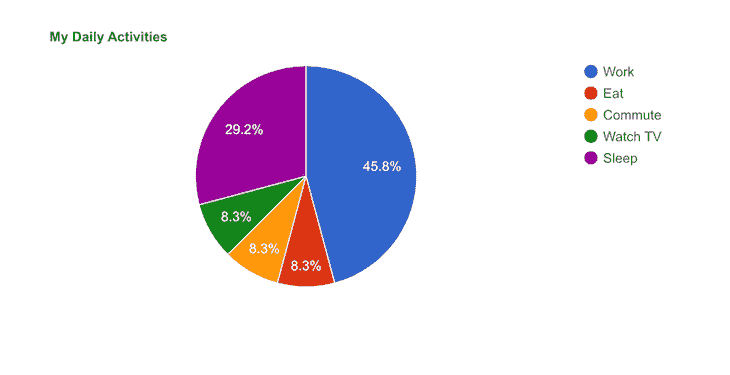
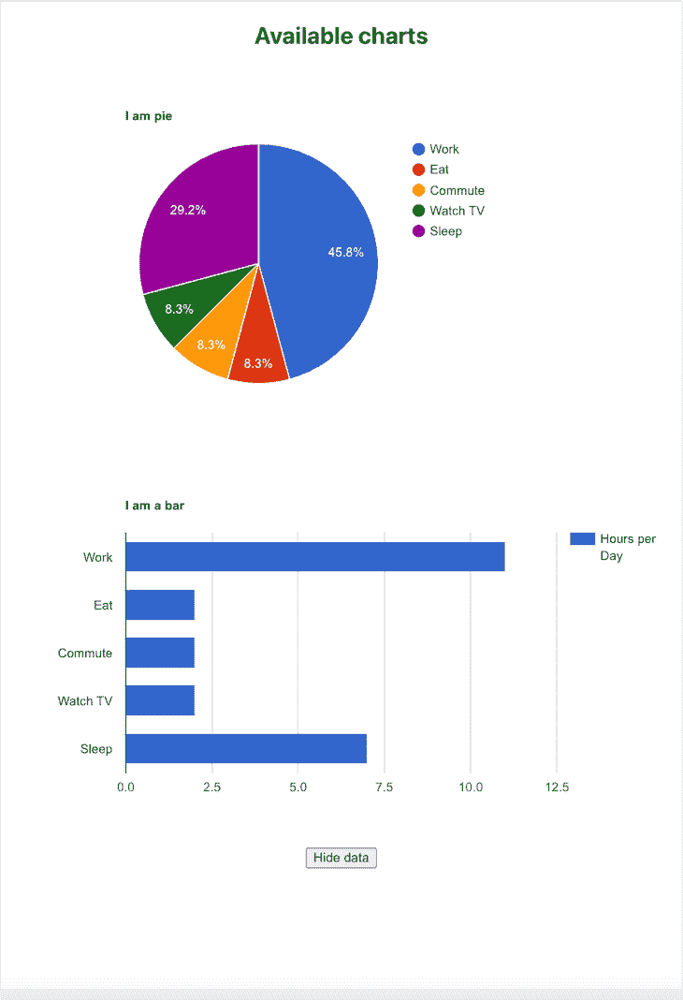

# 如何在 React - LogRocket 博客中使用谷歌图表

> 原文：<https://blog.logrocket.com/use-google-charts-react/>

数据可视化是展示数据和吸引观众的好方法。与原始数据、excel 表格或一长串数字相比，人脑通常更擅长记忆图像。React 和 [Google Charts](https://developers.google.com/chart) 都是基于 JavaScript 构建的，它们可以协同工作，使开发人员能够创建引人入胜、可重用的数据可视化，如条形图、饼图、气泡图等。

在本教程中，我们将学习如何使用谷歌图表与反应。我们将讨论为什么应该使用 Google 图表，并演示如何在 React 中使用 Google 图表可视化不同类型的图表。我们将详细介绍以下内容:

我们开始吧！

## 什么是谷歌图表？

Google Charts 是一个免费的、现代的、由 Google 主动维护的 JavaScript 图表服务，它在您的项目中使用起来既高效又简单。Google Charts 包括一套广泛的定制选项以及一个丰富的图表库，有许多选项可供选择，从简单的线形图到更复杂的分层树形图。Google Charts [包括一些像甘特图](https://developers.google.com/chart/interactive/docs/gallery)这样的图表类型，根据我的经验，在其他图表库中很难找到。

Google Charts 兼容很多设备，不像其他一些图书馆在这方面没有那么大方。Google Charts 具有跨浏览器兼容性和跨平台能力，这意味着图表在桌面和移动上都很好看。谷歌图表使用 HTML 和 SVG，因此不需要额外的插件。

与其他图表库如 [Chart.js](https://www.chartjs.org/) 相比， [Google Charts 只有 43kB，在撰写本文时只有 117kB。](https://www.fusioncharts.com/javascript-charting-comparison/google-charts-vs-chartjs)

在我看来，Google Charts 的最佳用例是当你想快速地在你的网站上设置可视化，而不需要添加大量的定制，或者你担心应用程序的整体大小。现在我们已经熟悉了 Google Charts，让我们学习如何在 React 应用程序中设置它。

## 设置项目

要在我们的 React 应用程序中使用 Google Charts，我们将从使用下面的代码设置 React 应用程序开始:

```
npx create-react-app react-google-chart

```

运行完这段代码后，将工作目录更改为通过前面的命令创建的文件夹:

```
cd react-google-chart

```

## 安装`react-google-charts`包

[`react-google-charts`包](https://github.com/rakannimer/react-google-charts)是一个现代的、维护良好的、瘦的、打字的、React 的 Google Charts 包装器，使得开发者可以非常容易地使用 React 和 Google Charts:

```
npm install --save react-google-charts

```

现在，我们都准备好使用谷歌图表来可视化我们的数据。启动项目以预览应用程序:

```
npm start

```

## 创建我们的第一个图表

要开始设计界面，请打开用您选择的文本编辑器创建的项目。接下来，删除`src/App.js`文件中返回方法内的所有代码。该文件应该类似于下面的代码:

```
import './App.css';
function App() {
  return (

  );
}
export default App;

```

上面的代码带有浏览器中呈现的默认占位符，所以我们将在教程的后面用我们自己的内容更新它。接下来，为了查看 Google 图表的运行情况，我们将创建一个简单的图表。首先，我们在`src`目录中创建一个名为`charts.js`的新文件，我们将在这里构建图表。

## 设置我们的组件

在新创建的文件中，我们将重新创建来自 [React Google Charts 饼状图示例](https://www.react-google-charts.com/examples/pie-chart)的示例，它只是主 [Google Charts 饼状图示例](https://developers.google.com/chart/interactive/docs/gallery/piechart)的重做，展示了如何使用这个包来实现它:

```
import { Chart } from "react-google-charts";
export const data = [
  ["Task", "Hours per Day"],
  ["Work", 11],
  ["Eat", 2],
  ["Commute", 2],
  ["Watch TV", 2],
  ["Sleep", 7],
];
export const options = {
  title: "My Daily Activities",
};

const charts = () => {
  return (
    <Chart
      chartType="PieChart"
      data={data}
      options={options}
      width={"100%"}
      height={"400px"}
    />
  )
}
export default charts

```

首先，我们导入`react-google-charts`并获得`Chart`属性。接下来，我们创建一个`data`变量，它将存放要在饼图上显示的数据。饼图是高度可定制的；对于更复杂的图表，只需将数据更新到数组中。

使用`<Chart />`，您可以传递 props 来更新图表显示的数据，以及更改图表的外观。`chartType` prop 允许您更改正在显示的图表类型。因此，如果我们经过`Barchart`，就会显示一个条形图。

`data`接受图表的数据，`options`接受一个我们可以进一步定制的对象。对于这个例子，我们只改变了`title`。最后，顾名思义，`width`和`height`改变了图表的维度。

在`src/App.js`中，将内容替换为以下内容:

```
import './App.css';
import Chart from './components/charts'
function App() {
  return (
    <div className="App">
    <Chart />
    </div>
  );
}
export default App;

```

使用上面的代码，我们简单地导入并呈现了`charts.js`组件。

## 可视化我们的图表

让我们看看到目前为止我们已经建立了什么。现在尝试运行服务器。如果一切顺利，您应该会看到类似下图的内容:



该图表非常具有交互性，只需几行代码就可以轻松生成。

## 使用 React 钩子操作我们的图表

我们之前的例子只涵盖了快速创建和显示图表的基本用例。让我们进一步扩展这个例子，看看它在一个有更多组件和一个集中式数据源的更复杂的项目中是如何进行的。

为此，我们将使用 React 钩子来跟踪变化，然后将数据作为道具传递给组件。当使用 Redux 或上下文 API 时，您可以应用相同的方法。

首先，我们将创建一个`data.json`文件，它将存放图表的数据。在现实世界的应用程序中，这个数据源将来自一个 API。然后，我们将创建一个 React `useState`钩子来跟踪要传递给组件的数据。最后，我们将创建一个获取这些数据并更新钩子的按钮。谈够了，让我们开始工作吧！

## 创建数据源

在项目的根目录下创建一个新文件，并将其命名为`data.json`。将以下内容添加到其中:

```
{
    "version": 1.0,
    "totalCharts": 32,
    "charts": [
        {
            "name": "Pie",
            "chartType": "PieChart",
            "data": [
                ["Task", "Hours per Day"],
                ["Work", 11],
                ["Eat", 2],
                ["Commute", 2],
                ["Watch TV", 2],
                ["Sleep", 7]
            ],
            "options":{
                "title": "I am pie"
            },
            "width": "100%",
            "height": "400px"
        },
        {
            "name": "Bar",
            "chartType": "BarChart",
            "data": [
                ["Task", "Hours per Day"],
                ["Work", 11],
                ["Eat", 2],
                ["Commute", 2],
                ["Watch TV", 2],
                ["Sleep", 7]
            ],
            "options":{
                "title": "I am a bar"
            },
            "width": "100%",
            "height": "400px"
        }
    ]
}

```

如前所述，上面的代码将是我们的数据源。

## 更新`App.js`

接下来，我们将更新`App.js`文件以包含我们的钩子和按钮组件。为此，我们将创建两种状态，一种用于存储图表数据，另一种用于切换图表的可见性:

```
import React, { useState, useEffect } from 'react';

function App() {
  const [show, setShow] = useState(false);
  const [data, setData] = useState(false);
}

```

我们将使用`useEffect`钩子来监控`show`变量的变化，之后我们将使用`setData`相应地更新`data`变量:

```
import React, { useState, useEffect } from 'react';
import response from "./data.json"

function App() {
  const [show, setShow] = useState(false);
  const [data, setData] = useState(false);
  useEffect(() => {
    if(show){
      setData(response)
    }
  }, [show]);

```

`data`变量将是我们从`data.json`文件中得到的响应。我们几乎完成了所有的改变。接下来，我们将关注组件的`return`方法。我们需要添加按钮，根据`show`变量的当前值切换和显示不同的内容:

```
return (
    <div className="App">
      { show ?
      <span>
      <h2>Available charts</h2>
      <h5>Charts will be shown here!</h5>
      </span>
      : 
      <h2>No charts available </h2>
      }
      <button onClick={() => setShow(!show)}>
      { show ? "Hide data" : "Fetch data" }
      </button>
    </div>
  );

```

最后，我们将导入`charts`组件，并将所需的数据作为道具传递给它。我只在下面显示所需的更改。稍后，我们将查看完整的文件:

```
....
import Chart from './components/charts'
....
 return (
    <div className="App">
      { show ?
      <span>
      <h2>Available charts</h2>
      { show && data && data.charts.map((chartData, i) => (
        <Chart chart={chartData} key={i}/>
      ))}
       .....
  );

```

我们使用一个`map`函数遍历数据，将每个`chart`对象作为一个`prop`传递，并显示结果图表。完整的`App.js`文件看起来像下面的代码。我还添加了一些基本样式的`App.css`文件:

```
import React, { useState, useEffect } from 'react';
import './App.css';
import response from "./data.json"
import Chart from './components/charts'
function App() {
  const [show, setShow] = useState(false);
  const [data, setData] = useState(false);
  useEffect(() => {
    if(show){
      setData(response)
    }
  }, [show]);
  return (
    <div className="App">
      { show ?
      <span>
      <h2>Available charts</h2>
      { show && data && data.charts.map((chartData, i) => (
        <Chart chart={chartData} key={i}/>
      ))}

      </span>
      :

      <h2>No charts available </h2>
      }
      <button onClick={() => setShow(!show)}>
      { show ? "Hide data" : "Fetch data" }
      </button>
    </div>
  );
}
export default App;

```

## 使用多个图表

最后，在`App.js`文件中，我们将一个`chart`道具传递给了`charts`组件。因此，我们需要更新`charts`组件来使用 prop:

```
import { Chart } from "react-google-charts";
const charts = (prop) => {
  return (
    <Chart
      chartType={prop.chart.chartType}
      data={prop.chart.data}
      options={prop.chart.options}
      width={prop.chart.width}
      height={prop.chart.height}
    />
  )
}
export default charts

```

让我们看看我们的图表是什么样的。如果您关闭了服务器，请继续运行它。当您在浏览器中查看它时，应该会看到类似于下图的内容:


Page load before button is clicked



Page load after button is clicked

## 结论

在本教程中，我们学习了如何使用谷歌图表与反应。我们还进一步扩展了我们的知识，看到了使用 React 钩子和`react-google-charts`包构建复杂应用程序的各种方法。更详细的文档，你应该访问[谷歌图表文档](https://developers.google.com/chart)页面。我希望你喜欢这篇文章，并快乐编码！

## 使用 LogRocket 消除传统反应错误报告的噪音

[LogRocket](https://lp.logrocket.com/blg/react-signup-issue-free)

是一款 React analytics 解决方案，可保护您免受数百个误报错误警报的影响，只针对少数真正重要的项目。LogRocket 告诉您 React 应用程序中实际影响用户的最具影响力的 bug 和 UX 问题。

[ ](https://lp.logrocket.com/blg/react-signup-general) [  ](https://lp.logrocket.com/blg/react-signup-general) [LogRocket](https://lp.logrocket.com/blg/react-signup-issue-free)

自动聚合客户端错误、反应错误边界、还原状态、缓慢的组件加载时间、JS 异常、前端性能指标和用户交互。然后，LogRocket 使用机器学习来通知您影响大多数用户的最具影响力的问题，并提供您修复它所需的上下文。

关注重要的 React bug—[今天就试试 LogRocket】。](https://lp.logrocket.com/blg/react-signup-issue-free)