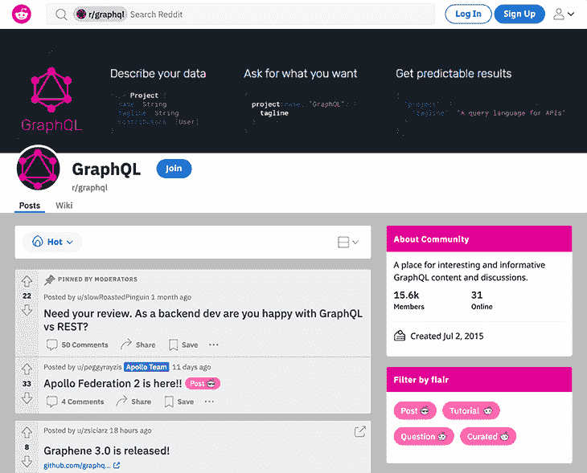
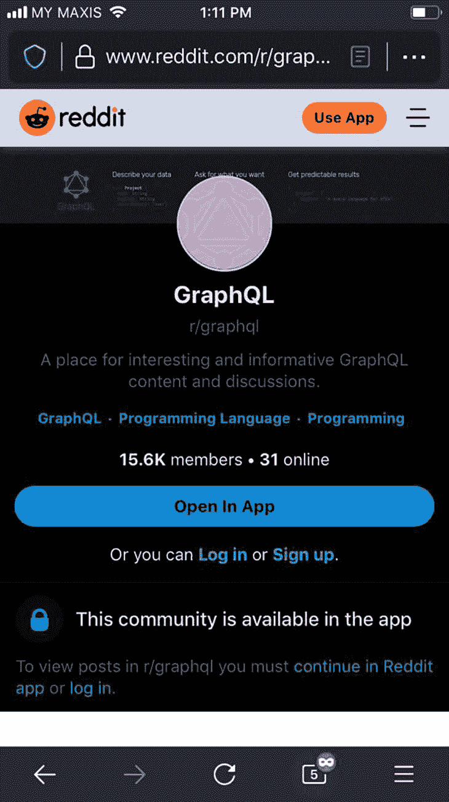
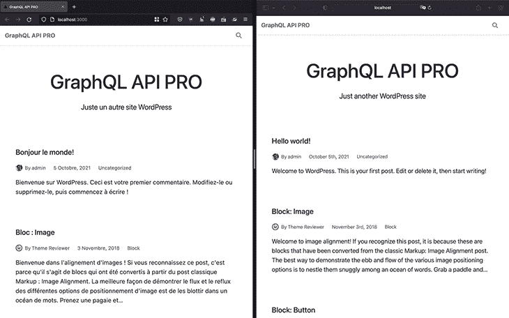
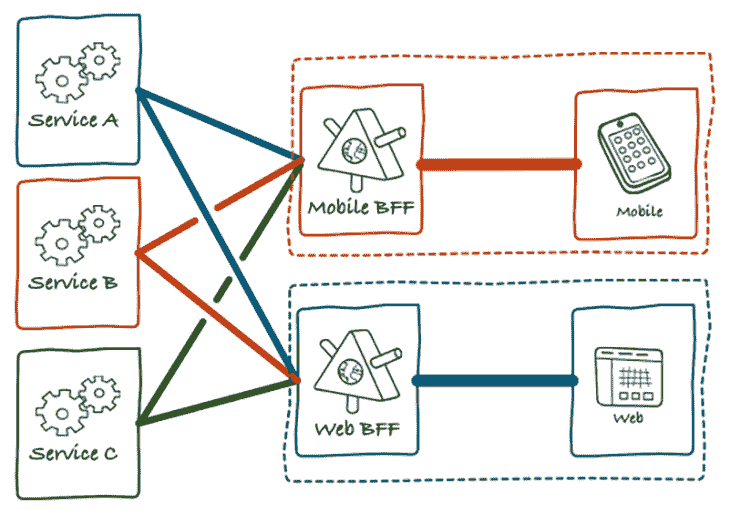
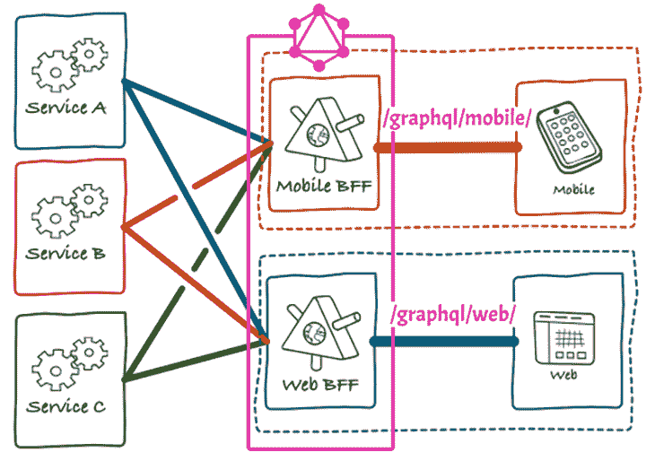
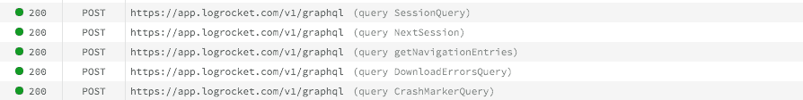

# 何时在 GraphQL 中使用多个端点

> 原文：<https://blog.logrocket.com/use-multiple-endpoints-graphql/>

GraphQL 是关于使用单个端点来查询数据的，但是有些情况下使用多个端点是有意义的，其中每个自定义端点公开一个自定义的模式。这允许我们通过简单地交换被访问的端点来为不同的用户或应用提供不同的行为。

在 GraphQL 中公开多个端点与实现 REST 不同——每个 REST 端点都提供对预定义资源或资源集的访问。但是对于多个 GraphQL 端点，每个端点仍将提供对其模式中所有数据的访问，使我们能够准确地获取我们需要的数据。

这仍然是正常的 GraphQL 行为，但是现在我们能够从不同的模式中访问数据。这种能力也不同于[模式拼接或联合](https://blog.logrocket.com/improve-microservice-architecture-graphql-api-gateways/)，后者使我们能够将几个数据源合并到一个单一、统一的图中。

对于多个端点，我们仍然要处理多个模式。每个模式都可以独立访问，并且独立于所有其他模式。相反，拼接和联合将所有模式组合成一个更大的模式，并且不同的模式可能需要彼此协调(例如，在冲突的情况下通过重命名类型或字段)。

暴露不同的模式可以让我们访问多个独立的图。GraphQL 创建者 [Lee Byron 解释了这在什么时候会有用](https://github.com/graphql/graphql-spec/issues/569#issuecomment-475670948):

> 一个很好的例子可能是，如果你的公司[原文如此]以一个产品为中心，并为该产品构建了一个 GraphQL API，然后决定用一个与原产品无关的新产品扩展到一个新的业务领域。对于这两个不相关的产品来说，共享一个 API 可能是一个负担，两个具有不同模式的独立端点可能更合适。
> 
> […]另一个例子是[…]您可能有一个单独的内部端点，它是外部 GraphQL API 的超集。脸书使用这种模式，有两个端点，一个内部端点和一个外部端点。内部工具包括可以与产品类型交互的内部工具。

在本文中，我们将对每个例子进行扩展，并探索公开多个 GraphQL 端点有意义的几个用例。

## 如何公开多个 GraphQL 端点

在我们探索用例之前，让我们回顾一下 GraphQL 服务器如何公开多个端点。

有一些 GraphQL 服务器已经附带了这个特性:

如果我们使用的 GraphQL 服务器不提供多个端点作为内置特性，我们可以尝试在我们的应用程序中对其进行编码。其思想是定义几个 GraphQL 模式，并根据请求的端点告诉服务器在运行时使用哪个模式。

当使用 JavaScript 服务器时，一种方便的方法是使用 [GraphQL Helix](https://github.com/contra/graphql-helix) ，它将 HTTP 请求的处理从 GraphQL 服务器中分离出来。使用 Helix，我们可以让 Node.js web 框架(如 Express.js 或 Fastify)处理路由逻辑，然后——根据请求的路径(即请求的端点)——我们可以向 GraphQL 服务器提供相应的模式。

让我们将基于 Express 的 [Helix 的基本示例](https://dev.to/danielrearden/building-a-graphql-server-with-graphql-helix-2k44)转换成一个多端点解决方案。以下代码处理单个端点`/graphql`:

```
import express from "express";
import { schema } from "./my-awesome-schema";

const app = express();

app.use(express.json());

app.use("/graphql", async (res, req) => {
  // ...
});

app.listen(8000);

```

为了处理多个端点，我们可以使用 shape `/graphql/${customEndpoint}`公开 URL，并通过路由参数获得自定义端点值。然后，基于请求的定制端点，我们识别模式——在本例中，从端点`/graphql/clients`、`/graphql/providers`和`/graphql/internal`识别:

```
import { clientSchema } from "./schemas/clients";
import { providerSchema } from "./schemas/providers";
import { internalSchema } from "./schemas/internal";

// ...

app.use("/graphql/:customEndpoint", async (res, req) => {
  let schema = {};
  if (req.params.customEndpoint === 'clients') {
    schema = clientSchema;
  } else if (req.params.customEndpoint === 'providers') {
    schema = providerSchema;
  } else if (req.params.customEndpoint === 'internal') {
    schema = internalSchema;
  } else {
    throw new Error('Non-supported endpoint');
  }
  // ...
});

```

一旦我们有了模式，我们就把它注入到 GraphQL 服务器中，正如 Helix 所期望的:

```
const request = {
  body: req.body,
  headers: req.headers,
  method: req.method,
  query: req.query,
};

const {
  query,
  variables,
  operationName
} = getGraphQLParameters(request);

const result = await processRequest({
  schema,
  query,
  variables,
  operationName,
  request,
})

if (result.type === "RESPONSE") {
  result.headers.forEach(({ name, value }) => {
    res.setHeader(name, value)
  });
  res.status(result.status);
  res.json(result.payload);
} else {
  // ...
}

```

不用说，不同的模式本身可以共享代码，因此在公开公共字段时不需要复制逻辑。

例如，`/graphql/clients`可以公开一个基本模式并导出其元素:

```
// File: schemas/clients.ts
export const clientSchemaQueryFields = {
  // ...
};

export const clientSchema = new GraphQLSchema({
  query: new GraphQLObjectType({
    name: "Query",
    fields: clientSchemaQueryFields,
  }),
});

```

并且这些元素可以导入到`/graphql/providers`的模式中:

```
// File: schemas/providers.ts
import { clientSchemaQueryFields } from "./clients";

export const providerSchemaQueryFields = {
  // ...
};

export const providerSchema = new GraphQLSchema({
  query: new GraphQLObjectType({
    name: "Query",
    fields: { ...clientSchemaQueryFields, ...providerSchemaQueryFields },
  }),
});

```

接下来，让我们探索多个 GraphQL 端点有意义的几个用例。我们将关注以下使用案例:

*   分别公开管理端点和公共端点
*   以更安全的方式限制对私人信息的访问
*   为不同的应用程序提供不同的行为
*   生成不同语言的网站
*   在发布用于生产之前测试升级的模式
*   支持 BfF 方法

## 分别公开管理端点和公共端点

当我们对公司的所有数据使用单个图表时，我们可以通过[设置访问控制策略](https://blog.logrocket.com/authorization-access-control-graphql/)来验证谁有权访问我们的 GraphQL 模式中的不同字段。例如，我们可以通过指令`@auth`将字段配置为只允许登录用户访问，并通过附加指令`@protect(role: "EDITOR")`允许具有特定角色的用户访问。

然而，如果软件有缺陷，或者团队不小心，这个机制[可能是不安全的](https://cwe.mitre.org/data/definitions/284.html)。例如，如果开发人员忘记将指令添加到字段中，或者只为 DEV 环境而不是 PROD 添加指令，那么每个人都可以访问该字段，从而带来安全风险。

如果字段包含敏感或机密的信息——特别是那些在任何情况下都不应该被非预期的参与者访问的信息——那么我们宁愿首先不在公共模式中公开这个字段，而只在只有团队可以访问的私有模式中公开。这种策略将保护我们的私人数据免受错误和疏忽的影响。

因此，我们可以创建两个独立的模式，管理模式和公共模式，并分别在端点`/graphql/admin`和`/graphql`下公开它们。

## 以更安全的方式限制对私人信息的访问

虽然我们将查看我在上面描述的示例，但这一部分也可以作为它的概括来阅读:这不仅适用于公共与管理场景，而且适用于一组用户绝对不能访问另一组用户的信息的任何情况。

例如，每当我们需要为不同的客户端创建定制的模式时，我们可以为它们中的每一个暴露一个定制的端点(`/graphql/some-client`、`/graphql/another-client`等)，这比让它们访问同一个统一的模式并通过访问控制来验证它们更安全。

这是因为我们可以通过 IP 地址轻松验证对这些端点的访问。下面的代码扩展了前面的示例，使用 Helix 和 Express 验证端点`/graphql/star-client`只能从客户端的特定 IP 地址访问:

```
import { starClientSchema } from "./schemas/star-client";

// Define the client's IP
const starClientIP = "99.88.77.66";

app.use("/graphql/:customEndpoint", async (res, req) => {
  let schema = {};
  const ip = req.ip
    || req.headers['x-forwarded-for']
    || req.connection.remoteAddress
    || req.socket.remoteAddress
    || req.connection.socket.remoteAddress;
  if (req.params.customEndpoint === 'star-client') {
    if (ip !== starClientIP) {
      throw new Error('Invalid IP');
    }
    schema = starClientSchema;
  }
  // ...
});

```

对于您的客户来说，知道他们只能从自己的 IP 地址访问终端的数据也让他们放心，他们的数据得到了很好的保护。

## 为不同的应用程序提供不同的行为

我们可以向访问同一数据源的不同应用程序授予不同的行为。

例如，我注意到当从桌面浏览器访问 Reddit 时，它产生的响应与从移动浏览器访问时不同。从桌面浏览器，无论我们是否登录，我们都可以直接可视化内容:



Accessing Reddit from a desktop browser

但是，从移动设备访问时，我们必须登录才能访问内容，我们鼓励使用应用程序:



Accessing Reddit from a mobile browser

这种不同的行为可以通过创建两个模式来提供，比如桌面和移动模式，并分别在`/graphql/desktop`和`/graphql/mobile`下公开它们。

## 生成不同语言的网站

假设我们想用不同的语言生成同一个站点。如果 GraphQL 被用作惟一的数据源，比如用 Gatsby 创建一个静态站点，那么当数据在数据源和应用程序之间传输时，我们可以翻译它。

事实上，我们并不真的需要多个端点来实现这个目标。例如，我们可以从环境变量`LANGUAGE_CODE`中检索语言代码，将该值注入 GraphQL 变量`$lang`，然后通过字段参数`translateTo`翻译帖子的`title`和`content`字段:

```
query GetTranslatedPost($lang: String!) {
  post(id: 1) {
    title(translateTo: $lang)
    content(translateTo: $lang)
  }
}

```

然而，翻译是一个跨领域的问题，对此[使用指令可能更合适](https://blog.logrocket.com/field-arguments-vs-directives-graphql/)。通过使用模式类型指令，查询可以不被注意到它将被翻译:

```
{
  post(id: 1) {
    title
    content
  }
}

```

然后，翻译逻辑被应用到模式上，通过[一个`@translate`指令](https://graphql-api.com/guides/directives/translate/)被添加到 SDL 中的字段:

```
directive @translate(translateTo: String) on FIELD

type Post {
  title @translate(translateTo: "fr")
  content @translate(translateTo: "fr")
}

```

(注意，指令参数`translateTo`是非强制性的，因此，当没有提供时，它使用通过环境变量`LANGUAGE_CODE`设置的默认值。)

既然语言被注入到模式中，我们就可以为不同的语言创建不同的模式，比如用`/graphql/en`表示英语，用`/graphql/fr`表示法语。

最后，我们指向应用程序中的每一个端点，以一种语言或另一种语言生成站点:



## 在发布用于生产之前测试升级的模式

如果我们想升级我们的 GraphQL 模式并让一组用户预先测试它，我们可以通过一个`/graphql/upcoming`端点公开这个新模式。此外，我们还可以公开一个`/graphql/bleeding-edge`端点，该端点不断地从 DEV 部署模式。

## 支持 BfF 方法

后端对前端(简称 BfF)是一种[方法，用于为不同的客户端](https://philcalcado.com/2015/09/18/the_back_end_for_front_end_pattern_bff.html)生成不同的 API，其中每个客户端“拥有”自己的 API，这允许它基于自己的需求生成最佳版本。

在这个模型中，自定义 BfF 是后端服务和其客户端之间的中间人:



This model can be satisfied in GraphQL by implementing all BfFs in a single GraphQL server with multiple endpoints, with each endpoint tackling a specific BfF/client (such as `/graphql/mobile` and `/graphql/web`):



## 结论

GraphQL 的诞生是作为 REST 的替代方案，专注于检索数据，没有欠挖或过挖，这使得它非常高效。实现这个目标的方法是公开一个端点，我们向其提供获取数据的查询。

在大多数情况下，公开单个端点可以很好地工作，但是当我们需要生成完全不同的模式来定制不同的客户端或应用程序时，可能就不够了。在这种情况下，公开多个端点，每个模式一个端点，可能更合适。

在本文中，我们探讨了不同的例子，说明这在什么情况下有意义，以及如何实现它。

## 监控生产中失败和缓慢的 GraphQL 请求

虽然 GraphQL 有一些调试请求和响应的特性，但确保 GraphQL 可靠地为您的生产应用程序提供资源是一件比较困难的事情。如果您对确保对后端或第三方服务的网络请求成功感兴趣，

[try LogRocket](https://lp.logrocket.com/blg/graphql-signup)

.

[](https://lp.logrocket.com/blg/graphql-signup)[https://logrocket.com/signup/](https://lp.logrocket.com/blg/graphql-signup)

LogRocket 就像是网络和移动应用的 DVR，记录下你网站上发生的每一件事。您可以汇总并报告有问题的 GraphQL 请求，以快速了解根本原因，而不是猜测问题发生的原因。此外，您可以跟踪 Apollo 客户机状态并检查 GraphQL 查询的键值对。

LogRocket 检测您的应用程序以记录基线性能计时，如页面加载时间、到达第一个字节的时间、慢速网络请求，还记录 Redux、NgRx 和 Vuex 操作/状态。

[Start monitoring for free](https://lp.logrocket.com/blg/graphql-signup)

.