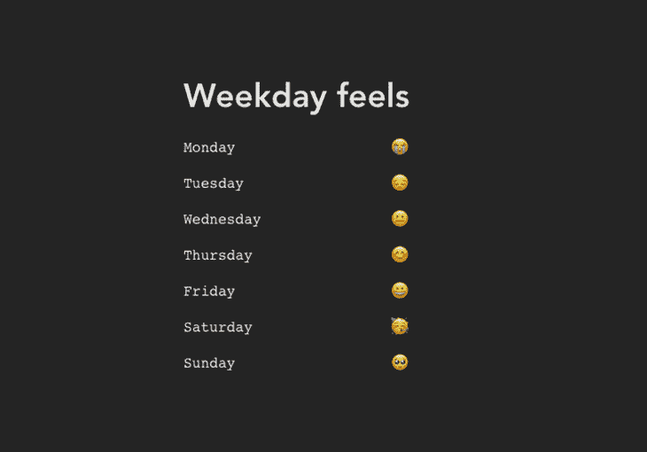
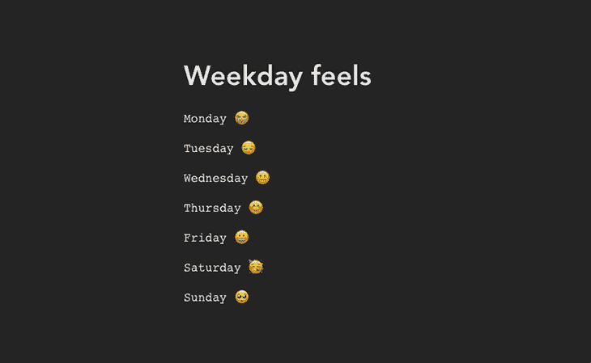
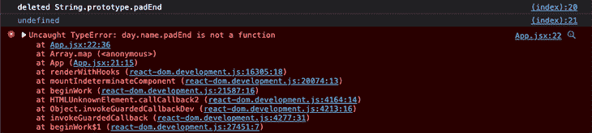

# 如何在 React app 中使用聚合填充

> 原文：<https://blog.logrocket.com/use-polyfills-react-app/>

你是否曾经想在 JavaScript 的新版本中使用一个闪亮的新特性，但由于浏览器兼容性而无法使用？也许你的团队想尝试 ES2015 的新功能，但因为很多浏览器还不支持它而无法实现？

如果以上任何一种情况引起了你的共鸣，那么很可能你已经使用了一个 [transpiler](https://en.wikipedia.org/wiki/Source-to-source_compiler) 来生成一个可以在大多数浏览器版本上运行的代码版本。这将允许您使用更新的功能，同时仍然支持广泛的浏览器版本。

然而，如果您只想使用少量的特性，transpiler 可能是多余的——它们中的一些会增加大量的开销，从而增加包的大小。在这种情况下，聚合填充可能会更好。

在本文中，我们将讨论如何在您的 React 应用程序中使用聚合填充，涵盖以下主题:

## 什么是聚合填料？

聚合填充允许您使用浏览器(或特定浏览器版本)不支持的功能，方法是使用支持的 API 添加模拟所需行为的回退。当你想使用像`String.padEnd`这样的 JavaScript 特性时，你可以使用 polyfill，而旧的浏览器不支持这种特性。

通过为还不支持它的浏览器提供一个后备，您可以在开发中使用这样的新特性，同时仍然发布保证在所有浏览器上运行的代码。

大多数主流浏览器都会定期更新，以支持新的 JavaScript 和 CSS 特性，但是很多人几乎不更新他们的浏览器，这就需要 transpilers 和 polyfills 了。

在一个理想的世界里，每个人都会在新特性发布后立即更新浏览器以支持新特性，我们不需要传输代码。然而，在那一天到来之前，我们需要支持旧版本的浏览器。

## 在 React 中使用 JavaScript polyfill:一个实际例子

让我们在 React 应用程序中使用`String.padEnd`实现一个非常简单的特性。

[`String.padEnd`](https://developer.mozilla.org/en-US/docs/Web/JavaScript/Reference/Global_Objects/String/padEnd) 是在 ECMAScript 2019 中与`String.padStart`一同发布的，目前支持各大主流浏览器的最新版本(我们不再谈论 Internet Explorer)。

但是，我们将添加一个 polyfill，使它能够在没有支持的旧版本上运行。首先，我们将编写 polyfill，然后看看如何使用专用的 polyfill 库来处理它。通过实现这两种方法，我们应该能更好地理解聚合填充的工作原理。

### 要实现的功能

让我们设想一个用户说，“我希望能够用表情符号查看一周中的每一天。工作日应以表格格式显示。



Saturdays are the best

这是一个非常简单的功能，我们利用`padEnd`函数在工作日及其对应的表情符号之间生成相等的空间，以[模拟一个表格视图](https://www.samanthaming.com/tidbits/69-display-string-in-tabular-format-with-padend/)。这是一个愚蠢的特性，但是希望对于学习 polyfills 如何工作是足够的。

## 项目设置

首先，克隆[这个包含 starter React 和 Vite 模板](https://github.com/ovieokeh/react-polyfill-tutorial)的存储库。

打开您的终端并运行以下命令来获得一个现成的模板。

```
git clone https://github.com/ovieokeh/react-polyfill-tutorial.git

```

导航到新创建的文件夹。

```
cd react-polyfill-tutorial

```

安装所需的依赖项并启动应用程序。

```
npm install
npm run dev

```

### 我们如何模拟旧版本的浏览器

下载旧版本的浏览器来模拟没有`String.padEnd`功能会很麻烦，正因为如此，我在 HTML 中包含了一个从`String`原型中删除`padEnd`的脚本。要查看该脚本，请打开`index.html`文件。

你应该看到下面的设计:



Our weekday list as displayed in simulated older browsers

## 从头开始编写聚合填充

现在我们已经运行了项目，让我们实现表格设计。

在首选编辑器中打开`src/App.jsx`文件，更新第 29 行，用 23 个空格填充`day.name`属性。

```
// App.jsx
// ... line 28
const dayName = day.name.padEnd(23);
// ... line 30

```

现在，保存您的更改并在浏览器中查看结果。您将会注意到浏览器控制台中的一个错误，因为我们正在模拟没有`String.padEnd`功能的浏览器。



The error in our browser console as displayed in our simulated older browser

我们可以通过编写 polyfill 来解决这个问题。注意在`App`组件上面有一个注释(repo 的第 13 行)。让我们像这样添加一些代码:

```
// ... line 13
if (!String.prototype.padEnd) {
  console.log("padEnd is not supported. Using polyfill.");

  String.prototype.padEnd = function padEnd(targetLength, padString) {
    targetLength =
      typeof targetLength !== "number" || targetLength < 0 ? 0 : targetLength;
    padString = String(padString || " ");

    if (this.length > targetLength) return String(this);

    targetLength = targetLength - this.length;
    if (targetLength > padString.length) {
      padString += padString.repeat(targetLength / padString.length);
    }

    return String(this) + padString.slice(0, targetLength);
  };
}
// ... line 32

```

聚合填充的内容没有我们为浏览器中可能不存在的功能提供后备这一事实重要。(当然我绝对推荐你通读。)回退实现了`String.padEnd` 的 [ECMAScript 规范。](https://tc39.es/proposal-string-pad-start-end/)

总之，我们添加了一个检查来查看当前浏览器运行时是否支持`padEnd`特性，如果不支持，就提供一个回退来实现官方 ECMAScript 规范中概述的行为。

如果您导航回浏览器，您应该会看到错误已经消失，设计看起来就像我们期望的那样。

在这个阶段，你的代码应该是这样的:

使用多填充库

## 现在我们已经手动编写了 polyfill，希望您能对 poly fill 的工作原理有更多的了解。然而，与编程中的大多数事情一样，已经有一些专门用于提供 polyfills 的库。

您可以使用包含聚合填充集合的库来代替检查特征是否存在，然后手动添加聚合填充。

让我们探索使用 polyfill 库的两种主要方式；

从 CDN 加载

1.  从 NPM 包裹装载
2.  从 CDN 加载

### 从 CDN 加载聚合填充也有多种选择。最流行的可以说是 [Polyfill.io](https://polyfill.io/v3/) ，所以我们就以它为例。但是，这个概念仍然适用于任何其他带有 CDN URL 的 polyfill 库。

打开`index.html`文件，并在文件底部包含一个`<``script``>`标签。

我们在脚本标签上使用`defer`属性来防止它阻止 React 脚本运行。点击阅读更多关于`defer`属性[的信息。](https://www.w3schools.com/tags/att_script_defer.asp)

```
// ... line 16
<script defer src="https://polyfill.io/v3/polyfill.min.js?features=String.prototype.padEnd|always"></script>
// ... line 18

```

我们包含了`String.prototype.padEnd`特性的[多填充](https://polyfill.io/v3/api/#request)并传递了`|always`标志。这将迫使 CDN 返回 polyfill，因为只有不支持`padEnd`特性的浏览器才会获得一个 JavaScript 包(记住，大多数主流浏览器已经支持`padEnd`，所以如果没有`|always`标志，polyfill 将不会被返回)。

现在，您可以返回到`App.jsx`文件并删除我们之前添加的手动多填充。刷新页面，确认应用程序仍然运行良好。如果您检查控制台的日志，您会注意到我们仍然在模拟删除本机`String.prototype.padEnd`函数。

尽管我们在本例中使用了 Polyfill.io，但该概念适用于任何具有 CDN 版本的 Polyfill 库。

在这个阶段，你的代码应该是这样的。

从 npm 包加载

使用多填充库的另一种方法是通过`npm`。您可以从`npm`安装一些包，这些包允许您为 JavaScript 特性提供多种填充。

### 到目前为止最流行的是 [`core-js`](https://www.npmjs.com/package/core-js) ，所以我们将在这个例子中使用它，但是我想大多数其他库应该遵循类似的惯例。

打开项目根目录下的终端，安装`core-js`包，如下所示:

安装好包后，我们可以包含我们需要的特定 polyfill，在本例中，它是`String.prototype.padEnd`，因为我们正在模拟一个没有对`padEnd`的本地支持的运行时。

打开`App.jsx`应用程序，在文件的顶部，包括多填充的导入。

```
npm i core-js

```

现在，我们可以安全地从前面的部分中删除 CDN 导入。打开`index.html`文件，删除`polyfill.io`导入的`script`标签。

在这个阶段，你的代码应该是这样的。

```
import "core-js/actual/string/pad-end";
// rest of code

```

Now we can safely remove the CDN import from the previous section. Open the `index.html` file and delete the `script` tag for the `polyfill.io` import.

导航到浏览器，并确认代码仍如我们预期的那样运行。

结论

我们已经用三种不同的方式成功地填充了`String.prototype.padEnd`特征。到目前为止，无论您的项目结构如何，您都应该对聚合填充以及如何使用它们有了很好的理解。

## Polyfills 不是您通常直接使用的东西，这要归功于无数可以自动处理编译代码的构建工具。然而，了解这些机器人在幕后做什么总是好的。毕竟，他们抢走我们的工作只是时间问题。

如果你一路跟随教程，你就是牛逼的⭐️.

使用 LogRocket 消除传统反应错误报告的噪音

是一款 React analytics 解决方案，可保护您免受数百个误报错误警报的影响，只针对少数真正重要的项目。LogRocket 告诉您 React 应用程序中实际影响用户的最具影响力的 bug 和 UX 问题。

## 自动聚合客户端错误、反应错误边界、还原状态、缓慢的组件加载时间、JS 异常、前端性能指标和用户交互。然后，LogRocket 使用机器学习来通知您影响大多数用户的最具影响力的问题，并提供您修复它所需的上下文。

[LogRocket](https://lp.logrocket.com/blg/react-signup-issue-free)

关注重要的 React bug—[今天就试试 LogRocket】。](https://lp.logrocket.com/blg/react-signup-issue-free)

[ ](https://lp.logrocket.com/blg/react-signup-general) [  ](https://lp.logrocket.com/blg/react-signup-general) [LogRocket](https://lp.logrocket.com/blg/react-signup-issue-free)

automatically aggregates client side errors, React error boundaries, Redux state, slow component load times, JS exceptions, frontend performance metrics, and user interactions. Then LogRocket uses machine learning to notify you of the most impactful problems affecting the most users and provides the context you need to fix it.

Focus on the React bugs that matter — [try LogRocket today](https://lp.logrocket.com/blg/react-signup-issue-free).