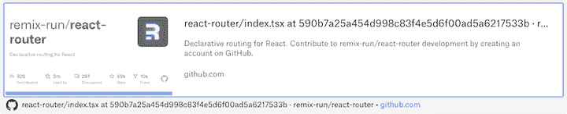

# 如何用 useSearchParams 保持状态

> 原文：<https://blog.logrocket.com/use-state-url-persist-state-usesearchparams/>

React `useState`钩子是在 [React](https://blog.logrocket.com/tag/react/) 中的组件上下文中持久化状态的一个好方法。这篇文章演示了一个简单的 React 钩子，它在 URL 查询字符串中存储状态，构建在 React Router `useSearchParams`钩子之上。

## `useState`钩子

[挂钩](https://blog.logrocket.com/a-guide-to-usestate-in-react-ecb9952e406c/)的用法如下:

```
const [greeting, setGreeting] = useState('hello world');

// ....

setTotal('hello John'); // will set greeting to 'hello John'

```

但是，使用`useState`有一个缺点；这种状态不是持久的，也不是可共享的。因此，如果你想让其他人看到你在应用程序中看到的东西，你就要依赖他们执行让你的应用程序进入当前状态的相同操作。

这样做既费时又容易出错，所以如果有一种简单的方法来共享状态不是很好吗？

## 有状态的 URL

在用户之间共享状态的一种有效方法是使用 URL，而不需要后端持久化。URL 可以包含路由和查询字符串/搜索参数形式的所需状态。搜索参数特别强大，因为它们完全是通用的和可定制的。

多亏了 [`URLSearchParams` API](https://developer.mozilla.org/en-US/docs/Web/API/URLSearchParams) ，不需要往返服务器就可以操作查询字符串。这是一个我们可以建立的基础。只要没有超过 URL 限制(大约 2000 个字符，我们就可以自由地在 URL 中保持状态。

考虑一下:
【https://our-app.com/?greeting=hi】
上面的 URL 存储了一个单独的状态:`greeting`。

现在考虑:【https://our-app.com】[？greeting=hi & name=john](https://our-app.com/?greeting=hi&name=john)

## `useSearchParams`钩子

如果你正在使用 React， [React 路由器](https://blog.logrocket.com/react-router-hooks-cleaner-components/)使得 URL 中的消费状态，特别是以查询字符串或搜索参数的形式，变得简单明了。这是通过 [`useSearchParams`挂钩](https://reactrouter.com/docs/en/v6/hooks/use-search-params)实现的:

```
import { useSearchParams } from "react-router-dom";

const [searchParams, setSearchParams] = useSearchParams();

const greeting = searchParams.get('greeting');

// ...

setSearchParams({ 'greeting': 'bonjour' }); // will set URL like so https://our-app.com?greeting=bonjour - this value will feed through to anything driven by the URL

```

这是本地持久化状态和以可共享方式持久化状态的一个很好的机制。

这种方法的一个显著优点是它不需要发送到服务器。它只是使用了像`URLSearchParams` API 这样的浏览器 API。更改查询字符串参数完全在本地即时发生。

## `useSearchParamsState`钩子

`useSearchParams`钩子不做的是维护其他查询字符串或搜索参数。

如果我们在您的应用程序中维护多个状态，这可能意味着多个查询字符串或搜索参数。那么，非常有用的是一个钩子，它允许我们在不丢失其他状态的情况下更新状态。

此外，如果我们不必先获取`searchParams`对象，然后再操纵它，那就太好了。我们的`useSearchParamsState`挂钩时间到了:

```
import { useSearchParams } from "react-router-dom";

export function useSearchParamsState(
    searchParamName: string,
    defaultValue: string
): readonly [
    searchParamsState: string,
    setSearchParamsState: (newState: string) => void
] {
    const [searchParams, setSearchParams] = useSearchParams();

    const acquiredSearchParam = searchParams.get(searchParamName);
    const searchParamsState = acquiredSearchParam ?? defaultValue;

    const setSearchParamsState = (newState: string) => {
        const next = Object.assign(
            {},
            [...searchParams.entries()].reduce(
                (o, [key, value]) => ({ ...o, [key]: value }),
                {}
            ),
            { [searchParamName]: newState }
        );
        setSearchParams(next);
    };
    return [searchParamsState, setSearchParamsState];
}

```

上面的钩子可以粗略地认为是`useState<string>`，但是在 URL 中存储状态。
我们来想想它是如何工作的。初始化时，挂钩接受两个参数:

*   `searchParamName`:保存状态的查询字符串参数的名称
*   `defaultValue`:查询字符串中没有值时的回退值

然后吊钩继续缠绕`useSearchParams`吊钩。它向`searchParams`询问所提供的`searchParamName`，如果不存在，则返回到`defaultValue`。

`setSearchParamsState`方法定义看起来有些复杂，但本质上它所做的就是获取现有搜索参数的内容，并为当前属性应用新的状态。

可能值得在这里暂停一下，观察一下这个实现中隐藏的一个观点:同一个搜索参数有多个值实际上是有效的。虽然这是可能的，但这种情况很少使用；这种实现只允许任何给定参数有一个值，因为这是非常有用的行为。

有了这些，我们就有了一个可以这样使用的钩子:

```
const [greeting, setGreeting] = useSearchParamsState("greeting", "hello");

```

上面的代码返回一个`greeting`值，这个值是从`greeting`搜索参数中得到的。它还返回一个`setGreeting`函数，允许我们设置`greeting`值。这和`useState`是同一个 API，所以反应用户应该感觉很习惯。太棒了。

## 表演:`useSearchParamsState`勾手 vs`useSearchParams`勾手

在这一点上，你可能想知道“为什么我们不总是使用`useSearchParamsState`钩子？”归结起来只有一个原因:性能。`useSearchParamsState`钩比`useState`钩慢。我们来想想为什么。

如果我们使用的是`useState`钩子，那么最终在代表我们应用程序的程序内部会有一个变量被更新。这是内部状态。然而，对于`useSearchParamsState`钩子来说，情况略有不同。

正如我们已经看到的，React 路由器中的`useSearchParamsState`钩子是建立在`useSearchParams`钩子之上的。如果我们看看钩子的[实现，我们可以看到它依赖于各种浏览器 API，比如`location`和`History`:](https://github.com/remix-run/react-router/blob/590b7a25a454d998c83f4e5d6f00ad5a6217533b/packages/react-router-dom/index.tsx#L785)



这里的结果是对于我们的应用程序来说,`useSearchParamsState`钩子的状态是`external`。它可能不会有这种感觉，因为我们不必设置数据库或 API，它的状态是外部的。状态存在于浏览器的 API 中，随之而来的是性能损失。下面是每次我们改变状态时发生的情况:

*   React 路由器中的`useSearchParams`钩子调用`History` API
*   浏览器更新 URL
*   运行在应用程序根的 React 路由器实例检测到`location.search`的变化，并为应用程序显示一个新值
*   应用程序中依赖于该值的代码会做出反应

以上比仅仅调用`useState`和依赖局部变量要慢。然而，它并没有慢得多。我一般不会有问题，因为现在的浏览器速度非常快。尽管如此，如果您打算编写尽可能高性能的代码，您可能希望避免这个钩子。

任何涉及外部 API 的东西，即使是存在于浏览器中的 API，也会比局部变量慢。我认为这是一个重要因素的应用程序很少，但它仍然值得考虑。

## 在您的站点中持久化查询字符串

现在，我们有了这个令人兴奋的机制，它允许我们在 URL 中存储状态，因此，通过向某人发送 URL 可以轻松地共享状态。

同样有用的是一种在我们的站点中导航而不丢失状态的方法。假设我在 URL 中选择并存储了一个日期范围。当我从一个屏幕点击到另一个屏幕时，我想坚持这一点——我不想在每个屏幕上重新选择日期范围。

我们如何做到这一点？事实证明这很容易。我们需要的只是`useLocation`钩子和相应的`location.search`属性。它表示查询字符串，所以每次我们呈现一个链接时，我们只需像这样包含它:

```
const [location] = useLocation();

return (<Link to={`/my-page${location.search}`}>Page</>)

```

现在，当我们浏览我们的站点时，这种状态将被保持。

## 结论

在这篇文章中，我们创建了一个`useSearchParamsState`钩子，它允许为了共享的目的将状态保存到 URL 中。

* * *

### 更多来自 LogRocket 的精彩文章:

* * *

## 使用 LogRocket 消除传统反应错误报告的噪音

[LogRocket](https://lp.logrocket.com/blg/react-signup-issue-free)

是一款 React analytics 解决方案，可保护您免受数百个误报错误警报的影响，只针对少数真正重要的项目。LogRocket 告诉您 React 应用程序中实际影响用户的最具影响力的 bug 和 UX 问题。

[ ](https://lp.logrocket.com/blg/react-signup-general) [  ](https://lp.logrocket.com/blg/react-signup-general) [LogRocket](https://lp.logrocket.com/blg/react-signup-issue-free)

自动聚合客户端错误、反应错误边界、还原状态、缓慢的组件加载时间、JS 异常、前端性能指标和用户交互。然后，LogRocket 使用机器学习来通知您影响大多数用户的最具影响力的问题，并提供您修复它所需的上下文。

关注重要的 React bug—[今天就试试 LogRocket】。](https://lp.logrocket.com/blg/react-signup-issue-free)