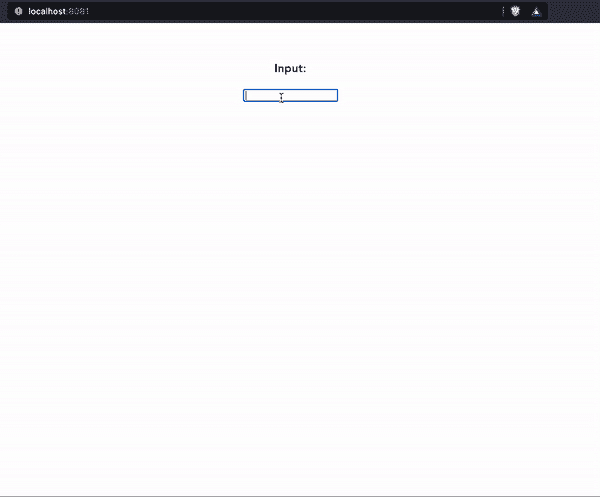

# 使用 Vue.js 事件发射器修改组件数据

> 原文：<https://blog.logrocket.com/use-vue-js-event-emitters-modify-component-data/>

***编者按:**本文更新于 2022 年 4 月 4 日，演示使用 Vue.js v.3 和 Composition API 修改组件数据。*

本文将演示如何使用事件发射器在 [Vue.js](https://blog.logrocket.com/how-to-make-your-components-dynamic-in-vue-js/) 中将数据及其状态从子组件传递到父组件。我们将从回顾通过组件传递数据开始，然后进入我们的演示。我们的演示将涵盖以下内容:

## 开始之前…

这篇文章适合所有阶段的开发者，包括初学者。在阅读本文之前，您应该已经具备了以下几点:

*   [Node.js](https://blog.logrocket.com/web-analytics-with-node-js/) 版本 10.x 及以上安装。您可以使用下面的命令来验证您是否已经准备好了:
    node -v
*   代码编辑器——我强烈推荐 VS 代码
*   Vue 的最新版本，全球安装在您的机器上
*   Vue CLI 3.0，安装在您的机器上

如果您的计算机上没有 Vue CLI，请使用以下命令安装它:

```
npm install -g @vue/cli

```

接下来，创建一个新项目`event-emitters`，如下所示:

```
vue create event-emitters

```

确保在创建应用程序时选择 Vue 3。

然后，将 cd 放入应用程序文件夹，并使用以下命令启动应用程序:

```
cd event-emitters

```

```
npm run serve

```

在本文中，我们将使用[C](https://vuejs.org/guide/extras/composition-api-faq.html)组合 API 来演示如何通过事件向父组件发送数据。这允许我们在事件触发时将某些数据传递给父组件，例如`onClick`或`keyup`。

## 通过组件传递数据

为了将数据值从父组件(如`app.vue`)传递到 app 组件内部的子组件(如嵌套组件)，Vue.js 为我们提供了一个名为 props 的平台。道具是我们可以在组件上注册的自定义属性。使用 props，我们可以在父组件中定义数据，给它一个值，然后将该值传递给一个 prop 属性，该属性可以在子组件中被向下引用。

这篇文章将展示这个过程的反向过程。在本教程中，我们将从子组件更新父组件中的数据值。我们将使用 emit 构造来处理事件发射和数据更新。

## 演示:将数据从子组件传递到父组件

我们将介绍从子组件发出事件的过程，在父组件上设置监听以便传递来自子组件的数据，然后最终更新数据值。

入门指南

在文件夹中，您会发现两个组件:`parentComponent.vue`和`childComponent.vue`，根组件是`app.vue`文件。您的`childComponent.vue`文件应该如下所示:

```
<template>
  <input v-model="inputValue" @keyup="inputChange"/>
</template>
<script>
import {ref} from "vue"
export default {
  name: "ChildComponent",
  setup(props, context) {
    const inputValue = ref("")
    const inputChange = ()=> {
      context.emit("newValue", inputValue.value);
    };
    return {
      inputChange,
      inputValue
    };
  },
  emits:["newValue"]
};
</script>

```

### 设置发射器

对于这个演示，我们希望将子组件的行为传递给父组件，这样在单击时，嵌套在父组件中的每个标题都会改变。

为此，我们需要创建一个发射器，该发射器将在子组件中发出一个事件，父组件可以监听该事件并做出反应。这与组件的事件侦听器逻辑相同。

我们有一个绑定到`inputValue`的`input`元素。接下来，我们使用`@keyup`事件来触发我们的`inputChange`函数。我们使用这个函数通过`inputValue`实时发出我们的输入值。为此，我们将`context`传递到我们的`setup`中，并发出如下数据:

```
context.emit("newValue", inputValue.value);

```

通过这样做，我们将事件命名为`newValue`，并将其添加到我们的`emits`数组中:

```
emits:["newValue"]

```

现在，我们可以使用`newValue`将输入值传递给`keyup`上的父组件。

### 侦听发出的事件

事件创建后要做的下一件事是监听它并做出响应。

我们去看看你的`parentComponent.vue`文件。它应该是这样的:

```
<template>
  <div>
    <h3>Input: {{ title }}</h3>
    <child-component @newValue="changeTitle" />
  </div>
</template>

<script>
import ChildComponent from "./childComponent.vue";
import {ref} from "vue"
export default {
  name: "ParentComponent",
  components: {
    ChildComponent
  },
  setup() {
    const title = ref("");
    const changeTitle = (newTitle) => {
      console.log("fire")
      title.value = newTitle;
    };
    return { title, changeTitle };
  },
};
</script>

```

在上面的代码中，我们将`child-component`导入到父组件中。

然后，我们添加`@newValue="changeTitle"`来告诉组件监听子组件的变化，并用新数据触发我们的`changeTitle`。

### 更新数据值

接下来，我们使用`ref`声明`title`,并在用户输入时将新的子输入数据分配给`title`:

```
const title = ref("");
const changeTitle = (newTitle) => {
      console.log("fire")
      title.value = newTitle;
    };

```

最后，我们使用`title`在父组件中显示用户输入。

```
<h3>Input: {{ title }}</h3>

```

值得注意的是，当数据通过发射器传递到父组件时，嵌套在父组件中的任何组件中的数据也会重新呈现和更新。

如果你从一开始就关注这篇文章，你可以下载或者用 VS 代码克隆演示项目。完成项目的演示如下所示:



## 结论

希望本文向您介绍了在 Vue 中使用带有发射器的事件的另一个有趣的方面:在一个组件中创建一个事件，在另一个组件中监听并响应它。这可以有许多用例，将真正有益于您的工作流程。编码快乐！

## 像用户一样体验您的 Vue 应用

调试 Vue.js 应用程序可能会很困难，尤其是当用户会话期间有几十个(如果不是几百个)突变时。如果您对监视和跟踪生产中所有用户的 Vue 突变感兴趣，

[try LogRocket](https://lp.logrocket.com/blg/vue-signup)

.

[](https://lp.logrocket.com/blg/vue-signup)[https://logrocket.com/signup/](https://lp.logrocket.com/blg/vue-signup)

LogRocket 就像是网络和移动应用程序的 DVR，记录你的 Vue 应用程序中发生的一切，包括网络请求、JavaScript 错误、性能问题等等。您可以汇总并报告问题发生时应用程序的状态，而不是猜测问题发生的原因。

LogRocket Vuex 插件将 Vuex 突变记录到 LogRocket 控制台，为您提供导致错误的环境，以及出现问题时应用程序的状态。

现代化您调试 Vue 应用的方式- [开始免费监控](https://lp.logrocket.com/blg/vue-signup)。