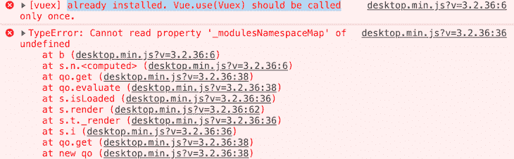

# 可以用 Vue.js 做通用 JavaScript 库吗？- LogRocket 博客

> 原文：<https://blog.logrocket.com/use-vue-js-general-purpose-javascript-library/>

我认为现在大多数在项目中使用 Vue.js 的人都在使用它来创建单页应用程序(spa)，页面内容由 Vue 生成，或者使用 Vue Router 来构建整个网站，为子页面创建动态 URL，可能还会使用 Nuxt.js 进行服务器端渲染。

他们的 Vue 项目附带了一个预打包的系统，包括 Vue.js 及其插件，构建它们，根据需要传输它们，并生成一个整洁的包，准备在生产中部署。人们忘记了，你也可以在网页上直接包含 Vue.js，以处理分散在普通 HTML 页面中的小电抗组件。

## 为什么要用 Vue 做通用库？

Vue.js 是如此的小巧实用——用它可以轻松快捷地制作复杂的东西——以至于你可以把它当作一个通用库，就像过去使用 jQuery 一样(如果你想知道，不，[你不应该在 2020 年再使用 jQuery](https://blog.logrocket.com/the-history-and-legacy-of-jquery/))。

Vue 可以很容易地添加到页面中，重量很轻(在撰写本文时只有 33kB)，并且可以用来控制现有的 HTML 以添加反应行为，即使您的 HTML 一开始就不是为这样做而设计的。它可以很容易地改造成现有的网站。

在我的公司，我们有时只对页面中的特定组件使用它。例如:

*   需要高级用户交互的任何地方
*   每当您需要跟踪用户输入的一组复杂数据时(应用程序状态)
*   当您需要经常从 web 服务更新数据时
*   当您需要执行复杂的动画并且想要轻松地维护状态时

一般来说，当我们想要创建简单的东西时，我们的经验法则是使用普通的 JavaScript，比如:

*   图像传送带
*   视频播放器
*   动态菜单
*   滚动条
*   标准表格

但是，一旦我们想要创建一个包含大量动画和数据/状态的复杂组件，我们往往会转向 Vue.js。后者的一些示例可能是:

*   交互式日历
*   金融债券
*   复杂表单
*   互动动画
*   任何需要跟踪一组复杂的用户偏好或数据的事情

## 使用 Vue 的优点和缺点

有了 Vue，你还可以发现许多插件已经支持许多复杂的 UX 行为和模式。与普通 JavaScript 相比，它的优势与使用 Vue 是一样的。首先，您可以拥有一个独立的组件，它的所有编程和表示逻辑都在同一个组件中。vue 文件，就像你使用 Web 组件一样。

这比将 HTML、JavaScript 和 SASS/CSS 放在不同目录的三个独立文件中要方便得多。这不仅简化了您的开发，还提高了可重用性。如 [Vue 手册](https://vuejs.org/v2/guide/single-file-components.html)中所述，“关注点分离不等于文件类型分离。”

您也已经有了一个组件脚手架，在组件生命周期中为主要状态预建了钩子，比如创建、安装、更新和销毁。

Vue 为你提供了一个独立的命名空间来放置你所有的属性和方法，它与全局环境相隔离，你可以获得反应式库的所有渲染速度优势。

当然，在用 vanilla JavaScript 做的项目中引入 Vue.js 也有一些缺点，其中之一就是对 Vue 的一般性熟悉:反应性的概念和 Vue 的内部结构一开始并不是那么容易掌握。您还必须在 webpack(或您选择使用的任何捆绑器)上的前端捆绑例程中添加一个新的构建过程。

您可能还需要做一些额外的工作来让组件的内容在搜索引擎上被索引。如果你正在构建一个交互式组件，而不是你的页面的主要文本内容，这应该不是一个大问题，因为你需要被索引。如果你需要更多关于这件事的信息，你可以阅读这篇文章

## 如何将 Vue.js 集成到您现有的项目中

您可以非常容易地将 Vue.js 集成到现有的 HTML 页面中。基本上有两种方法:

### 1.逐个创建和添加单个组件

您可以将 Vue.js 包含在来自 [Cloudflare](https://cdnjs.cloudflare.com/ajax/libs/vuex/3.1.1/vuex.min.js) 、 [Unpkg](https://unpkg.com/vuex@3.1.2/dist/vuex.js) 或任何其他代码 CDN 的`script`标签中，在 JavaScript 文件中定义您自己的组件，并将其当场添加到您页面的特定部分。你只需要使用合适的标签，Vue 就会把你的组件插入到它的位置。以下是组件的示例模板:

```
// Create a component called <editable-text>
Vue.component('editable-text', {
  data: function () {
    return {
      message: "Change me"
    }
  },
  template: `<div><p>Message is: {{ message }}</p>
<input v-model="message" placeholder="edit me" /></div>`
})

// activate Vue on the <div> that contains the component
new Vue({ el: '#components-demo' })
```

下面是如何将它插入到 HTML 中:

```
<div id="components-demo" class="components-demo">
    <h3>Here is some content generated with Vue</h3>
    <editable-text></editable-text>
</div>
```

您可以为几个单独的组件这样做，每个组件都有自己单独的 Vue 实例。您可以在下面的笔中看到使用这种技术创建的两个不同组件的示例(请记住，Vue.js 已经包含在使用 CodePen 的库包含设置的笔中):

在 [CodePen](https://codepen.io) 上查看包含 Vue.js 组件的笔[——创建单个组件](https://codepen.io/paolomioni/pen/XWbbmKz)由 Paolo Mioni([@ paolomioni](https://codepen.io/paolomioni))
。

### 2.激活整个页面(或站点中的所有页面)上的 Vue

如果您重复使用几个组件，并且希望将它们包含在页面上的任何地方，或者您的网站中的任何页面上，您可以全局注册所有组件，并在包含所有页面内容的`<div>`上激活 Vue(或者您希望放置动态组件的页面的指定部分)。

然后，您可以使用标签在页面的 HTML 中的任何位置包含各种组件，并向每个组件实例传递其自己的自定义属性。这是一支笔，展示你如何做到这一点:

查看你页面中包含 Vue.js 组件的笔[——在页面任意位置添加组件](https://codepen.io/paolomioni/pen/XWbbbaj)作者 Paolo Mioni([@ paolomioni](https://codepen.io/paolomioni))
在 [CodePen](https://codepen.io) 。

如果你想保持你原来的 HTML 结构，但是在它的部分内容上洒上一些“Vue 魔法”,这是非常方便的。您只需要在适当的位置添加组件，Vue 会在您加载之后为您完成剩下的工作。

## 何时不使用 Vue.js 作为通用库

如果你能完全控制你正在构建的站点/应用程序，并且在可预见的将来你的代码不需要与第三方组件/软件一起运行，那么使用 Vue.js 就像使用 jQuery 一样非常好。

但是，如果您正在构建一个需要包含在几个站点中的小部件，或者您正在构建一个需要与由单独的开发团队创建的代码一起运行的应用程序，您应该在选择 Vue.js 作为您的基础框架之前进行分析。

### 问题是

将 Vue.js 用作通用库的一个大问题是，让两个不同版本的 Vue.js 在同一个页面上工作可能会有问题。

我描述的问题不是当有人在同一个页面中使用两个或更多 Vue.js 的实例时——你可以很容易地做到这一点而不会发生冲突——而是当有人使用两个完全不同的版本时，比如 Vue 2.5 和 Vue 2.6。

这种情况不会发生在每个人身上，但在以下情况下可能会出现这种问题:

1.  在拥有独立开发团队的大型网站上，他们经常使用不同的工具/部件/组件，需要在同一个页面上运行。有人在这些小部件中的一个上使用 Vue.js，而另一个人——拥有完全不同的开发流程、不同的构建工具，甚至可能是不同的代码库——决定他们需要使用 Vue.js 来完成部分工作，不要告诉/询问任何人，并选择不同的版本。
2.  从事同一个项目的两个不同的开发人员决定都采用 Vue.js，不告诉对方或他们的首席开发人员，并在某个时候以代码问题告终。
3.  有人正在开发一个需要作为代码片段包含在第三方网站中的小部件，他们正在使用 Vue.js。该网站已经在使用 Vue.js，但它是一个不同的版本。

我的是第一例。有人在一个网站的主要 JavaScript 代码中包含了他们自己版本的 Vue.js，我的团队和另一个团队开始在我们自己的 Vue.js 应用程序上遇到大问题(请注意，是在临时环境中，而不是在生产环境中),这两个应用程序在过去几年中一直在各自独立的页面上愉快地运行。

### 症状

我的团队在共享的登台环境中发布了我们的应用程序之后，首先注意到了这个问题。我们的一些链接正在消失:我们有一些带有 CTA 的按钮，一旦它们被激活，就会突然变空。共同点是这些按钮包含用`<router-link>`构建的内部链接。

我们首先将这个问题归因于某个未知的 webpack 编译问题，可能是在我们没有注意到编译日志中的警告的情况下编译不好。我亲自重新构建了应用程序并重新加载(第二天，如果我没记错的话)，问题神奇地消失了。

我们松了一口气，因为我们面对的错误没有存在的理由。正在消失的链接是 Vue 路由器中正常路径的正常链接，根本没有什么新奇的事情发生，代码在我们的开发环境中工作得非常好。以下是其中一个链接的代码:

```
<router-link
  v-if="hasCars"
  v-link-tracking="'cta:inventory:view-result'"
  :to="{ name: 'search-results', query: linkQuery }">
  {{ this.$i18n('search-form-summary-go-to-results') }}
</router-link>
```

直到几个星期后，这个问题才再次出现，出现了完全相同的症状。顺便说一下，浏览器控制台中没有生成错误。一切都在悄悄地失败。

确信这次我们的构建是正确的，我做了另外几个测试，并断定问题一定是与运行在登台环境中的其他代码发生了某种冲突。我将我们正在开发的网站上的一些其他 JavaScript 文件放入我们的开发环境中，你瞧，那里也出现了同样的问题。链接都消失了。

我试图在我包含的各种 JavaScript 文件中找到罪魁祸首，一旦我挑出了一个，我就获得了它的源代码，并在其中找到了 Vue.js 的一个版本。这是 Vue.js 的一个不同的次要版本:我们用的是 2.5。*，这是 2.6。*.

有一次，我在我们共享的吉拉平台的一张票上指出了这个问题，另一家公司在该网站上做了另一个应用程序——在他们的情况下，使用的是 vue . js 2.3 版本。* —发现重复包含给他们的 VueX 带来了大问题。在他们的例子中，错误是在控制台中产生消息:



这些消息清楚地表明 VueX 被调用了不止一次。

### 努力寻找解决方案

我调查了所有可能的解决方案。我曾经使用过 jQuery，我记得它有办法在同一个页面中包含多个版本，以避免冲突。有一个名为`jQuery.noConflict`的函数可以让你做到这一点。你可以在这里找到[的文档。](https://api.jquery.com/jQuery.noConflict/)

由于 jQuery 是一个比 Vue.js 低级得多的库，而且在其全盛时期，它在 web 上几乎无处不在，因此在某个时候注意到多重包含的问题是合理的(可能很快！)并且这样的功能已经被创建。我记得我使用它没有大问题。

不管现在有多少人喜欢抨击 jQuery，因为我们现在处于反应式框架、webpack 和 ECMAScript 版本的时代，它的作者构建了一个巨大的库，能够被包含在同一个站点页面上两次(或者更多！)而不会产生冲突。

* * *

### 更多来自 LogRocket 的精彩文章:

* * *

记住这一点，我试图找到一些关于如何用 Vue.js 做同样事情的文献，但没有找到。所以我做了一些测试，开始看 Vue 的代码。

## 为什么在两次包含 Vue 2 之前要小心

在过去的几年里，我广泛地使用了 Vue.js，领导了几个使用它的大型项目，还编写了几个与之配套的插件。不过，一般来说，你并不总是有很多时间来查看你正在使用的框架的内部。这一次，我决定开始看一看，并对可能的原因进行一些有根据的猜测。

### 1.浏览器中的自动路由器包含

正如你从[安装说明](https://router.vuejs.org/installation.html#direct-download-cdn)中看到的，如果你没有把它包含在模块系统中，而是直接从浏览器中加载，Vue 路由器会把自己安装在窗口中的当前全局 Vue 实例中(如果有的话)。你可以在 Vue Router 的[版本 3.1.5](https://unpkg.com/vue-router@3.1.5/dist/vue-router.js) 中找到这段代码片段，在源代码的[结尾第 260 行的`index.js`文件](https://github.com/vuejs/vue-router/blob/v3.1.5/src/index.js):

```
if (inBrowser && window.Vue) {
    window.Vue.use(VueRouter);
}
```

这一行表示，如果代码在浏览器中运行(例如，不在 Node.js webpack 编译例程中)，它将在窗口中查找当前的 Vue 实例，并在其中安装自己。

想象一种情况，其中:

1.  多个脚本在窗口的执行上下文中包含 Vue。
2.  其中至少有一种依赖于从单独的源文件加载路由器，而不是将其安装在自己单独的模块系统中。
3.  各种脚本异步加载，使用`script`标签的`async`属性(更多信息见[这里的](https://developer.mozilla.org/en-US/docs/Web/HTML/Element/script))。

如果我们有几个`async`脚本，[它们可能以任何顺序执行](https://javascript.info/script-async-defer)，并且你不能保证你正在加载的路由器会把它自己附加到正确的 Vue 实例，因为两个脚本都会试图在窗口中创建一个 Vue 变量。这里有一个竞争条件，根据首先加载的代码，您可能会在 Vue 实例上得到错误版本的路由器，或者根本没有路由器！

这肯定不是我们的情况，因为我们的代码是用 webpack 编译的，没有在浏览器窗口中加载 Vue 实例。

### 2.多路由器包含

可能问题就简单多了。为了尝试重现本文中的问题，我创建了一个包括两个不同版本的 Vue 和 Vue 路由器的笔，从两个版本的 Vue 创建两个单独的 Vue 实例，并将每个路由器连接到两个不同的 Vue 实例。

路由器的第一次创建很顺利。当您创建第二台路由器时，如果您在控制台中记录该路由器，它看起来很好。但是，一旦您将它附加到 Vue 实例，就会出现一些静默故障，因为路由器没有在 Vue 实例上定义。

你可以在这里检查笔中的一切[(打开控制台查看日志)。这个错误可能是我们在链接不起作用时发生的。](https://codepen.io/paolomioni/pen/OJLeRZW)

然而，如果 Vue 版本相同，Vue 路由器显然安装得很好，正如你在这支笔中看到的[。](https://codepen.io/paolomioni/pen/RwPoJwE)

### 3.尝试多次安装 VueX

VueX 中的错误更容易解释，可能是因为试图安装同一个 VueX 两次。

在 VueX 的安装功能里，你可以在`[store.js](https://github.com/vuejs/vuex/blob/v3.1.2/src/store.js)`模块里找到，有一个保障机制，可以避免商店的多次安装。在第 6 行，您会发现下面的代码:

```
let Vue // bind on install
```

这将在模块范围内设置一个局部变量`Vue`。当您安装商店时，将在模块末尾的安装功能中再次使用该功能:

```
export function install (_Vue) {
  if (Vue && _Vue === Vue) {
    if (process.env.NODE_ENV !== 'production') {
      console.error(
        '[vuex] already installed. Vue.use(Vuex) should be called only once.'
      )
    }
    return
  }
  Vue = _Vue
  applyMixin(Vue)
}
```

该函数接受一个名为`_Vue`的 Vue 实例。

它进行第一次安全检查:如果我们之前看到的全局`Vue`变量不是未定义的，它检查已经传递的 Vue 实例是否与它已经保存在`Vue`变量中的相同(见下文)。它要么抛出一个错误(如果它不在生产模式下)，要么直接返回。

否则，它会将收到的`_Vue`实例保存在本地`Vue`变量中，以备进一步检查。

我们在上面的代码片段中看到的错误消息与我们在上面的控制台中看到的相同，所以这表明这是我们的情况。然而，如果问题发生在为生产而构建的代码上，那么检查将会无声无息地失败，不会提供任何关于错误原因的线索。

应该注意的一点是:安装函数开始时的检查只是为了验证您没有在同一个 Vue 实例上安装 VueX 两次。但是如果你传递了两个不同的 Vue 实例，它们不会测试上面代码中的`true`是否等价:

```
_Vue === Vue
```

无论实例是不同版本的 Vue，还是相同版本的 Vue，它们都将通过测试。你可以在这个 [CodePen](https://codepen.io/paolomioni/pen/jOPVxjP) 中看到这一点。

这似乎允许 VueX 安装到 Vue 的不同实例上。然而，在旧版本中，这部分代码不包含 Vue 版本之间的实例检查，只包含对本地`Vue`变量的检查。检查已经添加到提交[中，您可以在这里找到](https://github.com/vuejs/vuex/commit/c87b72f2ff7f65e708c4b59a752ef234d0f28d1f)。

因此，可能其中一个代码库使用的是 VueX 的旧版本，而另一个代码库试图从已经安装了 VueX 的源中初始化 VueX，从而导致了错误。

## 结论

虽然 Vue.js 是一个很棒的框架，我也非常喜欢使用它，但上面的问题表明它是一个被动的 JavaScript 框架，应该完全接管页面。

它没有被设计成一个通用的库，它应该与其他脚本包含的其他版本一起工作。而且你应该(几乎)总是试着将软件用于它的预期目的，而不是要求它去做不是为它设计的事情！

即使您自己的 Vue 应用程序是使用模块系统用 webpack 正确构建和打包的，上述问题也会发生。即使您认为这样的构建应该是完全隔离的，因此是安全的，但是其他人可能会在没有告诉您的情况下将不同版本的 Vue 包含到同一个站点上。

在 Vue 的代码中(或者在代码的一些遗留版本中)可能有一些东西似乎阻止了不同版本的 Vue 同时工作。在我们的例子中，这个问题只能通过去除 Vue 的双重内含物来解决。最后到达的开发团队不得不移除他们对 Vue 的全局包含，并使用其他东西。

在我看来，这足以警告你，在使用 Vue.js 构建任何需要作为独立组件包含在第三方网站中的小部件(如隐私管理系统或金融报价器)之前，你应该三思而行。如果你成功地做到了这一点，请在评论中告诉我，我将非常高兴被证明是错误的！

## 像用户一样体验您的 Vue 应用

调试 Vue.js 应用程序可能会很困难，尤其是当用户会话期间有几十个(如果不是几百个)突变时。如果您对监视和跟踪生产中所有用户的 Vue 突变感兴趣，

[try LogRocket](https://lp.logrocket.com/blg/vue-signup)

.

[](https://lp.logrocket.com/blg/vue-signup)[https://logrocket.com/signup/](https://lp.logrocket.com/blg/vue-signup)

LogRocket 就像是网络和移动应用程序的 DVR，记录你的 Vue 应用程序中发生的一切，包括网络请求、JavaScript 错误、性能问题等等。您可以汇总并报告问题发生时应用程序的状态，而不是猜测问题发生的原因。

LogRocket Vuex 插件将 Vuex 突变记录到 LogRocket 控制台，为您提供导致错误的环境，以及出现问题时应用程序的状态。

现代化您调试 Vue 应用的方式- [开始免费监控](https://lp.logrocket.com/blg/vue-signup)。