# 一个完整的使用效果反应钩-日志火箭博客指南

> 原文：<https://blog.logrocket.com/useeffect-hook-complete-guide/>

***编者按**:本文最后更新于 2023 年 2 月 9 日。关于 React 钩子的更多信息，请查看这个[备忘单](https://blog.logrocket.com/react-hooks-cheat-sheet-unlock-solutions-to-common-problems-af4caf699e70/)。*

理解 [`useEffect`钩子如何工作](https://blog.logrocket.com/react-reference-guide-hooks-api/#useeffect)是今天掌握 React 最重要的概念之一。假设您已经使用 React 好几年了。在这种情况下，理解使用`useEffect`与使用基于类的组件的生命周期方法有什么不同尤为重要。

完全理解效应是一个复杂的问题。React 团队的丹·阿布拉莫夫(Dan Abramov)表示，你可能需要忘记一些事情才能完全掌握效果。

使用`useEffect`，您可以从功能组件内部调用副作用，这在 React Hooks 时代是一个需要理解的重要概念。起初，处理由`useEffect`钩子调用的副作用可能看起来很麻烦，但是最终你会发现一切都有意义。

本文的目标是收集关于`useEffect`的基本概念的信息，此外，提供我自己使用`useEffect`钩子的经验。提供的代码片段是我的同伴 [GitHub 项目](https://github.com/doppelmutzi/useeffect-showcase)的一部分。

[https://www.youtube.com/embed/Yl0hbt_kK_I](https://www.youtube.com/embed/Yl0hbt_kK_I)

视频

*向前跳跃*:

## `useEffect`的核心概念

有什么影响，真的？例如:

*   获取数据
*   从本地存储器读取
*   注册和取消注册事件侦听器

React 的效果与基于类的组件的生命周期方法完全不同。抽象层次也不同。

> “我发现钩子是一个非常强大的抽象——可能有点太强大了。俗话说，权力越大，责任越大。”布莱恩·马努埃尔

值得称赞的是，生命周期方法确实给了组件一个可预测的结构。与效果相比，代码更加明确，因此开发人员可以根据在特定生命周期阶段(例如，在组件卸载时)执行的任务，直接找出相关的部分(例如，`componentDidMount`)。

正如我们将在后面看到的，`useEffect`钩子促进了关注点的分离，减少了代码重复。例如，官方的 React 文档显示，您可以用一条`useEffect`语句[避免生命周期方法产生的重复代码](https://reactjs.org/docs/hooks-effect.html#example-using-classes)。

## 使用效果的关键概念

在我们继续之前，我们应该总结一下掌握`useEffect`需要理解的主要概念。在整篇文章中，我将非常详细地强调不同的方面:

*   您必须彻底了解组件何时(重新)渲染，因为效果会在每个渲染周期后运行
*   效果总是在渲染后执行，但是您可以选择退出此行为
*   您必须了解关于值的基本 JavaScript 概念，才能选择退出或跳过效果。如果自上一个渲染周期以来，至少有一个指定为效果依赖关系一部分的值发生了更改，则仅重新运行效果
*   您应该确保组件不会被不必要地重新呈现。这构成了跳过不必要的效果重播的另一个策略。
*   你必须明白在你的函数组件体中定义的函数在每个渲染周期都会被重新创建。如果你在你的效果中使用它，这会产生影响。有一些应对策略(将它们提升到组件外部，在效果内部定义它们，使用`useCallback`)
*   你必须理解基本的 JavaScript 概念，比如[陈旧的闭包](https://dmitripavlutin.com/react-hooks-stale-closures/)，否则，你可能很难处理效果中过时的道具或状态值的问题。有一些策略可以解决这个问题，比如用一个效果的依赖数组或者用 [`useRef`](https://blog.logrocket.com/react-reference-guide-hooks-api/#useref) 钩子
*   你不应该忽视 React Hooks ESLint 插件的建议。不要盲目移除依赖或不小心使用 ESLint 的禁用注释；你很可能引入了一个 bug。你可能仍然缺乏对一些重要概念的理解
*   不要模仿基于类的组件的生命周期方法。这种思维方式弊大于利。相反，更多地考虑与效果相关的数据流和状态，因为您是基于渲染周期中的状态变化来运行效果的

以下推文为思考最后一点提供了一个很好的方法:

> “问题不是‘这个效果什么时候运行’，问题是‘这个效果与哪个状态同步？’"
> –[瑞安·弗洛伦斯](https://twitter.com/ryanflorence/status/1125041041063665666)

## 将`useEffect`用于异步任务

对于你的开发伙伴来说，代码块是异步任务的清晰指示器。当然，不使用`useEffect`也可以编写异步代码，但是这不是“反应方式”，并且它增加了复杂性和引入错误的可能性。

利用`useEffect`而不是编写没有`useEffect`的异步代码(这可能会阻塞 UI ),是 React 社区中的一种已知模式——尤其是 React 团队设计它来执行副作用的方式。

使用`useEffect`的另一个好处是，开发者可以很容易地[浏览代码](https://medium.com/better-programming/understanding-the-useeffect-dependency-array-2913da504c44)，并快速识别“在控制流之外”执行的代码，这些代码只有在第一个渲染周期之后才变得相关。

最重要的是，`useEffect`块是提取到可重用甚至更多语义定制钩子的候选者。

## 使用多重效果来分离关注点

不要害怕在你的组件中使用多个`useEffect`语句。虽然`useEffect`被设计成只处理一个问题，但有时你需要不止一个效果。

当你试图将一种效果用于多种目的时，会降低代码的可读性，而且有些用例[无法实现](https://stackoverflow.com/a/54004148)。

## 在组件生命周期中什么时候执行效果？

首先，提醒一下:不要再用生命周期方法思考了！不要试图模仿这些方法！稍后我会更详细地介绍动机。

这个[交互图](https://projects.wojtekmaj.pl/react-lifecycle-methods-diagram/)显示了执行某些生命周期方法(例如`componentDidMount`)的反应阶段:

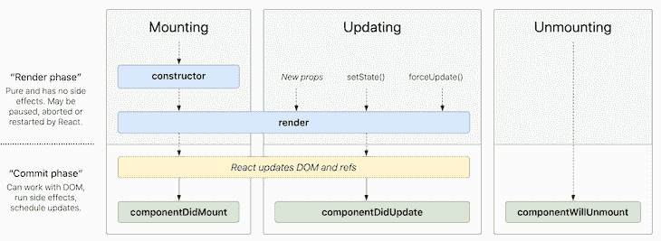

相比之下，下一个[图](https://wavez.github.io/react-hooks-lifecycle/)显示了在功能组件的环境中事情是如何工作的:


起初这听起来可能很奇怪，但是用`useEffect`定义的效果在渲染后被调用。更具体地说，它在第一次渲染后和每次更新后都运行。与生命周期方法相比，[效果不会阻塞 UI](https://reactjs.org/docs/hooks-effect.html#detailed-explanation) ，因为它们是异步运行的。

如果您是 React 新手，我建议您忽略基于类的组件和生命周期方法，而是学习如何开发功能组件以及如何解读效果的强大可能性。基于类的组件在最近的 React 开发项目中很少使用。

如果您是一名经验丰富的 React 开发人员，并且熟悉基于类的组件，那么您今天必须在项目中做一些与几年前没有钩子时相同的事情。

例如，当组件第一次呈现时“做一些事情”是很常见的。这里钩子的区别是微妙的:组件安装后你不做任何事情；在组件第一次呈现给用户之后，您做了一些事情。正如其他人所指出的，钩子迫使你更多地从用户的角度考虑问题。

## `useEffect`控制流程一览

本节简要描述效果的控制流。如果定义了至少一个效果，则对功能性反应组件执行以下步骤:

1.  该组件将基于状态、属性或上下文变化而被重新呈现
2.  如果组件存在一个或多个`useEffect`声明，React 检查每个`useEffect`以确定它是否满足执行实现的条件(回调函数的主体作为第一个参数提供)。在这种情况下，“条件”意味着自上一个渲染周期以来，一个或多个依赖关系已发生变化

依赖项是数组项，作为`useEffect`调用的可选第二个参数提供。数组值必须来自组件范围(即属性、状态、上下文或从上述内容派生的值):

1.  在每个效果执行之后，新效果的调度基于每个效果的依赖性而发生。如果一个效果根本没有指定依赖数组，这意味着这个效果在每个渲染周期后执行
2.  如果`useEffect`回调函数(第一个参数)的主体返回一个所谓的“清理回调函数”，清理是每个效果的可选步骤在这种情况下，从第二个调度周期开始，在执行效果之前调用清理函数。这也意味着，如果没有第二次执行预定的效果，则在 React 组件被销毁之前调用清理函数。

我很确定，如果你对效果没有什么经验，你就不会完全清楚这个生命周期。这就是为什么我在整篇文章中详细解释了每个方面。我鼓励你以后再回到这一节——我相信你下次阅读时会完全明白。

## 如何用`useEffect`执行副作用

`useEffect`钩子的签名看起来像这样:

```
useEffect(
    () => {
        // execute side effect
    },
    // optional dependency array
    [
        // 0 or more entries
    ] 
)

```

因为第二个参数是可选的，所以下面的执行非常好:

```
useEffect(() => { 
    // execute side effect
})

```

让我们看一个例子。用户可以通过输入字段更改文档标题:

```
import React, { useState, useRef, useEffect } from "react";
function EffectsDemoNoDependency() {
  const [title, setTitle] = useState("default title");
  const titleRef = useRef();
  useEffect(() => {
    console.log("useEffect");
    document.title = title;
  });
  const handleClick = () => setTitle(titleRef.current.value);
  console.log("render");
  return (
    <div>
      <input ref={titleRef} />
      <button onClick={handleClick}>change title</button>
    </div>
  );
}

```

`useEffect`语句只定义了一个强制参数来实现要执行的实际效果。在我们的例子中，我们使用表示标题的状态变量，并将其值赋给`document.title`。

因为我们跳过了第二个参数，这个`useEffect`在每次渲染后都会被调用。因为我们在`useRef`钩子的帮助下实现了一个[非受控](https://reactjs.org/docs/uncontrolled-components.html)输入字段，`handleClick`只有在用户点击按钮后才会被调用。这导致重新渲染，因为`setTitle`执行状态改变。

在每个渲染周期后，`useEffect`被再次执行。为了演示这一点，我添加了两个`console.log`语句:

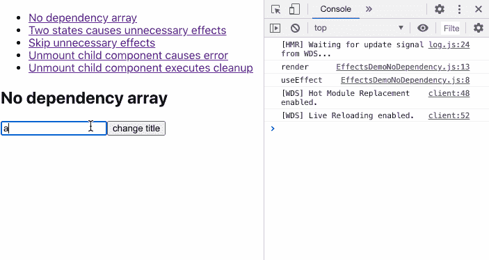

前两个日志输出是由于组件安装后的初始呈现。让我们向示例中添加另一个状态变量，以便在复选框的帮助下切换黑暗模式:

```
function EffectsDemoTwoStates() {
  const [title, setTitle] = useState("default title");
  const titleRef = useRef();
  const [darkMode, setDarkMode] = useState(false);
  useEffect(() => {
    console.log("useEffect");
    document.title = title;
  });
  console.log("render");
  const handleClick = () => setTitle(titleRef.current.value);
  const handleCheckboxChange = () => setDarkMode((prev) => !prev);
  return (
    <div className={darkMode ? "dark-mode" : ""}>
      <label htmlFor="darkMode">dark mode</label>
      <input
        name="darkMode"
        type="checkbox"
        checked={darkMode}
        onChange={handleCheckboxChange}
      />
      <input ref={titleRef} />
      <button onClick={handleClick}>change title</button>
    </div>
  );
}

```

然而，当您切换`darkMode`状态变量时，这个例子会导致不必要的影响:

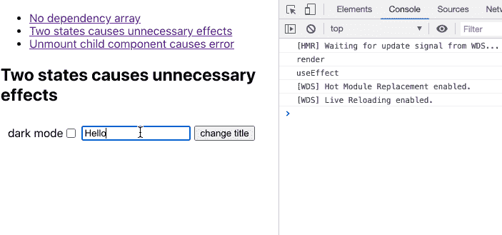

当然，在这个例子中这没什么大不了的，但是您可以想象更多有问题的用例，它们会导致 bug，或者至少是性能问题。让我们来看看下面的代码，并尝试从本地存储中读取初始标题，如果可用的话，在一个附加的`useEffect`块中:

```
function EffectsDemoInfiniteLoop() {
  const [title, setTitle] = useState("default title");
  const titleRef = useRef();
  useEffect(() => {
    console.log("useEffect title");
    document.title = title;
  });
  useEffect(() => {
    console.log("useEffect local storage");
    const persistedTitle = localStorage.getItem("title");
    setTitle(persistedTitle || []);
  });
  console.log("render");
  const handleClick = () => setTitle(titleRef.current.value);
  return (
    <div>
      <input ref={titleRef} />
      <button onClick={handleClick}>change title</button>
    </div>
  );
}

```

正如你所看到的，我们有一个效果的无限循环，因为每一个用`setTitle`改变的状态都会触发另一个效果，这个效果会再次更新状态:

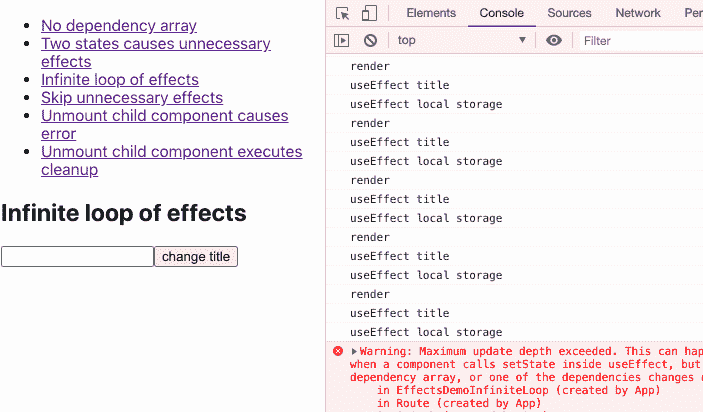

## 依赖数组的重要性

让我们回到上一个有两种状态(标题和黑暗模式)的例子。为什么我们会有不必要影响的问题？

同样，如果不提供依赖数组，每个调度的`useEffect`都会被执行。这意味着在每个渲染周期之后，在相应组件中定义的每个效果都会根据源代码中的位置依次执行。

所以效果定义的顺序很重要。在我们的例子中，每当一个状态变量改变时，我们的单个`useEffect`语句就被执行。

你有能力选择退出这种行为。这是通过您作为数组条目提供的依赖项来管理的。在这些情况下，如果自上次运行以来至少有一个提供的依赖关系发生了变化，React 只执行`useEffect`语句。换句话说，使用依赖数组，可以使执行依赖于某些条件。

往往，这就是我们想要的；我们通常希望在特定的条件下执行副作用，例如，数据改变了，道具改变了，或者用户第一次看到我们的组件。另一个跳过不必要的效果的策略是首先防止不必要的重新渲染，例如使用 [`React.memo`](https://reactjs.org/docs/react-api.html#reactmemo) ，我们将在后面看到。

回到我们的例子，我们希望在重新渲染后跳过不必要的效果。我们只需要添加一个依赖于`title`的数组。这样，仅当渲染周期之间的值不同时，才执行效果:

```
  useEffect(() => {
    console.log("useEffect");
    document.title = title;
  }, [title]);

```

以下是完整的代码片段:

```
function EffectsDemoTwoStatesWithDependeny() {
  const [title, setTitle] = useState("default title");
  const titleRef = useRef();
  const [darkMode, setDarkMode] = useState(false);
  useEffect(() => {
    console.log("useEffect");
    document.title = title;
  }, [title]);
  console.log("render");
  const handleClick = () => setTitle(titleRef.current.value);
  const handleCheckboxChange = () => setDarkMode((prev) => !prev);
  return (
    <div className={darkMode ? "view dark-mode" : "view"}>
      <label htmlFor="darkMode">dark mode</label>
      <input
        name="darkMode"
        type="checkbox"
        checked={darkMode}
        onChange={handleCheckboxChange}
      />
      <input ref={titleRef} />
      <button onClick={handleClick}>change title</button>
    </div>
  );
}

```

正如您在录音中看到的，只有按下按钮时，才会按预期调用效果:

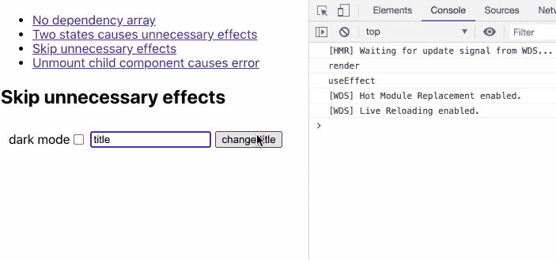

也可以添加一个空的依赖数组。在这种情况下，效果只执行一次；它类似于`[componentDidMount()](https://reactjs.org/docs/react-component.html#componentdidmount)`生命周期方法。为了证明这一点，让我们来看看前面的无限循环效果的例子:

```
function EffectsDemoEffectOnce() {
  const [title, setTitle] = useState("default title");
  const titleRef = useRef();
  useEffect(() => {
    console.log("useEffect title");
    document.title = title;
  });
  useEffect(() => {
    console.log("useEffect local storage");
    const persistedTitle = localStorage.getItem("title");
    setTitle(persistedTitle || []);
  }, []);
  console.log("render");
  const handleClick = () => setTitle(titleRef.current.value);
  return (
    <div>
      <input ref={titleRef} />
      <button onClick={handleClick}>change title</button>
    </div>
  );
}

```

我们刚刚添加了一个空数组作为第二个参数。因此，该效果仅在第一次渲染后执行一次，并在随后的渲染周期中跳过:

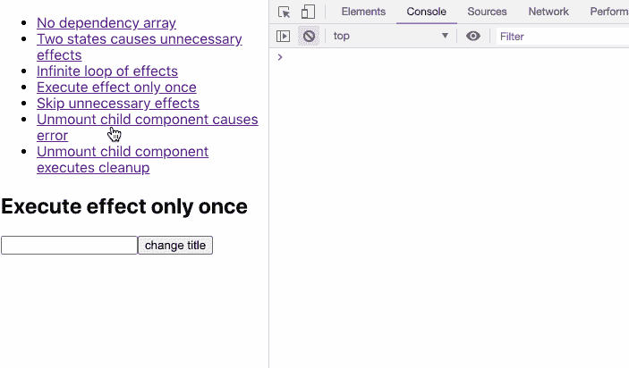

仔细想想，这种行为是有道理的。原则上，依赖数组说，“在下一个渲染周期后，每当其中一个参数发生变化时，执行第一个参数提供的效果。”但是，我们没有任何争论，所以依赖关系在未来永远不会改变。

这就是为什么使用空依赖数组会使 React 只调用一次效果——在第一次渲染之后。第二次渲染和第二次`useEffect title`是由于我们从本地存储中读取值后`setTitle()`调用的状态变化。

## 钩子的规则

在我们继续更多的例子之前，我们必须谈谈钩子的一般规则。这些并不是`useEffect`钩子独有的，但是理解在代码中的哪些地方可以定义效果是很重要的。你需要遵循[规则来使用钩子](https://reactjs.org/docs/hooks-rules.html):

1.  挂钩只能从构成函数式 React 组件的顶级函数中调用
2.  不能从嵌套代码(例如，循环、条件或另一个函数体)中调用钩子
3.  然而，定制钩子是特殊的函数，钩子可以从定制钩子的顶层函数中调用。此外，规则二也是如此

有一个方便的 [ESLint 插件](https://www.npmjs.com/package/eslint-plugin-react-hooks)可以帮助你遵循钩子的规则。如果你违反了其中一条规则，它会让你知道:

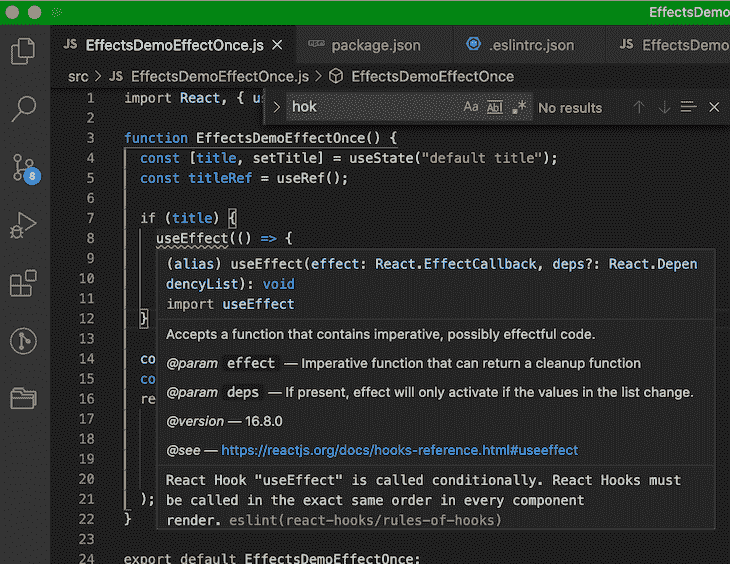

In addition, it helps you to provide a correct dependency array for effects in order to prevent bugs:

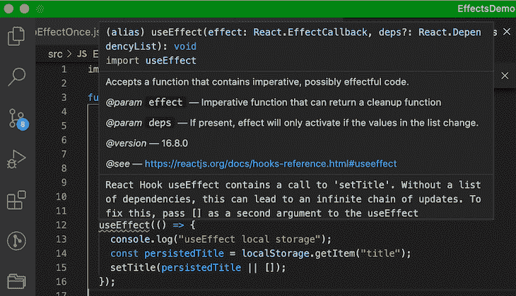

这个插件很棒，因为在实践中，你可能会错过向列表添加依赖项的机会；起初这并不总是显而易见的。我喜欢这个插件，因为它的信息促进了对特效如何工作的学习。

如果你不明白插件为什么要你添加特定的依赖，请不要过早的忽略它！你这样做至少应该有一个很好的解释。我最近发现，在某些情况下，如果您忽略了依赖项，您很可能会遇到一个 bug

```
useEffect(() => {
    // ...
    // eslint-disable-next-line react-hooks/exhaustive-deps
  }, []);

```

最后，要注意插件不是全知的。您必须接受 ESLint 插件无法理解您代码的运行时行为。它只能应用静态代码分析。当然也有插件不能帮助你的情况。

然而，我不反对将插件集成到您的项目设置中。它减少了出错的可能性，增加了健壮性。另外，仔细看看提供的建议；它们可能会让你对尚未完全理解的概念有新的见解。

也就是说，你不应该像往常一样教条地去满足插件。查看本文的[配套项目](https://github.com/doppelmutzi/useeffect-showcase)中的设置。

## 什么是依赖数组项？

这就给我们带来了一个重要的问题:依赖数组中应该包含哪些项？根据 [React 文档](https://reactjs.org/docs/hooks-effect.html#tip-optimizing-performance-by-skipping-effects)，您必须包含组件范围内的所有值，这些值在重新渲染之间会发生变化。

这到底意味着什么？在`useEffect`回调函数中引用的所有外部值，如道具、状态变量或上下文变量，都是效果的依赖项。引用容器(即你直接从`useRef()`而不是`current`属性中获得的东西)也是[有效的依赖](https://github.com/facebook/react/issues/16121#issuecomment-511369830)。甚至从上述值中导出的[局部变量](https://reactjs.org/docs/hooks-faq.html#is-it-safe-to-omit-functions-from-the-list-of-dependencies)也必须在依赖数组中列出。

理解效果的概念思维是必不可少的；React 团队希望您将效果中使用的每个值[都视为动态的。因此，即使您在效果中使用了一个非函数值，并且非常确定这个值不太可能改变，您也应该将这个值包含在依赖数组中。](https://github.com/facebook/react/issues/14920#issuecomment-471070149)

因此，请确保将组件范围内的每个值都添加到依赖项列表中，因为您应该将每个值都视为可变的。请记住，如果数组中至少有一个依赖关系不同于先前的渲染，效果将重新运行。

## 利用清理功能

下一个片段展示了一个例子来说明一个有问题的问题:

```
function Counter() {
  const [count, setCount] = useState(0);
  useEffect(() => {
    const interval = setInterval(function () {
      setCount((prev) => prev + 1);
    }, 1000);
  }, []);
  return <p>and the counter counts {count}</p>;
}
function EffectsDemoUnmount() {
  const [unmount, setUnmount] = useState(false);
  const renderDemo = () => !unmount && <Counter />;
  return (
    <div>
      <button onClick={() => setUnmount(true)}>Unmount child component</button>
      {renderDemo()}
    </div>
  );
}

```

这段代码实现了一个代表计数器的 React 组件，该计数器每秒增加一个数字。父组件呈现计数器，并允许您通过单击按钮来销毁计数器。看一下录音，看看当用户点击那个按钮时会发生什么:

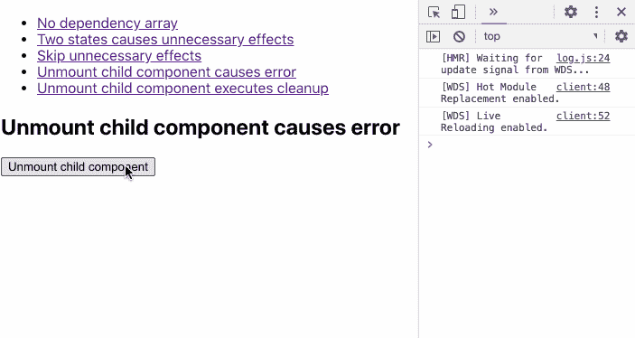

子组件已经注册了每秒调用一个函数的时间间隔。但是，该组件在未注销间隔的情况下被销毁。在组件被销毁之后，间隔仍然是活动的，并且想要更新组件的状态变量(`count`)，该状态变量不再存在。

解决方案是在卸载之前取消注册时间间隔。这可以通过清理功能来实现。因此，必须在效果的回调体中返回一个回调函数:

```
useEffect(() => {
    const interval = setInterval(function () {
      setCount((prev) => prev + 1);
    }, 1000);
    // return optional function for cleanup
    // in this case acts like componentWillUnmount
    return () => clearInterval(interval);
}, []);

```

我想强调的是，清理函数不仅仅是在销毁 React 组件之前调用的。每次在执行下一个预定效果之前，效果的清理功能都会被调用。

让我们仔细看看我们的例子。我们首先使用了一个技巧来拥有一个空的依赖数组，因此 cleanup 函数的行为类似于一个`componentWillUnmount()`生命周期方法。如果我们不使用回调函数调用`setCount`，该函数获取前一个值作为参数，我们需要编写以下代码，其中我们向依赖关系数组添加了一个`count`:

```
useEffect(() => {
    console.log("useEffect")
    const interval = setInterval(function () {
        setCount(count + 1);
    }, 1000);
    // return optional function for cleanup
    // in this case, this cleanup fn is called every time count changes
    return () => {
        console.log("cleanup");
        clearInterval(interval);
    }
}, [count]);

```

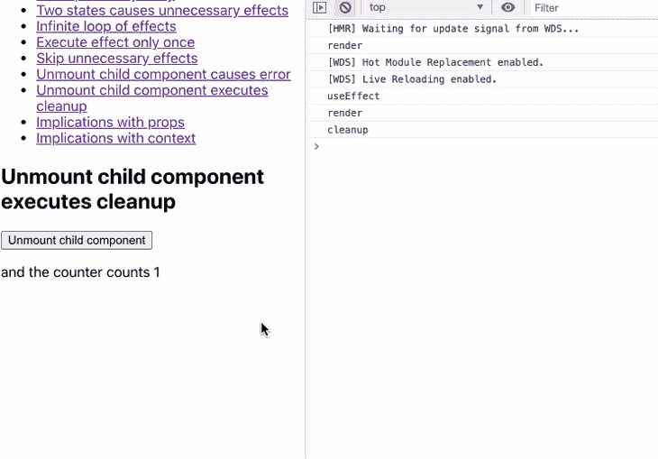

相比之下，前一个示例只在装载时执行一次清理功能，因为我们直接阻止了使用状态变量(count):

```
useEffect(() => {
    console.log("useEffect")
    const interval = setInterval(function () {
        setCount(prev => prev + 1);
    }, 1000);
    // return optional function for cleanup
    // in this case, this cleanup fn is called every time count changes
    return () => {
        console.log("cleanup");
        clearInterval(interval);
    }
}, []);

```

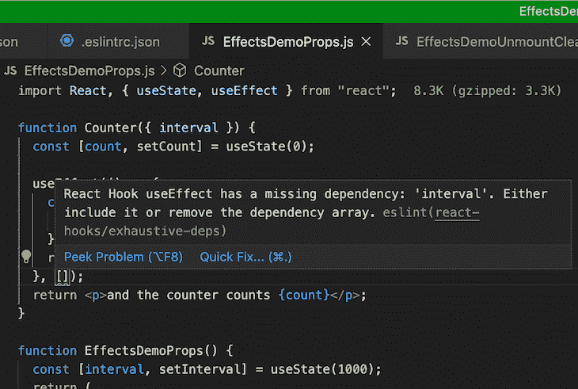

在这种情况下，后一种方法是一个小的性能优化，因为我们减少了清理函数调用的数量。

## 属性和状态变化的含义

道具更改和效果执行之间有一种自然的关联，因为它们会导致重新渲染，正如我们已经知道的，效果会在每个渲染周期后进行调度。

考虑下面的例子。计划是`Counter`组件的间隔可以由一个同名的道具配置。

```
function Counter({ interval }) {
  const [count, setCount] = useState(0);
  useEffect(() => {
    const counterInterval = setInterval(function () {
      setCount((prev) => prev + 1);
    }, interval);
    return () => clearInterval(counterInterval);
  }, []);
  return <p>and the counter counts {count}</p>;
}
function EffectsDemoProps() {
  const [interval, setInterval] = useState(1000);
  return (
    <div>
      <input
        type="text"
        value={interval}
        onChange={(evt) => setInterval(evt.target.value)}
      />
      <Counter interval={interval} />
    </div>
  );
}

```

便捷的 ESLint 插件指出我们遗漏了一些重要的东西:因为我们没有将`interval`属性添加到依赖数组(而是定义了一个空数组)，所以对父组件中输入字段的更改是无效的。即使在我们调整输入字段的值后，仍会使用`1000`的初始值:


相反，我们必须将道具添加到依赖数组中:

```
useEffect(() => {
    const counterInterval = setInterval(function () {
      setCount((prev) => prev + 1);
    }, interval);
    return () => clearInterval(counterInterval);
  }, [interval]);

```

现在情况看起来好多了:

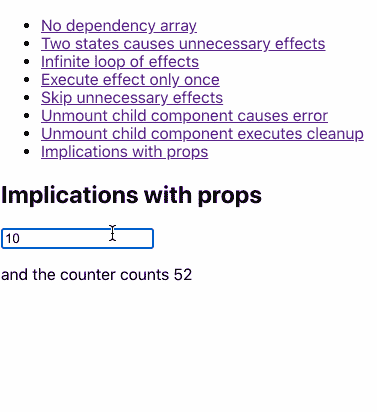

## 更多关于道具变化和使用`useCallback`钩子的信息

让我们稍微扩展一下示例，结合适当的更改来演示更多的关键概念:

```
const Counter = ({ interval, onDarkModeChange }) => {
  console.log("render Counter");
  const [count, setCount] = useState(0);
  useEffect(() => {
    console.log(`useEffect ${onDarkModeChange()}`);
    const counterInterval = setInterval(function () {
      setCount((prev) => prev + 1);
    }, interval);
    return () => clearInterval(counterInterval);
  }, [interval, onDarkModeChange]);
  return <p>and the counter counts {count}</p>;
};
const IntervalConfig = ({ onDarkModeChange }) => {
  console.log("render IntervalConfig");
  const [interval, setInterval] = useState(1000);
  const onChange = (evt) => setInterval(evt.target.value);
  return (
    <div>
      <input type="text" value={interval} onChange={onChange} />
      <Counter interval={interval} onDarkModeChange={onDarkModeChange} />
    </div>
  );
};
const EffectsDemoProps = () => {
  console.log("render EffectsDemoProps");
  const [numberClicks, setNumberClicks] = useState(0);
  const [darkMode, setDarkMode] = useState(false);
  const onDarkModeChange = () => (darkMode ? "🌙" : "🌞");
  return (
    <div
      style={
        darkMode
          ? { backgroundColor: "black", color: "white" }
          : { backgroundColor: "white", color: "black" }
      }
    >
      <label htmlFor="darkMode">dark mode</label>
      <input
        name="darkMode"
        type="checkbox"
        checked={darkMode}
        onChange={() => setDarkMode((prev) => !prev)}
      />
      <p>
        <button onClick={() => setNumberClicks((prev) => prev + 1)}>
          click
        </button>
        <span>&nbsp;Number clicks: {numberClicks}</span>
      </p>
      <IntervalConfig onDarkModeChange={onDarkModeChange} />
    </div>
  );
};

```

我添加了日志语句来指示所有组件渲染和对我们的`useEffect`语句的调用。让我们来看看会发生什么:

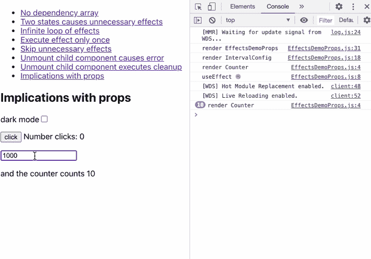

到目前为止，一切都很好——我们可以切换黑暗模式复选框，效果也应该被执行。要执行的回调函数`onDarkModeChange`沿着组件树向下传递给`Counter`组件。根据 ESLint 插件的建议，我们将它添加到了`useEffect`语句的依赖数组中:

```
useEffect(() => {
    console.log(`useEffect ${onDarkModeChange()}`);
    const counterInterval = setInterval(function () {
      setCount((prev) => prev + 1);
    }, interval);
    return () => clearInterval(counterInterval);
  }, [interval, onDarkModeChange]);

```

从录音中可以看到，如果两个道具`interval`或`onDarkModeChange`中的一个发生变化，效果就会执行。

一切都好吗？没那么快——从下一段录音中你可以看到，如果我们点击按钮，效果会被错误地执行:

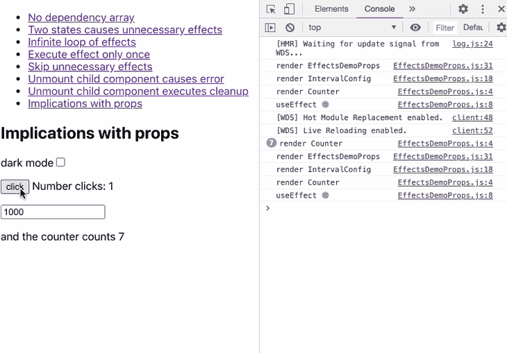

当然，`EffectsDemoProps`的状态改变了，这个组件和它的子组件一起被渲染。解决办法就是用`React.memo`对吧？

```
const Counter = React.memo(({ interval, onDarkModeChange }) => {
    // ...
});
const IntervalConfig = React.memo(({ onDarkModeChange }) => {
    // ...
});

```

组件被渲染，效果仍然被错误地执行:

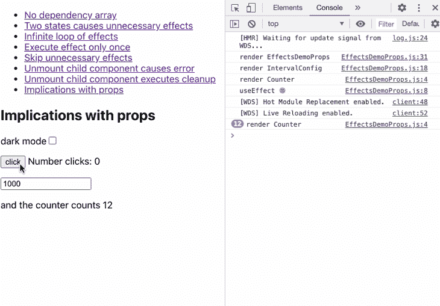

为什么执行我们的`Counter`组件的效果？问题出在`onDarkModeChange`函数上:

```
const EffectsDemoProps = () => {
    // ...
    const onDarkModeChange = () => (darkMode ? "🌙" : "🌞");
    // ...
};

```

点击按钮时，`EffectsDemoProps`组件的`numberClicks`状态被改变，组件因此被重新渲染。

这是因为`onDarkModeChange`是在组件内联定义的，每次组件重新渲染时都会重新创建。所以即使你在子组件上使用了`React.memo`，它们也会被重新渲染，因为传递的`onDarkModeChange`函数每次都指向另一个引用。

这就是为什么理解价值观的同一性是至关重要的。与重新创建的原始值(如数字)相反，重新创建的函数指向内存中的另一个“单元”。这就是函数值不同的原因。

我们可以用 [`useCallback`](https://blog.logrocket.com/react-reference-guide-hooks-api/#usecallback) 钩子来解决这个问题。此外，我们不一定需要使用`React.memo`,因为在我们的例子中重新呈现子组件并不是问题。然而，我们希望仅在`interval`值或`darkMode`值改变时执行效果:

```
import React, { useState, useEffect, useCallback } from "react";
const Counter = ({ interval, onDarkModeChange }) => {
    // ...
};
const IntervalConfig = ({ onDarkModeChange }) => {
    // ...
};
const EffectsDemoProps = () => {
    // ..
    const onDarkModeChange = useCallback(() => {
        return darkMode ? "🌙" : "🌞";
    }, [darkMode]);
    // ...
};

```

使用`useCallback`，React 只在其中一个依赖关系改变时创建一个新函数——在我们的例子中，是状态变量`darkMode`。有了这些，我们的例子就像预期的那样工作了:

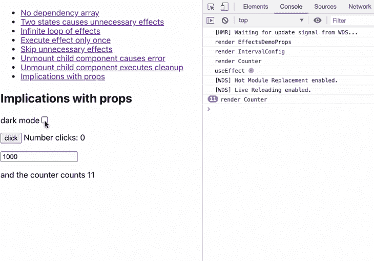

## `useCallback`同`useContext`

假设我们修改了示例，使用带有`useContext`钩子的 React 上下文，而不是将道具传递给子组件。在这种情况下，我们仍然需要使用`useCallback`作为`onDarkModeChange`的依赖项。原因与上一节相同:

```
import React, { useState, useEffect, useCallback, useContext } from "react";
const EffectsContext = React.createContext(null);
const Counter = ({ interval }) => {
  const [count, setCount] = useState(0);
  const { onDarkModeChange } = useContext(EffectsContext);
  useEffect(() => {
    const counterInterval = setInterval(function () {
      setCount((prev) => prev + 1);
    }, interval);
    return () => clearInterval(counterInterval);
  }, [interval, onDarkModeChange]);
  return <p>and the counter counts {count}</p>;
};
const IntervalConfig = () => {
  const [interval, setInterval] = useState(1000);
  const onChange = (evt) => setInterval(evt.target.value);
  return (
    <div>
      <input type="text" value={interval} onChange={onChange} />
      <Counter interval={interval} />
    </div>
  );
};
const EffectsDemoContext = () => {
  const [numberClicks, setNumberClicks] = useState(0);
  const [darkMode, setDarkMode] = useState(false);
  const onDarkModeChange = useCallback(() => {
    return darkMode ? "🌙" : "🌞";
  }, [darkMode]);
  return (
    <div
      style={
        darkMode
          ? { backgroundColor: "black", color: "white" }
          : { backgroundColor: "white", color: "black" }
      }
    >
      <label htmlFor="darkMode">dark mode</label>
      <input
        name="darkMode"
        type="checkbox"
        checked={darkMode}
        onChange={() => setDarkMode((prev) => !prev)}
      />
      <p>
        <button onClick={() => setNumberClicks((prev) => prev + 1)}>
          click
        </button>
        <span>&nbsp;Number clicks: {numberClicks}</span>
      </p>
      <EffectsContext.Provider value={{ onDarkModeChange }}>
        <IntervalConfig />
      </EffectsContext.Provider>
    </div>
  );
};

```

## `useEffect`定制挂钩内部

[定制挂钩](https://blog.logrocket.com/react-custom-hooks-and-the-death-of-render-props-a0ce5cba387f/)非常棒，因为它们能带来各种好处:

*   可重用代码
*   由于外包代码(效果)，组件更小
*   由于组件内部自定义钩子的函数调用，更多的语义代码
*   正如我们将在下一节中看到的，当在定制钩子内部使用时，效果可以被测试

下面的示例表示一个用于获取数据的自定义挂钩。我们将`useEffect`代码块移动到一个表示自定义钩子的函数中。请注意，这是一个相当简化的实现，可能无法涵盖项目的所有需求。你可以在这里找到更多现成的定制取货挂钩[:](https://github.com/rehooks/awesome-react-hooks)

```
const useFetch = (url, initialValue) => {
  const [data, setData] = useState(initialValue);
  const [loading, setLoading] = useState(true);
  useEffect(() => {
    const fetchData = async function () {
      try {
        setLoading(true);
        const response = await axios.get(url);
        if (response.status === 200) {
          setData(response.data);
        }
      } catch (error) {
        throw error;
      } finally {
        setLoading(false);
      }
    };
    fetchData();
  }, [url]);
  return { loading, data };
};
function EffectsDemoCustomHook() {
  const { loading, data } = useFetch(
    "https://jsonplaceholder.typicode.com/posts/"
  );
  return (
    <div className="App">
      {loading && <div className="loader" />}
      {data?.length > 0 &&
        data.map((blog) => <p key={blog.id}>{blog.title}</p>)}
    </div>
  );
}

```

React 组件中的第一条语句`EffectsDemoCustomHook`使用了名为`useFetch`的定制钩子。正如您所看到的，使用这样的定制钩子比直接在组件内部使用效果更具语义性。

业务逻辑被很好地从组件中抽象出来。我们必须使用自定义钩子的 nice API 来返回状态变量`loading`和`data`。

定制钩子内部的效果依赖于作为道具传递给钩子的作用域变量`url`。这是因为我们必须将它包含在依赖数组中。因此，即使我们在这个例子中没有预见到 URL 的变化，将它定义为一个依赖项仍然是一个好的做法。如上所述，该值将来有可能在运行时改变。

## 关于在效果中使用函数的附加想法

如果你仔细看看上一个例子，我们在效果中定义了函数`fetchData`,因为我们只在那里使用它。这是这种用例的最佳实践。如果我们在效果之外定义它，我们需要开发不必要的复杂代码:

```
const useFetch = (url, initialValue) => {
  const [data, setData] = useState(initialValue);
  const [loading, setLoading] = useState(true);
  const fetchData = useCallback(async () => {
    try {
      setLoading(true);
      const response = await axios.get(url);
      if (response.status === 200) {
        setData(response.data);
      }
    } catch (error) {
      throw error;
    } finally {
      setLoading(false);
    }
  }, [url]);
  useEffect(() => {
    fetchData();
  }, [fetchData]);
  return { loading, data };
};

```

如你所见，我们需要将`fetchData`添加到效果的依赖数组中。此外，我们需要用`useCallback`和它自己的依赖项(`url`)包装`fetchData`的实际函数体，因为该函数在每次渲染时都会被重新创建。

顺便说一下，如果您将函数定义移动到 effects 中，您会产生更可读的代码，因为效果使用哪个范围值是直接可见的。代码甚至更加健壮。

此外，如果您没有将依赖项作为 props 或 context 传递给组件，ESLint 插件会“看到”所有相关的依赖项，并建议声明被遗忘的值。

## 在`useEffect`中使用异步函数

如果您还记得在`useFetch`定制钩子中的`useEffect`块，您可能会问为什么我们需要这个额外的`fetchData`函数定义。我们不能像这样重构代码吗？

```
useEffect(async () => {
  try {
    setLoading(true);
    const response = await axios.get(url);
    if (response.status === 200) {
      setData(response.data);
    }
  } catch (error) {
    throw error;
  } finally {
    setLoading(false);
  }
}, [url]);

```

很高兴你问了，但是不行！出现以下错误:

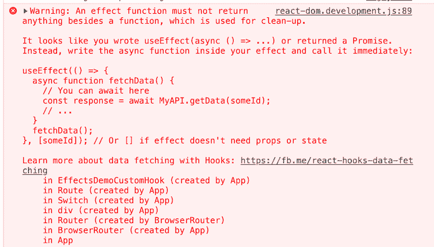

强大的 ESLint 插件也会警告你。

原因是这段代码返回一个承诺，但是一个效果只能返回 void 或者一个清理函数。

## 效果的单元测试

将`useEffect`块提取到定制钩子中允许对它们进行单元测试，因为您不必处理实际的 React 组件。这是一个显著的优势。

前段时间写了一篇关于用[react-Hooks-testing-library](https://react-hooks-testing-library.com/)对定制钩子进行单元测试的文章。这是测试效果的一种可能性。

下面的代码片段是一个 [Jest](https://jestjs.io/) 的例子，即使在运行时改变了一个效果的依赖关系(`url`)也能测试数据获取:

```
import { renderHook } from "@testing-library/react-hooks";
import axios from "axios";
import MockAdapter from "axios-mock-adapter";
// import custom hook - in this example extracted to a separate file
import useFetch from "./useFetch";
test("useFetch performs multiple GET requests for different URLs", async () => {
  // fetch 1
  const initialValue = "initial value";
  const mock = new MockAdapter(axios);
  const mockData = 1;
  const url = "http://mock";
  mock.onGet(url).reply(200, mockData);
  const { result, waitForNextUpdate } = renderHook(() =>
    useFetch(url, initialValue)
  );
  expect(result.current.data).toEqual("initial value");
  expect(result.current.loading).toBeTruthy();
  await waitForNextUpdate();
  expect(result.current.data).toEqual(1);
  expect(result.current.loading).toBeFalsy();
  // fetch 2
  const url2 = "http://mock2";
  const mockData2 = 2;
  mock.onGet(url2).reply(200, mockData2);
  const initialValue2 = "initial value 2";
  const { result: result2, waitForNextUpdate: waitForNextUpdate2 } = renderHook(
    () => useFetch(url2, initialValue2)
  );
  expect(result2.current.data).toEqual("initial value 2");
  expect(result2.current.loading).toBeTruthy();
  await waitForNextUpdate2();
  expect(result2.current.data).toEqual(2);
  expect(result2.current.loading).toBeFalsy();
});

```

`useFetch`被包裹在一个 [`renderHook`](https://react-hooks-testing-library.com/usage/basic-hooks#rendering) 的函数调用中。这提供了正确的上下文来执行定制钩子，而不违反钩子的规则。

为了执行实际的网络调用，我们利用 [`waitForNextUpdate`](https://react-hooks-testing-library.com/reference/api#waitfornextupdate) 。这允许我们等待异步函数返回来检查网络调用的响应。有了这个集合，我们可以断言钩子的结果。在我们的测试中，我们用 [axios 模拟适配器](https://github.com/ctimmerm/axios-mock-adapter)模拟了实际的网络调用。

您也可以在 [CodeSandbox](https://codesandbox.io/s/testing-custom-hook-demo-ko6bq) 中找到这段代码。

## 更多的收据

在这一节中，我将向您展示一些可能有用的便捷模式。

### 当满足特定条件时，只执行一次效果

正如我们已经知道的，您主要通过依赖数组来控制效果的执行。每当其中一个依赖关系发生变化时，就会执行该效果。通常，您应该将组件设计为在状态改变时执行效果，而不仅仅是一次。

然而，有时您恰恰想要这样做，例如，当某个事件发生时。你可以用你在效果中的一个`if`语句中使用的标志来做这件事。如果你不想在更新标志时增加额外的渲染(这在大多数情况下是有问题的),那么`useRef`钩子是一个不错的选择。此外，您不必将 ref 添加到依赖数组中。

以下示例仅在满足以下条件时从我们的效果中调用函数`trackInfo`:

*   用户至少单击了一次按钮
*   用户勾选了允许跟踪的复选框

勾选复选框后，仅当用户再次点击按钮后，才应执行跟踪功能:

```
function EffectsDemoEffectConditional() {
  const [count, setCount] = useState(0);
  const [trackChecked, setTrackChecked] = useState(false);
  const shouldTrackRef = useRef(false);
  const infoTrackedRef = useRef(false);
  const trackInfo = (info) => console.log(info);
  useEffect(() => {
    console.log("useEffect");
    if (shouldTrackRef.current && !infoTrackedRef.current) {
      trackInfo("user found the button component");
      infoTrackedRef.current = true;
    }
  }, [count]);
  console.log("render");
  const handleClick = () => setCount((prev) => prev + 1);
  const handleCheckboxChange = () => {
    setTrackChecked((prev) => {
      shouldTrackRef.current = !prev;
      return !prev;
    });
  };
  return (
    <div>
      <p>
        <label htmlFor="tracking">Declaration of consent for tracking</label>
        <input
          name="tracking"
          type="checkbox"
          checked={trackChecked}
          onChange={handleCheckboxChange}
        />
      </p>
      <p>
        <button onClick={handleClick}>click me</button>
      </p>
      <p>User clicked {count} times</p>
    </div>
  );
}

```

在这个实现中，我们使用了两个 ref:`shouldTrackRef`和`infoTrackedRef`。后者是“门”,保证跟踪功能只在其他条件满足后调用一次。

每当`count`改变时，即每当用户点击按钮时，该效果重新运行。我们的`if`语句检查条件，只有当它评估为`true`时才执行实际的业务逻辑:

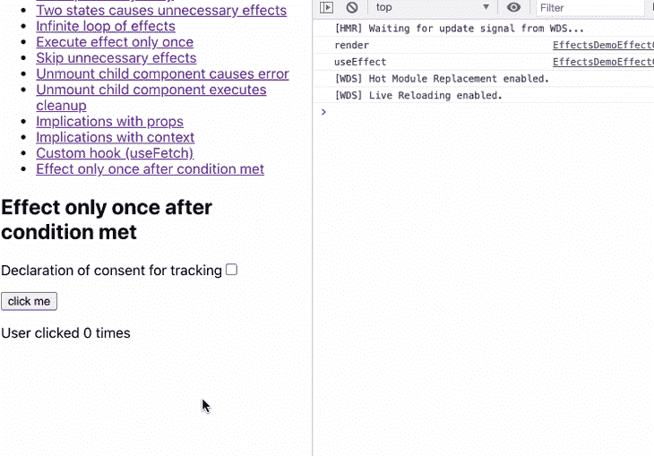

日志消息`user found the button component`仅在满足正确条件后打印一次。

### 从以前的渲染中访问数据

如果您需要访问前一个渲染周期的一些数据，您可以利用`useEffect`和`useRef`的组合:

```
function EffectsDemoEffectPrevData() {
  const [count, setCount] = useState(0);
  const prevCountRef = useRef();
  useEffect(() => {
    console.log("useEffect", `state ${count}`, `ref ${prevCountRef.current}`);
    prevCountRef.current = count;
  }, [count]);
  const handleClick = () => setCount((prev) => prev + 1);
  console.log("render");
  return (
    <div>
      <p>
        <button onClick={handleClick}>click me</button>
      </p>
      <p>
        User clicked {count} times; previous value was {prevCountRef.current}
      </p>
    </div>
  );
}

```

我们将效果与状态变量`count`同步，以便在用户点击按钮后执行。在我们的效果中，我们将状态变量的当前值赋给了`prevCountRef`的可变`current`属性。我们在 JSX 部分输出这两个值:

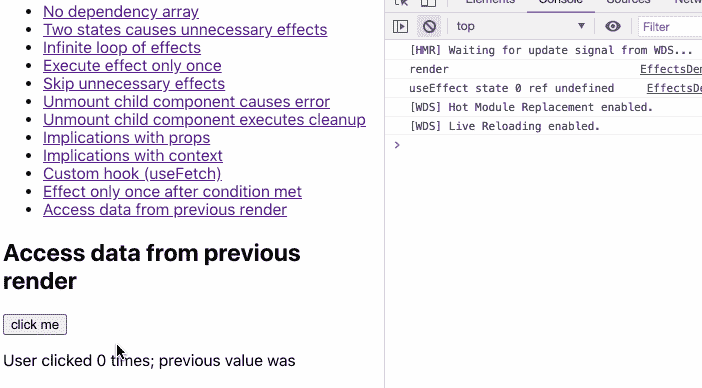

在加载这个演示程序时，在初始渲染时，状态变量具有调用`useState`的初始值。参考值为`undefined`。它再一次证明了效果是在渲染后运行的。当用户点击时，它按预期工作。

## 何时不使用`useEffect`

在某些情况下，由于潜在的性能问题，您应该避免使用`useEffect`。

### 1.转换用于呈现的数据

如果渲染前需要转换数据，那么就不需要`useEffect`。假设您正在显示一个用户列表，并且只想根据某些标准过滤用户列表。也许您只想显示活动用户列表:

```
export const UserList = ({users}: IUserProps) => {

  // the following part is completely unnecessary.
  const [filteredUsers , setFilteredUsers] = useState([])
  useEffect(() => {
    const activeUsers = users.filter(user => user.active) 
    setFilteredUsers(activeUsers)
  ,[users])

  return <div>
    {filteredUsers.map(user => <div> {user.name} </div>)}
  </div>
}

```

在这里，您可以直接进行过滤并显示给用户，就像这样:

```
export const UserList = ({users}: IUserProps) => {
  const filteredUsers = users.filter(user => user.active)
  return <div>
    {filteredUsers.map(user => <div> {user.name} </div>)}
  </div>
}

```

这将节省您的时间并提高您的应用程序的性能。

### 2.处理用户事件

你不需要用`useEffect`来处理用户事件。假设您想在用户点击表单提交按钮时发出一个 POST 请求。下面这段代码的灵感来自 [React 的文档](https://beta.reactjs.org/learn/you-might-not-need-an-effect):

```
function Form() {

  // Avoid: Event-specific logic inside an Effect
  const [jsonToSubmit, setJsonToSubmit] = useState(null);

  useEffect(() => {
    if (jsonToSubmit !== null) {
      post('/api/register', jsonToSubmit);
    }
  }, [jsonToSubmit]);

  function handleSubmit(e) {
    e.preventDefault();
    setJsonToSubmit({ firstName, lastName });
  }

}

```

在上面的代码中，您可以在单击按钮后发出 post 请求。但是你在级联效果，所以一旦`useEffect`被触发，它没有发生什么的完整背景。这可能会导致将来出现问题；相反，您可以在`handleSubmit`函数上发出 POST 请求:

```
function Form() {

  function handleSubmit(e) {
    e.preventDefault();
    const jsonToSubmit = { firstName, lastName };
    post('/api/register', jsonToSubmit);
  }

}

```

这要干净得多，有助于减少未来的错误。

## 结论

如果你想成为下一级 React 开发人员，理解`useEffect`钩子的底层设计概念和最佳实践是一项需要掌握的关键技能。

如果你在 2019 年初之前开始了 React 之旅，你必须学会用生命周期方法思考，而不是用效果思考。

采用效果的心智模型将使你熟悉组件生命周期、数据流、其他钩子(`useState`、`useRef`、`useContext`、`useCallback`等)。)，甚至其他优化如`React.memo`。

## 使用 LogRocket 消除传统反应错误报告的噪音

[LogRocket](https://lp.logrocket.com/blg/react-signup-issue-free)

是一款 React analytics 解决方案，可保护您免受数百个误报错误警报的影响，只针对少数真正重要的项目。LogRocket 告诉您 React 应用程序中实际影响用户的最具影响力的 bug 和 UX 问题。

[ ](https://lp.logrocket.com/blg/react-signup-general) [  ](https://lp.logrocket.com/blg/react-signup-general) [LogRocket](https://lp.logrocket.com/blg/react-signup-issue-free)

自动聚合客户端错误、反应错误边界、还原状态、缓慢的组件加载时间、JS 异常、前端性能指标和用户交互。然后，LogRocket 使用机器学习来通知您影响大多数用户的最具影响力的问题，并提供您修复它所需的上下文。

关注重要的 React bug—[今天就试试 LogRocket】。](https://lp.logrocket.com/blg/react-signup-issue-free)