# 反应 useLayoutEffect 与 useEffect 的例子- LogRocket 博客

> 原文：<https://blog.logrocket.com/useeffect-vs-uselayouteffect-examples/>

***编者按**:本帖最后更新于 2021 年 12 月 22 日。*

假设你真的理解了`useEffect`和`useLayoutEffect`的区别，能简单解释一下吗？或者可以用具体的、实际的例子来描述它们的细微差别吗？

在本教程中，我将用具体的例子来描述`useEffect`和`useLayoutEffect`之间的区别，这将帮助你巩固你的理解。我们开始吧！

### 目录

## `useEffect`和`useLayoutEffect`有什么区别？

散布在官方[钩子 API 参考](https://reactjs.org/docs/hooks-reference.html)上的是指向`useEffect`和`useLayoutEffect`区别的指针。也许其中最突出的是第一段，详细描述了 [`useLayoutEffect`钩子](https://reactjs.org/docs/hooks-reference.html#uselayouteffect)，上面写着“签名与`useEffect`相同，但它在所有 DOM 突变后同步触发”。

上面句子中的第一个从句很容易理解。`useEffect`和`useLayoutEffect`的签名分别完全相同:

```
useEffect(() => {
  // do something
}, [array, dependency])

useLayoutEffect(() => {
  // do something
}, [array, dependency])2

```

如果你要遍历一个代码库，用`useLayoutEffect`替换每个`useEffect`调用，这在大多数情况下都是可行的。例如，我从 [React Hooks Cheatsheet](https://react-hooks-cheatsheet.com/examples/fetching-data) 中取了一个例子，它从一个远程服务器获取数据，并将实现改为使用`useLayoutEffect`而不是`useEffect`:

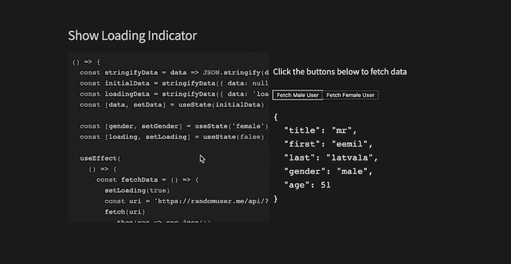

在我们的例子中，它仍然可以工作。现在，我们已经确立了第一个重要事实，`useEffect`和`useLayoutEffect`具有相同的签名。这个特性使得[很容易假设这两个钩子](https://blog.logrocket.com/frustrations-with-react-hooks/)的行为方式相同。然而，上面提到的引文的第二部分对大多数人来说感觉有点模糊，声明“它在所有 DOM 突变后同步触发”。从本质上讲，`useEffect`和`useLayoutEffect`的区别仅仅在于两者何时被解雇。

## 点火:`useEffect`对`useLayoutEffect`

让我们考虑以下人为的反应用:

```
function Counter() {
    const [count, setCount] = useState(0)
    useEffect(() => {
      // perform side effect
      sendCountToServer(count)
    }, [count])
    <div>
        <h1> {`The current count is ${count}`} </h1>
        <button onClick={() => setCount(count => count + 1)}>
            Update Count
        </button>
</div> }
// render Counter
<Counter />

```

当组件被装载时，以下代码被绘制到用户的浏览器中:

```
// The current count is 0

```

每点击一次按钮，计数器状态更新， [DOM 突变被打印到屏幕](https://blog.logrocket.com/8-dom-features-you-didnt-know-existed-ec2a0a28fd89/)，效果功能被触发。事实是这样的:

第一步。用户执行一个动作，即点击按钮

第二步。React 在内部更新`count state`变量

第三步。React 处理 DOM 变异

随着点击而来的是状态更新，这反过来触发了 DOM 突变。`h1`元素的文本内容必须从`the current count is previous value`更改为`the current count is new value`。

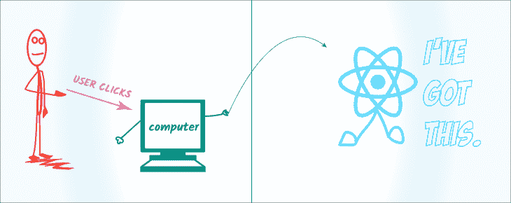

第四步。然后，浏览器将这个 DOM 更改绘制到浏览器的屏幕上

步骤 1、2 和 3 不向用户显示任何视觉变化。只有在浏览器描绘出 DOM 的变化或突变之后，用户才会真正看到变化。React 将关于 DOM 变化的细节交给浏览器引擎，浏览器引擎计算出将变化绘制到屏幕上的整个过程。

第五步。只有在浏览器绘制了 DOM 变化之后,`useEffect`函数才会被触发

这里有一个插图可以帮助你记住整个过程。

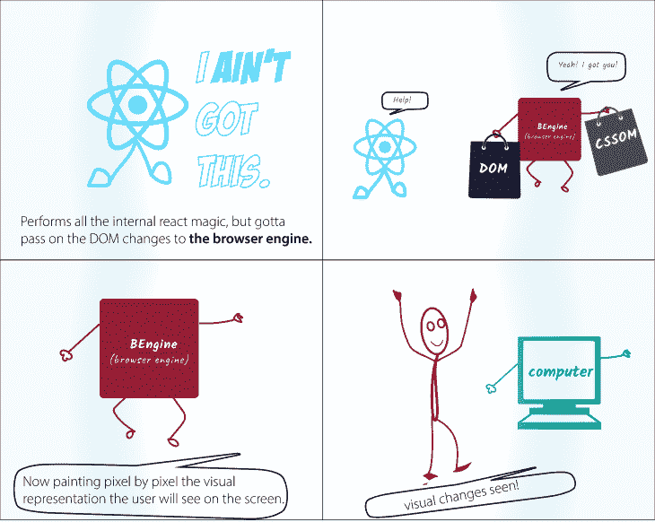

注意，传递给`useEffect`的函数只有在 DOM 改变被绘制到屏幕上之后才会被触发。官方文档是这样说的，“传递给`useEffect`的函数将在渲染提交到屏幕后运行”。

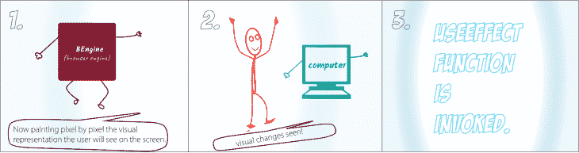

从技术上讲，effect 函数是异步触发的，不会阻塞浏览器的绘制过程。上面的例子并没有表明对于大多数 DOM 突变来说，这个操作是非常快的。如果`useEffect`函数本身触发了另一个 DOM 突变，这将发生在第一个之后，但是这个过程通常非常快。

> 注意:尽管`useEffect`被推迟到浏览器完成绘制之后，但它肯定会在任何新的渲染之前触发。React 将总是在开始新的更新之前刷新以前的渲染效果。

现在，这和`useLayoutEffect`钩子有什么不同？与`useEffect`不同，传递给`useLayoutEffect`钩子的函数在所有 DOM 突变后同步触发。

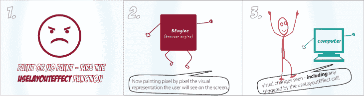

简单来说，`useLayoutEffect`并不真正关心浏览器是否画出了 DOM 的变化。它在计算出 DOM 突变后立即触发该函数。

虽然这看起来不太理想，但是在特定的用例中非常鼓励这样做。例如，必须对用户可见的 DOM 突变应该在下一次绘制之前同步触发，以防止用户收到视觉上的不一致。我们将在本文后面看到一个这样的例子。

记住，在浏览器有机会绘制之前，`useLayoutEffect`中安排的更新将被同步刷新。

## `useEffect`和`useLayoutEffect`示例

`useEffect`和`useLayoutEffect`的主要区别在于它们被解雇的时间，但不管怎样，如果不看具体的例子，很难明确量化这种区别。在这一节中，我将重点介绍三个例子，它们突出了`useEffect`和`useLayoutEffect`之间的差异。

## 1.执行时间

现代浏览器速度非常快。我们将发挥一些创造力来看看`useEffect`和`useLayoutEffect`的执行时间有何不同。在[的第一个例子](https://codesandbox.io/s/useeffect-uselayouteffect-time-of-execution-gtrvg?fontsize=14)中，我们将考虑一个类似于我们之前看到的计数器:

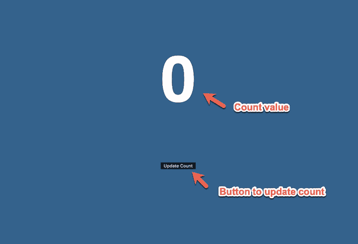

在这个计数器中，我们增加了两个`useEffect`调用:

```
useEffect(() => {
    console.log("USE EFFECT FUNCTION TRIGGERED");
});
useEffect(() => {
    console.log("USE SECOND EFFECT FUNCTION TRIGGERED");
});

```

请注意，效果记录不同的文本取决于哪个被触发，正如所料，第一个效果功能在第二个之前被触发。

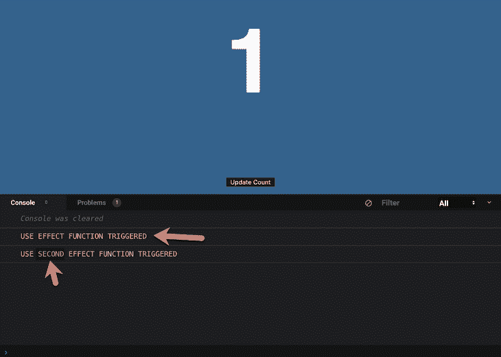

当一个组件中有多个`useEffect`调用时，效果调用的顺序保持不变。第一个被触发，然后第二个，序列继续。现在，如果第二个`useEffect`钩子换成了一个`useLayoutEffect`钩子会怎么样？

```
useEffect(() => {
    console.log("USE EFFECT FUNCTION TRIGGERED");
});
useLayoutEffect(() => {
    console.log("USE LAYOUT EFFECT FUNCTION TRIGGERED");
});

```

尽管`useLayoutEffect`挂钩被放置在`useEffect`挂钩之后，但是`useLayoutEffect`挂钩首先被触发！

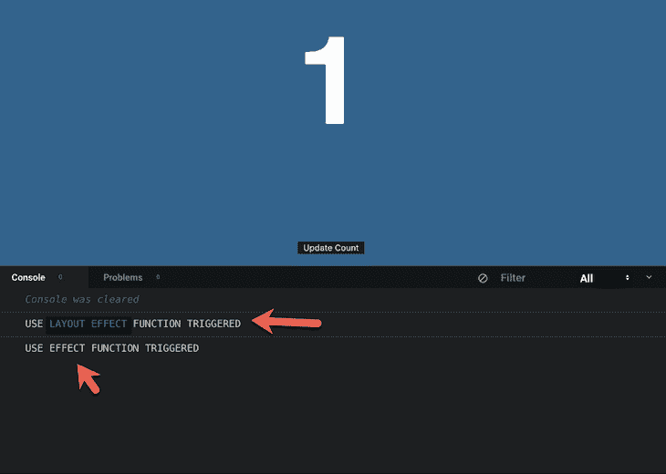

在绘制 DOM 突变之前，同步触发`useLayoutEffect`函数。然而，`useEffect`函数是在 DOM 突变被绘制之后调用的。

在下一个例子中，我们将看一下关于`useEffect`和`useLayoutEffect`钩子的执行时间的图表。示例应用程序有一个按钮，可以切换标题的可视状态，无论是否晃动。这是正在运行的应用程序:

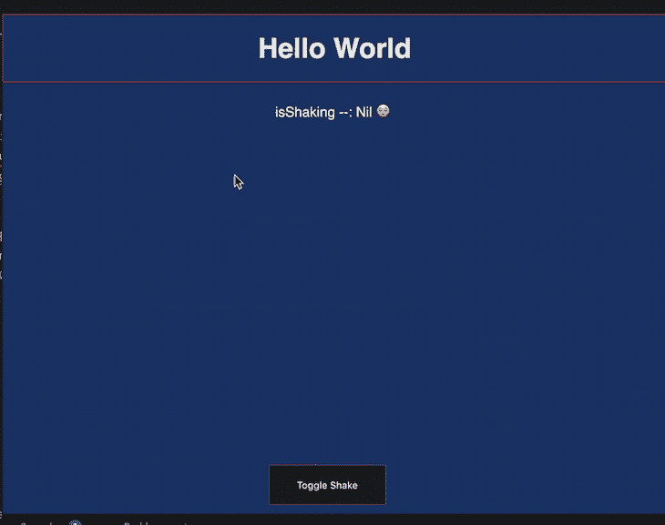

我选择这个例子是为了确保当按钮被点击时，浏览器实际上有一些变化要绘制，因此有动画。标题的可视状态在`useEffect`函数调用中切换。如果你感兴趣，你可以[查看实现](https://codesandbox.io/s/useeffect-uselayouteffect-time-of-execution-2-kqnqp?fontsize=14)。

我通过每秒切换视觉状态来收集重要数据，这意味着我同时使用了`useEffect`和`useLayoutEffect`钩子来点击按钮。

使用`performance.now`，我测量了`useEffect`和`useLayoutEffect`点击按钮和触发效果功能之间的差异。我收集了以下数据:

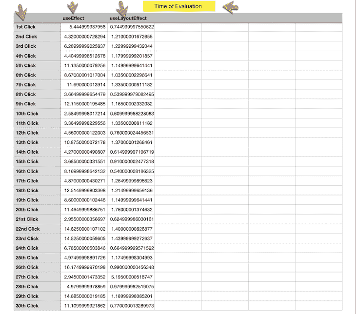

根据这些数据，我创建了一个图表来直观地表示`useEffect`和`useLayoutEffect`的执行时间:

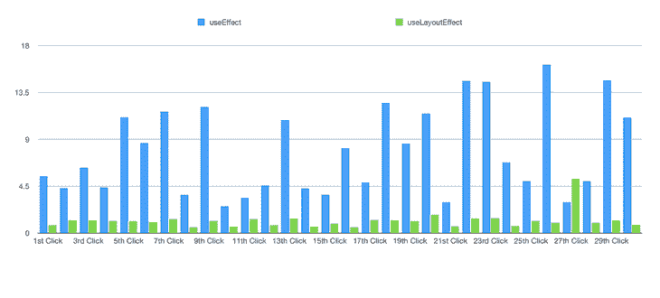

本质上，上图代表了触发`useEffect`和`useLayoutEffect`效果函数的时间差，在某些情况下，其幅度大于 10 倍。看看`useEffect`比`useLayoutEffect`晚发射多少？

您将会看到这种时间差如何在像制作 DOM 动画这样的用例中发挥巨大的作用，下面的示例 3 对此进行了解释。

## 2.表演

昂贵的计算是非常昂贵的。如果处理不当，这些会对应用程序的性能产生负面影响。对于在浏览器中运行的应用程序，您必须小心不要仅仅因为您在后台运行繁重的计算就阻止用户查看可视化更新。

`useEffect`和`useLayoutEffect`的行为不同之处在于如何处理繁重的计算。如前所述，`useEffect`会将效果函数的执行推迟到 DOM 突变完成之后，这是两者中显而易见的选择。

> 顺便说一句，我知道`useMemo`对于记忆繁重的计算非常有用。这篇文章忽略了这个事实，而是比较了`useEffect`和`useLayoutEffect`。

举个例子，我已经建立了一个不实用的应用程序，但是足够适合我们的用例。应用程序呈现了一个看似无害的初始屏幕:

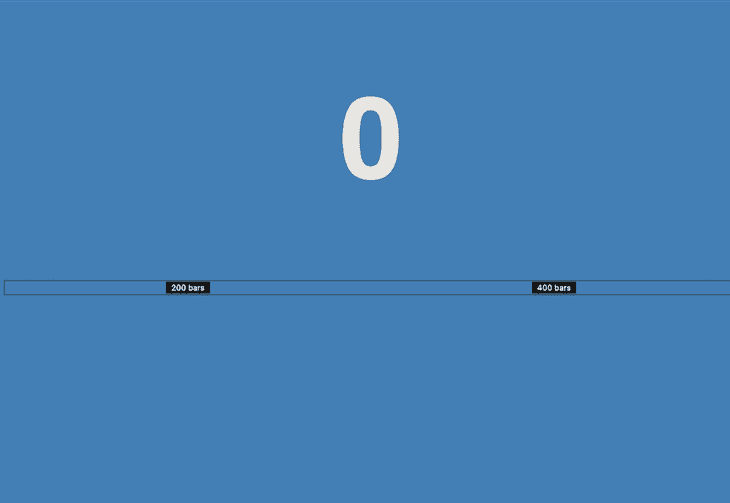

然而，它有两个可点击的按钮，可以触发一些有趣的变化。例如，点击 **200 巴**按钮将计数状态设置为 200:

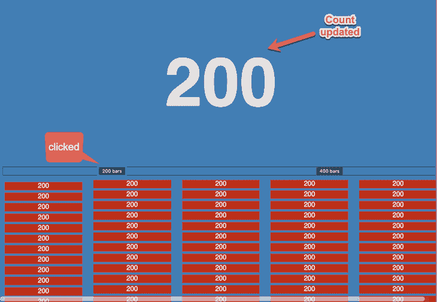

它还强制浏览器在屏幕上绘制 200 个新条:

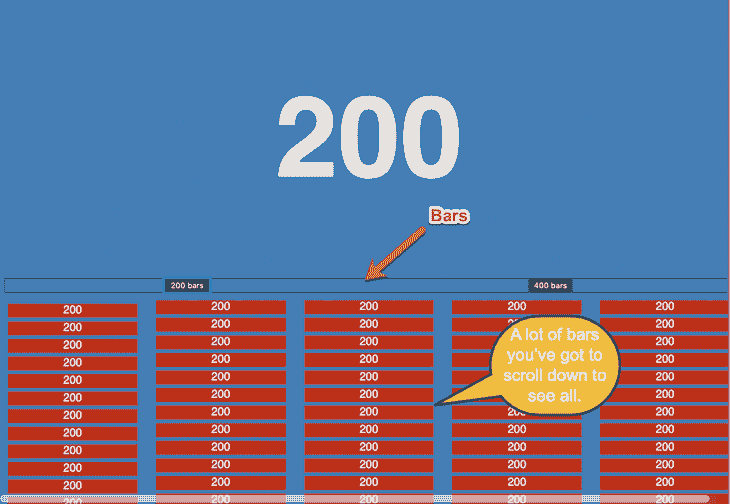

这不是呈现 200 个条形的一种非常高效的方法，因为我每次都在创建新的数组，但是我们示例的重点是让浏览器工作:

```
... 
return (
...
   <section
        style={{
            display: "column",
            columnCount: "5",
            marginTop: "10px" }}>
        {new Array(count).fill(count).map(c => (
          <div style={{
                height: "20px",
                background: "red",
                margin: "5px"
         }}> {c}
         </div> ))}
   </section>
)

```

这种点击也触发了繁重的计算:

```
...
useEffect(() => {
    // do nothing when count is zero
    if (!count) {
      return;
}
    // perform computation when count is updated.
    console.log("=== EFFECT STARTED === ");
    new Array(count).fill(1).forEach(val => console.log(val));
    console.log(`=== EFFECT COMPLETED === ${count}`);
}, [count]);

```

在`UseEffect`函数中，我创建了一个长度总计为计数的新数组，在本例中是一个包含 200 个值的数组。我对数组进行循环，并为数组中的每个值向控制台打印一些内容。

我们仍然需要关注屏幕更新和我们的日志控制台，看看这是如何表现的。对于`useEffect`，在触发日志之前，我们的屏幕会更新为新的计数值:

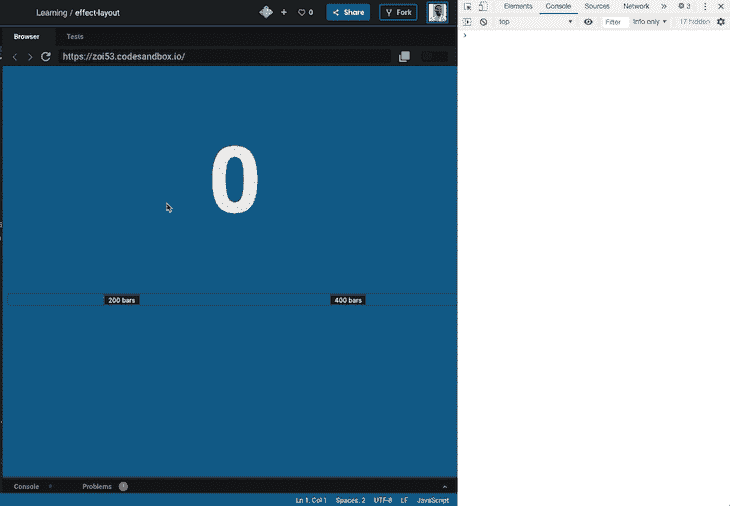

这是《T2》中同样的画面。在繁重的计算之前，你不可能错过屏幕更新！那么，这种行为和`useLayoutEffect`一样吗？不要！远非如此。

使用`useLayoutEffect`，计算将在浏览器绘制更新之前被触发。计算需要一些时间，消耗了浏览器的绘制时间。检查上面的相同动作，替换为`useLayoutEffect`:

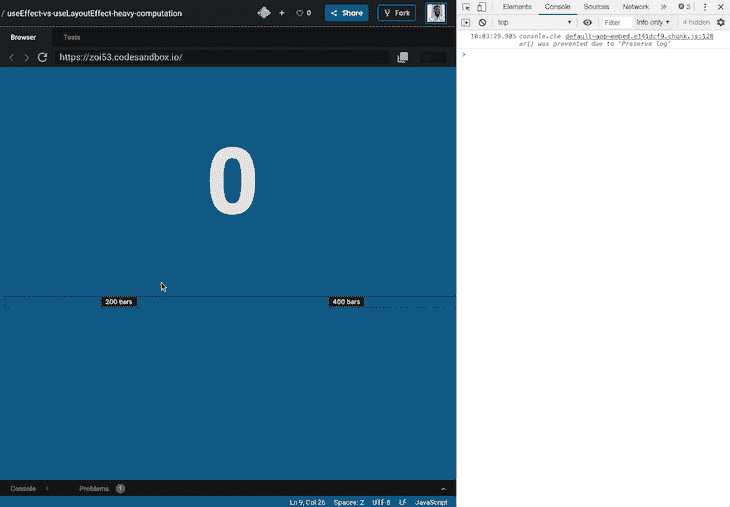

同样，你可以用[慢动作](https://www.youtube.com/watch?v=irUvYd39k4c&feature=youtu.be)观看。您可以看到`useLayoutEffect`是如何阻止浏览器绘制 DOM 变化的。你可以玩一下演示版，但是小心不要让你的浏览器崩溃。

为什么处理繁重计算的不同很重要？如果可能的话，你应该选择`useEffect`钩子，以避免在浏览器画图过程中不引人注目。在现实世界中，大部分时间都是这样，除了当你从 DOM 中读取布局或者做一些与 DOM 相关的事情需要尽快绘制的时候。在下一节中，我们将看到一个实际的例子。

## 3.不一致的视觉变化

`useLayoutEffect`在处理不一致的视觉变化时大放异彩。作为一个例子，让我们考虑一下我在用 React 钩子学习高级模式的 [Udemy 视频课程](https://forms.gle/Qd6yZC1Lhcosnc2f8)时遇到的真实场景。

使用`useEffect`，在绘制 DOM 变化之前会有一点闪烁，这与 refs 如何传递给定制钩子有关。最初，在呈现附加的 DOM 节点时，这些 refs 在实际设置之前以`null`开始。

但是，请考虑以下截屏。用`useEffect`:

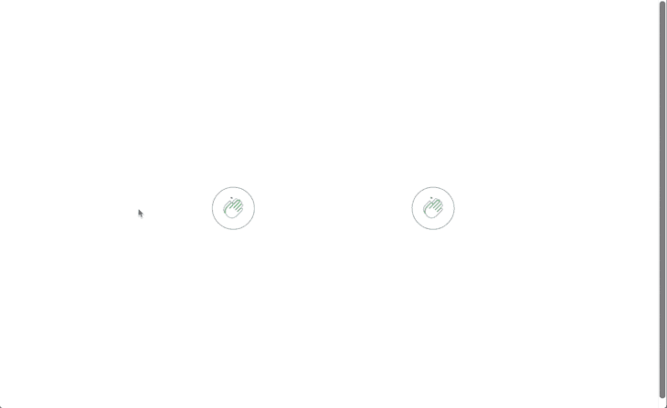

用`useLayoutEffect`:

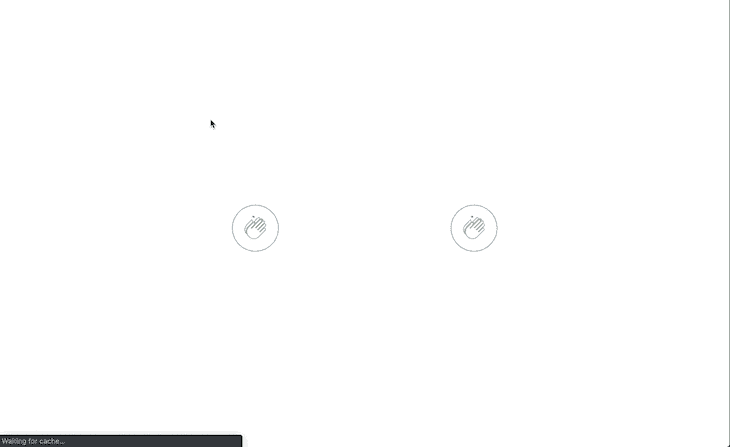

如果组件一挂载，你就依赖这些引用来执行动画，那么你会发现在你的动画开始之前，浏览器会有不愉快的闪烁。`useEffect`是这种情况，而`useLayoutEffect`不是。

即使没有这种闪烁，有时你可能会发现`useLayoutEffect`制作的动画看起来比`useEffect`更黄油、更干净、更快。在处理复杂的用户界面动画时，一定要测试这两个钩子。

## 结论

在本文中，我们回顾了 React 中的`useEffect`和`useLayoutEffect`挂钩，研究了它们的内部工作方式和最佳用例。我们看了两个钩子的例子，关于它们的发射、性能和视觉变化。

## [LogRocket](https://lp.logrocket.com/blg/react-signup-general) :全面了解您的生产 React 应用

调试 React 应用程序可能很困难，尤其是当用户遇到难以重现的问题时。如果您对监视和跟踪 Redux 状态、自动显示 JavaScript 错误以及跟踪缓慢的网络请求和组件加载时间感兴趣，

[try LogRocket](https://lp.logrocket.com/blg/react-signup-general)

.

[ ](https://lp.logrocket.com/blg/react-signup-general) [](https://lp.logrocket.com/blg/react-signup-general) 

LogRocket 结合了会话回放、产品分析和错误跟踪，使软件团队能够创建理想的 web 和移动产品体验。这对你来说意味着什么？

LogRocket 不是猜测错误发生的原因，也不是要求用户提供截图和日志转储，而是让您回放问题，就像它们发生在您自己的浏览器中一样，以快速了解哪里出错了。

不再有嘈杂的警报。智能错误跟踪允许您对问题进行分类，然后从中学习。获得有影响的用户问题的通知，而不是误报。警报越少，有用的信号越多。

LogRocket Redux 中间件包为您的用户会话增加了一层额外的可见性。LogRocket 记录 Redux 存储中的所有操作和状态。

现代化您调试 React 应用的方式— [开始免费监控](https://lp.logrocket.com/blg/react-signup-general)。