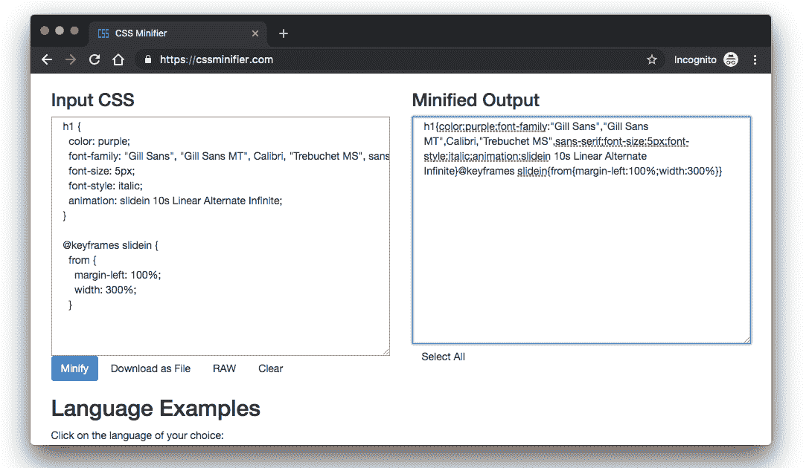
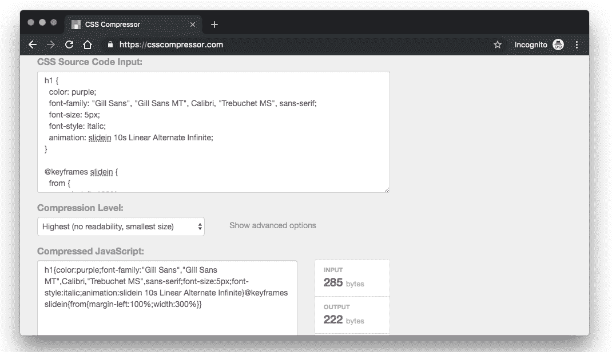

# 缩小你的 CSS - LogRocket 博客的有用工具和技术

> 原文：<https://blog.logrocket.com/useful-tools-and-techniques-to-minify-your-css-bee9b539e074/>

更快的页面速度，更好的性能，整体改善的用户体验——这些都是缩小 CSS 文件的优势。这似乎是显而易见的，但它仍然是最常被忽视的性能优化之一。

简而言之，缩小就是通过去除空白、换行符、注释、分隔符、空格和不必要的字符来最小化文件大小的过程。这减小了文件的大小，并最终产生一个改进的、性能更高的应用程序。

在这篇文章中，我们将仔细看看缩小你的 CSS 文件意味着什么，探索它的好处，并涵盖一些我们可以实现缩小的方法。值得注意的是，虽然我们在这篇文章中关注的是 CSS 缩小，但是你同样可以缩小你的标记和 JavaScript 文件。

### 缩小实际上做什么？

这是我上周为一个项目写的 CSS 文件:

```
//src/style.css

h1 {
  color: purple;
  font-family: "Gill Sans", "Gill Sans MT", Calibri, "Trebuchet MS", sans-serif;
  font-size: 5px;
  font-style: italic;
  animation: slidein 10s Linear Alternate Infinite;
}
@keyframes slidein {
  from {
    margin-left: 100%;
    width: 300%;
  }
  to {
    margin-left: 0%;
    width: 100%;
  }
}
#blonde {
  width: 350px;
  height: 350px;
  animation: blondie 5s Linear 2s infinite alternate;
  position: relative;
  display: inline-block;
}
.box {
  width: 200px;
  height: 175px;
  padding-left: 50px;
  padding-right: 50px;
  padding-top: 60px;
  padding-bottom: 60px;
}
p {
  font-family: "Lucida Sans", "Lucida Sans Regular", "Lucida Grande",
    "Lucida Sans Unicode", Geneva, Verdana, sans-serif;
  font-size: 12px;
  color: white;
  font-style: italic;
}
```

对我来说，这段代码应该是这样的——它应该是可读的、可编辑的和可理解的。这就是为什么我们作为开发人员通常更喜欢用这种方式编写代码，但是 web 服务器和浏览器不需要任何这些花哨的空间来理解或应用我们的代码。

通过 [CSS Minifier](https://cssminifier.com/) 运行这段代码将会减少这个`style.css`文件的大小，这反过来将会导致一个更快的应用程序。以下是缩小版本的输出:

```
h1{color:purple;font-family:"Gill Sans","Gill Sans MT",Calibri,"Trebuchet MS",sans-serif;font-size:5px;font-style:italic;animation:slidein 10s Linear Alternate Infinite}@keyframes slidein{from{margin-left:100%;width:300%}to{margin-left:0;width:100%}}#blonde{width:350px;height:350px;animation:blondie 5s Linear 2s infinite alternate;position:relative;display:inline-block}.box{width:200px;height:175px;padding-left:50px;padding-right:50px;padding-top:60px;padding-bottom:60px}p{font-family:"Lucida Sans","Lucida Sans Regular","Lucida Grande","Lucida Sans Unicode",Geneva,Verdana,sans-serif;font-size:12px;color:#fff;font-style:italic}
```

现在，这对您来说可能看起来有点奇怪，但是对 web 服务器和浏览器来说却非常有意义。该文件比未混合的文件小得多，编译速度更快，因此渲染速度也更快。

### 缩小项目文件的重要性

除了缩小的明显原因之外，如提高页面加载速度和更好的用户体验，还有许多其他原因可以解释为什么您应该在生产中缩小项目文件。以下是一些例子:

#### 搜索引擎优化

搜索引擎非常重视排名，页面加载时间是 SEO 的一大因素。作为开发者，你的网站应该是搜索优化的和用户友好的，这将有助于它更频繁地出现在搜索结果页面上。

根据谷歌的数据，53%的移动网站访问者会离开任何超过三秒钟才加载的页面。缩小你的 CSS 会让你离显著的加载速度更近一步，这反过来会提高你的 SEO。

#### 易接近

对于使用较旧浏览器和较旧移动设备的用户来说，带有未统一文件的网站更难查看和加载。为什么？因为旧的浏览器和设备没有针对适当的缓存和快速渲染技术进行优化。因此，与缩小的页面相比，他们将更难呈现未缩小的页面。

这同样适用于那些希望在网上冲浪时节省带宽/数据使用的用户。与加载缩小的网页相比，加载未缩小的网页会消耗更多的数据和网络带宽。一般来说，缩小您的项目文件会产生一个更具包容性和可访问性的网站，可以容纳所有这些用户。

#### 良好实践

缩小化已经成为评估 web 项目质量的标准。当然，您可以决定不缩小您的项目文件，但是您实际上是毫无理由地牺牲了免费的性能优化。底线是，与未统一的网站相比，每个好心人都会选择一个更小、更快的版本。

#### 可靠性

不统一的网站影响品牌可信度和转化率。了解您的产品和服务遵循优化要求和开发最佳实践有助于增加您的用户的信心，并维护您的品牌的整体信誉。

### 缩小项目文件的方法

既然我们都同意缩小项目文件对我们最有利，那么让我们更仔细地看看我们可以采取的方法。

#### 手动缩小

缩小 CSS 文件的一种方法是手动删除代码中的所有空白。删除所有不必要的代码将直接转化为一个不那么大的文件。

对于大型项目来说，这是不可取的，在大型项目中，您可能有大量的文件和很长的代码行；手动缩小实际上是不可能的。我的意思是，你可以花几个月的时间去做，但是当有更好的方法可以节省你的时间和精力的时候，为什么要花那么长的时间呢？

#### 在线界面工具

这些是你可以用来运行你的项目和缩小你的所有文件的工具，这将最终为你输出一个完全缩小的版本。使用它们很有意义，因为它们支持几种样式语言。

如果你使用像 Sass、Stylus 或更少的预处理程序，这些工具将创建一个单独的 CSS 文件，并在你编写和保存时缩小你所有的代码。在程序结束时，您将拥有一个完整的、精简的 CSS 文件，其中包含了所有可用于生产的样式。举几个例子，这些工具包括[预编译](https://prepros.io/)和[代码包](https://codekitapp.com/)。

#### 构建流程

这些构建工具接受你所有的样式，缩小它们，并把它们放在一个单独的构建文件夹中，你可以在任何时候访问它们。这样，您的网站将使用构建文件夹中的精简代码，而不是您键入的实际可读代码。这些构建工具包括 [gulp.js](https://gulpjs.com/) 和 [Grunt](http://gruntjs.com/) 等等。

这些工具很容易与您的项目集成，允许您添加定制，并支持多种语言的缩小。他们有各种各样的插件，你可以安装这些插件来扩展你的构建过程的能力，并执行你认为合适的特定操作。

#### 加拿大

通过 CDN 自动缩小是缩小项目文件的好方法。它为您节省了在开发和生产中使用构建工具和管理项目文件的两个不同版本所带来的压力。

它以一种非常独特的方式工作:您在主服务器上保留原始的、未压缩的文件，而 CDN 自动创建并在其缓存服务器和 pop 上存储压缩的变体。因此，它们与原始文件的修改保持同步。

#### 在线微型打印机

有些网站允许你复制你的 CSS 文件并粘贴进去，他们会自动缩小粘贴的代码并给你一个完全缩小的输出。一个很好的例子是我们在本文前面使用的 [CSS Minifier](http://cssminifier.com) 。



还有 [CSS Compressor](https://csscompressor.com/) 网站，它做的事情和我们上面看到的 minifier 一模一样:它取一个源文件，为你输出一个压缩版本。您可以复制精简的代码或将其作为文件下载。



### TL；博士:缩小的一般优点

*   更快的站点加载速度
*   改进的性能
*   减少传输到 web 上的代码量
*   减小页面大小以加快加载速度
*   减少页面加载时间，以获得更好的用户体验和 SEO

### 最后的想法

缩小项目文件是美国开发人员可以使用的最便宜的性能优化技术之一。优化网站是一个非常昂贵的过程，因此需要一个好的，便宜的策略，如缩小。

* * *

### 更多来自 LogRocket 的精彩文章:

* * *

在这篇文章中，我们讨论了缩小项目文件的各种方法，以及为什么这么做很重要。这在很大程度上是一件显而易见的事情，但我希望它能帮助你，并让你读得开心。

## 你的前端是否占用了用户的 CPU？

随着 web 前端变得越来越复杂，资源贪婪的特性对浏览器的要求越来越高。如果您对监控和跟踪生产环境中所有用户的客户端 CPU 使用、内存使用等感兴趣，

[try LogRocket](https://lp.logrocket.com/blg/css-signup)

.

[](https://lp.logrocket.com/blg/css-signup)[https://logrocket.com/signup/](https://lp.logrocket.com/blg/css-signup)

LogRocket 就像是网络和移动应用的 DVR，记录你的网络应用或网站上发生的一切。您可以汇总和报告关键的前端性能指标，重放用户会话和应用程序状态，记录网络请求，并自动显示所有错误，而不是猜测问题发生的原因。

现代化您调试 web 和移动应用的方式— [开始免费监控](https://lp.logrocket.com/blg/css-signup)。

* * *