# 使用 React 本地测试库进行用户行为测试

> 原文：<https://blog.logrocket.com/user-behavior-testing-react-native-testing-library/>

在前端开发中，测试用户行为对于交付优秀的产品至关重要。 [React 原生测试库(RNTL)](https://callstack.github.io/react-native-testing-library/) 让在 React 原生应用中测试用户体验成为一种乐趣。它有很好的 API 使测试不受实现细节的影响。

在本教程结束时，我保证你也会感受到这种快乐——我不会占用你太多时间。你可以在 GitHub 上找到这个演示[的完整代码。](https://github.com/zsajjad/testing-app)

## React 本机测试库入门

让我们从添加库开始，我们将使用这些库来使我们的测试成为愉快的经历。

```
yarn add -D @testing-library/react-native
```

这里需要注意一点——RNTL 是 react-testing-library 的包装器，它依赖于 Jest。在我看来，这种组合是天作之合，让测试体验变得令人惊叹。

### 测试`Button`组件

让我们从小处着手；如果您熟悉测试组件，您可以跳过这一部分。我们将测试一个简单的按钮组件，只是为了让自己更熟悉 RNTL 的工作方式和我们要做的事情。下面是我们的`Button`组件的样子:

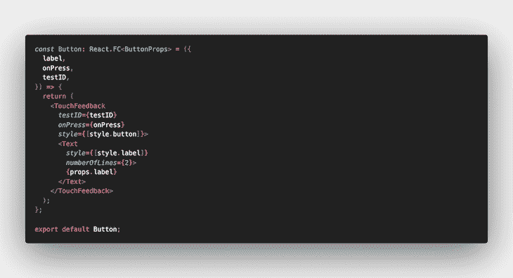

[这里是`Button`组件的完整代码](https://github.com/zsajjad/testing-app/blob/main/app/theme/Button/index.tsx)。我们将测试当它被用户按下时应该调用`onPress`方法。[我们的测试应该是这样的](https://github.com/zsajjad/testing-app/blob/main/app/theme/Button/tests/index.test.tsx):

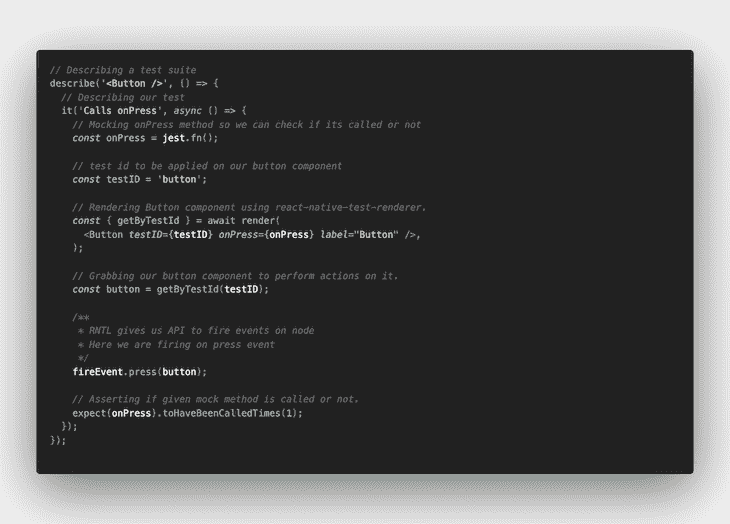

RNTL 提供了一个很棒的 API 来让[使用属性](https://callstack.github.io/react-native-testing-library/docs/api-queries/)抓取组件。虽然有很多方法可以获取组件，但我觉得`getByTestId`让你的测试代码更不受 UI 和文本变化的影响。

使用`[fireEvent](https://callstack.github.io/react-native-testing-library/docs/api/#fireevent)` API，我们可以模拟许多交互，这允许我们测试用户行为。在这里，我们创建了一个模拟方法，并断言它应该只在用户按下按钮时调用一次。我们将使用类似的结构来进一步测试我们的流程。

下面是我们将如何执行这个测试，以及预期的输出:

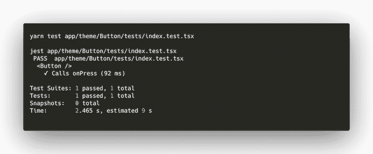

很好，所以我们现在已经做了一些基本的测试，对事情的发展有了一个很好的想法。

### 测试登录表单

让我们向前一步，实践一些真实世界的例子。我们将测试一个表单，该表单接受用户的电子邮件和密码输入，并将它们传递给`onSubmit`方法。我们还将断言，如果用户没有输入密码，它会呈现一个验证错误。[这是我们的组件](https://github.com/zsajjad/testing-app/blob/main/app/screens/LoginScreen/EmailPasswordForm/index.tsx):

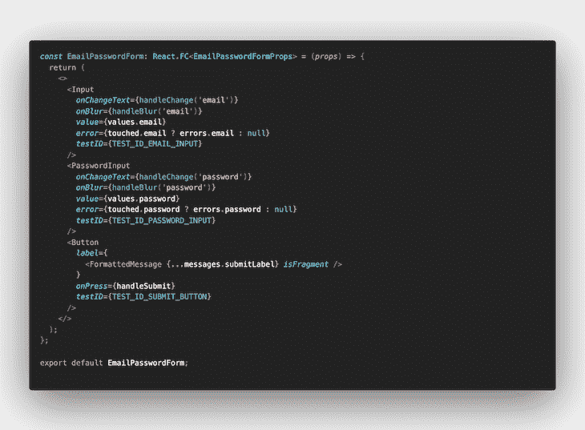

让我们测试我们的第一个用例:组件应该显示一个“需要密码”的错误。下面是我们的测试结果:

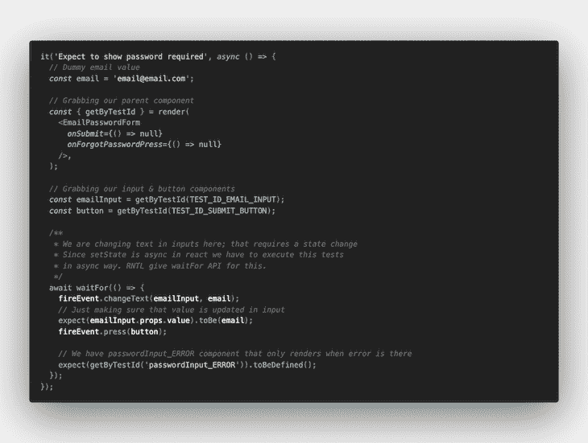

这里我们测试一个对状态有影响的动作。由于`setState`在 React 中是异步的，我们必须以异步的方式执行这个测试。RNTL 为此提供了`waitFor` API。此外，我们在这里使用了相同的`fireEvent` API 来更改输入组件的文本。

转到我们的下一个用例，我们希望用电子邮件和密码打电话给`onSubmit`:

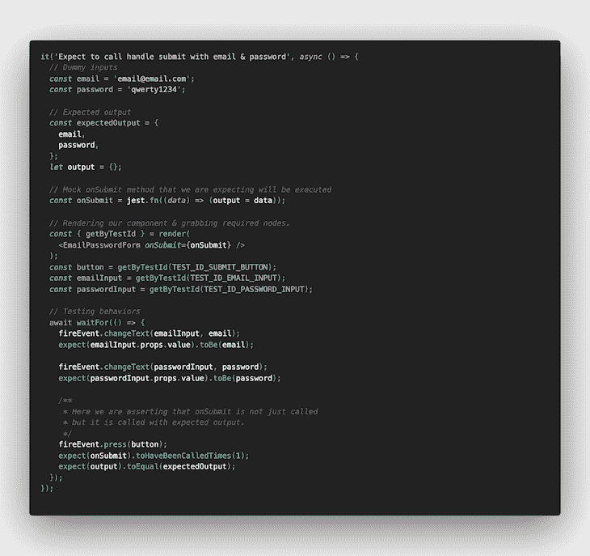

我们又向前迈了一步，断言了模拟函数的参数，以确保得到预期的输出。这是我们针对`EmailPasswordForm`组件的[完整测试套件](https://github.com/zsajjad/testing-app/blob/main/app/screens/LoginScreen/EmailPasswordForm/tests/index.test.tsx)。

## 构建我们的测试流程

现在我们已经建立了一些信心，让我们测试我们完整的登录流程。这不仅仅是关于被调用的测试方法。登录通常包括两个主要功能:它有一些返回令牌的网络 API 调用，然后我们将该令牌保存在本地存储中以备后用。

### 模拟 API

为了使我们的测试独立于服务器/网络，我们将模拟我们的 API 点击。这有了神话般的开源包 [fetch-mock-jest](https://www.npmjs.com/package/jest-fetch-mock) 才成为可能。它拦截所有的`fetch`调用，并用给定的响应解决它们。这允许我们测试所有成功和错误的案例。让我们将它添加到我们的代码库中。

```
yarn add -D fetch-mock-jest
```

这里是我们将使用的最简单的嘲讽；它模拟了一个带有预期响应的登录 API 调用。

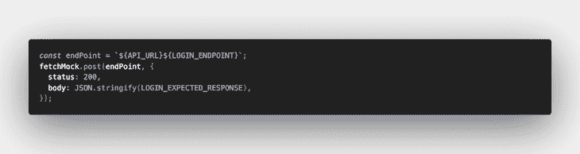

### 嘲讽`AsyncStorage`

React 本机应用程序使用许多本机桥来访问特定于平台的功能。在我们的例子中，我们必须确保登录 API 响应存储在本地存储中。

RNTL 允许我们模拟这些本机桥，这样我们就可以在不依赖设备或仿真器的情况下运行我们的测试。为了模仿这些库，我们将添加文件`jest.mock.js`，它将编码模仿我们在应用中使用的所有原生库。[这是我们的模拟文件](https://github.com/zsajjad/testing-app/blob/main/jest.mock.js):

```
jest.mock('@react-native-community/async-storage', () => ({
  setItem: jest.fn(),
}));
```

这里需要注意的重要一点是:我们必须模拟我们从库中使用的所有方法，因为这些方法没有被添加到我们的测试环境中。

现在我们将从我们的`[jest.configs.js](https://github.com/zsajjad/testing-app/blob/main/jest.config.js)`文件中引用这个文件:

```
module.exports = {
  ...
  setupFiles: ['./jest.mock.js']
  ...
};
```

将这个文件添加到`setupFiles`数组将告诉 Jest 在运行任何测试套件之前执行这个文件。

## 完整测试套件

现在我们已经有了模拟，让我们看看如何测试我们的完整流程:

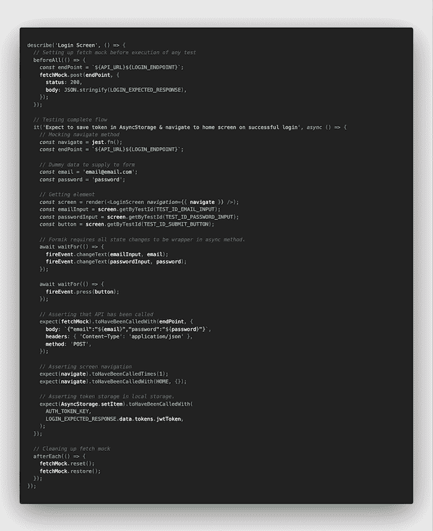

别担心——只是冗长，不难消化。我们已经知道了大部分。

首先，我们在我们的`beforeAll`钩子中添加了`fetchMock`,以确保我们的获取模拟在这个测试套件开始之前开始。这里，我们用模拟导航方法呈现了屏幕组件；这是我们的屏幕将如何在应用程序中呈现。

在执行完所有的用户交互之后，我们开始断言事情会按照我们的预期发生。以下是我们的期望清单:

*   使用预期值调用 API
*   收到 API 响应后，应用程序会导航到主屏幕
*   `jwtToken`存储在本地存储器中

如果所有这些测试都通过了，我们确信我们的登录屏幕按照我们期望的方式工作。这标志着我们的登录流测试已经完成。

## 测试前任务:林挺

随着时间的推移，随着我们的测试套件数量和规模的增长，测试可能需要更长的时间来执行。在执行任何测试之前对我们的代码进行林挺将确保我们不会对有任何明显错误的代码执行测试。我们将在预测试脚本中添加 lint 任务。它看起来是这样的:

你可以在这里查看完整的`package.json`文件[。](https://github.com/zsajjad/testing-app/blob/main/package.json)

## 测试后任务:添加报告者

谁不喜欢图表和仪表盘来可视化性能呢？在这里，我们将集成 Jest test reporter，它将为我们提供测试执行的完整画面。这将有助于我们监控哪些测试被破坏，以及每个测试需要多少时间来完成。

将报告者添加到我们的项目中:

```
yarn add -D jest-html-reporters
```

接下来，让我们将这位记者添加到我们的`jest.configs.js`文件中。[下面是它的样子](https://github.com/zsajjad/testing-app/blob/main/jest.config.js):


为了让它运行，让我们在每次执行测试时自动打开这个报告器。很简单——我们将把它添加到我们的后期测试脚本中，作为对我们的`[package.json](https://github.com/zsajjad/testing-app/blob/main/package.json)`的更新:

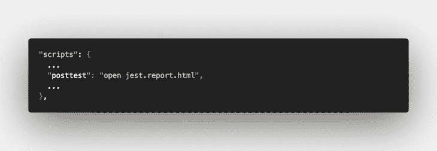

这是我们项目的测试报告:

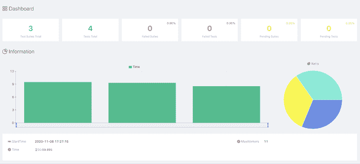

这里是[。报告的 html 文件](https://github.com/zsajjad/testing-app/blob/main/jest.report.html)。

## 添加提交前挂钩

对于大规模的应用程序(以及我们每七天工作一次的辅助项目)，最好有可靠的检查来保持代码质量。必须执行这些检查，以确保我们回购中的每个 PR 都符合标准并通过了规定的标准。

预提交钩子可以在这里帮助我们。这些钩子在每次提交之前运行。我们可以添加我们的测试任务，以确保不允许提交中断我们的任何测试。我们在这里使用了 [husky](https://github.com/typicode/husky) ，这使得添加提交挂钩变得更加容易。这是我们要添加的最后一个库:

```
yarn add -D husky
```

让我们在这里建立我们的第一个预提交钩子。npx 将在这方面帮助我们:

```
npx husky add pre-commit "yarn test" *# will create .husky/pre-commit file*
```

运行这个命令将为我们创建一个`.husky/pre-commit`文件。这是一个 bash 脚本，将在任何提交之前执行。

有时，我们的列表任务有一个`--fix`选项，在我们运行命令时对文件进行修改。在我们的例子中，我们在上面的部分中添加了一个 Jest reporter，它将在我们运行测试时创建一个新的报告文件。为了在执行预提交挂钩后将所有这些更改添加到我们的提交中，我们将更新我们的预提交文件。看起来是这样的:

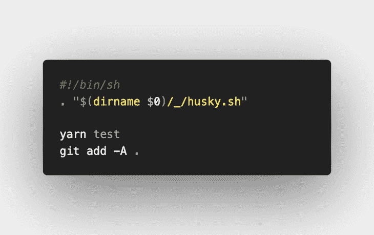

## 我们今天到此为止！

是的，我知道当你有一个完整的测试生态系统时是什么感觉——更加放松和自信，你的代码不会太快崩溃。

React 原生测试库使得遵循最佳实践更加容易，并让您的测试体验充满乐趣。它允许您以与用户交互相同的方式测试您的应用程序。确保你所有的用例都被覆盖会给你带来很大的信心——你最好相信这会让你的应用得到更高的评价。

从这里开始，您可以试用 [Detox 进行端到端测试](https://blog.logrocket.com/end-to-end-testing-in-react-native-with-detox/)；它将帮助您测试需要本机 API 的情况，如通知、深度链接和复杂的用户交互。

## [LogRocket](https://lp.logrocket.com/blg/react-native-signup) :即时重现 React 原生应用中的问题。

[](https://lp.logrocket.com/blg/react-native-signup)

[LogRocket](https://lp.logrocket.com/blg/react-native-signup) 是一款 React 原生监控解决方案，可帮助您即时重现问题、确定 bug 的优先级并了解 React 原生应用的性能。

LogRocket 还可以向你展示用户是如何与你的应用程序互动的，从而帮助你提高转化率和产品使用率。LogRocket 的产品分析功能揭示了用户不完成特定流程或不采用新功能的原因。

开始主动监控您的 React 原生应用— [免费试用 LogRocket】。](https://lp.logrocket.com/blg/react-native-signup)