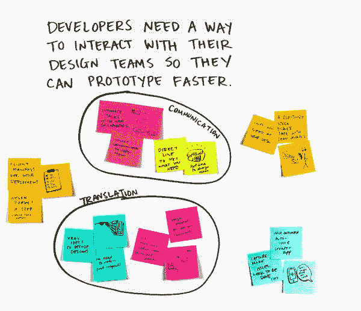
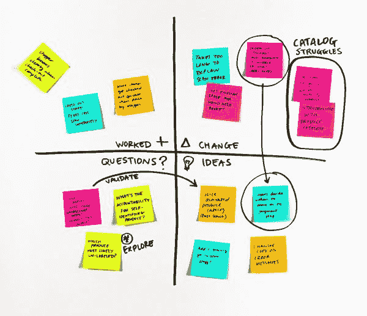
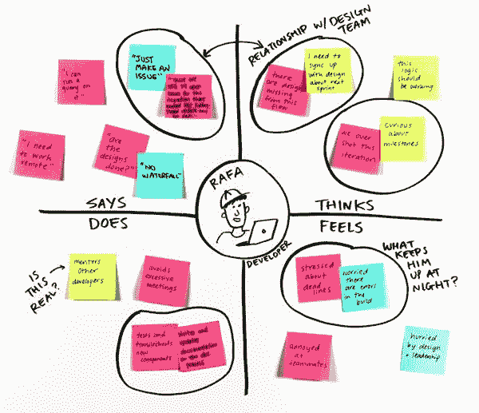
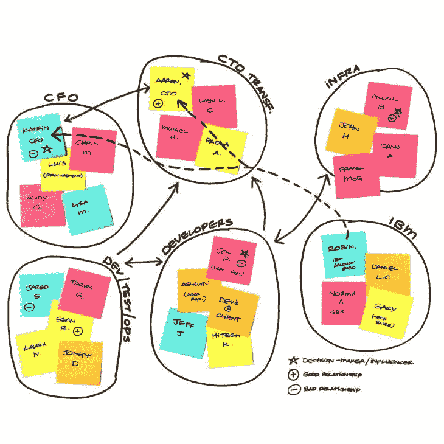

# 在 UX 设计中使用亲和图进行协作

> 原文：<https://blog.logrocket.com/ux-design/using-affinity-diagramming-collaborating-ux-design/>

相似性图表，也称为相似性映射，是一种用于有效地组织和分类信息的工具。它通常用于项目的早期阶段，以帮助识别您以前可能没有注意到的模式和关系。该过程包括收集数据，如想法或研究结果，然后根据它们的共同主题或特征将它们组织成组。

这是一个多才多艺的有效工具，可以用在广泛的场合，从头脑风暴到研究再到产品管理。它有助于理解复杂的信息，促进协作和创造力，并简化问题解决和决策过程。

在本文中，我们将深入研究亲缘关系图，包括不同的用例、它对协作的影响、最佳实践和远程使用的工具。最后，您将对流程有一个透彻的理解，并具备必要的知识和工具来促进您自己的亲和力图表会议的成功。

## 目录

## 如何使用相似性图表

亲和力图表最好在团队环境中进行，多人参与产生和组织想法。根据具体情况，可以亲自或远程完成这项工作。面对面的小组会议最有利于团队成员之间的沟通和协作，而远程会议对于地理上分散的团队来说可能更方便和有效。

### 相似性图解的步骤

1.  收集信息:这个过程通常从头脑风暴会议或研究阶段开始，在这个阶段，一组设计师或利益相关者将收集并记录想法、需求、用户反馈或研究结果
2.  **记录信息**:然后将信息记录在便利贴或索引卡上。在远程设置中，在线白板工具提供数字便签，可以方便地移动并合并文本、形状和图像。如果头脑风暴的话，请随意通过文字或图像来想象你的想法
3.  **将相似的物品分组**:然后团队合作将便签或索引卡放在一个大的表面上，比如一面墙或一张桌子，并根据它们的相似性或相似性将它们组织成组。在远程设置中，只需将您的数字便笺分组
4.  给各组贴上标签:然后给每个组贴上一个总结该组主题或想法的标题。这里的关键是找出每个群体的共性
5.  **审查和提炼**:团队成员根据需要审查和提炼小组，以确保信息以对项目有意义和相关的方式组织。在你的团队中讨论是否对小组或标签有任何不同意见
6.  确定想法的优先顺序:一旦信息被分组，团队成员就可以根据项目的需求或目标来确定想法的优先顺序。确定优先顺序的一个有效方法是进行点投票。每个参与者都有一定数量的彩色圆点，他们可以将这些圆点放在一个组中进行投票。这应该悄悄地进行，以避免影响决策。完成后，应根据获得的票数对各组进行优先排序
7.  **定义接下来的步骤**:最后，从亲和图解过程中获得的结果可用于通知设计或决策过程。设计师应该与他们的团队合作来定义接下来的步骤，例如通过设计和实现将想法变为现实

## 相似性图表用例

亲和图通常用于各种设计思维活动中，以帮助识别数据和想法中的模式、主题和联系。

### 根据用户需求陈述集思广益

亲和图可以用来产生用户需求陈述的想法。例如，一个团队可能会收集用户需求陈述，如“我需要一种方法来轻松跟踪我每天的水摄入量”和“我需要一种方法来设置服药提醒”然后，他们可以使用亲和力图来产生解决方案的想法，如带提醒的水跟踪应用程序和药物提醒应用程序。

Source: [IBM Enterprise Design Thinking Toolkit — Big Idea Vignettes](https://www.ibm.com/design/thinking/page/toolkit/activity/big-idea-vignettes)

### 反馈表格或回顾

亲和图可用于在回顾或反馈会议期间对团队成员的反馈进行组织和分类。团队成员可以在便笺上写下他们的反馈，然后使用一个有四个象限的反馈网格将相似的反馈分组在一起。四象限网格的一个例子可以是“什么有效”、“什么需要改变”、“我们的问题”和“尝试的想法”这可以帮助团队了解哪些地方做得很好，哪些地方需要改进，以及可行的后续步骤。

Source: [IBM Enterprise Design Thinking Toolkit — Feedback Grid](https://www.ibm.com/design/thinking/page/toolkit/activity/feedback-grid)

### 共情地图

亲和图可以用来组织关于用户或顾客的信息，比如他们的需求、想法、感觉和行为。这可以用来创建共鸣图，帮助团队理解用户的观点，并产生解决他们需求的解决方案的想法。

Source: [IBM Enterprise Design Thinking Toolkit — Empathy Map](https://www.ibm.com/design/thinking/page/toolkit/activity/empathy-map)

### 利益相关者地图

亲和图可以用来组织项目的不同涉众。这可以帮助团队识别相关的涉众和团队之间的任何关系，以便理解如何有效地与他们沟通。

Source: [IBM Enterprise Design Thinking Toolkit — Stakeholder Map](https://www.ibm.com/design/thinking/page/toolkit/activity/stakeholder-map)

## 相似性图表如何改善协作

亲和图是团队聚在一起，理解他们收集的所有信息的好方法。这就像一个大拼图，每个人都可以把他们的碎片拼在一起。不只是一个人做所有的工作，每个人都可以参与进来并分享他们的想法。

能够公开讨论你对某些观点的想法和意见是有益的，因为它允许想法和观点的自由流动。当每个人都能够自由表达他们的想法和观点时，它鼓励人们批判性地思考和考虑不同的观点。这可以导致对所讨论的信息的更彻底的理解和探索。它还可以识别新的见解和潜在的解决方案，否则可能不会考虑。

此外，公开讨论允许更具包容性的决策，因为每个人都可以表达自己的想法和观点。这对于那些在更正式的会议上没有机会或感觉不自在发言的团队成员来说尤其有益。最终的决定更有可能代表整个团队，而不仅仅是少数人的观点。

此外，像这样一起工作意味着每个人都在同一页上，可以确保信息以对项目有意义的方式组织。

## 使用相似性图表的最佳实践

以下是在进行关联性图解会话时要记住的一些最佳实践:

1.  考虑物理环境。最理想的是在一个足够大的房间里，团队可以四处走动，并有足够的空间放置所有的便签或索引卡。光线充足、安静、不受干扰的环境对于帮助团队保持专注和参与也很重要。
2.  让不同的团队成员和利益相关者参与进来。让来自不同学科和背景的团队成员参与进来，将确保在分析信息时考虑各种观点和专业知识。
3.  每张便笺只包含一个想法、想法、引言或图片。这允许清晰和有组织的信息，以及容易识别相似或相关的信息。它还可以根据需要轻松移动或分组便笺条，而不必担心分离不同的想法或想法。
4.  使用清晰一致的标签。为了确保每个人都在同一个页面上，在将信息组织成组时使用清晰一致的标签。这有助于让所有团队成员更容易理解和访问这些信息。
5.  保持过程的专注。相似性图表可能是一个耗时的过程；重要的是让这个过程集中在项目的目标上，不要被无关的信息转移。在会话的每个阶段使用一个计时器，这样你就不会超时。
6.  接受改变。随着过程的进展和新信息的收集，根据需要随时改变组和类别。目标是对信息有一个清晰而有意义的表示。

随着越来越多的团队远程工作，数字白板工具变得越来越受欢迎，以方便远程亲和力图表。设计界可以使用的两个流行工具是 [FigJam](https://www.figma.com/figjam/) 和 [Miro](https://miro.com/index/) 。

这些工具允许团队在虚拟白板空间中协作组织和分类信息。因为它们是基于网络的，并且可以从任何设备访问，所以它们使得远程团队能够在共享的数字空间中实时地一起工作，而不需要亲自会面。它们还提供了各种功能，如便笺、拖放功能，以及添加图像、视频和其他多媒体的能力，这使得团队成员可以轻松地组织和可视化他们的想法。

FigJam 和 Miro 都提供了带有预制布局、便笺和类别的模板，可以用作起点。这可以节省时间，并使团队成员更容易开始密切关系图表制作过程:

## 结论

关联图是一种强大的方法，可以帮助团队以结构化的方式收集、组织和分析数据。通过将相似的想法和信息组合在一起，设计师可以确保所有的想法都被考虑到，没有一个被忽略。

在设计过程中使用亲和图有几个好处。它促进团队合作和协作，有助于识别模式和关系，并可用于区分特性的优先级和为项目设定方向。

如果您想改进团队的设计流程，请考虑将亲和力图表整合到您的工作流程中。从项目早期的头脑风暴到综合用户反馈，这是一种简单而有效的方法，可以让你的设计过程更上一层楼。

*精选图片来源:* [IconScout](https://iconscout.com/icon/flowchart-6554618)

## [LogRocket](https://lp.logrocket.com/blg/signup) :无需采访即可获得 UX 洞察的分析

[LogRocket](https://lp.logrocket.com/blg/signup) 让您可以回放用户的产品体验，以可视化竞争，了解影响采用的问题，并结合定性和定量数据，以便您可以创建令人惊叹的数字体验。

查看设计选择、交互和问题如何影响您的用户— [立即尝试 LogRocket】。](hhttps://lp.logrocket.com/blg/signup)