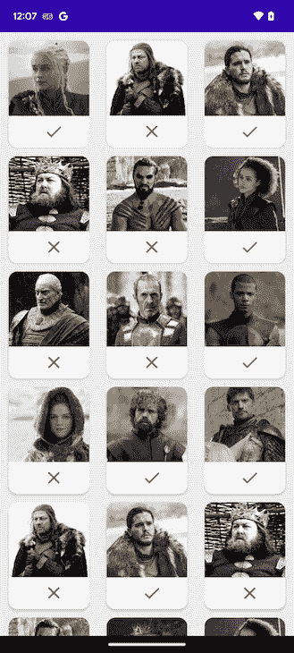

# 使用 Android 的 RecyclerView 处理复杂列表

> 原文：<https://blog.logrocket.com/using-android-recyclerview-handle-complex-lists/>

移动应用程序中最常见的功能之一是显示项目列表。这些项目的复杂程度可能会有所不同。例如，一个简单的待办事项应用程序可能只包含纯文本，而一个度假计划应用程序可能会显示一个酒店列表，每个酒店都用图片、价格信息和其他类型的细节来表示。

当处理一个复杂的用例时，你需要确保你的应用在用户滚动时的性能。如果列表视图的实现管理不善，将会导致一个落后的用户界面，因此，用户体验会让用户敬而远之。

在本文中，我们将了解如何使用`RecyclerView`和数据绑定为 Android 应用程序实现如此复杂的列表。我们将展示用于从网络加载图像并在列表中显示它们的`RecyclerView`的强大功能——这是移动应用程序的常见场景。

我们将了解如何使用数据绑定，如何实现线性或网格布局管理器，如何实现示例应用程序的 UI，以及如何使用流行的 Glide 库加载图像。向前跳:

## 为什么要在 Android 应用中使用与`RecyclerView`的数据绑定？

出于许多原因，数据绑定组合适合我们的用例。例如，`RecyclerView`优化了列表的性能，从而允许我们处理大量的图像。

此外，`RecyclerView`允许异步数据加载，所以在加载数据时 UI 线程不会被阻塞。

通过使用数据绑定，我们将把数据直接绑定到布局中的视图。因此，在适配器类中，我们将不需要处理手动数据绑定。

最后，我们可以将图像 URL 直接绑定到布局中的一个`ImageView`,图像加载库将处理加载部分

在接下来的段落中，我们将更详细地讨论`RecyclerView`带来的性能优势，我们还将编写一些代码。

## 是什么让`RecyclerView`如此高性能？

顾名思义，`RecyclerView`是 Android 中的一种视图，它以一种性能化的方式处理大量的项目列表。即使您的列表包含数百或数千个项目，用户一次也只能看到其中的几个——最有可能是五到十个项目，这取决于项目的高度和屏幕大小。

`RecyclerView`通过为 UI 上呈现的所有内容重用这五到十个视图来利用这种实现。更具体地说，当用户向上或向下滚动并且视图在屏幕的顶部或底部消失时，该项目的视图被回收并重新用于现在应该显示的新数据。

通过在用户上下滚动时简单地更新一些视图，`RecyclerView`产生了一个高性能的列表，它能够处理数百甚至数千个条目的列表，而不会对性能产生任何负面影响。它一次只在内存中保存几个视图，并在滚动列表时重用它们。

另外一个值得一提的优势是它的灵活性。通过使用不同类型的布局管理器，您可以为您的列表实现各种布局。

最常用的布局管理器类型有:

*   `LinearLayoutManager` —用于线性列表；可以是垂直的或水平的
*   `GridLayoutManager` —在具有预设列数的网格中定位项目

在下面的屏幕截图中，您可以看到一个列表，它使用了一个包含三列的`GridLayoutManager`:



如果你想看到一个正在使用的`LinearLayoutManager`,请继续阅读——我们将在最后一个例子中使用它。

既然我们已经理解了为什么在 Android 中呈现列表的首选视图是`RecyclerView`，那么让我们来看看如何将它与数据绑定一起使用并呈现大型列表——或带有图像的列表——同时保持 UI 性能以获得流畅的用户体验。

接下来的所有代码片段都是用 Kotlin 编写的。当然，布局文件是用 XML 编写的。

## 了解 Android 项目中的数据绑定

数据绑定是一个 Android 支持库，其目的是将数据源绑定到 UI 视图。通过使用数据绑定，您可以直接指定数据源中应该在每个视图中呈现的确切字段，以及应该如何呈现。

我们应该在 Android 项目中使用[数据绑定有几个原因。最有影响的原因是](https://blog.logrocket.com/data-binding-android-tutorial-with-examples/)[由于不调用`findViewById`而提高了性能](https://blog.logrocket.com/data-binding-prevent-slow-rendering-kotlin/)，更容易测试代码，增加了代码库的可读性，减少了样板文件。

例如，让我们看一个非常简单的用例，在这个用例中，我们想要显示关于我们当前用户的一些信息，比如他们的用户名、出生日期和个人资料图片。传统上，在没有数据绑定的情况下，应该是这样的。

在`UserData.kt`文件中:

```
data class UserData(val userName: String, val dateOfBirth: String, val profilePictureUrl: String)
```

在`UserProfileFragment.kt`文件中:

```
private fun displayUserInfo(user: UserData) {
  findViewById<TextView>(R.id.user_name).apply { text = userData.userName }
  findViewById<TextView>(R.id.user_dob).apply { text = userData.dateOfBirth           
  }
  findViewById<ImageView>(R.id.user_icon).apply { 
    loadImage(this, userData.profilePictureUrl)
  }
}
```

正如我们所看到的，每当我们想要基于一些数据源改变我们的 UI 部分时，我们必须找到一种方法来单独检索这些 UI 元素——在我们的例子中，通过`findViewById`。我们还必须根据数据源中感兴趣的字段，从代码中单独更新它们。

数据绑定可以让我们在布局中直接绑定这些字段，从而帮助我们避免大部分样板文件。让我们看看如何通过使用数据绑定来改进上面的例子。

创建一个名为`user_profile_fragment.xml`的文件，并添加以下内容:

```
<layout xmlns:android="http://schemas.android.com/apk/res/android">
<data>
    <import type="com.example.UserData" />
    <variable
 name ="user"
        type="com.example.UserData" />
</data>

<TextView
    android:text="@{user.userName}" />
<TextView
    android:text="@{user.userDob}" />
<ImageView
    app:profilePicture="@{user.profilePictureUrl}" />
</layout>
```

此外，在`UserProfileFragment.kt`文件中添加以下内容:

```
private lateinit var binding: UserProfileFragmentBinding

override fun onCreateView(inflater: LayoutInflater, container: ViewGroup?, savedInstanceState: Bundle?): View {
binding = UserProfileFragmentBinding.inflate(inflater, container, false)
return binding.root
}

private fun displayUserInfo(user: UserData) {
binding.user = user
}
```

正如我们所看到的，大部分 UI 逻辑现在都包含在我们的布局文件中。相对于在布局文件中包含初始的通用 UI 信息和组件，以及必须在我们的 Kotlin 代码中显式地执行任何进一步的更新，这是一个改进。

在这个例子中，使用数据绑定有三个重要的要点。

首先，我们必须在布局文件中声明数据源的类型和名称。这些可以是任何原始的或定制的类型，甚至是[可观察的源，如](https://blog.logrocket.com/understanding-kotlin-design-patterns/#observer-design-pattern) `[LiveData](https://blog.logrocket.com/understanding-kotlin-design-patterns/#observer-design-pattern)`。

在这种情况下，只要在可观察的源中设置了新值，消费视图就会自动重新呈现。请注意，对于这样的可观察源，我们还必须指定数据绑定对象的生命周期所有者。

其次，我们可以在布局中直接引用这些数据源的任何公共属性。对于更复杂的行为，比如上面例子中的`app:profilePicture`，我们必须定义定制的[绑定适配器](https://developer.android.com/topic/libraries/data-binding/binding-adapters)，我们将在最后的例子中进一步探讨。

最后，我们可以将这些数据源分配给 Kotlin 代码中的绑定对象，就像处理普通变量一样。每次我们这样做时，依赖于数据属性的所有视图都将被重新呈现。

注意，上面解释的概念指的是双向数据绑定。对于更简单的交互，我们只是想要一个更轻量级和更易于使用的替代物来代替`findViewById<>()`，[视图绑定](https://developer.android.com/topic/libraries/view-binding)总是一个好的选择。

## 向我们的`RecyclerView` Android 项目添加数据绑定

数据绑定库可用于 API 14 和更高版本。Android Gradle 插件从 1.5.0 版本开始。

过去，您还必须从支持存储库中手动添加库。但是现在，当你创建一个项目时，它会被 Android Studio 自动添加到构建配置中。

因此，要使用数据绑定，您唯一需要做的就是在`build.gradle`中将它标记为启用:

```
android {
    ...
    buildFeatures {
        dataBinding true
    }
}
```

就是这样！在快速梯度同步之后，数据绑定就可以在我们的项目中使用了。

要告诉数据绑定库它需要为某个布局生成一个绑定对象，只需用一个`<layout>`标签包装我们布局文件中最顶端的视图，就像我们在上面的例子中看到的那样。

在这之后，或者在项目第一次成功构建之后，将会根据布局文件的名称自动为我们生成一个绑定类，并在其后附加一个`Binding`后缀。

这一步已经允许我们放弃重复的`findViewById<>`调用，因为布局文件中定义了`id`的所有视图都可以作为绑定对象的属性。然而，要真正使用数据绑定的所有功能，我们必须在包装在`<data>`标签内的部分的布局中添加一些变量。

## 用 Android 的`RecyclerView`和数据绑定处理复杂列表

既然我们已经对数据绑定和`RecyclerView`各自的工作原理有了基本的了解，现在是时候来看看如何在 Android 中一起使用它们来呈现复杂的列表了。

假设我们想要显示一个《权力的游戏》角色列表。对于这些角色中的每一个，我们想要显示一个名字、一个头衔列表、一个图像和一个可选的死因字段。接下来，我们将完成一个基本的 Android 应用，它使用了强大的`RecyclerView`

因为我们正在设计一个列表，所以第一步显然是实现列表项的 UI 数据模型和布局。创建一个名为`CharacterInfo.kt`的文件，并添加以下代码:

```
data class CharacterInfo(
    val name: String,
    val titles: List<String>,
    val imageUrl: String,
    val causeOfDeath: String?
) { 
    val titlesLabel: String get() = titles.joinToString(", ")
    val isAlive: Boolean get() = causeOfDeath.isNullOrEmpty()
}
```

我们在这里所做的与第一个例子非常相似。我们刚刚创建了一个简单的数据类，包含了我们需要在列表中显示的所有信息。我们添加的额外助手属性——`titlesLabel`和`isAlive`——将使解释 XML 中的信息变得更加容易。

现在，让我们设置列表项的布局。创建一个`character_list_item.xml`文件并添加以下内容:

```
<layout>
    <data>
        <import type="com.example.domain.CharacterInfo" />

        <import type="android.view.View" />

        <variable name="character"
            type="com.example.domain.CharacterInfo" />

            <variable name="listener"
          type="com.example.gotchars.CharactersListAdapter.OnClickListener" 
             />
    </data>

    <ConstraintLayout
            android:onClick="@{() -> listener.onClick(character)}">

        <ImageView android:id="@+/characterStatusIcon"
                  app:displayAsAlive="@{character.isAlive}" />

        <TextView android:id="@+/characterName"
                  android:text="@{character.name}" />

        <TextView android:id="@+/characterTitles"
                  android:text="@{character.titlesLabel}" />

        <ImageView android:id="@+/characterImage"
                  app:imageUrl="@{character.imageUrl}" />

        <TextView android:id="@+/characterCauseOfDeath"
                android:text="@{character.causeOfDeath}"
                android:visibility="@{character.isAlive ? View.GONE : View.VISIBLE}"    
        />
    </ConstraintLayout>
</layout>
```

查看这段代码时，您可能会注意到两件事。

首先，数据绑定语法允许语句和条件。当一条 UI 信息没有通过属性显式公开，而是可以从现有属性中推导出来时，这些就很方便了——例如,`characterCauseOfDeath`视图是否需要可见。

其次，我们能够通过数据绑定定义定制的 XML 属性，比如`app:imageUrl`和`app:displayAsAlive`。Android 自然不知道默认如何处理这些。我们必须实现一个叫做`BindingAdapter`的东西来告诉框架如何处理这些属性:

```
// Adapters.kt

@BindingAdapter("imageUrl")
fun loadImage(view: ImageView, val imageUrl: String) {
    Glide.with(view.context)
            .load(imageUrl)
            .centerCrop()
            .placeholder(R.drawable.ic_placeholder)
            .diskCacheStrategy(DiskCacheStrategy.ALL)
            .into(view)
}

@BindingAdapter("showAsAlive")
fun showIconAsAlive(view: ImageView, isAlive: Boolean) {
    val iconResource = if (isAlive) R.drawable.ic_checkmark else R.drawable.ic_cross
        val iconTint = if (isAlive) android.R.color.holo_green_dark else android.R.color.holo_red_dark
        view.setImageResource(iconResource)
        DrawableCompat.setTint(
                DrawableCompat.wrap(view.drawable),
                ContextCompat.getColor(view.context, iconTint)
        )

}
```

这些适配器不需要在任何地方进一步声明。只要将它们作为公共的全局函数，数据绑定注释处理器就可以找到并解释它们。

既然我们已经获得了列表项逻辑的代码，那么是时候为我们的`RecyclerView`实现适配器了。

创建一个名为`CharactersListAdapter.kt`的文件，并添加以下代码:

```
class CharactersListAdapter() : RecyclerView.Adapter<CharacterViewHolder>() {

    fun interface OnClickListener {
         fun onClick(character: CharacterInfo)
    }

    var characters: List<CharacterInfo> = listOf()
        set(value) {
            field = value
            notifyDataSetChanged()
        }

    override fun getItemCount(): Int  = characters.size

    override fun onCreateViewHolder(parent: ViewGroup, viewType: Int): CharacterViewHolder {
        val layoutInflater = LayoutInflater.from(parent.context)
        val binding = CharacterListItemBinding.inflate(layoutInflater, parent, false)
                binding.listener = OnClickListener { character: CharacterInfo ->
                     Toast.makeText(parent.context, "Clicked on ${character.name}", Toast.LENGTH_SHORT).show()
                }
        return CharacterViewHolder(binding)
    }

    override fun onBindViewHolder(holder: CharacterViewHolder, position: Int) {
        holder.bind(characters[position])
    }

    class CharacterViewHolder(private val binding: CharacterListItemBinding) :
            RecyclerView.ViewHolder(binding.root) {

        fun bind(character: CharacterInfo) {
            binding.character = character
     }
}
```

此外，创建一个名为`CharactersFragment.kt`的文件，并添加以下代码:

```
class CharactersFragment : Fragment() { 

    private lateinit var binding: CharactersFragmentBinding
    private val adapter: CharactersListAdapter = CharactersListAdapter()

    // ... inflate the binding object

    override fun onViewCreated(view: View, savedInstanceState: Bundle?) { 
        binding.charactersList.adapter = adapter
        binding.charactersList.layoutManager = LinearLayoutManager(requireContext())
    }

    private fun onCharactersLoaded(characters: List<CharacterInfo>) { 
        adapter.characters = characters
    }
}
```

在下面的 GIF 中，您可以观察到我们代码的最终输出:


你可能会注意到上面的 GIF 有一点滞后。请注意，该列表在现实生活中运行顺畅——您可以亲自尝试一下！将屏幕录制转换为 GIF 时出现延迟。

正如我们在上面的代码片段中看到的，适配器代码及其对`RecyclerView`的赋值与任何其他传统的`RecyclerView`非常相似。唯一的区别在于`ViewHolder`的视图是如何膨胀和分配的，以及在必要时绑定个人`ViewHolders`有多简单。

这一切都是可能的，因为数据绑定以及我们如何构建布局来自动解释 UI 数据对象。

## 使`RecyclerView`列表项目具有交互性

如果没有使用数据绑定，为了让我们的项目响应用户点击，我们必须在适配器中应用一些样板逻辑。

然而，在我们的例子中，我们采用的方法是定义一个`OnClickListener`接口。然后，通过数据绑定，我们直接将该接口的实例作为变量传递给视图。

接下来，我们的视图将利用`android:onClick`属性中的侦听器，在 lambda 表达式中调用它，并将字符变量的值作为参数传递。

在我们的例子中，我们只是告诉列表项的根节点`ConstraintLayout`调用一个方法，该方法打印列表项绑定到的字符的名称。

小注意:`OnClickListener`接口开头的 fun 关键字使它成为了一个[函数接口](https://kotlinlang.org/docs/fun-interfaces.html)，它告诉编译器它将有恰好一个方法。这将让我们用更简单的语法创建该接口的实例，正如您在我们的示例中看到的。

## 切换到网格布局

在代码片段和上一张 GIF 中，你可能注意到我们使用了线性布局。在文章的开始，我们还在一个每行有三个项目的网格布局中预览了我们的列表。

将线性布局转换成网格布局很容易。您可以使用以下三个步骤简单地转换代码片段。

首先，为您将在网格中使用的列表项定义新的`.xml`布局。根据你允许你的 UI 有多忙，你可以让它们更复杂或不复杂。

接下来，更新`RecyclerView.Adapter`中的`ViewHolder`,创建并绑定新类型的列表项/

最后，用一个`GridLayoutManager`替换`RecyclerView`初始化中的`LinearLayoutManager`，就像这样:

```
GridLayoutManager(requireContext(), 3, GridLayoutManager.VERTICAL, false)
```

`GridLayoutManager`期望的四个参数是:

*   语境
*   span count——在我们的例子中，是每行的项目数
*   布局方向—垂直或水平
*   标志—指定布局是否应该反转

关于复杂列表，更重要的一点是，正如在《权力的游戏》中一样，数据很少是静态的。在我们的例子中，列表中显示的角色不太可能存活太久。即使在最初创建我们的`RecyclerView`之后，项目的数量和它们各自的状态也可能经常改变。

在这些情况下，只需向我们的适配器传递一个新的条目列表并调用`notifyDataSetChanged`就可以完成显示新数据的工作。然而，这是非常低效的，尤其是对于较长的列表，并且不能提供最佳的用户体验。

因此，对于这些更复杂的`RecyclerView`用例，`RecyclerView`适配器应该换成`ListAdapter`——可以以同样的方式分配给`RecyclerView`——同时还集成了`DiffUtil`接口。

虽然在实现`RecyclerView`时并不强制使用`DiffUtil`类，但是如果列表会频繁更改或更新，例如，如果用户能够从列表中删除或重新排序项目，那么它就是一个有用的实用程序类。

当实现这个接口时，`ListAdapter`将能够精确地计算出列表的哪些区域需要更新，哪些条目需要添加或删除，而不需要在每次更新时重新创建整个列表。

## 结论

在本文中，我们研究了 Android 的`RecyclerView`，在本文发表时，它是以不影响 UI 性能的方式处理显示数据的最有效方式。

我们还探索了将数据绑定添加到项目中，以及它给项目带来的好处:更易读的代码，更少的样板文件，以及由于不使用`findViewById`而带来的更好的性能。

感谢您的阅读！我希望这篇文章对你有用。不要犹豫，在评论中开始对话吧！

## LogRocket :即时重现你的安卓应用中的问题。

[](https://lp.logrocket.com/blg/kotlin-signup)

[LogRocket](https://lp.logrocket.com/blg/kotlin-signup) 是一款 Android 监控解决方案，可以帮助您即时重现问题，确定 bug 的优先级，并了解您的 Android 应用程序的性能。

LogRocket 还可以向你展示用户是如何与你的应用程序互动的，从而帮助你提高转化率和产品使用率。LogRocket 的产品分析功能揭示了用户不完成特定流程或不采用新功能的原因。

开始主动监控您的 Android 应用程序— [免费试用 LogRocket】。](hhttps://lp.logrocket.com/blg/kotlin-signup)