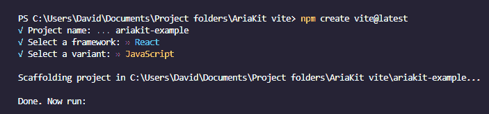
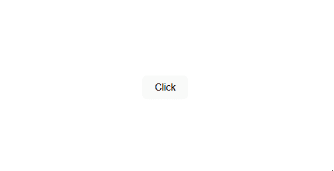
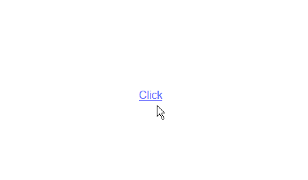
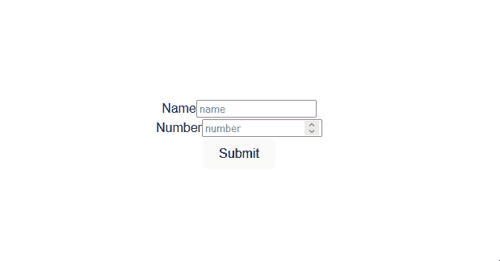
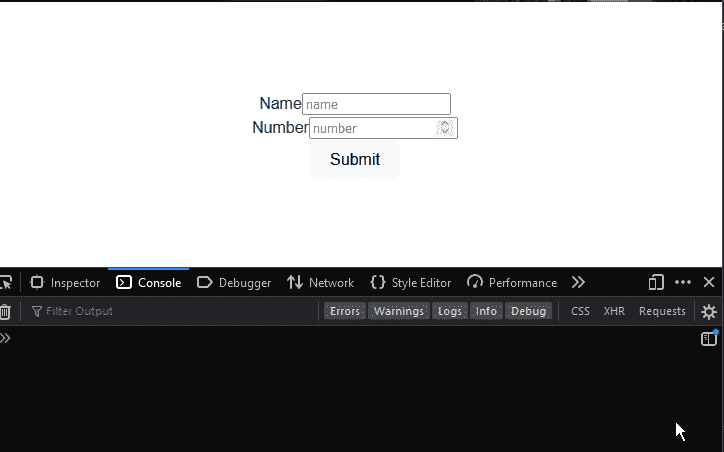
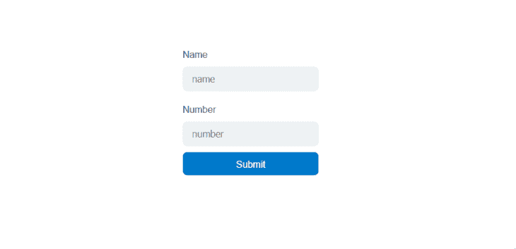
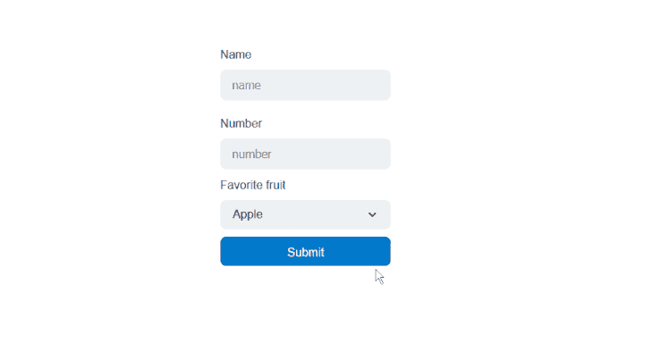

# 在 react 应用中使用 arianit 组件

> 原文：<https://blog.logrocket.com/using-ariakit-components-react-apps/>

上网者的听觉、视觉和认知能力各不相同。这就是为什么可访问性已经成为构建 web 应用程序的一个重要部分。

开发人员的任务是消除许多人在现实世界中面临的沟通和交互障碍。我们的目标是设计适用于所有人的解决方案和工具，而不管他们的语言、位置、能力或者他们使用的硬件或软件。

不幸的是，尽管可访问性很重要，但它仍然是 web 开发中一个相当复杂的方面。因此，许多开发人员回避将易访问性融入他们的项目中。相反，他们最终会构建设计糟糕的应用程序，制造障碍(而不是消除障碍)，无意中将某些人排除在网络之外。

在本文中，我们将介绍 [Ariakit](https://ariakit.org) ，这是一个开源的低级组件工具包，用于在 React 中构建可访问的 web 应用程序。我们将演示如何使用 Ariakit 的组件来轻松高效地构建可访问的 web 应用程序。

*向前跳转:*

## 先决条件

要跟随本教程，您需要以下内容:

*   React 及其概念的工作知识
*   您的计算机上安装了最新版本的 Node.js

## 什么是 Ariakit？

Ariakit 提供了各种 UI 组件，如`Form`、`Dialog`、`Tab`、`Tooltip`等等，可以用来快速构建易访问性驱动的 web 应用程序、UI 库和设计系统。

如果可访问性是您的首要任务之一，您会发现 Ariakit 很有用；它的组件遵循 [WAI-ARIA 的建议](https://www.w3.org/WAI/standards-guidelines/aria/)并带有内置的可访问性。

## 安装和集成 arianit

在我们进入 Ariakit 如何工作以及如何使用它之前，让我们看看如何将它安装并集成到 React 应用程序中。

第一步是打开您的命令行工具，`cd`进入一个项目文件夹，并运行以下命令来安装 Ariakit:

```
npm i ariakit

```

如果您没有现有的项目，并且希望按照本教程进行操作，您可以继续使用 Vite CLI 安装 React:

```
npm create [email protected]

```

该命令将提示您选择项目的首选项。选择以下选项继续:



安装完成后，运行下面的代码将`cd`放入项目文件夹，安装必要的依赖项，并启动开发服务器:

```
  cd ariakit-example
  npm install
  npm run dev

```

我们准备好了；现在我们可以开始将 Ariakit 组件导入到我们的项目中。

## 了解 Ariakit 的构建模块

Ariakit 是组件和挂钩的集合。每个组件接受三种道具:`options`、`attribute`、`state`。

让我们仔细看看。

### `options`道具

属性是影响内部组件行为的自定义属性。它们在构建时转换成实际的 HTML 属性:

```
import { Button } from "ariakit";
import "./App.css";

function App() {
  return (
    <div className="App">
      <div>
        <Button hidden>Click</Button>
      </div>
    </div>
  );
}

export default App;

```

在上面的例子中，`hidden`道具是一个`options`道具；它将从视图中隐藏原本可见的组件。在这种情况下，它会在浏览器中隐藏`Button`组件。

### `attribute`道具

`attribute`道具是实际的 HTML 属性；你很可能已经熟悉这种类型的道具。下例中的`className`道具是一个`attribute`道具:

```
<Button hidden className=”btn”>Click</Button>

```

### `state`道具

属性将有状态的钩子和变量附加到组件上。Ariakit 提供内置`state`挂钩；您可以使用它们，也可以自己创建:

```
import { Checkbox, useCheckboxState } from "ariakit";
import "./App.css";

function App() {
  const checked = useCheckboxState({ defaultValue: true });
  return (
    <div className="App">
      <div>
        <h1>hello</h1>
        <label className="label">
          <Checkbox className="checkbox" state={checked} /> I have read and
          agree to the terms and conditions
        </label>
      </div>
    </div>
  );
}

```

在上面的例子中，`useCheckboxState`函数是一个`state`钩子，我们通过`state` prop 将它传递给`Checkbox`组件。

我们将在本文后面了解更多关于`state`钩子的内容。

### `as`道具

除了`options`、`attribute`、`state`道具，组件还可以接受一个`as`道具。此道具用于通过将其他组件或标签(例如，子组件)注入现有组件或标签来扩充组件。简单来说，它用于更改组件类型。

例如，假设您有一个`Button`组件，您希望它的行为像一个链接元素。您所需要做的就是将一个带有`a`标签值的`as`道具传递给组件，就像这样:

```
function App() {
  return (
    <div className="App">
      <div>
        <Button as="a" href="#">
          Click
        </Button>
      </div>
    </div>
  );
}

```

这是添加`as`道具之前的`Button`组件:



这是添加了`as`道具后的`Button`组件；它的外观和行为类似于链接元素:



### `state`挂钩

如前所述，Ariakit 提供了各种各样的`state`钩子，我们可以用它们来管理应用程序中组件的状态。这些`state`挂钩是为其各自组件的特定用途定制的，这意味着每个组件都被分配了一个特定的`state`挂钩。

例如，如果我们想要处理一个`checkbox`组件的状态逻辑，我们可以使用`useCheckboxState`钩子。同样，我们将使用`useFormState`钩子来处理`form`组件的状态逻辑。

Ariakit `state`钩子接受一个对象作为初始值，并返回一个带有选项的对象，这些选项是它们各自的组件所需要的:

```
const combobox = useComboboxState({ gutter: 8, sameWidth: true });

```

在上面的例子中，`gutter`和`sameWidth`对象属性是`useComboboxState`钩子的初始值。`combobox`组件可以通过`combobox`变量访问返回的对象选项:

```
<Combobox state={combobox} placeholder="e.g., Apple" className="combobox" />;

```

因为有些状态需要更复杂的逻辑，Ariakit 还提供了插入您自己的状态的选项。

## 式样

Ariakit 不依赖于任何 CSS 库。因此，默认情况下，它不附带预先样式化的组件。这意味着我们可以使用任何方法来设计组件的样式。这可能包括使用内联样式、模块、样式组件或外部 [UI 库，如 Tailwind](https://blog.logrocket.com/whats-new-tailwind-css-v3-0/) 。

由于每个组件返回一个接受`attribute`属性的 HTML 元素，我们可以使用`style`属性向组件添加内联样式，并使用`className`属性添加可以在外部 CSS 文件中引用的类:

```
<Button className="button" style={{backgroundColor: "orange"}}>Button</Button>

```

现在我们已经了解了 Ariakit 的概念及其组件的工作原理，让我们看看如何在我们的项目中使用它们。

## 使用 arianit 组件

虽然 Ariakit 是一个低级库，但是它的组件是由一个高级 API 导出的。这使得它们不像其他低级库那样冗长，并且易于使用。

在本文的前面，我们演示了如何使用简单的组件，如`Button`或`CheckBox`。现在，让我们看看如何使用复杂的组件，如`form`、`tab`、`select`等等。

### `form`

Ariakit 的`form`组件不仅具有内置的可访问性，它还提供了某种级别的验证，因此您不必担心在验证上浪费时间。

* * *

### 更多来自 LogRocket 的精彩文章:

* * *

要使用 Ariakit 的`form`组件，首先将以下组件导入您的项目:

```
import {
  Form,
  FormError,
  FormInput,
  FormLabel,
  FormSubmit,
  useFormState,
} from "ariakit";

```

在这里，我们导入了`Form`组件和其他组件，我们将把它们用于输入字段、标签、提交按钮、验证错误和表单状态挂钩。

接下来，将`useFormState`钩子赋给一个变量，并向它传递一个默认值，如下所示:

```
  const form = useFormState({
    defaultValues: { name: "", number: 0 },
  });  

```

现在，用`Form`组件创建表单，并使用`FormLabel`和`FormInput`组件添加您想要的任意多个字段。在我们的例子中，我们将添加一个`name`字段和一个`number`字段。

```
function App() {
  const form = useFormState({
    defaultValues: { name: "", number: 0 },
  });
  return (
    <div className="App">
      <Form state={form}>
        <div className="field name">
          <FormLabel name={form.names.name}>Name</FormLabel>
          <FormInput name={form.names.name} required placeholder="name" />
          <FormError name={form.names.name} className="error" />
        </div>
        <div className="field number">
          <FormLabel name={form.names.number}>Number</FormLabel>
          <FormInput
            name={form.names.number}
            type="number"
            required
            placeholder="number"
          />
          <FormError name={form.names.number} className="error" />
        </div>
        <FormSubmit>Submit</FormSubmit>
      </Form>
    </div>
  );
}

```

如您所见，每个输入字段及其对应的组件都封装在各自的`div`元素中。

我们使用`name`支柱将每个`FormInput`组件连接到`useFormState`挂钩上。这样，钩子将可以访问输入字段的状态和值。

我们对`FormError`组件做了同样的事情，但是与`FormInput`组件不同的是，`FormError`将检查`useFormState`钩子在它所链接的输入字段中的错误。

如果此时保存更改，当您尝试提交表单而不填充输入字段时，应该会收到一条错误消息:



获取表单数据同样简单，我们所要做的就是将一个`values`方法链接到`form`变量:

```
form.values

```

理想情况下，我们只需要表单提交时的数据，所以我们需要创建一个在表单提交时触发的函数。

幸运的是，`useFormState`钩子提供了一个接受回调函数的`useSubmit`函数，这个函数在表单提交时被触发。

```
  form.useSubmit(() => {
    ...
  });  

```

如果我们希望在提交表单时将表单数据记录到控制台，我们应该这样做:

```
  form.useSubmit(() => {
    console.log(form.values);
  });

```



接下来，我们将看看`select`组件，以及如何将它添加到我们的表单中。但是首先，让我们把表单设计得更吸引人。

我们将通过给组件添加一个`className`属性，用我们通常处理常规 JSX 元素的方式来处理这个问题:

```
<Form state={form} className="form">
        <div className="field">
          <FormLabel name={form.names.name} className="label">
            Name
          </FormLabel>
          <FormInput
            name={form.names.name}
            required
            placeholder="name"
            className="name"
          />
          <FormError name={form.names.name} className="error" />
        </div>
        <div className="field">
          <FormLabel name={form.names.number} className="label">
            >Number
          </FormLabel>
          <FormInput
            name={form.names.number}
            type="number"
            required
            placeholder="number"
            className="number"
          />
          <FormError name={form.names.number} className="error" />
        </div>
        <FormSubmit className="button"
>Submit</FormSubmit>
      </Form> 

```

接下来，我们将样式化 CSS 文件中的组件:

```
.form {
  width: 280px;
  min-height: 320px;
  display: flex;
  flex-direction: column;
  gap: 1rem;
  padding-top: 2.5rem;
  padding-bottom: 2.5rem;
}

.field {
  display: flex;
  flex-direction: column;
  gap: 0.5rem;
  align-items: flex-start;
}

.field input {
  height: 2.5rem;
  width: 100%;
  border-radius: 0.5rem;
  border-style: none;
  background-color: hsl(204, 20%, 94%);
  padding-left: 1rem;
  padding-right: 1rem;
  font-size: 1rem;
  line-height: 1.5rem;
  color: hsl(204, 10%, 10%);
}

.field input:hover {
  background-color: hsl(204, 20%, 91%);
}

.field input:focus-visible,
.field input[data-focus-visible] {
  outline: 2px solid hsl(204, 100%, 40%);
}

.field:nth-child(1){
  margin-bottom: 20px;
}

.field:nth-child(2){
  margin-bottom: 10px;
}

.button {
  height: 2.5rem;
  width: 100%;
  cursor: pointer;
  align-items: center;
  justify-content: center;
  gap: 0.25rem;
  white-space: nowrap;
  border-radius: 0.5rem;
  border-style: none;
  background-color: hsl(204, 100%, 40%);
  padding-left: 1rem;
  padding-right: 1rem;
  font-size: 1rem;
  line-height: 1.5rem;
  color: hsl(0, 0%, 100%);
}

.error:empty {
  position: absolute;
}

.error:not(:empty) {
  border-radius: 0.5rem;
  border-width: 1px;
  border-color: hsl(357, 56%, 72%);
  background-color: hsl(357, 56%, 90%);
  padding-top: 0.5rem;
  padding-bottom: 0.5rem;
  padding-left: 1rem;
  padding-right: 1rem;
  color: hsl(357, 100%, 30%);
}

.number {
  -moz-appearance: textfield;
}

.number::-webkit-outer-spin-button,
.number::-webkit-inner-spin-button {
  -webkit-appearance: none;
  margin: 0;
}

```



### `select`

要向表单添加一个`select`组件，我们将首先导入它及其相应的组件:

```
import {
  ...
  Select,
  SelectItem,
  SelectLabel,
  SelectPopover,
  useSelectState,
} from "ariakit";

```

我们将使用`Select`、`selectItem`和`SelectLabel`组件分别创建选择、选项和标签元素。

此外，我们将使用`useSelecteState`钩子来设置`select`元素的默认值，并通过`state`属性将其传递给组件。`selectPopover`组件将作为选择选项的下拉菜单。

接下来，让我们将`useSelecteState`钩子赋给一个变量，并将默认值传递给它，就像这样:

```
const select = useSelectState({
  defaultValue: "Apple",
  sameWidth: true,
  gutter: 4,
});

```

如您所见，我们不仅设置了默认值，还设置了选择选项的默认`width`和`gutter`大小。

接下来，转到表单，添加`Select`组件及其对应的组件，并将状态传递给它们:

```
<div className="select">
  <SelectLabel state={select}>Favorite fruit</SelectLabel>
  <Select state={select} className="select" />
  <SelectPopover state={select} className="popover">
    <SelectItem className="select-item" value="Apple" />
    <SelectItem className="select-item" value="Banana" />
    <SelectItem className="select-item" value="Grape" disabled />
    <SelectItem className="select-item" value="Orange" />
  </SelectPopover>
</div>

```

我们在这里所做的很简单，我们将`Select`组件链接到`state`钩子，然后使用`SelectItem` **在其中嵌套几个选项。**

继续，打开你的 CSS 文件，用下面的样式更新它:

```
.wrapper {
  display: flex;
  flex-direction: column;
  gap: 0.5rem;
  align-items: flex-start;
}

.select {
  width: 116%;
  display: flex;
  height: 2.5rem;
  cursor: default;
  align-items: center;
  justify-content: space-between;
  gap: 0.25rem;
  white-space: nowrap;
  border-radius: 0.5rem;
  background-color: hsl(204, 20%, 94%);
  padding-left: 1rem;
  padding-right: 1rem;
  font-size: 1rem;
  line-height: 1.5rem;
  margin-bottom: 10px;
}

.select:hover {
  background-color: hsl(204, 20%, 91%);
}

.popover {
  max-height: min(var(--popover-available-height, 300px), 300px);
  z-index: 50;
  display: flex;
  flex-direction: column;
  overflow: auto;
  overscroll-behavior: contain;
  border-radius: 0.5rem;
  border-width: 1px;
  border-style: solid;
  border-color: hsl(204, 20%, 88%);
  background-color: hsl(204, 20%, 100%);
  padding: 0.5rem;
  color: hsl(204, 10%, 10%);
  filter: drop-shadow(0 4px 6px rgba(0, 0, 0, 15%));
}

.select:focus-visible,
.select[data-focus-visible],
.popover:focus-visible,
.popover[data-focus-visible] {
  outline: 2px solid hsl(204, 100%, 40%);
}

.select-item {
  outline: none !important;
  display: flex;
  cursor: default;
  scroll-margin: 0.5rem;
  align-items: center;
  gap: 0.5rem;
  border-radius: 0.25rem;
  padding: 0.5rem;
}

```

现在，如果您保存您的进度并返回浏览器，您应该会看到类似如下的内容:



## 结论

本文展示了 Ariakit 的`button`、`checkbox`、`form`和`select`组件，并演示了它们的功能。这些只是 Ariakit 提供的部分组件。

Ariakit 有一个组件可以满足构建成熟的 web 应用程序的大多数要求。在撰写本文时，Ariakit 的文档并不完整，但网站确实提供了大量的[组件示例](https://ariakit.org/components)。

## 使用 LogRocket 消除传统反应错误报告的噪音

[LogRocket](https://lp.logrocket.com/blg/react-signup-issue-free)

是一款 React analytics 解决方案，可保护您免受数百个误报错误警报的影响，只针对少数真正重要的项目。LogRocket 告诉您 React 应用程序中实际影响用户的最具影响力的 bug 和 UX 问题。

[ ](https://lp.logrocket.com/blg/react-signup-general) [  ](https://lp.logrocket.com/blg/react-signup-general) [LogRocket](https://lp.logrocket.com/blg/react-signup-issue-free)

自动聚合客户端错误、反应错误边界、还原状态、缓慢的组件加载时间、JS 异常、前端性能指标和用户交互。然后，LogRocket 使用机器学习来通知您影响大多数用户的最具影响力的问题，并提供您修复它所需的上下文。

关注重要的 React bug—[今天就试试 LogRocket】。](https://lp.logrocket.com/blg/react-signup-issue-free)