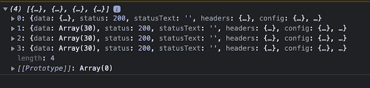
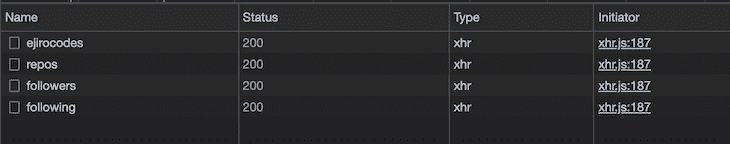
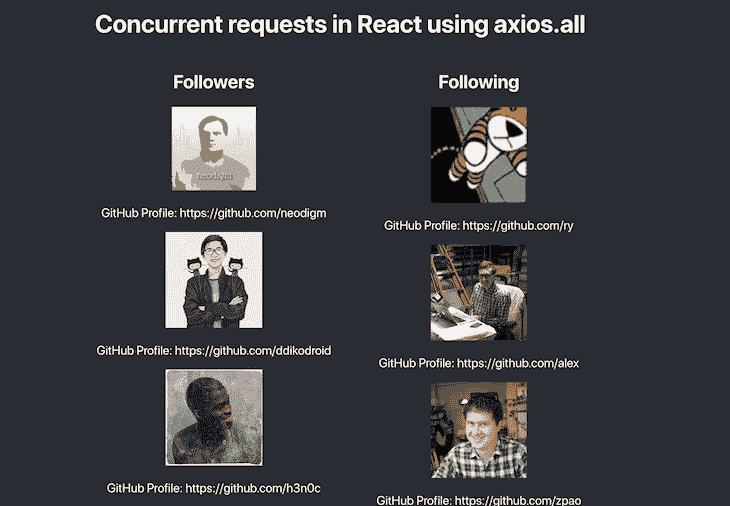

# 使用 axios.all 进行并发请求

> 原文：<https://blog.logrocket.com/using-axios-all-make-concurrent-requests/>

`axios.all`是 Axios 内置的一个助手方法，用来处理并发请求。`axios.all`方法允许我们一起向端点发出多个 HTTP 请求，而不是分别发出多个 HTTP 请求。

`axios.all`函数接受一个必须是承诺的 iterable 对象，比如一个 JavaScript 数组，它返回一个响应数组。

在这篇文章中，我们将学习如何使用`axios.all`函数发出 HTTP 请求，使用`Promise.all`和`axios.all`的区别，以及在 Axios 中发出并发 API 请求。

## 使用`axios.all`

为了开始使用`axios.all`方法，让[向以下端点发出一个 HTTP 请求](https://blog.logrocket.com/how-to-make-http-requests-like-a-pro-with-axios/):

```
let endpoints = [
  'https://api.github.com/users/ejirocodes',
  'https://api.github.com/users/ejirocodes/repos',
  'https://api.github.com/users/ejirocodes/followers',
  'https://api.github.com/users/ejirocodes/following'
];

axios.all(endpoints.map((endpoint) => axios.get(endpoint))).then(
  (data) => console.log(data),
);

```

这里，我们声明了一个端点数组，我们称之为`endpoints`，并在 Axios 实例上调用`.all`方法。这映射通过端点数组中的每个项目。然后，在 Axios 实例上使用`GET`方法向我们的端点列表发出请求，我们从服务器获得每个响应。

该请求返回一个数组作为响应，数组中的数据根据我们的`endpoints`数组排序，这意味着 Axios 必须首先从以下端点获取数据:

```
https://api.github.com/users/ejirocodes

```

然后，从端点返回的最后数据如下:

```
https://api.github.com/users/ejirocodes/following

```

现在，让我们打开浏览器开发人员控制台和网络选项卡，确认 API 响应的顺序。





您可能会考虑坚持使用常规的`GET`方法分别发出多个 API 请求。但是，不像`axis.get`方法，如果一个承诺解决或拒绝，它不会影响其他人。使用`axios.all`方法，如果我们的一个承诺失败了，整个请求就失败了。

这意味着当我们使用`axios.all`时，为了从我们的端点获得成功的响应，所有的请求必须是成功的。

现在让我们通过添加`axios.spead`方法来重构我们的代码。该方法接受回调，并可以析构我们的响应数组，这使得我们的代码更具可读性:

```
let endpoints = [
  'https://api.github.com/users/ejirocodes',
  'https://api.github.com/users/ejirocodes/repos',
  'https://api.github.com/users/ejirocodes/followers',
  'https://api.github.com/users/ejirocodes/following'
];

axios.all(promises.map((promise) => axios.get(promise))).then(
  axios.spread((user, repos, followers, following) => {
    console.log({ user, repos, followers, following });
  })
);

```

注意`axios.spread` helper 函数是多么有用:我们可以用它一次性获得所有数据，然后在回调中使用它。

通过这样调用`axios.spread((user, repos, followers, following)`，我们可以说我们想要命名 Axios 调用的第一个响应，`user`和`repo`。

现在，让我们把我们在顶部的东西带得更远一点；让我们取出将由服务器发送的[数据对象:](https://github.com/axios/axios#response-schema)

```
axios.all(endpoints.map((endpoint) => axios.get(endpoint))).then(
  axios.spread(({data: user}, {data:repos}, {data:followers}, {data:following}) => {
    console.log({ user, repos, followers, following });
  })
);

```

我们可以用 [Axios 的响应模式](https://github.com/axios/axios#response-schema)为每个包含以下数据对象的请求做这件事，这是服务器提供的响应。

所以本质上，我们使用对象析构来解包值，也就是说，将响应对象中的`data`解包成不同的变量，比如`user`、`repos`、`followers`和`following`。

另外，请注意，我们正在从每个响应中析构数据，并分别将其重命名为`user`、`repos`、`followers`和`following`。

## `Promise.all`对`axios.all`

截至[2020 年 7 月 15 日](https://github.com/axios/axios/blob/76f09afc03fbcf392d31ce88448246bcd4f91f8c/CHANGELOG.md#0200-pre-july-15-2020)，Axios 更新了其 [GitHub 自述](https://github.com/axios/axios#concurrency-deprecated)文件，反映`axios.all` helper 方法已被弃用，[应替换为](https://blog.logrocket.com/understanding-promise-all-in-javascript/) `[Promise.all](https://blog.logrocket.com/understanding-promise-all-in-javascript/)`。

既然有一个[非官方的提议要在 Axios 版本 1 中完全去掉](https://github.com/axios/axios/issues/1042) `[axios.all](https://github.com/axios/axios/issues/1042)` [和](https://github.com/axios/axios/issues/1042) `[axios.spread](https://github.com/axios/axios/issues/1042)` [方法](https://github.com/axios/axios/issues/1042)，那么让我们来看看如何使用像`Promise.all`和 ES6 参数析构这样的原生 JavaScript 特性来废除`axios.all`方法。

请注意，只有单据提供折旧，而不是代码库/库。因此，`axios.all`在最新版本的 Axios 中仍然有效，许多开发人员仍然在现代代码库中使用`axios.all`。指出这种贬值是因为预计`axios.all`会在未来的某个时候被取代。

然而，此时我们应该考虑一件重要的事情。`axios.all`是用 JavaScript 中的[原生](https://developer.mozilla.org/en-US/docs/Web/JavaScript/Reference/Global_Objects/Promise/all) `[Promise.all](https://developer.mozilla.org/en-US/docs/Web/JavaScript/Reference/Global_Objects/Promise/all)` [方法构建的助手方法。这意味着我们可以很容易地用`promise.all`代替`axios.all`方法。](https://developer.mozilla.org/en-US/docs/Web/JavaScript/Reference/Global_Objects/Promise/all)

`Promise.all`方法返回一个承诺，当 iterable 参数中的所有承诺都解析时，该承诺也解析。

现在，让我们来看看实际情况:

```
let endpoints = [
  'https://api.github.com/users/ejirocodes',
  'https://api.github.com/users/ejirocodes/repos',
  'https://api.github.com/users/ejirocodes/followers',
  'https://api.github.com/users/ejirocodes/following'
];

// Return our response in the allData variable as an array
Promise.all(endpoints.map((endpoint) => axios.get(endpoint))).then(
  axios.spread((...allData) => {
    console.log({ allData });
  })
);

```

上面的代码给出了与使用`axios.all`方法相同的结果。

注意，即使我们已经摆脱了`axios.all`方法，我们仍然在使用`axios.spread`助手；ES6 析构操作符可以很容易地替换它。

还要注意，我们同时使用数组和对象析构来提取服务器发送的数据对象:

```
Promise.all(endpoints.map((endpoint) => axios.get(endpoint))).then(([{data: user}, {data: repos}, {data: followers}, {data: following}] )=> {
      console.log({ user, repos, followers, following });
});

```

瞧啊。我们已经成功地使用本地 JavaScript 方法发出了一个并发 HTTP 请求。

## 并发 API 请求与`Promise.all`和 Axios 发生反应

要使用 Axios 和`Promise`在 React 应用程序中同时发出 API 请求，我们必须使用 React 钩子。

在这个例子中，我们将获得 GitHub 配置文件的关注者和关注数据。这个想法是，如果由于某种原因，API 对用户 GitHub 概要文件的`followers`数据的请求不成功，我们就无法获得对用户 GitHub 概要文件的`followers`数据的响应。

这意味着在计数之后请求用户的 GitHub 用户配置文件也将失败。

这是因为当我们发出并发请求时，一个请求的响应依赖于另一个请求。因此，本质上，如果至少有一个请求失败，我们希望两个或所有请求都失败。



使用`Promise.all`和 ES6 析构，让我们编写一个函数，在 React 应用程序中同时执行多个`GET`请求:

```
// In our component, we have to save both data in our state using the useState hook
  const [followers, setFollowers] = useState([])
  const [followings, setFollowing] = useState([])

  const getGithubData = () => {
    let endpoints = [
      'https://api.github.com/users/ejirocodes',
      'https://api.github.com/users/ejirocodes/repos',
      'https://api.github.com/users/ejirocodes/followers',
      'https://api.github.com/users/ejirocodes/following'
    ];
    Promise.all(endpoints.map((endpoint) => axios.get(endpoint))).then(([{data: user}, {data: repos}, {data: followers}, {data: followings}] )=> {
      setFollowers(followers)
      setFollowing(followings)
    });
  }

```

接下来，让我们在页面加载时调用函数。为了实现这种反应过来的方式，[我们将使用](https://blog.logrocket.com/guide-to-react-useeffect-hook/) [`useEffect`钩子](https://blog.logrocket.com/guide-to-react-useeffect-hook/):

```
// remember to import useEffect from react
  useEffect(() => {
    getGithubData();
  }, []);

```

然后，将追随者和我们刚刚从各个端点接收到的数据呈现到 DOM:

```
// Wherever your return statement is in your React app
      <section style={{ display: 'flex' }}>
          <section>
            <h2>Followers</h2>
            {followers.length > 0 && (
              <div>
                {followers.map((follower) => (
                  <div key={follower.id}>
                    
                    <p>GitHub Profile: {follower.html_url}</p>
                  </div>
                ))}
              </div>
            )}
          </section>
          <section>
            <h2>Following</h2>
            {followings.length > 0 && (
              <div>
                {followings.map((following) => (
                  <div key={following.id}>
                    
                    <p>GitHub Profile: {following.html_url}</p>
                  </div>
                ))}
              </div>
            )}
          </section>
        </section>

```

## 结论

在本文中，我们介绍了如何使用`axios.all`方法生成并发的 [HTTP 请求](https://blog.logrocket.com/using-axios-all-make-concurrent-requests/)，该方法构建在底层的`Promise.all` JavaScript 方法之上。

我们还看到了如何使用`axios.spread` helper 函数解包我们的响应数组，以及如何用 ES6 参数析构来替换它，特别是数组和对象析构方法。

最后，我们讨论了如何在 React 中使用钩子通过 Axios 和原生 JavaScript `Promise.all`方法发出并发 API 请求。

如果你想看源代码，我在 GitHub 上创建了一个库，包含了我们在这篇文章中提到的所有方法。

暂时就这样吧！请在下面的评论区告诉我你对这篇文章的看法。我在 Twitter 和 LinkedIn 上社交。感谢您的阅读，敬请期待更多内容。

## 通过理解上下文，更容易地调试 JavaScript 错误

调试代码总是一项单调乏味的任务。但是你越了解自己的错误，就越容易改正。

LogRocket 让你以新的独特的方式理解这些错误。我们的前端监控解决方案跟踪用户与您的 JavaScript 前端的互动，让您能够准确找出导致错误的用户行为。

[](https://lp.logrocket.com/blg/javascript-signup)

LogRocket 记录控制台日志、页面加载时间、堆栈跟踪、慢速网络请求/响应(带有标题+正文)、浏览器元数据和自定义日志。理解您的 JavaScript 代码的影响从来没有这么简单过！

[Try it for free](https://lp.logrocket.com/blg/javascript-signup)

.