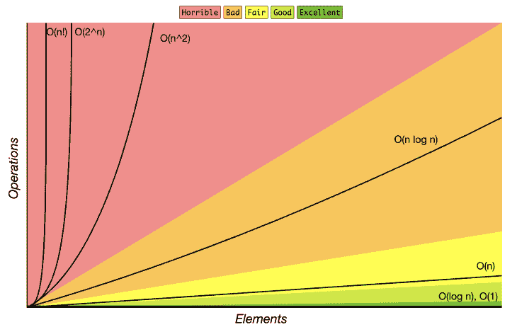
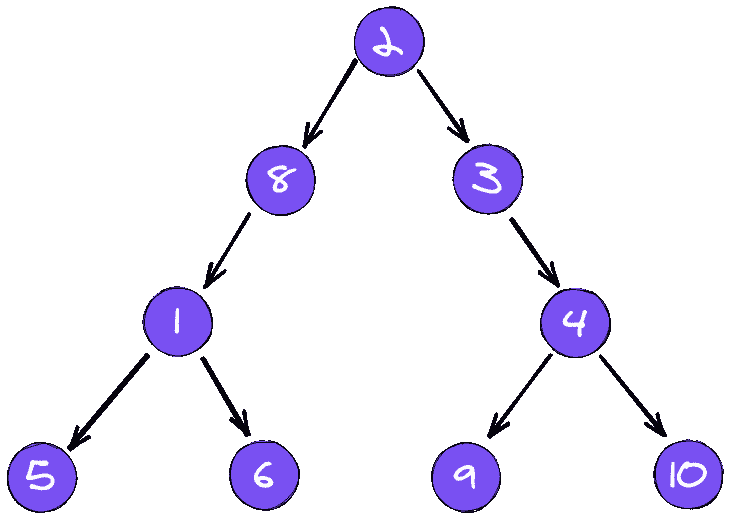

# 使用大 O 符号提高应用程序性能

> 原文：<https://blog.logrocket.com/using-big-o-notation-to-improve-app-performance/>

用户体验在现代软件中至关重要，而性能对于良好的体验至关重要。现代软件的核心是性能，它可以决定你吸引和留住用户的能力。设计时考虑性能的应用程序比没有考虑性能的应用程序有更大的成功机会。

一个常见的误解是，一段简单的代码不会造成任何伤害。相反，你应该总是假设增加一段代码的后果可能比你想象的更糟糕。另一方面，只需要几行代码就可以显著提高应用程序的性能。

在本指南中，我们将探索在现代应用程序中提高性能的最简单的方法之一:使用 [Big O](https://en.wikipedia.org/wiki/Big_O_notation) 符号来度量代码的复杂性。

## 什么是大 O 记数法？

大 O 记法是描述算法复杂性的数学过程。这是计算机科学领域中一个非常重要的概念，它描述了一个算法的复杂性如何基于输入的大小而增长。



Image by [Huyen Pham](https://dzone.com/users/3617486/huyentp.html).

有两种方法可以衡量算法的复杂性:

*   **空间复杂度**根据输入大小测量算法将占用的确切空间量。它本质上是通过计算算法中变量所占的空间来衡量的
*   **时间复杂度**根据输入大小测量算法将花费的确切时间。它本质上取决于一个算法在完成执行之前需要执行多少步

我们可以通过测量运行算法需要多长时间来计算算法的时间复杂度。当计算算法的复杂度时，我们考虑三种情况:

*   **最佳情况** —算法将在可能的最快时间内完成。这总是最佳解决方案
*   **平均情况** —算法将在平均时间内完成的时间
*   **最坏情况** —算法将在可能的最慢时间内完成。这总是最糟糕的解决方案

当使用大 O 符号度量算法的复杂性时，您应该总是考虑最坏的情况。大 O 符号中的“O”代表函数的阶数，“n”代表输入的个数。

## O(1)

算法的最佳时间复杂度是常数时间，也称为 O(1)。具有恒定时间的算法将总是花费相同的时间来执行。该算法的执行与输入的大小无关。

假设我们有一个返回数字平方的函数:

```
const returnSquare = (num) => num * num;

```

`returnSquare`函数将总是花费相同的时间来执行。这就是恒定时间的工作方式，这是一种在相同时间内运行的算法，无论输入的大小如何。

现在，假设我们有一个接收数组的函数。我们希望总是返回数组的第一个元素，而不管数组的大小。

```
const getFirstItem = (arr) => arr[0];

```

`getFirstItem`函数具有恒定的时间复杂度，因为无论数组大小增长多少，它都将在相同的时间内运行。

## O(n)

最常见的时间复杂度是线性时间复杂度，也称为 O(n)。

当算法运行所需的时间随输入大小线性变化时，算法具有线性时间复杂度。

假设我们有一个简单的数组，我们想遍历整个数组来找到一个特定的项:

```
const searchItem = (arr, item) => {
  for (let i = 0; i < arr.length; i++) {
    if (arr[i] === item) {
      return item;
    }
  }
}

```

在最好的情况下，我们正在查看的项目是第一个项目，我们不需要映射整个数组。最坏的情况是，这个项目可能是最后一个，我们需要遍历整个数组。

随着我们数组的增长，这个算法的时间复杂度线性增长。每当我们在算法上看到一个循环时，我们可以假设该代码可以是线性时间复杂度算法。

## o(登录号)

你可能在学校学过对数。对数是一种数学运算，它决定了一个数需要乘以多少次才能达到另一个数。

假设我们有一个包含 10 个元素的数组，我们用一秒钟的时间遍历整个数组。随着这个算法的时间复杂度的增加，我们将花费 2 秒来迭代 20 个元素的数组，花费 3 秒来迭代 30 个元素的数组，等等。

O(log n)算法的一个很好的例子是二分搜索法。二分搜索法通过在每次迭代中将数组一分为二来查找排序数组中特定元素的位置:



​​Image made using [Excalidraw](https://excalidraw.com/).

在每一步中，该算法将问题的规模缩小一半。以二分搜索法算法为例:每次迭代都会分割数组，直到找到特定的项。

## o(北^ 2)

当运行时间与输入大小的平方成比例时，算法具有二次时间复杂度。

假设我们有一个数组，对于每一项，我们希望再次循环以比较当前元素:

```
const findItem = (arr, newArr) => {
  for (let i = 0; i < arr.length; i++) {
    for (let j = 0; j < newArr.length; j++) {
      if (arr[i] === newArr[j]) {
        console.log('hello!');
      }
    }
  }
}

```

这是二次时间复杂度算法的一个例子。嵌套循环导致时间复杂度加倍。每当我们的数组规模增加时，复杂性就会成倍增加。

## O(n！)

O(n！)表示算法可能具有的最坏时间复杂度。写代码的时候，你不会想写一段时间复杂度为 O(n！)，也称为阶乘时间复杂度。

* * *

### 更多来自 LogRocket 的精彩文章:

* * *

一个 O(n！)时间复杂度达到无穷大的速度比你想象的要快得多。在阶乘时间复杂度上，我们为每个输入增加了一个嵌套循环。

很高兴知道这是可能的，但是您可能不想编写具有这种时间复杂性的代码。

## 结论

开发人员喜欢根据可读性来衡量代码的强度。将可读性作为基准没有错，但这不是您应该考虑的唯一标准。

性能在所有现代软件中都起着至关重要的作用，但是编写高性能代码并不总是简单的。意识到代码库的复杂程度并避免创建不必要的东西是很重要的。

大 O 符号可以通过测量代码的复杂性来帮助你编写高性能的代码。这个概念已经存在很多年了，并继续帮助开发人员编写引人入胜的高性能软件。

## 使用 [LogRocket](https://lp.logrocket.com/blg/signup) 消除传统错误报告的干扰

[](https://lp.logrocket.com/blg/signup)

[LogRocket](https://lp.logrocket.com/blg/signup) 是一个数字体验分析解决方案，它可以保护您免受数百个假阳性错误警报的影响，只针对几个真正重要的项目。LogRocket 会告诉您应用程序中实际影响用户的最具影响力的 bug 和 UX 问题。

然后，使用具有深层技术遥测的会话重放来确切地查看用户看到了什么以及是什么导致了问题，就像你在他们身后看一样。

LogRocket 自动聚合客户端错误、JS 异常、前端性能指标和用户交互。然后 LogRocket 使用机器学习来告诉你哪些问题正在影响大多数用户，并提供你需要修复它的上下文。

关注重要的 bug—[今天就试试 LogRocket】。](https://lp.logrocket.com/blg/signup-issue-free)