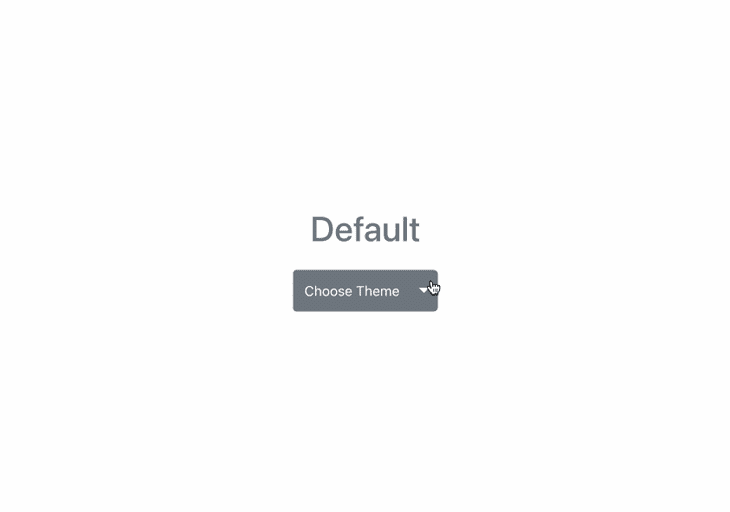
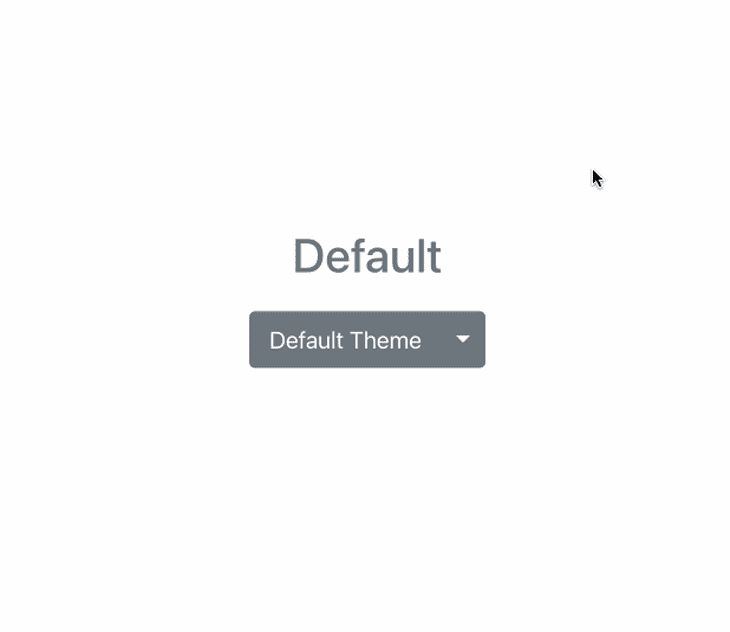
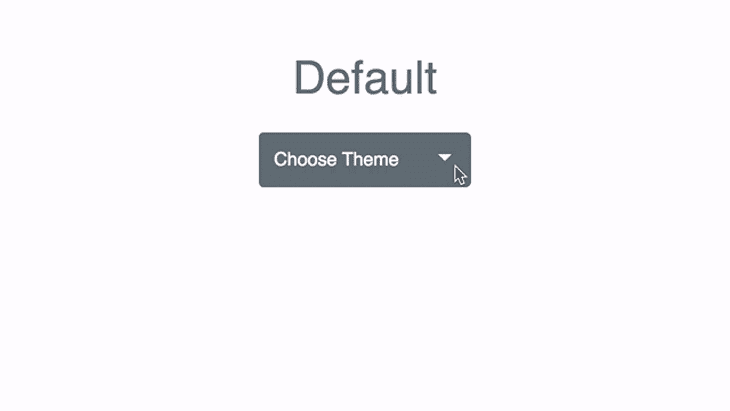
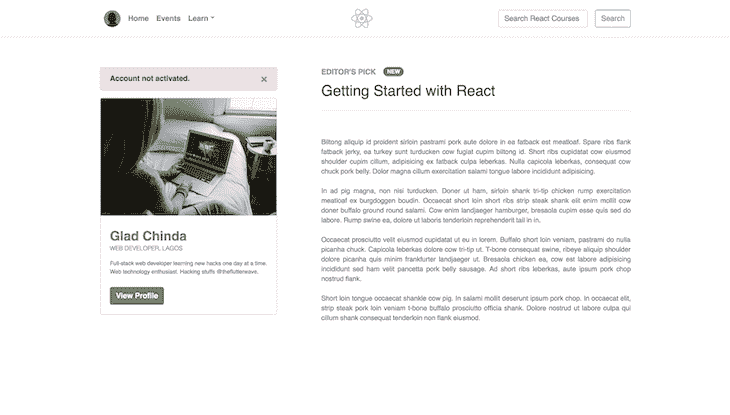

# 在 React 中使用 Bootstrap:示例教程

> 原文：<https://blog.logrocket.com/using-bootstrap-with-react-tutorial-with-examples/>

***编者按**:这篇文章于 2022 年 6 月 23 日更新，以确保所有信息都是最新的，并增加了一节关于[如何排除引导程序在 React](#how-troubleshoot-bootstrap-not-working-in-react) 中不工作的故障。*

在过去的几年里，单页面应用程序越来越受欢迎，这导致了 JavaScript 框架的涌入，其中最受欢迎的是 React。这与 CSS 框架的出现不谋而合，CSS 框架旨在帮助开发人员构建响应迅速的 web 应用程序。

如果说 React 是构建 web 应用程序最常用的 JavaScript 框架，那么 Bootstrap 就是最流行的 CSS 框架，为互联网上数百万个网站提供动力。在本教程中，我们将回顾:

如果你刚刚开始使用这些框架，我建议浏览一下官方的 [React](https://reactjs.org/docs) 和 [Bootstrap 文档](https://getbootstrap.com/docs/4.1/getting-started/introduction/)。我也鼓励你观看下面的综合视频教程，进行更深入的探究。

 [https://www.youtube.com/embed/NlZUtfNVAkI?version=3&rel=1&showsearch=0&showinfo=1&iv_load_policy=1&fs=1&hl=en-US&autohide=2&wmode=transparent](https://www.youtube.com/embed/NlZUtfNVAkI?version=3&rel=1&showsearch=0&showinfo=1&iv_load_policy=1&fs=1&hl=en-US&autohide=2&wmode=transparent)

视频

## JavaScript 和 CSS 框架简介

有许多 JavaScript 框架可供你选择，包括 [Angular](https://angular.io/) 、 [React](https://reactjs.org/) 、 [Vue.js](https://vuejs.org/) 、[Ember](https://emberjs.com/)——不胜枚举。感谢这些丰富的选项，不再需要使用像 jQuery 这样的 [DOM 库来构建 web 应用程序。](https://blog.logrocket.com/the-history-and-legacy-of-jquery/)

此外，如果你是一名前端开发人员，你几乎肯定使用过或者至少听说过 [Bootstrap](https://getbootstrap.com/) 、 [Foundation](https://foundation.zurb.com/) 和[布尔玛](https://bulma.io/)。这些都是响应式(移动优先)CSS 框架，具有健壮的特性和内置的实用程序。

正如我们已经提到的，React 和 Bootstrap 分别是当前最流行的 JavaScript 和 CSS 框架。接下来，我们来复习一下如何添加 Bootstrap 来进行反应。

## 如何添加 Bootstrap 来进行反应

将引导程序添加到 React 应用程序的三种最常见方法是:

*   使用引导 CDN
*   将 React 中的引导作为依赖项导入
*   安装 React 引导包，如`react-bootstrap`或`reactstrap`

让我们更详细地看一下每一项。

### 添加引导以使用引导 CDN 进行反应

Bootstrap CDN 是将 Bootstrap 添加到 React 应用程序的最简单方法。不需要额外的安装或下载。

您只需要在应用程序入口文件的 head 部分包含一个到 CDN 的链接。在一个用`create-react-app`创建的典型 React 应用程序中，它应该在`public/index.html`文件中。

由于我们想要包含引导程序的[当前稳定版本，我们的链接将如下所示:](https://getbootstrap.com/docs/versions/)

```
<link rel="stylesheet" href="https://cdn.jsdelivr.net/npm/[email protected]/dist/css/bootstrap.min.css" integrity="sha384-1BmE4kWBq78iYhFldvKuhfTAU6auU8tT94WrHftjDbrCEXSU1oBoqyl2QvZ6jIW3" crossorigin="anonymous">

```

如果您的项目还需要使用 Bootstrap 附带的 [JavaScript 组件，比如切换模态、下拉菜单或导航条，我们将需要链接`bootstrap.bundle.min.js`文件，该文件预编译有 Popper.js](https://blog.logrocket.com/using-bootstrap-components-with-custom-javascript/)

我们可以通过将下面的`<script>`标签放在条目标记页面的末尾，就在关闭`</body>`标签之前:

```
<script src="https://cdn.jsdelivr.net/npm/[email protected]/dist/js/bootstrap.bundle.min.js" integrity="sha384-ka7Sk0Gln4gmtz2MlQnikT1wXgYsOg+OMhuP+IlRH9sENBO0LRn5q+8nbTov4+1p" crossorigin="anonymous"></script>

```

在链接了引导 CSS 和捆绑的 Javascript CDNs 之后，我们的`public/index.html`文件的完整代码将如下所示:

```
<!DOCTYPE html>
<html lang="en">
  <head>
    <meta charset="utf-8" />
    <link rel="icon" href="%PUBLIC_URL%/favicon.ico" />
    <meta name="viewport" content="width=device-width, initial-scale=1" />
    <meta name="theme-color" content="#000000" />
    <meta
      name="description"
      content="Web site created using create-react-app"
    />
    <link rel="apple-touch-icon" href="%PUBLIC_URL%/logo192.png" />
    <link rel="manifest" href="%PUBLIC_URL%/manifest.json" />
    <title>React App</title>

    <link
      rel="stylesheet"
      href="https://cdn.jsdelivr.net/npm/boot[email protected]/dist/css/bootstrap.min.css"
      integrity="sha384-1BmE4kWBq78iYhFldvKuhfTAU6auU8tT94WrHftjDbrCEXSU1oBoqyl2QvZ6jIW3"
      crossorigin="anonymous"
    />
  </head>
  <body>
    <noscript>You need to enable JavaScript to run this app.</noscript>
    <div id="root"></div>
    <script
      src="https://cdn.jsdelivr.net/npm/[email protected]/dist/js/bootstrap.bundle.min.js"
      integrity="sha384-ka7Sk0Gln4gmtz2MlQnikT1wXgYsOg+OMhuP+IlRH9sENBO0LRn5q+8nbTov4+1p"
      crossorigin="anonymous"
    ></script>
  </body>
</html>

```

现在，您可以开始在 React 应用程序组件中使用内置的引导类和 JavaScript 组件。

### 将 React 中的引导作为依赖项导入

如果您使用的是[构建工具或模块捆绑器，如](https://webpack.js.org/) `[webpack](https://webpack.js.org/)`，这将是向 React 应用程序添加引导程序的首选选项。您可以通过运行以下命令轻松开始安装:

```
npm install bootstrap
# OR
yarn add bootstrap

```

此命令将安装最新版本的引导程序。安装完成后，我们可以将其包含在应用程序的入口文件中:

```
// Bootstrap CSS
import "bootstrap/dist/css/bootstrap.min.css";
// Bootstrap Bundle JS
import "bootstrap/dist/js/bootstrap.bundle.min";

```

在用`create-react-app`构建项目的情况下，它会在`src/index.js`文件中。导入后，整个文件的内容将如下所示:

```
import React from "react";
import ReactDOM from "react-dom/client";

// Bootstrap CSS
import "bootstrap/dist/css/bootstrap.min.css";
// Bootstrap Bundle JS
import "bootstrap/dist/js/bootstrap.bundle.min";

import "./index.css";
import App from "./App";
import reportWebVitals from "./reportWebVitals";

const root = ReactDOM.createRoot(document.getElementById("root"));
root.render(
  <React.StrictMode>
    <App />
  </React.StrictMode>
);

// If you want to start measuring performance in your app, pass a function
// to log results (for example: reportWebVitals(console.log))
// or send to an analytics endpoint. Learn more: https://bit.ly/CRA-vitals
reportWebVitals();

```

如上面的代码所示，我们已经导入了引导 CSS 及其相关的 JavaScript 文件。我们还确保在主 CSS 文件`index.css`之前导入 Bootstrap，以便根据需要用这个文件更容易地改变 Bootstrap 的默认样式。

一旦这个过程完成，我们就可以开始在 React 应用程序组件中使用内置的引导类了。

### 安装一个 React 引导包，如`react-bootstrap`或`reactstrap`

将引导程序添加到 React 应用程序的第三种方法是使用一个重新构建了引导程序组件的包，这些组件被设计为作为 [React 组件](https://blog.logrocket.com/comparing-popular-react-component-libraries/)工作。

这种方法的好处是，几乎所有的引导组件都作为 React 组件捆绑在这些库中。例如，在我们的 React 应用程序中，一个完整的 Bootstrap 模态组件现在可以作为`<Modal />`轻松导入。

虽然有各种各样的软件包可以用来在 React 中安装 Boostrap，但最受欢迎的两个软件包包括`[react-bootstrap](https://react-bootstrap.github.io/)`和`[reactstrap](https://reactstrap.github.io/)`。这两个包都是将 Bootstrap 用于 React 应用程序的绝佳选择，并且具有非常相似的特征。

## 使用内置的引导类和组件

通过像应用任何其他类一样应用内置类，Bootstrap 可以直接用于 React 应用程序中的元素和组件。为了演示引导类和组件的使用，让我们创建一个基本的主题切换器 React 组件。



如本演示所示，我们使用 Bootstrap 中可用的下拉组件来实现我们的主题切换器。我们还使用内置的`button`类来设置下拉按钮的大小和颜色。

我们将继续为我们的主题切换器组件编写代码。确保您已经设置了 React 应用程序。在您的`src`文件夹中，为组件创建一个名为`ThemeSwitcher.js`的新文件，并向其中添加以下代码片段:

```
import { useState } from "react";
const ThemeSwitcher = () => {
  const [theme, setTheme] = useState(null);
  const resetTheme = () => {
    setTheme(null);
  };
  const themeClass = theme ? theme.toLowerCase() : "secondary";
  return (
    <>
      <div
        className={`text-capitalize h1 mb-4 w-100 text-center text-${themeClass}`}
      >
        {`${theme || "Default"} Theme`}
      </div>
      <div className="btn-group">
        <button className={`text-capitalize btn btn-${themeClass} btn-lg"`} type="button">
          {theme ? theme + " theme" : "Choose Theme"}
        </button>
        <button
          type="button"
          className={`btn btn-lg btn-${themeClass} dropdown-toggle dropdown-toggle-split`}
          data-bs-toggle="dropdown"
          aria-expanded="false"
        >
          <span className="visually-hidden">Toggle Dropdown</span>
        </button>
        <div className="dropdown-menu">
          <a className="dropdown-item" onClick={() => setTheme("primary")}>
            Primary Theme
          </a>
          <a className="dropdown-item" onClick={() => setTheme("danger")}>
            Danger Theme
          </a>
          <a
            className="dropdown-item" onClick={() => setTheme("success")}>
            Success Theme
          </a>
          <div className="dropdown-divider"></div>
          <a className="dropdown-item" href="#" onClick={() => resetTheme()}>
            Default Theme
          </a>
        </div>
      </div>
    </>
  );
};
export default ThemeSwitcher;

```

在上面的代码中，我们使用 Bootstrap 的 dropdown 组件和几个内置类创建了一个非常简单的主题切换器组件。

使用 React 的`useState`钩子，我们已经创建了一个状态`theme`并将其初始值设置为 null，同时定义了`setTheme`方法来修改这个状态。然后我们还创建了一个`resetTheme`函数，它将主题的值重置为空。

接下来，在我们的组件标记中，我们呈现了一个包含四个下拉项的引导下拉列表。前三个项目允许我们在不同的主题之间切换— `primary`、`danger`和`success` —最后一个下拉项目允许我们使用`resetTheme()`功能将主题值重置为空。

在这个例子中，我们看到了在 React 应用程序中使用 Bootstrap 的内置类和组件是多么容易。为了进一步理解 React Bootstrap 包是如何工作的，让我们使用`react-bootstrap`和`reactstrap`提供的组件重新创建我们的主题切换器应用程序，同时编写有限的代码。

### 使用`react-bootstrap`的示例

假设您已经设置了一个 React 应用程序，让我们用下面的命令在我们的应用程序中安装`react-bootstrap`:

```
npm install react-bootstrap bootstrap

```

值得一提的是`react-bootstrap`本身并没有预装 Bootstrap 即它的 CSS 和 JavaScript 文件。该包只将公共引导作为 React 组件导出，这就是为什么我们也可以在上面的安装命令中看到附加的引导。

一旦我们安装了`react-bootstrap`，我们就能够导入任何组件。例如，导入`Button`组件将如下所示:

```
import { Button } from 'react-bootstrap';

```

继续我们的主题切换器示例，让我们在项目的`src`目录中创建一个名为`ThemeSwitcher.js`的新文件，并在其中放入以下内容:

```
import { useState } from "react";
import { Button, ButtonGroup, Dropdown } from "react-bootstrap";

const ThemeSwitcher = () => {
  const [theme, setTheme] = useState(null);

  const resetTheme = () => {
    setTheme(null);
  };

  return (
    <div className="mb-2">
      <Dropdown as={ButtonGroup} size="lg">
        <Button
          className="text-capitalize"
          variant={theme ? theme : "secondary"}
        >
          {theme ? theme : "Default"}
        </Button>
        <Dropdown.Toggle
          split
          variant={theme ? theme : "secondary"}
          id="dropdown-split-basic"
        />
        <Dropdown.Menu>
          <Dropdown.Item eventKey="1" onClick={() => setTheme("primary")}>
            Primary
          </Dropdown.Item>
          <Dropdown.Item eventKey="2" onClick={() => setTheme("danger")}>
            Danger
          </Dropdown.Item>
          <Dropdown.Item eventKey="3" onClick={() => setTheme("success")}>
            Success
          </Dropdown.Item>
          <Dropdown.Divider />
          <Dropdown.Item eventKey="4" onClick={resetTheme}>
            Default Theme
          </Dropdown.Item>
        </Dropdown.Menu>
      </Dropdown>
    </div>
  );
};

export default ThemeSwitcher;

```

在上面的代码中，我们试图使用`react-bootstrap`尽可能多地复制我们最初的例子。

我们从`react-bootstrap`包中导入了三个组件；即`Button`、`ButtonGroup`和`Dropdown`。就像我们之前做的一样，我们利用`useState`钩子来创建我们的主题状态，并定义了一个将`theme`的值设置为`null`的函数。

最后，我们将修改`src/App.js`文件，如下所示:

```
import ThemeSwitcher from "./ThemeSwitcher";

function App() {
  return (
    <div className="App min-vh-100 d-flex justify-content-center align-items-center">
      <div>
        <ThemeSwitcher />
      </div>
    </div>
  );
}

export default App;

```

我们对该文件所做的唯一更改是去掉了`create-react-app`起始页面，并让它呈现我们的`ThemeSwitcher`组件。

如果我们现在用命令`yarn start`或`npm start`运行应用程序，我们的应用程序应该在端口`3000`上启动，应该看起来像下面的演示:



### 使用`reactstrap`的示例

`reactstrap`包与`react-bootstrap`非常相似，在组件和属性名等方面略有不同。不过，`react-bootstrap`比`reactstrap`稍老一点，可能也是它的采用范围更广的原因。

我们可以使用下面的命令轻松地将`reactstrap`添加到 react 项目中:

```
npm install bootstrap reactstrap
# OR
yarn add bootstrap reactstrap

```

我们的`ThemeSwitcher`组件的代码如下所示:

```
import { useState } from "react";
import {
  Dropdown,
  DropdownToggle,
  DropdownMenu,
  DropdownItem,
} from "reactstrap";

const Theme = () => {
  const [theme, setTheme] = useState(null);
  const [dropdownOpen, setdropdownOpen] = useState(false);
  const resetTheme = () => {
    setTheme(null);
  };

  return (
    <div className="mb-2">
      <div
        className={`text-capitalize h1 mb-4 w-100 text-center text-${
          theme ? theme.toLowerCase() : "secondary"
        }`}
      >
        {`${theme || "Default"}`}
      </div>
      <div className="d-flex justify-content-center p-5">
        <Dropdown
          isOpen={dropdownOpen}
          toggle={() => setdropdownOpen(!dropdownOpen)}
        >
          <DropdownToggle color={theme} caret>
            Dropdown
          </DropdownToggle>
          <DropdownMenu>
            <DropdownItem onClick={() => setTheme("primary")}>
              Primary Theme
            </DropdownItem>
            <DropdownItem onClick={() => setTheme("danger")}>
              Danger Theme
            </DropdownItem>
            <DropdownItem onClick={() => setTheme("success")}>
              Success Theme
            </DropdownItem>
            <DropdownItem divider />
            <DropdownItem onClick={resetTheme}>Default Theme</DropdownItem>
          </DropdownMenu>
        </Dropdown>
      </div>
    </div>
  );
};

export default Theme;

```

当比较来自`reactsrap`和`react-bootstrap`例子的两个代码文件时，特别是触发下拉开关的动作，我们可以看到`reactstrap`利用 [React 钩子更多地使用 React 特性](https://blog.logrocket.com/react-hooks-the-good-the-bad-and-the-ugly/)，而`react-bootstrap`更多地依赖于组件属性。

如果我们现在用命令`yarn start`或`npm start`运行应用程序，我们的应用程序应该在端口`3000`上启动，应该看起来像下面的演示:



## 使用 Bootstrap 创建更详细的 React 应用程序

让我们更进一步，创建一个包含更多细节的应用程序。我们将尝试使用尽可能多的引导类和组件。我们还将使用`reactstrap`添加 Bootstrap 进行反应。这是我们最终的结果:



让我们从使用`create-react-app`创建一个新应用程序开始:

```
npx create-react-app sample-app

```

接下来，继续安装依赖项，如下所示:

```
npm install axios bootstrap reactstrap

```

注意这里我们[安装了](https://github.com/axios/axios) `[Axios](https://github.com/axios/axios)` [作为依赖](https://github.com/axios/axios)。Axios 是一个基于 promise 的 HTTP 客户端，用于浏览器和 Node.js。它将使我们能够从 Bacon Ipsum JSON API 获取帖子。

让我们对`src/index.js`文件做一点修改，以包含引导程序缩小的 CSS 和 JavaScript 文件。它应该类似于下面的代码片段:

```
import React from "react";
import ReactDOM from "react-dom/client";
// Bootstrap CSS
import "bootstrap/dist/css/bootstrap.min.css";
// Bootstrap Bundle JS
import "bootstrap/dist/js/bootstrap.bundle.min";

import "./index.css";
import App from "./App";
import reportWebVitals from "./reportWebVitals";

const root = ReactDOM.createRoot(document.getElementById("root"));
root.render(
  <React.StrictMode>
    <App />
  </React.StrictMode>
);
reportWebVitals();

```

接下来，我们将在项目的`src`目录中增加一个名为`components`的新目录。在这个新的`components`目录中，创建一个名为`Header.js`的新文件，并用以下内容更新它:

```
import logo from '../logo.svg';

import {
  Container, Row, Col, Form, Input, Button, Navbar, Nav,
  NavbarBrand, NavLink, NavItem, UncontrolledDropdown,
  DropdownToggle, DropdownMenu, DropdownItem
} from 'reactstrap';

const AVATAR = 'https://www.gravatar.com/avatar/429e504af19fc3e1cfa5c4326ef3394c?s=240&d=mm&r=pg';

const Header = () => (
  <header>
    <Navbar fixed="top" color="light" light expand="xs" className="border-bottom border-gray bg-white" style={{ height: 80 }}>

      <Container>
        <Row noGutters className="position-relative w-100 align-items-center">

          <Col className="d-none d-lg-flex justify-content-start">
            <Nav className="mrx-auto" navbar>

              <NavItem className="d-flex align-items-center">
                <NavLink className="font-weight-bold" href="/">
                  
                </NavLink>
              </NavItem>

              <NavItem className="d-flex align-items-center">
                <NavLink className="font-weight-bold" href="/">Home</NavLink>
              </NavItem>

              <NavItem className="d-flex align-items-center">
                <NavLink className="font-weight-bold" href="/">Events</NavLink>
              </NavItem>

              <UncontrolledDropdown className="d-flex align-items-center" nav inNavbar>
                <DropdownToggle className="font-weight-bold" nav caret>Learn</DropdownToggle>
                <DropdownMenu right>
                  <DropdownItem className="font-weight-bold text-secondary text-uppercase" header disabled>Learn React</DropdownItem>
                  <DropdownItem divider />
                  <DropdownItem>Documentation</DropdownItem>
                  <DropdownItem>Tutorials</DropdownItem>
                  <DropdownItem>Courses</DropdownItem>
                </DropdownMenu>
              </UncontrolledDropdown>

            </Nav>
          </Col>

          <Col className="d-flex justify-content-xs-start justify-content-lg-center">
            <NavbarBrand className="d-inline-block p-0" href="/" style={{ width: 80 }}>
              
            </NavbarBrand>
          </Col>

          <Col className="d-none d-lg-flex justify-content-end">
            <Form inline>
              <Input type="search" className="mr-3" placeholder="Search React Courses" />
              <Button type="submit" color="info" outline>Search</Button>
            </Form>
          </Col>

        </Row>
      </Container>

    </Navbar>
  </header>
);

export default Header;

```

我们刚刚在上面的代码片段中创建的组件是`Header`组件，它包含导航菜单。接下来，我们将创建一个名为`SideCard.js`的新文件——也在`components`目录中——其内容如下:

```
import { Button, UncontrolledAlert, Card, CardImg, CardBody, CardTitle, CardSubtitle, CardText } from "reactstrap";
const BANNER = "https://i.imgur.com/CaKdFMq.jpg";
const SideCard = () => (
  <>
    <UncontrolledAlert color="danger" className="d-none d-lg-block">
      <strong>Account not activated.</strong>
    </UncontrolledAlert>
    <Card>
      <CardImg top width="100%" src={BANNER} alt="banner" />
      <CardBody>
        <CardTitle className="h3 mb-2 pt-2 font-weight-bold text-secondary">
          Glad Chinda
        </CardTitle>
        <CardSubtitle
          className="text-secondary mb-3 font-weight-light text-uppercase"
          style={{ fontSize: "0.8rem" }}
        >
          Web Developer, Lagos
        </CardSubtitle>
        <CardText
          className="text-secondary mb-4"
          style={{ fontSize: "0.75rem" }}
        >
          Full-stack web developer learning new hacks one day at a time. Web
          technology enthusiast. Hacking stuffs @theflutterwave.
        </CardText>
        <Button color="success" className="font-weight-bold">
          View Profile
        </Button>
      </CardBody>
    </Card>
  </>
);
export default SideCard;

```

完成后，在 components 目录中创建一个名为`Post.js`的新文件，并向其中添加以下代码片段:

```
import { useState, useEffect } from "react";
import axios from "axios";
import { Badge } from "reactstrap";

const Post = () => {
  const [post, setPost] = useState(null);

  useEffect(() => {
    axios
      .get(
        "https://baconipsum.com/api/?type=meat-and-filler&paras=4&format=text"
      )
      .then((response) => setPost(response.data));
  }, []);
  return (
    <>
      {post && (
        <div className="position-relative">
          <span className="d-block pb-2 mb-0 h6 text-uppercase text-info font-weight-bold">
            Editor's Pick
            <Badge
              pill
              color="success"
              className="text-uppercase px-2 py-1 ml-3 mb-1 align-middle"
              style={{ fontSize: "0.75rem" }}
            >
              New
            </Badge>
          </span>

          <span className="d-block pb-4 h2 text-dark border-bottom border-gray">
            Getting Started with React
          </span>

          <article
            className="pt-5 text-secondary text-justify"
            style={{ fontSize: "0.9rem", whiteSpace: "pre-line" }}
          >
            {post}
          </article>
        </div>
      )}
    </>
  );
};

export default Post;

```

在上面的代码中，我们创建了一个在页面上呈现文章的`Post`组件。我们通过将 post 属性设置为`null`来初始化组件的状态。

在组件被挂载之后，我们利用`useEffect`钩子和 Axios 从 Bacon Ipsum JSON API 中检索一个四段的随机 post，并将我们的 post 字段更改为从这个 API 返回的数据。

最后，修改`src/App.js`文件，看起来像下面的代码片段:

```
import { Container, Row, Col } from "reactstrap";

import Post from "./components/Post";
import Header from "./components/Header";
import SideCard from "./components/SideCard";

const App = () => (
  <>
    <Header />

    <main className="my-5 py-5">
      <Container className="px-0">
        <Row
          noGutters
          className="pt-2 pt-md-5 w-100 px-4 px-xl-0 position-relative"
        >
          <Col
            xs={{ order: 2 }}
            md={{ size: 4, order: 1 }}
            tag="aside"
            className="pb-5 mb-5 pb-md-0 mb-md-0 mx-auto mx-md-0"
          >
            <SideCard />
          </Col>

          <Col
            xs={{ order: 1 }}
            md={{ size: 7, offset: 1 }}
            tag="section"
            className="py-5 mb-5 py-md-0 mb-md-0"
          >
            <Post />
          </Col>
        </Row>
      </Container>
    </main>
  </>
);

export default App;

```

在上面的代码中，我们简单地在`App`组件中包含了`Header`、`SideCard`和`Post`组件。请注意我们如何使用 Bootstrap 提供的几个响应实用程序类来使我们的应用适应不同的屏幕尺寸。

如果您现在使用命令`yarn start`或`npm start`运行应用程序，您的应用程序应该在端口 3000 上启动，并且应该与我们之前看到的屏幕截图一模一样。

### 如何排除引导程序在 React 中不工作的故障

Bootstrap 可能无法在 React 应用程序中正常运行的唯一原因是您没有正确链接它。

如果您使用的是 Bootstrap CDN，请仔细检查 CDN URL 是否有效，以及它是否是使用`<link />`标签添加到您的应用程序入口页面的 head 部分的。

如果您正在使用 React Bootstrap 包，请确保您已经正确安装了它，并在您的应用程序入口页面上导入了它，[正如我们在前面介绍的](#install-react-bootstrap-package-react-bootstrap-reactstrap)。

## 结论

在本教程中，我们探索了几种不同的方法来集成 Bootstrap 和 React 应用程序。我们还看到了如何使用两个最流行的 React 引导库，即`react-bootstrap`和`reactstrap`。

我们在本教程中只使用了几个引导组件，比如提醒、徽章、下拉菜单、导航条、导航、表单、按钮、卡片等等。仍然有一些引导组件可以尝试，比如表格、模态、工具提示、轮播、大屏幕、分页、标签等。

您可以查看我们在本教程中使用的包的文档，找到它们的更多用法。本教程[中所有演示应用的源代码都可以在 GitHub](https://github.com/gladchinda/react-with-bootstrap-demo) 上找到。

## [LogRocket](https://lp.logrocket.com/blg/react-signup-general) :全面了解您的生产 React 应用

调试 React 应用程序可能很困难，尤其是当用户遇到难以重现的问题时。如果您对监视和跟踪 Redux 状态、自动显示 JavaScript 错误以及跟踪缓慢的网络请求和组件加载时间感兴趣，

[try LogRocket](https://lp.logrocket.com/blg/react-signup-general)

.

[ ](https://lp.logrocket.com/blg/react-signup-general) [](https://lp.logrocket.com/blg/react-signup-general) 

LogRocket 结合了会话回放、产品分析和错误跟踪，使软件团队能够创建理想的 web 和移动产品体验。这对你来说意味着什么？

LogRocket 不是猜测错误发生的原因，也不是要求用户提供截图和日志转储，而是让您回放问题，就像它们发生在您自己的浏览器中一样，以快速了解哪里出错了。

不再有嘈杂的警报。智能错误跟踪允许您对问题进行分类，然后从中学习。获得有影响的用户问题的通知，而不是误报。警报越少，有用的信号越多。

LogRocket Redux 中间件包为您的用户会话增加了一层额外的可见性。LogRocket 记录 Redux 存储中的所有操作和状态。

现代化您调试 React 应用的方式— [开始免费监控](https://lp.logrocket.com/blg/react-signup-general)。