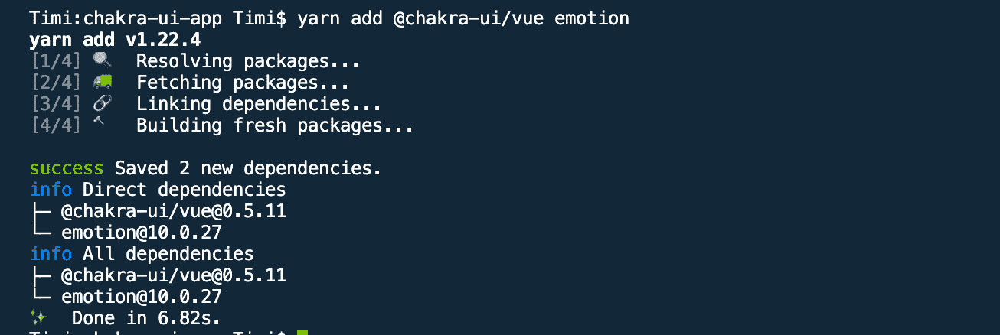
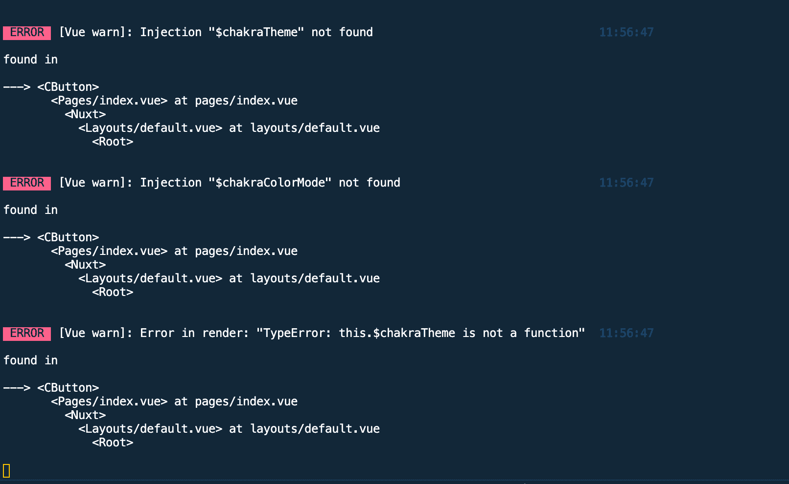

# 在 Vue 和 Nuxt.js 应用程序中使用 Chakra UI

> 原文：<https://blog.logrocket.com/using-chakra-ui-in-vue-and-nuxt-js-applications/>

## 介绍

根据[官方文件](https://vue.chakra-ui.com/):

> Chakra UI 是一个简单的模块化和可访问的组件库，为您提供快速构建 Vue 应用程序的构建模块。

为了使组件尽可能容易使用，每个组件都符合 WAI-ARIA 标准，同时仍然可以根据基于约束的设计原则定制 Chakra 组件。

该库的核心概念包括:

*   易接近
*   基于约束的设计

## 先决条件

要跟随本教程，您需要以下内容:

## 安装程序

### 视图(view)

目前有三种方法可以在我们的 Vue 应用程序中安装`chakra-ui-vue`。这些命令中的每一个都将安装`chakra-ui-vue`和`emotion`。

[Emotion](https://emotion.sh/docs/introduction) 是一个为用 JavaScript 编写 CSS 样式而设计的库。它们包括:

**纱线**

```
yarn add @chakra-ui/vue emotion
```

如果成功，您应该会在终端中看到类似这样的内容:



**NPM**

```
npm install @chakra-ui/vue emotion --save
```

vista CLI 插件

```
vue add chakra-ui
```

您的终端会提示您一些问题。之后，你的`main.js`就会更新。这是三种方法中唯一一种将脉轮配置添加到你的应用程序中的方法。您的`main.js`将如下所示:

**main.js**

```
import Vue from 'vue'
import App from './App.vue'
import Chakra from '@chakra-ui/vue'
Vue.use(Chakra)
Vue.config.productionTip = false
new Vue({
    render: h => h(App),
}).$mount('#app')
```

一旦完成，你需要做的最后一件事就是导入`CThemeProvider`并把你的主应用程序包装在里面。

**更新 main.js**

```
import Vue from 'vue'
// import 'CThemeProvider' using ES6 destructuring
import Chakra, { CThemeProvider } from '@chakra-ui/vue'
import App from './App.vue'

Vue.use(Chakra)

new Vue({
  el: '#app',
  //wrap your main app inside it
  render: (h) => h(CThemeProvider, [h(App)])
}).$mount()
```

在这一点上，你现在可以使用脉轮提供的任何组件。

### CSS 重置

如果你习惯于使用 [CSS 重置](https://gist.github.com/DavidWells/18e73022e723037a50d6)来重置所有浏览器或默认 CSS，以避免在不同浏览器上查看应用程序时的风格/外观差异，Chakra 为此提供了一个类似的组件，它被称为`CReset`。

建议将它设置在 Vue 应用程序的根目录下，这样你的应用程序在启动时总是会考虑重置。这样，查克拉的所有组成部分都会工作良好。以下是如何做到这一点的示例:

**main.js**

```
import Vue from 'vue'
import App from './App.vue'
import Chakra, { CThemeProvider, CReset } from '@chakra-ui/vue'
Vue.use(Chakra)
Vue.config.productionTip = false
new Vue({
    render: (h) => h(CThemeProvider, [h(CReset), h(App)]),
}).$mount('#app')
```

### Nuxt

要在 Nuxt 中使用 Chakra UI，我们需要将它与情感的 Nuxt 模块一起安装: [@nuxtjs/emotion](https://github.com/nuxt-community/emotion-module) 。

我们可以用这样的纱线来安装它们:

```
yarn add @chakra-ui/nuxt @nuxtjs/emotion
```

安装完成后，下一步就是配置它，以便在您的应用程序中使用。为此，打开您的`nuxt.config.js`文件，并将`@chakra-ui/nuxt`和`@nuxtjs/emotion`添加到文件的`modules`属性中。

**nuxt.config.js**

```
export default {
    // existing config in the file
    modules: [
        '@chakra-ui/nuxt',
        '@nuxtjs/emotion'
    ]
}
```

在你的应用程序准备好使用 Chakra 的组件之前，最后一个需要的配置是导入`CThemeProvider`并在你的布局(如果你只有一个)中嵌套所有的视图(即`<Nuxt />`组件)，或者在这个`CThemeProvider`中嵌套你想要使用的布局。

我们也可以选择在我们想要使用 Chakra 组件的每一页上导入`CThemeProvider`,但是这将涉及到我们代码中的大量重复，这不是好的做法。对于本教程，我将使用默认布局，`default.vue`，在`layouts/`文件夹中找到。

预设。检视

```
<template>
  <CThemeProvider>
    <Nuxt />
  </CThemeProvider>
</template>
<script>
import { CThemeProvider } from '@chakra-ui/vue'
export default {
  name: 'DefaultLayout',
  components: {
    CThemeProvider
  }
}
</script>
```

现在，我们可以在需要时在任何文件中导入单个组件。如果您尝试在不导入`CThemeProvider`的情况下使用一个组件，您将在您的终端和浏览器中得到如下所示的错误:



**CSS 重置**
将`CReset`属性添加到您的 Nuxt 应用程序中，将其导入到您的布局文件中，并将其嵌套在`CThemeProvider`组件中。

预设。检视

```
<template>
  <CThemeProvider>
    <Nuxt />
  </CThemeProvider>
</template>
<script>
import { CThemeProvider } from '@chakra-ui/vue'
export default {
  name: 'DefaultLayout',
  components: {
    CThemeProvider
  }
}
</script>
```

## 额外配置

Chakra 带有为你的应用程序添加额外功能的选项。这些功能并不容易获得，直到您配置 Chakra 将它们包含在您的应用程序中。以下是可用选项及其使用方法的列表:

*   这个选项允许用户为他们的应用程序创建一个自定义主题，并将其添加到 Chakra 现有的主题中。它接受导入的主题名称。需要注意的一点是，你的自定义主题优先于默认的脉轮主题。这意味着，如果默认主题的键名可以在您的自定义主题中找到，它将被您的自定义主题所覆盖。
*   这是你配置 Chakra 使用外部图标(在 Chakra 的图标列表中找不到的图标)的地方。这可以是图标库中的图标，也可以是项目中使用的自定义图标。该选项包含以下属性；
*   这个选项允许你配置其他图标库来使用查克拉的图标。一个例子是流行的[字体令人敬畏的](https://fontawesome.com/)图标库。Chakra 允许用户添加字体 Awesome 上的所有图标，并像 Chakra 原生图标一样使用它。
*   `iconSet`:该属性用于添加来自`iconPack`的图标，它接受一个图标名称的对象，例如`faMedal`。务必在该对象中包含所需图标的名称。这是因为这个选项允许你成功地使用图标作为查克拉图标的一部分。
*   这个选项允许你在已经有的脉轮图标列表中添加自定义图标。这意味着，如果你在 Figma 上有一个定制的图标，而不是在你的文件中粘贴 SVG 代码或使用一个`img`标签引用图标，你可以像使用任何 Chakra 图标一样使用它。

以下是如何在 Vue 和 Nuxt 应用程序中使用这些选项:

**视图**
**main.js**

```
# 1\. Install fontawesome using this guide https://fontawesome.com/how-to-use/on-the-web/setup/using-package-managers

// 2\. add it in your main.js file 
Vue.use(Chakra, {
    icons: {
        iconPack: 'fa'
    }
})
```

一旦你完成了第 1 步和第 2 步，下一步就是导入我们想要的图标，并在`iconSet`中定义它们。

```
import { faMedal } from '@fortawesome/free-solid-svg-icons'
Vue.use(Chakra, {
    icons: {
        iconPack: 'fa',
        iconSet: { faMedal }
    }
})
```

现在，我们可以像使用脉轮图标一样使用这个图标。

**app . view**

```
<template>
    <c-box>
        <c-button>
            Chakra Consumed! ⚡️
            <!-- add the name of the icon to the component -->
            <c-icon name='medal'></c-icon>
        </c-button>
    </c-box>
</template>
<script lang="js">
// import the chakra icon component CIcon
    import { CBox, CButton, CIcon } from '@chakra-ui/vue'
    export default {
        name: 'App',
        components: {
            CBox,
            CButton,
            CIcon
        }
    }
</script>
```

**Nuxt**
要在 Nuxt 中使用这些特性，在您的`nuxt.config.js`文件中创建一个`chakra`属性。该属性接受这些选项的一个对象。

**nuxt.config.js**

```
//import the icon
import { faMedal } from '@fortawesome/free-solid-svg-icons'
export default {
    //existing config
    chakra: {
        icons: {
            iconPack: 'fa',
            iconSet: { faMedal }
        }
    }
}
```

## 使用主题

查克拉主题可以让你定义和定制你的应用程序的颜色，字体，边框半径，大小，空间等。

当你试图在你的应用程序中为你的按钮甚至不同标题的字体大小达到一个标准的时候，这是非常有用的。

脉轮采用的主题化方法基于[系统 UI 主题规范](https://system-ui.com/theme/)。Chakra 让用户能够通过在应用程序的`src`文件夹中创建一个`js`文件来为默认主题添加额外的配置。这个文件应该是这样的:
**theme-file.js**

```
export default {

}
```

因此，如果您想添加一个新的配置或覆盖`colors`中`gray`的默认值，这是如何做到的:

**theme-file.js**

```
export default {
    colors: {
        gray: {
            50: "#EDFDFD",
            80: "#C4F1F9",
            110: "#9DECF9",
            130: "#76E4F7"
        }
    }
};
```

完成后，接下来要做的是将这个文件导入到`main.js`文件中，并将其添加到`extendTheme`属性中，这样 Chakra 就可以将这些新定义的`gray`值添加到我们应用程序的现有配置中。

**main.js**

```
import Chakra from '@chakra-ui/vue'
// import the file
import themeFile from './theme-file'
import { faMedal } from '@fortawesome/free-solid-svg-icons'
Vue.use(Chakra, {
    // add it to the extendTheme property
    extendTheme: themeFile,
    icons: {
        iconPack: 'fa',
        iconSet: { faMedal }
    }
})
```

所以如果你想在你的文件中使用它，你需要做的就是:

```
<template>
    <c-box>
        <!-- using the newly added config for gray -->
        <c-button bg='gray.80'>
            Chakra Consumed! ⚡️
            <c-icon name='medal'></c-icon>
        </c-button>
    </c-box>
</template>
<script lang="js">
// import the chakra icon component CIcon
    import { CBox, CButton, CIcon } from '@chakra-ui/vue'
    export default {
        name: 'App',
        components: {
            CBox,
            CButton,
            CIcon
        }
    }
</script>
```

官方文档鼓励使用像 [Coolors](https://coolors.co/ddffd9-ecc8ae-d7907b-6c4b5e-b3679b) 和 [palx](https://palx.jxnblk.com/) 这样的工具来生成调色板。

对于 Nuxt，我建议你把你的主题文件(在我的例子中， **theme-file.js** 放在**插件/** 文件夹中，之后你可以把它导入到 **nuxt.config.js** 文件中):

**nuxt.config.js**

```
import { faMedal } from '@fortawesome/free-solid-svg-icons'
// import the theme
import themeFile from './plugins/theme-file'
export default {
    modules: [
        '@chakra-ui/nuxt',
        '@nuxtjs/emotion'
    ],
    chakra: {
        // add it to chakra config
        extendTheme: themeFile,
        icons: {
            iconPack: 'fa',
            iconSet: { faMedal }
        }
    }
}
```

现在，如果您尝试在 Nuxt 应用程序中使用自定义主题文件中声明的任何属性，您应该会看到它的运行。

## 结论

当使用 Chakra UI 时，有许多其他惊人的特性将对开发非常有帮助，其中一些包括:

## 像用户一样体验您的 Vue 应用

调试 Vue.js 应用程序可能会很困难，尤其是当用户会话期间有几十个(如果不是几百个)突变时。如果您对监视和跟踪生产中所有用户的 Vue 突变感兴趣，

[try LogRocket](https://lp.logrocket.com/blg/vue-signup)

.

[](https://lp.logrocket.com/blg/vue-signup)[https://logrocket.com/signup/](https://lp.logrocket.com/blg/vue-signup)

LogRocket 就像是网络和移动应用程序的 DVR，记录你的 Vue 应用程序中发生的一切，包括网络请求、JavaScript 错误、性能问题等等。您可以汇总并报告问题发生时应用程序的状态，而不是猜测问题发生的原因。

LogRocket Vuex 插件将 Vuex 突变记录到 LogRocket 控制台，为您提供导致错误的环境，以及出现问题时应用程序的状态。

现代化您调试 Vue 应用的方式- [开始免费监控](https://lp.logrocket.com/blg/vue-signup)。