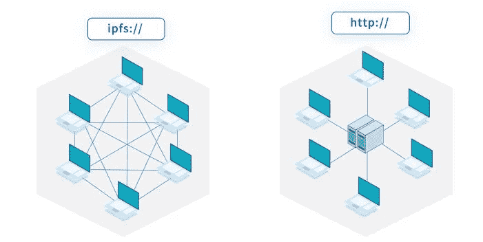
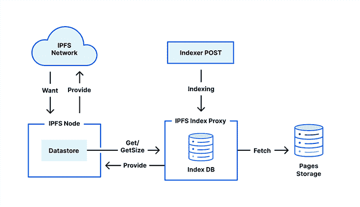
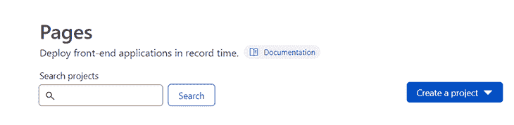

# 在 IPFS 博客中使用 Cloudflare 页面

> 原文：<https://blog.logrocket.com/using-cloudflare-pages-ipfs/>

星际文件系统，或称 IPFS，是一种对等超媒体协议。简而言之，IPFS 允许你在分散存储中存储资产。

像以太坊这样的区块链允许你将智能合约部署到区块链网络，但如果你将你的资产或静态文件存储在以太坊网络本身，它将不会是高效的。这将增加成本，并为访问文件提供较慢的解决方案。IPFS 被引进来解决这个问题。

[Cloudflare Pages](https://pages.cloudflare.com/) 允许您在 Git 托管提供商(如 GitHub 或 GitLab)的云中托管动态页面。您可以使用 Cloudflare Workers 的 Cloudflare 页面将完整的全栈应用程序部署到云中。

您可以将使用 Hugo、Jekyll 或 Next.js 构建的站点快速部署到 Cloudflare 页面。Cloudflare 还允许一个到 IPFS 网络的网关，您可以使用这些网关访问托管在 IPFS 上的文件。您还可以从 Cloudflare 页面将您的站点发布到 IPFS 网络。

在本文中，我们将设置一个基本的 Next.js 应用程序，使用 Cloudflare Pages 发布它，然后将其提供给 IPFS 网络。

> **N.B.** Cloudflare 还没有向大家介绍这项服务。这项服务可能会在 2022 年底向公众开放。

## 什么是 IPFS？

正如我们提到的，IPFS 是“星际文件系统”的缩写这个名字听起来有点像科幻电影中的技术。

在区块链中，一切都发生在节点上。这些节点可以相互通信并交换文件。



Source: [https://www.reddit.com/r/ipfs/comments/q76uil/what_is_ipfs_what_does_it_mean_for_the_internet/](https://www.reddit.com/r/ipfs/comments/q76uil/what_is_ipfs_what_does_it_mean_for_the_internet/).

上图漂亮地展示了 IPFS 网络。右侧的图像代表一个集中式存储系统，其中所有数据都存储在一个集中式服务器上，所有其他计算机都请求集中式服务器访问数据。

在 IPFS，数据分布在各个节点上。它类似于区块链，因为它使用节点贡献计算能力来验证事务。IPFS 有数以千计的独立节点连接到 IPFS 网络，共享它们的带宽来存储来自 IPFS 网络的文件。

IPFS 解决了集中式系统的一些重要问题。例如，集中式系统更容易受到攻击和数据泄露。由于所有信息都存储在一个地方，攻击单个点可能会泄露重要信息。

此外，如果中央实体出现故障，您将无法再访问您的文件。这样的事件发生在 2021 年，当时[脸书、Instagram 和 WhatsApp 服务器宕机](https://en.wikipedia.org/wiki/2021_Facebook_outage)数小时。人们无法访问存储在这些平台上的聊天内容或媒体。但 IPFS 的情况并非如此。

中央系统也可以很快被审查。许多特定国家的网站被禁止，因为它们依赖于一个中央系统。然而，当使用 IPFS 时，你的网站或资产不能被审查。

## IPFS 是如何运作的

IPFS 的工作非常有趣。在传统的 Web2 存储系统中，我们访问我们想要访问的文件的位置。

当使用`http://`或`https://`访问特定文件时，会使用其位置查询特定文件。该文件可以是图像、网页、媒体文件等。链接是映射到特定服务器或一组服务器的标识符。

服务器的所有者控制着存储在服务器中的资产。如果该位置仍然保存着该文件，它将把它发送给用户，浏览器将加载它。如果服务器关闭或所有者决定删除文件，您将无法再访问它们。

为了解决这些问题，IPFS 使用了内容寻址。内容寻址使用文件的指纹来寻址。存储在 IPFS 中的内容获得其内容标识符，即 CID。

CID 只不过是一个[散列](https://docs.ipfs.tech/concepts/hashing/)。哈希值永远不会改变，所以每当您尝试使用相同的 CID 访问内容时，您总是会得到相同的结果。

你可以在这里了解更多关于 IPFS 的工作方式。

## 什么是 Cloudflare 页面？

Cloudflare Pages 是一个用于部署网站的 JAMStack 平台。它以开发人员为中心，可以很容易地与任何 Git 提供者集成。它还将网站部署到 Cloudflare edge 网络中，帮助网站更快地加载。

[您还可以使用 Cloudflare Workers 来集成动态功能](https://blog.logrocket.com/creating-url-shortener-cloudflare-workers/)。你可以用 [Cloudflare Workers](https://workers.cloudflare.com/) 编写服务器端代码，而不用运行专门的服务器。

Cloudflare Pages 支持大多数流行的框架，并有针对不同框架的专用指南。它提供了一个简单的界面，通过这个界面，您可以快速地将 JAMStack 网站部署到云中。Cloudflare 提供了更多工具来与 Pages 集成，使其成为一个全栈应用程序。您可以编写无服务器代码，并将其与 Cloudflare 页面集成。

Cloudflare 还提供类似于 [R2](https://www.cloudflare.com/products/r2/) 的服务，后者为存储管理提供对象存储。

## IPFS 如何使用 Cloudflare 页面

Cloudflare 已经开始提供构建和访问 Web3 产品的服务。它提供将您的站点部署到 Cloudflare 页面并将其提供给 IPFS 网络的服务。让我们简单讨论一下它是如何提供这项服务的。

选择 Cloudflare 中的服务将调用 IPFS 指数代理。这个调用的主要目的是获取您网站的文件，并将其转换为 cid。然后，使用 IndexDB 将 cid 与文件相关联。

完成此步骤后，调用会告知 Cloudflare IPFS 节点 cid 可用于文件。现在，您可以使用 CID 访问这些文件。



Source: [https://blog.cloudflare.com/cloudflare-pages-on-ipfs/](https://blog.cloudflare.com/cloudflare-pages-on-ipfs/).

## 将网站部署到 Cloudflare 页面

[让我们将 React 应用部署到 Cloudflare 页面](https://blog.logrocket.com/deploying-react-app-full-stack-cloudflare-pages/)。虽然我们正在部署 React 应用程序，但是您可以选择任何其他流行的框架。您可以查看 [Cloudflare 框架指南](https://developers.cloudflare.com/pages/framework-guides/)，了解如何部署使用您最喜欢的框架构建的站点。

在本文中，我们将使用 [create-react-app](https://create-react-app.dev/) 来生成一个 react 应用程序。您可以在终端中运行以下命令:

```
npx create-react-app demo-app

```

这里，`demo-app`是您想要生成的应用程序名称。一旦搭建完成，将`cd`放入文件夹并运行`npm run start`。这将在端口 3000 上启动 React 应用程序。您可以从`localhost:3000` URL 访问您的应用程序。

我们的基本 Next.js 应用程序由一个单页的`index.js`文件组成。该文件呈现为主页。您可以根据需要自定义页面。对于这个例子，让我们添加一个简单的标题。

`index.js`的最终代码将类似于下面的代码片段:

```
import Head from 'next/head';
import Image from 'next/image';
import styles from '../styles/Home.module.css';

export default function Home() {
  return (
    <div className={styles.container}>
      <Head>
        <title>Create Next App</title>
        <meta name='description' content='Generated by create next app' />
        <link rel='icon' href='/favicon.ico' />
      </Head>
      <main className={styles.main}>
        <h1 className={styles.title}>Hello World!</h1>
      </main>
    </div>
  );
}

```

现在，将这个应用程序推送到 GitHub 存储库中。如果使用 VS 代码，可以使用命令行或 Git VS 代码 Git 扩展。

一旦存储库被推送到 GitHub，从 Cloudflare 仪表板打开 [Cloudflare Pages](https://dash.cloudflare.com/) (如果没有，您必须创建一个新帐户)。从 Cloudflare 页面菜单中，单击**创建项目**下拉菜单。



在这里，你有三个选择。第一种选择是使用 Git 托管提供者进行部署。第二个选项是直接上传文件，第三个是指向他们的 Wrangler CLI 指南的链接。

您可以使用 Cloudflare 的 Wrangler CLI 来编写 Cloudflare Workers。对于本文，选择第一个选项。

目前，Cloudflare 支持 GitHub 和 GitLab。您可以从下一个窗口中选择您首选的 Git 托管提供商，并向 Cloudflare 授予必要的权限。一旦您成功配置了 GitHub 或 GitLab，您将能够在这里看到这些库。

选择您想要部署的存储库并点击**开始设置**。您可以在下一个屏幕中更改项目的名称，或者选择您想要部署的分支。如果您熟悉 Netlify 或 Vercel 等其他服务，这个窗口可能看起来很相似。

从**构建** **设置**选项中选择**创建 React 应用**作为框架预设，因为我们将在这里部署一个 React 站点。


您可以根据您的框架选择框架预设。对于 Create React App，其余选项保持不变。

一旦部署完成并成功，您将获得一个 URL，您可以从该 URL 访问您部署的网站。您还可以从项目的仪表板页面为您的应用程序设置自定义 URL。

现在您已经设置了您的应用程序，您可以将您的应用程序发送到 IPFS。从您的控制面板选择加入 Cloudflare Pages 与 IPFS 的集成(请记住，此选项尚未向所有人提供)。

一旦您选择了该服务，Cloudflare 将为您的应用程序内容编制索引。一旦索引完成并成功，Cloudflare 将为您提供索引内容的 CID。使用这个 CID，您可以使用任何 IPFS 网关提供商访问您的网站，如[cf-ipfs.com](https://cf-ipfs.com/ipfs/bafybeifx7yeb55armcsxwwitkymga5xf53dxiarykms3ygqic223w5sk3m#x-ipfs-companion-no-redirect)或从[这个列表](https://ipfs.github.io/public-gateway-checker/)中选择一个。

您的 IPFS CID 将看起来类似于`QmU1NvrJgDEBJieYKzjGEYUm6K8xb3uSUREfhaSzF5Gkgi`。

有了像`ipfs.co`这样的 IPFS 网关，你网站的 IPFS 链接看起来就会像`[https://ipfs.io/ipfs/QmU1NvrJgDEBJieYKzjGEYUm6K8xb3uSUREfhaSzF5Gkgi\](https://ipfs.io/ipfs/QmU1NvrJgDEBJieYKzjGEYUm6K8xb3uSUREfhaSzF5Gkgi)`。你的网站现在托管在 IPFS 网络上。

您也可以设置一个单独的域而不是整个 CID 来通过 HTTP 或 IPFS 协议访问您的网站。一旦您从 Cloudflare 为您的网站设置了自定义域，您就可以使用 [DNSLink](https://dnslink.dev/) 通过 IPFS 或标准协议使用单个 URL 访问您的网站，具体取决于客户端。你只需要用记录`dnslink=/ipfs/FOLLOWED_BY_YOUR_CID`在你的域管理设置上创建一个新的 TXT 记录。

您现在可以使用`ipns://YOUR_DOMAIN.com`访问您的网站。

## 结论

本文讨论了 IPFS、Cloudflare 页面，以及如何使用 GitHub 将网站部署到 Cloudflare 页面。我们还讨论了 IPFS 和 Cloudflare 的工作原理。Cloudflare 还提供其他 Web3 服务，如自定义 IPFS 网关。

本文还简要介绍了如何利用 Cloudflare 页面将您的应用程序部署到 IPFS 网络。尽管 Cloudflare Pages 与 IPFS 的集成还不是每个人都可以尝试的，但我们可以预计到 2022 年底它将面向公众推出。

## 加入像 Bitso 和 Coinsquare 这样的组织，他们使用 LogRocket 主动监控他们的 Web3 应用

影响用户在您的应用中激活和交易的能力的客户端问题会极大地影响您的底线。如果您对监控 UX 问题、自动显示 JavaScript 错误、跟踪缓慢的网络请求和组件加载时间感兴趣，

[try LogRocket](https://lp.logrocket.com/blg/web3-signup)

.

[](https://lp.logrocket.com/blg/web3-signup)[https://logrocket.com/signup/](https://lp.logrocket.com/blg/web3-signup)

LogRocket 就像是网络和移动应用的 DVR，记录你的网络应用或网站上发生的一切。您可以汇总和报告关键的前端性能指标，重放用户会话和应用程序状态，记录网络请求，并自动显示所有错误，而不是猜测问题发生的原因。

现代化您调试 web 和移动应用的方式— [开始免费监控](https://lp.logrocket.com/blg/web3-signup)。