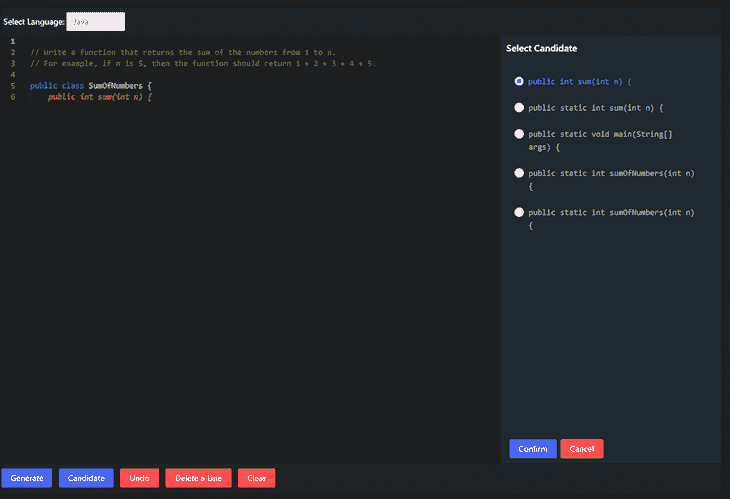
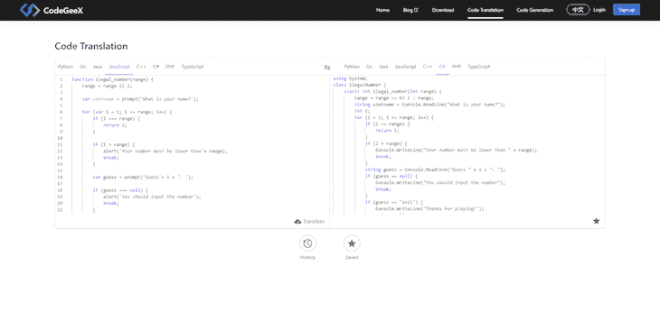
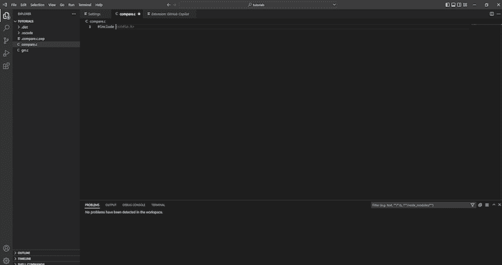
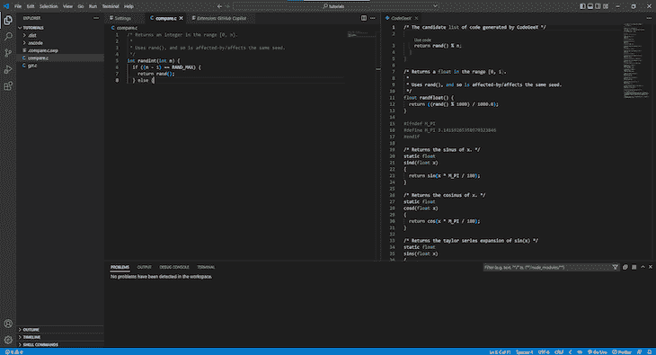
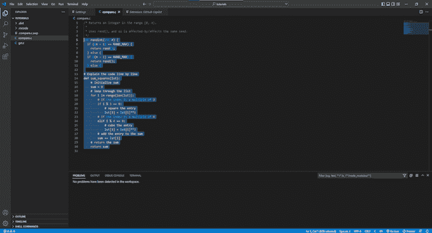
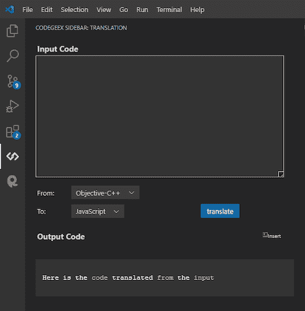

# 使用 CodeGeeX 作为 GitHub Copilot 的替代方案

> 原文：<https://blog.logrocket.com/using-codegeex-github-copilot-alternative/>

***编者按**:这篇文章最后一次更新是在 2023 年 2 月 22 日，包含了关于 VS 代码扩展的最新侧边栏更新的信息。*

当 GitHub Copilot 于 2022 年 6 月向公众发布时，全世界的开发者都欣喜若狂，主要是因为自从预览版于 2021 年推出以来，他们一直在等待这一天。等待是值得的，因为 Copilot 实现了帮助开发人员更快编码同时减少工作量的目标。它几乎是完美的，除了一点——Copilot 不是免费的。

虽然对大多数人来说，付费墙不是一个交易破坏者，但它导致许多人寻求 Copilot 的替代品。这就是 CodeGeeX 的用武之地。在本文中，我们将深入 CodeGeeX，看看为什么它可以作为 Copilot 的有用替代品。

向前跳:

## CodeGeeX 是什么？

根据其[官方文档](https://github.com/THUDM/CodeGeeX)，“CodeGeeX 是一个大规模多语言代码生成模型，在 20 多种编程语言的大型代码语料库上预训练了 130 亿个参数”。简单来说，CodeGeeX 是一个由人工智能驱动的代码生成工具，可以帮助你更快地编写代码。

CodeGeeX 通过获取您的注释并生成适合它们的代码，或者根据您之前的代码行为您建议下一行代码来实现这一点。

与由 [OpenAI Codex](https://openai.com/blog/openai-codex/) 驱动的 Copilot 不同，CodeGeeX 在一组 [Ascend 910 人工智能处理器](https://e.huawei.com/en/products/servers/ascend)(可以说是世界上最强大的人工智能处理器)上训练其人工智能，以驱动其软件。众所周知，Ascend 910 人工智能处理器非常强大，当与 Mindspore 结合时，它们的功能是其他人工智能训练卡(如 TensorFlow)的两倍。

Ascend 910 AI 处理器受[华为商标政策](https://consumer.huawei.com/en/legal/intellectual-property/huawei-trademark-policy/)保护，但 CodeGeeX 使用 [Apache License 2.0](https://snyk.io/learn/apache-license/) 许可证来保护其版权。Apache 许可证是 Apache Software Foundation 提供的一个免费的开源软件(FOSS)许可协议。

在性能和易用性方面，CodeGeeX 与 GitHub Copilot 不相上下。它甚至有一些独特的功能，使它成为一个奇妙的替代品，我们将在下面回顾。

CodeGeeX [代码生成工具](https://models.aminer.cn/codegeex/playground)是今年发生在开发者身上最不可思议的事情之一。它允许用户通过输入他们想要的注释来生成代码块。CodeGeeX 读取注释，然后逐行生成用户想要的代码。

CodeGeeX 生成的代码是可以编辑的，所以如果你有具体的修改，你可以直接编辑它。代码生成工具还有一个**候选**特性，允许它生成同一行代码的多个版本，然后你可以选择你喜欢的那个:



这里有一个例子。假设我们想用代码生成器创建一个 JavaScript 猜谜游戏。我们所要做的就是输入以下注释:

```
// Create a number guessing game to generate a number between the range of 1 and 2.
// The game should prompt users for their username.
// Set range as function parameter and prompt the player to predict the generated number between the given range.
// At a correct guess, the player a point and move them to stage 2 by increasing the range limit value by 1
// At a wrong guess, the player loses a point, and the game ends

```

然后，我们必须编写函数的第一个单词，或者按照我们的想法命名函数，生成器会处理剩下的事情，就像下面的视频一样:

下面是 CodeGeeX 的代码生成工具使用我们输入的注释生成的代码:

```
function ilegal_number(range) {
    range = range || 2;

    var username = prompt('What is your name?');

    for (var i = 1; i <= range; i++) {
        if (i === range) {
            return i;
        }

        if (i > range) {
            alert('Your number must be lower than'+ range);
            break;
        }

        var guess = prompt('Guess'+ i + ': ');

        if (guess === null) {
            alert('You should input the number');
            break;
        }

        if (guess === 'exit') {
            alert('Thanks for playing!');
            return null;
        }

        if (guess === i) {
            alert('You guessed it!');
            alert('You scored:'+ (i * 2));
            break;
        }
    }

    alert('You tried too many times, try again!');
    alert('You scored:'+ (i * 2));

    return null;
}

```

CodeGeeX [代码翻译工具](https://models.aminer.cn/codegeex/codeTranslator)对于每个开发者来说都是一个非常棒的工具。顾名思义，它将您的代码从您编写它的语言翻译成您选择的另一种语言。

代码翻译工具目前支持 19 种语言:

*   计算机编程语言
*   去
*   Java 语言(一种计算机语言，尤用于创建网站)
*   Java Script 语言
*   C++
*   C#
*   服务器端编程语言（Professional Hypertext Preprocessor 的缩写）
*   以打字打的文件
*   C
*   超文本标记语言
*   塑性的涂料
*   目标-C++
*   目标-c
*   结构化查询语言
*   锈
*   半铸钢ˌ钢性铸铁(Cast Semi-Steel)
*   库达
*   壳
*   稀有

要使用代码翻译工具，请选择您想要编写的语言，编写代码或将其粘贴到输入字段中，然后选择您想要将其翻译成的语言。然后点击**翻译**。

为了进行测试，让我们使用我们之前生成的猜谜游戏，并将其从 JavaScript 翻译成 C#:



下面是生成的代码:

```
using System;
class IlegalNumber {
    static int ilegal_number(int range) {
        range = range == 0? 2 : range;
        string username = Console.ReadLine("What is your name?");
        int i;
        for (i = 1; i <= range; i++) {
            if (i == range) {
                return i;
            }
            if (i > range) {
                Console.WriteLine("Your number must be lower than " + range);
                break;
            }
            string guess = Console.ReadLine("Guess " + i + ": ");
            if (guess == null) {
                Console.WriteLine("You should input the number");
                break;
            }
            if (guess == "exit") {
                Console.WriteLine("Thanks for playing!");
                return null;
            }
            if (guess == i.ToString()) {
                Console.WriteLine("You guessed it!");
                Console.WriteLine("You scored: " + (i * 2));
                break;
            }
        }
        Console.WriteLine("You tried too many times, try again!");
        Console.WriteLine("You scored: " + (i * 2));
        return null;
    }
    public static void Main() {
        Console.WriteLine("Welcome " + username);
        Console.WriteLine("1 - 2147483647");
        Console.WriteLine(ilegal_number(0) == null? "exit" : ilegal_number(1));
    }
}

```

正如你所看到的，CodeGeex 可以将你所有的代码片段翻译成不同的语言，而且准确度很高。

## CodeGeeX VS 代码扩展

CodeGeeX 还有一个 VS 代码扩展，与 Github Copilot 不同，它是免费的。GitHub Copilot VS Code extension 在技术上是免费的，但只对经过验证的学生、教师和 GitHub 上流行的开源库的维护者开放。否则，你必须每月支付 10 美元或每年支付 100 美元。

CodeGeeX VS 代码扩展不需要任何这些条件。你要做的就是去 VS 代码扩展商店下载 CodeGeeX 扩展，它有三种模式。

### 秘密行动模式

这种模式的工作方式与代码生成工具相同。它会查看您之前的代码或代码注释，并为您生成下一行代码。最大的好处是它不会干扰你的代码。只有在您上次键入代码已经过了三秒的情况下，它才会建议代码，并且建议的代码是一个占位符，只有在您按下 Tab 键时才会实现。

这里有一个例子:



在上图中，头文件是由 CodeGeeX 生成的，但它只是一个占位符，直到我按下`Tab`键。此外，CodeGeeX 扩展一次只生成一行，所以很容易编辑。

### 对话方式

CodeGeeX 扩展的交互模式也有一个代码生成工具的元素。要进入这种模式，点击`Control+Enter`，你的 VS 代码将分成两个窗格。一个窗格将是您编写正常代码的地方，而另一个窗格将为您建议代码片段:



### 提示模式

提示模式比其他 CodeGeeX 模式更高级，它允许您访问代码解释、代码摘要等功能，甚至可以为您生成具有特定编码风格的代码。

要使用提示模式，您必须突出显示想要解释的代码，然后按 ALT+T 来触发提示模式。如果您选择一个解释，它将为突出显示的代码生成一个逐行解释:



### 翻译模式

CodeGeeX 的翻译模式有两种形式。首先，您可以简单地突出显示您的 VS 代码中的任何编写的代码，然后键入`Control+Alt+T`。一个窗口将会打开，显示你可以把你的代码翻译成 19 种语言。当你选择一种语言时，你的代码将在几秒钟内被翻译并呈现在一个新的窗口中。

翻译工具的第二种形式是位于扩展侧边栏下方的交互式侧边栏。在这里，您可以在输入框中输入您想要翻译的代码，选择您粘贴的代码的语言，选择您想要代码翻译成的语言，然后选择 **translate** :



如果你想阅读更多关于 CodeGeeX VS Code extension 的内容，[这里有一个指南](https://marketplace.visualstudio.com/items?itemName=aminer.codegeex)给你。

## 使用 CodeGeeX 的优点

*   CodeGeex 是一个开源项目，提供了更多的技术灵活性。
*   它具有多语言代码生成能力
*   CodeGeeX 极大地提高了生产率

## 使用 CodeGeeX 的缺点

*   与 CoPilot 和其他更受欢迎的人工智能代码生成工具相比，CodeGeeX 的用户群相对较小
*   由于 CodeGeeX 相对较新，用户基数较小，产品中可能存在尚未修复的错误

## 结论

考虑到 CodeGeeX 的特性，再加上它是免费的，我们都同意 CodeGeeX 确实可以成为 GitHub Copilot 的合适替代品。它很容易使用，有大量的支持，人工智能足够聪明，可以作为你编码的合适助手。所以，如果你还在争论是否要使用它，试试吧。它不会花费你任何东西。

## 使用 [LogRocket](https://lp.logrocket.com/blg/signup) 消除传统错误报告的干扰

[](https://lp.logrocket.com/blg/signup)

[LogRocket](https://lp.logrocket.com/blg/signup) 是一个数字体验分析解决方案，它可以保护您免受数百个假阳性错误警报的影响，只针对几个真正重要的项目。LogRocket 会告诉您应用程序中实际影响用户的最具影响力的 bug 和 UX 问题。

然后，使用具有深层技术遥测的会话重放来确切地查看用户看到了什么以及是什么导致了问题，就像你在他们身后看一样。

LogRocket 自动聚合客户端错误、JS 异常、前端性能指标和用户交互。然后 LogRocket 使用机器学习来告诉你哪些问题正在影响大多数用户，并提供你需要修复它的上下文。

关注重要的 bug—[今天就试试 LogRocket】。](https://lp.logrocket.com/blg/signup-issue-free)