# 通过 Next.js 使用内容丰富的 CMS

> 原文：<https://blog.logrocket.com/using-contentful-cms-next-js/>

Contentful 是一个无头 CMS，允许用户通过 API 管理和交付他们的内容，而不是建立和维护一个传统的网站或应用程序。这使得 Contentful 与各种前端框架和工具的集成变得很容易，包括 Next.js。

Next.js 提供了几个特性，使得使用 Contentful 更加容易。例如，Next.js 提供了自动代码分割，通过只加载每个页面所需的内容，可以帮助提高应用程序的性能。Next.js 还内置了服务器端渲染支持，这使得向各种设备和浏览器交付内容变得更加容易。

在本文中，我们将介绍如何使用 Contentful 和 Next.js 构建一个简单的博客应用程序。

*向前跳转:*

## 什么是内容丰富的 CMS？

Contentful 是一个内容管理系统，允许用户以结构化的方式管理和存储内容。它通常用于构建网站和应用程序。

Contentful 的主要卖点是它能够让用户轻松地创建和管理内容，而不需要专业技术知识。有了这个 CMS，用户可以使用一个简单直观的基于 web 的界面来创建、编辑和管理内容。然后，他们可以使用 API 将内容交付给任何平台或设备。这使得它成为必须跨多个渠道管理和提供大量内容的组织的热门选择。

Contentful 的一个关键特性是它的灵活性，允许大量的用户定制。凭借其强大的 API 和 webhooks，用户可以轻松地将 Contentful 与其他系统和工具集成，如电子商务平台、分析工具等。

Contentful 还提供了许多内置功能来帮助用户有效地管理他们的内容。其中包括创建自定义内容模型、与团队成员协作以及在发布前预览内容更改的能力。

## 你如何使用 Contentful？

在使用 Contentful 之前，您必须创建一个帐户并设置您的第一个共享空间。空间是一个容器，您可以在其中存储、管理和交付您的内容。

Contentful 的入门相对简单，可以通过用户友好的 web 界面来完成；请遵循以下步骤:

1.  **注册账户**:去[网站](https://www.contentful.com/)注册一个账户
2.  **创建空间**:注册后，点击侧边菜单中的**空间** > **添加空间**，然后点击**创建空间**按钮。接下来，为您的空间命名，选择适当的环境(例如**生产**或**暂存**，然后单击**创建**按钮
3.  **添加内容**:点击顶部菜单的**内容**。从这里，您可以创建内容模型，定义内容的结构，然后开始添加条目
4.  **交付内容**:您可以使用 Contentful APIs 或众多可用的 SDK 之一(如 JavaScript SDK)来检索您的内容，并将其显示在您的应用程序或网站中

## 使用 Contentful 和 Next.js 构建应用程序

Contentful 提供了广泛的特性和工具，在构建 Next.js 应用程序时会很有用。例如，它包括对内容建模、媒体管理、版本控制和本地化的支持，这可以帮助您创建更高级、更复杂的应用程序。

要在 Next.js 中使用 Contentful，您必须创建一个 Contentful 帐户并设置您的内容模型。然后，您可以使用 Contentful APIs 来检索您的内容，并将其显示在 Next.js 应用程序中。

让我们创建一个简单的博客应用程序来演示 Contentful CMS 与 Next.js 的用法。

### 创建 Next.js 项目

作为第一步，您需要创建一个新的 Next.js 项目并安装必要的依赖项。为此，请使用以下命令:

```
> npx create-next-app my-blog-app
> cd my-blog-app
> npm install contentful

```

### 创建内容模型

接下来，您需要设置您的内容空间，并为您的博客文章创建一个内容模型。为此，我们将遵循前面讨论的步骤。

首先去 [Contentful](https://www.contentful.com/) 网站注册一个账号。

接下来，点击侧边菜单中的**空间** > **添加空间**，然后点击**创建空间**按钮:

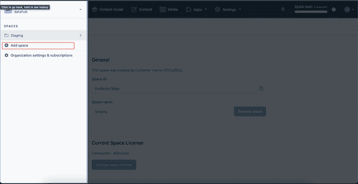

现在，为您的空间命名(我们将使用“NextExample”)，选择适当的环境(对于本演示，我们将选择“master”)，然后单击 **Create** 按钮。

接下来，点击顶部菜单中的**内容模型**，并点击**设计您的内容模型**按钮:

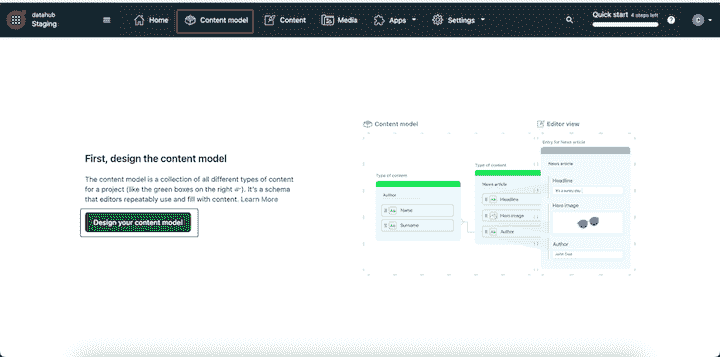

要创建您的第一条内容，请单击**创建** **一个** **内容类型**按钮。：

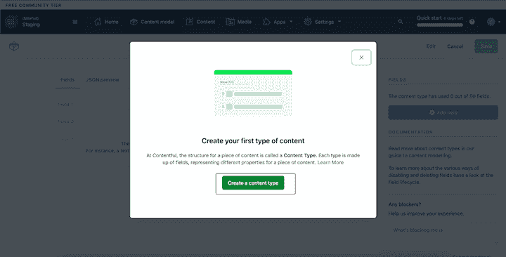

接下来，为您的内容模型命名(对于本演示，我们将使用“Blog Post”)，单击 **Create** 按钮，然后添加您希望包含在内容模型中的字段(例如，“标题”、“正文”和“作者”):

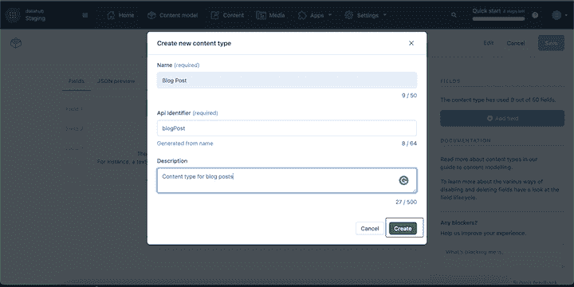

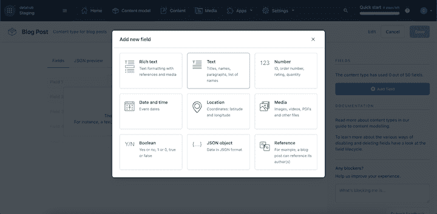

现在，您可以使用该模型创建条目，用内容填充您的空间。

### 检索和显示内容

一旦建立了内容空间并创建了一些内容，就可以使用内容 JavaScript SDK 在 Next.js 应用程序中检索和显示内容。

在 Next.js 项目中，创建一个`utils.js`文件并添加以下代码:

```
// src/utils.js
import { createClient } from 'contentful';

const client = createClient({
  space: 'YOUR_SPACE_ID',
  accessToken: 'YOUR_ACCESS_TOKEN',
});

// Retrieve the list of blog posts from Contentful
const getBlogPosts = async () => {
  const response = await client.getEntries({
    content_type: 'blogPost',
  });

  return response.items;
};

export default getBlogPosts;

```

这段代码使用 Contentful JavaScript SDK 创建一个客户机实例，并从 Contentful 空间中检索一系列博客文章条目。

然后，您可以使用`getBlogPosts()`功能在 Next.js 应用程序中显示您的博客文章。例如，您可以将以下代码添加到 pages 目录中的`index.js`文件，以在应用程序的主页上显示您的博客文章列表:

```
import styles from "../styles/Home.module.css";
import getBlogPosts from "../src/utils";

export default function Home({ posts }) {
  return (
    <div className={styles.main}>
      <ul className={styles.blogPosts}>
        {posts.map((post) => (
          <li key={post.sys.id}>
            <h2>{post.fields.title}</h2>
            <p>~ by {post.fields.authorName}</p>
          </li>
        ))}
      </ul>
    </div>
  );
}

Home.getInitialProps = async () => {
  const posts = await getBlogPosts();

  return { posts };
};

```

`createClient()`函数需要来自 Contentful 仪表板的空间 ID 和您的访问令牌。

要获取空间 ID，请导航至**设置>常规设置**:

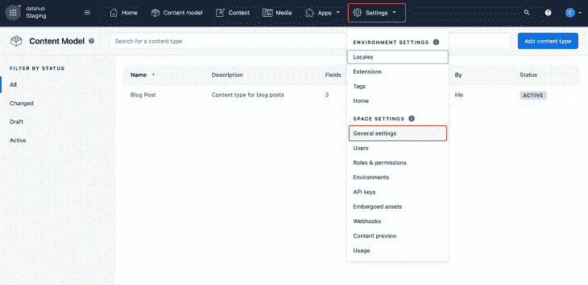

要复制空间 ID，请单击复制图标:

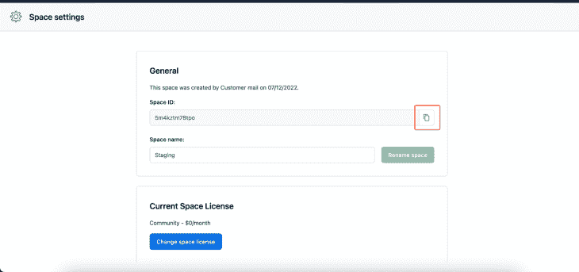

要获取您的访问令牌，请导航至**设置** > **API 密钥**:

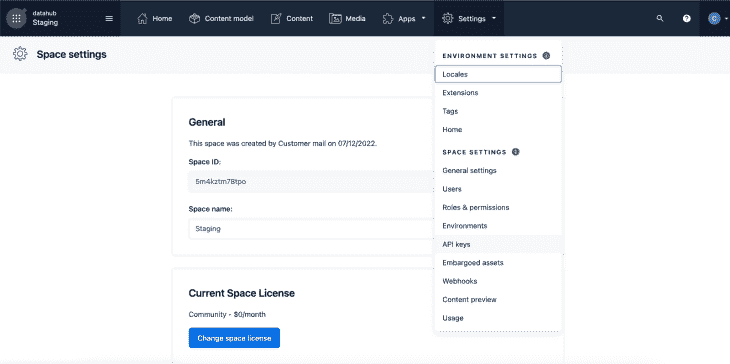

接下来，单击**添加 API 密钥**按钮生成一个新令牌:

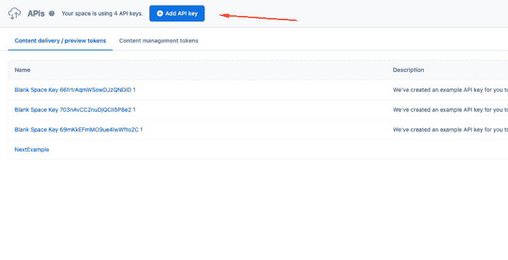

在下一个屏幕中，从**内容交付 API–访问令牌**字段复制访问令牌:

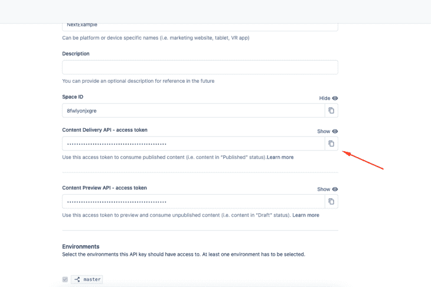

你可以在 GitHub 上查看这个例子的完整代码；查看下面的最终结果:

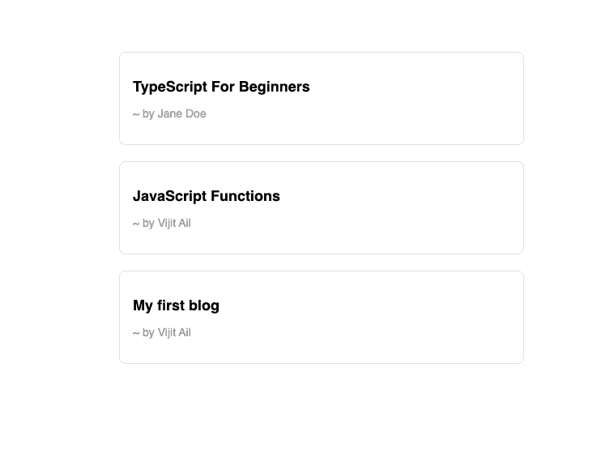

## 内容管理系统的替代方案

根据您的具体需求和要求，您可以考虑使用 Contentful 的几种替代方案。一些受欢迎的选项包括:

*   是一个无头的 CMS，它提供了一个实时的协作编辑环境和一组健壮的 API
*   Strapi 是一个开源的无头 CMS，它提供了一个用户友好的界面和一系列可定制的特性
*   Kontent.ai 是一个基于云的无头内容管理系统，提供了跨不同渠道和设备管理和交付内容的高级功能
*   DatoCMS 是一个无头 CMS，允许开发者为他们的网站和应用程序创建和管理内容。它是电子商务网站的流行选择，因为它提供了一种灵活的、可扩展的方式来建立和管理在线商店
*   [Payload](https://payloadcms.com/) 是一个无头 CMS 和应用框架。它旨在为管理和存储内容提供一个强大的后端，同时在应用程序变得更加复杂时置身事外

每种选择都有独特的特性和功能，因此值得仔细考虑，以确定哪种最适合您的项目。

## 结论

使用像 Contentful 这样的 CMS 可以提高 Next.js 应用程序的性能，因为它允许您将内容与应用程序代码分开存储和交付。这可以使您的应用程序更快、更具可伸缩性，尤其是在您有大量内容或流量的情况下。

通过 Contentful，您可以使用 API 将您的内容交付到任何平台或设备。只需几行代码，Contentful 就可以集成到 Next.js web 应用程序中，使您能够灵活、动态地访问和显示内容。

## [LogRocket](https://lp.logrocket.com/blg/nextjs-signup) :全面了解生产 Next.js 应用

调试下一个应用程序可能会很困难，尤其是当用户遇到难以重现的问题时。如果您对监视和跟踪状态、自动显示 JavaScript 错误、跟踪缓慢的网络请求和组件加载时间感兴趣，

[try LogRocket](https://lp.logrocket.com/blg/nextjs-signup)

.

[](https://lp.logrocket.com/blg/nextjs-signup)[](https://lp.logrocket.com/blg/nextjs-signup)

LogRocket 就像是网络和移动应用的 DVR，记录下你的 Next.js 应用上发生的一切。您可以汇总并报告问题发生时应用程序的状态，而不是猜测问题发生的原因。LogRocket 还可以监控应用程序的性能，报告客户端 CPU 负载、客户端内存使用等指标。

LogRocket Redux 中间件包为您的用户会话增加了一层额外的可见性。LogRocket 记录 Redux 存储中的所有操作和状态。

让您调试 Next.js 应用的方式现代化— [开始免费监控](https://lp.logrocket.com/blg/nextjs-signup)。