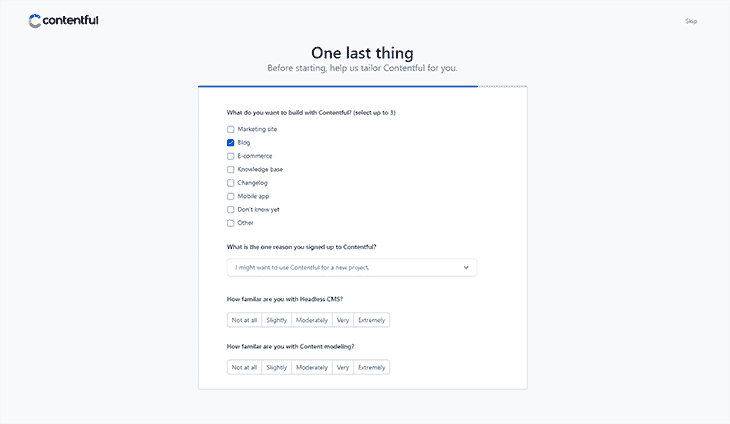
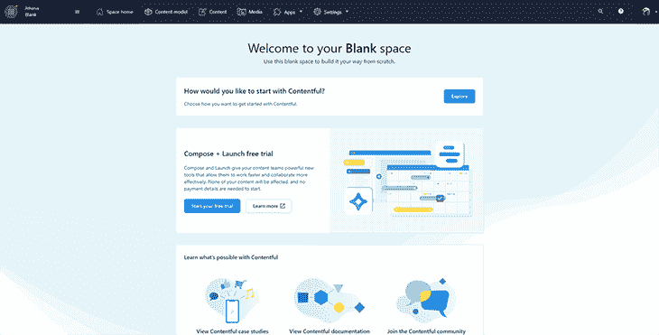
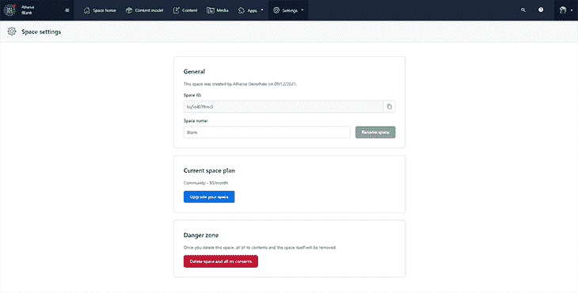
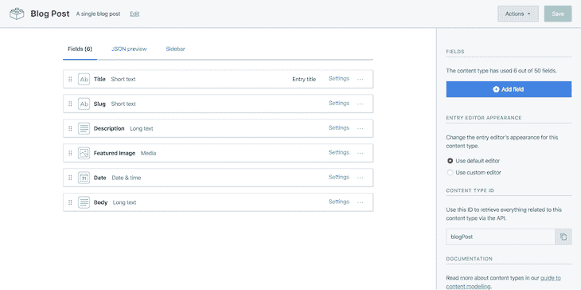
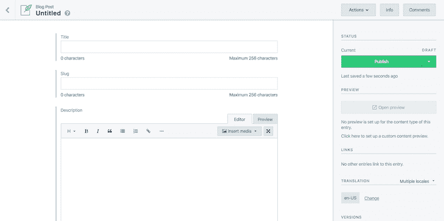
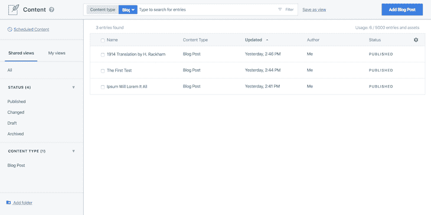
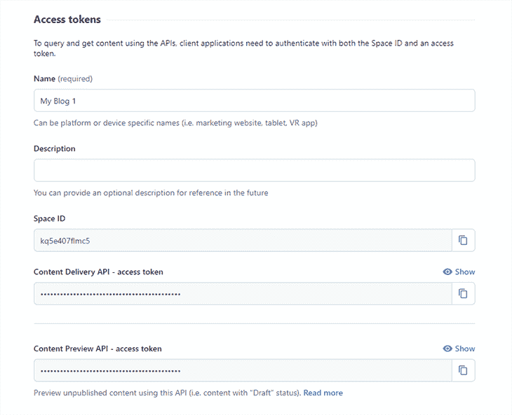
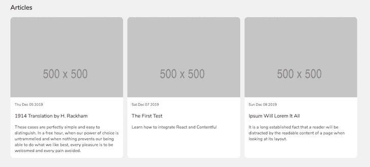
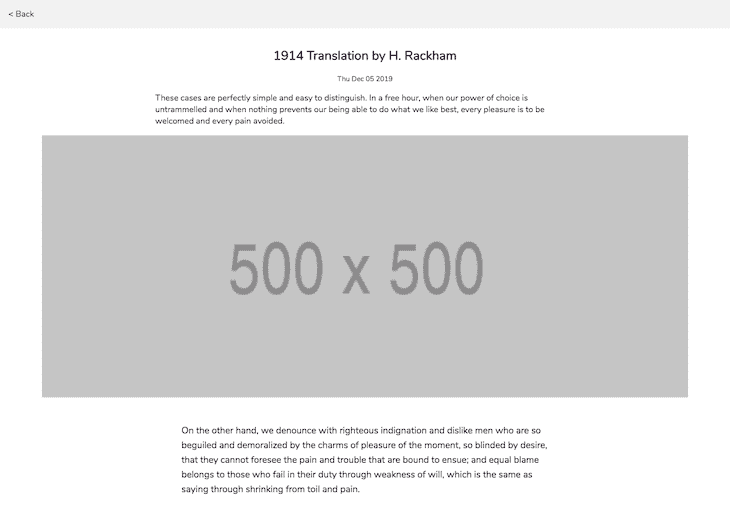
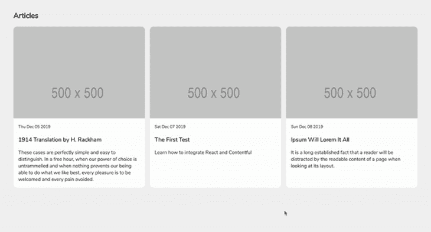

# 在 React - LogRocket 博客中使用 Contentful

> 原文：<https://blog.logrocket.com/using-contentful-with-react/>

***编者按**:这篇文章最后一次更新是在 2021 年 12 月 20 日，修改了标题以反映这篇文章对 Contentful 的紧密关注，承认自这篇文章最初发表以来出现的其他 headless CMS 选项，并在 Contentful 配置文件创建步骤中添加了更新的图像和漫游步骤。*

假设我想使用 React 创建自己的个人博客。我想为它使用一个无头 CMS，因为我不想从头开始创建后端。于是我开始寻找一些很酷的无头 CMS。

[contentiful](https://www.contentful.com/)被推荐了很多，所以我猜值得一试。这是我打算做的:

## 设置内容

嗯…所以我在官方网站上看了更多关于 Contentful 的东西，它声称[不是传统的无头 CMS](https://www.contentful.com/r/knowledgebase/what-is-headless-cms/#what-is-headless-cms-vs-decoupled-cms) 。这是一个“内容基础设施”,显然会给我更多的灵活性来组织我的内容。

不过，如果你问我，我认为它只是一个无头 CMS 的变种，因为它满足了成为无头 CMS 的标准。如果它允许你写一次，并交付到任何地方，那么它对我来说是一个无头的 CMS🤷。

无论如何，我注册了一个免费账户，事实证明设置它真的很容易。在我点击注册之后，我看到了这个页面:



我在这里选择“博客”,因为我现在只想用 Contentful 创建一个博客。然后我提交了包含所有相关信息的表格。

Contentful 自动为我的博客创建一个免费空间。这是我在仪表盘上看到的:



我将空间的名称从“空白”更改为更好的名称—为什么要保留它的名称“空白”呢？我点击了顶部导航栏上的**设置**，点击了**通用设置**。这给了我以下屏幕:



然后我把空间的名字改成了**我的博客**(老实说，我想不出更好的名字了)，并按下**重命名空间**。

现在我的空间准备好了，我可以开始工作了。

## 在 Contentful 中创建内容模型

### Contentful 中的内容模型是什么？

在我创建一篇博客文章之前，我必须创建一个叫做[内容模型](https://www.contentful.com/developers/docs/concepts/data-model/)的东西，它只是一种内容应该看起来的结构(或模式)。我选择将此视为我的内容的模式。

我必须想出帖子应该是什么样子的结构，谢天谢地，这很容易。这就像写下每个帖子需要什么数据以及这些数据的类型一样简单。在我的例子中，我已经列出了所需的数据以及它们各自的数据类型:

*   **标题**–短文本
*   **Slug**–短文本
*   **描述**–长文本
*   **特色图片**–一张图片
*   **日期**–日期和时间
*   **正文**–长文本

### 创建模型

写下所需的数据之后，我继续在 Contentful 中创建了我的内容模型。在我刚刚创建的**我的博客**空间中，我点击顶部导航菜单上的**内容模型**，然后点击下面页面上的**设计你的内容模型**。

弹出一个模态，我填写了新内容模型的名称。我把它叫做“博客文章”,并开始从右边的侧边栏添加我上面列出的字段。当我添加完所有不同的字段时，我得到了类似于下面的内容:



现在我已经建立了我的博客文章内容模型(或者模式，如果你喜欢的话),我点击了**保存**,现在是时候添加实际的博客文章了，我将把它们放入我的 React 应用程序中。

还是在我的博客空间，我点击顶部导航菜单上的**内容**，点击**添加博文**。如果你跟随并且创造了一个不同的内容模型，**添加博客文章**可能会有所不同。

无论如何，点击那个按钮会把我带到一个页面，在那里我可以像这样写和编辑我的博客文章:



这就是为什么我首先需要一个 CMS 一个写和编辑我的博客文章的地方，这样我就可以把它们发送到我喜欢的任何地方。我继续添加了三个虚拟帖子，这样我就可以在 React 应用程序中加入一些东西。

以下是我写完博客后的列表:



好了，一切都很顺利，我觉得是时候总结一下我到目前为止学到的东西了:

*   一个无头的内容管理系统允许我一次创建我的内容，然后把它发布到我喜欢的任何地方
*   Contentful 就是这样一个 CMS，它具有更高级的功能，比如针对我的内容的结构良好的模式
*   我可以创建和编辑各种格式的内容，包括 Markdown 和富文本
*   Contentful 还提供了一个 CDN 来存储和托管我在博客文章中上传的任何媒体

## 与 Contentful 这样的无头 CMS 集成 React

在我可以将 Contentful 集成到我的应用程序之前，我实际上必须先创建应用程序。我希望我的博客看起来和下面的一模一样。

那么这个应用程序有哪些不同的组件呢？

*   一个`App.jsx`组件来处理到不同页面的路由
*   一个`Posts.jsx`组件，用于显示站点上的帖子列表
*   显示一篇文章的组件

事实证明并不是很多。当然，如果你有自己的个人网站，并希望遵循本教程，你可能有更多的组件，但在这种情况下，这就是我所需要的。

## 构建应用程序

我运行了以下脚本来设置我的项目并安装所需的依赖项:

```
mkdir react-contentful && cd react-contentful
npm init -y
npm i --save react react-dom react-router-dom react-markdown history contentful
npm i --save-dev parcel-bundler less

```

我刚装的有两个特别重要的包:`react-markdown`和`contentful`。
[`react-markdown`](https://github.com/rexxars/react-markdown) 允许我将 Markdown 内容解析成 HTML 标签。我需要它，因为我在 Contentful 中将我的帖子内容存储为“长文本”,这意味着我的帖子正文将会被 Markdown。

[`contentful`](https://www.npmjs.com/package/contentful) 是来自 Contentful 的官方节点包，它将允许我与其 API 进行交互。我需要它从 Contentful 中检索我的内容。其他每个包都是不言自明的。

## 创建我的文件

安装完所有必需的依赖项后，我创建了这个项目所需的不同文件和文件夹。我将省略本教程中一些文件的内容，但我会添加链接，以便您可以复制它们并跟随。

*   运行这个脚本来创建所有需要的文件夹:

    ```
    mkdir public src src/components src/custom-hooks src/components/{posts,single-post}
    ```

*   运行这个脚本来创建所有需要的文件:

    ```
    touch public/index.html public/index.css src/{index,contentful}.js
    ```

*   运行这个脚本来创建所有的组件:

    ```
    touch src/components/App.jsx src/components/helpers.js src/components/posts/Posts.jsx src/components/posts/Posts.less src/components/single-post/SinglePost.jsx src/components/single-post/SinglePost.less
    ```

*   运行这个脚本来创建所有的定制钩子:

    ```
    touch src/custom-hooks/{index,usePosts,useSinglePost}.js
    ```

我不会仔细检查以下文件的代码，因为它们对本教程来说并不重要:

如果你在教程的某个地方卡住了，请随意参考 [GitHub 库](https://github.com/ovieokeh/react-contentful)。

## 推广文件

现在我已经准备好了我的项目结构以及所有需要的文件和文件夹，我开始编写代码，我将首先从最基本的部分开始。

```
src/contentful.js
const client = require('contentful').createClient({
  space: '<my_space_id>',
  accessToken: '<my_access_token>'
})

const getBlogPosts = () => client.getEntries().then(response => response.items)

const getSinglePost = slug =>
  client
    .getEntries({
      'fields.slug': slug,
      content_type: 'blogPost'
    })
    .then(response => response.items)

export { getBlogPosts, getSinglePost }

```

我从与 Contentful 交互以检索我的博客文章的代码开始。我想在 Contentful 中查询我的内容，所以我浏览了一下 [`contentful`包文档](https://www.npmjs.com/package/contentful#your-first-request)，发现我需要导入这个包，并向它传递一个包含空间 ID 和我的访问令牌的 config 对象。

获取这些信息很简单，我所要做的就是按照内容丰富的文档上的说明去做。

为了获得访问令牌，我回到我的内容丰富的仪表板，点击顶部栏上的**设置**，并点击 **API 键**。然后我创建了新的 API 键，我得到了如下的 API 键信息:



在获得我的空间 ID 和访问令牌后，我需要`contentful`包，并使用包含我的凭证的 config 对象调用`createClient`方法。这给了我一个对象，`client`，允许我与心满意足互动。

概括一下，我想找回:

*   我所有的博客帖子
*   一篇博客文章

为了检索我所有的博客文章，我创建了一个函数`getBlogPosts`，它为我做到了这一点。在这个函数中，我调用了`client.getEntries()`，它返回一个承诺，最终解析为一个包含`items`的`response`对象，这是我的博客文章数组。

为了检索一篇博客文章，我创建了一个名为`getSinglePost`的函数，它接受一个“slug”参数，并查询包含该 slug 的任何文章的内容。记住“slug”是我在我的博客文章内容模型中创建的字段之一，这就是为什么我可以在我的查询中引用它。

* * *

### 更多来自 LogRocket 的精彩文章:

* * *

在`getSinglePost`函数中，我再次调用了`client.getEntries()`，但是这一次，我传递了一个查询对象，指定我想要的任何内容:

*   有一个与“slug”参数匹配的 slug
*   是一篇博文

然后，在文件末尾，我导出了这两个函数，这样我就可以在其他文件中使用它们。接下来我创建了自定义钩子。

### `custom-hooks/usePosts.js`

```
import { useEffect, useState } from 'react'

import { getBlogPosts } from '../contentful'

const promise = getBlogPosts()

export default function usePosts() {
  const [posts, setPosts] = useState([])
  const [isLoading, setLoading] = useState(true)

  useEffect(() => {
    promise.then(blogPosts => {
      setPosts(blogPosts)
      setLoading(false)
    })
  }, [])

  return [posts, isLoading]
}

```

`usePosts`钩子允许我从`Posts.jsx`组件的 Contentful 中检索我的博客文章。

我在这个文件中导入了三个模块:

*   我需要这个来更新自定义钩子的状态
*   我需要它来存储博客文章列表以及当前的加载状态
*   这个功能让我可以对我的博客内容进行查询

在将所有需要的模块导入这个文件之后，我通过调用`getBlogPosts()`函数开始了获取我的博客文章的调用。这将返回一个承诺，我将它存储在`promise`变量中。

在`usePosts()`钩子中，我初始化了两个状态变量:

*   `posts`，保存博文列表
*   `isLoading`，保存博客文章获取请求的当前加载状态

然后，在`useEffect`调用中，我解析了之前创建的承诺，然后用新的博客文章数据更新了`posts`状态变量。在此之后，我还将加载状态设置为 false。

在这个钩子的末尾，我返回了一个包含`posts`和`isLoading`变量的数组。

### `custom-hooks/useSinglePost.js`

```
import { useEffect, useState } from 'react'

import { getSinglePost } from '../contentful'

export default function useSinglePost(slug) {
  const promise = getSinglePost(slug)

  const [post, setPost] = useState(null)
  const [isLoading, setLoading] = useState(true)

  useEffect(() => {
    promise.then(result => {
      setPost(result[0].fields)
      setLoading(false)
    })
  }, [])

  return [post, isLoading]
}

```

除了一些小的例外，`useSinglePost`定制钩子与`usePosts`钩子非常相似。

不像`usePosts`，我在钩子外面开始调用`getBlogPosts`，我在`useSinglePost`钩子内部进行调用(但对`getSinglePost()`)。我这样做是因为我想将“slug”参数传递给`getSinglePost`函数，如果在自定义钩子之外调用它，我就不能这样做。

继续，我还有相同的状态变量来保存被检索的单个帖子，以及请求的加载状态。

在`useEffect`调用中，我解析了承诺并适当地更新了状态变量。
我还返回了一个数组，最后包含了`post`和`isLoading`状态变量。

### `components/App.jsx`

```
import React from 'react'
import { Router, Switch, Route } from 'react-router-dom'
import { createBrowserHistory } from 'history'

import Posts from './posts/Posts'
import SinglePost from './single-post/SinglePost'

export default function App() {
  return (
    <Router history={createBrowserHistory()}>
      <Switch>
        <Route path="/" exact component={Posts} />
        <Route path="/:id" component={SinglePost} />
      </Switch>
    </Router>
  )
}
App.jsx is the root component responsible for routing the user to the correct page.

```

我导入了一些必需的依赖项。我还需要复习一下 React 路由器是如何工作的，[所以我浏览了这篇短文](https://blog.pshrmn.com/simple-react-router-v4-tutorial/)。

### `components/posts/Posts.jsx`

现在我已经设置好了所有的定制挂钩和查询函数，我想检索我所有的博客文章，并在一个网格中显示它们，如下所示:



I started off with a bunch of dependency imports, among which is the `usePosts` custom Hook for fetching all my blog posts from Contentful. I also created a nice little helper called `readableDate`, which helped me parse the date the article was published into a user-friendly format.

```
import React from 'react'
import { Link } from 'react-router-dom'

import { usePosts } from '../../custom-hooks/'
import { readableDate } from '../helpers'
import './Posts.less'

...continued below...

```

接下来我创建了组件。这是一个简单的功能组件，不需要管理或跟踪任何状态变量。

一开始，我使用了`usePosts`钩子来获取我的帖子和加载状态。然后我定义了一个函数`renderPosts`，来遍历博客文章列表，并为每篇文章返回一串 JSX。

在这个函数中，我首先检查了加载状态。如果请求仍在加载，它将返回加载消息并结束执行。否则，它映射到 postss 数组，并为每个 post 返回一个`<Link />`元素。

这个`Link`元素将把我的读者重定向到他们点击的任何帖子的链接。在这个 link 元素中，我还呈现了一些重要的信息，比如文章的特色图片、发表日期、标题和简短描述。

最后，在`Posts`组件的返回语句中，我调用了`renderPosts()`函数。

```
...continuation...
export default function Posts() {
  const [posts, isLoading] = usePosts()

  const renderPosts = () => {
    if (isLoading) return <p>Loading...</p>

    return posts.map(post => (
      <Link
        className="posts__post"
        key={post.fields.slug}
        to={post.fields.slug}
      >
        <div className="posts__post__img__container">
          
        </div>

        <small>{readableDate(post.fields.date)}</small>
        <h3>{post.fields.title}</h3>
        <p>{post.fields.description}</p>
      </Link>
    ))
  }

  return (
    <div className="posts__container">
      <h2>Articles</h2>

      <div className="posts">{renderPosts()}</div>
    </div>
  )
}

```

概括一下，我在这个部分做了以下工作:

我调用了`usePosts()`自定义钩子。这将返回两个变量，`posts`和`isLoading`。`posts`要么是空的，要么包含我的内容空间上的博文列表。`isLoading`为真或假，这取决于获取博客文章的请求是否仍处于待定状态。

我定义了一个`renderPosts()`函数，它要么将加载消息呈现给 DOM，要么呈现我的博客文章。它检查`isLoading`变量以确定博客文章是否准备好了，然后将适当的内容呈现给 DOM。

在`return`语句中，我回了一堆 JSX，调用了`renderPosts()`。

继续下一个部分。

### `components/single-post/SinglePost.jsx`

我还需要呈现单个博客帖子，为此，我需要一个`SinglePost`组件，看起来应该是这样的:



同样，和往常一样，我从一堆依赖项导入开始:

```
import React from 'react'
import { Link, useParams } from 'react-router-dom'
import MD from 'react-markdown'

import { useSinglePost } from '../../custom-hooks'
import { readableDate } from '../helpers'
import './SinglePost.less'

```

这里有几个新的，不熟悉的进口:

*   [`useParams`](https://reacttraining.com/blog/react-router-v5-1/#useparams) :这将允许我从 React 路由器读取动态路由参数
*   这将帮助我把我的减价内容转换成 HTML 并呈现出来

除了新的之外，我还导入了`useSinglePost`自定义钩子和`readableDate`助手。

接下来，我创建了实际的组件。

```
...continued...
export default function SinglePost() {
  const { id } = useParams()
  const [post, isLoading] = useSinglePost(id)

  const renderPost = () => {
    if (isLoading) return <p>Loading...</p>

    return (
      <>
        <div className="post__intro">
          <h2 className="post__intro__title">{post.title}</h2>
          <small className="post__intro__date">{readableDate(post.date)}</small>
          <p className="post__intro__desc">{post.description}</p>

          
        </div>

        <div className="post__body">
          <MD source={post.body} />
        </div>
      </>
    )
  }
...continued below...

```

在我继续之前，我想简单介绍一下`useParams`是如何工作的。在`App.jsx`中，我有以下代码片段:

```
<Route path="/:id" component={SinglePost} />

```

这只是将任何匹配传递给`path`的 URL 模式的请求路由到`SinglePost`组件。React 路由器还传递一些额外的道具给`SinglePost`组件。其中一个道具是一个包含路径 URL 中所有参数的`params`对象。

在这种情况下，`params`将包含`id`作为参数之一，因为我在这个特定路由的路径 URL 中明确指定了`id`。因此，如果我导航到一个类似于`localhost:3000/contentful-rules`的 URL，`params`将会是这样的:

```
{
  id: 'contentful-rules'
}

```

这也是`useParams`发挥作用的地方。它将允许我查询`params`对象，而不必从组件的 props 中析构它。我现在有一种方法来获取当前 URL 中的任何 slug。

好了，回到组件。现在，我有了一种方法来获取被点击的任何文章的 slug，我现在能够将 slug 传递给`useSinglePost`自定义钩子，并且我能够获得带有该 slug 的帖子以及获取帖子的请求的加载状态。
从`useSinglePost`钩子中获得 post 对象和加载状态后，我定义了一个`renderPost`函数，它将根据加载状态向 DOM 或实际的 post 呈现加载消息。

还要注意，在代码片段的末尾，我有这样一行代码:

```
<MD source={post.body} />

```

这是 React Markdown 组件，我需要用它将我的 Markdown post 主体解析成浏览器能够识别的实际 HTML。

```
...continued...

  return (
    <div className="post">
      <Link className="post__back" to="/">
        {'< Back'}
      </Link>

      {renderPost()}
    </div>
  )
}

```

最后，我使用 return 语句来呈现这个组件中的数据。我添加了一个返回主页的链接，这样我的用户就可以很容易地返回主页。在链接之后，我简单地调用了`renderPost()`函数来将文章呈现到 DOM 中。

概括一下，我在这个组件中做了以下工作:

我调用了`useSinglePost()`自定义钩子。这将返回两个变量，`post`和`isLoading`。`post`要么为空，要么为包含发布数据的对象。`isLoading`为真或假，这取决于获取职位的请求是否仍处于待定状态。

然后，我定义了一个`renderPost()`函数，它要么将加载消息呈现给 DOM，要么呈现博客文章。它检查`isLoading`变量以确定博客文章是否准备好了，然后将适当的内容呈现给 DOM。

在`return`语句中，我返回了一串 JSX，并调用了`renderPost()`。

## 把所有的放在一起

在编写了所有组件的代码并添加了适当的样式后，我决定运行我的项目，看看它是否都工作正常。在我的`package.json`中，我添加了以下脚本:

```
"scripts": {
    "start": "parcel public/index.html",
    "build": "parcel build public/index.html --out-dir build --no-source-maps"
  },

```

当我在我的终端中运行`npm run start`时，Parcel 为我构建了我的 React 应用程序，并通过端口 1234 提供它。在我的浏览器上导航到`[http://localhost:1234](http://localhost:1234)`显示了我的应用程序及其所有的荣耀，还有博客文章。

我试着点击一篇博文，然后我被重定向到一个可以阅读那篇博文的页面，所以看起来我对 React 和 Contentful 的小实验如我所愿。



不过，我很清楚，这并不是构建静态博客这样简单的东西的最佳方式。有更好的选择，像 [Next.js](https://nextjs.org/) 和 [Gatsby.js](https://www.gatsbyjs.org/) ，这将使这个过程变得更加容易，并且实际上会默认产生一个更快、更容易访问的博客。

但是如果你的用例仅仅是将 Contentful 中的内容放入 React 应用程序，那么这个指南应该对你有帮助。

## [LogRocket](https://lp.logrocket.com/blg/react-signup-general) :全面了解您的生产 React 应用

调试 React 应用程序可能很困难，尤其是当用户遇到难以重现的问题时。如果您对监视和跟踪 Redux 状态、自动显示 JavaScript 错误以及跟踪缓慢的网络请求和组件加载时间感兴趣，

[try LogRocket](https://lp.logrocket.com/blg/react-signup-general)

.

[ ](https://lp.logrocket.com/blg/react-signup-general) [](https://lp.logrocket.com/blg/react-signup-general) 

LogRocket 结合了会话回放、产品分析和错误跟踪，使软件团队能够创建理想的 web 和移动产品体验。这对你来说意味着什么？

LogRocket 不是猜测错误发生的原因，也不是要求用户提供截图和日志转储，而是让您回放问题，就像它们发生在您自己的浏览器中一样，以快速了解哪里出错了。

不再有嘈杂的警报。智能错误跟踪允许您对问题进行分类，然后从中学习。获得有影响的用户问题的通知，而不是误报。警报越少，有用的信号越多。

LogRocket Redux 中间件包为您的用户会话增加了一层额外的可见性。LogRocket 记录 Redux 存储中的所有操作和状态。

现代化您调试 React 应用的方式— [开始免费监控](https://lp.logrocket.com/blg/react-signup-general)。