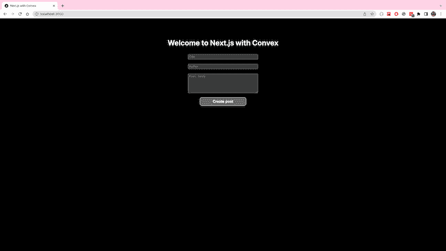
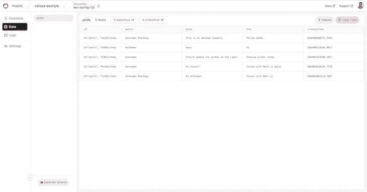
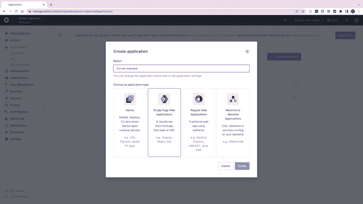
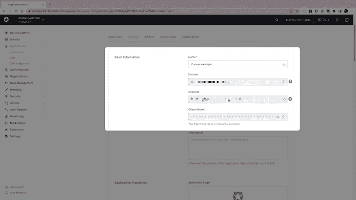
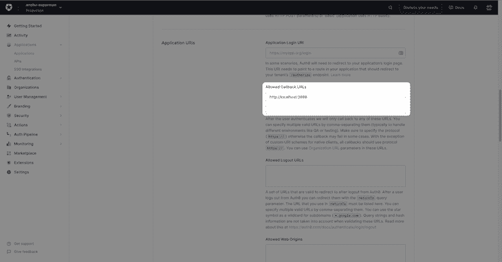
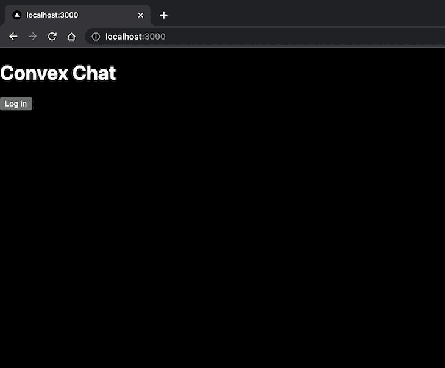
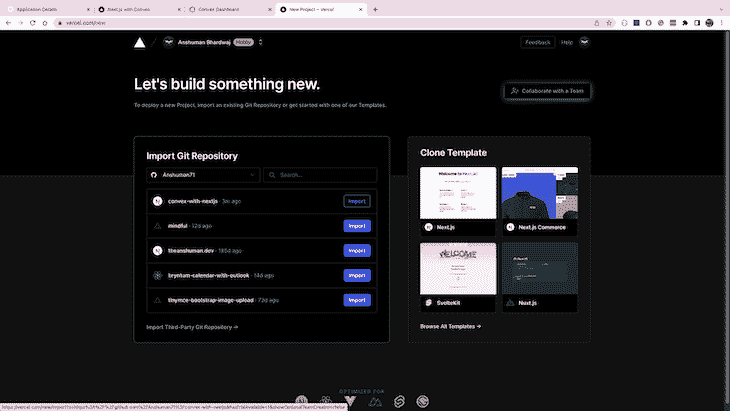
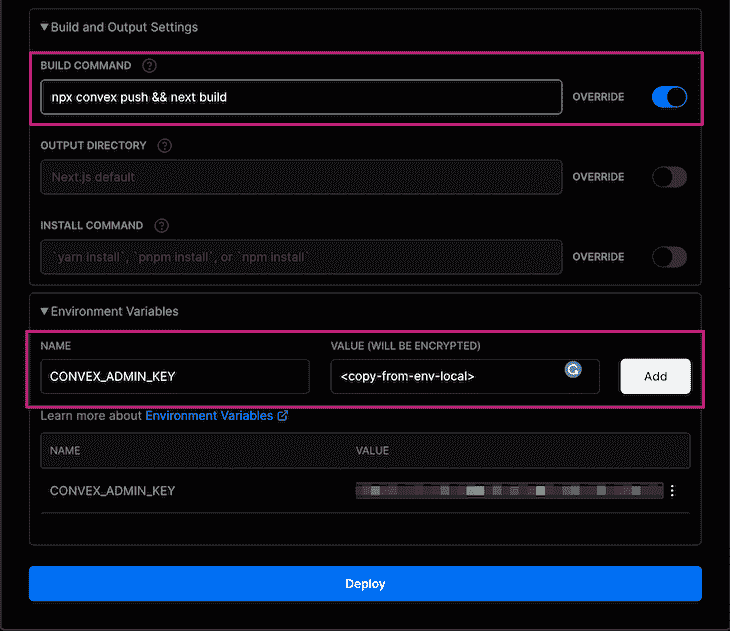
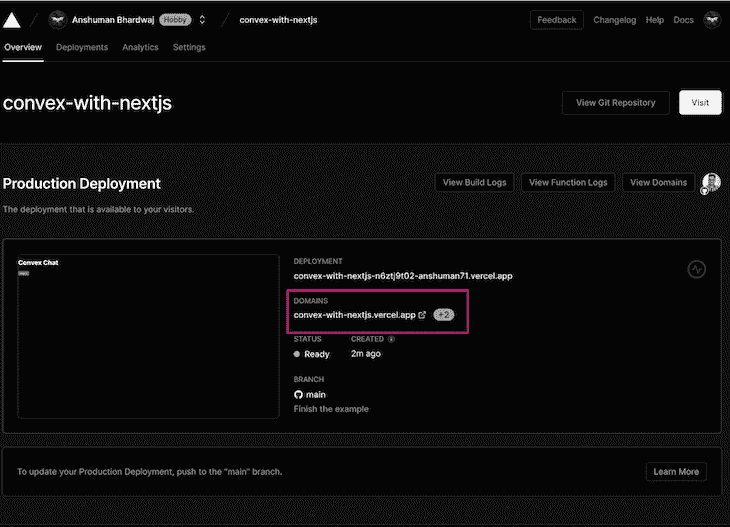

# 使用 Convex 进行状态管理的指南

> 原文：<https://blog.logrocket.com/using-convex-for-state-management/>

像 React 这样的现代前端框架让开发人员的状态管理变得更加容易，但是使用 Convex 这样的解决方案进行状态管理会让这变得更加容易。在 React 中，组件的状态决定了 UI 的外观，尽管管理应用程序的状态已经变得相对简单，但全局状态的概念仍然是开发人员的一个难题。

在本教程中，我们将使用 Convex 构建一个用于全局状态管理的全栈 Next.js 应用程序。我们还将实现凸函数来查询和更新数据。到本教程结束时，我们将已经将最终的应用程序部署到 Vercel 上——请使用这个 [GitHub 库](https://github.com/Anshuman71/convex-with-nextjs)随意跟随本演练。

## 什么是凸？

例如，考虑跟踪金融交易的应用程序，这些应用程序使用所有客户端都可以实时更改和观察的全局状态。这种应用程序很难开发，因为开发人员需要在应用程序之间同步状态，并关注 ACID 属性。

[Convex](https://www.convex.dev/) 旨在通过提供包括数据存储、检索和突变在内的全栈解决方案来解决这一问题，所有这些都内置于用于全局状态管理的 SDK 中。它的无服务器方法非常高效，是一个高度可扩展的平台。Convex 是一个开发者至上的平台，其反应式架构与 React 很好地结合在一起，SDK 另外还支持像[乐观更新](https://docs.convex.dev/using/optimistic-updates)和订阅这样的功能。

### 先决条件

您需要 Node.js、npm 或 yarn，以及安装在计算机上的代码编辑器，如 VS Code。您还需要一个 GitHub 帐户来使用 Convex。

## 建立一个 Next.js 项目

该应用程序将允许用户查看现有帖子的列表，并提交新的博客帖子。一篇博客文章将包含标题、正文和作者姓名。

首先，运行以下命令来设置一个新的 Next.js 项目:

```
npx [email protected] convex-example --typescript

```

在代码编辑器中打开项目并更新`pages/index.tsx`文件以显示一个表单，从而创建一篇博客文章:

```
// pages/index.tsx
import type { NextPage } from 'next'
import Head from 'next/head'
import styles from '../styles/Home.module.css'
import { useCallback, useState } from 'react'

const Home: NextPage = () => {
  const [author, setAuthor] = useState('')
  const [title, setTitle] = useState('')
  const [body, setBody] = useState('')

  const createPost = async () => {
    // TODO: create a new post inside database
    console.log({ author, title, body  })
    // reset the inputs after submission
    setAuthor('')
    setBody('')
    setTitle('')
  }

  return (
      <div className={styles.container}>
        <Head>
          <title>Next.js with Convex</title>
          <meta name="description" content="Generated by create next app" />
          <link rel="icon" href="/favicon.ico" />
        </Head>

        <main className={styles.main}>
          <h1 className={styles.title}>
            Welcome to <a href="https://nextjs.org">Next.js</a> with{' '}
            <a href="https://convex.dev">Convex</a>
          </h1>
          <input
              type={'text'}
              value={title}
              placeholder={'Title'}
              className={styles.inputStyles}
              onChange={(event) => setTitle(event.target.value)}
          />      
          <input
              type={'text'}
              value={author}
              placeholder={'Author'}
              className={styles.inputStyles}
              onChange={(event) => setAuthor(event.target.value)}
          />
          <textarea
              value={body}
              rows={5}
              placeholder={'Post body '}
              className={styles.inputStyles}
              onChange={(event) => setBody(event.target.value)}
          />
          <button className={styles.button} onClick={createPost}>
            Create post
          </button>
        </main>
      </div>
  )
}

export default Home

```

将`styles/Home.module.css`更新如下:

```
/* styles/Home.module.css */
.container {
  padding: 0 2rem;
  display: flex;
  flex-direction: column;
}

.main {
  padding: 4rem 0;
  flex: 10;
  display: flex;
  flex-direction: column;
  justify-content: center;
  align-items: center;
}

.button {
  font-size: 1rem;
  font-weight: 800;
  cursor: pointer;
  margin: 0.5rem;
  padding: 0.5rem;
  text-decoration: none;
  border: 1px solid #eaeaea;
  border-radius: 10px;
  transition: color 0.15s ease, border-color 0.15s ease;
  width: 200px;
}

.button:hover,
.button:focus,
.button:active {
  color: #0070f3;
  border-color: #0070f3;
}

.inputStyles {
  width: 300px;
  margin: 10px auto;
}

```

运行`npm run dev`启动应用程序，然后在网络浏览器中打开`[http://localhost:3000/](http://localhost:3000/)`。



创建新帖子的表单已经准备好了。现在，您必须实现使用 Convex 保存和读取数据的逻辑。

## 设置凸面

Convex 提供了一个可以在项目中使用的 JavaScript SDK。

1.  运行`npm i convex`安装凸包
2.  在项目内部，运行`npx convex login`，这将在浏览器中打开一个页面，使用您的 GitHub 帐户登录 Convex
3.  登录后，运行`npx convex init`用`convex.json`和`.env.local`初始化 Convex 项目进行配置。该命令还将创建一个`convex/`目录，以便将函数写入其中

(注意:该命令将提示您输入项目名称)

最后，更新`pages/_app.tsx`以将`ConvexProvider`添加到完整的应用程序中。`ConvexProvider`将允许你在应用程序中使用 Convex 提供的 React 钩子。

```
// pages/_app.tsx
import '../styles/globals.css'
import type { AppProps } from 'next/app'

import { ConvexProvider, ConvexReactClient } from 'convex/react'
import convexConfig from '../convex.json'
const convex = new ConvexReactClient(convexConfig.origin)

function MyApp({ Component, pageProps }: AppProps) {
  return (
      <ConvexProvider client={convex}>
        <Component {...pageProps} />
      </ConvexProvider>
  )
}

export default MyApp

```

## 使用 Convex 添加状态管理

随着 Convex 在项目中的设置，是时候创建一个数据模型，并将前端与数据库连接起来。

### 定义模式

在`convex/`文件夹中，创建一个新文件`schema.ts`，为博客文章定义模式。`defineTable`功能将在凸面内部创建一个`posts`表格。

```
// convex/schema.ts
import { defineSchema, defineTable, s } from 'convex/schema'

export default defineSchema({
  posts: defineTable({
    title: s.string(),
    author: s.string(),
    body: s.string(),
  }),
})

```

现在，运行`npx convex codegen`为`posts`模式生成类型定义，以改进代码完成。这将允许你引用文章为`Document<'posts'>`。

### 实现凸函数

凸函数允许前端以两种方式与数据库通信:查询和变异。

这些函数是从`convex`目录中的文件导出的，它们被部署为无服务器函数来执行数据库交互。

前端需要读取可用的帖子。为此，创建一个新文件；`convex/getPosts.ts`。该文件导出一个查询函数，从数据库中返回所有可用的`posts`。

```
// convex/getPosts.ts
import { query } from './_generated/server'
import { Document } from './_generated/dataModel'

export default query(async ({ db }): Promise<Document<'posts'>[]> => {
  return await db.table('posts').collect()
})

```

在`convex/`文件夹中，创建一个名为`addPost.ts`的新文件。这个文件导出了一个变异函数，允许用户向数据库中添加新的帖子。该函数接受一个`post`对象作为参数。

```
// convex/addPost.ts
import { mutation } from './_generated/server'

export default mutation(
  async (
    { db },
    post: { author: string; body: string; title: string }
  ) => {
    await db.insert('posts', post)
  }
)

```

运行`npx convex push`生成类型定义并将函数部署到 Convex。

### 用凸函数连接组件

Convex 提供了`useQuery`和`useMutation`钩子来使用上面实现的函数与数据库交互。

将`useMutation`钩子添加到`Home`组件中，并更新`createPost`函数，用 post 数据调用`addPost`变异函数。

```
// pages/index.tsx
import type { NextPage } from 'next'
import Head from 'next/head'
import styles from '../styles/Home.module.css'
import { useCallback, useState } from 'react'
import {useMutation} from "../convex/_generated/react";

const Home: NextPage = () => {
  const addPost = useMutation('addPost')

  const [author, setAuthor] = useState('')
  const [title, setTitle] = useState('')
  const [body, setBody] = useState('')

  const createPost = async () => {
    await addPost({ body, author, title});
    // reset the inputs after submission
    setAuthor('')
    setBody('')
    setTitle('')
  }

  return (
      // return the component
  )
}

export default Home

```

添加`useQuery`钩子从数据库中获取并显示文章列表。在加载数据时,`useQuery`钩子将返回`undefined`,然后返回一个帖子列表。

```
// pages/index.tsx
import type { NextPage } from 'next'
import Head from 'next/head'
import styles from '../styles/Home.module.css'
import { useCallback, useState } from 'react'
import {useMutation, useQuery} from "../convex/_generated/react";

const Home: NextPage = () => {
  const posts = useQuery('getPosts')
  const addPost = useMutation('addPost')

  const [author, setAuthor] = useState('')
  const [title, setTitle] = useState('')
  const [body, setBody] = useState('')

  const createPost = async () => {
    await addPost({ body, author, title});
    // reset the inputs after submission
    setAuthor('')
    setBody('')
    setTitle('')
  }

  return (
      <div className={styles.container}>
        <Head>
          <title>Next.js with Convex</title>
          <meta name="description" content="Generated by create next app" />
          <link rel="icon" href="/favicon.ico" />
        </Head>

        <main className={styles.main}>
          <h1 className={styles.title}>
            Welcome to <a href="https://nextjs.org">Next.js</a> with{' '}
            <a href="https://convex.dev">Convex</a>
          </h1>
          {posts ? (
              <>
                <p className={styles.description}>
                  {'Total posts:'} {posts.length}
                </p>

                <ul>
                  {posts.map((post) => (
                      <li key={post._id.toString()}>{post.title}</li>
                  ))}
                </ul>
              </>
          ) : (
              'Loading posts...'
          )}
          <input
              type={'text'}
              value={title}
              placeholder={'Title'}
              className={styles.inputStyles}
              onChange={(event) => setTitle(event.target.value)}
          />      
          <input
              type={'text'}
              value={author}
              placeholder={'Author'}
              className={styles.inputStyles}
              onChange={(event) => setAuthor(event.target.value)}
          />
          <textarea
              value={body}
              rows={5}
              placeholder={'Post body '}
              className={styles.inputStyles}
              onChange={(event) => setBody(event.target.value)}
          />
          <button className={styles.button} onClick={createPost}>
            Create post
          </button>
        </main>
      </div>
  )
}

export default Home

```

你的申请已经准备好了！打开`[http://localhost:3000](http://localhost:3000)`查看它的运行情况:


您会注意到，每当您创建新帖子时，帖子列表都会自动更新。

由于凸全局状态的端到端反应性，这种行为是可能的；*每当数据发生变化时，使用查询的每个*组件都会得到更新。

### 管理凸面

运行`npx convex dashboard`登录[凸面仪表盘](https://dashboard.convex.dev/)管理您的应用数据，查看日志，并查看功能执行和读/写的指标。



## 保护应用程序

保持应用程序数据的安全至关重要，而 Convex 简化了使用身份提供者保护您的数据。Convex 自带对 Auth0 的一流支持，您可以立即设置它。

### 创建 Auth0 应用程序

登录到您的 Auth0 仪表板并创建一个新的单页 Web 应用程序。如果您还没有帐户，您可以在 Auth0 上注册一个免费帐户。



从这个新应用程序的设置页面复制域和客户端 ID，并保存它们以备后用。



在应用程序设置页面中，将`[http://localhost:3000](http://localhost:3000)`添加到“允许的回拨 URL”字段，如下所示。这将使`[http://localhost:3000](http://localhost:3000)`能够在开发期间使用 Auth0 进行登录。



### 设置 Auth0

首先运行`npm i @auth0/auth0-react`在项目中安装 Auth0。

然后，运行`npx convex auth add`将 Auth0 作为身份提供者添加到 Convex。该命令将提示您输入之前复制的域和客户端 ID。

在项目的根目录下创建一个名为`components/`的新文件夹，并为登录组件添加一个名为`Login.tsx`的新文件，该组件有一个提示用户登录的按钮。

```
// components/Login.tsx
import { useAuth0 } from '@auth0/auth0-react'

export function Login() {
  const { isLoading, loginWithRedirect } = useAuth0()
  if (isLoading) {
    return <button className="btn btn-primary">Loading...</button>
  }
  return (
    <main className="py-4">
      <h1 className="text-center">Convex Chat</h1>
      <div className="text-center">
        <span>
          <button className="btn btn-primary" onClick={loginWithRedirect}>
            Log in
          </button>
        </span>
      </div>
    </main>
  )
}

```

更新`pages/_app.tsx`，用`ConvexProviderWithAuth0`替换`ConvexProvider`。

```
import '../styles/globals.css'
import { ConvexProviderWithAuth0 } from 'convex/react-auth0'
import { ConvexReactClient } from 'convex/react'
import convexConfig from '../convex.json'
import { AppProps } from 'next/app'
import { Login } from '../components/Login'

const convex = new ConvexReactClient(convexConfig.origin)
const authInfo = convexConfig.authInfo[0]

function MyApp({ Component, pageProps }: AppProps) {
    return (
        <ConvexProviderWithAuth0
            client={convex}
            authInfo={authInfo}
            loggedOut={<Login />}
        >
            <Component {...pageProps} />
        </ConvexProviderWithAuth0>
    )
}

export default MyApp

```

现在，当您打开应用程序`[http://localhost:3000](http://localhost:3000)`时，您将看到一个登录按钮，而不是 post 表单。



### 将 Auth0 与凸面整合

既然已经配置了 Auth0，就可以保护变异函数了。`mutation`函数提供认证信息作为`auth`对象。`addPost`变异现在将拒绝任何未经认证的请求。

```
// convex/addPost.ts
import { mutation } from './_generated/server'

export default mutation(
    async (
        { db, auth },
        post: { author: string; body: string; title: string }
    ) => {
      const identity = await auth.getUserIdentity()
      if (!identity) {
        throw new Error('Called addPosts without authentication present!')
      }
      await db.insert('posts', post)
    }
)

```

您还可以更新前端的代码，将登录用户名用作作者字段:

```
// pages/index.tsx
import type { NextPage } from 'next'
import Head from 'next/head'
import styles from '../styles/Home.module.css'
import { useCallback, useState } from 'react'
import {useMutation, useQuery} from "../convex/_generated/react";
import {useAuth0} from "@auth0/auth0-react";

const Home: NextPage = () => {
  const {user} = useAuth0()
  const posts = useQuery('getPosts')
  const addPost = useMutation('addPost')

  const [title, setTitle] = useState('')
  const [body, setBody] = useState('')

  const createPost = async () => {
    if(user?.name) {
      await addPost({ body, author: user.name, title});
    }
    // reset the inputs after submission
    setBody('')
    setTitle('')
  }

  return (
      <div className={styles.container}>
        <Head>
          <title>Next.js with Convex</title>
          <meta name="description" content="Generated by create next app" />
          <link rel="icon" href="/favicon.ico" />
        </Head>

        <main className={styles.main}>
          <h1 className={styles.title}>
            Welcome to <a href="https://nextjs.org">Next.js</a> with{' '}
            <a href="https://convex.dev">Convex</a>
          </h1>
          {posts ? (
              <>
                <p className={styles.description}>
                  {'Total posts:'} {posts.length}
                </p>

                <ul>
                  {posts.map((post) => (
                      <li key={post._id.toString()}>{post.title}</li>
                  ))}
                </ul>
              </>
          ) : (
              'Loading posts...'
          )}
          <input
              type={'text'}
              value={title}
              placeholder={'Title'}
              className={styles.inputStyles}
              onChange={(event) => setTitle(event.target.value)}
          />
          <textarea
              value={body}
              rows={5}
              placeholder={'Post body '}
              className={styles.inputStyles}
              onChange={(event) => setBody(event.target.value)}
          />
          <button className={styles.button} onClick={createPost}>
            Create post
          </button>
        </main>
      </div>
  )
}

export default Home

```

## 部署到 Vercel

要部署应用程序，将您的代码(包括`convex.json`)推送到 GitHub 上的一个存储库中，并将其链接到您的 [Vercel 帐户](https://vercel.com/new):



用`npx convex push && next build`替换 build 命令，在部署时将最新的函数推送到 Convex，并从`.env.local`中添加`CONVEX_ADMIN_KEY`环境变量:



部署应用程序后，复制部署 URL ( `.vercel.app`):



将该 URL 添加到 Auth0 应用程序设置中的`[http://localhost:3000](http://localhost:3000)`旁边的允许回调 URL 列表中。


## 结论

您的应用程序现在部署在 Vercel 上。在本教程中，我们学习了全局状态管理，以及如何使用 Convex 部署带有状态管理的 Next.js 应用程序。

我们还学习了如何使用 Auth0 保护应用程序，并将其部署到 Vercel。您可以扩展上面的应用程序，使用像[乐观更新](https://docs.convex.dev/using/optimistic-updates)和[索引](https://docs.convex.dev/using/indexes)这样的高级特性来使它更快。

你可以今天免费试用 Convex，并在他们的文档中阅读更多关于使用它的信息。

## [LogRocket](https://lp.logrocket.com/blg/nextjs-signup) :全面了解生产 Next.js 应用

调试下一个应用程序可能会很困难，尤其是当用户遇到难以重现的问题时。如果您对监视和跟踪状态、自动显示 JavaScript 错误、跟踪缓慢的网络请求和组件加载时间感兴趣，

[try LogRocket](https://lp.logrocket.com/blg/nextjs-signup)

.

[](https://lp.logrocket.com/blg/nextjs-signup)[](https://lp.logrocket.com/blg/nextjs-signup)

LogRocket 就像是网络和移动应用的 DVR，记录下你的 Next.js 应用上发生的一切。您可以汇总并报告问题发生时应用程序的状态，而不是猜测问题发生的原因。LogRocket 还可以监控应用程序的性能，报告客户端 CPU 负载、客户端内存使用等指标。

LogRocket Redux 中间件包为您的用户会话增加了一层额外的可见性。LogRocket 记录 Redux 存储中的所有操作和状态。

让您调试 Next.js 应用的方式现代化— [开始免费监控](https://lp.logrocket.com/blg/nextjs-signup)。