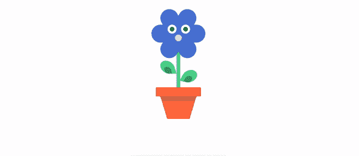
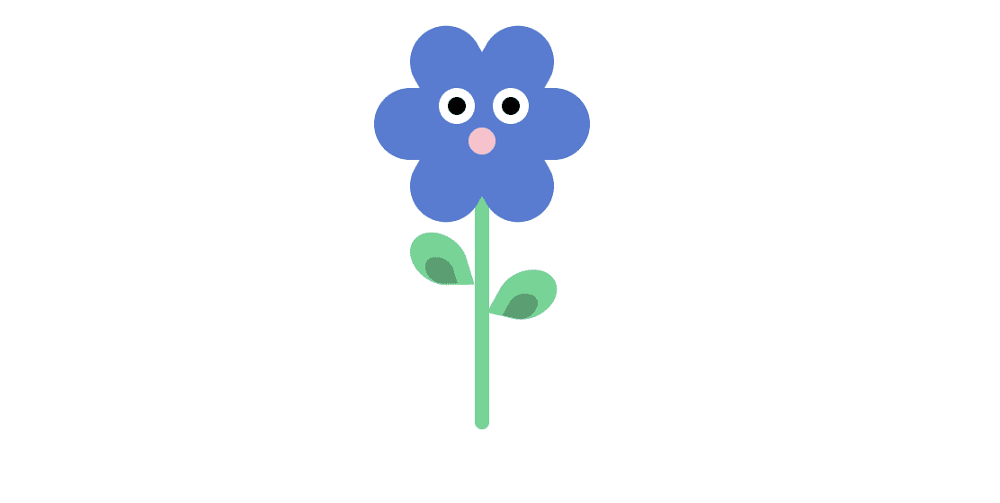
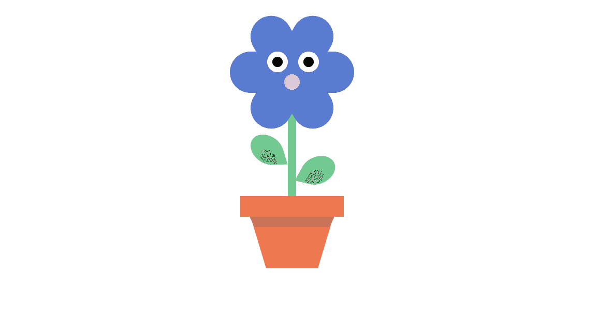

# 使用 CSS 边框-半径制作形状

> 原文：<https://blog.logrocket.com/using-css-border-radius-make-shapes/>

作为 web 开发人员，我们花了大量时间处理 CSS 和样式。

无论是一个简单的网站还是一个复杂的应用程序，我们都需要很好地掌握 CSS，才能让它真正出类拔萃。

它并不总是像乍看起来那么简单，有些任务相当复杂。

然而，如果你有正确的技巧，你可以相对容易地想出解决这些问题的方法。

练习是获得这些技能的最好方法，这也是我们今天要做的。

我们将构建一朵花，它可能是你的网站的一个很好的装饰，我们也将允许你学习更多关于定位元素、CSS 变量、动画以及将它们紧密结合在一起的知识。

点击这里查看 [CodePen](https://codepen.io/maximakymenko/pen/povexGY) 。



### 创建一个花结构

对于本教程，我们只需要两个文件:`index.html`保存我们的花结构，和`style.css`相应地样式化它。

让我们开始创建一个花的结构。

它会有一个有眼睛和鼻子的头(我们的花会有点不寻常)，一个茎，两片从两边长出来的叶子，和一个罐子。

我们来补充一下:

```
<div class="flower">

  <div class="flower__head">
    <div class="flower__eye left">
      <span></span>
    </div>
    <div class="flower__nose"></div>
    <div class="flower__eye right">
      <span></span>
    </div>
  </div>

  <div class="flower__leaf"></div>
  <div class="flower__leaf--shadow">
  </div>
  <div class="flower__leaf oposite"></div>
  <div class="flower__leaf--shadow oposite"></div>

  <div class="flower__stem"></div>

  <div class="flower__pot">
    <div class="flower__pot--shadow"></div>
    <div class="flower__pot--bottom"></div>
  </div>
</div>
```

如您所见，该结构非常简单易懂，因为我们为元素指定了描述性的类名。之后，设计它们就变得非常容易了。

这就是我们的结构，让我们继续最精彩的部分:用我们这里的一束 div 做一朵花。

### 给花造型

我们将有 6 种主要的颜色用在我们的花上。最佳实践是为它们分别创建变量。这将使我们能够轻松地使用它们。

为此，我们将使用 [CSS 变量](https://www.w3schools.com/css/css3_variables.asp)。我们将在文档的[根目录下声明它们，因此将它们放在 CSS 文件的顶部。](https://developer.mozilla.org/en-US/docs/Web/CSS/:root)

我们也将根据我们的花的相应部分来命名它们:

```
:root {
  --main-flower: #517bd6;
  --nose: #ffc0cb;
  --stem: #51d691;
  --pot: #FF7043;
  --pot-shadow: #d66f51;
}
```

当然，你可以随意定制颜色。

现在，让我们从花本身开始。它将有`position: relative`，所以稍后我们可以相对于它定位我们的元素。

你很快就会看到了。

```
.flower {
  position: relative;
}
```

下一步是创建一个花头。

首先，我们将创建它的主要部分，然后，使用[伪元素](https://css-tricks.com/almanac/selectors/a/after-and-before/)，我们将重复相同的样式，并通过旋转它们来改变伪元素的位置:

```
.flower__head {
  width: 120px;
  height: 40px;
  border-radius: 20px;
  background: var(--main-flower);
  margin-top: 50px;
}

.flower__head::after, .flower__head::before {
  content: '';
  position: absolute;
  background: var(--main-flower);
  border-radius: 20px;
  width: 120px;
  height: 40px;
  transform: rotate(60deg);
}

.flower__head::before {
  transform: rotate(-60deg);
}
```


看看我们在这里是如何使用变量的——一个完美的用例。我们不需要每次都写一种颜色，如果你决定在将来改变它，你只需要在适当的地方做。

### 创造眼睛

如您所见，逻辑非常简单。我们只是从上到下一个接一个地创建元素，定位它们，然后我们就可以开始了。

添加以下代码来创建眼睛:

```
.flower__eye {
  position: absolute;
  width: 20px;
  height: 20px;
  z-index: 1;
  background: #fff;
  border-radius: 50%;
}
.flower__eye.left {
  left: 30%;
}
.flower__eye.right {
  left: 55%;
}
.flower__eye span {
  position: absolute;
  width: 10px;
  height: 10px;
  margin-left: 5px;
  margin-top: 5px;
  background: black;
  border-radius: 50%;
}
```


看看这个小可爱！

这里没什么复杂的。我们设置宽度、高度和 z-index，这样我们的眼睛就在上面。我们也圆角，并添加一个白色背景。然后，我们对每只眼睛进行定位，对眼球进行类似的操作。很好很容易。

鼻子也是一样。造型看起来与我们的眼睛非常相似:

```
.flower__nose {
  position: absolute;
  left: 50%;
  transform: translateX(-50%);
  top: 80%;
  width: 15px;
  height: 15px;
  z-index: 1;
  background: var(--nose);
  border-radius: 50%;
}
```

这里有一个很酷的编码技巧，告诉你如何将元素放置在绝对位置的中心:

```
left: 50%;
transform: translateX(-50%);
```

它会将元素向左移动 50%。但是，它不会考虑元素本身的宽度。要将它向后移动宽度，我们将使用`transform(translateX(-50%))`。

那会起作用的。你也可以对`top`属性做同样的事情:只要记住将`translate`属性改为`translateY`。


### 叶子和茎

茎的样式如下所示:

```
.flower__stem {
  position: absolute;
  height: 150px;
  width: 8px;
  background: var(--stem);
  border-radius: 4px;
  left: 50%;
  transform: translateX(-50%);
  z-index: -1;
}
```

我们还做了使茎居中的把戏。这里，我们将 z-index 设置为-1，因为我们希望花头覆盖茎的顶部。

现在，让我们来看看树叶。

首先，我们需要创建我们的叶子的形状。要做到这一点，我们需要进行一些转变。我们将把它们用于树叶本身和它们的阴影，所以我把它们移到了变量中:

```
--transform-leaves-left: rotate(-283deg) skewX(-12deg)  skewY(-4deg);
--transform-leaves-right: rotate(-163deg) skewX(-12deg) skewY(-4deg);
```

这里有一篇关于[所有变换属性](https://css-tricks.com/almanac/properties/t/transform/)的好文章。这里根本没有魔法。

然而，有一件有趣的事情需要注意:转换函数是按照从左到右的顺序相乘的，这意味着复合转换是按照从右到左的顺序有效应用的。

下一步是给树叶和它们的阴影添加样式:

```
.flower__leaf {
  width: 30px;
  height: 30px;
  background: var(--stem);
  position: absolute;
  top: 130px;
  left: 21px;
  border-radius: 50px;
  border-top-right-radius: 0;
  transform: var(--transform-leaves-left);
}
.flower__leaf--shadow {
  position: absolute;
  background: rgba(0, 0, 0, 0.25);
  height: 15px;
  width: 15px;
  top: 144px;
  left: 29px;
  border-radius: 50px;
  border-top-right-radius: 0;
  transform: var(--transform-leaves-left);
}
.flower__leaf--shadow.oposite {
  top: 164px;
  left: 75px;
  transform: var(--transform-leaves-right);
}
.flower__leaf.oposite {
  top: 150px;
  left: 70px;
  transform: var(--transform-leaves-right);
}
```

这里唯一不同寻常的是我们设置了`border-top-right-radius`。

为了重新创建一朵花的形状，我们将使用这个属性来设置右上角的半径，就像它的名字所说的那样。您可以分别设置每个角的半径。



### 把花种在花盆里

到目前为止还不错，但是花应该被存放在某个地方，所以让我们为它建一个花盆。

花盆由三层组成:顶层、阴影层和底层。让我们为它们分别编写代码:

```
.flower__pot {
  width: 100px;
  height: 20px;
  background-color: var(--pot);
  position: absolute;
  top: 190px;
  left: 50%;
  transform: translateX(-50%);
}
```

接下来，我们将在它下面添加阴影层:

```
.flower__pot--shadow {
      width: 72px;
      position: absolute;
      border-left: 5px solid transparent;
      border-right: 5px solid transparent;
      border-top: 10px solid var(--pot-shadow);
      top: 20px;
      left: 50%;
      transform: translateX(-50%);
    }
```

我们的阴影层设置在花盆内，所以我们设置它的相对位置。这就是为什么`top: 20px`
对我们很管用。

此外，为了使锅的形状，我们可以使用设置左右边界为透明的技巧，这样我们就可以有一些切角。

最后要补充的是锅底部分:

```
.flower__pot--bottom {
  width: 50px;
  height: 0px;
  position: absolute;
  border-left: 15px solid transparent;
  border-right: 15px solid transparent;
  border-top: 50px solid var(--pot);
  top: 20px;
  z-index: -1;
  left: 50%;
  transform: translateX(-50%);
}
```

这个应该非常简单，因为它使用了我们以前用过的所有技巧。让我们看看我们有什么:



我们开始吧:我们的盆栽滑稽花准备好了。

### 奖励:眨眼睛

让我们让我们的花看起来更有生气。为此，我们将使它闪烁。

让我们添加[关键帧](https://css-tricks.com/snippets/css/keyframe-animation-syntax/)并设置动画，我称之为`blink`:

```
@keyframes blink {
  0%, 100% {
    transform: scale(1, 0.05);
  }
  5%, 95% {
    transform: scale(1, 1);
  }
}
```

如您所见，我们只更改了 scale 属性，仅此而已。

现在你只需要把它添加到我们的眼睛 div，然后享受结果:

```
.flower__eye {
  position: absolute;
  width: 20px;
  height: 20px;
  z-index: 1;
  background: #fff;
  border-radius: 50%;
  animation: blink 3s infinite; // animation added
}
```


如果你一次看所有的代码，它可能看起来相当复杂。然而，当你把它分解成更小的部分时，你会发现它非常简单。

试着自己再造一个，看看自己是如何通过做简单的事情在基本面上变得更好的。

玩玩它，改变颜色，改变形状，然后把你的花贴在评论里。

## 你的前端是否占用了用户的 CPU？

随着 web 前端变得越来越复杂，资源贪婪的特性对浏览器的要求越来越高。如果您对监控和跟踪生产环境中所有用户的客户端 CPU 使用、内存使用等感兴趣，

[try LogRocket](https://lp.logrocket.com/blg/css-signup)

.

[](https://lp.logrocket.com/blg/css-signup)[https://logrocket.com/signup/](https://lp.logrocket.com/blg/css-signup)

LogRocket 就像是网络和移动应用的 DVR，记录你的网络应用或网站上发生的一切。您可以汇总和报告关键的前端性能指标，重放用户会话和应用程序状态，记录网络请求，并自动显示所有错误，而不是猜测问题发生的原因。

现代化您调试 web 和移动应用的方式— [开始免费监控](https://lp.logrocket.com/blg/css-signup)。