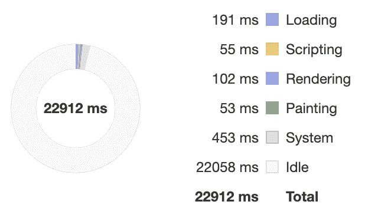
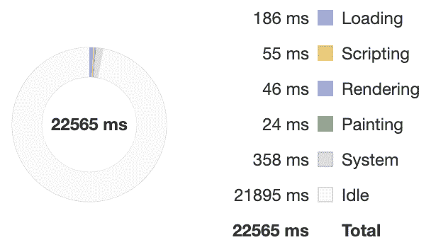
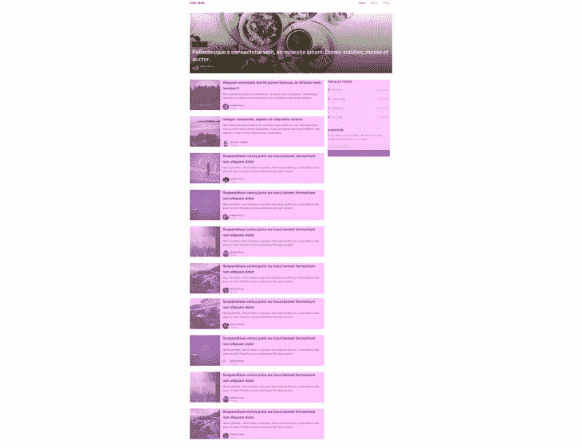

# 使用 CSS 内容可见性提高渲染性能

> 原文：<https://blog.logrocket.com/using-css-content-visibility-to-boost-your-rendering-performance/>

开发人员在致力于改进和优化他们的网站时，通常不会优先考虑渲染性能。

毕竟，还有其他优化，如改善服务器响应时间、减小文件大小和区分文件加载优先级，这些都可以带来立竿见影的改善。此外，渲染是浏览器的内部过程，web 开发人员无法直接访问。

但是，开发人员应该关注渲染，主要有三个原因:

1.  渲染是现代网站工作方式不可或缺的一部分。这是一个阻塞操作，因此它阻塞了所有用户交互
2.  渲染性能的结果在移动设备上非常明显，尤其是低端设备
3.  有直接和间接的方法来帮助浏览器更有效地呈现我们的内容

由于新的 CSS `[content-visibility](https://developer.mozilla.org/en-US/docs/Web/CSS/content-visibility)`属性，影响浏览器呈现过程现在变得更加容易。本质上，此属性更改元素的可见性并管理其呈现状态。

有点类似于已经存在的[`display`](https://developer.mozilla.org/en-US/docs/Web/CSS/display)[`visibility`](https://developer.mozilla.org/en-US/docs/Web/CSS/visibility)属性。然而，`content-visibility`的运作方式与那些不同。

在这篇博文中，我们将了解`content-visibility`，它如何帮助渲染性能，以及它与`display`和`visibility`属性的比较。

## `content-visibility`如何提高渲染性能

`content-visibility`的关键能力是它允许我们推迟呈现我们选择的 HTML 元素。默认情况下，浏览器呈现用户可以查看的 DOM 树中的所有元素。

用户可以看到适合其视窗的元素，并通过滚动查看页面中的其他元素。一次呈现所有元素允许浏览器正确计算页面的尺寸，同时保持页面布局和滚动条在整个页面上的一致性。

如果浏览器不呈现页面中的某些元素，滚动将是一场噩梦，因为不可能正确计算页面高度。或者会吗？

不要害怕。`content-visibility`有一个`auto`选项，可以检测一个元素是否在用户的视口内，并跳过尚未进入视口的元素的渲染。

这是有意义的，因为用户最初不会看到位于屏幕之外的元素，这意味着这些元素在初始页面加载期间是不必要的。因此，推迟呈现这些元素可以减少初始呈现时间，这样用户就可以更快地看到内容。

## 测量`content-visibility`的功率

当然，理论上这听起来不错，但是让我们更深入地研究一下。所以，为了利用`content-visibility`的力量，尽可能准确地衡量收益，我已经把[整合成了一个演示博客](https://codesandbox.io/s/with-content-visibility-9yf70)。

博客是一个很好的测试案例，因为它包含文本、图像和各种其他 HTML 元素。博客页面往往很长，因此文件夹下的一些内容可能会受益于延迟呈现。内容通常是静态的，所以我们不需要考虑任何会影响我们指标的动态内容。我们可以简单地关注初始页面加载。

带着这些想法，我修改了博客，创建了两个内容相同的不同版本，除了一个重要的区别:其中一个打开了`content-visibility: auto`。

我还决定在 Chrome 的低端手机仿真上运行基准测试。现代高端笔记本电脑的处理能力太强了，很难看清这两个版本之间的区别。我运行了多个基准测试，结果相似。下面，您可以看到每个博客版本的基准测试示例。



Rendering without content-visibility takes 102MS.



Content-visibility rendering takes 46MS.

基准测试显示，当使用`content-visibility`时，渲染时间缩短了大约 50 毫秒。这是一个相当大的改进，移动用户会喜欢的。

博客的两个版本都可以在线获得，因此您也可以自己运行基准测试:

## 如何实现`content-visibility`

获得`content-visibility`的好处并不难。我们首先从识别页面中我们想要使用`content-visibility`的部分开始。在下面的截图中，你会看到我已经确定了用户可以立即看到的内容(即，文件夹上方的内容)和可以通过滚动访问的内容。推迟下层内容的渲染会减少我们最初的渲染时间。


为文件夹下的内容设置`content-visibility: auto`将触发呈现优化功能，其中浏览器推迟该内容的呈现，直到它可见。下面是这样做的代码:

```
.below-the-fold {
  content-visibility: auto;
}

```

这实现了我们想要的渲染行为，但是有一个小问题。还记得我提到过在开始时渲染所有内容是为了确保页面高度计算正确并保持滚动一致吗？现在我们有了这个问题。

默认情况下，`content-visibility`会将它所分配到的元素的`height`视为 0。浏览器将通过使其`height`为 0 来使这个元素不可见，直到它被渲染，这扰乱了我们的页面高度和滚动。

但是如果已经有一个`height`被分配给元素或者它的子元素，这个行为就会被覆盖，所以如果你的下级元素已经设置了`height`属性，这就不是问题了。

如果您的元素中没有`height`属性，并且由于可能的副作用而不想添加它们，您可以使用`contain-intrinsic-size`属性来确保元素被正确呈现，同时还保留了延迟呈现的好处。这样，我们最终得到如下代码:

```
.below-the-fold {
  content-visibility: auto;
  contain-intrinsic-size: 240px;
}

```

你看到的值`240px`只是一个例子。这应该替换为我们将要使用的元素的实际高度。

不幸的是，计算整个折叠以下内容的单个值是困难的。根据页面上显示的项目，页面可长可短。因此，我们将这个属性添加到具有可预测的`height`的元素中。例如，我们示例博客上的文章有一个非常标准的外观。



Notice that the article cards all have the same height.

博客中的每篇文章都有`468px`高度。现在，我们可以通过将`contain-intrinsic-size`设置为`468px`来完成我们的示例案例。

```
.below-the-fold {
  content-visibility: auto;
  contain-intrinsic-size: 468px;
}

```

## `content-visibility`的高级用法

选项当然会创造奇迹，但也有可能更进一步。`content-visibility`为我们提供了另外两个潜在的值，叫做`hidden`和`visible`。这些值做你期望它们做的事情，隐藏或显示`content-visibility`被赋予的元素。这些值对于高级用例非常有用。

一种这样的情况是以编程方式显示/隐藏元素，类似于如何使用`display`属性。在这种情况下，`content-visibility`可以提高频繁显示或隐藏的项目的渲染性能，比如模态或弹出窗口。`content-visibility`可以提供这种性能提升，这要感谢它的`hidden`值与其他值的不同之处。

## 与其他选择相比,`content-visibility: hidden`如何

`display: none`:这完全隐藏了元素并破坏了它的渲染状态。当我们想要再次显示该元素时，浏览器必须重新呈现它，这是很昂贵的。

这只是让元素不可见。浏览器可以在认为必要的时候重新渲染，即使元素是`hidden`。元素及其子元素也在页面中保留了一个明显的空白空间。

`content-visibility: hidden`:隐藏元素，但保持其渲染状态。这意味着元素的行为与它在`display: none`上的行为一样，但是再次显示它的成本要低得多。

当然，这并不意味着我们不再需要`display`或`visibility`。他们仍然有自己的使用案例，但是现在，我们有了一个额外的工具可以利用。

## 对`content-visibility`的浏览器支持

因为`content-visibility`还在[工作草案阶段](https://www.w3.org/TR/css-contain-2/#content-visibility)，所以它的支持会比别人来得慢一点。目前只有 Chrome 和 Edge 版支持。这意味着我们将需要更长的时间来获得实施这一优化的全部好处。

另一方面，这个 CSS 属性的`auto`功能纯粹是为了性能优化。不会引起任何视觉上的变化。当它不被浏览器支持时，它将被简单地忽略而不会造成任何负面影响，因此为所有浏览器实现它并观察它被更多浏览器支持时的行为是安全的。

你可以在这里查看[当前浏览器支持。](https://caniuse.com/?search=content-visibility)

## 结论

承诺做很少的工作就能获得实实在在的收益。`auto`功能是我们今天就可以实现并开始从中获益的东西。然而，它作为`display`或`visibility`的替代物的更高级的用途，必须等到`content-visibility`被大多数现代浏览器所支持。

试试看，让我们知道它对你的表现如何！

## 你的前端是否占用了用户的 CPU？

随着 web 前端变得越来越复杂，资源贪婪的特性对浏览器的要求越来越高。如果您对监控和跟踪生产环境中所有用户的客户端 CPU 使用、内存使用等感兴趣，

[try LogRocket](https://lp.logrocket.com/blg/css-signup)

.

[](https://lp.logrocket.com/blg/css-signup)[https://logrocket.com/signup/](https://lp.logrocket.com/blg/css-signup)

LogRocket 就像是网络和移动应用的 DVR，记录你的网络应用或网站上发生的一切。您可以汇总和报告关键的前端性能指标，重放用户会话和应用程序状态，记录网络请求，并自动显示所有错误，而不是猜测问题发生的原因。

现代化您调试 web 和移动应用的方式— [开始免费监控](https://lp.logrocket.com/blg/css-signup)。