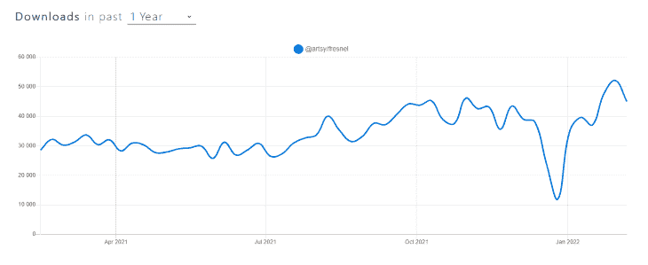
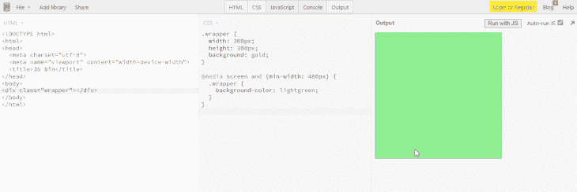
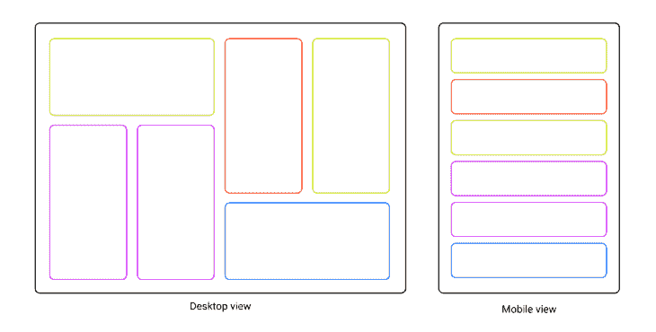
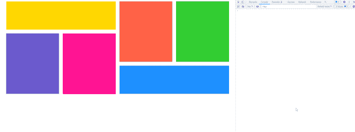

# 在 React with Fresnel - LogRocket 博客中使用 CSS 媒体查询

> 原文：<https://blog.logrocket.com/using-css-media-queries-react-fresnel/>

据 StatCounter [数据](https://gs.statcounter.com/platform-market-share/desktop-mobile-tablet)显示，如今的设备市场由移动、桌面和平板电脑主导。为了给用户提供最好的 UX，响应式设计是现代 web 开发中的必备工具。

在本文中，我们将检查一下 [Fresnel](https://www.npmjs.com/package/@artsy/fresnel) 包，它是实现服务器端渲染(SSR)的响应式设计的最有效方法之一。这是一个由 [Artsy](https://artsy.github.io/) 创建的开源 npm 项目，易于使用，受到开发者的信任。



我们将探索它与传统方法的不同之处，以及为什么您应该使用它。我们还将在 React 中创建一个响应式色卡应用程序，以在实践中展示其功能。

## 什么是 CSS 媒体查询？

媒体查询允许开发人员为不同的视口大小定义不同的样式规则。

通常，我们会使用传统的方法，首先创建 HTML 元素，然后使用 CSS 通过媒体查询来描述它在不同屏幕宽度上的行为。

一个简单的例子是:

```
<div class="wrapper"></div>
```

然后通过 CSS:

```
.wrapper {
  width: 300px;
  height: 300px;
  background: gold;
}

@media screen and (min-width: 480px) {
  .wrapper {
    background-color: light green;
  }
}
```

如果我们在 [JSBin](https://jsbin.com) 上运行一个例子，我们会看到当满足视窗的`480px`宽度时，正方形元素改变了它的背景颜色:



## 什么是菲涅尔？

Fresnel 将传统的媒体查询方法转移到 React 生态系统。

当一个应用程序需要扩展并且组件的复杂性增加时，它的断点逻辑是有益的。

基本实现如下所示:

```
import React from "react"
import ReactDOM from "react-dom"
import { createMedia } from "@artsy/fresnel"

const { MediaContextProvider, Media } = createMedia({
  breakpoints: {
    sm: 0,
    md: 768,
    lg: 1024,
    xl: 1192,
  },
})

const App = () => (
  <MediaContextProvider>
    <Media at="sm">
      <MobileComponent />
    </Media>
    <Media at="md">
      <TabletComponent />
    </Media>
    <Media greaterThanOrEqual="lg">
      <DesktopComponent />
    </Media>
  </MediaContextProvider>
)

ReactDOM.render(<App />, document.getElementById("react"));
```

多亏了它的 [API](https://github.com/artsy/fresnel#api) ，我们可以使用`MediaContextProvider`和`Media`组件为一个响应式 web 应用程序构建一个坚实的基础。

某些屏幕宽度上的行为是通过提供定义的断点作为道具来控制的。这些包括`at`、`lessThan`、`greaterThan`、`greaterThanOrEqual`和`between`，它们的名字不言自明。

## 菲涅尔和条件渲染有什么不同？

如果您以前在 React 中实现过响应式布局，上面示例的代码结构可能看起来很熟悉。您可能使用过条件渲染，如下所示:

```
const App = () => {
  const { width } = useViewport();
  const breakpoint = 768;

  return width < breakpoint ? <MobileComponent /> : <DesktopComponent />;
}
```

除非您需要实现服务器端呈现解决方案，否则上面的例子就可以了。这就是 Fresnel 的用武之地，它将自己与其他解决方案区分开来。

为了解释这个概念，[服务器端呈现](https://blog.logrocket.com/why-you-should-render-react-on-the-server-side-a50507163b79/) (SSR)是一种在服务器上呈现客户端单页应用程序(SPA)的技术。这样，客户端接收到一个呈现的 HTML 文件。

使用 Fresnel，我们可以在服务器上渲染所有断点，以便在 React 启动之前正确渲染 HTML/CSS。这提高了用户的 UX。

## 使用 React 和 Fresnel 构建应用程序

我们将创建一个色卡应用程序，为移动和桌面视图切换其布局。

移动视图上的卡片将被放置在单列布局中，而桌面视图将使用更复杂的网格样式布局，在水平和垂直卡片之间交替。

以下是显示卡片序列的项目线框:



## 初始化 React 应用程序

我们将开始为我们的项目创建一个单独的文件夹，并将工作方向更改为它。为此，在终端中运行以下命令:`mkdir fresnel-demo && cd fresnel-demo`。

要初始化一个新项目，运行`npm init -y`。

请注意，`-y`标记将批准包配置的所有默认值，因此您不必在终端中经历多步向导。

接下来，我们将安装前端的基本先决条件。运行`npm i react react-dom`。

对于后端，我们将使用 Express。要安装它，运行`npm i express`。

当我们在根目录下时，让我们通过运行`npm i @artsy/fresnel`来安装 Fresnel 库。

## React 中的建模数据

因为我们正在构建颜色应用程序，所以我们需要的主要数据是颜色名称。

将数据从应用程序逻辑中分离出来是一个很好的实践。出于这个原因，我们将从创建`src`文件夹开始，其中包含一个名为`data`的文件夹。

* * *

### 更多来自 LogRocket 的精彩文章:

* * *

在`data`文件夹中，创建一个名为`colors.jsx`的新文件，并包含以下代码:

```
export const colors = [
  "gold",
  "tomato",
  "limegreen",
  "slateblue",
  "deeppink",
  "dodgerblue",
];
```

我们创建了`colors`变量，将所有颜色名称存储为一个字符串数组。

## 创建断点

现在我们必须定义我们的应用程序将使用的断点。

在`src`文件夹中，创建另一个名为`media`的文件夹。在其中，创建一个名为`breakpoints.jsx`的文件，并包含以下代码:

```
import { createMedia } from "@artsy/fresnel";

const ExampleAppMedia = createMedia({
  breakpoints: {
    sm: 0,
    md: 768,
    lg: 1024,
    xl: 1192,
  },
});

export const mediaStyle = ExampleAppMedia.createMediaStyle();
export const { Media, MediaContextProvider } = ExampleAppMedia;
```

我们使用`createMedia`来定义特定的断点并导出`mediaStyle`，稍后我们将把它注入到服务器端。我们还将`Media`和`MediaContexProvider`包裹在需要响应的组件周围。

## 创建组件

在同一个`src`文件夹中，创建另一个名为`components`的文件夹。

在里面，创建四个单独的文件:`DesktopComponent.jsx`、`DesktopComponent.css`、`MobileComponent.jsx,`和`MobileComponent.css`。

打开`DesktopComponent.jsx`文件并包含以下代码:

```
import React from "react";
import "./DesktopComponent.css";
import { colors } from "../data/colors";

export const DesktopComponent = () => {
  return (
    <div className="dWrapper">
      {colors.map((el, i) => (
        <div
          style={{ backgroundColor: el, gridArea: `c${i + 1}` }}
          key={i}
        ></div>
      ))}
    </div>
  );
};
```

我们导入了外部样式表和颜色名称。在组件中，我们遍历了所有的颜色，并指定了背景色以及在网格中的位置。

现在，打开`DesktopComponent.css`并添加以下样式规则:

```
.dWrapper {
  max-width: 1200px;
  height: 500px;
  margin: 0 auto;
  display: grid;
  grid-template-columns: repeat(4, 1fr);
  grid-template-rows: repeat(3, 1fr);
  gap: 20px;
  grid-template-areas:
    "c1 c1 c2 c3"
    "c4 c5 c2 c3"
    "c4 c5 c6 c6";
}
```

我们设置包装器的最大宽度和高度，并使其在视口中居中。然后，我们使用网格模板来定义列和行，并创建布局模式。

接下来，打开`MobileComponent.jsx`文件并包含以下代码:

```
import React from "react";
import "./MobileComponent.css";
import { colors } from "../data/colors";

export const MobileComponent = () => {
  return (
    <div className="mWrapper">
      {colors.map((el, i) => (
        <div style={{ backgroundColor: el }} key={i}></div>
      ))}
    </div>
  );
};
```

这里，我们导入了外部样式和颜色名称。然后我们遍历颜色，并为每个元素分配背景色。

最后，打开`MobileComponent.css`并添加以下样式规则:

```
.mWrapper {
  width: 100%;
  display: grid;
  grid-template-rows: repeat(6, 100px);
  gap: 20px;
}
```

我们设置宽度以填充整个视口，对行使用网格系统，并在它们之间添加间隙。

## 用 Fresnel 实现 React 前端

让我们创建一个实际的`App`组件，它将呈现我们之前创建的组件。在`src`文件夹中，创建`App.jsx`并包含以下代码:

```
import React from "react";
import { Media, MediaContextProvider } from "./media/breakpoints";
import { MobileComponent } from "./components/MobileComponent";
import { DesktopComponent } from "./components/DesktopComponent";

export const App = () => {
  return (
    <MediaContextProvider>
      <Media at="sm">
        <MobileComponent />
      </Media>
      <Media greaterThan="sm">
        <DesktopComponent />
      </Media>
    </MediaContextProvider>
  );
};
```

注意，我们从`breakpoints.jsx`文件中导入了`Media`和`MediaContextProvider`，并用它们来控制哪些组件应该显示在哪些视口中。

为了将`App`呈现到屏幕上，我们需要一个基本文件来访问 DOM 树的`root`元素并呈现它。在`src`文件夹中创建一个名为`index.jsx`的新文件，并包含以下代码:

```
import React from "react";
import ReactDOM from "react-dom";
import { App } from "./App";

ReactDOM.hydrate(<App />, document.getElementById("root"));
```

注意，我们使用了`hydrate`而不是`render`。这是服务器端呈现的推荐方式，因为它通过附加事件处理程序将服务器呈现的 HTML 转换为动态网页。

## 设置后端

现在让我们把焦点从前端转移到后端。导航回项目的根目录，创建一个名为`server`的新文件夹。

在`server`中，创建一个文件`index.jsx`。单个文件就足以提供服务器端呈现的功能。

包括以下代码:

```
import React from "react";
import ReactDOMServer from "react-dom/server";
import { App } from "../src/App";
import { mediaStyle } from "../src/media/breakpoints";

import express from "express";
const app = express();
const PORT = 3000;

app.get("/", (req, res) => {
  const app = ReactDOMServer.renderToString(<App />);

  const html = `
        <html lang="en">
        <head>
        <title>Fresnel SSR example</title>
        <style type="text/css">${mediaStyle}</style>
        <link rel="stylesheet" href="app.css">
        <script src="app.js" async defer></script>
        </head>
        <body>
            <div id="root">${app}</div>
        </body>
        </html>
    `;
  res.send(html);
});

app.use(express.static("./built"));

app.listen(PORT, () => {
  console.log(`App started on port ${PORT}`);
});
```

首先，我们创建了一个 Express 实例，并将其分配给端口`3000`。对于在`"/"`路由上的所有传入 GET 请求，我们使用`renderToString()`在服务器上生成 HTML 并发送标记作为响应。

注意，我们还在 HTML 的 head 部分注入了`mediaStyle`。这就是 Fresnel 能够在服务器上呈现断点的方式。

## 配置版本

在运行我们的应用程序之前，我们需要捆绑我们的文件，以便我们可以在 SSR 期间访问它们。我们将使用 [esbuild](https://esbuild.github.io/) ，它是一个快速捆绑器。

首先，通过运行`npm i --dev esbuild.`安装它

在项目根目录中，打开文件`package.json`并将`scripts`设置为如下:

```
"scripts": {
    "client:build": "esbuild src/index.jsx --bundle --outfile=built/app.js",
    "server:build": "esbuild server/index.jsx --bundle --outfile=built/server.js --platform=node",
    "start": "node built/server.js"
  }
```

我们将首先运行前端的构建脚本。使用命令`npm run client:build`。这将生成一个新文件夹`built`，其中包含`app.js`和`app.css`文件。

接下来，我们将不得不对服务器文件做同样的事情。运行`npm run server:build`。

## 测试 React 应用程序

现在，我们要做的就是运行命令`npm start`来启动应用程序。您将在终端中收到来自`server.jsx`文件的消息，通知您开发者服务器已经在端口`3000`上准备好了。

打开浏览器并导航至 [http://localhost:3000](http://localhost:3000) 。您应该会看到一个响应式应用程序。通过按键盘上的 **F12** 打开开发工具，并尝试调整浏览器视图的大小:



请注意，如果您想要在前端或服务器上进行任何更改，您必须重新构建应用程序并重启服务器。或者，您可以在构建命令的末尾使用`--watch`标志。这里有更多关于那个[的说明](https://esbuild.github.io/api/#watch)。

## 结论

在本文中，我们研究了 Fresnel 包并构建了一个完全响应的 web 应用程序。

我们还学习了如何在不使用 CRA 等外部工具的情况下从头开始设置 React 项目，如何在 React 中设置 SSR 渲染，以及如何使用 esbuild 等构建器。

下次你需要在 React 应用上提供最佳渲染体验时，你的工具箱里会有一个秘密方法。通过 Fresnel 包在服务器上渲染媒体断点，你就会知道这是可能的。

## 使用 LogRocket 消除传统反应错误报告的噪音

[LogRocket](https://lp.logrocket.com/blg/react-signup-issue-free)

是一款 React analytics 解决方案，可保护您免受数百个误报错误警报的影响，只针对少数真正重要的项目。LogRocket 告诉您 React 应用程序中实际影响用户的最具影响力的 bug 和 UX 问题。

[ ](https://lp.logrocket.com/blg/react-signup-general) [  ](https://lp.logrocket.com/blg/react-signup-general) [LogRocket](https://lp.logrocket.com/blg/react-signup-issue-free)

自动聚合客户端错误、反应错误边界、还原状态、缓慢的组件加载时间、JS 异常、前端性能指标和用户交互。然后，LogRocket 使用机器学习来通知您影响大多数用户的最具影响力的问题，并提供您修复它所需的上下文。

关注重要的 React bug—[今天就试试 LogRocket】。](https://lp.logrocket.com/blg/react-signup-issue-free)