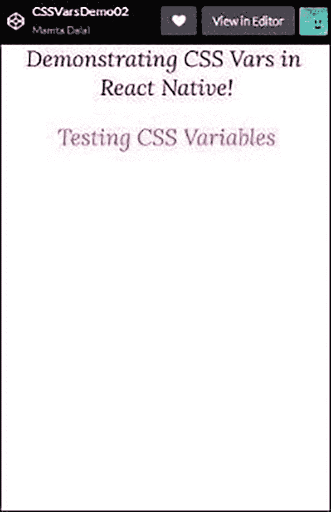
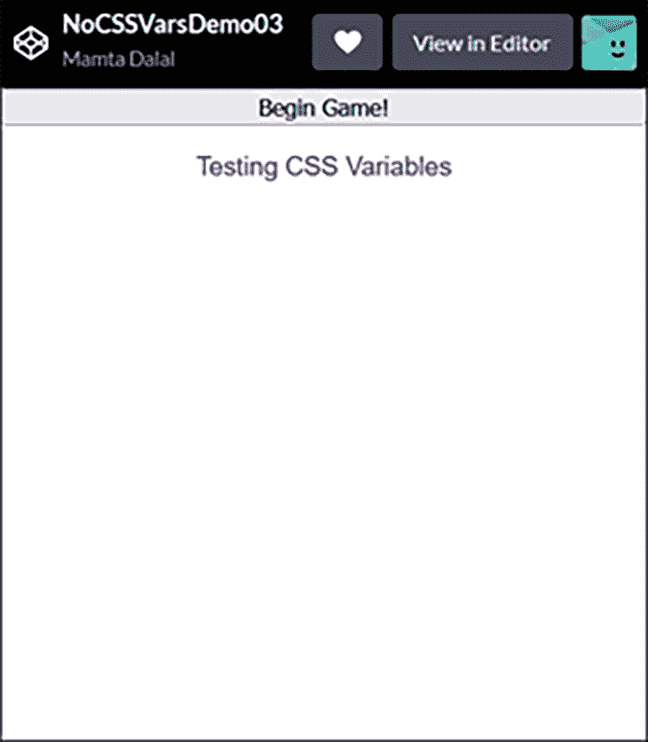
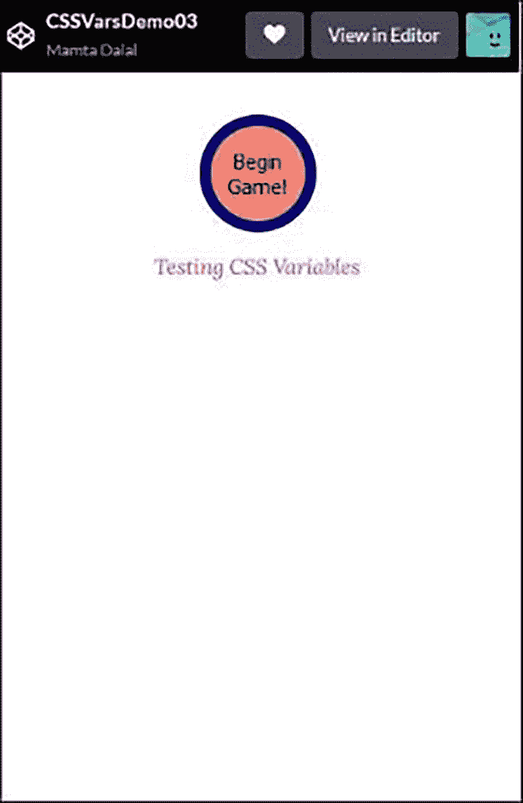
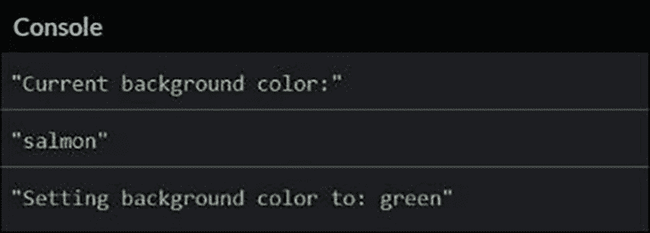
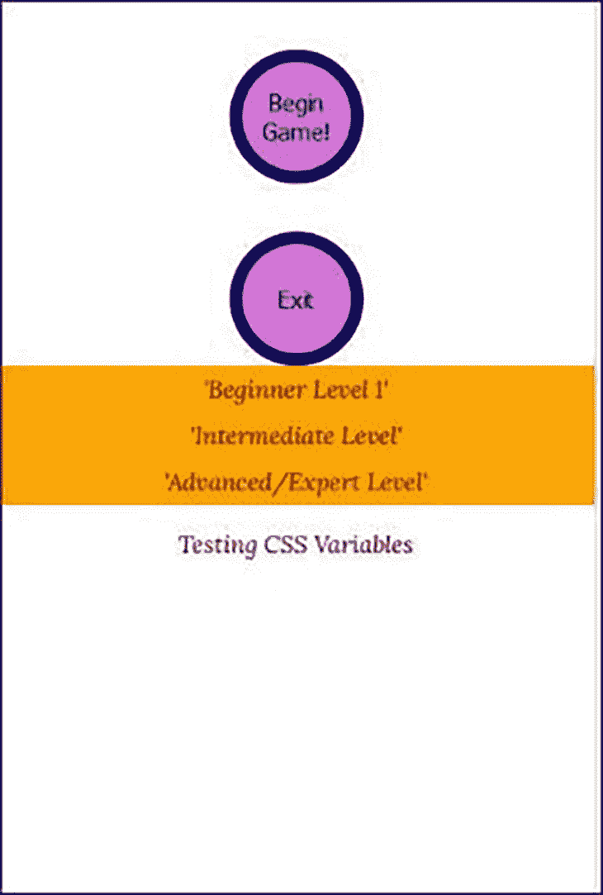

# 在 React Native 中使用 CSS 变量

> 原文：<https://blog.logrocket.com/using-css-variables-react-native/>

设计和样式在移动应用程序中与在 web 开发中同样重要。谁不喜欢具有吸引力和视觉感染力的 UI 呢？

React 本机应用程序中的样式决定了 React 组件或元素在移动屏幕或浏览器上的显示方式。开发人员有几个选项可供选择，以设计他们的 React 本机组件:

styled-components 是 React 和 React Native 的一个流行库，它使开发人员能够通过编写 JavaScript 和 CSS 的混合物(称为 [CSS-in-JS](https://blog.logrocket.com/tag/css-in-js) )在他们的应用程序中使用组件级样式。因此，styled-components 是 React 和 React 本机应用程序中组件和样式之间的桥梁。我们将在本文的后面部分使用这个库。

开发人员可以使用普通 JavaScript 对象创建样式，例如:

```
const styles = {
textformat: {
    fontFamily: 'Lora',
    fontSize: 25,
    color: 'maroon',
    textAlign:'center',
    marginTop: 40,
   }
};

```

这可以通过`style`属性(prop)应用于 React 本地组件，如下所示:

```
<Text style = {styles.textformat}>Hi there</Text>
```

React 本地团队[引入了样式表 API](https://reactnative.dev/docs/stylesheet) 作为 CSS 样式表的替代方法。到目前为止，他们推荐使用 API 的原因如下:

*   通过将样式定义从`render()`函数中转移出来，使代码更容易理解
*   通过命名样式，您可以为`render()`功能中的低级组件添加含义

因此，React Native 中的样式表 API 提供了一种清晰的方式来抽象各种组件的样式，这反过来又会带来更好看的 UI。React Native 中的样式通过 CSS 自定义属性(也称为 CSS 变量)得到了进一步增强。我们将在本文中探索 CSS 变量，并利用样式表 API。

## React Native 中为什么需要 CSS 变量？

开发人员可以定义 CSS 自定义属性来存储自定义样式设置。作为一名开发人员，您希望寻找使您的应用程序现代化、提高生产率以及尽可能应用可重用性策略的方法。

使用 CSS 自定义属性或 CSS 变量来实现样式是实现这一点的一种方式。使用 CSS 变量，您可以一次对几个组件应用相同的样式。您可以将它们附加到选择器，以便选择器的所有后代都可以继承它们。您甚至可以使用自定义属性集为整个应用程序设计一个主题。

使用 CSS 变量，您可以实现一些普通 JavaScript 无法实现的样式效果。CSS 变量在 React Native 中实现动画时也非常有用。

明智地使用 CSS 变量还可以大大提高 React 本机应用程序的可维护性。因为它们是变量，所以可以适当地、有意义地命名，然后在需要时很容易引用。

假设您今天用 CSS 变量`forecolor`开发了一个应用程序，并将其应用于一堆文本组件和按钮。六个月后，您被要求将前景色改为更暗的颜色。前面已经定义了 CSS 变量，现在跟踪该变量并只将单个值更新为较暗的颜色，传递所有必要组件中所需的更改变得容易多了。

因此，使用 CSS 变量极大地提高了代码的可维护性。

## 如何声明 CSS 变量

您可以按如下方式声明 CSS 变量:

```
--forecolor: magenta;

```

它可以这样使用:

```
color: var(--forecolor);   

```

## 使用 CSS 变量的准则

## 将 CSS 变量付诸实践

让我们假设您有一个 React 本地应用程序，您希望将 CSS 样式应用于`paragraph`元素和`Text`组件。

按如下方式创建您的 HTML 标记:

```
<div id="react-root"></div>
<p> Testing CSS variables</p>

```

然后，使用 CSS 变量创建 CSS/SCSS 代码，如下所示:

```
:root {
  --forecolor: magenta;
  --fontSize: 25px;
  --font-family: 'Lora';
}
p{  
  color: var(--forecolor);   
  font-family: var(--font-family);
   text-align: center;
  font-size: 25px;
  marginTop: 40;
  }

```

这里，首先定义三个 CSS 变量，`forecolor`、`fontSize`和`font-family`。然后使用这些变量为`paragraph`元素设置值。

应用程序的相应 JavaScript 如下所示:

```
const { Text, View, StyleSheet } = ReactNative;  
const App = () => {    
  return (

      Demonstrating CSS Vars in React Native!

  );
};

const styles = StyleSheet.create({
    text: {
      fontFamily: 'Lora',
      fontSize: 25,
      color: 'maroon',
      textAlign:'center',
      marginTop: 40,
   }
});

ReactDOM.render(, document.getElementById("react-root"));

```

请注意，`Text`组件的样式仅使用`StyleSheet.create()`来定义。

整个应用程序的[代码可以在我为本文创建的 CodePen 中找到，](https://codepen.io/mamta_d/pen/MWEXdjv) [CSSVarsDemo01](https://codepen.io/mamta_d/pen/MWEXdjv) 。执行它会产生以下输出:

见 [CodePen](https://codepen.io) 上 Mamta Dalal([@ Mamta _ d](https://codepen.io/mamta_d))
的笔 [CSSVarsDemo01](https://codepen.io/mamta_d/pen/MWEXdjv) 。

如果你仔细看看上面 CSS 部分中的 CSS 变量声明和它们的用法，你可能会想这有什么大不了的。您几乎可以直接为段落元素设置这些样式值，而不是这样做。那么这里最大的优势是什么呢？

这样做的好处是，相同的根样式现在可以应用于任何其他元素，以及 React 本地组件。我们将在下一节探讨这一点。

## 在 React Native 中使用 CSS 变量创建全局样式

我们将创建几个全局样式变量，它们可以在`p`和`Text`中重用。

HTML 标记保持不变，但我们的 CSS 发生了变化:

```
:root {
  --forecolor: magenta;
  --fontSize: 25px;
  --font-family: 'Lora';
}
p{  
  color: var(--forecolor);   
  font-family: var(--font-family);
  text-align: center;
  font-size: 25px;
  marginTop: 40;
  }
.main{
  color: maroon;   
  font-family: var(--font-family);
  text-align: center;
  font-size: 25px;
  }

```

这里，我们在名为`main`的类中定义了一组额外的 CSS 变量。让我们看看如何在 JavaScript 中使用它。

```
const { Text, View, StyleSheet } = ReactNative;
const App = () => {    
  return (
    <div className="main">
    <View>
      <Text>Demonstrating CSS Vars in React Native!</Text>
    </View>
    </div>
  );
};
ReactDOM.render(<App />, document.getElementById("react-root"));

```

观察加粗的线条。它们表明了包含 CSS 变量的`main`类现在是如何在我们的 JavaScript 代码中应用样式到组件的。

由于整个`View`都包含在`<div>`块中，因此在`View`中定义的任何组件都将应用相同的样式。

视口中的结果将类似于前面看到的，只是我们实现它的方式不同。



此示例的代码可从 [CSSVarDemo02](https://codepen.io/mamta_d/pen/LYzroQa) 获得。

## 对样式化组件使用 CSS 变量>

如果我们想使用[样式组件库](https://www.styled-components.com/)来补充或代替原生组件呢？您也可以将 CSS 变量应用于这些。

样式组件库可以通过[CDN 链接](https://cdnjs.com/libraries/styled-components)或者通过`npm install`命令安装。

让我们看看如何做到这一点。我们将使用与前面相同的 HTML 标记，但是我们将修改 CSS。

```
:root {
  --forecolor: indigo;
  --bgcolor: orchid;
  --fontSize: 15px;
  --font-family: 'Lora';
}
p{  
  color: var(--forecolor);   
  font-family: var(--font-family);
  text-align: center;
  font-size: 15px;
  marginTop: 40;
  }

```

JavaScript 代码将使用本地组件(`View`和`Text`)和样式组件库中的一个组件(`Button`)。

```
const {Text, View, StyleSheet} = ReactNative;
const styled = window.styled.default;

const Button = styled.button`
  background: var(--bgcolor);
  font-size: var(--fontSize);
  border: 3px solid purple;
  border-radius: 100%;
  display: inline-flex;
  height: 84px;
  width: 84px;
  align-items:center;
  margin: 30px 0px 0 0px;
  justify-content: center;
  align-self: center`;

const App = () => {    
  return (
    <View>
        <Button>Begin Game!</Button>
    </View>
  );
};

const styles = StyleSheet.create({
container: {
    flex: 1,
    justifyContent: 'center',
    alignItems: 'center',
    backgroundColor: '#fff',
    paddingLeft: 16,
    paddingRight: 16
 },
});
ReactDOM.render(<App />, document.getElementById("react-root"));

```

`Button`组件有一些来自 styled-components 的预定义样式，但是它使用 CSS 变量`bgcolor`和`fontSize`来设置按钮的背景颜色和字体大小。

如果没有定义任何样式集或 CSS 变量，样式化组件`Button`将如下所示:


在定义和应用我们的 CSS 变量之后，结果将是:


您也可以使用普通的 JavaScript 对象定义这些样式，但是如果您的应用程序使用多个组件和多个屏幕，使用 CSS 变量将是一个好策略。这是因为您可以确保所有按钮背景和其他按钮属性在整个应用程序中保持一致——不必总是在不同屏幕上调用不同组件的字体大小，您可以通过为其设置 CSS 变量来保持统一的大小。

该应用程序的代码可从 [CSSVarDemo03](https://codepen.io/mamta_d/pen/jOGKjyK) 获得。

## 在运行时设置和检索 CSS 变量

还可以通过 JavaScript 在运行时以编程方式设置和检索 CSS 变量。比方说，当您想要基于某些条件或输入动态地改变样式时，这将非常有用。

考虑一个场景，您希望根据 React 组件中的用户输入将文本的显示颜色更改为特定的颜色。您还希望在应用程序的所有文本元素中实现这一点。您可以通过 JavaScript 代码动态更新 CSS 变量来实现这一点。

重用我们之前的例子，保持 HTML 标记和 CSS 声明相同；仅更改样式化组件中按钮组件的 JavaScript:

```
<Button onClick={() =>  {          
          console.log(`Current background color:`);

//Retrieve the background color from the CSS variable
          const bg = getComputedStyle(document.documentElement).getPropertyValue('--bgcolor');
          console.log(bg);      

// Set the CSS variable value to a new value
          console.log(`Setting background color to: green`);
          document.documentElement.style.setProperty('--bgcolor', 'green');}}
          > Begin Game!</Button>

```

点击
按钮，控制台显示如下输出

该应用程序的代码可从 [CSSVarDemo04](https://codepen.io/mamta_d/pen/qBPyZqM) 获得。

现在，让我们添加另一个按钮和一个`ScrollView`组件，创建一个全局主题，并将其应用于`button`组件、`ScrollView`组件、`Text`和`paragraph`元素。

我们的 CSS 为我们的`globaltheme`和`paragraph`元素定义了相同的样式。

```
:root {
  --forecolor: maroon;
  --bgcolor: orchid;
  --font-family: 'Lora';
}
.globaltheme, p{  
  color: var(--forecolor);   
  font-family: var(--font-family);
  text-align: center;
  font-size: 15px;  
}

```

JavaScript 代码需要一些补充:

```
const { Text, ScrollView, View, StyleSheet} = ReactNative;
const styled = window.styled.default;

const Button = styled.button`
  background: var(--bgcolor);
  font-size: var(--fontSize);
  border: 8px solid navy;
  border-radius: 100%;
  display: inline-flex;
  height: 84px;
  width: 84px;
  align-items:center;
  margin: 30px 0px 0 0px;
  justify-Content: center;
  align-self: center`;

const App = () => {    
  return (
    <div className="globaltheme">
    <View>
      <Button onClick={() =>  {console.log(`Updating color to: green`);
  document.documentElement.style.setProperty('--bgcolor', 'green');}}
          >Begin Game!</Button>     
      <Button onClick={() =>  {console.log(`Exiting`);  }}
          >Exit</Button>      
      <ScrollView >
       <Text style={styles.listItem}>'Beginner Level 1'</Text>
         <Text style={styles.listItem}>'Intermediate Level'</Text>
         <Text style={styles.listItem}>'Advanced/Expert Level'</Text>
      </ScrollView>
    </View>
      </div>
  );
};

const styles = StyleSheet.create({
container: {
    flex: 1,
    justifyContent: 'center',
    alignItems: 'center',
    backgroundColor: '#fff',
    paddingLeft: 16,
    paddingRight: 16
 },
  listItem: {
    backgroundColor: "orange",
    borderWidth: 4,
    borderColor: "navy",
    padding: 5,
  },
});
ReactDOM.render(<App />, document.getElementById("react-root"));

```

代码的结果是:



正如您所看到的，字体大小、字体系列和前景色属性被统一应用于`paragraph`元素、`ScrollView`列表项和按钮。

该应用程序的代码可从 [CSSVarDemo05](https://codepen.io/mamta_d/pen/KKXejaB) 获得。

## 关于 CSS 变量和性能的说明

对于在应用程序中使用过多的 CSS 变量以及通过 JavaScript 频繁更改它们，您应该保持谨慎，因为在某些时候，它们也可能会对性能产生负面影响。

CSS 变量对性能的影响众所周知，但是如果你感兴趣的话，这里有一个[基准测试](https://blog.okopress.dev/css-variables-performance-benchmark-2021-f56cd26ae9f5)测试大量 CSS 变量对性能的影响。

## 结论

CSS 变量为 React 本地开发人员提供了许多好处。它们易于使用，可以显著提高生产率和视觉吸引力。

### 提示和最佳实践

给你的 CSS 变量起一个有意义的名字，并使用它们将应用程序中的逻辑部分与设计部分分开，这将是一个很好的实践。简单地说，我们可以分别定义变量和属性，而不是把它们混在一起。

就其定义而言，变量也意味着其中包含的值可能会在应用程序的过程中发生变化——因此，保留 CSS 变量下可能会发生变化的样式值。当您需要进行更改时，您可以使用选择器和媒体查询来更改值。

在您的`:root`选择器下保留一些(但不要太多)全局范围的属性是有意义的。

### 进一步阅读

虽然这些文章并不是 React 本机特有的，但是您可以对它们进行调整，以便在 React 本机应用程序中使用:

## [LogRocket](https://lp.logrocket.com/blg/react-native-signup) :即时重现 React 原生应用中的问题。

[](https://lp.logrocket.com/blg/react-native-signup)

[LogRocket](https://lp.logrocket.com/blg/react-native-signup) 是一款 React 原生监控解决方案，可帮助您即时重现问题、确定 bug 的优先级并了解 React 原生应用的性能。

LogRocket 还可以向你展示用户是如何与你的应用程序互动的，从而帮助你提高转化率和产品使用率。LogRocket 的产品分析功能揭示了用户不完成特定流程或不采用新功能的原因。

开始主动监控您的 React 原生应用— [免费试用 LogRocket】。](https://lp.logrocket.com/blg/react-native-signup)