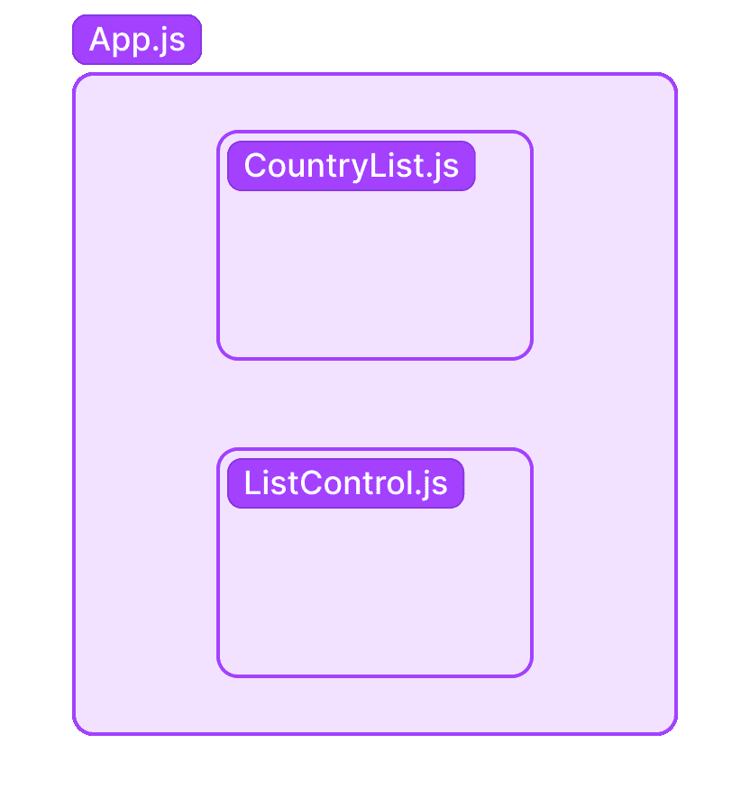
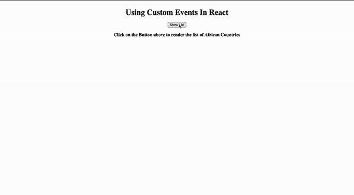
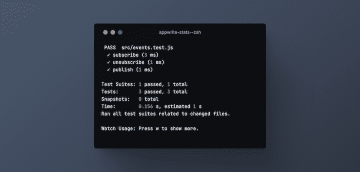

# 在 React 中使用自定义事件

> 原文：<https://blog.logrocket.com/using-custom-events-react/>

正如我们所知，事件是网络的重要特征之一。如果没有事件，网络将会非常乏味。

事件是在网页上对 HTML 元素发生的动作。无论什么时候网页上发生了什么，你都可以确定它很可能是一个事件，从页面最初加载时，到用户点击按钮，到关闭窗口或调整窗口大小。它们都是浏览器中发生的不同事件的例子。

作为一种网络脚本语言，JavaScript 允许我们执行代码来响应由 HTML 元素触发的事件的发生。

对于 JavaScript 框架，事件也可以用来在应用程序之间轻松传递数据。例如，React 只支持单向数据流，这意味着数据只能从顶层组件传递到较低层组件。但是使用事件，您可以在任何组件级别上监听特定事件并对其做出反应。

本文将介绍如何在 React 中创建和使用定制事件。

## 内容

## 什么是自定义事件？

浏览器有一组可用于各种 HTML 元素的默认事件。但是，在某些情况下，需要创建一个自定义事件。例如，如果您想在对话框组件关闭时与另一个组件通信，最好的方法是通过自定义事件，因为浏览器中没有“`onDialogClose`”事件。

我们可以使用事件构造函数创建自定义事件。我们现在终于可以创建不存在的"`onDialogClose`"事件了:

```
//First, we initialize our event
const event = new Event('onDialogClose');

// Next, we dispatch the event.
elem.dispatchEvent(event);

```

如果我们想向自定义事件添加更多的数据，我们可以通过使用`detail`属性的`CustomEvent`接口来实现:

```
//First, we initialize our event
const event = new CustomEvent('onDialogClose', {detail: "Main Dialog"});

// Next, we dispatch the event.
elem.dispatchEvent(event);

```

查看这篇[写得很好的文章](https://blog.logrocket.com/custom-events-in-javascript-a-complete-guide/#how-to-create-a-custom-event-in-javascript),了解更多关于 JavaScript 中的自定义事件以及如何在普通 JavaScript 项目中实现它们。

## React 中的自定义事件

对于本文，我们将构建一个演示来说明如何在 React 应用程序中使用自定义事件。

对于演示，我们的用例将试图显示和隐藏一个非洲国家的列表，该列表将包含在一个`CountryList.js`组件中，并在我们的应用程序的父组件`App.js`中从另一个子组件`ListControl.js`中声明。

为了获取非洲国家的列表，我们将使用 [REST countries API](https://restcountries.com/#api-endpoints-v3-subregion) 。



让我们开始吧！

## 项目设置

首先，我们将使用 Create React App 创建一个新的 React 项目。
接下来，我们将在`src`文件夹中创建一个`components`文件夹，并在其中创建我们的组件`CountryList.js`和`ListControl.js`。

`CountryList.js`组件将从我们的 [API 端点](https://restcountries.com/v3.1/region/africa)呈现非洲所有国家的列表，而`ListControl.js`组件将包含根据其当前状态显示或隐藏列表的按钮。

此外，在我们的`src`文件夹的根目录中，我们将创建一个`events.js`文件来抽象出用于发出和监听事件的代码，这样我们的代码会更干净一些，并且可以重用。

## 在 React 中构建自定义事件

一旦你完成了上面的指令，继续复制并粘贴下面代码块的内容到你的代码编辑器中。别担心，我们会详细检查每件事。
首先，`event.js`文件:

```
//events.js

function subscribe(eventName, listener) {
  document.addEventListener(eventName, listener);
}

function unsubscribe(eventName, listener) {
  document.removeEventListener(eventName, listener);
}

function publish(eventName, data) {
  const event = new CustomEvent(eventName, { detail: data });
  document.dispatchEvent(event);
}

export { publish, subscribe, unsubscribe};

```

在`event.js`文件中，如前所述，我们只抽象了创建定制事件、调度事件、添加事件监听器和删除事件监听器的逻辑，以供应用程序的其他组件使用。

***注意，*** *你可以随意重命名这里的函数名，我只是认为这种命名模式与发布者-订阅者模式*配合得很好

接下来是`CountryList.js`组件:

```
//CountryList.js

const CountryList = (props) => {
    return (
        <ul>
            <h2>List of countries in Africa</h2>
            {props.listData.map((el) => {
                return (
                    <li key={el.tld}>
                        <span>
                          
                        </span>
                        <span style={{fontSize: "20px"}}>{el.name.common} </span>
                    </li>
                );
            })}
        </ul>
    );
}
export default CountryList;

```

这个组件从它的父组件接受一个道具，根据上面的图表，父组件是`App.js`。我们一会儿会谈到这一点。

它显示 API 中的国家名称和国旗等数据。我给列表项添加了一点内联样式，这样看起来更好。

## 调度自定义事件

接下来，在我们的`ListControl.js`组件中，我们将使用我们创建的`publish`函数分派一个事件:

```
import { publish } from "../events"
const ListControl = (props) => {
  const showList = () => {
    publish('showList');
  }
  const hideList = () => {
    publish('hideList');
  }
  return (
    <div>
      { 
        props.listState ? <button onClick={hideList}>Hide List</button> :
        <button onClick={showList}>Show List</button>
       }
    </div>
  );
}
export default ListControl;
/pre>
```

该组件包含显示或隐藏国家列表的按钮控制逻辑。这也是两个动作的事件将被调度的地方。

我们从我们的`events`文件中导入`publish`函数，并用它来创建定制事件并分派它们。

* * *

### 更多来自 LogRocket 的精彩文章:

* * *

此外，该组件从`App.js`组件接收一个属性，该属性告诉它何时呈现列表，并根据列表的状态，呈现两个按钮之一:“显示列表”或“隐藏列表”。

## 订阅自定义事件

接下来，在我们的`App.js`文件中，我们将添加一个事件监听器来订阅我们创建的`showList`自定义事件。让我们一步一步地回顾这个过程:

```
import './App.css';
import { useState, useEffect } from "react";
import ListControl from './components/ListControl';
import CountryList from './components/CountryList';
import { subscribe, unsubscribe } from "./events";

const App = () => {
  const [isOpen, setIsOpen] = useState(false);
  const [countryList, setList] = useState([]);

  useEffect(() => {
    subscribe("showList", () => setIsOpen(true));
    subscribe("hideList", () => setIsOpen(false));

    async function fetchData() {
      const apiUrl = 'https://restcountries.com/v3.1/region/africa';
      const response = await fetch(apiUrl)
      let data = await response.json()
      setList(data)
    }
    fetchData()

    return () => {
      unsubscribe("showList", () => setIsOpen(false));
      unsubscribe("hideList", () => setIsOpen(true));
    }
  }, []);

  return (
    <div className="App">
      <h1>Using Custom Events In React</h1>
      <ListControl listState={isOpen}></ListControl>
      {
        isOpen ? <CountryList listData={countryList}></CountryList> :
          <h3>
            Click on the Button above to render the list of African Countries
          </h3>
      }
    </div>
  );
}
export default App;

```

父组件首先导入所有必需的组件和 React 挂钩，以便我们的应用程序运行。

接下来，我们用`useState`钩子声明应用程序的默认状态。

还记得创建和发送(或“发布”)各种定制事件的`ListControl`组件吗？嗯，`App.js`文件是我们监听和“订阅”那些事件的组件。

此外，当我们的应用程序第一次加载时，各种事件监听器被激活。然后，`fetchData`函数在`useEffect`钩子内部被触发，它向 API 发出 HTTP 请求，并将返回的数据存储在我们的应用程序的状态中。

当`showList`事件发布后，`isOpen`的值被更改为`true`，进而显示列表。然而，当`hideList`事件被发布时，`isOpen`的值被更改为`false`，它隐藏列表组件并返回一条消息。

***注意，*** *在* `*useEffect*` *钩子里面，我们有一个清理返回函数，在组件卸载的时候移除所有的事件监听器。这可以防止创建多个未使用的事件监听器并导致应用程序中的内存泄漏*

瞧啊。以下是我们迄今为止的工作成果:



## 测试自定义事件

运行测试是软件开发生命周期的一部分，所以让我们编写一些单元测试来确保我们的定制事件按预期运行。

我们需要一个类似 Jest 的测试框架来在 React 中执行单元测试。幸运的是，当使用`create-react-app`命令时，Jest 与生成的应用程序捆绑在一起，因此我们不需要进行任何额外的配置。

深入探究 Jest 是如何工作的超出了本文的范围，但是如果你想了解更多关于 Jest 的知识， [c](https://blog.logrocket.com/jest-testing-top-features/) [来看看这个](https://blog.logrocket.com/jest-testing-top-features/) [指南](https://blog.logrocket.com/jest-testing-top-features/)。

现在让我们在`src`目录中创建测试文件，并将其命名为`events.test.js`。将以下代码添加到文件中:

```
//import the event.js file
import { publish, subscribe, unsubscribe } from "./events";
//test the subscribe function
test("subscribe", () => {
    const listener = jest.fn();
    subscribe("test", listener);
    publish("test", "test data");
    expect(listener).toHaveBeenCalledWith(
        expect.objectContaining({
            type: "test",
            detail: "test data",
        })
    );
});
//test the unsubscribe function
test("unsubscribe", () => {
    const listener = jest.fn();
    subscribe("test", listener);
    unsubscribe("test", listener);
    publish("test", "test data");
    expect(listener).not.toHaveBeenCalled();
});
//test the publish function
test("publish", () => {
    const listener = jest.fn();
    subscribe("test", listener);
    publish("test", "test data");
    expect(listener).toHaveBeenCalledWith(
        expect.objectContaining({
            type: "test",
            detail: "test data",
        })
    );
});

```

为了确认我们的测试通过，让我们在终端中运行命令`npm run test`:



终端输出显示所有三个测试都通过了。这意味着我们的功能按预期运行。

## 结论

在本文中，我们学习了普通 JavaScript 中的事件和自定义事件。我们还讨论了如何在 React 应用程序中实现相同的模式，以及如何为我们的定制事件分派、订阅和编写单元测试。

本教程的所有代码都在这里的 GitHub 上。您可以随意使用它，摆弄代码，如果您喜欢本教程，请给它打个星。

另外，请在下面的评论区留下你的想法。

## [LogRocket](https://lp.logrocket.com/blg/react-signup-general) :全面了解您的生产 React 应用

调试 React 应用程序可能很困难，尤其是当用户遇到难以重现的问题时。如果您对监视和跟踪 Redux 状态、自动显示 JavaScript 错误以及跟踪缓慢的网络请求和组件加载时间感兴趣，

[try LogRocket](https://lp.logrocket.com/blg/react-signup-general)

.

[ ](https://lp.logrocket.com/blg/react-signup-general) [](https://lp.logrocket.com/blg/react-signup-general) 

LogRocket 结合了会话回放、产品分析和错误跟踪，使软件团队能够创建理想的 web 和移动产品体验。这对你来说意味着什么？

LogRocket 不是猜测错误发生的原因，也不是要求用户提供截图和日志转储，而是让您回放问题，就像它们发生在您自己的浏览器中一样，以快速了解哪里出错了。

不再有嘈杂的警报。智能错误跟踪允许您对问题进行分类，然后从中学习。获得有影响的用户问题的通知，而不是误报。警报越少，有用的信号越多。

LogRocket Redux 中间件包为您的用户会话增加了一层额外的可见性。LogRocket 记录 Redux 存储中的所有操作和状态。

现代化您调试 React 应用的方式— [开始免费监控](https://lp.logrocket.com/blg/react-signup-general)。