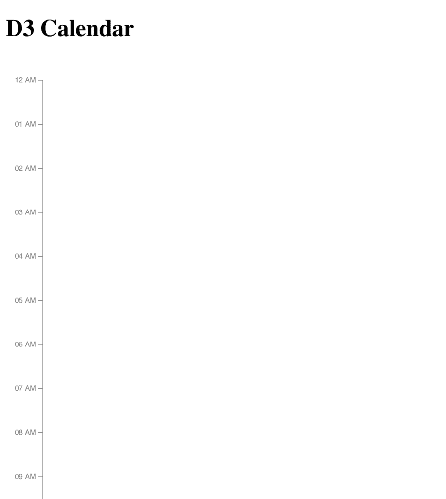

# 使用 D3 数据可视化创建日历应用程序

> 原文：<https://blog.logrocket.com/using-d3-to-create-a-calendar-app/>

# 介绍

构建一个知名应用程序或站点的克隆是学习新技术或提升现有知识的好方法。因此，虽然 [D3](https://d3js.org/) 可能不是你想用来构建日历应用的第一个工具，但我们可以通过使用它来创建谷歌日历克隆来了解这个库。

### D3 演示项目项目 **s** etup

为了简单起见，我们将创建一个目录，然后使用 Snowpack 搭建我们的应用程序。从命令行运行以下命令(如果您愿意，您也可以运行`yarn`等效命令):

```
mkdir calendar-clone
cd calendar-clone
npm init -y
npm install --save-dev snowpack
npm install --save d3

```

在我们运行任何东西之前，我们应该首先在我们的`calendar-clone`目录的根目录下创建一个 HTML 文件(`index.html`)，其内容如下:

```
<!DOCTYPE html>
<html lang="en">
  <head>
    <meta charset="utf-8" />
    <meta name="viewport" content="width=device-width, initial-scale=1" />
    <meta name="description" content="Starter Snowpack App" />
    <title>D3 Calendar App</title>
  </head>
  <body>
    <h1>D3 Calendar</h1>
    <script type="module" src="/index.js"></script>
  </body>
</html>

```

我们还将在同一个目录中创建一个`index.js`文件(我们将在这里完成剩下的工作)。

为了安全起见，让我们添加一个控制台日志语句来确保它正确运行:

```
console.log("Let's build a calendar app!");

```

从这里，您可以启动您的开发服务器，并从您的终端运行以下命令:

```
npx snowpack dev

```

这将启动您的开发服务器并打开一个浏览器窗口。

一旦你在你的浏览器 devtools 中打开控制台并找到我们上面添加的日志，我们就可以开始构建我们的应用了！

## 演示:用 D3 构建一个谷歌日历应用克隆

D3 最常用于拉入、解析和可视化数据。在本教程中，我们将通过创建自己的 JSON 对象来绕过大多数数据可视化项目中的数据操作。

[https://www.youtube.com/embed/g-7jSNBGmS0](https://www.youtube.com/embed/g-7jSNBGmS0)

视频

### **导入** **报表** **和** **数据申报**

为了开始构建我们的应用程序，我们的第一步是清除之前添加到我们的`index.js`文件中的测试代码。由于我们的`index.js`文件为空，我们现在将导入 D3，声明一些日历事件，并创建一个稍后将使用的`dates`数组:

```
import * as d3 from 'd3';
const calendarEvents = [
  {
    timeFrom: '2020-11-11T05:00:00.000Z',
    timeTo: '2020-11-11T12:00:00.000Z',
    title: 'Sleep',
    background: '#616161'
  },
  {
    timeFrom: '2020-11-11T16:00:00.000Z',
    timeTo: '2020-11-11T17:30:00.000Z',
    title: 'Business meeting',
    background: '#33B779'
  },
  {
    timeFrom: '2020-11-12T00:00:00.000Z',
    timeTo: '2020-11-12T05:00:00.000Z',
    title: 'Wind down time',
    background: '#616161'
  }
];
// Make an array of dates to use for our yScale later on
const dates = [
  ...calendarEvents.map(d => new Date(d.timeFrom)),
  ...calendarEvents.map(d => new Date(d.timeTo))
];

```

### **Ad** d 标准 D3 **变量**

我们将在以后设计更多，但是开始时，我们可以声明几个典型的 D3 项目的变量(`margin`、`height`、`width`)和其他几个特定于我们的变量(`barWidth`、`nowColor`):

```
const margin = { top: 30, right: 30, bottom: 30, left: 50 }; // Gives space for axes and other margins
const height = 1500;
const width = 900;
const barWidth = 600;
const nowColor = '#EA4335';
const barStyle = {
  background: '#616161',
  textColor: 'white',
  width: barWidth,
  startPadding: 2,
  endPadding: 3,
  radius: 3
};

```

### **使用浏览器开发工具验证 DOM 更新**

在我们继续之前，我们将在页面上显示一些内容，这样我们可以看到一切都在工作:

```
// Create the SVG element
const svg = d3
  .create('svg')
  .attr('width', width)
  .attr('height', height);
// All further code additions will go just below this line

// Actually add the element to the page
document.body.append(svg.node());
// This part ^ always goes at the end of our index.js

```

当你打开浏览器时，一开始你可能不会注意到什么，但是请放心，页面上有一个很大的 SVG 元素。您可以通过打开浏览器开发工具并检查页面元素来确认这一点。

这是一个调试 D3 问题的好方法，因为您的代码会改变页面上的 SVG 元素及其属性。

### **添加比例功能**

接下来，我们将添加我们的尺度函数，它们通常被称为`x`或`xScale`和`y`或`yScale`。这些函数用于将数据中的点映射到可视化中的像素值。

例如，如果我们沿着 y 轴映射了 1 到 100 的数据点，那么`y`函数会将 82 映射到我们的 SVG 对象的顶部(确切地说，是向上 82%)。

在许多情况下，时间会被绘制在 x 轴上，但出于我们的目的，我们将在 y 轴上垂直绘制时间。为了更加简单，我们将只构建一个单日日历，因此我们根本不需要包含 x 刻度:

```
const yScale = d3
  .scaleTime()
  .domain([d3.min(dates), d3.max(dates)])
  .range([margin.top, height - margin.bottom]);

```

注意，我们将数据范围传递给`domain`，将像素范围传递给`range`。还要注意，对于`range`函数，我们首先传递的是`margin.top`，而不是底部。这是因为 SVG 是从上到下绘制的，所以 0 y 坐标将在顶部。

### **绘制 y 轴**

我们稍后将使用刚刚创建的比例映射，但首先，让我们绘制实际的 y 轴本身:

```
const yAxis = d3
  .axisLeft()
  .ticks(24)
  .scale(yScale);
// We'll be using this svg variable throughout to append other elements to it
svg
  .append('g')
  .attr('transform', `translate(${margin.left},0)`)
  .attr('opacity', 0.5)
  .call(yAxis);

```

### **自定义刻度样式**

然后，由于我们现在只显示一天，我们可以将第一个和最后一个刻度设置为午夜(12AM)出现，目的是以后在应用程序的其他地方显示实际日期。

```
svg
  .selectAll('g.tick')
  .filter((d, i, ticks) => i === 0 || i === ticks.length - 1)
  .select('text')
  .text('12 AM');

```

### **入住……**

到目前为止，我们已经创建了一个轴，指定它将位于图表的左侧，指定我们希望轴上有 24 个刻度线，并应用了我们的刻度。然后我们使用我们的`append`函数将轴放入我们的`svg`元素中的`g`元素。

为了确认这些都设置正确，请检查您的浏览器 devtools 中的元素。应用程序本身将如下所示:



### **添加网格线**

由于这毕竟是一个日历，我们要添加一些网格线进行设计。

在前面的步骤中，我们设置了我们的`yAxis`并将刻度设置为`24`，一天中的每个小时一个刻度。为了设置我们的网格线，我们将做同样的事情，使用`axisRight`使刻度出现在右边:

```
const gridLines = d3
  .axisRight()
  .ticks(24)
  .tickSize(barStyle.width) // even though they're "ticks" we've set them to be full-width
  .tickFormat('')
  .scale(yScale);

svg
  .append('g')
  .attr('transform', `translate(${margin.left},0)`)
  .attr('opacity', 0.3)
  .call(gridLines);

```

与我们之前的方法一样，我们将轴放在了一个`g`元素中，并将其附加到了我们的`svg`元素中。检查你的浏览器开发工具来查看 DOM 结构。

### **使用`calendarEvents`** **阵**

有了轴和网格线，我们可以使用我们创建的`calendarEvents`数组来添加一些日历事件。

为了添加事件，我们将使用`[join]([https://observablehq.com/@d3/selection-join](https://observablehq.com/@d3/selection-join))`方法将`g`元素添加到我们的`svg`元素中。为此，我们将选择所有现有的具有`barGroup`类的`g`元素(提示:尚不存在)，并为每个现有的`calendarEvents`项加入一个具有该类的新的`g`元素。

下面是我们将添加的实现这一点的代码:

```
const barGroups = svg
  .selectAll('g.barGroup')
  .data(calendarEvents)
  .join('g')
    .attr('class', 'barGroup');

```

现在，当您查看浏览器 devtools 时，您应该能够看到在我们的`svg`元素中有 3 个空的`g`项(我们的事件列表)。

### **向项目追加元素**

随着我们的`g`项的创建和日历事件的绑定，我们现在能够向它们添加其他元素。

在我们的演示中，我们将使用`.append`和`rect`为日历事件创建彩色矩形:

```
barGroups
  .append('rect')
  .attr('fill', d => d.background || barStyle.background)
  .attr('x', margin.left)
  .attr('y', d => yScale(new Date(d.timeFrom)) + barStyle.startPadding)
  .attr('height', d => {
    const startPoint = yScale(new Date(d.timeFrom));
    const endPoint = yScale(new Date(d.timeTo));
    return (
      endPoint - startPoint - barStyle.endPadding - barStyle.startPadding
    );
  })
  .attr('width', barStyle.width)
  .attr('rx', barStyle.radius);

```

在上面的例子中，我们已经做了一些数学计算来确定矩形应该从哪里垂直开始，以及它应该有多高。如果你改变数学，你会看到如何影响应用程序。只要记住:如果你改变了数学，别忘了把它改回来。

### **追踪当前时间**

使用类似的方法，我们现在可以添加一行来跟踪当前时间，这将允许用户可以看到“现在”在日历上的位置:

```
// Since we've hardcoded all our events to be on November 11 of 2020, we'll do the same thing for the "now" date
const currentTimeDate = new Date(new Date(new Date().setDate(11)).setMonth(10)).setFullYear(2020);

barGroups
  .append('rect')
  .attr('fill', nowColor)
  .attr('x', margin.left)
  .attr('y', yScale(currentTimeDate) + barStyle.startPadding)
  .attr('height', 2)
  .attr('width', barStyle.width);

```

注意，我们再次使用了开始时声明的`margin`变量，以确保我们的矩形不会与我们的轴重叠。

### **标签事件**

最后，我们将为日历上的事件添加标签。我们将再次使用`append`方法，但是这次我们将向我们的`barGroups`变量添加一个`text`元素:

```
barGroups
  .append('text')
  .attr('font-family', 'Roboto')
  .attr('font-size', 12)
  .attr('font-weight', 500)
  .attr('text-anchor', 'start')
  .attr('fill', barStyle.textColor)
  .attr('x', margin.left + 10)
  .attr('y', d => yScale(new Date(d.timeFrom)) + 20)
  .text(d => d.title);

```

### **D3 最终产品**


## 结论

就这样，我们用 D3.js 创建了自己的日历和事件应用程序！当然，这只是 D3 日历实验的开始。您可以在此基础上继续改进，比如将其扩展为周历或月历，或者允许动态事件创建。

虽然您可能通常不会使用 D3 来构建日历应用程序，但这个练习让我们对如何使用 D3 绘制刻度、轴和形状有了一些了解。为了将来的实验，使用浏览器开发工具来查看我们对 D3 代码的更改如何影响、更改和修改应用程序中的 SVG 元素。

## 您是否正在添加新的 JS 库以提高性能或构建新的特性？如果他们反其道而行之呢？

毫无疑问，前端变得越来越复杂。当您向应用程序添加新的 JavaScript 库和其他依赖项时，您将需要更多的可见性，以确保您的用户不会遇到未知的问题。

LogRocket 是一个前端应用程序监控解决方案，可以让您回放 JavaScript 错误，就像它们发生在您自己的浏览器中一样，这样您就可以更有效地对错误做出反应。

[](https://lp.logrocket.com/blg/javascript-signup)[https://logrocket.com/signup/](https://lp.logrocket.com/blg/javascript-signup)

[LogRocket](https://lp.logrocket.com/blg/javascript-signup) 可以与任何应用程序完美配合，不管是什么框架，并且有插件可以记录来自 Redux、Vuex 和@ngrx/store 的额外上下文。您可以汇总并报告问题发生时应用程序的状态，而不是猜测问题发生的原因。LogRocket 还可以监控应用的性能，报告客户端 CPU 负载、客户端内存使用等指标。

自信地构建— [开始免费监控](https://lp.logrocket.com/blg/javascript-signup)。