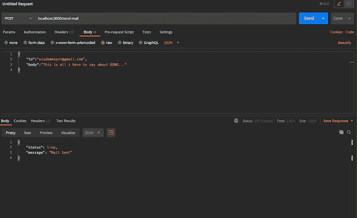
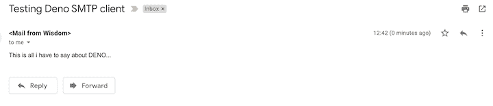

# 使用 Deno 的 SMTP 客户端

> 原文：<https://blog.logrocket.com/using-denos-smtp-client/>

Deno 是一个基于 V8 JavaScript 引擎和 Rust 的 JavaScript 和 TypeScript 运行时。

Node.js 的原创者 Ryan Dahl 于 2019 年 4 月在 JSConf EU 正式[宣布，Deno 拥有一流的 TypeScript 支持。这意味着您不必编写任何手动配置来设置它，但这并不意味着您仅限于使用 TypeScript 编写代码。](https://www.youtube.com/watch?v=z6JRlx5NC9E)

Deno 与 Node 非常不同，因为它没有包管理器。不得不依赖 URL 来托管和导入包有它的优点和缺点。

在本教程中，我们将构建一个 Deno 应用程序，使用 [Deno 的 SMTP 邮件客户端](https://deno.land/x/smtp@v0.3.0/README.md)向另一个用户发送邮件。要继续学习，您需要对 JavaScript 有一个基本的了解，一个文本编辑器(我们将使用 VS 代码)，以及安装在本地机器上的 POSTMAN。

## 安装 Deno

安装 Deno 最好最简单的方法是使用[自制软件](https://formulae.brew.sh/formula/deno)。

打开您的终端并键入:

```
brew install deno

```

安装完成后，在您的终端上运行`deno`以确认安装成功。

## 设置 Deno 服务器

现在让我们为我们的应用程序设置一个服务器。我们将使用 [Oak](https://github.com/oakserver/oak) 来构建我们的服务器，它是 Deno 的 HTTP 服务器的中间件框架，也支持路由。

创建一个`server.ts`文件并添加以下内容。

```
import { Application } from "https://deno.land/x/oak/mod.ts";
const app = new Application();
import router from "./routes.ts";
const PORT: number = 3000;
app.use(router.routes());
app.use(router.allowedMethods());
app.listen({ port: PORT });

```

在这里，我们访问了 Oak 的`Application`类，它包装了来自`http`包的`serve`函数。我们将该实例存储在`app`变量中，该变量将用于定义路由和监听端口。

## 创建路线

接下来，我们将创建一个`routes.ts`文件。这是我们创建路线的地方，它将与控制器文件通信。

```
import { Router } from "https://deno.land/x/oak/mod.ts";
const router = new Router();
router
  .get("/", (ctx) => {
    ctx.response.body = "This is the home route";
  })
export default router;

```

请注意我们如何从 Oak 引入了`Router`类，然后创建了它的一个新实例。

现在我们可以通过在终端上运行`deno run --allow-all server.ts`来运行我们的应用程序。这将在端口`3000`上运行应用程序。现在，如果你尝试访问应用程序，你会得到`This is the home route`。

下一步是添加一个新的路由来发送我们的消息，然后实现 mailer 函数。

```
import { Router } from "https://deno.land/x/oak/mod.ts";
import { sendMail } from "./controller.ts";
const router = new Router();
router
  .get("/", (ctx) => {
    ctx.response.body = "This is the home route";
  })
  .post("/send-mail", sendMail);
export default router;

```

我们添加了一个新的路由，这是一个发送邮件的`POST`请求。接下来，我们将创建一个`controller.ts`文件，在这里我们将定义我们的路由方法。我们还将为邮件配置创建一个`index.ts`文件。

创建`controller.ts`文件并添加以下代码。

```
import { mailerObj } from "./index.ts";
let sendMail = async (ctx: any) => {
  try {
    let body: any = await ctx.request.body();
    let dataObj = await body.value;
    await mailerObj(dataObj);
    ctx.response.body = { status: true, message: "Mail Sent" };
    ctx.response.status = 201;
  } catch (err) {
    ctx.response.body = { status: false, data: null };
    ctx.response.status = 500;
    console.log(err);
  }
};
export { sendMail };

```

我们首先引入我们的 mailer 实例，我们将很快对其进行定义。每个控制器方法都传递了一个上下文，我们将使用它来创建请求体。这个主体将由我们的邮件`body`和`to`组成，前者是我们发送的邮件主体，后者是我们发送邮件的接收者。

为了方便访问，我们将把主体传递到我们的`mailerObj`方法中。

在我们设置我们的邮件方法之前，我们必须[打开`less secure`选项](https://myaccount.google.com/lesssecureapps)。完成后，我们可以继续我们的配置。

## 设置 Deno SMTP 客户端

创建一个`index.ts`文件并添加以下代码。

```
import { SmtpClient } from "https://deno.land/x/smtp/mod.ts";
const client = new SmtpClient();
await client.connectTLS({
  hostname: "smtp.gmail.com",
  port: 465,
  username: <gmail email>,
  password: <gmail password>
});
let mailerObj = async (data: any) => {
  await client.send({
    from: "Mail from Wisdom", // Your Email address
    to: data.to, // Email address of the destination
    subject: "Deno is Great",
    content: data.body,
  });
  await client.close();
};
export { mailerObj };

```

接下来，引入 Deno 的`SmtpClient`模块，然后创建它的一个实例。使用`Smtp`实例连接到 Gmail。这个配置接受我们的 Gmail 用户名和密码。出于安全考虑，我们需要将这些细节保存在环境变量中。

下一步是定义我们的 mailer 对象，它接收关于消息的细节，比如发送者、接收者、主题和内容。我们必须导出这个配置，以便其他文件可以访问它。

## 环境变量

让我们通过使用一些环境变量来存储我们的 Gmail 信息，从而修改我们的代码。

在应用程序的根目录下创建一个`.env`文件，并添加以下内容。

* * *

### 更多来自 LogRocket 的精彩文章:

* * *

```
GMAIL_USERNAME=<gmail email>
GMAIL_PASSWORD=<gmail password>

```

接下来，修改我们的邮件程序配置来监听这个环境变量。

```
import "https://deno.land/x/dotenv/load.ts";
import { SmtpClient } from "https://deno.land/x/smtp/mod.ts";
const client = new SmtpClient();
await client.connectTLS({
  hostname: "smtp.gmail.com",
  port: 465,
  username: Deno.env.get("GMAIL_USERNAME"),
  password: Deno.env.get("GMAIL_PASSWORD"),
});
let mailerObj = async (data: any) => {
  await client.send({
    from: "Mail from Wisdom", // Your Email address
    to: data.to, // Email address of the destination
    subject: "Testing Deno SMTP client",
    content: data.body,
  });
  await client.close();
};
export { mailerObj };

```

为了访问存储在`.env`文件中的数据，我们必须引入 Deno 的 env 模块，并使用`Deno.env.get(name)`来获取存储的值。

始终记得创建一个与存储在`.env`文件中的键相同但没有值的`.env.example`文件，并将`.env`文件添加到`.gitignore`文件中。

要测试应用程序，打开 POSTMAN 并发出 post 请求。



发出请求后，您可以打开收件人邮件以确认邮件已发送。



## 结论

使用 Deno SMTP 客户端发送消息非常容易。此模块的常见用例包括向订阅者发送时事通讯和发送模板化的电子邮件。

在本教程中，我们介绍了如何为 Gmail 和其他邮件提供商设置 SMTP 配置，以及如何向用户发送动态邮件。为了提高安全性，将敏感的配置细节存储在环境变量中始终是一个好的做法。

前往 [GitHub](https://github.com/Wisdom132/deno/tree/master/smtp) 获取本教程中使用的完整源代码。

## 使用 [LogRocket](https://lp.logrocket.com/blg/signup) 消除传统错误报告的干扰

[](https://lp.logrocket.com/blg/signup)

[LogRocket](https://lp.logrocket.com/blg/signup) 是一个数字体验分析解决方案，它可以保护您免受数百个假阳性错误警报的影响，只针对几个真正重要的项目。LogRocket 会告诉您应用程序中实际影响用户的最具影响力的 bug 和 UX 问题。

然后，使用具有深层技术遥测的会话重放来确切地查看用户看到了什么以及是什么导致了问题，就像你在他们身后看一样。

LogRocket 自动聚合客户端错误、JS 异常、前端性能指标和用户交互。然后 LogRocket 使用机器学习来告诉你哪些问题正在影响大多数用户，并提供你需要修复它的上下文。

关注重要的 bug—[今天就试试 LogRocket】。](https://lp.logrocket.com/blg/signup-issue-free)