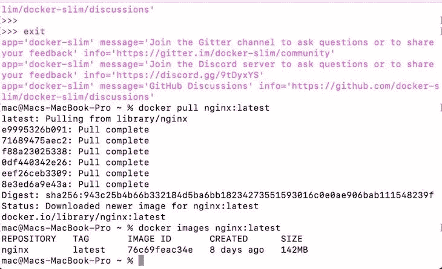
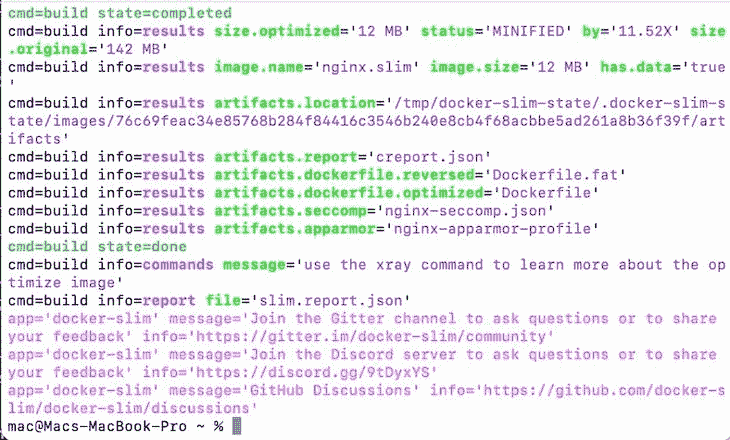
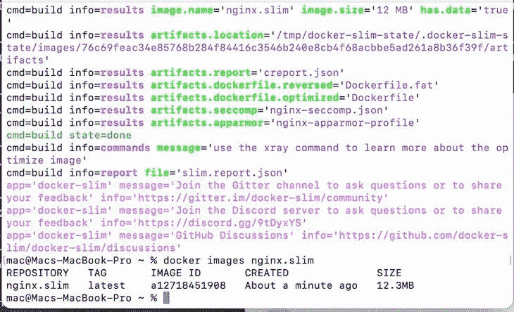

# 使用 DockerSlim 最小化容器图像大小

> 原文：<https://blog.logrocket.com/using-dockerslim-minimize-container-image-size/>

您是否曾经不得不在一个项目上与某人合作，试图在您的系统上运行应用程序，并意识到它需要与您当前运行的依赖项不同的版本？

我们都经历过设置复杂的开发环境，以及在与其他人合作时处理版本和依赖冲突。

这可能是由于应用程序需要与我们环境中不同的 PHP 或 Python 版本，或者需要与我们环境提供的不同版本的第三方库。这是一个如此普遍的问题，以至于[有了一个名字:依赖地狱](https://en.wikipedia.org/wiki/Dependency_hell)。

依赖关系解析本身就是一件麻烦事。Docker 是一个工具，它可以有效地节省您处理这类问题的大量时间和精力，这是一个用于创建、部署和管理应用程序的开源平台。

Docker 允许您将应用程序及其所有必需的依赖项和库打包到一个称为容器的隔离环境中。然后，您可以联机共享该容器，这样无论从什么环境访问包，应用程序都将按预期运行。

使用容器来组织应用程序的代码是一种创新的解决方案，世界各地的公司越来越多地采用这种解决方案。这种方法使协作变得简单而无缝。它还显著减少了编写代码并将其部署到生产环境中所需的时间。

容器是轻量级的，通常不需要很多硬件空间。然而，许多容器图像的大小往往相当大，大的容器图像会带来安全风险。这就是一个叫做 DockerSlim 的工具可以派上用场的地方。

在本文中，我们将探讨使用 DockerSlim 的安全优势，并比较 Docker 容器映像的大小在实现该工具前后的变化。

向前跳:

## 为什么你应该使用 Docker

[Docker 易于设置和使用](https://blog.logrocket.com/docker-for-front-end-developers/)。它消除了为不同版本的软件配置环境的需要。

每个 Docker 容器都包含一个软件版本及其特定的环境配置。这不会以任何方式影响系统 OS 或系统上其他容器的配置，从而使您的应用程序独立于平台。

Docker 容器可以在 macOS、Linux 和 Windows 上无缝运行，不需要任何额外的设置。

## 什么是 DockerSlim？

虽然 Docker 为您提供了大量的好处，其中一些已经在上面列出，但是 Docker 容器会随着您的应用程序一起成长。应用程序越大，容器就越大。

较大的容器会降低应用程序的速度，并容易出现错误和安全威胁。它还会占用更多的存储空间，以及更多的升级和下载时间。这些并不完全是我们想要的功能。

这就是 DockerSlim 的用武之地。它非常适合修剪容器！

### DockerSlim 的好处

DockerSlim 是一款开源软件，它可以让你的容器缩小 30 倍，并且更加安全。您不必对图像进行任何更改，就可以使用 DockerSlim 缩小图像。

最小化 Docker 容器有助于提高下载速度。它还使应用程序启动速度更快，占用的内存更少，伸缩速度更快。较小的图像可以很容易地上传到云中，也更容易维护。

每当您在映像上运行`build`时，DockerSlim 都会为您的映像生成 [Seccomp](https://docs.docker.com/engine/security/seccomp/) 和 [AppArmor](https://apparmor.net/) 安全配置文件。这些安全配置文件是专门为您的映像定制的，通过限制应用程序的 root 访问、读写权限和网络访问，帮助保护您的容器免受威胁。

DockerSlim 适用于所有类型的应用程序和技术堆栈。它将缩小任何容器，只要它是基于 Linux 和 OCI 投诉。也就是说，使用 Node 、Python、Ruby on Rails 和 DotNet 构建的 [web 应用程序，这个过程更加无缝和自动化。](https://blog.logrocket.com/node-js-docker-improve-dx-docker-compose/)

对于控制台应用程序，作为开发人员，您必须做一些手工工作才能让它工作，或者编写一个脚本来帮助它实现自动化。

### DockerSlim 的缺点

在某些情况下，DockerSlim 可能会丢弃实际上很重要的文件，尤其是只在边缘情况下才需要的文件。

例如，如果您有一个默认设置为英语的多语言应用程序，DockerSlim 可能会丢弃其他语言的文件。只有使用其他语言的用户(可能很少)会注意到这个问题。

* * *

### 更多来自 LogRocket 的精彩文章:

* * *

像这样的问题可能意味着 DockerSlim 并不总是适合生产。防止这种问题的一种方法是指定 DockerSlim 必须保存和使用的文件和文件夹的路径。

### 看看引擎盖下面

DockerSlim 利用一种叫做 PTRACE 的 Unix 技术来扫描正在运行的 Docker 容器。

PTRACE 在扫描 Docker 容器时收集数据。DockerSlim 然后检查所有数据，并决定必须保留哪些重要文件和可执行文件。

最后，DockerSlim 创建一个新的容器映像，其中只包含成功运行应用程序所必需的文件。如果您提供了任何自定义配置，它们将被包括在内。

## 使用 DockerSlim 最小化容器图像大小

让我们探索如何使用 DockerSlim 来减小容器图像的大小，并提高性能和安全性。从安装到分析，我们将一步步讲解如何使用这个工具。

### 安装 DockerSlim

要安装 DockerSlim，请运行以下命令:

```
brew install docker-slim

```

如果您已经在系统上安装了它，您可以通过运行以下命令来更新它以获得最新版本:

```
docker-slim update

```

安装完成后，您可以继续最小化容器的大小。

### 检索可缩小的图像列表

要获取计算机上的图像列表，请运行以下命令:

```
docker images

```

这将返回一个带有以下标题的表格列表:

*   存储库:表示图像的名称
*   标签:用于识别和版本化图像的别名
*   图像 ID:表示图像的 ID
*   创建时间:指定图像的创建时间
*   尺寸:显示图像的尺寸

从列表中找出您希望最小化的图像，复制其名称，并对其运行`docker-slim build`。例如:

```
docker-slim build  my-container-image

```

### 最小化前后的示例图像

例如，我将下载 Nginx 最新版本的图像，并用 DockerSlim 将其缩小:

```
$ docker pull nginx:latest

```

在缩小它之前，我将运行以下命令来查看它的原始大小:

```
docker images nginx:latest

```



目前大小为`142MB`。现在我要用 DockerSlim 来优化它:

```
$ docker-slim build --target nginx:latest

```

如果它成功执行，应该会返回如下消息:



现在，您的容器的一个优化版本应该被创建并以一个`.slim`扩展名保存。新容器应该比原来的容器小得多。在这种情况下，新的尺寸是`12 MB`，比原来的`11.52X`小。

如果运行以下命令，您应该会在列出的容器中找到扩展名为`.slim`的新的小型容器:

```
docker images

```



### 检索关于新容器映像的信息

您可以在新容器上运行由`docker-slim`提供的`xray`命令来查看一些有用的信息:

```
docker-slim xray my-container-image

```

上面的命令返回关于容器的报告，该报告保存在名为`slim.report.json`的文件中。它应该包含容器名称、大小、公开的端口等信息。

其他一些为你提供 Docker 图像信息的[命令还有`lint`和`profile`。](https://github.com/docker-slim/docker-slim#lint-command-options)

`lint`命令检查 Docker 文件中的错误和无效指令，并向您提供适当的警告。您可以像这样执行这个命令:

```
docker-slim lint  my-container-image

```

`profile`命令通过首先运行分析，然后探测您的映像、其端口、其 HTTP 连接等等，对您的映像执行更详细的动态分析。然后，它在一个`report.json`文件中生成一个综合报告。要执行此命令，请运行以下命令:

```
docker-slim profile  my-container-image

```

## 结论

使用大型容器的应用程序经常会遇到性能问题。在本文中，我们讨论了使用 DockerSlim 来精简 Docker 容器的重要性，以及 DockerSlim 是如何工作的。

希望你现在有足够的信心使用 DockerSlim 来缩小你所有的超大集装箱。如果你有任何问题，请在评论中告诉我。

## 使用 [LogRocket](https://lp.logrocket.com/blg/signup) 消除传统错误报告的干扰

[](https://lp.logrocket.com/blg/signup)

[LogRocket](https://lp.logrocket.com/blg/signup) 是一个数字体验分析解决方案，它可以保护您免受数百个假阳性错误警报的影响，只针对几个真正重要的项目。LogRocket 会告诉您应用程序中实际影响用户的最具影响力的 bug 和 UX 问题。

然后，使用具有深层技术遥测的会话重放来确切地查看用户看到了什么以及是什么导致了问题，就像你在他们身后看一样。

LogRocket 自动聚合客户端错误、JS 异常、前端性能指标和用户交互。然后 LogRocket 使用机器学习来告诉你哪些问题正在影响大多数用户，并提供你需要修复它的上下文。

关注重要的 bug—[今天就试试 LogRocket】。](https://lp.logrocket.com/blg/signup-issue-free)