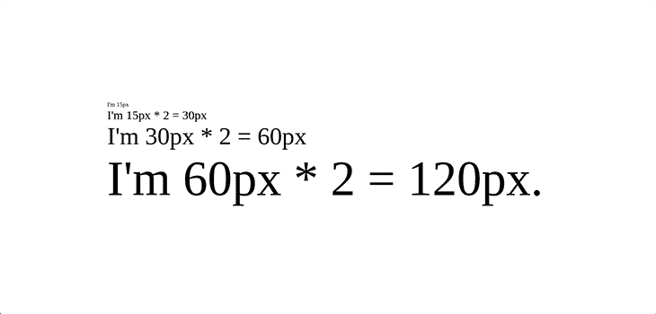
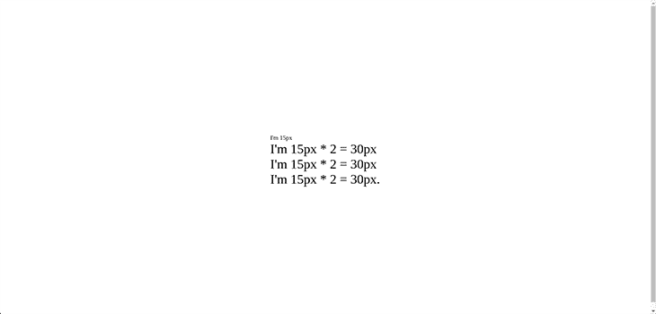

# 在 CSS - LogRocket 博客中使用 em 与 rem

> 原文：<https://blog.logrocket.com/using-em-vs-rem-css/>

CSS 的核心功能是使浏览器能够对 HTML 元素进行样式化。CSS 通过为属性分配特定的值来实现这一点，例如背景、颜色、字体大小、边距、填充等等。

在 CSS 中，`em`和`rem`都是可伸缩的单元，它们也指定属性值。`em`和`rem`符合[网页可访问性标准](https://www.w3.org/WAI/fundamentals/accessibility-intro/)，并且与`px`不同，可扩展性更好。因此，它们更适合响应式设计。

在本文中，我们将了解`em`和`rem`相对长度单位。我们还将查看代码示例，以展示它们是如何工作的、它们的区别以及编码模式。最后，我们将了解它们能解决什么问题以及何时使用它们。

## 背景资料

CSS 语法相当简单，正如我们之前讨论的，包括给 HTML 元素的属性赋值。属性-值对被称为 CSS 声明。

考虑下面的代码:

```
h1 {
  color: black;
  background-color: rgb(190,43,111,0.5);
  font-weight: 800;
  font-size: 1.5rem;
  padding: 4em;
  margin: 10px;
  weight: 100%;
  height: 100vh;
}

```

这段代码展示了一个 CSS 声明，它通过给元素的一些属性赋予特定的值来设置网页的`h1`元素的样式。我们看到一些属性，比如`font-size`、`padding`和`margin`，被赋予了数值。

在 CSS 中，有不同的数值类型:

*   整数:整数，就像上面分配给属性`font-weight`的值`800`
*   Numbers:十进制数字，就像上面传递给 [`rgb()`](https://developer.mozilla.org/en-US/docs/Web/CSS/color_value/rgb) 函数表达式的 alpha 值。alpha 值为`0.5`，表示 50%的不透明度
*   百分比:如分配给`weight`属性的`100%`
*   尺寸:带单位的数字，如`1.5rem`、`10px`或`100vh`。尺寸细分为`length`、`angle`、`time`和`resolutions`。在上面的例子中，每个维度(`em`、`px`、`rem`和`vh`)都属于长度类别

## 长度值

长度值是分配给 CSS 属性的 [CSS 数据类型](https://developer.mozilla.org/en-US/docs/Web/CSS/CSS_Types)，如`weight`、`height`、`margin`、`padding`、`font-size`。长度值可以是绝对的，也可以是相对的。

绝对长度值是固定的单位，比如`px`。它们不是相对的，也不依赖于任何东西。

然而，相对长度值不是固定的。它们与其他东西相关，比如浏览器的默认字体大小或其他元素的字体大小。相对单位的例子包括`em`、`rem`和`vh`。

随着 web 开发随着设备数量的增加而发展，可伸缩单元比固定单元更受青睐，因为它们为构建响应性网站提供了所需的灵活性。

现在，我们将深入探讨`em`和`rem`。我们开始吧！

## 什么是`em`和`rem`，为什么要用？

`em`是相对于父元素字体大小的 CSS 单位，`rem`是相对于`html`元素字体大小的 CSS 单位。这两个都是可伸缩的单元，这意味着它们使我们能够相对于一个设定值来放大和缩小元素。这给我们的设计增加了更多的灵活性，并使我们的网站更加灵敏。

使用像`em`和`rem`这样的可伸缩单元的一个关键原因是可访问性。可访问性使所有用户，尤其是残疾用户，能够成功地与网站进行交互。使用像`px`这样的固定单位来设置元素、字体和空间大小的值并不能给我们这种可访问性，因为固定单位是不可伸缩的。

通过使用像`em`和`rem`这样的可扩展单元，我们使用户能够控制网站的规模，从而为我们提供我们想要的可访问性。

## `em`对`rem`

`em`和`rem`是相似的，因为它们都是可扩展单元。它们的价值总是相对于其他东西的价值而言的。

最值得注意的是，`em`和`rem`在浏览器将它们转换成`px`的方式上有所不同。

如前所述，`em`值是相对于最近的父元素的`font-size`的，而`rem`值是相对于根元素的`font-size`，或者是`html`元素的`font-size`。而当根`font-size`没有显式设置时，`rem`值是相对于浏览器默认的`font-size`的`16px`。

这意味着当根`font-size`是`16px`时，`1rem`的值将是`16px` * 1 = `16px`。并且`10rem`的值将是`16px` * 10 = `160px`。

从上面我们可以看到,`rem`值是简单且可预测的，因此，我们可以控制元素如何从一个源轻松地扩展到整个页面。您可以在下面的演示中看到这一点:

```
/* Root font-size on the document level */
html {
  font-size: 20px;
}

@media (max-width: 900px) {
  html { font-size: 16px; }
}

@media (max-width: 400px) {
  html { font-size: 12px; }
}

/* Type will scale with document */
h1 {
  font-size: 2.6rem;
}

h2 {
  font-size: 1.6rem;
}

h3 {
  font-size: 1.1rem;
}

```

在上面的代码中，为不同的`@media query`设置了不同的根`font-size`，类型`font-size`使用`rem`单位。这样做的结果是，类型将相对于为每个`@media query`设置的根`font-size`缩放。

请注意，显式地将根`font-size`设置为`px`值通常被认为是一个坏主意。这是因为它会覆盖用户的浏览器设置。推荐的方法是使用`%`单元或避免显式设置根`font-size`。这将`font-size`设置为浏览器默认`font-size`的`100%`，对于大多数浏览器来说是`16px`。

* * *

### 更多来自 LogRocket 的精彩文章:

* * *

虽然`rem`单元简单且可预测，但有时它们可能无法控制网页上特定区域的缩放比例。这是因为网页中的所有模块都很难相对于单个值精确地放大和缩小。

但是，因为`em`依赖于最近的父节点的`font-size`，所以它可以更详细地控制网页的特定区域如何缩放。因此，有了`em`，我们可以控制网页如何在模块层次上扩展。

## 使用`em`和`rem`的问题

如上所述，当使用`rem`时，有时很难让所有模块精确地缩放。一个建议的替代方案是使用`em`，因为模块中的组件更有可能相对于父组件精确地缩放。因此，所有侧边栏组件将相对于父侧边栏元素缩放，所有标题组件将相对于父标题元素缩放，等等。

让我们在模块化的层面上控制网页的规模，但这也带来了自身的问题。

### `em`值的继承

使用`em`单元时遇到的主要问题是由于对`em`值继承的影响。由于每个元素都继承了其最近的父元素的`font-size`，因此`em`值会随着嵌套级别的增加而线性复合。

为了详细说明这一点，让我们构建一个简单的应用程序。创建一个项目文件夹，并从该文件夹中运行以下命令:

```
npm init -y

```

然后运行以下命令安装`live-server`包:

```
npm i live-server

```

现在，将`package.json`文件中的`scripts`属性替换为:

```
"scripts": {
    "start": "live-server"
  },

```

在此之后，创建一个`index.html`文件并添加以下代码:

```
<!DOCTYPE html>
<html lang="en">
<head>
    <meta charset="UTF-8">
    <meta http-equiv="X-UA-Compatible" content="IE=edge">
    <meta name="viewport" content="width=device-width, initial-scale=1.0">
    <style>
        .container {
            display: flex;
            justify-content: center;
            align-items: center;
            height: 100vh;
            width: 100wh;
        }
        .parent {
            font-size: 15px;
        }
        .em-child {
            font-size: 2em;
        }
        .rem-child {
            font-size: 2rem;
        }
    </style>
    <title>Document</title>
</head>
<body>
    <article class="container">
        <div class="parent">
            I'm 15px
            <div class="em-child">
                I'm 15px * 2 = 30px
                <div class="em-child">
                    I'm 30px * 2 = 60px
                    <div class="em-child">
                        I'm 60px * 2 = 120px.
                    </div>
                </div>
            </div>
        </div>
    </article>
</body>
</html>

```

现在，运行`npm start`来启动开发服务器，我们得到:



在上面的例子中，我们演示了一个`em`单元的复合效果。因为每个子元素都从最近的父元素继承了它的`font-size`，而最近的父元素又从最近的父元素继承了它的`font-size`(以此类推)，所以最终的`font-size`是不期望的`120px`。

`rem`或“根`em`”就是为了解决这个问题而设计的。要看到这一点，用`index.html`文件中的`rem-child`类替换所有的`em-child`类，如下所示:

```
<!DOCTYPE html>
<html lang="en">
<head>
    <meta charset="UTF-8">
    <meta http-equiv="X-UA-Compatible" content="IE=edge">
    <meta name="viewport" content="width=device-width, initial-scale=1.0">
    <style>
        .container {
            display: flex;
            justify-content: center;
            align-items: center;
            height: 100vh;
            width: 100wh;
        }
        .parent {
            font-size: 15px;
        }
        .em-child {
            font-size: 2em;
        }
        .rem-child {
            font-size: 2rem;
        }
    </style>
    <title>Document</title>
</head>
<body>
    <article class="container">
        <div class="parent">
            I'm 15px
            <div class="rem-child">
                I'm 15px * 2 = 30px
                <div class="rem-child">
                    I'm 15px * 2 = 30px
                    <div class="rem-child">
                        I'm 15px * 2 = 30px.
                    </div>
                </div>
            </div>
        </div>
    </article>
</body>
</html>

```

我们得到了:



`em`和`rem`都是可扩展单元，为我们的设计增加了灵活性。然而，最大的问题是何时使用`em`或`rem`。关于这一点还存在争议，但是从我们目前了解到的情况来看，我推荐使用`rem`来保证一致性和可预测性，如果你想在模块化的层面上扩展你的页面，那么使用`em`。

## 用`em`和`rem`缩放尺寸

用 em 和 rem 创建常见的十进制属性值曾经是一个难题，因为数学通常很难计算。以下是一些常见的字体大小及其相应的 rem 值:

```
14px = 0.875rem
16px = 1rem
20px = 1.25rem
24px = 1.5rem
30px = 1.875rem

```

然而，有不同的方法来解决这个问题。“62.5%”技术是一种流行的技术；它包括将基数`font-size`设置为其原始值(16px)的 62.5%，这将它重置为 10px(即 16 的 62.5%是 10)；然后我们可以用更方便的值来应用`rem` / `em`:

```
body {
  font-size: 62.5%;
    /* 10px */
}

h1 {
  font-size: 2.4rem;
    /* 24px */
}

h2 {
  font-size: 2rem;
    /* 20px */
}

p {
  font-size: 1.4rem;
    /* 14px */
}
```

同样的代码也适用于`em`，假设没有其他父元素用不同的值覆盖这些样式。

然而，这种方法有一些明显的缺点，特别是在重复方面。就像在我们之前的代码示例中一样，因为我们现在已经将基本字体大小定义为 10px，所以我们必须为应该从基本字体继承的每个其他元素显式定义`font-sizing`。例如，我们已经为`p`元素完成了这一步，并将不得不为每一个`li`、`span`和其他应该从`base`继承该值的类似元素重复这一步。

## 使用`em`和`rem`的 CSS 库

与`em`相反，`rem`似乎在 CSS 库中更常见。使用 rem 的常见库包括:

*   自举 v5
*   顺风 CSS
*   React MUI(包括对 62.5%技术的内置支持)
*   布尔玛

此外，谷歌材料设计风格指南还推荐了用于其网络实现的`rem`单元。

## 结论

在本文中，我们学习了`em`和`rem`，两个相似的、可伸缩的、相对的 CSS 单元。然而，它们之间的关键区别在于浏览器如何计算它们的像素值。

虽然这两个单元都为响应式设计提供了所需的灵活性，但`rem`因其简单性、一致性和可预测性而受到青睐。尽管使用`em`可能有些棘手，但是如果你喜欢在模块层次上扩展你的页面，它可能是正确的选择。

## 你的前端是否占用了用户的 CPU？

随着 web 前端变得越来越复杂，资源贪婪的特性对浏览器的要求越来越高。如果您对监控和跟踪生产环境中所有用户的客户端 CPU 使用、内存使用等感兴趣，

[try LogRocket](https://lp.logrocket.com/blg/css-signup)

.

[](https://lp.logrocket.com/blg/css-signup)[https://logrocket.com/signup/](https://lp.logrocket.com/blg/css-signup)

LogRocket 就像是网络和移动应用的 DVR，记录你的网络应用或网站上发生的一切。您可以汇总和报告关键的前端性能指标，重放用户会话和应用程序状态，记录网络请求，并自动显示所有错误，而不是猜测问题发生的原因。

现代化您调试 web 和移动应用的方式— [开始免费监控](https://lp.logrocket.com/blg/css-signup)。