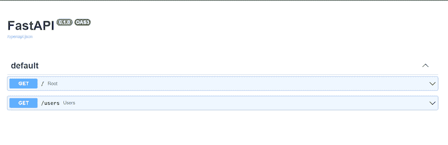
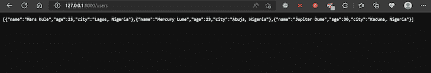
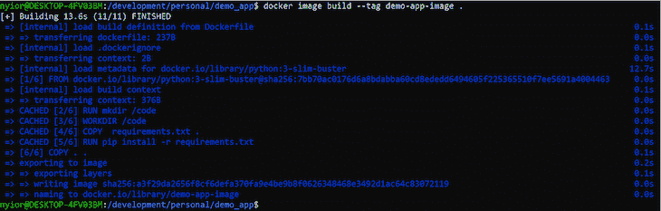
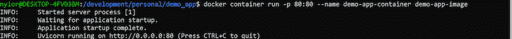

# 在 Docker 容器中使用 FastAPI

> 原文：<https://blog.logrocket.com/using-fastapi-inside-docker-containers/>

FastAPI 是一个基于标准 Python 类型提示的 web 框架，用于构建 Python 3.6 以上版本的 API。让 FastAPI 脱颖而出的是它对现代 Python、高性能和易用性的关注。但是，您可能想知道 Docker 容器是如何进入 FastAPI 对话的。

假设您正在构建一个 REST API，并且需要使用 PostgreSQL、Redis、Celery、RabbitMQ 和一系列其他依赖项。您遇到的第一个问题是在您的机器上配置所有这些依赖项。这个设置过程可能会很麻烦，但是，还有一个更紧迫的问题。

如果您在 Linux 上开发，而您的同事在 Windows 上开发，该怎么办？你必须记住，一些在 Linux 上运行良好的依赖项在 Windows 上并不运行良好。即使您设法通过了开发阶段，如果您的开发环境与您的部署环境不一致怎么办？所有这些问题归结到一点，便携性。

为了使您的项目更具可移植性，您可以在安装了项目代码和所有依赖项的隔离环境中进行开发，这正是 Docker containers 所做的。

Docker 不是 FastAPI 独有的；无论使用什么语言或框架，我们都可以使用 Docker 来容器化大多数项目。在本文中，我们将学习如何用 Docker 封装 FastAPI 应用程序。

## 先决条件

*   熟悉 Python 和 FastAPI 的基础知识
*   熟悉 Docker 的基础知识
*   python≥3.7 版
*   Python [Pip](https://pypi.org/project/pip/) ，包管理器
*   安装在您机器上的 Docker

## 目录

## 设置我们的开发环境

让我们创建一个基本的 FastAPI 应用程序，它有一个返回用户列表的端点。

要创建虚拟环境，请在 Unix 和 macOS 上运行`python3 -m venv env-name`或在 Windows 上运行`python -m venv env-name`。将`env-name`替换为您为虚拟环境选择的名称。

要激活虚拟环境，在 Unix 和 macOS 上运行`source env-name/bin/activate`或在 Windows 上运行`.\\env-name\\Scripts\\activate`。

在您想要启动项目的目录中，运行`mkdir demo_app`，这将在该目录中创建一个名为`demo_app`的新文件夹:

*   运行`cd demo_app`
*   运行`pip install fastapi[all]`
*   运行`pip freeze > requirements.txt`在`demo_app`文件夹中创建一个需求文件，包含所有已安装的依赖项

## 添加 Python 代码

在您选择的 IDE 中启动`demo_app`文件夹。创建一个名为`demo_app/\[main.py\](<[http://main.py&gt](http://main.py&gt);)`的文件，并将下面的代码片段添加到`main.py`文件中:

```
from fastapi import FastAPI

app = FastAPI()

@app.get("/")
async def root():
    return {"message": "Hello World"}

@app.get("/users")
async def users():
    users = [
        {
            "name": "Mars Kule",
            "age": 25,
            "city": "Lagos, Nigeria"
        },

        {
            "name": "Mercury Lume",
            "age": 23,
            "city": "Abuja, Nigeria"
        },

         {
            "name": "Jupiter Dume",
            "age": 30,
            "city": "Kaduna, Nigeria"
        }
    ]

    return users

```

我们创建了两个端点，一个返回“Hello，World！”第二个是`/users`，返回一个虚拟用户列表。接下来，运行`uvicorn main:app --reload`启动您的 FastAPI 应用程序。

将浏览器指向`[http://127.0.0.1:8000](<[http://127.0.0.1:8000/&gt](http://127.0.0.1:8000/&gt);)/docs`。您应该会看到我们刚刚添加的两个端点:



要测试端点，请将浏览器指向`\[http://127.0.0.1:8000\](<[http://127.0.0.1:8000/&gt](http://127.0.0.1:8000/&gt);)/users`。它应该返回用户的虚拟列表，如下图所示:



现在，[我们有了一个基本的 FastAPI 应用程序](https://blog.logrocket.com/building-a-graphql-server-with-fastapi/)，但是为了改善开发体验，我们可以消除创建虚拟环境和手动安装项目依赖项的需要。这种优化将处理安装哪些依赖项，在哪里安装，以及在将我们的项目移植到其他平台时如何安装。让我们来学习如何使用 Docker 实现这一点。

## 归档我们的 FastAPI 应用程序

通过在 Docker 容器中运行项目，我们可以消除创建虚拟环境和手动安装项目依赖项的需要。

## 码头集装箱

你可以把 Docker 容器想象成一台运行在另一台计算机上的小型计算机。本质上，Docker 容器只是某台机器上的一个隔离环境，其中包含项目的代码及其依赖项。

当我们将 FastAPI 应用程序容器化或停靠化时，我们实际上是在创建一个轻量级的虚拟盒子，其中安装了项目的依赖项，并配置了 FastAPI 代码来运行。因此，任何拥有我们的虚拟机器的人都可以运行我们的应用程序，而不必处理低级别的项目配置逻辑。

最重要的是，我们可以简单地将这个虚拟盒子上传到我们的登台或生产服务器，使我们的应用程序上线，而不必添加大量的配置。

## Docker 图像

在我们的例子中，我们与其他人共享或部署到我们的服务器上的不是容器或虚拟盒子本身，而是创建容器的手册。你可能已经知道这本手册的 Docker 图像。

Docker 图像包含构建容器的分步说明。在构建步骤中，容器从图像旋转而来。但是，为了[创建 Docker 映像](https://blog.logrocket.com/node-js-docker-improve-dx-docker-compose/#dockerize-app-docker-multi-stage-build)，我们首先需要编写一个 Docker 文件。

要容器化我们的 FastAPI 应用程序，我们需要遵循三个步骤:

1.  写一个文档
2.  从我们的 Docker 文件构建 Docker 图像
3.  从我们构建的 Docker 映像中旋转出一个容器

让我们进一步探索每一步。

## 写我们的文档

创建一个`demo_app/Dockerfile`文件，并添加下面的代码片段:

```
FROM python:3-slim-buster

RUN mkdir /code

WORKDIR /code

COPY requirements.txt .

RUN pip install -r requirements.txt

COPY . .

CMD ["uvicorn", "main:app", "--host=0.0.0.0", "--port=80"]

```

我们用一组指令填充 Docker 文件，Docker 守护进程在发出命令时将按照时间顺序构建我们的映像。

当您安装 Docker 时，它会自动安装 Docker 客户端，该客户端在您的终端和 Docker 守护进程中接受 Docker 命令。可以把 Docker 守护进程看作是 Docker 的后端，它是处理 Docker 客户端收到的命令的主要实体。

让我们弄清楚上面 docker 文件中的每个命令是什么意思。`FROM`指令将官方 Python 镜像设置为基础。它指示 Docker 守护进程在现有映像的基础上构建我们的映像。Docker 采用这种分层方法来增强可重用性。

`RUN mkdir /code`在构建时在映像中创建一个`code`目录，并最终在创建时创建容器。

* * *

### 更多来自 LogRocket 的精彩文章:

* * *

`WORKDIR`指令将默认工作目录设置为新创建的`/code`目录。该工作目录将适用于任何后续的`COPY`、`ADD`、`RUN`和`CMD`指令。

第一条`COPY`指令将`requirements.txt`文件添加到当前工作目录。`RUN`指令执行`pip install -r requirements.txt`命令。这个命令将在我们的容器中安装需求文件中列出的依赖项。

第二条`COPY`指令将主机文件系统的当前目录`.`中的剩余内容复制到映像中的工作目录`.`，最终复制到容器中。最后，`CMD`指令设置运行发布在`port 8080`上的应用服务器的命令。

## 从我们的 Docker 文件构建 Docker 映像

在终端中转到您的`demo_app`目录，然后运行以下命令:

```
docker image build --tag demo-app-image .

```

为了构建我们的映像，Docker 守护进程需要一些信息。首先，它需要使用`Dockerfile`的名称。如果没有通过，Docker 会在工作目录中查找名为`Dockerfile`的文件。如果您将文件命名为除了`Dockerfile`之外的任何名称，那么您必须使用`--file`选项来传递文件名:

```
docker image build --file custom-docker-file-name --tag demo-app-image

```

Docker 还需要构建上下文。构建上下文是 Docker 在构建过程中可以访问的目录。在我们的例子中，我们用`.`指定当前工作目录作为构建上下文。

如果映像构建成功，您应该会得到类似下图的输出:



此时，您的机器上应该有一个名为`demo-app-image`的图像。您可以运行`docker image ls`命令来查看您已经创建或从注册表中提取到本地机器的所有图像的列表。

## 从我们的 Docker 映像运行容器

运行下面的命令从我们的`demo-app-image`开始旋转容器:

```
docker container run --publish 80:80 --name demo-app-container demo-app-image

```

`--name`选项基于`demo-app-image`创建一个名为`demo-app-container`的容器。`--publish`选项将来自本地机器上`port 8080`的请求转发给容器中的`port 8080`。

如果该命令有效，您应该在终端中获得以下输出:



您可以将浏览器指向`[http://localhost:80/docs]([http://localhost/docs](http://localhost/docs))`来访问文档页面。您还可以测试`/users`端点。就是这样！

## 后续步骤

Docker 容器使我们的项目更易于移植。请记住，我们与其他人共享或推到我们的部署环境中的不是容器本身，而是图像。通常，我们通过将图像发布到像 [Docker Hub](https://hub.docker.com/) 这样的公共注册表来共享图像。

然而，我们并不总是希望我们的图像公开。在这种情况下，我们可以将 other 文件与项目代码一起推送，并让团队的其他成员构建映像并在他们那端运行容器。

## 结论

在本文中，我们学习了如何简化 FastAPI 项目的本地设置，或者使用 Docker 容器部署到一个临时或生产环境。

从根本上说，Docker 容器创建了一个类似虚拟盒子的隔离环境，将我们的应用程序代码与其依赖项捆绑在一起。因此，在任何地方部署我们的应用程序都更加容易，而不必担心特定于平台的不一致性。

要用 Docker 封装 FastAPI 应用程序或任何应用程序，首先，我们需要向项目添加一个 Docker 文件，从 Docker 文件构建一个映像，并从映像运行一个容器。虽然 Docker 是最流行的集装箱化技术，但它不是唯一的。

## 使用 [LogRocket](https://lp.logrocket.com/blg/signup) 消除传统错误报告的干扰

[](https://lp.logrocket.com/blg/signup)

[LogRocket](https://lp.logrocket.com/blg/signup) 是一个数字体验分析解决方案，它可以保护您免受数百个假阳性错误警报的影响，只针对几个真正重要的项目。LogRocket 会告诉您应用程序中实际影响用户的最具影响力的 bug 和 UX 问题。

然后，使用具有深层技术遥测的会话重放来确切地查看用户看到了什么以及是什么导致了问题，就像你在他们身后看一样。

LogRocket 自动聚合客户端错误、JS 异常、前端性能指标和用户交互。然后 LogRocket 使用机器学习来告诉你哪些问题正在影响大多数用户，并提供你需要修复它的上下文。

关注重要的 bug—[今天就试试 LogRocket】。](https://lp.logrocket.com/blg/signup-issue-free)