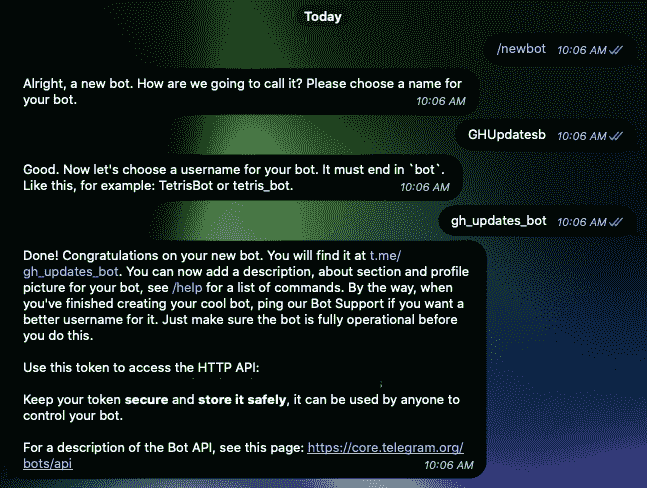
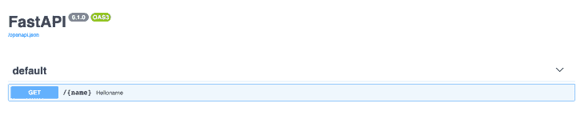
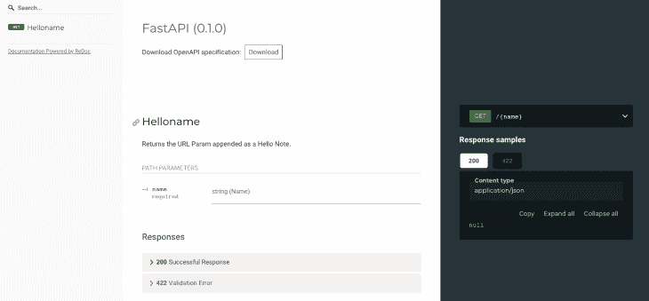
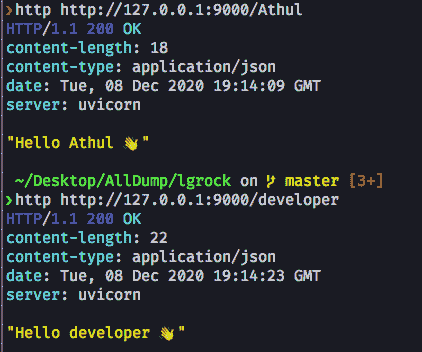
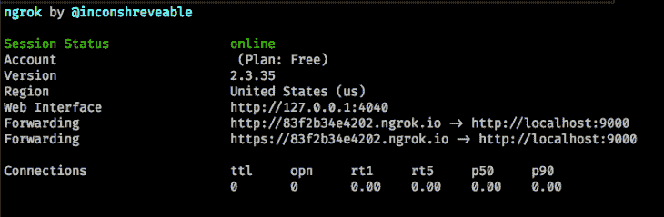
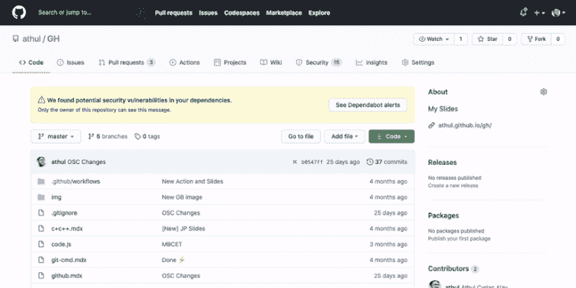

# 使用 FastAPI 从 GitHub 获取 Telegram 的更新

> 原文：<https://blog.logrocket.com/using-fastapi-to-get-updates-from-github-to-telegram/>

无论你是一名初露头角的开发人员还是一名经验丰富的软件工程师，你都可能使用过 [GitHub](https://github.com) ，这是一个平台，人们可以在这个平台上托管他们项目的源代码，为其他开发人员的其他项目做出贡献，并开发开源软件。

实际上，GitHub 已经成为事实上的平台，在这里你可以找到各种各样的开源软件和相关项目。它有大量的功能和一个开放的 API，用于开发将连接到 GitHub 的应用程序。

[Telegram](https://telegram.org/) 是一个快速可扩展的消息平台，它的一大优势是聊天机器人。聊天机器人易于编程，具有简单的 HTTP API，并且易于管理。而且，大多数语言都有包装器来使用 Telegram 的 Bot API。

在本文中，我们将创建一个电报机器人，它使用 Python 和 GitHub webhooks 从 GitHub 存储库中获取更新。我们将在服务器端使用 FastAPI，在发送消息时使用 Telegram 的 HTTP API。

## 要求

*   [Python](https://www.python.org/downloads/) 安装在你的机器上以便创建服务器。
*   一份[电报](https://telegram.org/)记述
*   一个电报机器人，我们将在接下来的章节中讨论它。

## 设置 Python 开发环境

在我们开始之前，我们将创建一个 [Python 虚拟环境](https://docs.python.org/3/tutorial/venv.html)来进行一个干净的设置。

这些是我们构建项目所需的包:

*   [FastAPI](https://fastapi.tiangolo.com) 作为后端框架
*   [HTTPX](https://www.python-httpx.org) 用于与电报 API 通信的异步 HTTP 请求。
*   服务器的[uv icon](https://www.uvicorn.org/)
*   通过隧道连接我们的本地服务器

准备好了吗？让我们从设置环境开始。我们将把所有代码写在一个`main.py`文件中:

```
$ mkdir fastapi-tg
$ cd fastapi-tg
$ python3 -m venv venv
$ source venv/bin/activate # For Linux and Mac
$ venv\Scripts\activate # For Windows
(venv) $ pip install fastapi uvicorn pyngrok httpx

```

## 从电报获取 bot 凭证

为了让信息发送给我们并被我们接收，我们需要一些可编程的东西。这就是电报机器人的用武之地。机器人是电报信息平台的可编程聊天机器人。

电报机器人将有一个`BOT_TOKEN`，这是机器人的唯一标识符。要为 Telegram 创建一个机器人，我们需要获得`BOT_TOKEN`。为此，我们将通过电报与另一个机器人对话，[机器人父亲](https://t.me/BotFather)。

我们可以通过输入`/newbot`命令来创建一个新的机器人。我们还需要输入机器人的名称和显示名称。



完成这些步骤后，我们将收到`BOT_TOKEN`。一旦有了它，就在`terminal/cmd`中将它设置为环境变量，我们将在本节结束时完成。

现在，通过执行`/start`命令启动您的机器人。

一旦我们成功创建了一个电报机器人，下一步就是获得一个`CHAT_ID`，它是一个电报用户的唯一标识符，每个电报用户都有一个。

要获得`CHAT_ID`，在 Telegram 中打开与 [**Json Dump Bot**](https://t.me/JsonDumpBot) 的聊天对话。`/start`命令本身会给你一个文本形式的 JSON 对象。它看起来类似于这样:

```
{
  "update_id": 143931094,
  "message": {
    "message_id": 155844,
    "from": {
      "id": 123456789, //this is the Chat_ID of a telegram user
      "is_bot": false,
      "first_name": "<name>",
      "username": "<username>"
    },
    "chat": {
      "id": 123456789, //this is the Chat_ID of a telegram user
      "first_name": "<name>",
      "username": "<username>",
      "type": "private"
    },
    "date": 1575035172,
    "text": "/start",
    "entities": [
      {
        "offset": 0,
        "length": 6,
        "type": "bot_command"
      }
    ]
  }
}

```

我们可以从`id`键得到`CHAT_ID`。一旦我们有了`TOKEN`和`CHAT_ID`，我们需要将它们作为环境变量添加到我们的本地会话中。

在终端/命令提示符下，执行以下命令:

```
# for linux/mac
$ export TOKEN=<bot_token>
$ export CHAT_ID=<chat_id>

# for windows
$ set TOKEN=<bot_token>
$ set CHAT_ID=<chat_id>

```

一旦您加载了环境变量，让我们编写我们的服务器

## 用 fastagi 创建服务器

我们将以“你好，世界”开始带有 FastAPI 的端点。FastAPI 是一个相对较新的 Python web 框架，在过去的几个月里广受欢迎。

它支持异步操作，并基于 [Python 类型提示](https://docs.python.org/3/library/typing.html)和 [OpenAPI](https://github.com/OAI/OpenAPI-Specification) ，这是 API 的一个规范。我们还在`/docs`和`/redoc`端点获取文档。

让我们创建一个简单的“Hello World”端点，它返回一个作为 url 参数传递的`name`:

```
# main.py

from fastapi import FastAPI

app = FastAPI()

@app.get("/{name}")
async def helloname(name:str):
    """
    Returns a Hello to the User with a wave emoji
    """
    return f"Hello {name} 👋"

```

注意，这是一个带有 FastAPI 的简单的“Hello World”应用程序。这里，我们将端点指定为`/`。这个端点有一个 URL 参数，我们将其指定为`name`。

为了运行服务器，我们将使用 ASGI(异步服务器网关接口)服务器。

在终端中执行以下命令来启动服务器:

```
$ uvicorn main:app --reload --port 9000

```

这将在`port 9000`启动我们的 FastAPI 服务器。如果我们导航到`[http://localhost:9000/docs](http://localhost:9000/docs)`，我们可以找到由 [Swagger](https://swagger.io/) 自动生成的交互文档。



如果我们导航到`[http://localhost:9000/redoc](http://localhost:9000/redoc)`，我们将看到更多使用 redoc 自动生成的文档。



如果我们尝试用 [curl](https://curl.se/) 或 [Httpie](https://httpie.io) 获取端点，结果将是这样:



现在，让我们编写接收 webhooks 和发送消息的服务器。我们的服务器将执行以下任务:

*   从 GitHub 接收 webhooks
*   处理 webhook 负载并转换为消息
*   通过电报将消息发送给用户

## 从 GitHub 接收 webhooks

Webhooks 是一个服务器在一个动作发生时发送给另一个应用程序的有效载荷和信息。通常 webhook 的有效载荷是 JSON 格式的。

如果存储库中发生了某个动作，GitHub 会向指定的 URL 发送一个 webhook。我们将编写我们的服务器来接收这些 webhooks 并处理它们，然后在接下来的部分中为服务器添加更多的功能。

为了简单起见，我们将只处理`star`和`pull_request` GitHub 事件。当存储库被启动时会触发`star`事件，当打开或关闭一个拉请求时会触发`pull_request`事件。你可以在这里阅读更多关于 [GitHub 拉请求的信息](https://docs.github.com/en/free-pro-team@latest/developers/webhooks-and-events/webhook-events-and-payloads#pull_request)。

```
# main.py
from fastapi import FastAPI,Request
import os

app=FastAPI()

TOKEN = os.getenv("TOKEN")  # Telegram Bot API Key
CHAT_ID = os.getenv("CHAT_ID")  # Telegram Chat ID

async def sendTgMessage():
# TODO

@app.post("/hook")
async def recWebHook(req: Request):
    """
    Receive the Webhook and process the Webhook Payload to get relevant data
    Refer https://developer.github.com/webhooks/event-payloads for all GitHub Webhook Events and Payloads
    """
    body = await req.json()
    event = req.headers.get("X-Github-Event")
    if event == "star":  # check if the event is a star
        nos_stars = body\["repository"\]["stargazers_count"]
        starrer_username = body\["sender"\]["login"]
        repo_url = body\["repository"\]["html_url"]
        repo_name = body\["repository"\]["name"]
        message = f"{starrer_username} has starred the \[{repo_name}\]({repo_url}). \n\n The Total Stars are {nos_stars}"
        await sendTgMessage(message)
    elif event == "pull_request":  # check if event is a pull request
        pr_number = body["number"]
        if body\["pull_request"\]["merged"] == True:
            pr_action = "merged"
        pr_action = body["action"]
        pr_title = body\["pull_request"\]["title"]
        pr_desc = body\["pull_request"\]["body"]
        pr_login = body\["sender"\]["login"]
        pr_login_url = body\["sender"\]["html_url"]
        pr_url = body\["pull_request"\]["html_url"]
        message = f"Pull Request(\[{pr_number}\]({pr_url})) {pr_action} by \[{pr_login}\]({pr_login_url}).\n\n Title: *{pr_title}* \n\n Description: **{pr_desc}**"
        await sendTgMessage(message)

```

在这段代码中，我们编写了`/hook`端点来接收来自 GitHub 的 webhook，并将 web hook 处理成将通过 Telegram 发送的消息。然后，我们将使用 FastAPI 的`Request`类接收 webhook 有效负载及其头部。

首先，我们将检查动作是什么。如果是 star 或 pull 请求事件，我们将为该特定事件生成消息。我们从 JSON 主体中获得所需的数据。JSON 被解析为 Python 字典，所以我们将使用字典键作为索引，并获取这些键的值。你也可以使用字典的`[get()](https://www.programiz.com/python-programming/methods/dictionary/get)`方法来做同样的事情。

对于 star 事件，我们接收当前的星数、为存储库加星的人的 GitHub 用户名和存储库的 URL。对于拉请求，我们还将获取拉请求的标题和主体，并检查拉请求是否被合并。

通过这种方式，我们可以扩展到许多其他事件，如问题和评论，几乎所有的事件都是类似的模式。现在，我们将编写`sendTgMessage()`方法来将生成的图像发送到 telegram。

### 向电报发送信息

Telegram 有一个强大的 bot API。它有大量的包装器，但是在这篇博文中，我们将使用 HTTP API 通过上面创建的 bot 异步发送消息。

```
# main.py
import httpx

async def sendTgMessage(message:str):
    """
    Sends the Message to telegram with the Telegram BOT API
    """
    tg_msg = {"chat_id": CHAT_ID, "text": message, "parse_mode": "Markdown"}
    API_URL = f"https://api.telegram.org/bot{TOKEN}/sendMessage"
    async with httpx.AsyncClient() as client:
        await client.post(API_URL, json=tg_msg)

```

这里我们有一个函数，它将消息作为参数。Telegram 非常支持消息中的 Markdown 和 HTML 格式。让我们在这里使用降价格式选项。你可以在这里阅读更多关于电报信息的[格式选项。](https://core.telegram.org/bots/api#formatting-options)

Telegram Bot API 需要 JSON 形式的数据作为对`sendMessage`端点的`POST`请求的主体。JSON 主体需要以下键来发送消息:

*   `CHAT_ID`键是用户的聊天 ID，机器人应该在那里发送消息
*   `text`键表示消息应该是什么
*   `parse_mode`是消息的格式选项
*   你可以在[文档](https://core.telegram.org/bots/api#sendmessage)中读到关于`sendMessage` API 方法的其他键。

我们使用 Python 字典作为`POST`请求体，并用 [httpx](https://www.python-httpx.org/) 发送请求。Httpx 是一个异步 HTTP 库，具有类似于 Python 请求库的 API。

一旦消息被发送，无论消息是否被发送，我们都会收到一个 JSON 响应。

## 运行和测试服务器

让我们运行我们的服务器。以下是完整的源代码:

```
# main.py
from fastapi import FastAPI, Request
import os
import httpx

app = FastAPI()

TOKEN = os.getenv("TOKEN")  # Telegram Bot API Key
CHAT_ID = os.getenv("CHAT_ID")  # Telegram Chat ID

async def sendTgMessage(message: str):
    """
    Sends the Message to telegram with the Telegram BOT API
    """
    print(message)
    tg_msg = {"chat_id": CHAT_ID, "text": message, "parse_mode": "Markdown"}
    API_URL = f"https://api.telegram.org/bot{TOKEN}/sendMessage"
    async with httpx.AsyncClient() as client:
        await client.post(API_URL, json=tg_msg)

@app.post("/hook")
async def recWebHook(req: Request):
    """
    Receive the Webhook and process the Webhook Payload to get relevant data
    Refer https://developer.github.com/webhooks/event-payloads for all GitHub Webhook Events and Payloads
    """
    body = await req.json()
    print(body)
    event = req.headers.get("X-Github-Event")
    if event == "star":  # check if the event is a star
        nos_stars = body\["repository"\]["stargazers_count"]
        starrer_username = body\["sender"\]["login"]
        repo_url = body\["repository"\]["html_url"]
        repo_name = body\["repository"\]["name"]
        message = f"{starrer_username} has starred the \[{repo_name}\]({repo_url}). \n\n The Total Stars are {nos_stars}"
        await sendTgMessage(message)
    elif event == "pull_request":  # check if event is a pull request
        pr_number = body["number"]
        if body\["pull_request"\]["merged"] == True:
            pr_action = "merged"
        pr_action = body["action"]
        pr_title = body\["pull_request"\]["title"]
        pr_desc = body\["pull_request"\]["body"]
        pr_login = body\["sender"\]["login"]
        pr_login_url = body\["sender"\]["html_url"]
        pr_url = body\["pull_request"\]["html_url"]
        message = f"Pull Request(\[{pr_number}\]({pr_url})) {pr_action} by \[{pr_login}\]({pr_login_url}).\n\n Title: {pr_title} \n\n Description: {pr_desc}"
        await sendTgMessage(message)

```

要运行我们的服务器，请在命令行/终端中执行以下命令。确保您在虚拟环境中:

```
$ uvicorn main:app --reload --port 9000

```

这将在端口 9000 上打开我们的服务器。为了从 GitHub 接收数据到我们的本地服务器，我们必须将我们的本地服务器暴露给互联网，这就是 [ngrok](https://ngrok.com/) 的用武之地。我们已经用 pip 安装了 [Pyngrok](https://pypi.org/project/pyngrok/) 。Pyngrok 是 ngrok 的 Python 包装器，有自己的二进制文件用于分发。

为了隧道我们的服务器，我们需要让我们的服务器运行。打开另一个终端/命令行窗口或选项卡，并激活虚拟环境。然后执行以下命令:

```
$ ngrok http 9000

```

您应该会看到类似如下的输出:



将会有两个 URL 暴露我们的本地服务器。我们只需要带有前缀`https`或第二个 URL 的那个。

下一步是告诉 GitHub 将 webhooks 发送到这个 URL。

### 连接到 GitHub

要将我们的服务器连接到 GitHub，我们需要一个存储库。这可以是新的存储库，也可以是现有的存储库。如果您想要创建新的存储库，请导航到 [https://github.new](https://github.new) 来创建新的存储库。

要设置 webhooks，请转到您的存储库中的**设置**选项卡，并选择 **webhooks 部分**。按下`Add Webhook`按钮添加一个新的网页挂钩。然后你会被要求输入你的 GitHub 密码。

一旦完成，添加我们从 ngrok 收到的 URL(不要忘记添加`/hook`作为 URL 的后缀)，因为这是我们接收 webhooks 的端点。将`content-type`改为`application/json`。然后，选择您想要获取的 webhook 事件。在我们的例子中，我们需要`star`和`pull_request`事件。最后，保存这些更改。

这里有一个简短的视频。



为了确保我们的机器人正在工作，启动存储库。如果一切正常，我们将从我们创建的机器人那里收到一条发往指定`CHAT_ID`的电报消息。下面是一个示例消息。


恭喜你！我们的服务器正在工作并向 Telegram 发送消息。多酷啊。

您可以扩展 webhook 处理来获得关于问题、评论、推送等的详细信息。GitHub 文档中很好地记录了所有的 webhook 事件。此外，电报机器人 API 文档是一个很好的参考。

你可以在 [GitHub](https://github.com/athul/Telegram-GH-Webhooks) 找到完整的源代码。

## 使用 GitHub 和 Telegram 的后续步骤

当然，您可以进一步扩展这个项目，以获得关于问题、新的推送和拉取请求审查以及任何其他 GitHub webhook 事件的信息。但是要确保在 GitHub webhook 设置中更改您需要的事件。

您还可以使用 bot 向**频道/组**发送消息——只需将 bot 添加到频道/组，并用[频道/组 ID](https://gist.github.com/mraaroncruz/e76d19f7d61d59419002db54030ebe35) 更改`CHAT_ID`环境变量。

## 结论

我们已经学习了如何用 FastAPI 和 Python 制作 REST API，创建 Telegram Bot，以及用 ngrok 将本地服务器连接到 GitHub。感谢阅读！