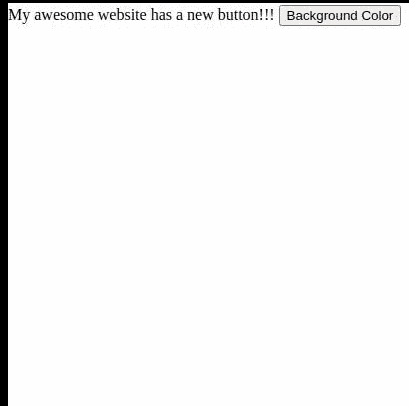
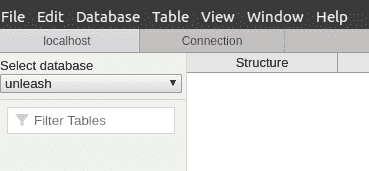
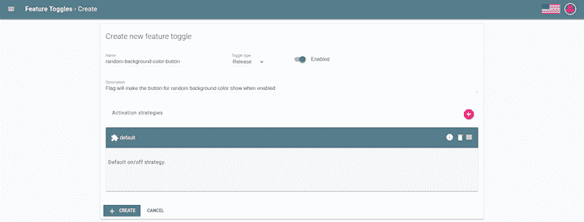
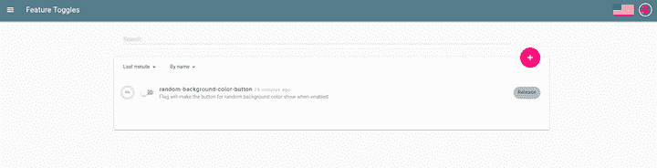
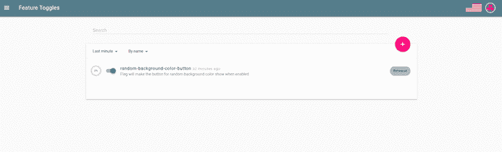
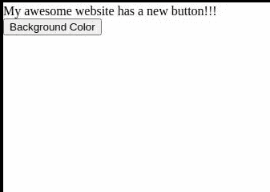

# 在 Unleash 和 Node.js - LogRocket 博客中使用特性标志

> 原文：<https://blog.logrocket.com/using-feature-flags-with-unleash-and-node-js/>

## 什么是功能标志？

在编程中，标志是一个变量，它使程序根据其值执行路径。

看看下面的例子:

```
if (flag === true) {
  // feature 1
} else {
  // feature 2
}

```

标志通常是在服务器启动时调用的环境变量，用于在开发和生产环境之间设置日志的详细级别、建立应用程序的默认语言等。要切换这些变量，您需要在文件或数据库中进行更改，并重启服务器，以便应用新的设置。

特征标志是一个变量，你可以在任何时候切换，这种变化将反映在程序中，而不需要重新启动它。

## 何时使用功能标志

想象一下:你刚刚在你的网站上推出了一个新功能——一个将背景改变为随机颜色的按钮。您已经测试并安装了它，您迫不及待地想让您的用户体验它。

一段时间后，用户与该功能交互，并发现文本颜色而不是背景被改变。灾难来了，现在你必须恢复功能，直到它被修复。这通常会导致紧急重启以应用代码并删除特性，然后再重启一次以应用修复。

理想情况下，只有在添加新功能或修复程序时才会重启，最好不要着急。这就是特性标志派上用场的地方。功能标志使您能够动态禁用有问题的功能，省去了恢复功能并重新启动以删除它的步骤。

## 功能标志如何工作

为了展示功能标志的作用，我们将使用前面提到的例子:一个有错误按钮的网站切换了文本颜色而不是背景颜色。

### 项目结构

```
src/
  |-public // folder with the content that we will feed to the browser
    |-js
      new-feature.js
    index.html    
  package.json
  server.js // our Node.js server

```

#### `package.json`

```
{
  "name": "feature-flags-101",
  "version": "1.0.0",
  "description": "Setup of feature flags with unleash",
  "main": "server.js",
  "scripts": {
    "start": "node server.js",
    "server-debug": "nodemon --inspect server.js"
  },
  "author": "daspinola",
  "license": "MIT",
  "devDependencies": {
    "nodemon": "2.0.4"
  },
  "dependencies": {
    "express": "^4.17.1"
  }
}

```

#### `server.js`

```
const express = require('express')
const path = require('path')
const app = express()

app.use(express.static(path.join(__dirname, 'public')))

app.get('/', function(req, res) {
  res.sendFile(path.join(__dirname, 'public/index.html'))
})

app.listen(7000, function () {
  console.log(`Listening on port ${7000}!`)
})

```

#### `public` / `index.html`

```
<html>
  <head>
    <title>Feature flags 101</title>
  </head>
  <body>
    <div>
      <span id="span-welcome-text">My awesome website has a new button!!!</span>
      <button id="button-switch-background-color">Background Color</button>
    </div>
    <script src="/js/new-feature.js"></script>
  </body>
</html>

```

#### `public` / `js` / `new-feature`

```
document.addEventListener('DOMContentLoaded', init, false);

function init() {
  const buttonSwitchColor = document.getElementById('button-switch-background-color')

  buttonSwitchColor.addEventListener('click', () => {
    const body = document.querySelector('body')
    body.style.color = getRandomColor()
  })

  // Code from: https://stackoverflow.com/questions/1484506/random-color-generator
  function getRandomColor() {
    var letters = '0123456789ABCDEF'
    var color = '#'
    for (var i = 0; i < 6; i++) {
      color += letters[Math.floor(Math.random() * 16)]
    }
    return color
  }
}

```

在`package.json`中有 [nodemon](https://www.npmjs.com/package/nodemon) ，所以你可以让服务器在你做任何改变时执行重启，并快速设置 HTTP 服务器，这在`server.js`中已经有了。

`index.html`包含有故障按钮的网站。`new-feature.js`是定义变色功能的地方。



## 将特征标志与释放一起使用

现在我们已经建立了一个有问题的网站，让我们看看同样有问题的功能是如何被引入到功能标志下的。

[Unleash](https://unleash.github.io/) 是一个功能切换系统，使您能够创建一个可以轻松打开和关闭标志的 UI。

### 设置释放

要设置“释放”,我们需要三样东西:

1.  Postgres，这是 Unleash 保存特性标志状态的地方
2.  unleash-server，它提供了一个 UI 和端点来查询标志的状态
3.  unleash-client-node，一个连接到 unleash 服务器并了解标志状态的库

拥有 Postgres 的一种方法是用 Docker 执行它。

```
docker run --name unleash-postgres -e POSTGRES_PASSWORD=pass -d -p 5432:5432 postgres

```

一旦它开始运行，你就可以用 Postbird 连接它并创建“释放”数据库。



现在是时候安装 unleash-server 了，运行`npm i unleash-server`并在项目中创建一个新文件。

#### `unleash-server.js`

```
const unleash = require('unleash-server');

unleash
  .start({
    databaseUrl: 'postgres://postgres:[email protected]:5432/unleash',
    port: 4242,
  })
  .then(unleash => {
    console.log(
      `Unleash started on http://localhost:${unleash.app.get('port')}`,
    );
  });

```

#### `package.json`

```
{
  "name": "feature-flags-101",
  "version": "1.0.0",
  "description": "Setup of feature flags with unleash",
  "main": "server.js",
  "scripts": {
    "start": "node server.js",
    "server-debug": "nodemon --inspect server.js",
    "unleash-server": "node unleash-server.js"
  },
  "author": "daspinola",
  "license": "MIT",
  "devDependencies": {
    "nodemon": "2.0.4"
  },
  "dependencies": {
    "express": "^4.17.1",
    "unleash-server": "^3.5.4"
  }
}

```

通过在浏览器上执行命令`npm run unleash-server`，在`localhost:4242`上现在应该有一个 UI。


现在让我们为将要开发的特性创建一个。例如:



Postgres 就绪，unleash-server 运行后，您现在可以连接到服务器，使用`npm install unleash-client`检查特性标志的状态，并像这样更改服务器:

#### `server.js`

```
const express = require('express')
const path = require('path')

// The unleash client makes requests every 10 seconds or so for updates on the status of the flags so there is no need to restart the server if they change
const { initialize, isEnabled } = require('unleash-client');
const instance = initialize({
    url: 'http://localhost:4242/api/',
    appName: 'feature-flags',
    instanceId: 'feature-flags-101',
});

const app = express()
app.use(express.static(path.join(__dirname, 'public')))

app.get('/', function(req, res) {
  res.sendFile(path.join(__dirname, 'public/index.html'))
})

// This is the endpoint we're going to call in our front end to check if a flag is available or not
app.get('/feature-flag/:name?', function(req, res) {
  const flagName = req.params.name
  res.send({
    flagName,
    isEnabled: isEnabled(flagName)
  })
})

// We add this way so our server only starts when the flags are available
instance.on('ready', () => {
  app.listen(7000, function () {
    console.log(`Listening on port ${7000}!`)
  })
})

```

#### `public` / `js` / `new-feature.js`

```
document.addEventListener('DOMContentLoaded', init, false);

async function init() {
  const body = document.querySelector('body')
  const spanWelcomeText = document.getElementById('span-welcome-text')
  const showNewButton = await fetch('/feature-flag/random-background-color-button')
    .then(response => response.json())

  if (showNewButton.isEnabled) {
    const newButton = document.createElement('button')

    newButton.id = 'button-switch-background-color'
    newButton.innerHTML = 'Background Color'
    newButton.addEventListener('click', () => {
      body.style.color = getRandomColor()
    })
    body.appendChild(newButton)

    spanWelcomeText.innerHTML = 'My awesome website has a new button!!!'

    // Taken from the useful reply in: https://stackoverflow.com/questions/1484506/random-color-generator
    function getRandomColor() {
      var letters = '0123456789ABCDEF'
      var color = '#'
      for (var i = 0; i < 6; i++) {
        color += letters[Math.floor(Math.random() * 16)]
      }
      return color
    }
  }
}

```

#### `public` / `index.html`

```
<html>
  <head>
    <title>Feature flags 101</title>
  </head>
  <body>
    <div>
      <span id="span-welcome-text">My awesome website will have a new button!!!</span>
    </div>
    <script src="/js/new-feature.js"></script>
  </body>
</html>

```

这段更新代码的主要思想是，只有当服务器回复说标志已启用时，才构建按钮。否则，UI 已经准备好向用户显示，而不是一个损坏的特性。

当客户端报告一个新特性被破坏时，应该打开释放 UI 并禁用该特性。10 秒钟后刷新页面，客户端将不再看到损坏的按钮




查看官方文档了解更多安装 Unleash 的方法。

如果您查看对用户禁用特性标志的问题，您最终会注意到`body.style.color = getRandomColor()`实际上应该是`body.style.backgroundColor = getRandomColor()`。

在修复、测试和重新部署功能之后，可以激活特性标志。





## 模式

拥有标志的额外好处是，您可以控制如何将更改传播到您的用户群。

“释放”中三种最有用的模式是:

*   `DefaultStrategy`，这和说“把这面旗帜适用于所有人”是一样的
*   `gradualRolloutSessionId`，显示您希望向一定比例的拥有活动会话的用户启用的功能
*   `gradualRolloutRandom`，当用户访问页面时随机激活。如果特性标志下的内容对用户不可见，这尤其有用，例如，API 中端点的新版本

您可以在[正式文档](https://github.com/Unleash/unleash/blob/master/docs/activation-strategies.md)中查看所有可用选项。

## 应该使用功能标志吗？

在我们结束之前，让我们分析一下在 Node.js 中使用特性标志的优缺点。

### 赞成的意见

*   不需要停止应用程序来回滚一个麻烦的特性
*   一旦设置好，特性标志很容易添加到项目中
*   使用特性标志，您可以在一个小组中测试一个特性并收集反馈

### 骗局

*   在一个特性被证明是稳定的之后，必须移除特性标志；您应该始终计划一个移除日期，这样项目就不会积累死代码或标志下的标志
*   如果设置不正确，功能标志可能会造成糟糕的用户体验。一个例子是，在一个中断字段的标志之前加载一个表单，导致用户填写不再需要的字段，几秒钟后这些字段就会消失
*   由于您可以随时触发新旧代码，因此有可能发布两倍多的代码，尤其是在部署现有功能的实验版本时

如果使用得当，特性标志可以消除许多与发布新的应用程序相关的压力。如果出现问题，您需要做的只是点击一个按钮，将事情恢复到原来的样子，并给自己时间以最短的停机时间来解决问题。

* * *

### 更多来自 LogRocket 的精彩文章:

* * *

如果您使用度量标准来比较旧特性和新特性，那么使用特性标志也可以带来很好的洞察力。举个例子，如果选择一个自定义的背景颜色让用户停留在页面上，你应该考虑在你的应用中保留这个特性。只是不要忘了过一段时间后把它去掉；没有人希望到处都是不必要的代码。

你可以在我的 [GitHub](https://github.com/daspinola/features-flags-101) 页面访问本教程中使用的所有代码。

## 200 只显示器出现故障，生产中网络请求缓慢

部署基于节点的 web 应用程序或网站是容易的部分。确保您的节点实例继续为您的应用程序提供资源是事情变得更加困难的地方。如果您对确保对后端或第三方服务的请求成功感兴趣，

[try LogRocket](https://lp.logrocket.com/blg/node-signup)

.

[](https://lp.logrocket.com/blg/node-signup)[https://logrocket.com/signup/](https://lp.logrocket.com/blg/node-signup)

LogRocket 就像是网络和移动应用程序的 DVR，记录下用户与你的应用程序交互时发生的一切。您可以汇总并报告有问题的网络请求，以快速了解根本原因，而不是猜测问题发生的原因。

LogRocket 检测您的应用程序以记录基线性能计时，如页面加载时间、到达第一个字节的时间、慢速网络请求，还记录 Redux、NgRx 和 Vuex 操作/状态。

[Start monitoring for free](https://lp.logrocket.com/blg/node-signup)

.