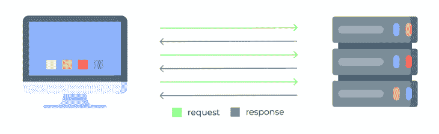
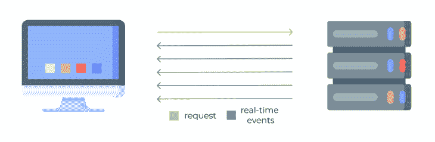
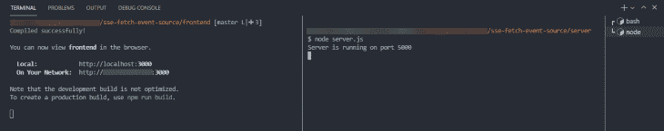
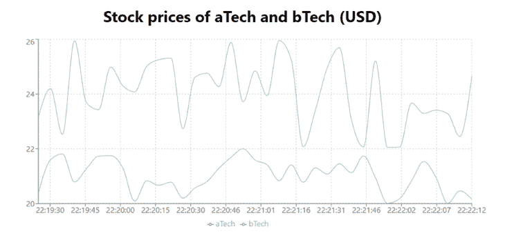
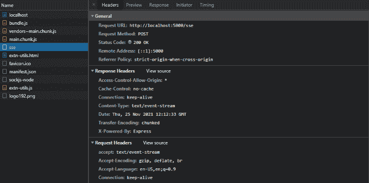
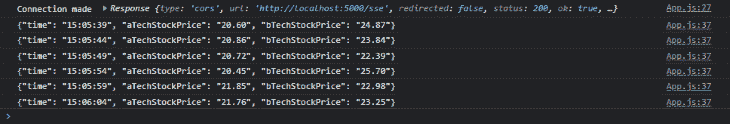
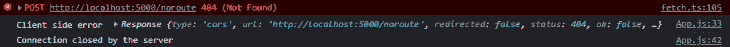

# 在 React - LogRocket 博客中为服务器发送的事件使用 Fetch 事件源

> 原文：<https://blog.logrocket.com/using-fetch-event-source-server-sent-events-react/>

任何全栈应用的关键部分是前端和后端之间的连接。通常，通信是由客户端向服务器发出请求，服务器发送回包含数据的响应来实现的。



这使用户能够决定何时接收数据，但是在某些特定情况下，传统的请求-响应方法可能不够用。

以实时内容的网络应用为例，比如实时比赛比分、股票价格或 Twitter 上的通知。在这些情况下，用户无法控制信息何时更新，因此不知道何时发出请求。然而，应用程序中显示的信息总是最新的。

所描述的功能是通过使用[服务器发送的事件](https://developer.mozilla.org/en-US/docs/Web/API/Server-sent_events)来实现的，这些事件帮助开发人员创建具有无缝用户体验的动态应用程序。

在本教程中，我们将通过关注由[微软](https://microsoft.com)和[贡献者](https://github.com/Azure/fetch-event-source/graphs/contributors)开发的专门设计的开源包 [Fetch Event Source](https://www.npmjs.com/package/@microsoft/fetch-event-source) 来探索服务器发送事件的工作原理，以帮助开发者增加对来自服务器的实时数据的控制。

## 什么是服务器发送的事件？

[服务器发送事件](https://developer.mozilla.org/en-US/docs/Web/API/Server-sent_events) (SSE)是通过[超文本传输协议](https://developer.mozilla.org/en-US/docs/Web/HTTP/Overview) (HTTP)从服务器发送到客户端的单向事件。事件一发生就由服务器推送，这意味着用户可以访问实时数据:



因为用户不能在发送事件时直接影响服务器发送的事件，所以所有必要的参数都需要在连接请求中发送，并在服务器上处理，这样服务器就知道用户需要访问哪些实时数据。

处理服务器发送事件的传统方式是使用 [EventSource API](https://developer.mozilla.org/en-US/docs/Web/API/EventSource) 接口，它包含在 HTML [WC3 规范](https://html.spec.whatwg.org/multipage/server-sent-events.html#the-eventsource-interface)中。它为创建与服务器的连接、接收服务器消息和显示错误提供了基础。

不幸的是， [EventSource API](https://developer.mozilla.org/en-US/docs/Web/API/EventSource) 是一个原始接口，有很多限制。接下来我们将回顾它们，并提供来自[获取事件源](https://www.npmjs.com/package/@microsoft/fetch-event-source)的替代解决方案，它允许对发出请求和获得响应进行更多的定制和控制。

## 为什么选择获取事件源？

顾名思义，获取事件源的主要优点是能够使用由[获取 API](https://developer.mozilla.org/en-US/docs/Web/API/Fetch_API) 提供的所有扩展特性。这意味着用户可以向服务器发送定制的请求方法、头，甚至带有特定参数的主体。相反，EventSource API 只允许发送`url`和`withCredentials`属性。

使用 Fetch 事件源时，开发人员还可以访问来自服务器的响应对象。如果用户希望对事件源进行一些验证，这可能会很有用。它还允许对错误和重试策略进行更多的控制，而 EventSource API 没有提供任何可靠的控制方法。

提取事件源还支持[页面可见性应用编程接口](https://developer.mozilla.org/en-US/docs/Web/API/Page_Visibility_API)，这意味着当浏览器窗口最小化时，服务器发送的事件将被停止，当它返回视口时，将自动恢复。这有助于减少服务器上的负载，这一点至关重要，尤其是当您在服务器上运行多个任务时。

为了测试 Fetch 事件源的特性，我们将创建一个实际的应用程序，该应用程序将在实时折线图中模拟股票价格的变化，在实践中展示所有描述的优点。

## 设置工作空间

我们的应用程序将由前端和后端组成，所以让我们为整个应用程序创建单独的工作区，以保持一切井然有序。

为此，打开终端并运行以下命令:`mkdir sse-fetch-event-source && cd sse-fetch-event-source && mkdir frontend server`。这将创建一个新文件夹`sse-fetch-event-source`，将当前工作目录指向它，并在其中创建文件夹`frontend`和`server`。

## 实现前端

首先，让我们创建一个简单的客户端应用程序，这样我们就可以有一个用户界面来显示我们从后端接收到的信息。

仍然在`sse-fetch-event-source`目录中，通过运行命令`cd frontend`将目录切换到`frontend`文件夹。

我们将使用 [Create React App](https://create-react-app.dev/) ，这是一个在一分钟或更短时间内创建一个全功能 [React](https://reactjs.org) 项目的实用程序。为此，运行以下命令: `npx create-react-app frontend`。

这将在我们的主工作区创建一个名为`frontend`的文件夹，包含所有的前端代码。

接下来，我们将设置 Fetch 事件源包和 [recharts](https://recharts.org/en-US/) 库，这将允许我们稍后显示数据。运行以下命令来安装这两者:

```
npm install @microsoft/fetch-event-source recharts

```

然后，在文件树中展开`frontend`并找到`src`目录。在里面，你会找到文件`App.js`。用以下代码替换其内容:

```
javascript
import { useState, useEffect } from "react";
import { fetchEventSource } from "@microsoft/fetch-event-source";
import {
  LineChart,
  Line,
  XAxis,
  YAxis,
  CartesianGrid,
  Tooltip,
  Legend,
} from "recharts";

const serverBaseURL = "http://localhost:5000";

const App = () => {
  const [data, setData] = useState([]);

  useEffect(() => {
    const fetchData = async () => {
      await fetchEventSource(`${serverBaseURL}/sse`, {
        method: "POST",
        headers: {
          Accept: "text/event-stream",
        },
        onopen(res) {
          if (res.ok && res.status === 200) {
            console.log("Connection made ", res);
          } else if (
            res.status >= 400 &&
            res.status < 500 &&
            res.status !== 429
          ) {
            console.log("Client side error ", res);
          }
        },
        onmessage(event) {
          console.log(event.data);
          const parsedData = JSON.parse(event.data);
          setData((data) => [...data, parsedData]);
        },
        onclose() {
          console.log("Connection closed by the server");
        },
        onerror(err) {
          console.log("There was an error from server", err);
        },
      });
    };
    fetchData();
  }, []);

  return (
    <div style={{ display: "grid", placeItems: "center" }}>
      <h1>Stock prices of aTech and bTech (USD)</h1>
      <LineChart width={1000} height={400} data={data}>
        <CartesianGrid strokeDasharray="3 3" />
        <XAxis dataKey="time" />
        <YAxis domain={[20, 26]} />
        <Tooltip />
        <Legend />
        <Line type="monotone" dataKey="aTechStockPrice" stroke="#8884d8" />
        <Line type="monotone" dataKey="bTechStockPrice" stroke="#82ca9d" />
      </LineChart>
    </div>
  );
};

export default App;
```

首先，我们导入了内置的 React 挂钩`useState`和`useEffect`。然后，我们导入了`fetchEventSource`库本身和必要的`recharts`组件，以便在一个漂亮的 UI 中显示接收到的数据。我们还为服务器路径创建了一个变量。

在`App`函数中，我们为数据创建了一个状态变量，并对服务器进行了一个`fetchEventSource`调用。我们包括了定制的调用方法(POST ),以及接受特定媒体类型的配置头值。

我们使用`onopen`、`onmessage`、`onclose`和`onerror`事件来控制基于服务器响应的应用行为。

最后，我们在 return 部分构建了一个简单的`recharts`折线图，它将呈现在屏幕上。注意，我们从`useState`传入了`data`，这意味着每次`data`值更新时，折线图都会更新。

确保保留`console.log`语句，因为它们将通过在浏览器中向开发人员控制台提供数据来帮助我们稍后测试应用程序。

## 实现服务器端

现在，我们将实现一个简单的 [Node.js](https://nodejs.org/en/) 服务器。为了简化服务器配置，我们将使用 [Express](https://expressjs.com/) ，这是一个快速的、极简的 Node web 框架。

如果您按照上一节的步骤设置了前端，那么您应该还在`frontend`目录中。要设置后端，切换到`backend`文件夹。你可以通过运行命令`cd ../server`来实现。

首先，使用命令 `npm init -y`初始化 [npm](https://www.npmjs.com/) 。这将创建一个包含所有默认入口点信息的简单的`package.json`文件。打开文件，将`main`值从`index.js`更改为`server.js`。

然后，通过运行命令`npm install express cors`安装 Express 框架和 [cors](https://www.npmjs.com/package/cors) 包。 [CORS](https://blog.logrocket.com/the-ultimate-guide-to-enabling-cross-origin-resource-sharing-cors/) (跨来源资源共享)将允许我们在应用程序的不同端口(前端和后端)之间发出请求。

接下来，我们需要创建一个文件来创建服务器。仍然在`server`目录中，运行下面的命令:`touch server.js`。

打开新创建的文件，并包含以下代码:

```
javascript
const express = require("express");
const cors = require("cors");

const app = express();
app.use(cors());

const PORT = 5000;

const getStockPrice = (range, base) =>
  (Math.random() * range + base).toFixed(2);
const getTime = () => new Date().toLocaleTimeString();

app.post("/sse", function (req, res) {
  res.writeHead(200, {
    Connection: "keep-alive",
    "Content-Type": "text/event-stream",
    "Cache-Control": "no-cache",
  });
  setInterval(() => {
    res.write(
      `data: {"time": "${getTime()}", "aTechStockPrice": "${getStockPrice(
        2, 20)}", "bTechStockPrice": "${getStockPrice(4, 22)}"}`
    );
    res.write("\n\n");
  }, 5000);
});

app.listen(PORT, function () {
  console.log(`Server is running on port ${PORT}`);
});
```

我们首先导入了 Express 和 [cors](https://www.npmjs.com/package/cors) ，并创建了一个新的服务器在端口`5000`上运行。我们使用 cors 作为中间件，允许我们从前端进行调用。

然后我们创建了几个定制函数，`getStockPrice`和`getTime`。第一个函数将为股票生成一个随机价格，接受基本价值和最高价值(范围)作为参数。第二个将以`hh:mm:ss`的格式返回当前时间。

我们让服务器监听`sse`路由上的`post`请求。在内部，我们通过定义`connection`和`content-type`，以及禁用`cache`，编写了一个响应头。最后，我们使用了一个`setInterval`每 5000ms (5 秒)生成一次新数据。

## 运行应用程序

因为我们的应用程序有前端和后端服务器，所以我们需要分别运行它们，这样我们就可以通过发送请求和接收服务器发送的事件在两者之间进行交互。

你当前的工作目录应该是`server`。启动服务器应该像运行命令`node server.js`一样简单。如果你做的一切都是正确的，它现在应该在终端中显示`Server is running on port 5000`。

要运行前端，打开另一个终端，通过`cd frontend`切换到`frontend`目录，运行`npm start`命令，将启动前端应用。

根据您使用的终端以及是否使用文本编辑器中的内置终端，并行运行后端和前端看起来会像这样:



启动前端后，您的默认浏览器应该会自动打开。如果没有，手动打开，在地址栏输入`[http://localhost:3000](http://localhost:3000)`，执行。它现在应该显示功能性全栈应用程序，使用服务器发送的事件实时接收所有数据:



## 测试 React 应用程序

现在，让我们测试 Fetch 事件源的特性。仍在浏览器上时，从浏览器设置或按键盘上的`F12`键打开开发人员控制台。

首先，打开**网络**标签，用键盘上的`F5`键刷新 app。“网络”选项卡允许用户查看发送到服务器的所有请求。

点击 **sse** 查看获取事件源连接请求。请注意，请求类型是 POST，我们能够为请求设置定制的头参数，比如 accept、type。这都要归功于获取事件源，而使用[事件源 API](https://developer.mozilla.org/en-US/docs/Web/API/EventSource) 是不可能的。



然后，导航到**控制台的**选项卡，由于我们在前端使用了`console.log`语句，在这里您应该可以看到额外的信息。

当用户尝试建立连接时，他们会收到一个响应对象(也是 Fetch 事件源的一个特性)，这意味着它可以进一步用于检测连接问题的可能原因。

在我们的例子中，连接是成功的，我们根据我们在服务器中定义的 5000 毫秒间隔接收事件:



Now, let’s test for some errors. Change the fetch URL in the frontend to something nonexistent, such as `${serverBaseURL}/noroute`. Save the code, refresh the browser page, and you should see the browser console.

Fetch 事件源自动让我们知道错误来自前端，服务器关闭了连接:



最后，让我们测试一下[页面可见性 API](https://developer.mozilla.org/en-US/docs/Web/API/Page_Visibility_API) 。将前端代码改回现有的`sse`。保存代码并刷新浏览器窗口。让应用程序运行一分钟。

现在，最小化浏览器。一段时间后，最大化浏览器窗口，并查看在窗口最小化期间，没有收到任何服务器事件。浏览器最大化后，进程自动恢复。

## 结论

在本教程中，我们了解到 Fetch 事件源可用于发送特定的头和方法，获取响应对象的详细信息，对错误处理进行更广泛的控制，并在浏览器窗口不可见时节省服务器资源。

下次您需要实现从服务器接收实时更新的功能时，您不仅会知道服务器发送事件的工作原理，还会知道如何使用 Fetch Event Source 的灵活特性来实现它们。

此外，请注意他们的 [GitHub 库](https://github.com/Azure/fetch-event-source)欢迎新的贡献和建议，所以如果您对其他功能有一些惊人的想法，请随时贡献。

## 使用 LogRocket 消除传统反应错误报告的噪音

[LogRocket](https://lp.logrocket.com/blg/react-signup-issue-free)

是一款 React analytics 解决方案，可保护您免受数百个误报错误警报的影响，只针对少数真正重要的项目。LogRocket 告诉您 React 应用程序中实际影响用户的最具影响力的 bug 和 UX 问题。

[ ](https://lp.logrocket.com/blg/react-signup-general) [  ](https://lp.logrocket.com/blg/react-signup-general) [LogRocket](https://lp.logrocket.com/blg/react-signup-issue-free)

自动聚合客户端错误、反应错误边界、还原状态、缓慢的组件加载时间、JS 异常、前端性能指标和用户交互。然后，LogRocket 使用机器学习来通知您影响大多数用户的最具影响力的问题，并提供您修复它所需的上下文。

关注重要的 React bug—[今天就试试 LogRocket】。](https://lp.logrocket.com/blg/react-signup-issue-free)