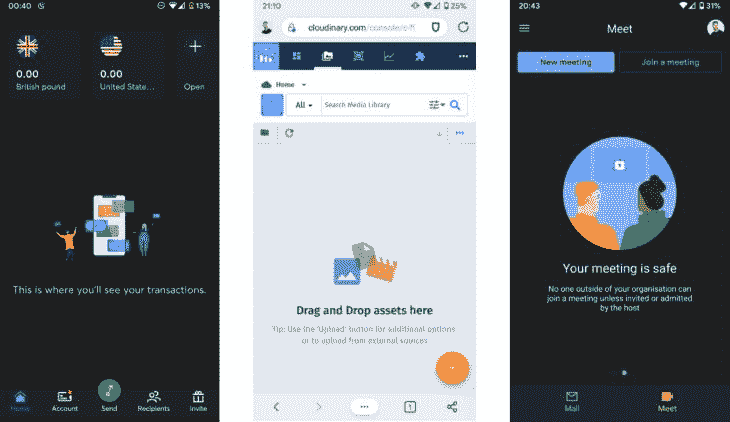
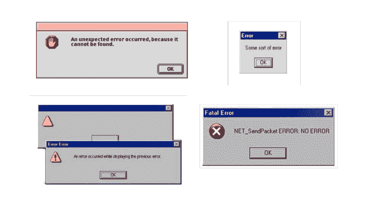
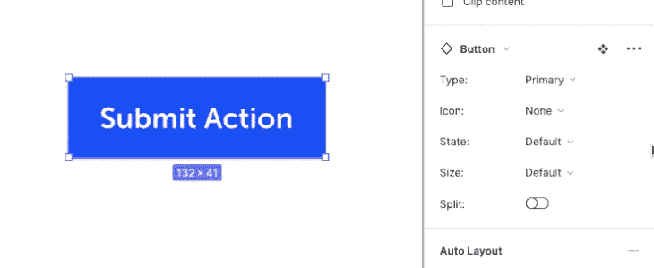
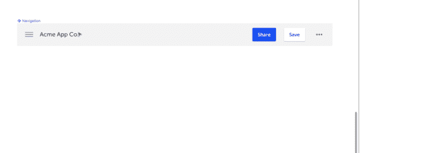
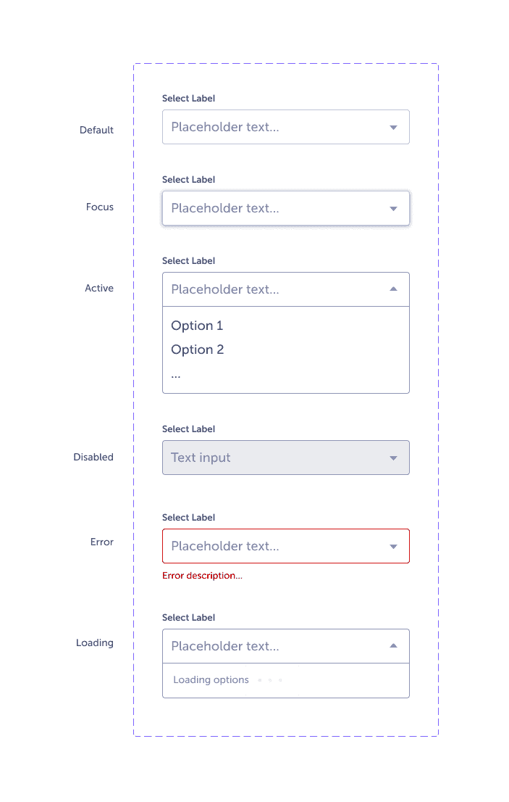
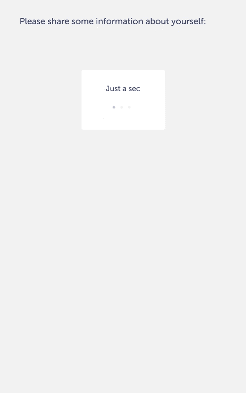

# 使用 Figma 变体进行更好的错误处理设计

> 原文：<https://blog.logrocket.com/using-figma-variants-for-better-error-handling-design/>

产品设计师总是乐观主义者。他们正在给这个世界带来一些新的东西，无论是整个平台还是仅仅一个功能，这需要坚定地关注理想的使用场景，以便产品的关键方面尽可能地发挥作用。

当他们遇到产品工作中不可避免的挑战时，这种乐观精神让他们和他们的团队保持动力。然而，它也可能阻止设计者考虑产品可能让用户失望的所有方面:不触发的交互、不加载的内容、用户可能犯的错误，甚至只是考虑所有可能的空状态，这是 UI 设计中经常被忽视的一个方面。

Thoughtful empty state examples from [Empty States](https://emptystat.es/).

虽然开发人员继承了健壮的错误测试实践的历史，但在设计中没有太多的模拟。设计者通常主要针对设计问题(例如，“这种颜色组合没有通过可访问性测试”)来评论他们的工作，而没有深入研究潜在的实现问题(例如，“如果这个表没有加载会发生什么？”).设计师偏向于最好的场景，而开发人员本能地考虑所有可能出错的地方，然后进行测试。

然而，产品通过优雅地失败来赢得信任和留住用户。一个产品的好坏取决于它最容易出错的交互(插入关于失败如何揭示性格的引言)。

虽然产品的感知质量很重要，但错误处理设计和复制通常是事后的想法，当开发人员发现界面中潜在的错误场景时，就当场编写。这并不是对开发人员的打击——他们正在做预测功能故障所需的工作——而是承认设计人员可能不会主动在整个界面上给出深思熟虑的、彻底的和一致的错误消息。我也包括我自己在内。

Some choice error messages from [Instructional Design](http://www.instructionaldesign.org/bad_error_messages/).

设计师可能会忽略错误处理 UI，原因有几个。首先，设计师通常不知道他们设计的潜在错误状态，所以他们需要和他们的开发人员进行有意识的交流。

第二，设计工具在历史上对国家管理并不友好。设计错误状态意味着复制画板，以记录所有可能的排列，导致难以处理的文件和晦涩难懂的命名系统。

随着改进的组件设计功能的出现，为同一个元素或屏幕设计多个状态变得更快、更容易。每个问题都与沟通有关:设计人员和开发人员一起识别和记录错误状态，设计人员以更易于管理的方式制作和共享错误处理 UI。下面，我将描述一些处理这两者的方法。

## 记录错误状态

当然，并不是所有的错误状态都能在一开始就被预测到。然而，在设计组件之前记录组件的错误状态类型是有帮助的，当发现额外的错误状态时更新设计。

一般来说，有两种类型的错误:

1.  **产品端错误**发生在错误源于产品时。有些东西无法加载，一个按钮不起作用，服务器无法访问。有些产品端的错误是普遍的，可以预测的；还有一些是特定于某些平台的。设计师依赖开发人员来分享这些潜在的场景
2.  **用户端错误**发生在用户犯错的时候。正如尼尔森的[第五可用性启发](https://www.nngroup.com/articles/ten-usability-heuristics/)中所指出的，用户可能会犯一个“失误”或彻底的错误:“失误是由疏忽引起的无意识错误。错误是基于用户心理模型和设计不匹配的有意识的错误。”当然，如果用户端的错误可以在第一时间避免，那么产品应该相应地改变

对所有可能的状态进行审核和设计，确保设计考虑渗透到产品界面的各个角落，确保不会忽略深思熟虑的缩微拷贝或加载动画或确认插图的机会。设计师应该不断地寻求开发人员对他们正在设计的产品中可能出现的所有产品端错误的意见。

至于用户端错误，[可用性测试原型](https://www.nngroup.com/articles/ux-prototype-hi-lo-fidelity/)是发现实际和潜在问题的必要实践。在像 Airtable 这样的工具中保存一个用户研究观察的[数据库](https://blog.airtable.com/3-user-research-templates-built-by-ux-experts/),不仅为设计者提供了一般的和特定功能的改进领域，还可以揭示页面和组件所需的状态。在用户使用产品的过程中，小的改进可以对用户的肯定起到很大的作用。也许那个信息密集的仪表板终究需要一个[骨架屏幕](https://uxdesign.cc/what-you-should-know-about-skeleton-screens-a820c45a571a)。

## 使用 Figma 变体

在过去的五年里，Figma 已经逐渐成为网页设计的领先工具。他们开发了一个功能集，它有一个清晰的、隐含的策略来促进设计者和开发者之间的协作。虽然 Figma 的许多功能(例如，样式和组件)并不是该工具独有的，但最近增加的功能，如[智能动画](https://help.figma.com/hc/en-us/articles/360039818874-Create-advanced-animations-with-Smart-Animate)、[自动布局](https://help.figma.com/hc/en-us/articles/360040451373-Create-dynamic-designs-with-Auto-Layout)和[变体](https://help.figma.com/hc/en-us/articles/360056440594)，对于致力于健壮、交互丰富的产品的设计师来说是一个飞跃。

变体允许设计者为单个组件定义多个属性，这简化了页面设计，并使设计工作更接近开发工作。例如，单个按钮可以包含大小、状态、图标位置、分割(按钮是否包含弹出菜单)等变化。标准按钮组件可能包含以下属性:

| 类型 | 小学、中学、大学 |
| 状态 | 默认、悬停、活动、聚焦、禁用 |
| 大小 | 大、中、小 |
| 图标 | 左，右，无 |
| 裂开 | 开，关 |

在变体出现之前，设计人员需要处理庞大的组件集合，每个组件对应一个状态。现在，一旦定义好了，就可以动态地为组件调整这些属性。要了解如何设置组件属性，请查看 [Figma 教程](https://help.figma.com/hc/en-us/articles/360056440594)。

与自动布局相结合，变体可以用来创建更通用的组件，比如可以根据上下文交替主要和次要操作的辅助导航。

即使有变体，设计者仍然必须设计每一个状态。然而，状态现在可以被*包含在组件的*中，就像开发人员定义 UI 元素的属性一样。而且，设计师常常可以简单地调整某个组件的某些属性，为它定义一个新的变体。设计错误状态变得容易多了。

## 实践中的 Figma 变体

假设一个团队正在开发一个动态的多字段表单集，该表单集随着用户的填写而更新。可以为单个表单元素定义多种状态(默认、焦点、加载、禁用、错误等)。):

Various states for a form element are defined as variants.

但是我们可以更进一步，为*表单集*定义属性。集合组件可能包含加载状态、默认状态、不同类型表单交互的各种状态、单个表单的错误状态以及集合整体的错误状态。

变体还使条件逻辑更容易显示，因为条件可以被定义为属性。总之，这些特性简化了 Figma 中可点击原型的创建，对于可用性测试和更清晰地传达设计意图都很有用。

An example of variants at work in a form component. This prototype was made using a single form component made up of instances of a single select component, each with its own variants.

变体的定义可能显得笨拙，有时一个按钮组件定义了 40 多种排列。然而，一旦定义了，访问组件状态原型就远没有以前那么麻烦了(在其他工具中仍然如此)，并且可以很容易地在源代码中添加和修改变体。你可以在这里探索这个例子[。这是一个相对基本的例子，但希望它能清楚地说明如何使用变体为更复杂的组件设计状态。](https://www.figma.com/file/mkVE22yFWJQOWsPtHCfrxE/Blog-%E2%80%94-On-Figma-Variants?node-id=0%3A1)

## 数字国家设计的现状

数字设计工具的发展可以被看作是澄清设计和开发之间对话的努力。十年前，网站是在 Photoshop 中设计的，因为设计师们突破了照片编辑工具的限制，创建了看起来像网站的图像。

今天，有了 Webflow、Figma 和 Adobe XD 这样的设计工具，设计和开发之间的界限正在消失，而且效果很好。现代设计和原型制作工具已经把过去项目团队容易出错的电话游戏变成了(“把这个 PSD 文件变成一个有响应的网页！”)变成面对面的对话，每个人都说同一种语言，并注意到重要的细微差别。

然而，设计和开发之间的交接永远不会完美无缝，更好的工具不会自动改变产品设计师的流程。要学会用开发人员的眼光看待产品，设计师需要经常和开发人员密切合作。

但是现代设计工具让我们达到了一个点，设计工作能够与开发工作并行，这样设计师就可以支持产品 UI 的无数排列，而不需要曾经需要的繁琐的文件管理。

不难想象，在未来，静态设计原型与功能原型会更加相似；细微的状态转换一直是一个限制因素。也许我过于乐观，但感觉我们正在进入设计工具的黄金时代。

## 使用 [LogRocket](https://lp.logrocket.com/blg/signup) 消除传统错误报告的干扰

[LogRocket](https://lp.logrocket.com/blg/signup) 是一个数字体验分析解决方案，它可以保护您免受数百个假阳性错误警报的影响，只针对几个真正重要的项目。LogRocket 会告诉您应用程序中实际影响用户的最具影响力的 bug 和 UX 问题。

然后，使用具有深层技术遥测的会话重放来确切地查看用户看到了什么以及是什么导致了问题，就像你在他们身后看一样。

LogRocket 自动聚合客户端错误、JS 异常、前端性能指标和用户交互。然后 LogRocket 使用机器学习来告诉你哪些问题正在影响大多数用户，并提供你需要修复它的上下文。

关注重要的 bug—[今天就试试 LogRocket】。](https://lp.logrocket.com/blg/signup-issue-free)