# 使用 Firebase 云消息作为发布/订阅服务

> 原文：<https://blog.logrocket.com/using-firebase-cloud-messaging-as-a-pub-sub-service/>

Firebase Cloud Messaging (FCM)主要用于简化向客户端设备发送通知的过程。在这篇文章中，我们将学习如何在 React 应用程序中使用 Firebase Cloud Messaging 作为推送通知服务和发布/订阅服务。

## 什么是发布/订阅系统？

发布/订阅系统由两方组成:负责向系统发送消息的发布者，以及主动侦听来自系统的通知并可以决定对消息采取进一步行动的订阅者。

发布/订阅系统的一个用例是来自服务器的无状态通信。当验证卡支付时，服务器几乎不可能让客户端知道它已经验证了支付并授予了用户所请求的服务。我们可以使用发布/订阅系统轻松做到这一点。

对于发布/订阅系统，浏览器监听特定的主题，而服务器向该主题发送消息。浏览器收到消息后，会立即继续客户端的其余处理。

## 在 React 中设置带有 FCM 的发布/订阅服务

在本教程中，我们将学习以下内容:

*   如何在 Firebase 控制台上设置 FCM 并创建新项目
*   如何设置 React 应用程序以包含 Firebase SDK
*   Firebase 云消息传递的基本概念
*   如何收听关于特定主题的信息
*   如何使用对 FCM API 的 HTTP 请求向主题发布消息

我们开始吧！

## 创建 FCM 项目

对于这一部分，谷歌帐户是必需的。

首先前往[https://console.firebase.google.com/](https://console.firebase.google.com/)，用你的谷歌账户登录。点击白色大**创建项目**按钮。

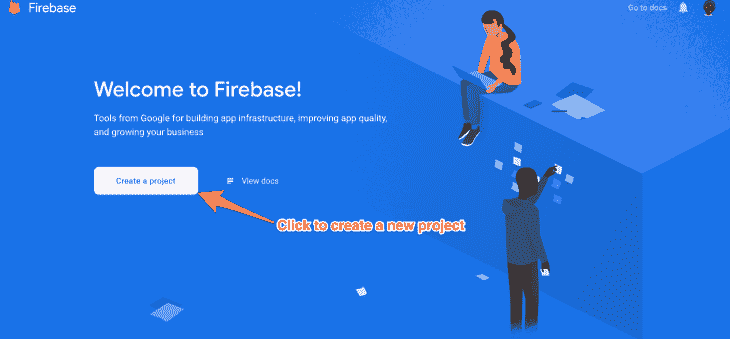

输入项目名称，接受条款，然后点击**继续**。选择要将项目附加到的帐户。

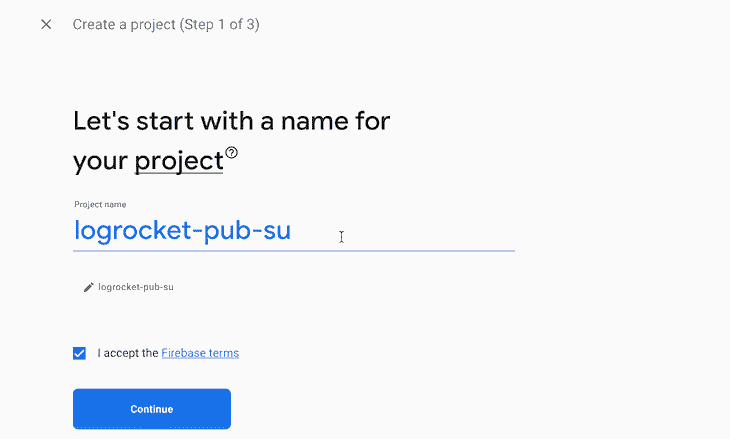

### 创建 Firebase 应用程序

在 Firebase 控制台上，点击白色圆圈中的代码图标( **< / >** )，输入 app 名称，选择**设置 Firebase 托管**，然后点击**注册 app** 。这将需要一些时间来调配应用程序，然后它会提示您进行下一步。

在**添加 Firebase SDK** 和**安装 Firebase CLI** 步骤，浏览说明，然后点击**继续控制台**以完成设置。

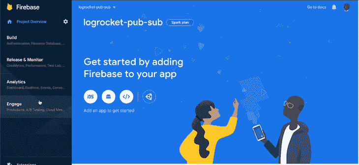

### 获取凭据

让我们获得 Firebase API 密钥，它赋予浏览器对 Firebase API 和 Firebase JSON 文件的请求进行身份验证的能力。

在仪表盘中，点击新应用的名称，然后点击齿轮图标以访问设置。

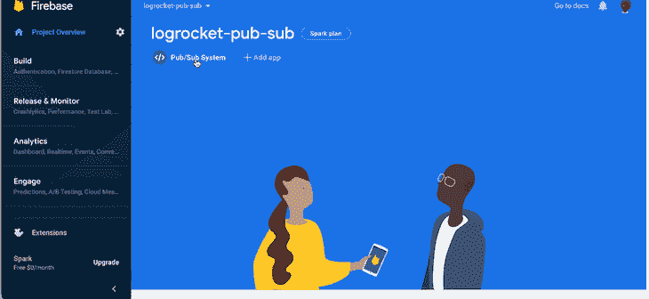

接下来，向下滚动到选项卡的底部；在 **SDK 设置和配置**部分，点击**配置**按钮，打开 web 推送配置。确保复制并保存在安全的地方。

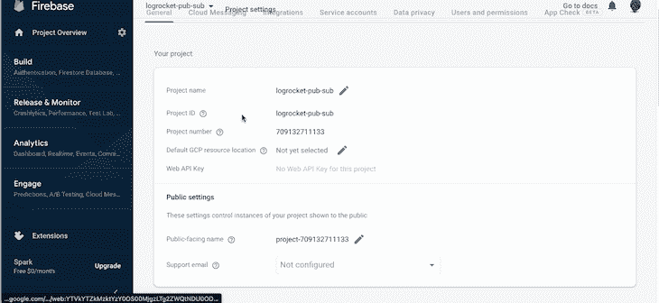

通过 Google Firebase APIs 执行授权操作需要服务器密钥。为此，进入**项目设置**下的**云消息**标签，向下滚动到**项目凭证**。复制并保存服务器密钥到安全的地方。

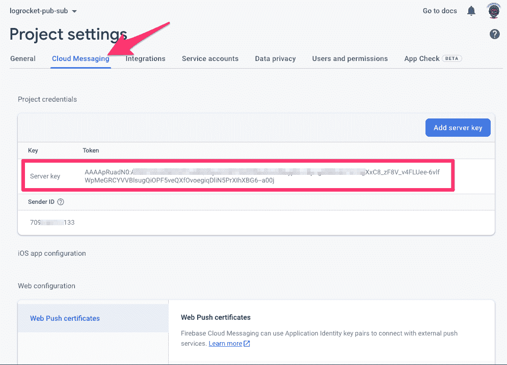

## 设置 React 应用程序

在本节中，我们将创建一个 React 应用程序，并使用它来设置 Firebase。

在您的终端中输入以下内容:

```
$ npx create-react-app pub-sub && cd pub-sub && code .

```

上面的命令将在当前目录的`pub-sub`文件夹中创建一个新的 React 应用程序。然后，将当前目录更改为 React 应用程序的目录，并在 Visual Studio 代码中打开项目进行编辑。

同样，从终端的`pub-sub`项目目录中，您可以运行`npm start`来打开开发文件夹。

### 将 Firebase SDK 安装到 React 应用程序中

在您的终端中，从项目根文件夹运行`npm i firebase --save`来安装 Firebase。

在`path-to-project/src/utils`创建一个新文件夹，并将一个新文件`firebaseConfig.json`添加到该文件夹中。这个文件应该包含 Firebase web push 设置页面中的所有 JSON 值。

文件的内容应该如下所示:

```
{
  apiKey: "***",
  authDomain: "logrocket-pub-sub.firebaseapp.com",
  projectId: "logrocket-pub-sub",
  storageBucket: "logrocket-pub-sub.appspot.com",
  messagingSenderId: "***",
  appId: "1:***:web:***",
  measurementId: "G-G7Q3DJ5GCN"
}

```

### 创建 Firebase 助手

在`/src/utils`文件夹中，创建一个名为`firebase.js`的文件，内容如下:

```
import firebase from "firebase/app";
// eslint-disable-next-line
import _messaging from "firebase/messaging";
import firebaseConfig from "./firebaseConfig";

const app = firebase.initializeApp(firebaseConfig);
export const fMessaging = app.messaging();

```

第一行导入 Firebase 应用程序。导入 Firebase 消息传递是为了在 Firebase 应用程序上添加和初始化 Firebase 消息传递 SDK。第四行导入您在上面创建的 Firebase 配置文件。

第六行使用`firebaseConfig` JSON 细节初始化 Firebase 应用程序。最后一行初始化 Firebase 应用程序上的云消息传递，它是在上面一行初始化的。

### 添加`firebase-messaging-sw.js`

为了完成 Firebase 集成，您必须在您的应用程序的公共可访问路径中添加一个`firebase-messaging-sw.js`文件，在本例中是在`path-to-project/public`中。

该文件的内容应该如下:

```
// Give the service worker access to Firebase Messaging.
// Note that you can only use Firebase Messaging here. Other Firebase libraries
// are not available in the service worker.
// eslint-disable-next-line
importScripts("https://www.gstatic.com/firebasejs/8.6.7/firebase-app.js");
// eslint-disable-next-line
importScripts("https://www.gstatic.com/firebasejs/8.6.7/firebase-messaging.js");

// Initialize the Firebase app in the service worker by passing in
// your app's Firebase config object.
// https://firebase.google.com/docs/web/setup#config-object
// eslint-disable-next-line
firebase.initializeApp({
  apiKey: "AIzaSyCu7r3TlqiiI_3HTJft_G-SSC8_*******",
  authDomain: "logrocket-pub-sub.firebaseapp.com",
  projectId: "logrocket-pub-sub",
  storageBucket: "logrocket-pub-sub.appspot.com",
  messagingSenderId: "*************",
  appId: "1:709132711133:web:***********************",
  measurementId: "G-*********",
});

// Retrieve an instance of Firebase Messaging so that it can handle background
// messages.
// eslint-disable-next-line
const messaging = firebase.messaging();

messaging.onBackgroundMessage((message) => {
  return self.showNotification(
    message.notification.title,
    message.notification
  );
});

```

前几行应该很熟悉；Firebase 应用程序和消息脚本被导入到服务工作者上下文中。接下来，在初始化 Firebase 消息传递之前初始化 Firebase 应用程序。

Firebase messaging SDK 上的`onBackgroundMessage`方法在浏览器、网页或应用程序不活动时捕获任何发送到客户端应用程序(在本例中是浏览器)的消息。

这里，通知徽章被触发，以使用户了解在后台接收到的新信息。

## Firebase 云消息传递概念

为了全面参与集成，您应该理解这些基本的 Firebase 云消息传递概念。

### 前台消息

这些是当浏览器活动时(例如，用户在页面/浏览器选项卡上)由客户端接收的消息。这可以通过 Firebase messaging SDK 上的`.onMessage((message) => message)`方法获得，并且不能在服务工作者上下文中调用。

### 背景消息

这些消息在不活动时被传送到客户端浏览器。这可以通过 Firebase messaging SDK 上的`.onBackgroundMessage((message) => message)`方法获得，并且只能在服务工作者上下文中调用。

### 主题的订阅者

订户是发送消息的目标群体。移动应用可以订阅接收消息，而浏览器不能使用浏览器 SDK 订阅任何问题。在本文的后面，我们将学习如何从浏览器订阅主题。

### 消息/通知数据

默认情况下，客户端收到的所有消息都应该是类似于以下内容的对象:

```
{
  "notification": {
      "title": "This is the title",
    "body": "This is the body",
    "priority": "high|normal"
  },
  data: {
    anExtra: "Something",
    size: "has a size limit to avoid failure"
  }
}

```

`notification`对象必须至少有`title`和`body`才能成功发送，而`data`可以是任意对象，根据 FCM 文档，不应超过 4000 字节。

`notification`对象用于显示基于客户端设备的本地通知，我们不希望在我们的例子中出现这种情况。稍后，我们将了解如何防止当有来自 FCM 的新消息时弹出通知。

### **订阅一个已知的主题名**

发布/订阅系统主要处理主题。主题是一组可以获得一组特定消息的用户或客户端。

Firebase web JavaScript SDK 不支持主题订阅，但是可以通过对`[https://iid.googleapis.com/iid/v1/](https://iid.googleapis.com/iid/v1/)' + accessToken + '/rel/topics/' + topic`的 HTTP 请求来实现。

`accessToken`是需要订阅的客户端的当前访问令牌。主题是保存主题名称的字符串。

要实现主题订阅，您需要上面指定的`accessToken`。在 React 应用程序中，打开 Firebase 实用程序助手并添加以下代码:

```
export const subscribeToTopic = (topicName, handler = () => {}) =>
  fMessaging.getToken().then((currentToken) => {
    if (currentToken) {
      const FIREBASE_API_KEY = `AAAA*******:********************************************************************************************************************************************`;
      // Subscribe to the topic
      const topicURL = `https://iid.googleapis.com/iid/v1/${currentToken}/rel/topics/`;
      return fetch({
        url: topicURL,
        method: "POST",
        headers: {
          Authorization: `key=${FIREBASE_API_KEY}`,
        },
      })
        .then((response) => {
          fMessaging.onMessage(
            (payload) => {
              handler(payload);
            },
            (error) => {
              console.log(error);
            }
          );
        })
        .catch(() => {
          console.error(`Can't subscribe to ${topicName} topic`);
        });
    }
  });

```

这里，messaging SDK 上的`getToken`函数返回一个客户端的当前令牌；有时，如果用户没有给予推送通知所需的权限，它会失败。

接下来，对主题订阅进行 HTTP 请求；一旦成功，`messaging().onMessage`用于为客户端监听消息。

要在 React 应用程序中实现`subscribeToTopic`，请替换应用程序中的`App.js`文件，以包含以下内容:

```
import React, { useEffect } from "react";
import "./App.css";
import { subscribeToTopic } from "./utils/firebase";

function App() {
  function topicOnMessageHandler(message) {
    console.log(message);
  }

  useEffect(() => {
    subscribeToTopic("LOGROCKET_PUB_SUB_TOPICS", topicOnMessageHandler).then();
  }, []);

  return <div className="App">Firebase Pub / Sub System</div>;
}

export default App;

```

首先，定义函数`topicOnMessageHandler`来处理任何到达主题的消息，并对它们进行处理；它只记录到控制台。

在一个`useEffect`钩子中调用`subscribeToTopic`函数，它接收主题名称作为`LOGROCKET_PUB_SUB_TOPICS`，接收`topicOnMessageHandler`作为处理程序。

每当有消息发送到`LOGROCKET_PUB_SUB_TOPICS`主题时，您的 React 应用程序将接收它并将其记录到控制台。

### 处理后台消息

服务工作者文件`firebase-messaging-sw.js`已经实现了 Firebase 消息传递 SDK 的`onBackgroundMessage`方法。在这个函数中，消息被记录到控制台，这适合这个用例。

## 向 React 应用程序发布消息

在发布/订阅系统中，应该有一个消息发布者；我们刚刚构建的 React 应用程序已经成为订阅者。

要测试这个实现，请转到 Firebase 控制台，展开 **Engage** 侧栏菜单，然后点击**云消息**访问云消息仪表板。然后点击**发送你的第一条消息**按钮。

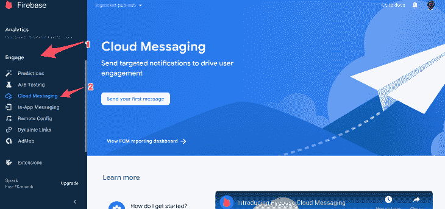

在**撰写通知**工具中，输入通知的标题和正文，然后点击**下一步**。在**目标**部分，选择一个主题并输入您在订阅时使用的主题。您可以将留言安排在以后发送，也可以立即发送。点击**审核**以完成流程。

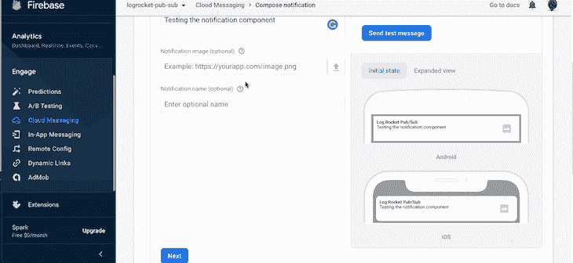

发送通知后，您应该会看到一个通知标记，如下所示:

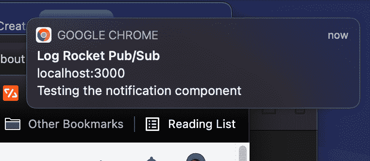

以及接收消息的控制台日志:

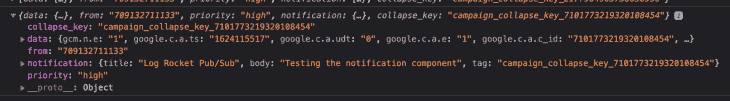

### 在控制台外发送消息

除了仪表板，您还可以使用 HTTP 请求向`[https://fcm.googleapis.com/fcm/send](https://fcm.googleapis.com/fcm/send)`发送消息，消息体包含通知对象和授权头:`key=FIREBASE_API_KEY`。

请求的正文应该如下所示:

```
{
    "data": {"Holla": "True"},
    "to": "/topics/LOGROCKET_PUB_SUB_TOPICS",
    "notification": {
        "title": "This is from Postman",
        "body": "hello there"
    }
}

```

以及描述为`Authorization: "key=API_KEY"`的授权报头:

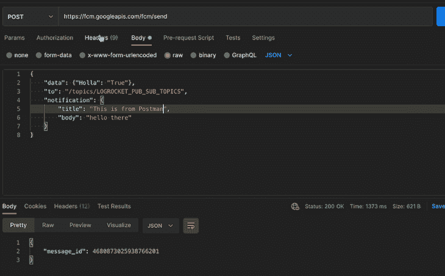

这有什么用？使用这种 HTTP 方法，服务器上的远程操作可以向某些客户端已经订阅的特定主题发送通知。

正如它存在于发布/订阅系统中一样，客户端浏览器已经在充当订阅者；远程服务器可以充当通知的发布者。

### 阻止通知徽章

FCM 以通知著称。如果它应该作为发布/订阅服务，则通知通常是不必要的。

我们在本文中发布消息的方法总是会导致弹出通知徽章。您可以通过在发布新消息时从发送的有效负载中省略`notification`对象来防止这种情况，如下所示:

```
{
    "data": {"Holla": "True"},
    "to": "/topics/LOGROCKET_PUB_SUB_TOPICS"
}

```

通过这种方式，消息被传递，通知标记不会弹出，并且消息处理程序可以有效地处理消息。

### 从服务工作者向主浏览器线程发送消息

当接收到后台消息时，在服务工作者上下文中调用`onBackgroundMessage`。

您可以使用`self.postMessage({})`将消息从服务工作线程发送到主浏览器线程，然后使用`window.addEventListener("onmessage", message => console.log(message))`在主线程上接收消息。

上面的解决方案可以工作，但是在消息可以到达两个地方的情况下是不可维护的:通过`onMessage`和`onBackgroundMessage`。

更易于管理和维护的方式是将两个消息都推送到一个可以订阅的事件系统，该系统将处理消息，而不管消息来自哪里。

在这种情况下， [BroadcastChannel](https://developer.mozilla.org/en-US/docs/Web/API/Broadcast_Channel_API) API 会很有用，正如[这篇文章建议的](https://aleemisiaka.com/blog/send-message-from-service-worker-broadcastchannel/)。

在`onBackgroundMessage`函数中，你可以[将消息](https://developer.mozilla.org/en-US/docs/Web/API/BroadcastChannel/postMessage)发布到一个频道，而不是安慰:

```
messaging.onBackgroundMessage((message) => {
  // if the sent data does not contain notification,
  // no notification would be shown to the user
  const fcmChannel = new BroadcastChannel("fcm-channel");
  fcmChannel.postMessage(message);
});

```

此外，在`subscribeToTopic`的处理程序内，用以下内容替换控制台日志:

```
const fcmChannel = new BroadcastChannel("fcm-channel");
fcmChannel.postMessage(message);

```

要使用这条消息，在 test React 应用程序中的任何地方，在`App.js`文件中创建另一个`useEffect`钩子，并实现 BroadcastChannel API 的`onmessage`事件，如下所示:

```
useEffect(() => {
    const fcmChannel = new BroadCastChannel("fcm-channel");
  fcmChannel.onmessage = (message) => console.log(message);
}, [])

```

有了这个改变，`onmessage`处理程序处理所有来自 FCM 的消息，FCM 将它们记录到控制台。

## 结论

作为一种有效的推送通知服务，FCM 也可以用作发布/订阅系统，并且仍然利用现有的可用基础设施。

这篇文章还分享了如何使用 Google APIs 使使用 FCM 更容易，而不是依赖 SDK，并使一些边缘情况的使用成为可能。

使用 BroadcastChannel 作为事件有助于跨不同的 FCM 消息传递模式同步数据。

按照这篇文章中的说明，您可以无缝地进行服务器-客户端通信，而不会用通知徽章打断用户。

## 使用 [LogRocket](https://lp.logrocket.com/blg/signup) 消除传统错误报告的干扰

[](https://lp.logrocket.com/blg/signup)

[LogRocket](https://lp.logrocket.com/blg/signup) 是一个数字体验分析解决方案，它可以保护您免受数百个假阳性错误警报的影响，只针对几个真正重要的项目。LogRocket 会告诉您应用程序中实际影响用户的最具影响力的 bug 和 UX 问题。

然后，使用具有深层技术遥测的会话重放来确切地查看用户看到了什么以及是什么导致了问题，就像你在他们身后看一样。

LogRocket 自动聚合客户端错误、JS 异常、前端性能指标和用户交互。然后 LogRocket 使用机器学习来告诉你哪些问题正在影响大多数用户，并提供你需要修复它的上下文。

关注重要的 bug—[今天就试试 LogRocket】。](https://lp.logrocket.com/blg/signup-issue-free)