# 在 React Native 中使用 flexbox

> 原文：<https://blog.logrocket.com/using-flexbox-react-native/>

***编者按:**本帖更新于 2022 年 3 月 8 日，旨在更正任何过时的信息并添加[如何在 React Native 中使用`flexWrap`？在 React Native](#how-use-flexwrap-react-native) 部分使用 flexbox 的`gap`的和[。](#using-flexbox-gap-react-native)*

如果你有网页设计或开发背景，你可能对 flexbox 比较熟悉。这是一个可选的 CSS 工具，使您能够建立基于列和行的布局。

在 React Native 中，这是构建布局的默认方式。由于响应式设计，它非常适合移动开发，因为它允许我们构建适合多种屏幕尺寸的布局。

在本教程中，我们将涵盖:

## 使用 flexbox 开发 React Native 和 web

Flexbox 在 React Native 中是默认的，但我们不必选择它，这意味着我们不需要在样式中设置`display: flex`:

```
const styles = StyleSheet.create({
  card: {
    display: 'flex' // this is unnecessary
  }
});

```

还有不同的默认设置使 flexbox 更有利于移动开发:

| **属性** | **网页默认** | **反应原生默认** |
| --- | --- | --- |
| `flexDirection` | `row` | `column` |
| `alignContent` | `stretch` | `flex-start` |
| `flexShrink` | `1` | `0` |

## flexbox 的属性是什么？

有几个你会经常使用的 flexbox 属性值得记住。这里有一个关于他们和他们所做的运行。

### `flex`

`flex`定义视图将占据屏幕的多少。可用值是大于或等于`0`的整数。

### `flexDirection`

`flexDirection`决定子节点在垂直或水平方向的布局。可用值包括`column`、`row`、`column-reverse`和`row-reverse`。

### `justifyContent`

`justifyContent`决定一个项目应该如何沿着主轴呈现(由`flexDirection`属性决定)。可用值有`flex-start`、`flex-end`、`center`、`space-between`、`space-around`、`space-evenly`。

### `alignItems`

`alignItems`决定一个项目应该如何沿着次轴呈现(由`flexDirection`属性决定)。可用值有`flex-start`、`flex-end`、`center`和`baseline`。

### `alignSelf`

`alignSelf`决定一个子节点应该如何自我对齐并覆盖`alignItems`。可用值有`flex-start`、`flex-end`、`center`和`baseline`

### `flexWrap`

`flexWrap`确定当容器的子容器溢出到容器外时会发生什么。默认情况下，它们被强制放在一行中，这导致了它们的收缩。

当`flexWrap`属性设置为`wrap`时，容器的子容器可以溢出到多行中。

你可以在官方文档中了解更多关于 flexbox 中[布局的信息。现在，让我们深入了解每个属性的作用以及如何使用它。](https://reactnative.dev/docs/flexbox)

## 如何在 React Native 中使用`flex`属性？

属性决定了视图如何填充屏幕。为了说明这一点，我们来看两个代码非常相似的例子。

注意，可用值包括大于或等于`0`的整数:

```
import React from "react";
import { StyleSheet, View } from "react-native";

export default function App() {
  return (
    <>
      <View style={{ backgroundColor: "#7cb48f", flex: 1 }} />
    </>
  );
}

```

结果如下:

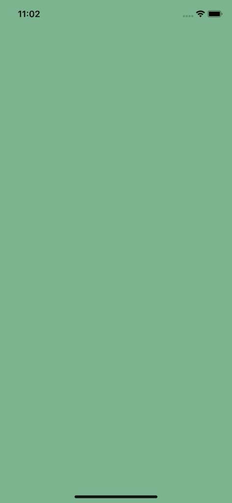

在这种情况下，视图将占据整个屏幕。为什么？因为它有一个属性`flex: 1`，并且空间拆分成一组；它会占据整个屏幕。

让我们用下面的代码看第二个例子:

```
import React from "react";
import { StyleSheet, View } from "react-native";

export default function App() {
  return (
    <>
      <View style={{ backgroundColor: "#7cb48f", flex: 1 }} />
      <View style={{ backgroundColor: "#7CA1B4", flex: 3 }} />
    </>
  );
}

```

结果是这样的:

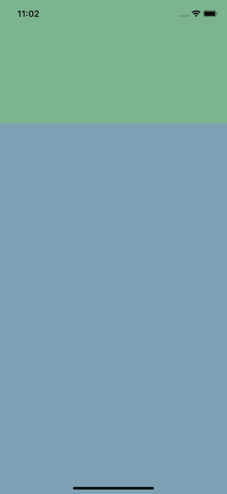

或者，我们可以看到绿色区域现在仅占屏幕的四分之一，尽管具有相同的`flex`值。

这是因为屏幕现在被分成四块(1+3)，所以`flex`属性是它应该占据的屏幕的一部分。

### 在 React Native 中使用`flexDirection`

`FlexDirection`决定孩子应该渲染的方向。您可以使用`column`、`row`、`column-reverse`和`row-reverse`值进行编码，但默认为`column`:

```
import React from "react";
import { StyleSheet, View } from "react-native";

export default function App() {
  return (
    <>
      <View style={styles.container}>
        <View style={styles.square} />
        <View style={styles.square} />
        <View style={styles.square} />
      </View>
    </>
  );
}

const styles = StyleSheet.create({
  container: {
    backgroundColor: "#7CA1B4",
    flex: 1,
    alignItems: "center", // ignore this - we'll come back to it
    justifyContent: "center", // ignore this - we'll come back to it
    flexDirection: "column"
  },
  square: {
    backgroundColor: "#7cb48f",
    width: 100,
    height: 100,
    margin: 4,
  },
});

```

这将导致以下结果:

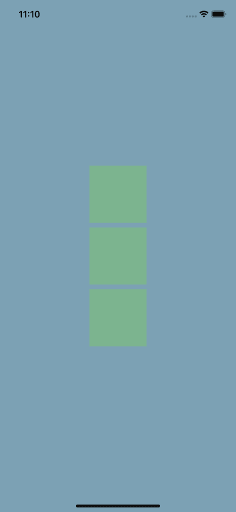

现在，让我们使用`row`的`flexDirection`将方向从列改为行:

```
import React from "react";
import { StyleSheet, View } from "react-native";

export default function App() {
  return (
    <>
      <View style={styles.container}>
        <View style={styles.square} />
        <View style={styles.square} />
        <View style={styles.square} />
      </View>
    </>
  );
}

const styles = StyleSheet.create({
  container: {
    backgroundColor: "#7CA1B4",
    flex: 1,
    alignItems: "center", // ignore this - we'll come back to it
    justifyContent: "center", // ignore this - we'll come back to it
    flexDirection: "row",
  },
  square: {
    backgroundColor: "#7cb48f",
    width: 100,
    height: 100,
    margin: 4,
  },
});

```


注意，使用`*-reverse`只是颠倒了它们呈现的顺序。

### 在 React Native 中使用`justifyContent`属性

`justifyContent`确定受`flexDirection`影响的主轴上的内容。如果`flexDirection`被归类为`column`，那么它就是垂直的。如果把它归类为`row`，那它就是横向的。

提醒一下，这里有可用的值:`flex-start`、`flex-end`、`center`、`space-between`、`space-around`和`space-evenly`。

下面我们将`justifyContent`设置为`center`。因为主轴是一列，这意味着我们将内容垂直居中:

```
import React from "react";
import { StyleSheet, View } from "react-native";

export default function App() {
  return (
    <>
      <View style={styles.container}>
        <View style={styles.square} />
        <View style={styles.square} />
        <View style={styles.square} />
      </View>
    </>
  );
}

const styles = StyleSheet.create({
  container: {
    backgroundColor: "#7CA1B4",
    flex: 1,
    justifyContent: "center",
  },
  square: {
    backgroundColor: "#7cb48f",
    width: 100,
    height: 100,
    margin: 4,
  },
});

```

然后，该代码输出以下内容:

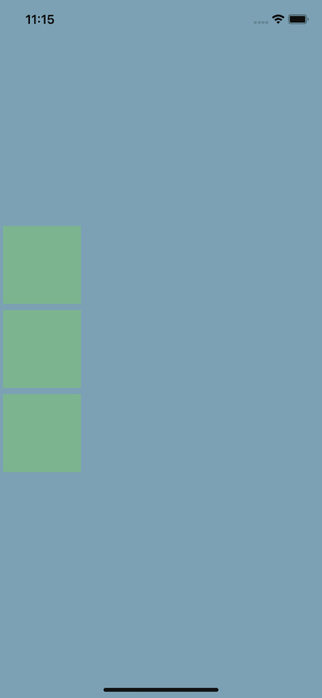

接下来，让我们使用`space-around`属性。这将导致布局沿主(垂直)轴均匀分割元素，这意味着屏幕顶部和底部的距离与每个元素之间的距离相等:

```
import React from "react";
import { StyleSheet, View } from "react-native";

export default function App() {
  return (
    <>
      <View style={styles.container}>
        <View style={styles.square} />
        <View style={styles.square} />
        <View style={styles.square} />
      </View>
    </>
  );
}

const styles = StyleSheet.create({
  container: {
    backgroundColor: "#7CA1B4",
    flex: 1,
    justifyContent: "space-around",
  },
  square: {
    backgroundColor: "#7cb48f",
    width: 100,
    height: 100,
    margin: 4,
  },
});

```

然后，该代码输出以下内容:

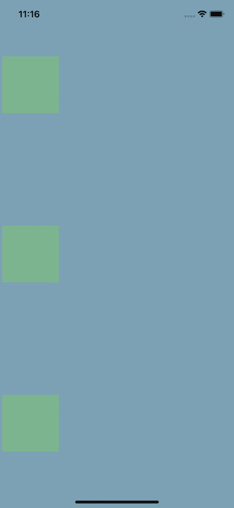

这些属性中的每一个都允许我们创建独特的布局。

`flex-start`在屏幕顶部对齐项目，`flex-end`在底部对齐项目，`space-between`最大化项目之间的距离(即第一个框在屏幕顶部，第三个框在底部，第二个框居中)。

### 在 React Native 中使用`alignItems`

`alignItems`决定一个项目应该如何沿着次轴呈现，这是由`flexDirection`属性决定的。

这是`justifyContent`的逆。因此，如果`justifyContent`处理垂直对齐，那么`alignItems`处理水平对齐。

这里可用的值有`flex-start`、`flex-end`、`center`和`baseline`。

下面，我们来看看当使用默认的`flexDirection` ( `column`)时`alignItems`如何将内容水平居中:

```
import React from "react";
import { StyleSheet, View } from "react-native";

export default function App() {
  return (
    <>
      <View style={styles.container}>
        <View style={styles.square} />
        <View style={styles.square} />
        <View style={styles.square} />
      </View>
    </>
  );
}

const styles = StyleSheet.create({
  container: {
    backgroundColor: "#7CA1B4",
    flex: 1,
    justifyContent: "center",
    alignItems: "center",
  },
  square: {
    backgroundColor: "#7cb48f",
    width: 100,
    height: 100,
    margin: 4,
  },
});

```


同样，当将`alignItems`设置为`flex-end`时，我们看到元素移动到了最右边的 flex 区域的末端:

```
import React from "react";
import { StyleSheet, View } from "react-native";

export default function App() {
  return (
    <>
      <View style={styles.container}>
        <View style={styles.square} />
        <View style={styles.square} />
        <View style={styles.square} />
      </View>
    </>
  );
}

const styles = StyleSheet.create({
  container: {
    backgroundColor: "#7CA1B4",
    flex: 1,
    justifyContent: "center",
    alignItems: "flex-end",
  },
  square: {
    backgroundColor: "#7cb48f",
    width: 100,
    height: 100,
    margin: 4,
  },
});

```

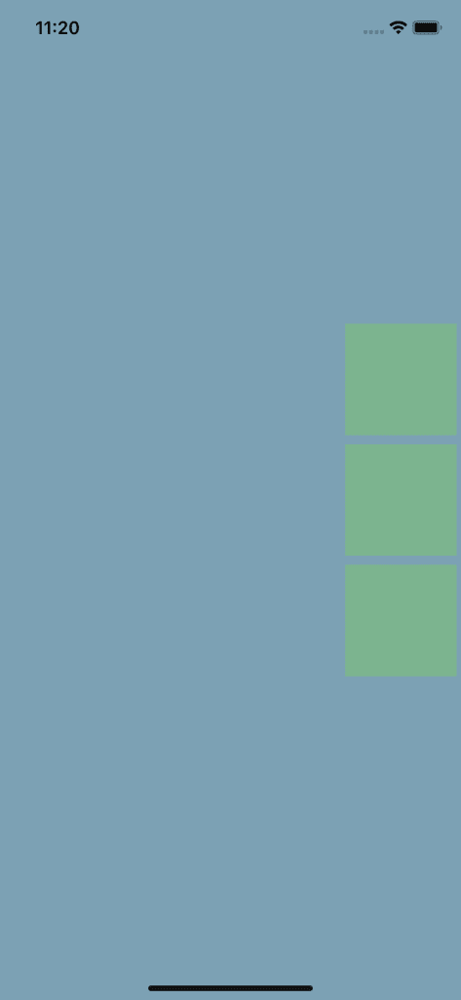

### 在 React Native 中使用`alignSelf`

`alignSelf`决定一个子节点应该如何自我对齐并覆盖`alignItems`。`alignSelf`的可用值有`flex-start`、`flex-end`、`center`和`baseline`。

下面，我们设置一个默认的`alignItems`属性，并使用`alignSelf`覆盖它:

```
import React from "react";
import { StyleSheet, View } from "react-native";

export default function App() {
  return (
    <>
      <View style={styles.container}>
        <View style={styles.square} />
        <View style={[styles.square, { alignSelf: "flex-end" }]} />
        <View style={[styles.square, { alignSelf: "flex-start" }]} />
      </View>
    </>
  );
}

const styles = StyleSheet.create({
  container: {
    backgroundColor: "#7CA1B4",
    flex: 1,
    justifyContent: "center",
    alignItems: "center",
  },
  square: {
    backgroundColor: "#7cb48f",
    width: 100,
    height: 100,
    margin: 4,
  },
});

```

它看起来是这样的:

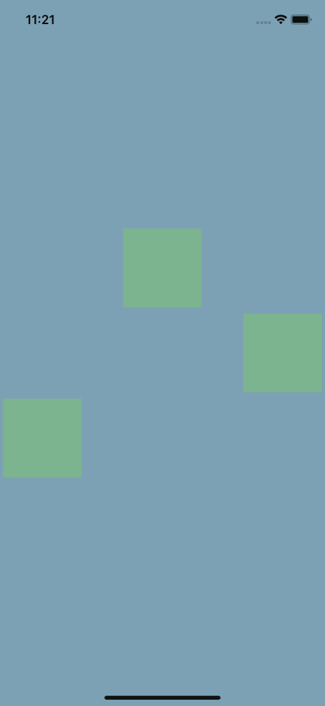

### React Native 里怎么用`flexWrap`？

当一个容器的子容器溢出时，`flexWrap`决定它们是应该收缩到一行还是换行到多行。`flexWrap`的可用值为`nowrap`和`wrap`。

下面，我们将容器的`flexWrap`属性设置为`wrap`,将容器中的盒子包装成多行:

```
import React, { useState } from "react";
import { StyleSheet, View } from "react-native";

export default function App() {
  return (
    <>
      <View style={styles.container}>
        <View style={styles.square} />
        <View style={styles.square} />
        <View style={styles.square} />
        <View style={styles.square} />
        <View style={styles.square} />
        <View style={styles.square} />
        <View style={styles.square} />
      </View>
    </>
  );
}

const styles = StyleSheet.create({
  container: {
    backgroundColor: "#7CA1B4",
    flex: 1,
    flexDirection:'row',
    flexWrap: "wrap",
  },
  square: {
    backgroundColor: "#7cb48f",
    width: 100,
    height: 100,
    margin: 4,
  },
});

```

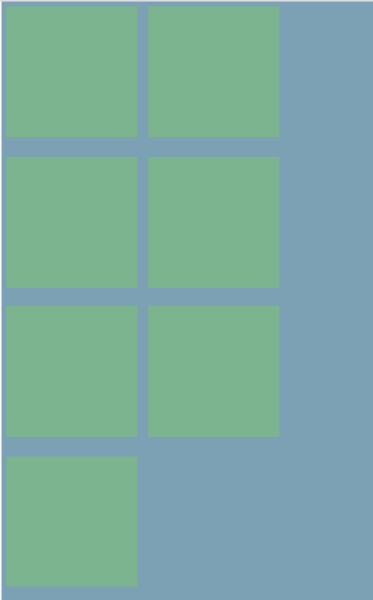

如果注释掉`flexWrap`样式，所有的框将出现在同一行。

### 在 React Native 中使用 flexbox 的`gap`

我们可以使用`gap`属性在上面创建的网格项目之间添加间隙。它的值应该是项目之间的间隙大小。

下面，让我们将容器的`gap`属性设置为`1rem`,以便在水平和垂直方向上增加 1 个项目的间距:

```
import React, { useState } from "react";
import { StyleSheet, View } from "react-native";

export default function App() {
  return (
    <>
      <View style={styles.container}>
        <View style={styles.square} />
        <View style={styles.square} />
        <View style={styles.square} />
        <View style={styles.square} />
        <View style={styles.square} />
        <View style={styles.square} />
        <View style={styles.square} />
      </View>
    </>
  );
}

const styles = StyleSheet.create({
  container: {
    backgroundColor: "#7CA1B4",
    flex: 1,
    flexDirection:'row',
    gap: '1rem',
    flexWrap: "wrap",
  },
  square: {
    backgroundColor: "#7cb48f",
    width: 100,
    height: 100,
    margin: 4,
  },

});

```

请注意，项目之间的空间现在变大了很多。

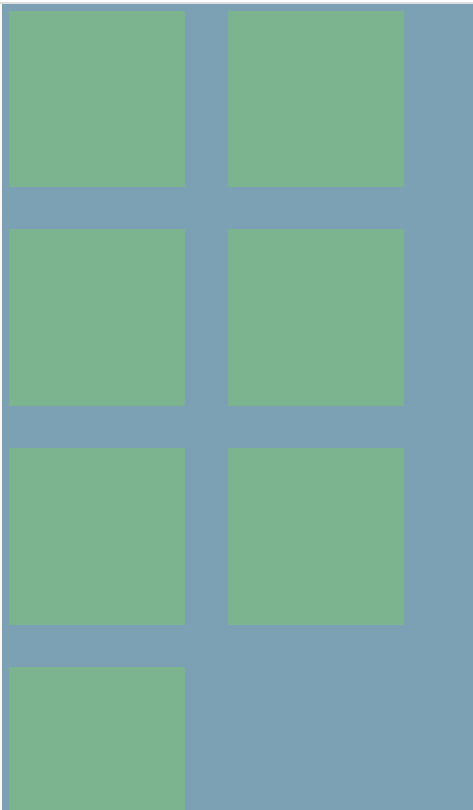

## 如何在 flexbox 中制作网格？

现在我们知道了 flexbox 中每个属性的作用，让我们使用 flexbox 创建一个网格。我们的最终目标是你在下一张图中看到的。在继续学习之前，请随意使用起始代码并亲自尝试一下。

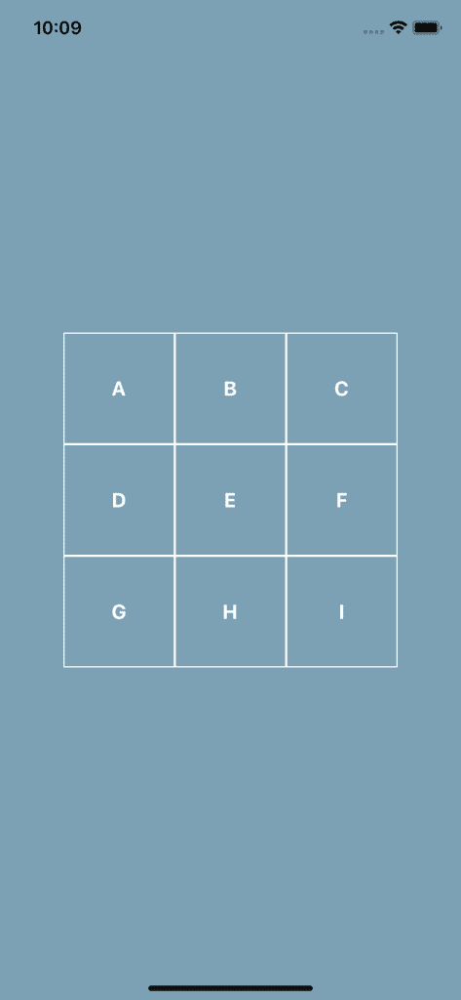

```
// starter.js

import React from "react";
import { StyleSheet, View, Text } from "react-native";

export default function App() {
  return <View style={styles.container}></View>;
}

const styles = StyleSheet.create({
  container: {
    flex: 1,
    backgroundColor: "#7CA1B4",
    alignItems: "center",
    justifyContent: "center",
  },
});

```

查看示例图像，我们可以将其分解为三行，每行有三列。每个方块应该垂直和水平地呈现它的文本。

接下来，让我们创建一个`Square`组件来节省一些重复:

```
import React from "react";
import { StyleSheet, View, Text } from "react-native";

const Square = ({ text }) => (
  <View style={styles.square}>
    <Text style={styles.text}>{text}</Text>
  </View>
);

export default function App() {
  return (
    <View style={styles.container}>
      <View style={styles.row}>
        <Square text="A" />
        <Square text="B" />
        <Square text="C" />
      </View>
      <View style={styles.row}>
        <Square text="D" />
        <Square text="E" />
        <Square text="F" />
      </View>
      <View style={styles.row}>
        <Square text="G" />
        <Square text="H" />
        <Square text="I" />
      </View>
    </View>
  );
}

```

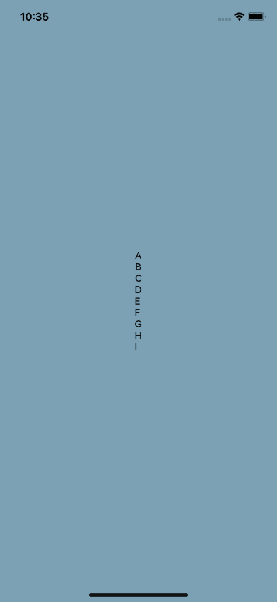

这里，我们添加了一些样式属性，即`styles.row`和`styles.square`。

我们知道`row`应该在一行中呈现它的项目，所以让我们设置它的`flexDirection: 'row'`:

```
const styles = StyleSheet.create({
  container: {
    flex: 1,
    backgroundColor: "#7CA1B4",
    alignItems: "center",
    justifyContent: "center",
  },
  row: {
    flexDirection: "row",
  },
});

```

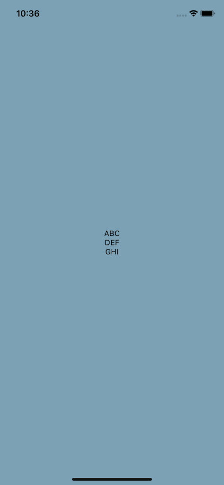

接下来，让我们用适当的边框、高度、宽度和文本颜色创建正方形本身。然后我们可以在那个方块上使用`justifyContent`和`alignItems`来垂直和水平居中文本:

```
const styles = StyleSheet.create({
  container: {
    flex: 1,
    backgroundColor: "#7CA1B4",
    alignItems: "center",
    justifyContent: "center",
  },
  row: {
    flexDirection: "row",
  },
  square: {
    borderColor: "#fff",
    borderWidth: 1,
    width: 100,
    height: 100,
    justifyContent: "center",
    alignItems: "center",
  },
  text: {
    color: "#fff",
    fontSize: 18,
    fontWeight: "bold",
  },
});

```


这留给我们最后的代码:

```
// finished.js

import React from "react";
import { StyleSheet, View, Text } from "react-native";

const Square = ({ text }) => (
  <View style={styles.square}>
    <Text style={styles.text}>{text}</Text>
  </View>
);

export default function App() {
  return (
    <View style={styles.container}>
      <View style={styles.row}>
        <Square text="A" />
        <Square text="B" />
        <Square text="C" />
      </View>
      <View style={styles.row}>
        <Square text="D" />
        <Square text="E" />
        <Square text="F" />
      </View>
      <View style={styles.row}>
        <Square text="G" />
        <Square text="H" />
        <Square text="I" />
      </View>
    </View>
  );
}

const styles = StyleSheet.create({
  container: {
    flex: 1,
    backgroundColor: "#7CA1B4",
    alignItems: "center",
    justifyContent: "center",
  },
  row: {
    flexDirection: "row",
  },
  square: {
    borderColor: "#fff",
    borderWidth: 1,
    width: 100,
    height: 100,
    justifyContent: "center",
    alignItems: "center",
  },
  text: {
    color: "#fff",
    fontSize: 18,
    fontWeight: "bold",
  },
});

```

如果你对使用`FlatList` 的稍微复杂一点的例子感兴趣，这使得它可以滚动，我已经在 React Native School 上讨论过这个话题。

## 如何制作 flexbox 卡？

接下来，让我们尝试使用 flexbox 构建一个卡片布局。同样，您可以随意使用起始代码，先自己尝试一下:

```
// start.js
import React from "react";
import { StyleSheet, View, Text, Image, Dimensions } from "react-native";

export default function App() {
  return (
    <View style={styles.container}>
      <View>
        <View>
          <Text style={styles.nameText}>React Native School</Text>
          <Text style={styles.followText}>Follow</Text>
        </View>
        <Image
          style={styles.image}
          resizeMode="cover"
          source={{
            uri:
              "<https://images.pexels.com/photos/3225517/pexels-photo-3225517.jpeg?cs=srgb&dl=pexels-michael-block-3225517.jpg&fm=jpg>",
          }}
        />
        <View>
          <Text>
            <Text style={styles.nameText}>{`React Native School `}</Text>
            This has been a tutorial on how to build a layout with Flexbox. I
            hope you enjoyed it!
          </Text>
        </View>
      </View>
    </View>
  );
}

const screen = Dimensions.get("screen");
const styles = StyleSheet.create({
  container: {
    flex: 1,
    backgroundColor: "#7CA1B4",
  },
  image: {
    height: screen.width * 0.8,
  },
  nameText: {
    fontWeight: "bold",
    color: "#20232a",
  },
  followText: {
    fontWeight: "bold",
    color: "#0095f6",
  },
});

```

让我们把卡片和容器放好。首先，水平和垂直对齐卡片，并将卡片宽度设置为屏幕宽度的 80%:

```
export default function App() {
  return (
    <View style={styles.container}>
      <View style={styles.card}>
        {/* ... */}
      </View>
    </View>
  );
}

const screen = Dimensions.get("screen");
const styles = StyleSheet.create({
  container: {
    flex: 1,
    backgroundColor: "#7CA1B4",
    alignItems: "center",
    justifyContent: "center",
  },
  card: {
    backgroundColor: "#fff",
    width: screen.width * 0.8,
  },
  image: {
    height: screen.width * 0.8,
  },
  nameText: {
    fontWeight: "bold",
    color: "#20232a",
  },
  followText: {
    fontWeight: "bold",
    color: "#0095f6",
  },
});

```


现在，让我们处理标题。我们希望文本呈现在一行中，并“粘”在每条边上。我们可以通过定义`flexDirection`和`justifyContent`来实现这一点。我们还将设置一些垂直和水平填充:

```
import React from "react";
import { StyleSheet, View, Text, Image, Dimensions } from "react-native";

export default function App() {
  return (
    <View style={styles.container}>
      <View style={styles.card}>
        <View style={styles.header}>
          <Text style={styles.nameText}>React Native School</Text>
          <Text style={styles.followText}>Follow</Text>
        </View>
        {/* ... */}
      </View>
    </View>
  );
}

const screen = Dimensions.get("screen");
const styles = StyleSheet.create({
        // ...
  header: {
    flexDirection: "row",
    justifyContent: "space-between",
    paddingHorizontal: 15,
    paddingVertical: 10,
  },
});

```

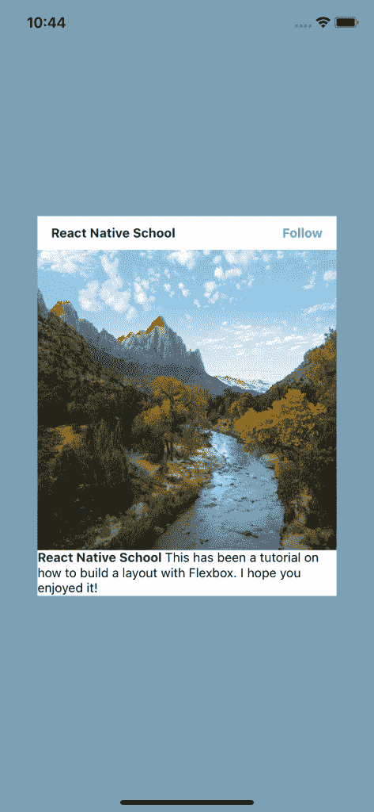

最后是页脚。我们在这里需要做的就是设置填充！这是为什么呢？因为我们已经嵌套了我们的`Text`组件并对 name 部分应用了样式，所以我们不需要担心这里的布局。更聪明地工作，而不是更努力！

下面是最终结果:

```
// finished.js

import React from "react";
import { StyleSheet, View, Text, Image, Dimensions } from "react-native";

export default function App() {
  return (
    <View style={styles.container}>
      <View style={styles.card}>
        <View style={styles.header}>
          <Text style={styles.nameText}>React Native School</Text>
          <Text style={styles.followText}>Follow</Text>
        </View>
        <Image
          style={styles.image}
          resizeMode="cover"
          source={{
            uri:
              "<https://images.pexels.com/photos/3225517/pexels-photo-3225517.jpeg?cs=srgb&dl=pexels-michael-block-3225517.jpg&fm=jpg>",
          }}
        />
        <View style={styles.footer}>
          <Text>
            <Text style={styles.nameText}>{`React Native School `}</Text>
            This has been a tutorial on how to build a layout with Flexbox. I
            hope you enjoyed it!
          </Text>
        </View>
      </View>
    </View>
  );
}

const screen = Dimensions.get("screen");
const styles = StyleSheet.create({
  container: {
    flex: 1,
    backgroundColor: "#7CA1B4",
    alignItems: "center",
    justifyContent: "center",
  },
  card: {
    backgroundColor: "#fff",
    width: screen.width * 0.8,
  },
  header: {
    flexDirection: "row",
    justifyContent: "space-between",
    paddingHorizontal: 15,
    paddingVertical: 10,
  },
  image: {
    height: screen.width * 0.8,
  },
  footer: {
    paddingHorizontal: 15,
    paddingVertical: 10,
  },
  nameText: {
    fontWeight: "bold",
    color: "#20232a",
  },
  followText: {
    fontWeight: "bold",
    color: "#0095f6",
  },
});

```

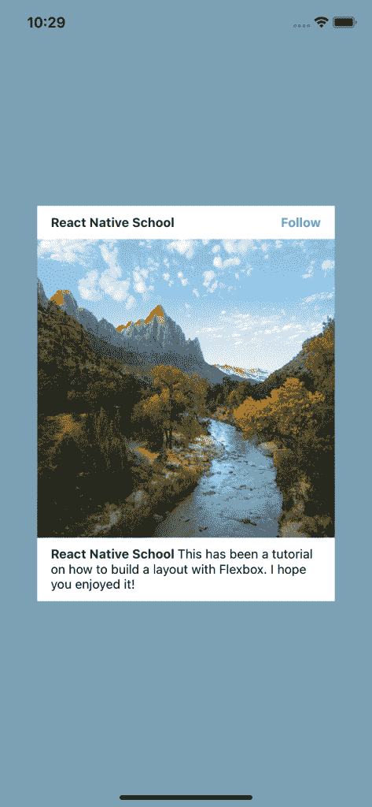

这就是在 React Native 中使用 flexbox 构建布局的介绍！Flexbox 是一个动态且强大的工具，非常适合移动环境。

要了解更多关于一些更模糊的属性，请查看 React Native 的文档。

## [LogRocket](https://lp.logrocket.com/blg/react-native-signup) :即时重现 React 原生应用中的问题。

[](https://lp.logrocket.com/blg/react-native-signup)

[LogRocket](https://lp.logrocket.com/blg/react-native-signup) 是一款 React 原生监控解决方案，可帮助您即时重现问题、确定 bug 的优先级并了解 React 原生应用的性能。

LogRocket 还可以向你展示用户是如何与你的应用程序互动的，从而帮助你提高转化率和产品使用率。LogRocket 的产品分析功能揭示了用户不完成特定流程或不采用新功能的原因。

开始主动监控您的 React 原生应用— [免费试用 LogRocket】。](https://lp.logrocket.com/blg/react-native-signup)

## 你的前端是否占用了用户的 CPU？

随着 web 前端变得越来越复杂，资源贪婪的特性对浏览器的要求越来越高。如果您对监控和跟踪生产环境中所有用户的客户端 CPU 使用情况、内存使用情况等感兴趣，

[try LogRocket](https://lp.logrocket.com/blg/css-signup)

.

[](https://lp.logrocket.com/blg/css-signup)[https://logrocket.com/signup/](https://lp.logrocket.com/blg/css-signup)

LogRocket 就像是网络和移动应用的 DVR，记录你的网络应用或网站上发生的一切。您可以汇总和报告关键的前端性能指标，重放用户会话和应用程序状态，记录网络请求，并自动显示所有错误，而不是猜测问题发生的原因。

现代化您调试 web 和移动应用的方式— [开始免费监控](https://lp.logrocket.com/blg/css-signup)。