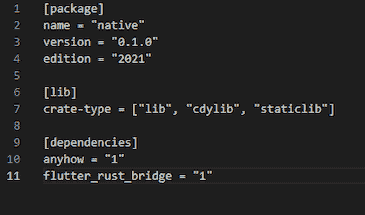
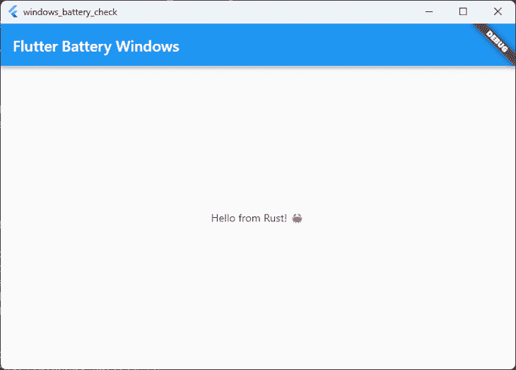
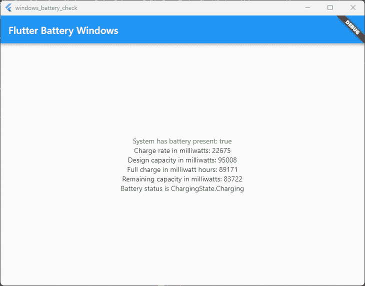

# 使用 Flutter Rust Bridge 进行跨平台开发

> 原文：<https://blog.logrocket.com/using-flutter-rust-bridge-cross-platform-development/>

有时候，在跨平台开发中，我们需要在特定平台的基础上执行某些代码。对于 Flutter 应用程序，我们可以从一个丰富的插件库中使用许多平台的原生功能，而不必编写自己的实现，所以这可能不会太令人生畏。

然而，随着我们的需求变得越来越小众，我们可能会发现一个插件并不存在，以利用某个功能。这时，我们需要考虑编写自己的特定于平台的代码。

您所针对的平台已经有了一种语言，您可以使用它来实现该功能。例如，在 Android 上，你可以使用 Kotlin 或 Java，而在 Windows 上，你可以使用 C++。

所以，我们需要回答的第一个问题是:为什么我们会考虑将 Rust 用于我们的特定于平台的语言？

向前跳:

## 使用带颤振的铁锈的案例

假设我们需要获取用户当前使用的设备的当前电池电量。如果没有插件提供这种功能，我们至少需要考虑两件事:

*   如何在我们的原生代码和 Flutter 之间传输数据
*   特定于平台的语言(如 C++/Kotlin/Swift/etc)

现在让我们来探讨一下这些挑战。

### 在本机代码和 Flutter 之间传输数据

如果我们有很多数据要在 Flutter 应用程序和本地代码之间传输，我们需要创建绑定来来回回地传输数据。在这个过程中涉及到相当多的样板文件，当我们的实现发生变化时，不得不更新这些绑定，这可能会令人沮丧和耗时。

幸运的是，有一个名为 Pigeon 的[包可以为开发者自动完成相当多的工作。这对我们的处境有帮助吗？](https://pub.dev/packages/pigeon)

快速浏览一下 Pigeon 支持平台的文档，我们会发现 Pigeon 支持生成以下内容:

*   iOS 的目标-C 代码([可供 Swift](https://developer.apple.com/documentation/swift/imported_c_and_objective-c_apis/importing_objective-c_into_swift) 访问)
*   iOS 的实验性 Swift 代码
*   Android 的 Java 代码(可由 Kotlin 访问)
*   Android 的实验性 Kotlin 代码
*   Windows 的实验性 C++代码

尽管 Kotlin 和 Swift 在目标移动平台上被采用，但鸽子对这些平台的支持仍处于试验阶段。

这对移动应用来说没什么大不了的，因为你可以从 Kotlin 调用 Java 代码，从 Swift 调用 Objective-C 代码。这允许您在应用程序中利用生成的鸽子代码。然而，桌面和网络应用是另一回事。

鸽子对 Windows 的支持是实验性的，对 Linux 的支持是不存在的。如果你希望把你的应用程序投入生产，使用一个实验性的生成器感觉不是一个好主意。无论如何，对于 Linux 或 web，您都要回到手工编写平台绑定。

如果你正在编写一个面向许多平台的应用程序，尤其是当你的应用程序面向一个鸽子支持处于试验阶段或不存在的平台时，这可能会成为一件苦差事。这不是一个难以管理的工作量，但它仍然是一个工作量。

### 使用特定于平台的语言的缺点

就其本质而言，Flutter 是一种跨平台语言。这意味着，一些编写 Flutter 应用程序的人可能没有遇到真正的平台特定语言，如 Kotlin 或 Swift。

在这些情况下，在 StackOverflow 中搜索一个实现并尝试猜测您的方法并不困难。Kotlin 和 Swift 将为您管理内存，在对象不再被访问时处理它们，因此更难(尽管不是不可能)引入内存泄漏。

在 Windows 和 Linux 上，这是一个完全不同的命题。

要实现原生功能，你必须使用 C++。由于 Pigeon 支持在 Windows 上是实验性的，在 Linux 上是不存在的，所以你不仅要用一种你可能不懂的语言编写你的特定于平台的代码，还要编写你的绑定代码。

让这个命题变得更加困难的事实是，你必须管理你自己的记忆和跟踪你自己的参考。最重要的是，任何发生在本机层的未被捕获的异常都将导致您的应用程序在桌面上崩溃。

简而言之，即使您可以创建绑定代码，您也只能绑定到您的(如果您是初学者)潜在的非常不安全的代码。不是很吸引人。

## 如何使用锈和颤振锈桥解决这些问题

为了在我们的 Flutter 项目中使用 Rust，我们必须使用[社区生产的](https://github.com/fzyzcjy/flutter_rust_bridge) `[flutter_rust_bridge](https://github.com/fzyzcjy/flutter_rust_bridge)` [包](https://github.com/fzyzcjy/flutter_rust_bridge)。

这个包拥有广泛的平台支持，包括 Android、iOS、Windows、Linux、macOS 和 Web。因此，无论你的目标是什么平台，你都可以使用 Rust 和 Flutter Rust Bridge。

快速回顾锈桥和颤振锈桥的好处，它成为一个相当引人注目的案例。

首先，Flutter Rust Bridge 会为您生成所有的绑定代码，并支持异步操作，比如发送到一个`Stream`。

其次， [Rust 是一种更容易使用的语言](https://blog.logrocket.com/why-is-rust-popular/)，也比 Windows 上的 C++更安全。

此外，你可以在你的 Rust 项目中使用 Rust crates 来利用本地功能，而不是编写你自己的实现。

最后，Rust 代码中未被捕获的异常通过一个`panic`转移到 Flutter，您可以相应地查看和排除故障。与导致桌面崩溃的 Windows 本机未捕获异常相比，这是一种更好的体验。

为了演示这一点，让我们创建一个简单的 Flutter 应用程序，它可以获取运行它的设备的当前电池电量。

## 创建我们的颤振锈桥项目

首先，让我们为`flutter_rust_bridge`安装一些依赖项。这是 Rust 编程语言和 LLVM。

从[网站](https://www.rust-lang.org/tools/install)下载并安装 Rust 开始。在命令窗口中，运行以下命令:

```
winget install -e --id LLVM.LLVM

```

这将下载并设置 LLVM。

如果你正在用 Flutter 和 Rust 创建一个新项目，你可以从 Github 中克隆这个模板库。这个模板是现成的，包含了让 Rust 在你的 Flutter 项目中工作所需的所有零碎东西。然后，您可以跳到本教程的“编写 Rust 代码”部分。

但是，如果您有一个现有的带有 Flutter 的项目，并且想要添加 Rust，请继续阅读。如果你对 Rust 如何集成到 Flutter 项目中感到好奇，这也会有所帮助。

在我的例子中，我们将把 Rust 与我通过运行`flutter create windows_battery_check`创建的一个全新的 Flutter 项目集成在一起。

因为我们将要对您的项目进行低级别的更改，所以现在是将您的代码签入您的源代码控制系统的理想时机。这样，如果我们不小心破坏了您的项目，就很容易撤销。

### 配置 Rust 项目

让我们浏览一下 `[flutter_rust_bridge](https://cjycode.com/flutter_rust_bridge/integrate.html)`上的[文档，以了解我们如何将 Rust 集成到我们的项目中。](https://cjycode.com/flutter_rust_bridge/integrate.html)

这本身并不复杂。然而，如果我们做错了任何一步，我们的项目将无法构建，并且很难找出原因。我还会对我们正在做的事情做一些解释，以帮助你理解如果这也是你第一次接触铁锈会发生什么。

首先，导航到您的 Flutter 项目。在项目中，从命令行执行`cargo new native --lib`。

注意`native`只是 Rust 项目的项目名称。如果愿意，您可以更改它，但是请记住，每次我们在本文的代码示例中引用它时，您都必须更新它。

接下来，在本地目录中，打开`cargo.toml`。在`[dependencies]`标题下，添加以下内容:

```
flutter_rust_bridge = "1"

```

在`[package]`下增加以下条目:

```
[lib]
crate-type = ["lib", "cdylib", "staticlib"]

```

我们的`cargo.toml`文件现在应该是这样的:



对于上下文，`[cargo.toml](https://blog.logrocket.com/demystifying-cargo-in-rust/#cargolockvscargotoml)` [是包含关于我们 rust 项目的](https://blog.logrocket.com/demystifying-cargo-in-rust/#cargolockvscargotoml)信息的文件。这个文件还包含了我们的项目所依赖的其他包——或者当处理 Rust 时，它们被称为 crates。

我们继续。在`native`目录中，从命令提示符或终端执行以下命令:

```
cargo install flutter_rust_bridge_codegen
flutter pub add --dev ffigen && flutter pub add ffi

```

这将 Rust 的代码生成工具添加到 Rust 项目中，并将 FFI 生成位添加到 Flutter 项目中。

### 配置我们的颤振项目

在我们的`native`目录中，运行以下命令:

```
flutter pub add flutter_rust_bridge
flutter pub add -d build_runner
flutter pub add -d freezed
flutter pub add freezed_annotation

```

这些组件实现了以下几点:

*   `flutter_rust_bridge`——颤振锈桥库的“颤振侧”部分
*   `build_runner` —用于生成平台绑定中使用的 Dart 代码
*   `freezed` —用于将物体从生锈状态转移到颤动状态

### 检查我们的配置

我们已经涉及了相当多的东西，所以让我们花一点时间来检查我们的设置到目前为止是好的。如果我们不小心跳过了一个包或者犯了一个错误，什么都不会工作，并且很难找出原因。

我们的`native/config.toml`文件应该是这样的:

```
[package]
name = "native"
version = "0.1.0"
edition = "2021"

# See more keys and their definitions at https://doc.rust-lang.org/cargo/reference/manifest.html

[dependencies]
anyhow = "1"
flutter_rust_bridge = "1"

```

同时，我们的`pubspec.yaml`应该有这些依赖关系:

```
dependencies:
  flutter:
    sdk: flutter
  cupertino_icons: ^1.0.2
  ffi: ^2.0.1
  flutter_rust_bridge: ^1.49.1
  freezed_annotation: ^2.2.0

dev_dependencies:
  flutter_test:
    sdk: flutter
  flutter_lints: ^2.0.0
  ffigen: ^7.2.0
  build_runner: ^2.3.2
  freezed: ^2.2.1

```

### 设置我们的 Windows 项目集成

终于到了将我们的原生 Rust 项目与 Flutter 整合的时候了。为此，下载 Rust 使用的`[cmake](https://raw.githubusercontent.com/Desdaemon/flutter_rust_bridge_template/main/windows/rust.cmake)` [文件，并将其放在项目的`windows`目录中。然后，在第 57 行的`include(flutter/generated_plugins.cmake)`之后，添加以下一行:](https://raw.githubusercontent.com/Desdaemon/flutter_rust_bridge_template/main/windows/rust.cmake)

```
include(./rust.cmake)

```

### 回到我们的 Rust 项目配置

现在，在您选择的编辑器中，从`native`目录中打开 Rust 项目。在`src`目录下创建一个名为`api.rs`的新文件。然后，打开`lib.rs`文件，将以下内容添加到文件的顶部:

```
mod api;

```

现在让我们编写一些非常基本的 Rust 代码，我们可以从我们的 Flutter 应用程序中调用它们。在我们的`api.rs`文件中，让我们添加一个非常简单的函数来测试我们的集成:

```
pub fn helloWorld() -> String {
    String::from("Hello from Rust! 🦀")
}

```

### 生成平台绑定代码

现在终于到了生成代码的时候了，Flutter 将使用这些代码来调用 Rust 功能。在项目的根目录下，运行以下命令:

```
flutter_rust_bridge_codegen --rust-input native/src/api.rs --dart-output lib/bridge_generated.dart --dart-decl-output lib/bridge_definitions.dart

```

为了保持理智，您应该将这个命令保存到一个类似于`generate_bindings.bat`的文件中。在更新 Rust 代码并公开任何新功能后，您需要重新运行它。

打开你的颤振项目。在`lib`目录中，添加以下`native.dart`文件:

```
// This file initializes the dynamic library and connects it with the stub
// generated by flutter_rust_bridge_codegen.

import 'dart:ffi';

import 'dart:io' as io;

import 'package:windows_battery_check/bridge_generated.dart';

const _base = 'native';

// On MacOS, the dynamic library is not bundled with the binary,
// but rather directly **linked** against the binary.
final _dylib = io.Platform.isWindows ? '$_base.dll' : 'lib$_base.so';

final api = NativeImpl(io.Platform.isIOS || io.Platform.isMacOS
    ? DynamicLibrary.executable()
    : DynamicLibrary.open(_dylib));

```

就这样，我们结束了！我们的颤振项目现在可以调用 Rust 代码。

### 从颤动中呼唤铁锈

在我们的`main.dart`中，我们将调用非常简单的 Rust 代码。我们的小部件是这样做的:

```
import 'package:windows_battery_check/native.dart';
...

class HomePage extends StatelessWidget {
  const HomePage({Key? key}) : super(key: key);

  @override
  Widget build(BuildContext context) {
    return Scaffold(
      appBar: AppBar(
        title: Text("Flutter Battery Windows"),
      ),
      body: Center(
        child: FutureBuilder( // All Rust functions are called as Future's
          future: api.helloWorld(), // The Rust function we are calling.
          builder: (context, data) {
            if (data.hasData) {
              return Text(data.data!); // The string to display
            }
            return Center(
              child: CircularProgressIndicator(),
            );
          },
        ),
      ),
    );
  }
}

```

运行项目会出现以下窗口:



我们的应用程序有效！现在让我们实际获取电池统计数据。

首先，让我们用检索 Windows 上的电池状态所需的依赖项来更新我们的`cargo.toml`。我们需要添加 Windows 机箱来利用 Windows API 的功能，我们还需要专门从这个机箱加载某些功能。

我们在`cargo.toml`中的依赖关系将如下所示:

```
[dependencies]
anyhow = "1.0.66"
flutter_rust_bridge = "1"

[target.'cfg(target_os = "windows")'.dependencies]
windows = {version = "0.43.0", features =["Devices_Power", "Win32_Foundation", "Win32_System_Power", "Win32_System_Com", "Foundation", "System_Power"]}

```

现在，是时候实现我们的应用程序实现的实际功能了。我们的应用实现了两个功能:

1.  检查系统中是否有电池
2.  随着时间的推移发出电池状态更新

现在让我们实现这些功能。

### 检查电池是否存在

我们从系统中检索当前电池状态的函数如下所示:

```
pub fn getBatteryStatus() -> Result<bool> {
    // https://learn.microsoft.com/en-us/windows/win32/api/winbase/ns-winbase-system_power_status
    let mut powerStatus: SYSTEM_POWER_STATUS = SYSTEM_POWER_STATUS::default();
    unsafe {
        GetSystemPowerStatus(&mut powerStatus);
        Ok(powerStatus.BatteryFlag != 128)
    }
}

```

本质上，我们为`SYSTEM_POWER_STATUS`创建一个容器，用默认值初始化它，然后将它传递给 GetSystemPowerStatus 函数。然后，[我们可以使用 API 文档来理解结果](https://learn.microsoft.com/en-us/windows/win32/api/winbase/ns-winbase-system_power_status)。

在这种情况下，`128`表示没有电池。只要这个返回值不等于`128`，就应该有电池存在。

### 随着时间的推移接收电池更新

为了能够随着时间的推移接收电池更新，我们的应用程序必须通过`Stream`发送结果。幸运的是，`StreamSink`带有`flutter_rust_bridge`，所以通过流发送事件很简单。

在我们的`api.rs`中，靠近文件的顶部，添加一个定义我们的`Stream`的`RwLock`:

```
static BATTERY_REPORT_STREAM: RwLock<Option<StreamSink<BatteryUpdate>>> = RwLock::new(None);

```

然后，让我们创建一个名为`battery_event_stream`的新函数，它将这个`RwLock`的值赋给被传递给 Rust 的`Stream`:

```
pub fn battery_event_stream(s: StreamSink<BatteryUpdate>) -> Result<()> {
    let mut stream = BATTERY_REPORT_STREAM.write().unwrap();
    *stream = Some(s);
    Ok(())
}

```

因为我们直接与 Windows API 交互，我们需要阅读关于[电池报告如何在 Windows](https://learn.microsoft.com/is-is/uwp/api/windows.devices.power.batteryreport?view=winrt-19041) 上工作的文档。通过阅读这些 API 文档，我们可以理解`BatteryStruct`应该是什么样子，以及从`ChargingState`返回的值是什么意思。

数据模型如下所示:

```
#[derive(Debug)]
pub struct BatteryUpdate {
    pub charge_rates_in_milliwatts: Option<i32>,
    pub design_capacity_in_milliwatt_hours: Option<i32>,
    pub full_charge_capacity_in_milliwatt_hours: Option<i32>,
    pub remaining_capacity_in_milliwatt_hours: Option<i32>,
    pub status: ChargingState,
}

#[derive(Debug)]
pub enum ChargingState {
    Charging = 3,
    Discharging = 1,
    Idle = 2,
    NotPresent = 0,
    Unknown = 255,
}

```

随着我们的流被初始化，我们的数据模型被设置，最后是时候连接事件生成了。

为此，让我们创建一个`init`函数来设置订阅，并在电池状态改变时将事件发送到流中。当我们这样做时，我们需要小心，因为当设备被拔出时，某些属性(如`ChargeRateInMilliwatts`)将返回 null。

幸运的是，通过在 Rust 中使用模式匹配，很容易安全地处理这些空值，正如我们在这里看到的:

```
pub fn init() {
    Battery::AggregateBattery().unwrap().ReportUpdated(&TypedEventHandler::<Battery, IInspectable>::new(|battery, inspectable| {
        let agg_battery = Battery::AggregateBattery();
        let report = agg_battery.unwrap().GetReport().unwrap();

        let battery_outcome = BatteryUpdate {
            charge_rates_in_milliwatts: match report.ChargeRateInMilliwatts() {
                Ok(charge_rate) => {
                    Some(charge_rate.GetInt32().unwrap())
                }
                Err(_) => {
                    None
                }
            },
            design_capacity_in_milliwatt_hours: match report.DesignCapacityInMilliwattHours() {
                Ok(design_capacity) => {
                    Some(design_capacity.GetInt32().unwrap())
                }
                Err(_) => {
                    None
                }
            },
            full_charge_capacity_in_milliwatt_hours: match report.FullChargeCapacityInMilliwattHours() {
                Ok(full_charge) => {
                    Some(full_charge.GetInt32().unwrap())
                }
                Err(_) => {
                    None
                }
            },
            remaining_capacity_in_milliwatt_hours: match report.RemainingCapacityInMilliwattHours() {
                Ok(remaining_capacity) => {
                    Some(remaining_capacity.GetInt32().unwrap())
                }
                Err(_) => {
                    None
                }
            },
            status: match report.Status().unwrap().0 {
                3 => Charging,
                1 => Discharging,
                2 => Idle,
                0 => NotPresent,
                _ => Unknown
            },
        };

        println!("Handler Update{:?}", battery_outcome);
        match BATTERY_REPORT_STREAM.try_read() {
            Ok(s) => {
                s.as_ref().unwrap().add(battery_outcome);
            }
            Err(_) => {
                println!("Error when writing battery status.");
            }
        }
        Ok(())
    })).expect("Could not subscribe to battery updates");
}

```

在我们的`api.rs`中有了这段代码之后，是时候从命令行重新运行我们之前保存的命令了:

```
flutter_rust_bridge_codegen --rust-input native/src/api.rs --dart-output lib/bridge_generated.dart --dart-decl-output lib/bridge_definitions.dart

```

### 在 Flutter 应用程序中显示电池结果

因为我们已经将 Rust 项目与我们的 Flutter 项目集成在一起，所以我们所要做的就是更新我们的代码以实现以下目标:

1.  调用`init`函数开始监听 Rust 库中的事件
2.  使用`FutureBuilder`显示系统是否有电池
3.  使用`StreamBuilder`显示电池状态的更新

我们的`HomePage`小部件现在看起来如下，因为它可以直接调用 Rust 库👏：

```
class HomePage extends StatefulWidget {
  const HomePage({Key? key}) : super(key: key);

  @override
  State<HomePage> createState() => _HomePageState();
}

class _HomePageState extends State<HomePage> {

  @override
  void initState() {
    api.init();
    super.initState();
  }

  @override
  Widget build(BuildContext context) {
    return Scaffold(
      appBar: AppBar(
        title: Text("Flutter Battery Windows"),
      ),
      body: Center(
        child: Column(
          crossAxisAlignment: CrossAxisAlignment.center,
          mainAxisAlignment: MainAxisAlignment.center,
          children: [
            FutureBuilder( // For when results emit once
              future: api.getBatteryStatus(),
              builder: (context, data) {
                return Text(
                  'System has battery present: ${data.data}',
                  style: TextStyle(
                      color: (data.data ?? false) ? Colors.green : Colors.red),
                );
              },
            ),
            StreamBuilder( // For when there are results over time
              stream: api.batteryEventStream(),
              builder: (context, data) {
                if (data.hasData) {
                  return Column(
                    children: [
                      Text(
                          "Charge rate in milliwatts: ${data.data!.chargeRatesInMilliwatts.toString()}"),
                      Text(
                          "Design capacity in milliwatts: ${data.data!.designCapacityInMilliwattHours.toString()}"),
                      Text(
                          "Full charge in milliwatt hours: ${data.data!.fullChargeCapacityInMilliwattHours.toString()}"),
                      Text(
                          "Remaining capacity in milliwatts: ${data.data!.remainingCapacityInMilliwattHours}"),
                      Text("Battery status is ${data.data!.status}")
                    ],
                  );
                }
                return Column(
                  children: [
                    Text("Waiting for a battery event."),
                    Text(
                        "If you have a desktop computer with no battery, this event will never come..."),
                    CircularProgressIndicator(),
                  ],
                );
              },
            ),
          ],
        ),
      ),
    );
  }
}

```

随着代码的更新，我们可以继续在 Windows 上运行我们的 Flutter 应用程序。几秒钟后(或者，如果您拔掉笔记本电脑的电源)，应该会显示以下内容:



随着时间的推移，当电池电量有更新时，这些值将通过流发出，UI 将自动更新。

## 结论

将 Rust 用于本机平台功能，尤其是在 Windows 上，可以使编写本机代码更加容易和安全。能够通过流接收事件也非常适合异步事件。

和往常一样，本指南中使用的代码示例可以从 Github 上获得。该存储库中有两个文件夹。

`batterytest`文件夹是一个独立的 Rust 控制台应用程序，它充当了我自己测试 Windows API 调用的沙箱。能够在添加 Flutter 解决方案之前检查我的调用是否正常，这本身就很有价值。

`windows_battery_check`文件夹包含完整的 Flutter 项目，包括 Rust 库和代码。

快乐发展！

## [log rocket](https://lp.logrocket.com/blg/rust-signup):Rust 应用的 web 前端的全面可见性

调试 Rust 应用程序可能很困难，尤其是当用户遇到难以重现的问题时。如果您对监控和跟踪 Rust 应用程序的性能、自动显示错误、跟踪缓慢的网络请求和加载时间感兴趣，

[try LogRocket](https://lp.logrocket.com/blg/rust-signup)

.

[](https://lp.logrocket.com/blg/rust-signup)

LogRocket 就像是网络和移动应用程序的 DVR，记录你的 Rust 应用程序上发生的一切。您可以汇总并报告问题发生时应用程序的状态，而不是猜测问题发生的原因。LogRocket 还可以监控应用的性能，报告客户端 CPU 负载、客户端内存使用等指标。

现代化调试 Rust 应用的方式— [开始免费监控](https://lp.logrocket.com/blg/rust-signup)。