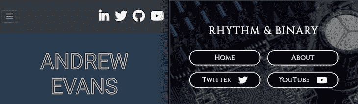
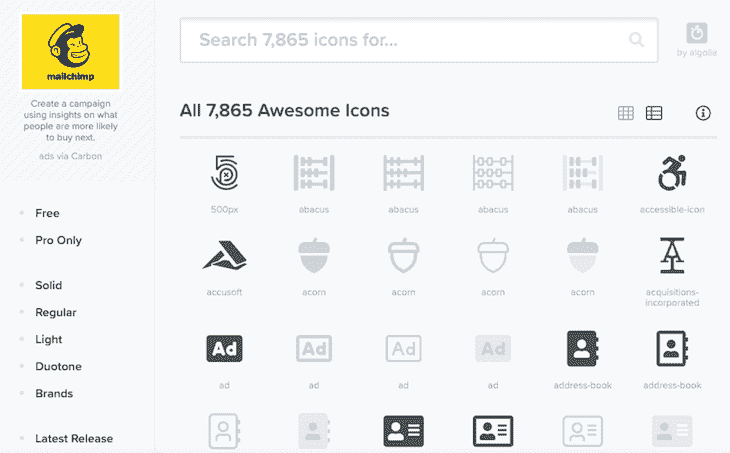
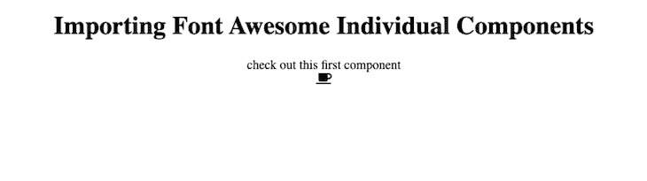
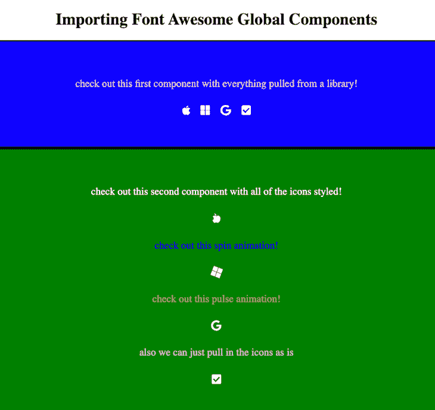

# React 使用字体 Awesome 5

> 原文：<https://blog.logrocket.com/using-font-awesome-5-with-react/>

如果你正在做一个前端项目， [Font Awesome](https://fontawesome.com/) 是一个非常棒的知名社交媒体图标的附加组件。它特别有助于显示代表 YouTube 或 Twitter 等其他资源链接的图标。

字体牛逼有一个伟大的文件集，可以用在几乎任何前端项目。有了 [React](https://reactjs.org/) ，Font Awesome 有了一个特殊的设置，为其库提供了一些导入，使使用它变得轻而易举。

在这篇文章中，我将介绍如何在 React 项目中设置字体 Awesome。我还将介绍如何在 React 组件中使用字体 Awesome 的一些基础知识。

我个人是字体牛逼的粉丝，因为它提供了大量的社交媒体图标。我也很喜欢这个文档，它的设置非常直观。你可以看看我如何在我的网站和我的个人博客上[使用字体 Awesome 的例子。](https://www.andrewevans.dev/)



I used Font Awesome icons for the LinkedIn, Twitter, GitHub, and YouTube icons specifically.

字体 Awesome 提供了许多不同的图标，从咖啡杯这样的基本图标到 YouTube 这样的知名品牌标志。如果你想看更多，你可以去看看他们的画廊。



版本 5 是最新的(稳定的)字体版本 Awesome，所以如果你刚开始使用它，你会想用它。查看[字体更新日志了解更多](https://fontawesome.com/changelog/latest)。

如果你愿意跟随我们开始教程，我在 GitHub 上的 [my repo 中存储了我的例子。我建议做一个克隆，因为我会在这篇文章中提到这个项目。](https://github.com/andrewevans0102/font-awesome-5-with-react)

## 设置您的 React 项目

现在，您已经有了 React 项目，并准备导入字体 Awesome 来在页面上显示一些社交媒体图标。第一步是使用 npm 来安装字体 Awesome 的核心依赖项:

```
npm i --save @fortawesome/fontawesome-svg-core
npm install --save @fortawesome/free-solid-svg-icons
npm install --save @fortawesome/react-fontawesome

```

接下来，你可能想安装字体牛逼提供的免费品牌图标 SVGs。其中包括苹果、微软等公司的品牌图标。继续使用以下内容安装它们:

```
npm install --save @fortawesome/free-brands-svg-icons
npm install --save @fortawesome/free-regular-svg-icons

```

这就是设置`free`所需的全部内容，但是如果您想升级您的帐户并使用`pro`图标，您也可以选择运行以下内容:

```
npm i --save @fortawesome/pro-solid-svg-icons
npm i --save @fortawesome/pro-regular-svg-icons
npm i --save @fortawesome/pro-light-svg-icons
npm i --save @fortawesome/pro-duotone-svg-icons

```

出于本文的目的，我只打算介绍免费版。如果你想了解更多关于专业版的信息，请点击这里查看关于价格[https://fontawesome.com/plans](https://fontawesome.com/plans)的文档。

好了，有了这些 npm 导入，现在就可以在项目中引用字体 Awesome 了。

## 参考字体真棒图书馆，两个进口的故事

使用字体 Awesome 时，它提供了两种不同的方式来引用其库。您使用它们的动机将取决于您想要完成的目标以及您的项目需求。

第一种方法是在引用它们的任何组件中单独导入它们:

```
// copied from the official docs at https://fontawesome.com/how-to-use/on-the-web/using-with/react
import ReactDOM from "react-dom";
import { FontAwesomeIcon } from "@fortawesome/react-fontawesome";
import { faCoffee } from "@fortawesome/free-solid-svg-icons";

const element = <FontAwesomeIcon icon={faCoffee} />;

ReactDOM.render(element, document.body);

```

> 如果您正在跟随我的示例项目，这就是您在`method1`文件夹中看到的内容。

这种工作方式使得使用它们变得极其简单。它还允许您将导入范围缩小到最终构建所需的范围。然而，如果你在多个页面上使用它，这可能是一个真正的痛苦。

第二种导入方法是全局导入(也称为作为库导入)。方法是首先将它们导入应用程序的入口点，然后在子组件中引用导入，如下所示:

```
// copied from the official docs at https://fontawesome.com/how-to-use/on-the-web/using-with/react

// app.js
import ReactDOM from "react-dom";
import { library } from "@fortawesome/fontawesome-svg-core";
import { fab } from "@fortawesome/free-brands-svg-icons";
import { faCheckSquare, faCoffee } from "@fortawesome/free-solid-svg-icons";
library.add(fab, faCheckSquare, faCoffee);

```

现在，您可以通过以下方式在任何子组件中直接引用图标:

```
// copied from the official docs at https://fontawesome.com/how-to-use/on-the-web/using-with/react

import React from "react";
import { FontAwesomeIcon } from "@fortawesome/react-fontawesome";
export const Beverage = () => (
  <div>
    <FontAwesomeIcon icon="check-square" />
    Your <FontAwesomeIcon icon="coffee" /> is hot and ready!
  </div>
);

```

> 如果您一直关注我的示例项目，您会在`method2`文件夹中看到这个。

## 使用字体 Awesome API

一旦你把这个库导入到你的项目中，你就有了很多很酷的选项来处理图标。

字体 Awesome 有大多数图标的固体和常规版本。您可以设置它们的宽度，甚至通过将值传递给组件的 API 来旋转图像本身:

```
// copied from the official docs https://fontawesome.com/how-to-use/on-the-web/using-with/react
// fixed width
<FontAwesomeIcon icon="coffee" fixedWidth />
// inverse
<FontAwesomeIcon icon="coffee" inverse />
// shown in a list
<FontAwesomeIcon icon="coffee" listItem />
// rotated
<FontAwesomeIcon icon="coffee" rotation={90} />
<FontAwesomeIcon icon="coffee" rotation={180} />
<FontAwesomeIcon icon="coffee" rotation={270} />
// flipped
<FontAwesomeIcon icon="coffee" flip="horizontal" />
<FontAwesomeIcon icon="coffee" flip="vertical" />
<FontAwesomeIcon icon="coffee" flip="both" />
// bordered
// https://fontawesome.com/how-to-use/on-the-web/styling/bordered-pulled-icons
<FontAwesomeIcon icon="coffee" border />
// pulled
<FontAwesomeIcon icon="coffee" pull="left" />
<FontAwesomeIcon icon="coffee" pull="right" />
// opacity
<FontAwesomeIcon icon={['fad', 'coffee']} />
<FontAwesomeIcon icon={['fad', 'coffee']} swapOpacity />
// custom styles
<FontAwesomeIcon icon="spinner" className="highlight" />
// power transforms
<FontAwesomeIcon icon="coffee" transform="shrink-6 left-4" />
<FontAwesomeIcon icon="coffee" transform={{ rotate: 42 }} />
// masking icons
<FontAwesomeIcon icon="coffee" mask={['far', 'circle']} />

```

您还可以将它们分层，甚至指定自定义类或类似源 SVG 的东西:

```
// copied from the official docs https://fontawesome.com/how-to-use/on-the-web/using-with/react
// layering icons
<span className="fa-layers fa-fw">
  <FontAwesomeIcon icon="square" color="green" />
  <FontAwesomeIcon icon="check" inverse transform="shrink-6" />
</span>
// using svgs
<FontAwesomeIcon icon="coffee" symbol />
<FontAwesomeIcon icon="coffee" symbol="beverage-icon" />

```

您甚至可以通过指定旋转或脉动等行为来激活图标:

```
// copied from the official docs https://fontawesome.com/how-to-use/on-the-web/using-with/react
<FontAwesomeIcon icon="spinner" spin />
<FontAwesomeIcon icon="spinner" pulse />

```

如果您想在单元测试中模拟图标的值，您也可以通过下面的方法来实现:

```
// copied from the official docs https://fontawesome.com/how-to-use/on-the-web/using-with/react
import React from "react";
export function FontAwesomeIcon(props) {
  return <i classname="fa"></i>;
}

```

如果你想了解所有不同的选项，请查看[安装文档](https://fontawesome.com/how-to-use/on-the-web/using-with/react)。

## 让我们看一些例子

正如我在介绍中提到的，我建立了一个 [GitHub 项目](https://github.com/andrewevans0102/font-awesome-5-with-react),展示了很多这样的例子，并为您提供了一个可行的解决方案。如果您还没有，请在继续之前克隆它。

我的项目有两个例子，每个例子都包含了在项目中导入字体 Awesome 的不同方法:

*   `method1`文件夹有一个直接引用所用字体 Awesome 组件的实现。
*   作为全局导入字体 Awesome 的实现的`method2`文件夹(库)

对于这两个项目，如果您进入文件夹，您应该能够看到它们在执行以下代码后运行:

```
npm install
npm run start

```

第一个项目非常简单，只显示了一个咖啡图标:



它直接在组件中导入图标，如下所示:

```
import { FontAwesomeIcon } from "@fortawesome/react-fontawesome";
import { faCoffee } from "@fortawesome/free-solid-svg-icons";
const FirstComponent = () => {
  return (
    <section>
      <div>check out this first component</div>
      <FontAwesomeIcon icon={faCoffee} />
    </section>
  );
};
export default FirstComponent;

```

第二个项目全局导入几个图标，然后在两个子组件中引用它们，如下所示:



它首先在`App.js`文件中全局导入组件:

```
import ReactDOM from "react-dom";
import "./App.css";
import { library } from "@fortawesome/fontawesome-svg-core";
import { fab } from "@fortawesome/free-brands-svg-icons";
import { faCheckSquare, faCoffee } from "@fortawesome/free-solid-svg-icons";
import FirstComponent from "./components/first-component";
import SecondComponent from "./components/second-component";
library.add(fab, faCheckSquare, faCoffee);
function App() {
  return (
    <main>
      <h1>Importing Font Awesome Global Components</h1>
      <FirstComponent />
      <SecondComponent />
    </main>
  );
}
export default App;

```

然后，在子组件中，它引用了被拉入的特定字体 Awesome 图标:

```
import "../App.css";
import { FontAwesomeIcon } from "@fortawesome/react-fontawesome";
const SecondComponent = () => {
  return (
    <section className="second-component">
      <div className="second-styled">
        check out this second component with all of the icons styled!
      </div>
      <FontAwesomeIcon
        icon={["fab", "apple"]}
        className="second-icon"
        rotation={90}
        flip="horizontal"
        size="lg"
      />
      <div className="second-spin">check out this spin animation!</div>
      <FontAwesomeIcon
        icon={["fab", "microsoft"]}
        className="second-icon"
        size="lg"
        spin
      />
      <div className="second-pulse">check out this pulse animation!</div>
      <FontAwesomeIcon
        icon={["fab", "google"]}
        className="second-icon"
        size="lg"
        pulse
      />
      <div className="second-regular">
        also we can just pull in the icons as is
      </div>
      <FontAwesomeIcon icon="check-square" className="second-icon" size="lg" />
    </section>
  );
};
export default SecondComponent;

```

## 结束语

我希望你喜欢这篇文章，它帮助你开始使用字体牛逼和反应。我鼓励您查看我的示例项目，并阅读 Font Awesome 文档以了解更多信息。

感谢阅读！在 [andrewevans.dev](https://www.andrewevans.dev/) 上关注我，在 [@AndrewEvans0102](https://twitter.com/AndrewEvans0102) 的 Twitter 上与我联系。

## 使用 LogRocket 消除传统反应错误报告的噪音

[LogRocket](https://lp.logrocket.com/blg/react-signup-issue-free)

是一款 React analytics 解决方案，可保护您免受数百个误报错误警报的影响，只针对少数真正重要的项目。LogRocket 告诉您 React 应用程序中实际影响用户的最具影响力的 bug 和 UX 问题。

[ ](https://lp.logrocket.com/blg/react-signup-general) [  ](https://lp.logrocket.com/blg/react-signup-general) [LogRocket](https://lp.logrocket.com/blg/react-signup-issue-free)

自动聚合客户端错误、反应错误边界、还原状态、缓慢的组件加载时间、JS 异常、前端性能指标和用户交互。然后，LogRocket 使用机器学习来通知您影响大多数用户的最具影响力的问题，并提供您修复它所需的上下文。

关注重要的 React bug—[今天就试试 LogRocket】。](https://lp.logrocket.com/blg/react-signup-issue-free)