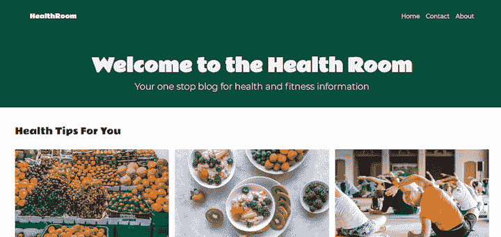
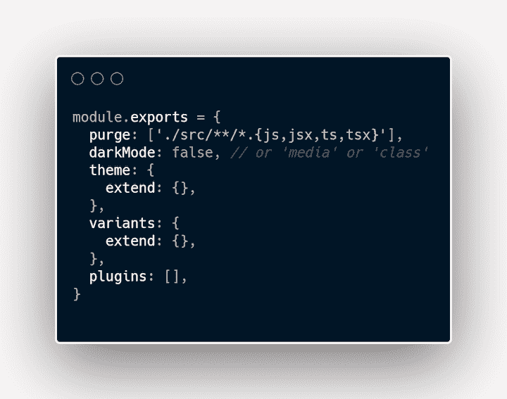
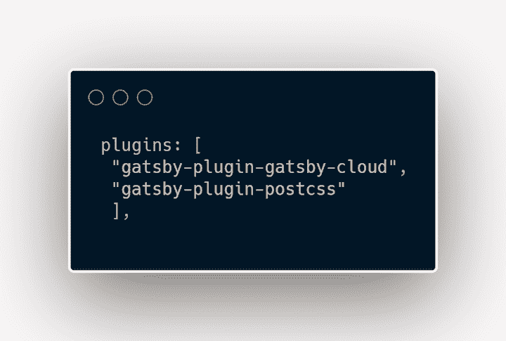
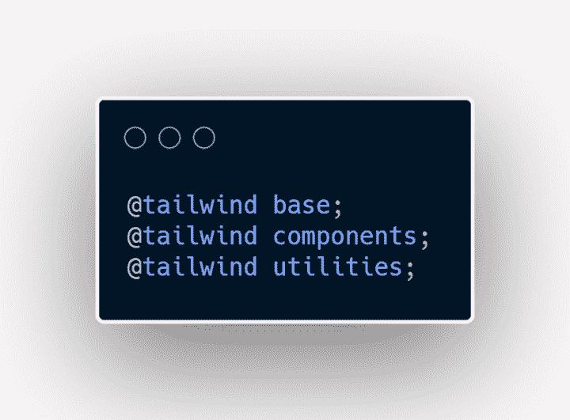
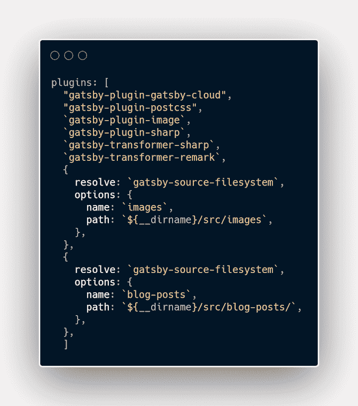
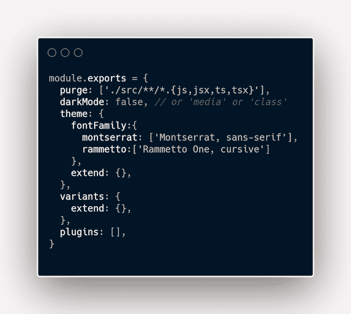
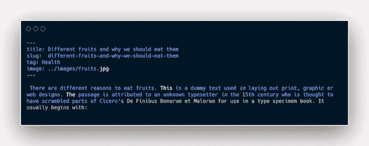
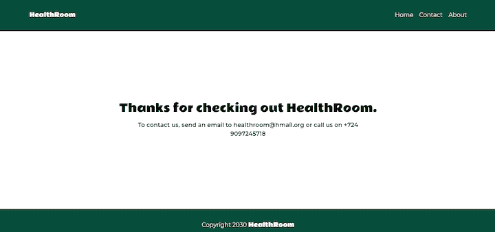
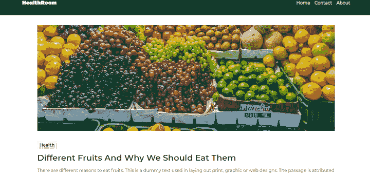

# 将 Gatsby 与 Tailwind CSS 结合使用:示例教程

> 原文：<https://blog.logrocket.com/using-gatsby-with-tailwind-css-a-tutorial-with-examples/>

如果您熟悉 Gatsby，您可能会意识到它有多快，以及它如何改进整体开发过程和性能。根据其官方[文档](https://www.gatsbyjs.com/docs/)，Gatsby 是“一个基于 React 的开源框架，用于创建网站和应用。无论你是在建立一个作品集网站或博客，还是一个高流量的电子商务商店或公司主页，这都是非常棒的。”

盖茨比的确是伟大的，因为他创造了很多东西。它帮助我们快速创建网站和应用程序，没有延迟。此外，它提供了各种各样的工具来帮助你尽快开始，不管你想要构建什么。正如我们将在本教程中演示的那样，您也可以从头开始构建和设计一个 Gatsby 应用程序。

对于样式，我们将使用[顺风 CSS](https://tailwindcss.com/docs) 。Tailwind 非常适合那些喜欢写 CSS 但不想为自己的风格创建单独文件的人。此外，使用 Tailwind CSS，可以为您创建实用程序类。你所要做的就是在你的项目中使用它们。

为了展示 Gatsby 和 Tailwind CSS 如何协同工作，我们将创建一个简单的健康和健身博客。在本教程中，我们将讲述以下内容:

成品应该是这样的:



本演示使用的图片均来自 Unsplash 你可以在我的 [Github 库](https://github.com/Iamhafsah/healthroom)中访问它们。

在本教程结束时，您应该能够使用 Tailwind CSS 来设计您的 Gatsby 项目。

## 建立一个盖茨比项目

在您的终端中，运行`npm init gatsby`。这将生成一个提示，其中包含帮助您设置 Gatsby 项目的指令。

按照说明为您的项目选择一个名称和文件夹。当它询问你是否将使用 CMS 时，选择“否，否则我将稍后添加它。”当被问及造型系统时，也要这样做。当它询问安装附加功能时，选择“在 Gatsby Cloud 上免费构建和托管”然后选择“完成”如果一切顺利，将为您生成一个 Gatsby 模板。

正如简介中提到的，我们将使用 Tailwind CSS 进行样式设计，所以让我们来设置它。

(注意:使用 Tailwind CSS 需要安装 Node.js 12.113.0 或更高版本。)

键入以下内容:

```
npm install -D gatsby-plugin-postcss [email protected] [email protected] [email protected]

```

你会注意到我们还安装了`gatsby-plugin-postcss`。这是因为 Tailwind CSS 是一个 PostCSS 插件，该插件帮助我们做一些繁重的工作。

安装完成后，通过键入`npx tailwindcss init -p`创建一个顺风配置文件。这将在您的项目文件夹中创建`tailwind.config`和`postcss.config`文件。配置文件允许您为样式创建配置。

让我们配置 Tailwind CSS 来删除所有我们在生产中不会用到的样式。这将在`tailwind.config`文件中完成。在 purge 数组中，输入`'./src/**/*.{js,jsx,ts,tsx}'.`你的 Tailwind CSS 配置文件应该是这样的:



在`gatsby-.config.js`中，通过在插件数组中添加`gatsby-plugin-postcss`来启用 PostCSS。Gatsby 配置文件现在应该如下所示:



在 src 文件夹中创建一个 styles 文件夹，并在其中创建一个. css 文件。你可以给它起任何你想要的名字；我将把我的命名为`global.css`,因为我的全球风格将被写入其中。

在 CSS 文件中，我们将使用`@tailwind`指令添加 Tailwind 的基础、实用程序和组件样式。

将以下内容添加到您的 CSS 文件中:



现在是 Tailwind CSS 设置的最后一部分，在项目文件夹的根目录下创建一个`gatsby-browser.js`文件，并使用`import "./src/styles/global.css".`导入 CSS 文件

现在我们可以开始在我们的项目中使用 Tailwind CSS 了！

## 通过插件使用 Gatsby

Gatsby 提供了各种插件来简化开发过程。我们将在项目中使用以下插件:

*   帮助我们阅读不同来源的文件。源代码可以包括我们的项目文件夹、WordPress、contentful 等等中的各种目录
*   帮助我们处理降价文件
*   `gatsby-plugin-image`和`gatsby-plugin-sharp`让我们能够处理《盖茨比》中的图像
*   让我们用动态图像工作

要安装它们，请键入以下内容:

```
npm install gatsby-plugin-image gatsby-plugin-sharp gatsby-source-filesystem gatsby-transformer-sharp gatsby-transformer-remark

```

您的`gatsby-config.js`应如下所示:



现在，让我们开始建设。

## 顺风 CSS 入门

在我们的`src`文件夹中，创建一个名为`blog-posts`的新文件夹。在`src`文件夹的索引文件中，删除所有现有内容并创建一个新的 React 组件。

在您的终端中运行`gatsby develop`，以便在我们工作时查看实时变化。现在您应该能够在`[http://localhost:8000/](http://localhost:8000/)`中看到您的更改。

我将使用[谷歌字体](https://fonts.google.com/)的 Montserrat 和 Rammetto 字体。有不同的方法来使用它，但是我将在我的`global.css`文件的顶部导入它。

在您的`tailwind.config`文件中，在主题对象中添加`fontFamily`。这允许您命名和使用多种字体。

下面是我的 Tailwind CSS 配置文件的样子:



如果你命名一个字体系列 Cabin，当你想在你的样式中应用它时，你可以简单地写`font-cabin`，Cabin 字体将被应用到你的文本中。

## 创建博客内容

我们将使用 [Markdown](https://blog.logrocket.com/how-to-build-a-markdown-plugin-for-your-gatsby-blog/) 创建我们的页面内容。在我的 [Github 存储库](https://github.com/Iamhafsah/healthroom)，`src/blog-posts`包含了一些我们可以在这个演示中使用的内容。

降价文件看起来像这样:



顶部的键/值对是页面的主要内容，包含关于页面的附加信息。

当我们创建完降价文件后，是时候创建一些组件了。

## 创建布局组件

我们将从布局组件开始，我们将使用它来创建跨页面重复的部分。布局中包含导航栏和页脚等部分。我们可以像创建 React 组件一样创建布局，并将其导入到我们希望它出现的所有页面中。

* * *

### 更多来自 LogRocket 的精彩文章:

* * *

让我们创建一个布局文件。

Gatsby 生成的模板为我们创建了一个 starter 文件夹结构。我们可以根据自己的口味进行修改。

在`src`文件夹中，创建一个组件文件夹。在`components`文件夹中，创建一个`Layout.js`文件。

在文件中，创建一个名为`Layout`的 React 组件。我们将在这个组件中创建我们的导航和页脚。

布局接受一个`children`道具。如果没有这个属性，使用布局组件的页面将无法正常工作。儿童道具充当页面布局中包含的任何内容。

这是我的`Layout.js`的样子:

```
import React from 'react'
import {Link} from 'gatsby'

const Layout = ({children}) => {
    const linkStyle = `
     Hover:opacity-70
     text-sm
     sm:text-lg
    `
    const logoStyle=`
    text-white 
    font-rammetto
    sm:text-base
    text-sm
    `
    return (
        <div>
            <nav className="flex sm:justify-between justify-around items-center bg-green-900 lg:px-20 sm:px-6 py-8 text-gray-100">
                <h3 className={logoStyle}>HealthRoom</h3>
                <ul className="flex">
                    <li className={linkStyle}><Link to="/">Home</Link></li>
                    <li className={linkStyle}><Link to="/contact">Contact</Link></li>
                    <li className={linkStyle}><Link to="/about">About</Link></li>
                </ul>
            </nav>

            <main>{children}</main>

            <footer className="text-center py-8 bg-green-900 text-gray-100">
                <p>Copyright 2030 <span  className={logoStyle}>HealthRoom</span></p>
            </footer>
        </div>
    )
}

export default Layout

```

您会注意到我们在页面顶部导入了一个`Link`组件。我们使用`Link`组件从一个 Gatsby 页面转到另一个页面。此链接不用于外部页面；为此，我们可以简单地使用锚标记。

我们还使用 Tailwind CSS 实用程序类向页面添加了一些样式。实用程序类可以作为内联样式以及变量形式应用。当一个或多个特定的样式将在多个地方使用时，我更喜欢创建变量。

在导航样式中，我们添加了背景和文本颜色。Tailwind CSS 提供了一些现成的颜色。您还可以通过将颜色添加到 Tailwind 配置文件中来自定义颜色。我们可以像添加字体系列一样添加它们。

现在我们的导航栏和页脚已经创建好了，让我们继续我们博客的其他部分。

接下来，我们将创建标题部分。在 components 文件夹中，创建一个`Header.js`文件。创建一个 React 组件，并向其中添加以下内容:

```
 import React from 'react'

 const Header = () => {
    return (
        <header className="bg-green-900 text-gray-100 pt-16 pb-10 text-center">
        <h1 className="font-semibold font-rammetto lg:text-5xl sm:text-4xl text-2xl pb-4">
Welcome to the Health Room
  </h1>
        <p className=" lg:text-2xl sm:text-lg text-sm font-light">Your one stop blog for health and fitness information</p>
        </header>
    )
}

 export default Header

```

在这个组件中，我们有一个包含 H1 标签和 P 标签的头部分。我们还增加了一些顺风类。你会注意到我们在 H1 风格中使用了`font-rammetto`。当我们将字体系列添加到我们的`tailwind.config.js`中时，我们提到了这一点。`font-semibold`将`font-weight`设定为 600，`text-5xl`设定字体大小`3rem`。我们还给了它一个`1rem`的`padding-bottom`。

头组件到此为止。让我们在页面的博客部分工作。

## 建立博客版块

在 components 文件夹中，创建一个子文件夹，并将其命名为`blog`。在`blog`文件夹中，创建一个`index.js`文件和一个`BlogItem.js`文件。`BlogItem`组件将是每个博客文章的图片和标题的容器。让我们创建它:

```
import React from 'react'
import {Link} from "gatsby"
import { GatsbyImage } from "gatsby-plugin-image";

const BlogItem = ({alt, image, slug, title}) => {
    return (
        <div className="hover:opacity-50"> 
            <Link to={`/${slug}`}>
                <GatsbyImage image={image}
                alt={alt} className="max-h-[200px]"
                />
                  <h3 className="font-semibold text-black max-w-4/5 text-center mt-2 capitalize sm:text-base text-sm">{title}</h3>
           </Link>
        </div>
    )
}

export default BlogItem

```

在我们文件的顶部，我们从`gatsby-plugin-image`导入了`GatsbyImage`组件。我们将使用这个组件作为我们的图像包装器，而不是使用`img`标签。

当我们想要处理动态图像时，使用`GatbsyImage`组件。如果我们想使用静态图像，那么`StaticImage`组件就派上了用场。`BlogItem`组件接受一些道具；我们很快就会知道为什么。

在我们在博客文件夹中创建的`index.js`文件中，让我们添加以下代码行:

```
import React from 'react'
import { graphql, useStaticQuery } from 'gatsby'
import BlogItem from "./BlogItem"

const Blog = () => {

    const articles = useStaticQuery(graphql`
    {
        allMarkdownRemark {
        nodes {
            frontmatter {
                title
                tag
                slug
                image {
                    childImageSharp {
                        gatsbyImageData(layout: FULL_WIDTH, placeholder: BLURRED)
                    }
                }
            }
            html
            }
        }
    }
    `)

    const allArticles = articles.allMarkdownRemark.nodes.map((item, index) => (
        <BlogItem
        key={index}
        image={item.frontmatter.image.childImageSharp.gatsbyImageData}
        slug={item.frontmatter.slug}
        alt={item.frontmatter.title}
        title={item.frontmatter.title}
        />
    ))
    return (
        <div className="px-10 py-12">
            <h3 className="text-2xl font-rammetto">Health Tips For You</h3>
            <div className="grid md:grid-cols-3 grid-cols-2 gap-x-4 gap-y-10 mt-8">
            {allArticles}
            </div>
        </div>

    )
}

export default Blog

```

在页面顶部，我们从 Gatsby 导入了 GraphQL 和`useStaticQuery`。有了 Gatsby，我们可以用 GraphQL 访问我们的数据。当我们在不是 Gatsby 页面的文件中进行查询时，使用`useStaticQuery`。

现在，我们正在从组件文件夹中查询数据，所以我们需要使用`useStaticQuery`。如果我们从 pages 文件夹进行查询，就不需要`useStaticQuery`。

在本教程的前面，我们添加了`gatsby-source-filesystem`插件，它帮助我们从本地文件中获取数据。`transformer-remark`插件将我们的 Markdown 文件转换成我们可以查询的`MarkdownRemark`节点。

在我们的文件中，我们对我们创建的所有 Markdown 文件进行 GraphQL 查询，并从中获取一些信息。我们还映射了所有的 Markdown 节点，并为每个节点呈现了一个`BlogItem`组件。要探索您项目的 GraphQL，请检查`[http://localhost:8000/___graphql](http://localhost:8000/___graphql)`。

我们还在 blog items 部分添加了一些样式。我们制作了显示网格，并将列设置如下:三个在大屏幕上，两个在较小的屏幕上。

导航菜单中的链接都链接到不存在的页面，所以现在让我们为它们创建组件。

## “关于页面”组件

在 components 文件夹中，创建一个`AboutPage.js`文件并添加以下内容

```
 import React from 'react'

const AboutPage = () => {
    return (
        <div className="text-center py-24 w-4/5 mx-auto">
            <h3 className="font-rammetto text-2xl pb-4">HealthRoom has always been about the readers</h3>
            <p>We created HealthRoom to ensure that every person has an opportunity to keep up with health and fitness tips.

             We hope to stay around for many years and continue offering our service to readers worldwide.
            </p>
        </div>
    )
}

export default AboutPage

```

在 div 样式中，您将看到使用的`w-4/5`类。这意味着 div 的内容应该只占页面的 80%。

## 联系人页面组件

让我们创建一个联系人组件。在 components 文件夹中，创建一个 ContactPage.js 文件和以下所有内容

```
import React from 'react'

const ContactPage = () => {
    return (
        <div className="text-center py-48">
            <h2 className="font-rammetto text-3xl pb-4">Thanks for checking out HealthRoom.</h2>
            <p  className="font-semibold w-3/6 mx-auto">To contact us, send an email to [email protected] or call us on +724 9097245718 </p>
        </div>
    )
}

export default ContactPage

```

我们用网站的联系信息创建了一个简单的组件。你可以添加一个表单或者自定义你认为合适的表单。

这就是我们需要的所有组件。让我们使用页面中的组件。

## 创建页面

starter 模板在 pages 文件夹中为我们生成了一些文件。我们有`404.js`和`index.js`文件。我们可以随心所欲地添加和修改页面。

在我们的`index.js`文件中，添加以下内容:

```
import React from "react"
import Layout from "../components/Layout"
import Header from "../components/Header"
import Blog from "../components/blog"

const Home = () => {
  return(
    <Layout>
      <Header/>
      <Blog/>
    </Layout>
  )
}

export default Home

```

我们从组件文件夹中导入了`Layout`、`Header`和`Blog`组件，并将其渲染到我们的主页中。

现在，当我们检查`localhost:8000`时，我们应该看到这样的内容:


让我们创建我们的其他页面。在`pages`文件夹中，创建一个名为`about.js`的新文件，并添加以下内容:

```
import React from 'react'
import Layout from "../components/Layout"
import AboutPage from "../components/AboutPage"

const About = () => {
    return (
        <Layout>
            <AboutPage/>
        </Layout>
    )
}

export default About

```

这里，我们从 components 文件夹中导入了我们的`Layout.js`和`AboutPage.js`文件。如果你点击导航中的**关于**链接，你应该会看到这样的内容:


要创建我们的联系页面，让我们在 pages 文件夹中创建一个`contact.js`文件，并添加以下内容:

```
import React from 'react'
import Layout from "../components/Layout"
import ContactPage from "../components/ContactPage"

const Contact = () => {
    return (
        <Layout>
            <ContactPage/>
        </Layout>
    )
}

export default Contact

```

正如我们在 about 页面上所做的那样，我们从 components 文件夹中导入了布局和`contactPage`组件，并在页面上呈现它们。联系人页面现在应该是这样的:



这就是页面文件夹的全部内容。在我们的主页上，如果你点击任何其他博客项目，404 页面将显示在我们的屏幕上。这是因为我们还没有为他们创建页面。我们将需要创建动态页面，当任何博客项目被点击时将生成。

## 创建动态页面

要在 Gatsby 中创建动态页面，我们需要为页面创建一个模板。模板就是我们希望生成的任何页面的外观。我们可以创建尽可能多的模板。

在`src`文件夹中，创建一个子文件夹，命名为`templates`。在`templates`文件夹中，创建一个名为`article.js`的文件。在`article.js`中，添加以下内容:

```
import React from "react"
import {graphql} from "gatsby"
import Layout from "../components/Layout"
import { GatsbyImage } from "gatsby-plugin-image"

const Article = ({data}) => {
    const { html } = data.markdownRemark
    const { title, tag, image } = data.markdownRemark.frontmatter
    return(
      <Layout>
        <div className="w-4/5 mx-auto mt-9 article">
            <GatsbyImage image={image.childImageSharp.gatsbyImageData} className=" md:h-96 h-60"/>

            <section className="py-10">
                <span className="bg-gray-200 py-1 px-2 font-semibold">{tag}</span>
                <h2 className="font-semibold md:text-3xl text-xl
 py-4 capitalize">{title}</h2>

                <div dangerouslySetInnerHTML={{ __html: html }}></div>

                <p className="pt-8">Published in the {tag} category</p>
            </section>
        </div>
        </Layout>
    )
}

export default Article

export const query = graphql`
  query ArticleQuery($slug: String) {
    markdownRemark(frontmatter: {slug: {eq: $slug}}) {
      html
      frontmatter {
        title
            tag
            image {
                childImageSharp {
                    gatsbyImageData(layout: FULL_WIDTH, placeholder: BLURRED)
                }
            }
      }
    }
  }
`

```

这里，我们为页面上的文章创建了一个模板页面，并进行查询以获取将在页面上显示的数据。注意，我们在这里没有使用`useStaticQuery`。这是因为这是一个由 Gatsby 生成的页面，所以我们可以在没有`useStaticQuery`的情况下进行 GraphQL 查询。

除了模板之外，我们还需要一个名为`gatsby-node.js`的文件放在项目文件夹的根目录下。让我们创建它并向其添加以下内容:

```
const path = require(`path`)

exports.createPages = async ({ graphql, actions }) => {

    const {data} = await graphql(`
      query AllArticles {
        allMarkdownRemark {
          nodes{
            frontmatter {
              slug
            }
           }
        }
      }

    `)

    data.allMarkdownRemark.nodes.forEach(item => {
        actions.createPage({
            path: item.frontmatter.slug,
            component: path.resolve(`src/templates/article.js`),
            context: {slug: item.frontmatter.slug}
        })
    })
}

```

该文件在构建时在节点环境中运行。我们可以通过查询来获取数据，并在构建时使用创建的模板文件使用这些数据来生成页面。

我们创建了一个异步函数，因为我们将执行一个查询来获取向模板添加有意义的内容所需的数据。

我们向函数 GraphQL 和 actions 传递两个参数。GraphQL 让我们获取我们想要的数据，动作包含一些方法，包括一个生成页面的方法。

然后，我们进行查询以获取所有降价文件的片段。在我们的例子中，这个小块包含在我们减价文件的首页。值得注意的是，在这里，GraphQL 是一个函数，所以我们不只是在它后面加反勾。更确切地说，我们以函数的通常方式使用括号。

我们遍历所有的 Markdown 文件，并使用 actions 中的`createPage`方法为每个文件动态创建一个页面。在这个方法中，我们传递一个对象，告诉 Gatsby 如何创建页面。对于每个 Markdown 文件，它告诉 Gatsby 创建页面时要使用的路径、页面的模板以及创建页面时将使用的数据。

注意，路径的值是 Markdown 文件中 frontmatter 的 slug，它将显示在地址栏中。该段文字将作为生成页面的路径。我们还设置了将用作博客条目模板的组件的路径。

在上下文部分，我们将 slug 作为创建页面时需要的变量传入。您可以在那里添加多个项目。在我们的模板页面中进行查询时会用到 slug 变量。

如果一切正常，当您运行`gatsby develop`时，您将能够在单击主页上的博客项目时查看每篇博客文章。

现在我们应该看到这样的内容:



## 结论

我们已经来到了这个盖茨比和顺风 CSS 教程的结尾。至此，您应该能够通过 Tailwind CSS 设置和使用 Gatsby 来创建自己的项目。

你可以在这里看到博客[完成后的演示。](https://healthroom.netlify.app/)

## 使用 [LogRocket](https://lp.logrocket.com/blg/signup) 消除传统错误报告的干扰

[](https://lp.logrocket.com/blg/signup)

[LogRocket](https://lp.logrocket.com/blg/signup) 是一个数字体验分析解决方案，它可以保护您免受数百个假阳性错误警报的影响，只针对几个真正重要的项目。LogRocket 会告诉您应用程序中实际影响用户的最具影响力的 bug 和 UX 问题。

然后，使用具有深层技术遥测的会话重放来确切地查看用户看到了什么以及是什么导致了问题，就像你在他们身后看一样。

LogRocket 自动聚合客户端错误、JS 异常、前端性能指标和用户交互。然后 LogRocket 使用机器学习来告诉你哪些问题正在影响大多数用户，并提供你需要修复它的上下文。

关注重要的 bug—[今天就试试 LogRocket】。](https://lp.logrocket.com/blg/signup-issue-free)