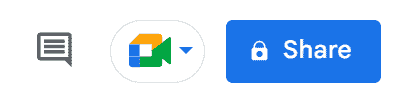
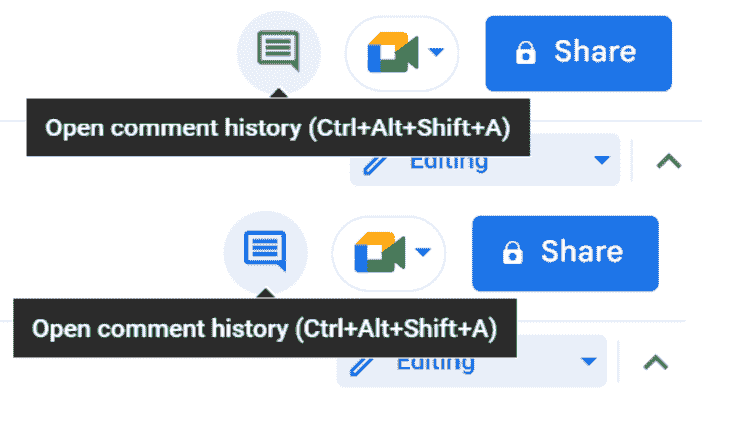
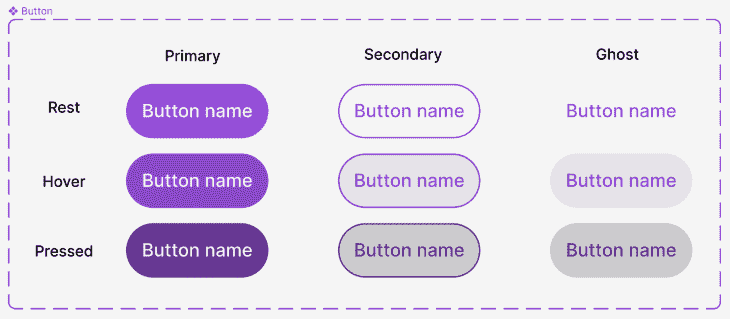
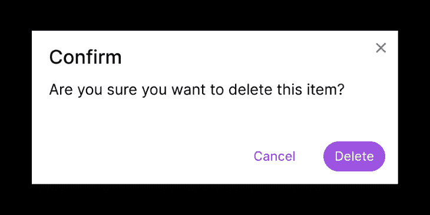
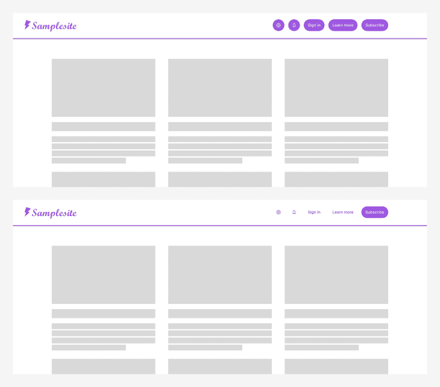
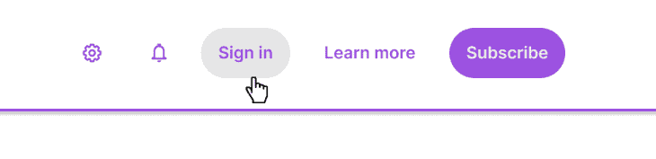

# 在 UX 设计中使用 ghost 按钮以实现有效的 CTA

> 原文：<https://blog.logrocket.com/ux-design/using-ghost-buttons-effective-ctas/>

在设计用户界面的时候，用不了多久你就会遇到行动号召(CTA)的需求。无论你的用户需要提交一个表单或者完成一次购买或者注册你的邮件列表，你首先要给他们一个按钮，他们可以在那里采取行动。

但不是所有的按钮都是一样的，这对你来说是个好消息。用户需要采取的一些行动也没有其他行动重要。为了优化你的用户界面以获得最有效的行动号召，你需要开始使用 ghost 按钮*。*

## 什么是幽灵按钮？

顾名思义，幽灵按钮没有标准按钮明显。就像一个幽灵，它融入到背景中，直到你需要它的时候你才会注意到它。

而且也像鬼一样，它的精妙就是它的超能力。虽然标准 UI 按钮通常具有完全定义的主体和对比填充颜色，但幻影按钮通常在静止时没有轮廓和填充(或与其背景匹配的填充)。只有当鼠标悬停在重影按钮上时，它才会呈现轻微的阴影填充颜色，并且其边界变得明显。

## 按钮的层次结构

使用 ghost 按钮来实现有效的[CTA](https://blog.logrocket.com/ux-design/design-cta-buttons-ux-best-practices/)具有讽刺意味的是，你不应该在页面上最重要的动作中使用 ghost 按钮。但是当你使用 ghost 按钮时，你创建了一个按钮的视觉层次结构，允许你将最重要的按钮提升到界面的最前面，将最不重要的按钮降级到后台。

一个有效的设计系统将包含一个主要按钮，一个次要按钮，和一个第三按钮，每一级都越来越微妙。根据设计系统的复杂程度，你可能只有一个主按钮和一个次按钮，或者你可能还需要添加一个四元按钮，但是无论如何，你最底层的按钮应该是幽灵按钮。

You may not have noticed, but button hierarchies are all around you. Notice how Google Docs uses a primary button for the share action, a secondary button for the call button, and a ghost button for the comment button.

## 按钮的三种主要状态

好的交互设计的一个重要因素是确保你所有的按钮都响应鼠标和键盘的交互。因此，设计系统中的每个按钮都需要一个视觉上截然不同的静止、悬停和按下状态。

按钮通常也有禁用状态、聚焦状态，有时还有其他活动或不活动状态，但出于本文的目的，我们将重点讨论前三种状态，因为它们是导致幽灵按钮出现的交互。

当用户的焦点在其他地方时，通常在页面上看到的就是 rest 状态。

当鼠标进入按钮区域时，悬停状态出现，当鼠标离开该区域时，悬停状态恢复为静止，这表示交互可用。

当鼠标点击按钮时，显示按下状态，以指示按钮被按下，向用户指示动作即将发生。

设计系统中的所有按钮都需要有这些状态，为了保持一致性，不同类型的按钮之间的交互应该是相似的。在下面的例子中，请注意 Google Docs 上的 ghost 按钮在悬停状态(浅灰色填充)和点击状态(浅蓝色填充)下的不同表现，以表明这两种状态是不同的。

## 创建有效的幽灵按钮

设计 ghost 按钮的最好方法是用类似于你构建主按钮和次按钮的方式来构建它们。

选择一种在所有这些按钮类型中都一致的颜色；如果你已经为你的应用程序或网站建立了调色板，为按钮使用强调色是一个好主意。对于你的主按钮，按钮主体使用全饱和色，按钮上的文字或图标使用对比色白色或浅灰色。这允许您反转辅助按钮和重影按钮的颜色，只对文本、图标或轮廓使用强调色。这使得次要和幽灵按钮很微妙，但看起来仍然像是与主要按钮有关。

构建按钮时，从每个按钮的静止状态开始。给次按钮和重影按钮不填充，纯白填充，或者和主按钮上的文本一样的浅色阴影。

然后为每个按钮创建悬停状态。你可以随心所欲地设计它们的样式，但是一个简单的方法是从静止状态开始，将填充颜色的亮度降低 10。然后，对你的第二和幽灵悬停状态进行相同的调整。(如果您对静止状态没有使用填充，那么给悬停状态一个纯白色填充，然后将亮度降低 10)。同时，将文本和轮廓颜色调暗与初始状态相同的量，以保持符合 [WCAG 指南](https://www.w3.org/WAI/WCAG21/Understanding/contrast-minimum.html)的颜色对比度。

对于按下的状态，重复相同的过程，但将亮度再降低 20。这将给你三个不同的按钮，它们清楚地表明了它们的交互状态，同时看起来它们属于同一个设计系统。

## 使用幽灵按钮来驱动动作

现在你已经为你的设计系统创建了各种各样的按钮，寻找机会将页面上不太重要的按钮放到一个虚拟按钮中。

通常，在任何给定时间，或者至少在一个按钮组中，应该只有一个主按钮是可见的。这意味着对于任何一组按钮，你都应该决定哪一个动作能吸引用户的注意力。

在许多情况下，这是继续页面基本流程的按钮，比如下面的确认对话框。虽然您应该始终为用户提供取消选项，但这是在确认删除时不太常见的操作。因此，您应该为 cancel 操作使用一个 ghost 按钮来引起对 delete 操作的注意。

当设计一个有效的应用程序或网站时，你通常有一个主要目标，那就是让用户访问你的页面。也许你想让他们购物，或者订阅，或者注册，或者捐赠。用户可以在你的网站上进行所有这些操作，但是如果你让所有的按钮看起来都一样，你只会给页面增加视觉噪音，同时提供太多看起来价值相等的选项。

相反，只选择你最重要的一个目标。把这个作为你的主要按钮，其他的用幽灵按钮。请看下面的例子，其中一个版本使用五个主按钮，另一个版本使用四个幽灵按钮和一个主按钮。在第二个版本中，用户的注意力应该集中在哪里更加清晰。

幸运的是，因为您将这些按钮设计为具有不同悬停和按下状态的合适的幽灵按钮，所以您的用户仍然知道他们可以与其他按钮进行交互，并执行那些二级或三级操作。

## 结论

幽灵按钮，就像他们的名字所暗示的那样，与主按钮相比是不显眼的。但在 UI 设计的零和游戏中，当一个按钮隐藏起来时，另一个按钮会变得更加明显。Ghost 按钮可以让你在不牺牲实用性和功能性的情况下，在页面的视觉元素上取得一种美学上的平衡。

当幽灵按钮被频繁使用时，它们允许主按钮很少被使用，这意味着主按钮可以脱颖而出，并引导用户进行下一步。下一次你计划一个界面时，花一些时间来有意识地考虑你希望用户采取的行动；现在，使用您的新按钮库来实现这些结果。

*标题图片来源:* [图标侦察](https://iconscout.com/icon/button-23)

## [LogRocket](https://lp.logrocket.com/blg/signup) :无需采访即可获得 UX 洞察的分析

[LogRocket](https://lp.logrocket.com/blg/signup) 让您可以回放用户的产品体验，以可视化竞争，了解影响采用的问题，并结合定性和定量数据，以便您可以创建令人惊叹的数字体验。

查看设计选择、交互和问题如何影响您的用户— [立即尝试 LogRocket】。](hhttps://lp.logrocket.com/blg/signup)