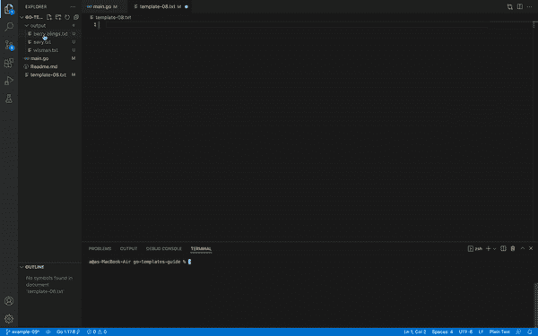

# 如何使用文本模板

> 原文：<https://blog.logrocket.com/using-golang-templates/>

模板是定义特定模式并为自动化提供空间的文件，无论是简单的文本文件还是网页的 HTML 文件。如果它提供了定制的空间，那么它就是一个模板。

您可以编写编程逻辑来解析简单的模板，但是随着模板中自定义级别的增加，您需要自定义的编程逻辑也会增加，这使得编写模板解析逻辑变得不太可行。

编程语言和 web 开发框架支持现成的模板解析，或者为模板解析提供库。

在本文中，我们将探索 Go 编程语言中支持模板解析的特性。我们可以使用这些方法来解析任何文件扩展名，但是在本文中我们将只使用文本文件。

本指南也将只显示 Go 代码和理解 Go 代码所需的最少量的模板(文本)。

## Go 模板教程先决条件

在开始我们的教程之前，您应该已经:

您也可以通过[c](https://github.com/Bamimore-Tomi/go-templates-guide)T2[向导的知识库](https://github.com/Bamimore-Tomi/go-templates-guide) [访问完整的模板文件](https://github.com/Bamimore-Tomi/go-templates-guide)或输入:

```
git clone https://github.com/Bamimore-Tomi/go-templates-guide.git

```

## 使用 Go 文本模板

在本节中，我们将探索 Go 中`text/template` [包](https://blog.logrocket.com/tag/go/) [的特性。](https://blog.logrocket.com/tag/go/)

### 在 Go 中使用`ParseFiles`

要使用模板，您必须将它们解析到您的 Go 程序中。

标准库提供了解析我们的程序所需的函数:

```
package main
import (
    "log"
    "os"
    "text/template"
)
// Prints out the template without passing any value using the text/template package
func main() {
    template, err := template.ParseFiles("template-01.txt")
    // Capture any error
    if err != nil {
        log.Fatalln(err)
    }
    // Print out the template to std
    template.Execute(os.Stdout, nil)
}
//OUTPUT
// Hi <no value>
// You are welcome to this tutorial

```

上面的程序打印了一个名为`template-01.txt`的模板文件。`template`变量保存文件的内容。为了将文件打印到`Stdout`，我们调用了`Execute`方法。

### 使用`ParseGlob`

对于一次解析多个文件，`ParseGlob`函数很有用:

```
package main
import (
    "log"
    "os"
    "text/template"
)
// Parse all the files in a certain directory
func main() {
    // This function takes a pattern. It can be a folder
    temp, err := template.ParseGlob("templates/*")
    if err != nil {
        log.Fatalln(err)
    }
    // Simply calling execute parses the first file in the directory
    err = temp.Execute(os.Stdout, nil)
    if err != nil {
        log.Fatalln(err)
    }
    // Or you can execute a particular template in the directory
    err = temp.ExecuteTemplate(os.Stdout, "template-03.txt", nil)
    if err != nil {
        log.Fatalln(err)
    }
    // Calling a template not in the directory will produce an error
    err = temp.ExecuteTemplate(os.Stdout, "template-04.txt", nil)
    if err != nil {
        log.Fatalln(err)
    }
}

```

使用这段代码，我们将`templates/`目录中的所有文件解析到我们的程序中。为了执行任何被解析的模板，我们对`ParseGlob`的结果调用`ExecuteTemplate`方法。

### 在 Go 中使用`Execute`方法

`Execute`方法是我们将数据解析成模板的地方。下面是`template-04.txt`文件:

```
Hello {{.}}

You are doing great. Keep learning.
Do not stop {{.}}

```

`{{.}}`告诉`text/template`包将传递给模板的数据放在哪里。在这个模板中，我们希望在两个地方设置数据:第 1 行和第 4 行:

```
package main
import (
    "log"
    "os"
    "text/template"
)
// Declare type pointer to a template
var temp *template.Template
// Using the init function to make sure the template is only parsed once in the program
func init() {
    // template.Must takes the reponse of template.ParseFiles and does error checking
    temp = template.Must(template.ParseFiles("template-04.txt"))
}
func main() {
    // Execute myName into the template and print to Stdout
    myName := "Oluwatomisin"
    err := temp.Execute(os.Stdout, myName)
    if err != nil {
        log.Fatalln(err)
    }
}
// Hello Oluwatomisin
// You are doing great. Keep learning.
// Do not stop Oluwatomisin

```

这里，我们使用稍微不同的语法来初始化模板。`temp.Execute`取一个`io.writer`和`data interface{}`，本例中为`myName`。

您还可以在模板中传递更复杂的数据结构；唯一要做的改变是如何访问模板文件中的结构，这将在下一节讨论。

### 在 Go 模板中声明变量

我们也可以在模板内部初始化变量。查看`template-05.txt`中的示例:

```
Hello {{.Name}}

{{$aTrait := .Trait}}
You are {{$aTrait}}

```

请注意我们在模板中使用数据的方式发生了变化。`template.Execute`带有一个`data interface{}`参数，这意味着我们可以[在模板](https://blog.logrocket.com/exploring-structs-and-interfaces-in-go/)中执行一个 `[struct](https://blog.logrocket.com/exploring-structs-and-interfaces-in-go/)` [:](https://blog.logrocket.com/exploring-structs-and-interfaces-in-go/)

```
package main
import (
    "log"
    "os"
    "text/template"
)
type PersonTrait struct {
    Name string
    Trait string
}
// Declare type pointer to a template
var temp *template.Template
// Using the init function to make sure the template is only parsed once in the program
func init() {
    // template.Must takes the reponse of template.ParseFiles and does error checking
    temp = template.Must(template.ParseFiles("template-05.txt"))
}
func main() {
    // Execute person into the template and print to Stdout
    person := PersonTrait{Name: "Oluwatomisin", Trait: "a great writer"}
    err := temp.Execute(os.Stdout, person)
    if err != nil {
        log.Fatalln(err)
    }
}
// Hello Oluwatomisin
// You are a great writer

```

在这个例子中，我们执行模板中的`PersonTrait`结构。这样，您可以在模板中执行任何数据类型。

### 在 Go 模板中使用循环

`text/template`包也允许你在模板中运行循环。在`template-06.txt`中，我们会列举一些可爱的宠物:

```
Animals are cute; some cute animals are:
{{range .}}
{{.}}
{{end}}

```

在程序中，我们必须在模板中执行一片可爱的宠物:

```
package main
import (
    "log"
    "os"
    "text/template"
)
// Declare type pointer to a template
var temp *template.Template
// Using the init function to make sure the template is only parsed once in the program
func init() {
    // template.Must takes the reponse of template.ParseFiles and does error checking
    temp = template.Must(template.ParseFiles("template-06.txt"))
}
func main() {
    // Execute cuteAnimals into the template and print to Stdout
    cuteAnimals := []string{"Dogs", "Cats", "Mice", "Fish"}
    err := temp.Execute(os.Stdout, cuteAnimals)
    if err != nil {
        log.Fatalln(err)
    }
}
// Animals are cute, some cute animals are:
// Dogs
// Cats
// Mice
// Fish

```

如果需要，我们还可以循环通过一个`map`:

```
Animals are cute, some cute animals are:
{{range $key, $val := .}}
{{$key}} , {{$val}}
{{end}}

```

然后，我们可以在程序中创建并执行`map`:

```
package main
import (
    "log"
    "os"
    "text/template"
)
// Declare type pointer to a template
var temp *template.Template
// Using the init function to make sure the template is only parsed once in the program
func init() {
    // template.Must takes the response of template.ParseFiles and does error checking
    temp = template.Must(template.ParseFiles("template-06.txt"))
}
func main() {
    // Execute cuteAnimalsSpecies into the template and print to Stdout
    cuteAnimalsSpecies := map[string]string{
        "Dogs": "German Shepherd",
        "Cats": "Ragdoll",
        "Mice": "Deer Mouse",
        "Fish": "Goldfish",
    }
    err := temp.Execute(os.Stdout, cuteAnimalsSpecies)
    if err != nil {
        log.Fatalln(err)
    }
}
// Animals are cute, some cute animals are:
// Cats , Ragdoll
// Dogs , German Shepherd
// Fish , Goldfish
// Mice , Deer Mouse

```

## Go 模板中的条件语句

为了给我们的模板添加更多的定制，我们可以使用条件语句。要使用条件语句，我们必须调用模板内部的比较函数。在本例中，我们可以检查随机整数是小于还是大于 200:

```
{{if (lt . 200)}}
Number {{.}} is less than 200
{{else}}
Number {{.}} is greater than 200
{{end}}

```

`(lt . 200)`语法是我们使用`lt`比较随机整数值的方式。其他运营商包括:

*   `lt`小于运算符
*   `gt`对于大于号运算符
*   `eq`对于等于零的运算符
*   `ne`对于不等于运算符
*   `le`对于小于或等于运算符
*   `ge`对于大于或等于运算符

现在，我们可以在主程序中生成随机值:

```
package main
import (
    "log"
    "math/rand"
    "os"
    "text/template"
    "time"
)
// Declare type pointer to a template
var temp *template.Template
// Using the init function to make sure the template is only parsed once in the program
func init() {
    // template.Must takes the reponse of template.ParseFiles and does error checking
    temp = template.Must(template.ParseFiles("template-06.txt"))
}
func main() {
    // Generate random number between 100 and 300
    rand.Seed(time.Now().UnixNano())
    min := 100
    max := 300
    // Execute myNumber into the template and print to Stdout
    myNumber := rand.Intn((max-min)+1) + min
    err := temp.Execute(os.Stdout, myNumber)
    if err != nil {
        log.Fatalln(err)
    }
}
// Number 141 is less than 200

```

## 在模板中使用 Go 函数

`text/template`包还提供了一种在模板中执行定制函数的方法。一个著名的例子是将时间戳转换成其他日期格式:

```
Hi,

Time before formatting : {{.}}
Time After formatting : {{formatDate .}}

```

模板显示用`formatDate`函数解析前后的时间。观察可以调用自定义函数的语法:

```
package main
import (
    "log"
    "os"
    "text/template"
    "time"
)
// Declare type pointer to a template
var temp *template.Template
// Using the init function to make sure the template is only parsed once in the program
func init() {
    // template.Must takes the reponse of template.ParseFiles and does error checking
    temp = template.Must(template.New("template-07.txt").Funcs(funcMap).ParseFiles("template-08.txt"))
}
// Custom function must have only 1 return value, or 1 return value and an error
func formatDate(timeStamp time.Time) string {
    //Define layout for formatting timestamp to string
    return timeStamp.Format("01-02-2006")
}
// Map name formatDate to formatDate function above
var funcMap = template.FuncMap{
    "formatDate": formatDate,
}
func main() {
    timeNow := time.Now()
    err := temp.Execute(os.Stdout, timeNow)
    if err != nil {
        log.Fatalln(err)
    }
}
// Hi,
// Time before formatting : 2021-10-04 18:01:59.6659258 +0100 WAT m=+0.004952101
// Time After formatting: 09-04-2021

```

布局格式必须遵循时间戳格式—在本例中是`Jan 2 15:04:05 2006 MST`。查看[方法的文档了解更多信息](https://pkg.go.dev/time#Time.Format)。

然而，在这里，我们使用`template.FuncMap`将一个`string`映射到自定义函数。然后将使用模板中的字符串引用该函数。

## 使用 Go 定制电子邮件

每当你看到为你定制的你最喜欢的时事通讯时，很可能是一个电子邮件模板和一个模板处理包，比如 Go 中的`text/template`,让它看起来如此。下面的程序将根据`text/template`包中的各种技术和方法定制一份新闻简报。

```
package main

import (
   "fmt"
   "os"
   "text/template"
   "time"
)

// Declare type pointer to a template
var temp *template.Template

// Using the init function to make sure the template is only parsed once in the program
func init() {
   // template.Must takes the reponse of template.ParseFiles and does error checking
   temp = template.Must(template.New("template-08.txt").Funcs(funcMap).ParseFiles("template-08.txt"))
}

// Custom function must have only 1 return value, or 1 return value and an error
func formatDate(timeStamp time.Time) string {
   //Define layout for formatting timestamp to string
   // return timeStamp.Format("01-02-2006")
   return timeStamp.Format("Mon, 02 Jan 2006")

}

// Map name formatDate to formatDate function above
var funcMap = template.FuncMap{
   "formatDate": formatDate,
}

type customer struct {
   Username             string
   Subscriptions        []string
   LastLoginDays        int
   SubscriptionDeadline time.Time
}

func check(e error) {
   if e != nil {
       panic(e)
   }
}

func main() {
   customers := []customer{
       {
           Username:             "wisman",
           Subscriptions:        []string{"Kikat", "Lollipop", "Marshmallow", "Oreo", "Jelly Bean"},
           LastLoginDays:        10,
           SubscriptionDeadline: time.Now(),
       },
       {
           Username:             "berry blings",
           Subscriptions:        []string{"Honeycomb", "Gingerbread", "Nougat", "Froyo", "Donut"},
           LastLoginDays:        5,
           SubscriptionDeadline: time.Date(2023, 3, 15, 5, 5, 5, 3, time.UTC),
       },
       {
           Username:             "savy",
           Subscriptions:        []string{"Honeycomb", "Gingerbread", "Nougat", "Froyo", "Donut"},
           LastLoginDays:        5,
           SubscriptionDeadline: time.Date(2023, 6, 15, 5, 5, 5, 3, time.UTC),
       },
   }
   for _, user := range customers {
       // Create a new file for each customer
       file, err := os.Create(fmt.Sprintf("output/%v.txt", user.Username))
       check(err)
       // Execute the template for each user into their respective files
       err = temp.Execute(file, user)
       check(err)
   }
}

```

该程序使用客户数据执行电子邮件模板。

```
Hi {{.Username}},

We notice you last logged in {{.LastLoginDays}} days ago.

Your current subscriptions:
{{range $subscription := .Subscriptions}}{{$subscription}}
{{end}}
expires on {{formatDate .SubscriptionDeadline}}.

```

运行程序后，它为客户数组中的每个客户输出一个文件:



## 结论

我们已经看到了`text/template`包中的一系列特性和使用示例。这里实现的所有特性对于`html/template`包都是一样的。通过提供输入的自动转义和上下文敏感的净化，从`html/template`生成的输出不会受到跨站点脚本的攻击。

当在输出为 HTML 的 web 上下文中使用模板时，使用`html/template`包。

## 使用 [LogRocket](https://lp.logrocket.com/blg/signup) 消除传统错误报告的干扰

[](https://lp.logrocket.com/blg/signup)

[LogRocket](https://lp.logrocket.com/blg/signup) 是一个数字体验分析解决方案，它可以保护您免受数百个假阳性错误警报的影响，只针对几个真正重要的项目。LogRocket 会告诉您应用程序中实际影响用户的最具影响力的 bug 和 UX 问题。

然后，使用具有深层技术遥测的会话重放来确切地查看用户看到了什么以及是什么导致了问题，就像你在他们身后看一样。

LogRocket 自动聚合客户端错误、JS 异常、前端性能指标和用户交互。然后 LogRocket 使用机器学习来告诉你哪些问题正在影响大多数用户，并提供你需要修复它的上下文。

关注重要的 bug—[今天就试试 LogRocket】。](https://lp.logrocket.com/blg/signup-issue-free)