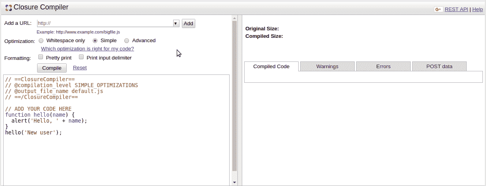
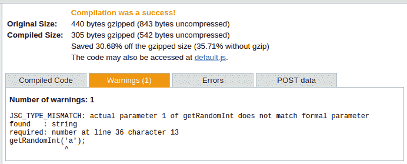

# 使用 Google Closure 编译器交付更好的 JavaScript 

> 原文：<https://blog.logrocket.com/using-google-closure-compiler-to-deliver-better-javascript-3059a8343445/>

代码审查是通过(理论上)严格的阅读和严格的同行审查其内容的过程来分析代码的过程。在提交代码供评审之前，程序员通常会根据他们使用的语言和环境，使用一些自动化工具中的一种来清理代码。

在 JavaScript 世界中，仅仅因为语言的本质，许多开发人员，尤其是初学者，看不到他们在编程时犯的错误。这些可能是任何事情，从使用未声明的变量，到由于不一致的空检查导致的空指针异常，到误用(或者根本没有使用)函数返回的内容。这就是为什么在提交代码供审查之前，自动化的其他东西可以帮助我们。

Google Closure Compiler 正是这么做的:它通过分析、解析、缩小和重写 JavaScript，从 JavaScript 编译成更好的 JavaScript。当然，它也警告我们上面提到的同样的陷阱。它删除不必要的内容，检查语法——简而言之，它做了很多。

在本文中，我们将展示前端开发人员面临的一些常见问题，并更好地理解 Closure Compiler 如何帮助我们快速地复查我们正在编写的内容，以确保我们交付尽可能最好的代码。

### 简单的快速入门

您可以从命令行执行 Closure Compiler 到您的应用程序中(例如 Node.js)或者通过[免费提供的 web 服务](https://closure-compiler.appspot.com/home)。



它基本上公开了一个网页，您可以通过链接的 JavaScript 文件或内联代码粘贴来编译您的代码。然后，该工具会在屏幕右侧显示结果。

这些结果依次显示了原始源代码和编译版本(gzipped 和 uncompressed)之间的大小差异，以及一个自动生成的链接，供您下载 JavaScript 文件。

最重要的是，您将看到一个包含四个选项卡的表格，显示:

*   最终编译的代码
*   警告和错误的列表，说明它们发生的时间、行、错误/警告类型以及对错误的描述
*   用于向闭包编译器 web 服务发出 REST 请求的 POST 数据

关于优化，你可以从*简单*和*高级*选项中选择(我们不会只考虑*空白*，因为它做不了多少)。

简单的 T1 将转换并缩小你的 JS 代码，同时警告语法和我们经常犯的最危险的错误。*简单*模式，顾名思义，简单——而且，大多数时候，安全。

另一方面，Advanced 在删除代码、重组原始实现的整个结构方面要积极得多。

以 Closure web 服务页面上默认的“hello，world”示例的前一幅图像为例:它缩减了代码并使其更简单，但是它失去了`hello()`函数，这意味着对它的外部引用会中断。但是不用担心；我们将探讨如何解决这个问题。

让我们举另一个稍微复杂一点的例子，这个例子摘自[官方谷歌教程](https://developers.google.com/closure/compiler/samples/tutorial2.js):

```
// Copyright 2009 Google Inc. All Rights Reserved.

/**
 * Creates the DOM structure for the note and adds it to the document.
 */
function makeNoteDom(noteTitle, noteContent, noteContainer) {
  // Create DOM structure to represent the note.
  var headerElement = document.createElement('div');
  var headerText = document.createTextNode(noteTitle);
  headerElement.appendChild(headerText);

  var contentElement = document.createElement('div');
  var contentText = document.createTextNode(noteContent);
  contentElement.appendChild(contentText);

  var newNote = document.createElement('div');
  newNote.appendChild(headerElement);
  newNote.appendChild(contentElement);

  // Add the note's DOM structure to the document.
  noteContainer.appendChild(newNote);
}

/**
 * Iterates over a list of note data objects and creates a DOM
 */
function makeNotes(data, noteContainer) {
  for (var i = 0; i < data.length; i++) {
    makeNoteDom(data[i].title, data[i].content, noteContainer);
  }
}

function main() {
  var noteData = [
      {title: 'Note 1', content: 'Content of Note 1'},
      {title: 'Note 2', content: 'Content of Note 2'}];
  var noteListElement = document.getElementById('notes');
  makeNotes(noteData, noteListElement);
}

main();
```

这里，我们基本上创建了一个 notes 的数据结构，每个 notes 都有一个标题和内容的字符串属性。其余的由实用函数组成，用于迭代注释列表，并通过各自的`create`函数将它们全部放入文档。相同的代码在被 Closure 编译器编译后会是这样的:

```
for (var a = [{title:"Note 1", content:"Content of Note 1"}, {title:"Note 2", content:"Content of Note 2"}], b = document.getElementById("notes"), c = 0; c < a.length; c++) { var d = a[c].content, e = b, f = document.createElement("div"); f.appendChild(document.createTextNode(a[c].title)); var g = document.createElement("div"); g.appendChild(document.createTextNode(d)); var h = document.createElement("div"); h.appendChild(f); h.appendChild(g); e.appendChild(h); } ;
```

注意，整个`noteData`变量列表被改变为一个内联对象声明，它出现在循环内部。这些变量从它们原来的名字重新命名为字母字符。而且不能在其他地方重用之前的函数；如果从其他地方调用这个列表，闭包编译器可能会粘贴它两次。

然而代码的可读性和可理解性并不好——这当然不能用于开发环境。

[](https://logrocket.com/signup/)

### 未使用的变量

Closure Compiler 可以驱动很多场景——也就是我们作为 JavaScript 开发人员日常生活中常见的问题。让我们举一个 JavaScript 代码的例子:

```
'use strict';
const helperModule = require('./helper.js');
var notUsed;
```

当我们使用`'use strict'`模式时，生成的输出代码会怎样？或者是一个未使用的变量，即使您后来为它设置了一个值？

创建许多结构(不仅是变量，还有常量、函数、类等等)是很常见的。)被删除，这很容易被遗忘——如果您处理大量的源代码文件，就更是如此。根据模型的复杂程度，或者将对象暴露给外部世界的方式，这可能会导致不必要的情况。

嗯，结果就是这样:

```
var a = require(“./helper.js”);
```

闭包编译器会自动识别并移除那些未使用的结构。另外，局部变量(`let`)和常量(`const`)被替换为`var`声明。

### 条件流

如果一个流依赖于另一个有条件的流呢？假设您有一个函数`check()`，它依赖于另一个函数`getRandomInt()`，生成一个介于 0 和 1 之间的随机数，如果该随机数为 1，则返回`true`。

基于这个流程，我们不知道会发生什么，因为函数是随机的——也就是说，只有在运行时我们才能看到代码是否进入了`if`:

```
let abc = 1;
if (check()) {
   abc = "abc";
}
console.info(`abc length: ` + abc.length); function check() { return getRandomInt(2) == 1; } function getRandomInt(max) {
   return Math.floor(Math.random() * Math.floor(max));
}
```

下面是编译后的代码:

```
var b = 1;
1 == Math.floor(2 * Math.random()) && (b = "abc");
console.info("abc length: " + b.length);
```

条件流被分析并重新编程为一条单线。注意闭包编译器是如何检查前面有一个`&&`操作符的第一个条件的。该操作符表示，只有当第一个条件为真时，才会执行第二个条件。否则，如果我们的随机数不等于 1，那么`b`将永远不会收到`"abc"`作为值。

多条件的`if`怎么样？

```
if(document == null || document == undefined || document == ‘’)
   console.info(`Is not valid`);
```

看一看结果:

```
null != document && void 0 != document && “” != document || console.info(“Is not valid”);
```

条件`if`被嵌套。这是 Closure 编译器的默认行为:它总是试图尽可能地缩小，保持代码小而可执行。

### 外部参考和注释

总是审查已编译的代码可能是危险的和无益的。另外，如果您想让其他 JavaScript 文件全局使用`check()`函数，会发生什么情况呢？这里有一些技巧，比如 Google 建议将函数附加到全局窗口对象:

```
window.check = c;
```

在这里，我们将收到以下输出:

```
var a = require("./helper.js"), b = 1;
c() && (b = "abc");
console.info("abc length: " + b.length);
null != document && void 0 != document && "" != document || console.info("Is not valid");
function c() {
return 1 == Math.floor(2 * Math.random());
}
window.check = c;
```

闭包编译器检查的类型系统是整个事情的核心。您可以对代码进行更多类型的注释，这意味着编译器将根据您的注释检查错误的用法。

* * *

### 更多来自 LogRocket 的精彩文章:

* * *

让我们以`getRandomInt()`函数为例。您需要您的参数在所有情况下都是一个数字，因此您可以让 Closure 编译器检查调用者是否传递了与此不同的内容:

```
function getRandomInt(/** number */ max) {
return Math.floor(Math.random() * Math.floor(max));
}
window['getRandomInt'] = getRandomInt;
getRandomInt('a');
```

这将返回以下内容:



尽管该文件总是针对警告进行编译，但是您可以对您的代码有所了解，主要是那些被许多人更新的代码。

另一个有趣的特性是导出定义。如果您决定不希望通过*高级*选项对某些内容进行重命名，您也可以使用以下内容对代码进行注释:

```
/** @export */
```

这样，输出代码就不会被重命名。

### 结论

有许多不同的场景可以用来测试这个工具的能力。继续，使用您自己的 JavaScript 代码片段，用 Closure Compiler 来尝试它们。记下它生成的内容以及每个优化选项之间的差异。您还可以获取任何外部 JavaScript 插件/文件，并将其导入 web 服务进行测试。

请记住，您也可以从命令行运行它，甚至可以从您的构建系统(如 Gulp、Webpack 和其他可用的插件)运行它。谷歌还在其官方 GitHub 库提供了一个 [*样本*文件夹](https://github.com/google/closure-compiler-js/tree/master/samples)，在那里你可以测试它的更多特性。伟大的研究！

## 通过理解上下文，更容易地调试 JavaScript 错误

调试代码总是一项单调乏味的任务。但是你越了解自己的错误，就越容易改正。

LogRocket 让你以新的独特的方式理解这些错误。我们的前端监控解决方案跟踪用户与您的 JavaScript 前端的互动，让您能够准确找出导致错误的用户行为。

[](https://lp.logrocket.com/blg/javascript-signup)

LogRocket 记录控制台日志、页面加载时间、堆栈跟踪、慢速网络请求/响应(带有标题+正文)、浏览器元数据和自定义日志。理解您的 JavaScript 代码的影响从来没有这么简单过！

[Try it for free](https://lp.logrocket.com/blg/javascript-signup)

.