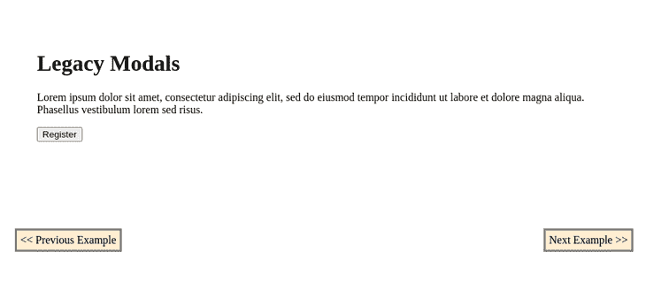
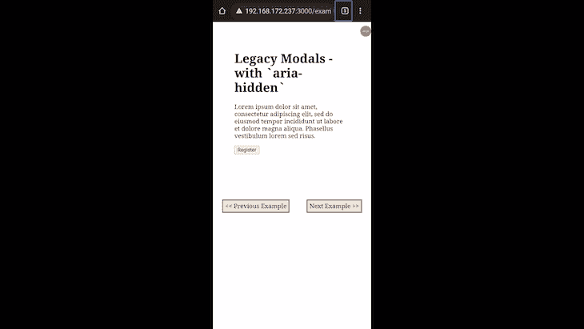
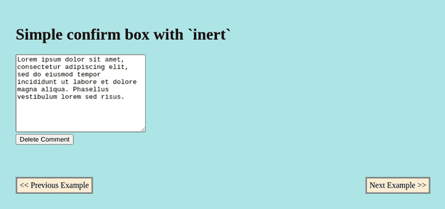
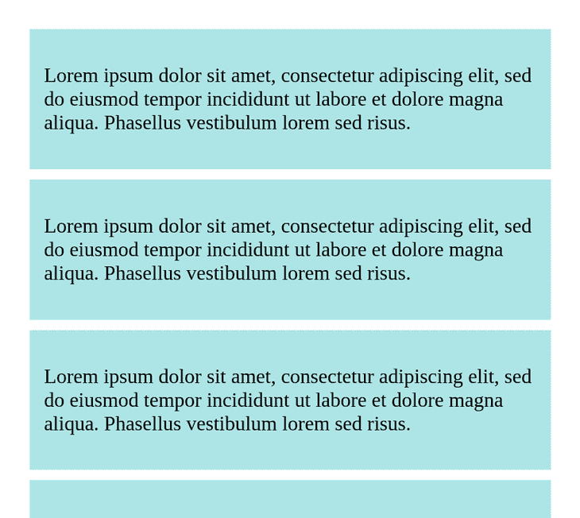
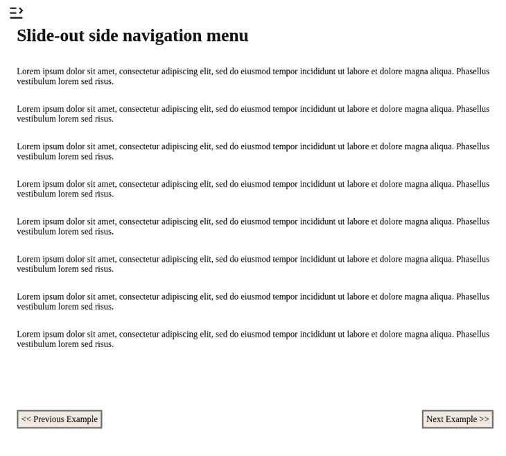

# 使用 HTML 惰性属性管理用户焦点

> 原文：<https://blog.logrocket.com/using-html-inert-property-manage-user-focus/>

由 [Interop 2022](https://hacks.mozilla.org/2022/03/interop-2022/) 所做工作的一个产品是 [HTML `inert`属性](https://developer.mozilla.org/en-US/docs/Web/API/HTMLElement/inert)，这是一个跨浏览器倡议，旨在发现并解决 web 上最重要的互操作性痛点。作为改进`<dialog>`规范的一部分，`inert`属性是一个布尔值，它使浏览器忽略它所应用的元素上触发的所有事件。我们最感兴趣的是它忽略来自用户和辅助技术的事件的能力。

在本文中，我们将探索`inert`属性，观察我们在引入它之前所面临的一些棘手问题，并决定在为 web 编程时是否可以使用它来减轻或完全克服这些问题。我们将讨论以下内容:

本文中的例子的完整代码可以在 GitHub 上找到。我们开始吧！

## 在`inert`之前，用户焦点是如何管理的？

保持与 W3C 规范保持一致是一个很好的实践，W3C 规范[规定了交互元素和页面的其余部分在活动时应该如何表现。](https://www.w3.org/TR/2017/NOTE-wai-aria-practices-1.1-20171214/#dialog_modal)

在创建`[<dialog>](https://developer.mozilla.org/en-US/docs/Web/HTML/Element/dialog)`和`inert`属性之前，在需要更多关注的元素(如模态)上实现焦点需要开发人员将焦点限制在交互空间内，监听焦点改变事件，并在焦点泄漏到目标元素边界之外的情况下强制焦点返回。所有这些都必须在交互元素仍然活跃的时候完成。

焦点实现还包括确保不可能与交互元素之外的页面元素进行交互，将用户限制在交互空间。下面的 JavaScript 代码显示了在交互式元素中实现焦点循环的示例:

```
// trap-focus.js

const FOCUSABLE_SELECTORS_LIST = 'a[href]:not([disabled]), input:not([disabled]), select:not([disabled]), textarea:not([disabled]), button:not([disabled]), area[href], [tabindex="0"], [contenteditable], object, iframe',
  TAB_KEY_CODE = 9
let firstFocusElement,
  lastFocusElement

function initiateFocusLooping(modal){
  let focusableModelElements = modal.querySelectorAll(FOCUSABLE_SELECTORS_LIST)
  firstFocusElement = focusableModelElements[0]
  lastFocusElement = focusableModelElements[focusableModelElements.length - 1]

  firstFocusElement.focus({focusVisible: true});
  modal.addEventListener("keydown", throttleFocus, false)
}

function endFocusLooping(modal){
  modal.removeEventListener("keydown", throttleFocus, false)
}

function throttleFocus(el){
  if(el.keyCode === TAB_KEY_CODE || el.key === "Tab"){
    if(el.shiftKey && document.activeElement === firstFocusElement) {
      el.preventDefault();
      lastFocusElement.focus();
    } else if(!el.shiftKey && document.activeElement === lastFocusElement) {
      el.preventDefault();
      firstFocusElement.focus()
    }
  }
}

```

在上面的代码中，我们首先通过了解交互式组件中所有可聚焦的元素来处理键盘导航。然后，我们监控键盘导航尝试，将它们限制在交互组件的位置，并主动实现在 HTML 文档中自动实现的预期顺序导航。

因此我们不会重复不必要的代码，我们将在下面的例子中引用`trap-focus.js`文件。

就交互空间而言，开发者必须意识到页面中可能发生的所有可能的动作。首先，你必须通过 **Tab** 和 **Shift + Tab** 来处理键盘导航，迫使焦点在交互空间的可聚焦元素中循环。但是，您还必须监听键盘`EscKeyDown`事件，该事件导致交互式组件的关闭:

```
// Listening to Esc key press and returning focus to element that triggered the interactive element
function listenToEscKeyDown(el) {
  if(!modal.classList.contains("hide") && (el.key === "Esc" || el.keyCode === 27)){
    toggleModal()
    ELEMENT_THAT_OPENED_INTERACTIVE_ELEMENT.focus()
  }
}

```

对于示例代码的其余部分，我们将引用上面的`listenToEscKeyDown()`函数，以免重复。

当考虑使用鼠标和触摸屏的用户的视觉交互时，我们需要在交互组件和页面的其余元素之间放置一个固定位置的覆盖块，就像模态一样。或者，你可以把它放在不应该被访问的页面元素上面，就像全屏和侧边滑动导航菜单一样，防止用户意外地与它们交互。

在下面的代码中，我们完成了使用上面的`trap-focus.js`示例中的函数的模态示例。我们还添加了一个覆盖容器:

```
<style>
  /* modal, modal-overlay, and hide styles */
</style>

<body>
  <main>
    <h1>Legacy Modal</h1>
    <div>
      <p>
        Lorem ipsum dolor sit amet, consectetur adipiscing elit, sed do eiusmod tempor incididunt ut labore et dolore magna aliqua. Phasellus vestibulum lorem sed risus.
      </p>
      <button class="open-modal">Register</button>
    </div>
  </main>
  <div id="registration-modal" class="modal-overlay hide" role="dialog">
    <div class="modal">
      <h2 aria-label="Registration Modal">Registration</h2>
      <p>Hello there, you can't focus outside my boundaries! :-)<p>
      <form action="">
        <div>
          <input type="text" name="name" placeholder="Thunder Storm">
        </div>
        <div>
          <input type="email" name="email" placeholder="[email protected]">
        </div>
        <div>
          <input type="password" name="password">
        </div>
        <div>
          <legend>
            Pet of choice:
          </legend>
          <label>
            <input type="radio" value="cat" name="pet"> Cat
          </label>
          <label>
            <input type="radio"  value="dog" name="pet"> Dog
          </label>
        </div>
        <div>
          <label for="terms">
            <input type="checkbox"> Agree to <a href="#terms">terms</a>
          </label>
        </div>
        <div>
          <button>Save</button>
          <button type="button" class="close-modal">Discard</button>
        </div>
      </form>
    </div>
  </div>
  <script src="/trap-focus.js"></script>
  <script>
    let modal = document.getElementById("registration-modal")
    let closeModalButton = document.querySelector(".close-modal")
    let openModalButton = document.querySelector(".open-modal")

    function toggleModal() {
      if(modal.classList.contains("hide")){
        modal.classList.remove("hide")
        initiateFocusLooping(modal)
        document.addEventListener("keydown", listenToEscKeyDown, false)
      } else {
        modal.classList.add("hide")
        endFocusLooping(modal)
        document.removeEventListener("keydown", listenToEscKeyDown, false)
      }
    }

    modal.addEventListener("keydown", throttleFocus, false)
    openModalButton.addEventListener("click", toggleModal, false)
    closeModalButton.addEventListener("click", toggleModal, false)
  </script>
</body>

```

`toggleModal()`函数通过使用类来切换模态的可见性，并实现我们的模态组件各自的监听器。

通过上面的实现，我们得到了下面的模态组件:



Implementing a modal using focus trapping

这种聚焦策略被称为聚焦陷阱。正如在上面的实现中所看到的，我们已经执行了所有必需的步骤，将焦点放在所有可能的导航类型的交互空间中，直到在该空间中完成了预期的任务。

## 焦点补漏白方法的问题

聚焦捕获法面临许多挑战；一个主要问题是处理网页可访问性，特别是在移动设备上。

这些设备上的辅助技术，如 TalkBack 和 VoiceOver，通过双击和滑动事件提供帮助。在撰写本文的时候，我们还没有一个标准的方法来实现这些事件的逻辑，否则我们会用按键和点击来实现。

如果我们用移动对讲测试我们在前面的例子中实现的模型，我们最终得到如下结果:


Focus trap issue with assistive tech

正如我们在上面的演示中所看到的，导航焦点超出了我们的陷阱，到达了底层元素，实际上，当模态处于活动状态时，这些元素是不应该被访问的。

为了实现这一点，我们可以对辅助技术隐藏所有的元素，除了交互元素，模态元素。

我们可以通过添加`aria-hidden`属性并在除了焦点中的交互组件之外的所有元素上将它设置为`true`来做到这一点。这样做将通知屏幕阅读器，除了我们的组件，当前文档中的其他元素应该是禁止的:

```
<!-- ... page HTML ... -->
<script src="/trap-focus.js"></script>
<script>
  let modal = document.getElementById("registration-modal")
  let closeModalButton = document.querySelector(".close-modal")
  let openModalButton = document.querySelector(".open-modal")

  function toggleAriaHidden(allElements, exception, apply = true){
    for(const el of allElements){
      if(el.tagName !== "script" && el !== exception)
        if(apply){
          el.setAttribute("aria-hidden", "true")
        } else {
          el.removeAttribute("aria-hidden")
        }
    }
  }

  function toggleModal() {
    if(modal.classList.contains("hide")){
      modal.classList.remove("hide")
      initiateFocusLooping(modal)
      document.addEventListener("keydown", listenToEscKeyDown, false)
    } else {
      modal.classList.add("hide")
      endFocusLooping(modal)
      document.removeEventListener("keydown", listenToEscKeyDown, false)
    }
    toggleAriaHidden(document.querySelector("body").children, modal, false)
  }

  modal.addEventListener("keydown", throttleFocus, false)
  openModalButton.addEventListener("click", toggleModal, false)
  closeModalButton.addEventListener("click", toggleModal, false)
</script>

```

上面代码中的`toggleAriaHidden()`函数有助于将`aria-hidden`添加到所有不可访问的元素中:



Focus trap assistive tech issue fix with aria-hidden

在上面的演示中，我们可以看到在应用了`aria-hidden`之后，焦点导航并没有泄漏到底层元素中。然而，这种方法的问题在于，当页面中存在大量元素时，它不仅效率低下，而且不切实际。

为了克服这一点，我们可以利用`aria-hidden`特性，在应用它的容器元素下的所有子元素都变得不可访问。然而，这需要对 HTML 文档进行布局，使得页面层次结构中较高的元素不能被`aria-hidden`访问，同时仍然保持页面中的正常行为。

这样做的话，我们的交互元素不能是使用`aria-hidden`不可访问的元素的子元素。因此，我们可以减少应用于 DOM 的操作数量。

我们面临的焦点捕捉的另一个问题是模态的情况。我们需要在交互组件和页面的其余部分之间添加固定位置的包装容器和覆盖层。否则，当交互组件处于焦点时，我们可以将这些包装容器放在页面暂时不可访问的部分之上。

我们需要包装器作为所有鼠标事件的缓冲区或陷阱，否则这些事件会出现在不可访问的区域。通过观察上一个例子中的`.modal-overlay`容器，您可以在实践中看到这个实现。

## 如何`inert`充当焦点护卫

属性将对交互空间的关注从一个陷阱转移到更像守卫的活动。通过使暂时不需要的页面区域不可访问，而不是将用户困在特定的区域，它将所有焦点相关的活动留给交互空间本身。

它的实现类似于我们在使用 JavaScript `alert()`函数时看到的。当`inert`被添加到一个元素中时，那部分标记被冻结或保护。鼠标和键盘的可能交互(如点击和焦点改变尝试)变得不可用。

* * *

### 更多来自 LogRocket 的精彩文章:

* * *

通过实现以交互空间为中心的逻辑，开发人员的工作变得简单了，而不必在意页面的其他标记及其行为。

`inert`也是可访问性的同义词，意思是，不仅它所应用的元素对于视觉交互变得不可访问，而且对于移动设备中的辅助技术也是不可访问的。

在我们上面的例子中，使用`inert`将大大减少用于实现模态的代码量。

当使用`inert`属性时，最好实现屏幕非活动区域的可视化指示，而不是活动区域。我们需要实现它，因为属性本身并不处理它，正如我们对像`<dialog>`和它的`::backdrop`伪类这样的元素所期望的那样。让惰性区域变得明显是很重要的，这样网页应用程序的用户就能知道网页上发生了什么。否则，他们可能会感到沮丧。

我们可以如下设计包含`inert`属性的元素:

```
[inert]{
  filter: grayscale(1);
  opacity: .2;
}

```

使用`inert`，前面的例子看起来如下:

```
<style>
  /* Remove .modal-overlay from styles, leaving .modal and .hide classes  */
</style>

<body>
  <main>    
    <h1>Replacing Legacy Focus Trapping with `inert`</h1>
    <div>
      <p>
        Lorem ipsum dolor sit amet, consectetur adipiscing elit, sed do eiusmod tempor incididunt ut labore et dolore magna aliqua. Phasellus vestibulum lorem sed risus.
      </p>
      <button class="open-modal">Register</button>
    </div>
  </main>
  <!-- Removed modal overlay container -->
  <div class="modal hide">
    <h2>Registration</h2>
    <p>Hello there, you can't focus outside my boundaries! :-)<p>
    <form action="">
      <div>
        <input type="text" name="name" placeholder="Thunder Storm">
      </div>
      <div>
        <input type="email" name="email" placeholder="[email protected]">
      </div>
      <div>
        <input type="password" name="password">
      </div>
      <div>
        <legend>
          Pet of choice:
        </legend>
        <label>
          <input type="radio" value="cat" name="pet"> Cat
        </label>
        <label>
          <input type="radio"  value="dog" name="pet"> Dog
        </label>
      </div>
      <div>
        <label for="terms">
          <input type="checkbox"> Agree to <a href="#terms">terms</a>
        </label>
      </div>
      <div>
        <button>Save</button>
        <button type="button" class="close-modal">Discard</button>
      </div>
    </form>
  </div>
  <script src="/trap-focus.js"></script>
  <script>
    let modal = document.querySelector("modal")
    let closeModalButton = document.querySelector(".close-modal")
    let openModalButton = document.querySelector(".open-modal")
    let otherPageElements = document.querySelector("main")

    // Remove toggleAriaHidden() function

    function toggleModal() {
      if(modal.classList.contains("hide")){
        modal.classList.remove("hide")
        initiateFocusLooping(modal)
        document.addEventListener("keydown", listenToEscKeyDown, false)
        otherPageElements.toggleAttribute("inert")
      } else {
        modal.classList.add("hide")
        endFocusLooping(modal)
        document.removeEventListener("keydown", listenToEscKeyDown, false)
        otherPageElements.toggleAttribute("inert")
      }
    }

    modal.addEventListener("keydown", throttleFocus, false)
    openModalButton.addEventListener("click", toggleModal, false)
    closeModalButton.addEventListener("click", toggleModal, false)
  </script>
</body>

```

## `inert`的潜在使用案例

`inert`在为网站和网络应用程序实现大量基于交互空间的组件时会很有用。让我们看几个这些组件的例子。

### 自定义确认框

我们可以使用`inert`来实现定制的确认框，以适应我们构建的应用程序的模式，去掉默认的特定于浏览器的定制框。

这种类型的实现不仅为我们提供了样式化确认框或模态的能力，还提供了放置任何可能数量的选项的能力，除了 JavaScript 的`confirm()`提供的两个默认选项。

下面是一个使用`inert`的确认框的例子:

```
<style>
  /* Custom styles */
</style>
<body>
  <main>
    <h1 tabindex="0">Simple confirm box with `inert`</h1>
    <div>
      <textarea name="" id="" cols="30" rows="10">Lorem ipsum dolor sit amet, consectetur adipiscing elit, sed do eiusmod tempor incididunt ut labore et dolore magna aliqua. Phasellus vestibulum lorem sed risus.</textarea>
    </div>
    <div>
      <button class="delete-prompt">Delete Comment</button>
    </div>
  </main>

  <div class="confirm hide" role="dialog">
    <p>Are you sure about deleting this text?<p>
    <button class="keep-text">Continue writing</button>
    <button class="delete-text">Yes</button>
  </div>
</body>
<script src="/js/trap-focus.js"></script>
<script>
  let confirmBox = document.querySelector(".confirm"),
    agreeBtn = document.querySelector(".delete-text"),
    disagreeBtn = document.querySelector(".keep-text"),
    deletionConfirmationBtn = document.querySelector(".delete-prompt"),
    mainElement = document.querySelector("main"),
    textArea = document.querySelector("textarea")

  deletionConfirmationBtn.addEventListener("click", toggleModal, false)
  disagreeBtn.addEventListener("click", toggleModal, false)
  agreeBtn.addEventListener("click", function(){
    toggleModal();
    textArea.innerText = ""
  }, false)

  function toggleModal() {
    mainElement.toggleAttribute("inert")
    if(confirmBox.classList.contains("hide")){
      confirmBox.classList.remove("hide")
      confirmBox.setAttribute("aria-modal", "true")
      initiateFocusLooping(confirmBox)
      document.addEventListener("keydown", listenToEscKeyDown, false)
    } else {
      confirmBox.classList.add("hide")
      confirmBox.removeAttribute("aria-modal")
      endFocusLooping(confirmBox)
      document.removeEventListener("keydown", listenToEscKeyDown, false)
    }
  }
</script>

```

下面是我们的确认框的运行演示:



A custom confirm box

### 认证表格

对于像提示、重要通知和强制身份验证表单这样的模态组件，使用`inert`是合适的。使用`inert`，我们可以轻松地将用户引导到交互元素，而不用担心可访问性；`inert`也得到辅助技术的认可和支持。

主要社交媒体 web 应用的流行趋势之一是条件身份验证表单。通过这些表单，对未经身份验证的用户可以查看的提要数量进行了限制。在浏览了一定量的内容后，未经身份验证的访问者会被提示注册并登录，同时被禁止在活动页面上导航。

让我们看看如何在使用`inert`的同时实现这样的表单:

```
<style>
  /* [inert], main, form, .feed, .feed-item, main, .feed-item, .target-item, .authentication-form, .hide */
</style>
<body>
  <main>
    <div class="feed">
      <div class="feed-item">
        <p>
          Lorem ipsum dolor sit amet, consectetur adipiscing elit, sed do eiusmod tempor incididunt ut labore et dolore magna aliqua. Phasellus vestibulum lorem sed risus.
        </p>
      </div>
    </div>
  </main>
  <div class="authentication-form hide" role="dialog">
    <h2 aria-label="Authentication Form">Super Login</h2>
    <p>Hello there, to keep enjoying our feed, please sign in! :-)<p>
    <form action="">
      <input type="text" name="email" placeholder="email">
      <input type="password" name="password" placeholder="password">
      <div>
        <button class="close-modal">Sign In</button>
      </div>
    </form>
  </div>
</body>
<script src="/js/trap-focus.js">
</script>
<script>
  let loginModal = document.querySelector(".authentication-form"),
    feed = document.querySelector(".feed"),
    feedSample = document.querySelector(".feed-item"),
    targetElement, feedGuarded = false;

  // populate feed
  for(let i = 1; i < 20; i++){
    let newFeedNode = feedSample.cloneNode(true)
    newFeedNode.classList.add(i)
    if(i === 10) { // make the tenth post our target item
      newFeedNode.classList.add("target-item")
      targetElement = newFeedNode
    }
    feed.appendChild(newFeedNode)
  }

  function monitorFeed(){
    if(targetElement.getBoundingClientRect().top <= 100){
      guardFeed()
    }
  }
  document.addEventListener("scroll", monitorFeed, false)

  function guardFeed() {
    if(!feedGuarded){
      feed.toggleAttribute("inert")
      loginModal.classList.remove("hide")
      initiateFocusLooping(loginModal)
      feedGuarded = true
      // limit scrolling
      window.onscroll = function(){
        window.scrollTo(
          window.scrollY || document.documentElement.scrollTop,
          window.scrollX || document.documentElement.scrollLeft
        )
      }
      // stop scroll event listening
      document.removeEventListener("scroll", monitorFeed, false)
    }
  }
</script>

```

下面是验证表单的运行演示。



对于滑出式导航菜单，我们希望用户的注意力在导航元素上，避免鼠标点击和键盘导航。在这样的场景下，我们可以用`inert`来引导用户。

让我们看一个工作示例:

```
<body>
  <input type="checkbox" class="nav-hum" id="nav-hum">
  <label for="nav-hum" tabindex="0"></label>

  <nav class="navigation" aria-label="Main">
    <h3>Slide-out Nav</h3>
    <ul>
      <li>
        <a class="side-nav" href="example-1.html">Example 1</a>
      </li>
      <!-- More links -->
      <li>
        <a class="side-nav" href="example-5.html">Example 7</a>
      </li>
    </ul>
  </nav>

  <main class="page-content">
    <h1>Slide-out side navigation menu</h1>
    <p tabindex="0">
      Lorem ipsum dolor sit amet, consectetur adipiscing elit, sed do eiusmod tempor incididunt ut labore et dolore magna aliqua. Phasellus vestibulum lorem sed risus.
    </p>

    <!-- more items -->
  </main>
</body>

<script>
  let navBtn = document.querySelector("#nav-hum")
  let pageContents = document.querySelector("main")

  navBtn.addEventListener("change", (el) => {
    pageContents.toggleAttribute("inert")
  })
</script>

```

本例中涉及显示和隐藏滑出菜单的大部分逻辑都是在 CSS 样式表中实现的:

```
.page-content{
  position: absolute;
  left: 0;
  top: 0;
  right: 0;
  z-index: 1;
  margin: 0;
  display: flex;
  height: 100%;
  flex-direction: column;
  background-color: white;
}
.page-content > *{
  width: 100%;
}
nav.navigation{
  position: fixed;
  display: flex;
  flex-direction: column;
  justify-content: start;
  left: 0;
  right: 0;
  top: 0;
  bottom: 0;
  z-index: 0;
  margin: auto;
  padding: 1rem;
  padding-top: 1.5rem;
  background-color: bisque;
}
.navigation > ul{
  list-style: none;
}
.navigation > ul > li{
  margin-top: 1rem;
}
.nav-hum {
  position: absolute;
  clip: rect(0, 0, 0, 0);
}
label[for="nav-hum"] {
  position: fixed;
  top: 1rem;
  left: 1rem;
  z-index: 2;
  width: 30px;
  height: 30px;
  cursor: pointer;
  background-image: url("data:image/svg+xml;utf8,<svg xmlns='http://www.w3.org/2000/svg' viewBox='0 0 24 24' width='24' height='24'><path fill='none' d='M0 0H24V24H0z'/><path d='M21 18v2H3v-2h18zM17.404 3.904L22 8.5l-4.596 4.596-1.414-1.414L19.172 8.5 15.99 5.318l1.414-1.414zM12 11v2H3v-2h9zm0-7v2H3V4h9z'/></svg>");
  background-size: contain;
}
.nav-hum:checked + label {
  left: 215px;
  background-image: url("data:image/svg+xml;utf8,<svg xmlns='http://www.w3.org/2000/svg' viewBox='0 0 24 24' width='24' height='24'><path fill='none' d='M0 0H24V24H0z'/><path d='M21 18v2H3v-2h18zM6.596 3.904L8.01 5.318 4.828 8.5l3.182 3.182-1.414 1.414L2 8.5l4.596-4.596zM21 11v2h-9v-2h9zm0-7v2h-9V4h9z'/></svg>");
}
.nav-hum:checked ~ .page-content {
  box-shadow: inset -1px 0 3px 0px rgba(0,0,0,0.5);
  transform: translate(200px);
  overflow: hidden;
}

```

将两者放在一起，我们得到以下输出:



## 浏览器兼容性

在撰写本文时，HTML `inert`功能已经兼容了除 Firefox 之外的所有最新版本的主流浏览器，包括移动和桌面。请随时查看兼容性图表以了解更多信息。

### 在不兼容的浏览器中使用`inert`

考虑新特性可能不被支持的情况，并努力使它们得到尽可能广泛的支持，尤其是在 web 上工作时，这是一个很好的做法。

为了确保我们的网络应用在使用`inert`时不会中断或出现故障，不兼容的浏览器可能会出现这种情况，我们应该使用[这是 polyfill](https://github.com/WICG/inert) 。

从安装 npm 模块开始:

```
npm install --save wicg-inert

```

将聚合填充导入到项目中:

```
import "wicg-inert"

```

将脚本添加到 HTML 页面:

```
<html>
  ...
  <script src="/node_modules/wicg-inert/dist/inert.min.js"></script>
  </body>
</html>

```

对于遗留浏览器，您必须为`Map`、`Set`、`Element.prototype.matches`和`Node.prototype.contains`包含额外的 polyfills。为了避免提供不必要的聚合填充并符合 W3C 聚合填充指南，`inert`聚合填充不捆绑所有其他聚合填充。

## 摘要

在本文中，我们学习了`inert` HTML 属性，探索了如何在实现交互式空间组件(如模态)时使用它，同时以比陷阱更具指导性的方式管理用户焦点活动。

我们已经看到了如何使用`inert`的实际例子，并了解了它在当前主流浏览器列表中的支持。我们还回顾了使用`inert`时的一些最佳实践，比如添加 HTML 页面惰性区域的可视指示，以及添加对不兼容浏览器的支持。

有关`inert`属性的更多信息，它的初始、指导方针和进展，您可以查看以下参考资料:

## 使用 [LogRocket](https://lp.logrocket.com/blg/signup) 消除传统错误报告的干扰

[](https://lp.logrocket.com/blg/signup)

[LogRocket](https://lp.logrocket.com/blg/signup) 是一个数字体验分析解决方案，它可以保护您免受数百个假阳性错误警报的影响，只针对几个真正重要的项目。LogRocket 会告诉您应用程序中实际影响用户的最具影响力的 bug 和 UX 问题。

然后，使用具有深层技术遥测的会话重放来确切地查看用户看到了什么以及是什么导致了问题，就像你在他们身后看一样。

LogRocket 自动聚合客户端错误、JS 异常、前端性能指标和用户交互。然后 LogRocket 使用机器学习来告诉你哪些问题正在影响大多数用户，并提供你需要修复它的上下文。

关注重要的 bug—[今天就试试 LogRocket】。](https://lp.logrocket.com/blg/signup-issue-free)