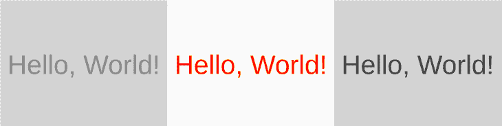
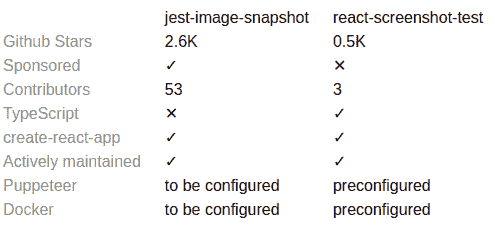
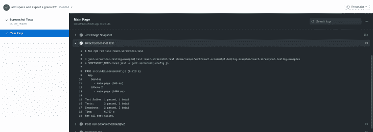

# 使用 Jest 进行 React 截图测试

> 原文：<https://blog.logrocket.com/using-jest-for-react-screenshot-testing/>

截图测试是一个应用程序的旧 UI 和新 UI 之间的截图比较。两者的区别通常用红色突出显示，就像这样:



请注意，上面的截图之一没有通过[测试](https://github.com/supromikali/react-screenshot-testing-examples/pull/2/checks?check_run_id=1372189013)，因为文本的颜色变化导致了 6414 个不同的像素。

今天可能没有其他方法来检查视觉回归，因为所有其他测试只检查代码，而不检查浏览器中显示的图像。

也就是说，今天 React 最流行的两个 Jest 截图测试库是 [jest-image-snapshot](https://github.com/americanexpress/jest-image-snapshot) 和[React-screen-test](https://github.com/fwouts/react-screenshot-test)。

## jest-image-snapshot vs . react-screen-test

下面是对这两种测试的简短介绍和并列比较:



这两个库都能够通过使用[puppeter](https://pptr.dev/)来截图，这是一个 Node.js 库，它提供了一个高级 API 来控制 headless Chrome 或 DevTools 协议上的 Chrome，但是 jest-image-snapshot 也可以与其他截图工具一起工作。

jest-image-snapshot 需要在应用程序端配置木偶师，而 react-screenshot-test 封装了整个过程，提供了自己的截图测试 API。

现在让我们深入了解设置和使用细节的差异。

## 装置

首先，应该安装 jest-image-snapshot、react-screen-test 和 Puppeteer 来开始本地测试:

```
npm i jest-image-snapshot puppeteer
```

或者

```
npm i react-screenshot-test puppeteer
```

## 设置

设置 jest-image-snapshot 可以归结为向 Jest expect 添加一个额外的方法:

```
// setupTests.js

import { toMatchImageSnapshot } from "jest-image-snapshot";
expect.extend({ toMatchImageSnapshot });

```

另一方面，react-screenshot-test 配置位于`jest.screenshot.config.js`文件中:

```
// jest.screenshot.config.js

module.exports = {
  testEnvironment: "node",
  globalSetup: "react-screenshot-test/global-setup",
  globalTeardown: "react-screenshot-test/global-teardown",
  testMatch: ["**/?(*.)+(screenshot).[jt]s?(x)"],
  transform: {
    "^.+\\.[t|j]sx?$": "babel-jest", // or ts-jest
    "^.+\\.module\\.css$": "react-screenshot-test/css-modules-transform",
    "^.+\\.css$": "react-screenshot-test/css-transform",
    "^.+\\.scss$": "react-screenshot-test/sass-transform",
    "^.+\\.(jpg|jpeg|png|gif|eot|otf|webp|svg|ttf|woff|woff2|mp4|webm|wav|mp3|m4a|aac|oga)$":
      "react-screenshot-test/asset-transform"
  },
  transformIgnorePatterns: ["node_modules/.+\\.js"]
};

```

它应该与 babel.config.js 成对出现:

```
// babel.config.js

module.exports = {
  presets: ["babel-preset-react-app"]
};

```

react-screenshot-test 库需要更多的配置，因为它构建 react 应用程序的一部分用于测试目的，但不使用 react-scripts 的构建脚本。这种方法允许单独测试应用程序的组件，就像常规 Jest 快照测试一样。

## jest-image-snapshot 和 react-screen-test 示例

jest 图像快照测试如下所示:

```
// src/screenshot.test.js 

import puppeteer from 'puppeteer'

it('main page screenshot test', async () => {
    const browser = await puppeteer.launch({});
    const page = await browser.newPage();
    await page.goto('http://localhost:5000'); 

    const image = await page.screenshot();
    expect(image).toMatchImageSnapshot();
    await browser.close();
});

```

上面的代码是一个标准的木偶工作流程。它将启动一个浏览器，打开页面，导航，最后，截图。

与测试相关的唯一一行代码来自 setup 部分:`expect(image).toMatchImageSnapshot()`。

这行测试代码负责差异检测和不同图像的生成——或者在之前没有截图的情况下生成新的截图。

现在让我们来看看 react-screen-test，它有自己的最小且方便的测试 API。下面是一个典型的测试:

```
// src/index.screenshot.js

import React from "react";
import { ReactScreenshotTest } from "react-screenshot-test";
import "./index.css";
import App from "./index";

ReactScreenshotTest.create("App")
    .viewport("Desktop", {
        width: 1024,
        height: 768
    })
    .viewport("iPhone X", {
        width: 375,
        height: 812,
        deviceScaleFactor: 3,
        isMobile: true,
        hasTouch: true,
        isLandscape: false
    })
    .shoot("main page", <App />)
    .run();

```

在一个可能有大量状态的示例中，这种方法的好处显而易见，比如按钮样式和大小，或者所有断点的响应性呈现。

例如，对于一个位置的所有按钮样式:

```
ReactScreenshotTest.create("Buttons")
    .viewport("Desktop", {
        width: 1024,
        height: 768
    })
    .shoot("primary", <Button type="primary" />)
    .shoot("secondary", <Button type="secondary" />)
    .shoot("ghost", <Button type="info" />)
    .shoot("danger", <Button type="danger" />)
    .shoot("warning", <Button type="warning" />)
    .run();

```

对于一个位置的五个断点:

```
ReactScreenshotTest.create("Header")
    .viewport("XS", {
        width: 365,
        height: 768
    })
    .viewport("S", {
        width: 768,
        height: 768
    })
    .viewport("M", {
        width: 1024,
        height: 768
    })
    .viewport("L", {
        width: 1200,
        height: 768
    })
    .viewport("XL", {
        width: 1600,
        height: 768
    })
    .shoot("responsive", <Header />)
    .run();

```

## 在本地运行测试

jest-image-snapshot 需要使用一些 web 服务器来提供应用程序，例如在运行截图测试之前使用“serve”包。这可以使用两个控制台窗口在本地实现，一个用于服务器，另一个用于测试，或者使用便利包`start-server-and-test`。

jest-image-snapshot 的最小 package.json 应该如下所示:

```
{
  "dependencies": {
    "jest-image-snapshot": "latest",
    "puppeteer": "latest",
    "react": "latest",
    "react-dom": "latest",
    "react-scripts": "latest",
    "serve": "latest",
    "start-server-and-test": "latest"
  },
  "scripts": {
    "build": "react-scripts build",
    "serve": "serve -s build",
    "test": "react-scripts test",
    "test:jest-image-snapshot": "npm run build && start-server-and-test serve http://localhost:5000 test"
  }
}

```

根据上面的`package.json`，截图测试需要执行的唯一命令是:

```
npm run test:jest-image-snapshot
```

现在，对于 react-screen-test minimal`package.json`:

```
{
  "dependencies": {
    "puppeteer": "latest",
    "react": "latest",
    "react-dom": "latest",
    "react-screenshot-test": "latest"
  },
  "scripts": {
    "test:react-screenshot-test": "SCREENSHOT_MODE=local jest -c jest.screenshot.config.js"
  }
}

```

注意`package.json`很短。运行测试只需要执行一个命令:

```
npm run test:react-screenshot-test

```

## 摘要

在 libs 的比较中没有明显的赢家:react-screen-test 和 jest-image-snapshot 都使用自己的方法增加了价值。

如果您已经在项目中使用或计划使用 Puppeteer 进行 e2e 测试(例如，检查页面上的文本，点击按钮等)，使用 jest-image-snapshot 包将是一个很好的选择。

Kent C. Dodds 的测试黄金标准在这里得到了完美的应用:“你的测试越像你的软件被使用的方式，它们就能给你越多的信心。”

另一方面，react-screenshot-test package 的价值在于可以轻松地将应用程序中的每个组件与一个屏幕截图配对，该截图显示了在一次测试中该组件在各种选项和屏幕分辨率下的外观。

如果很难决定使用哪一个库，请记住，它们可以很好地一起工作。事实上，这里有一个 CI 工作流示例(以及演示项目的源代码):

```
// .github/workflows/screenshot-tests.yml

name: Screenshot Tests

on:
    pull_request:
        branches:
            - main

jobs:
    screenshot:
        name: Main Page
        runs-on: ubuntu-16.04
        timeout-minutes: 5
        steps:
            - uses: actions/[email protected]

            - name: Use Node.js
              uses: actions/[email protected]
              with:
                  node-version: "12"

            - name: Install Dependencies
              run: yarn

            - name: Jest Image Snapshot
              run: npm run test:jest-image-snapshot

            - name: React Screenshot Test
              run: npm run test:react-screenshot-test

```



测试愉快！

## [LogRocket](https://lp.logrocket.com/blg/react-signup-general) :全面了解您的生产 React 应用

调试 React 应用程序可能很困难，尤其是当用户遇到难以重现的问题时。如果您对监视和跟踪 Redux 状态、自动显示 JavaScript 错误以及跟踪缓慢的网络请求和组件加载时间感兴趣，

[try LogRocket](https://lp.logrocket.com/blg/react-signup-general)

.

[ ](https://lp.logrocket.com/blg/react-signup-general) [](https://lp.logrocket.com/blg/react-signup-general) 

LogRocket 结合了会话回放、产品分析和错误跟踪，使软件团队能够创建理想的 web 和移动产品体验。这对你来说意味着什么？

LogRocket 不是猜测错误发生的原因，也不是要求用户提供截图和日志转储，而是让您回放问题，就像它们发生在您自己的浏览器中一样，以快速了解哪里出错了。

不再有嘈杂的警报。智能错误跟踪允许您对问题进行分类，然后从中学习。获得有影响的用户问题的通知，而不是误报。警报越少，有用的信号越多。

LogRocket Redux 中间件包为您的用户会话增加了一层额外的可见性。LogRocket 记录 Redux 存储中的所有操作和状态。

现代化您调试 React 应用的方式— [开始免费监控](https://lp.logrocket.com/blg/react-signup-general)。