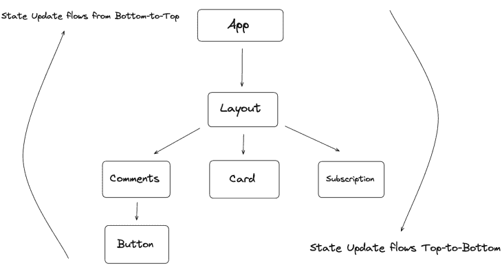

# 通过 Next.js 使用 Jotai

> 原文：<https://blog.logrocket.com/using-jotai-next-js/>

在过去的几年里，React 生态系统简化并改进了网络。它为构建现代 web 应用程序带来了许多有用的模式和实践。

从一开始，React 就将自己定位为一个非个人化的、仅供查看的库。这意味着 React 只负责视图层，或者渲染到屏幕上的内容。它通过改变 DOM 节点来做到这一点。如何在应用程序中共享状态的逻辑取决于开发人员。

在本文中，您将了解 Jotai APIs，以及如何使用这些模式在 Next.js 应用程序中共享状态。

向前跳:

## 在 React 应用程序中共享状态

尽管 React 提供了诸如`useState()`和`useContext()`这样的 API 来管理应用程序的状态，但是在构建应用程序时，这些 API 可能并不是最理想的。开发人员长期以来一直在构建和利用第三方状态管理库，如 [Redux](https://blog.logrocket.com/understanding-redux-tutorial-examples/) 、 [Redux Toolkit](https://blog.logrocket.com/smarter-redux-redux-toolkit/) 、 [Zustand](https://blog.logrocket.com/managing-react-state-zustand/) 等。

Jotai 就是这样一个库，你可以用它来共享和管理你的应用程序的状态。Jotai 与其他库的不同之处在于它采用了自底向上的方法:



像 Redux 或 Zustland 这样的库在 DOM 树之外创建一个全局存储，并以自顶向下的方式将状态更新传递给子组件。Jotai 做的正好相反——它的状态存在于 React DOM 树本身中，组件状态树以自底向上的方式更新。

## Jotai 的核心原则

Jotai 是一个非常小的图书馆，作为一个状态共享解决方案，它有很多事情要做。它的灵感来自于[脸书的反冲](https://blog.logrocket.com/simple-state-management-react-recoil/)，它解决了一系列类似的问题，但被推荐给更大规模的组织。

与 Jotai 不同，反冲是一个固执己见的库，它有自己设置应用程序的方式。Jotai 是完全非个人化的，并且提供了与 React APIs 非常相似的 API，为具有 React 经验的开发人员提供了一种熟悉感。

Jotai 依赖于它的原子性原则，即每个状态在其核心都可以被定义为一个`atom`。然后，这些`atoms`可以被链接和缩放在一起，形成复杂的状态。状态值只有在它的`atom`依赖关系改变时才会重新呈现。

这些依赖项跟踪器针对生产进行了高度优化。与 React 不同，你通常不需要使用任何记忆技术，比如`[Memo](https://blog.logrocket.com/react-memo-vs-usememo/)` [组件或者](https://blog.logrocket.com/react-memo-vs-usememo/) `[useMemo](https://blog.logrocket.com/react-memo-vs-usememo/)` [钩子](https://blog.logrocket.com/react-memo-vs-usememo/)。

例如，在下面的例子中，您可以用`atom` API 初始化一个`atomCount`变量:

```
import { useAtom, atom } from "jotai";

// states can be created using atom API
const atomCount = atom(5)

// pass the above atom variable to the `useAtom` hook to read and 
// mutate its values
const [count, setCount] = useAtom(atomCount)
```

我们稍后将使用这种方法，通过一个名为`useAtom`的钩子来管理状态，这个钩子类似于 React 的`useState` API。

## Next.js 应用程序中的性能瓶颈

使用大规模 Next.js 应用程序最棘手的部分之一是处理整个应用程序的状态。

React 钩子通过[提供上下文 API](https://blog.logrocket.com/react-context-api-deep-dive-examples/) 来处理不能通过`useState`钩子处理的应用程序范围的状态，从而简化了状态管理。然而，如果您对上下文 API 不太小心，就很容易遇到性能问题。

例如，在下面的例子中，通过将三个状态值`theme`、`isSignedIn`和`subscription`包装在`AppContext`提供者中，将它们传递给子组件:

```
<AppContext.Provider value={theme, isSignedIn, subscription}>        
    <Navbar />
    <Main />
    <Subscription />
</AppContext.Provider>
```

在这种情况下，即使单个状态值发生变化，所有三个子组件都会重新呈现自身。在扩展 Next.js 应用程序时，这种不必要的重新呈现问题会导致巨大的瓶颈。

要解决这个问题，首先，确保你使用的上下文 API 只处理那些应用程序范围内需要的状态，比如主题、全局语言等等。其次，正如 React 核心团队所建议的，只在相关的组件之间拆分上下文提供者。

在上面的例子中，`subscription`状态值与`<Navbar />`或`<Main />`组件无关。因此，您可以像这样分割上下文提供者:

```
<AppContext.Provider value={ theme, isSignedIn }>        
    <Navbar />
    <Main />
</AppContext.Provider>

<SubscriptionContext.Provider value={ subscription }>        
    <Subscription />
</SubscriptionContext.Provider>
```

您可以使用的另一个技巧是在将状态值传递给上下文提供者之前用`useMemo`包装它们，这将进一步消除不必要的重新呈现的机会:

```
const value = React.useMemo(() => [subscription, setSubscription], [subscription])

<SubscriptionContext.Provider value={subscription}>
    <Subscription />
</SubscriptionContext.Provider>
```

这种模式将消除不必要的重新渲染问题。然而，在使用上下文 API 时，你必须非常小心；在处理数百个在大规模代码库中很常见的提供者 API 时，会有很多出错的地方。

Jotai 用上下文 API 解决了大部分问题，比如手动记忆问题、拆分上下文提供者等等。让我们来探索如何。

## 通过 Next.js 使用 Jotai

Jotai 使用其原子原理来避免 Next.js 应用程序中经常出现的记忆化问题。您在 Jotai 中声明的所有内容都可以简化为`atoms`,默认情况下会被记忆，只有在状态改变时才会重新呈现:

```
import { atom, useAtom } from 'jotai'
import { useState } from 'react';

const init = atom('hello world')
function App(){
  return (
    const [search, setSearch] = useAtom(init)
  return (
    <input type="search" value={search} onChange={(e) => setSearch(e.target.value) } />
  ))
}
```

您可能会注意到它与`useState`挂钩非常相似，除了`atoms`是在`App`组件之外声明的。这使得应用程序中的任何地方都具有更大的灵活性和可读性。

Jotai 更进一步，允许你对这些`atoms`有更多的控制。您可以将`atoms`声明为只读、只写或只读写，如下所示:

```
// declare your initial atom state value here
const atomCount = atom(5)

// make declared atom to be read-only using `get`
const readOnlyAtom = atom((get) => get(atomCount) * get(atomCount))

// this is write-only allows you to mutate the initial value using `get` & //`set`

const writeOnlyAtom = atom(null, (get, set, _arg) => {
  set(atomCount, get(atomCount) - 12)
})

// read-write atoms allows you to both mutate & read atom values
const readwriteAtom = atom(
  (get) => get(atomCount),
  (get, set, _arg) => {
    set(atomCount, get(atomCount) - 12)
  }
)

// read values using useAtom() hook
const [count, setCount] = useAtom(atomCount)
const [readAtom, setReadAtom] = useAtom(readOnlyAtom)
const [writeAtom, setWriteAtom] = useAtom(writeOnlyAtom)
const [readwriteonly, setReadWriteOnly] = useAtom(readwriteAtom)
```

类似于 React 的上下文 API，你可以用 Jotai 的提供者 API 来包装你的组件。将根组件包装在 Next.js 应用程序的`_app.tsx`文件中，如下所示:

```
const counterInit = atom(0);

const Counter = () => {
  const [counter, setCounter] = useAtom(counterInit);
  return (
    <>
      <h2>{counter}</h2>
      <button onClick={() => setCounter((value) => value + 1)}>inc</button>
    </>
  );
};

const App = () => {
  return (
    <>
      <Provider initialValues={[[counterState, 10]]}>
        <Counter />
      </Provider>

      <Provider initialValues={[[counterState, 20]]}>
        <Counter />
      </Provider>
    </>
  );
};
```

在上面的例子中:

*   有两个子树包裹着`<counter />`组件
*   提供者 API 将`initialValues`作为道具
*   您可以将初始状态作为数组传递给`atom`状态
*   `App`组件将呈现`<Counter />`组件的两个实例，初始值分别为`10`和`20`

Jotai 的 Provider API 在创建组件集合并将它们封装在一个`Provider`中以将值传递给每个被封装的组件时非常有用。这些是默认优化的。

您可以为不同的作用域创建多个`Provider`子树，如下所示:

```
  <Provider initialValues={[languageAtom, initialValue]}>
            <App />
     </Provider>

    <Provider initialValues={[themeAtom, initialValue]}>
            <Main />
    </Provider>
```

## 用 Jotai 对 Next.js 中的 SSR 页面进行补水

当使用[服务器端呈现(SSR)应用](https://blog.logrocket.com/ssg-vs-ssr-in-next-js/)时，尤其是在 Next.js 的情况下，必须预取 Jotai 中定义的`atoms`来生成 SSR 页面。

不幸的是，服务器端组件不能返回异步的基于承诺的事件。为了生成服务器端页面并预取从服务器发送的值`atoms`，Jotai 公开了一个`useHydrateAtoms`钩子。

在一个典型的 SSR 页面中——或者，如果您使用 Next.js v13 或更新版本，一个使用 [React 服务器组件](https://blog.logrocket.com/react-server-components-nextjs-12/)的页面——您可以像这样使用`useHydrateAtoms`钩子:

```
import { atom, useAtom } from 'jotai'
import { useHydrateAtoms } from 'jotai/utils'

const countInit = atom(0)

function CounterApp({ countSentFromServer }){
  useHydrateAtoms([[countInit, countSentFromServer]])
  const [count] = useAtom(countInit)

return (
    <>
        // count would be the value of `countSentFromServer`
      <h1> Count : { count } </h1>
    </>
  )
}
```

在上面的例子中，Next.js 将使用 Jotai 的`useHydrateAtoms`钩子合并这个页面。最初的计数值`0`现在将从服务器合并它的值。

一个值得讨论的重要模式是`atomWithHash` API。在 Jotai 中，您可以使用`atomWithHash` API 订阅路由器事件的变化，如下所示:

```
import React from 'react';
import { useAtom } from 'jotai';
import { atomWithLocation } from 'jotai-location';

const locationAtom = atomWithLocation();

function HomePage() {
  const [location, setLocation] = useAtom(locationAtom);
  return (
<button onClick={() => setLoc((prev) => ({ ...prev, pathname: '/dashboard',
 searchParams: new URLSearchParams([['page', '1']]), }))}>
     Goto Page 1
</button>
  );
};
```

`atomWithHash` API 是一个非常简单的 API，它订阅路由器事件的变化。您可以将它与 Next.js 提供的`Router.events` API 进一步配对，这将允许您通过订阅路由器事件中的更改来对服务器呈现的页面进行更多的控制:

```
const pagination = atomWithHash('page', 1, {
  subscribe: (callbackFn) => {
     // triggers when route change is detected
    Router.events.on('routeChangeComplete', callbackFn)
   // return callback function for memory cleanup 
   return () => {
      Router.events.off('routeChangeComplete', callbackFn)
    }
  },
})
```

在 Next.js 应用程序中，`atomWithHash` API 可用于订阅路由器事件的变化。

## 结论

与其生态系统相比，Jotai 是一个小库，它足够灵活，可以与其他模式和库(如 Redux、Immer 等)配对。Jotai 并不努力取代现有的状态管理解决方案；相反，它可以与其他状态管理器并行工作，也可以与 React 本身并行工作。

Jotai APIs 与 React 中的 API 非常相似，因此很容易学习。Jotai 通常作为 Context API 和`useState`API 的替代品而大放异彩，并且不需要任何额外的开销来扩展应用程序，React 的 Context API 就是这种情况。

## [LogRocket](https://lp.logrocket.com/blg/nextjs-signup) :全面了解生产 Next.js 应用

调试下一个应用程序可能会很困难，尤其是当用户遇到难以重现的问题时。如果您对监视和跟踪状态、自动显示 JavaScript 错误、跟踪缓慢的网络请求和组件加载时间感兴趣，

[try LogRocket](https://lp.logrocket.com/blg/nextjs-signup)

.

[](https://lp.logrocket.com/blg/nextjs-signup)[](https://lp.logrocket.com/blg/nextjs-signup)

LogRocket 就像是网络和移动应用的 DVR，记录下你的 Next.js 应用上发生的一切。您可以汇总并报告问题发生时应用程序的状态，而不是猜测问题发生的原因。LogRocket 还可以监控应用程序的性能，报告客户端 CPU 负载、客户端内存使用等指标。

LogRocket Redux 中间件包为您的用户会话增加了一层额外的可见性。LogRocket 记录 Redux 存储中的所有操作和状态。

让您调试 Next.js 应用的方式现代化— [开始免费监控](https://lp.logrocket.com/blg/nextjs-signup)。