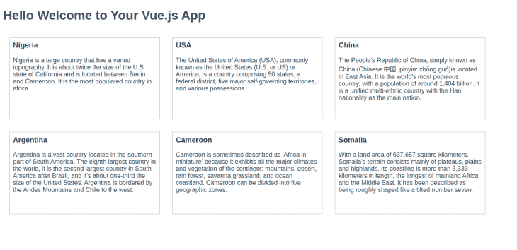

# 通过 Vue - LogRocket 博客使用 JSX

> 原文：<https://blog.logrocket.com/using-jsx-with-vue/>

构建 Vue 应用的常见方法是使用模板。使用渲染函数和 JSX 构建 Vue 应用程序并不常见。在本教程中，我们将学习什么是渲染函数以及它们是如何工作的。我们还将了解什么是 JSX，以及为什么您可能希望在您的 Vue 项目中使用它。

## 先决条件:

本教程要求遵循以下内容:

*   [Node.js 10x](https://nodejs.org/en/download/) 或更高版本和[纱](https://yarnpkg.com/lang/en/) / [npm 5.2 或更高版本](https://www.npmjs.com/get-npm)安装在您的 PC 上
*   JavaScript、 [React](https://reactjs.org/docs) 和/或 [Vue](https://vuejs.org/v2/guide) 基础知识
*   安装在您电脑上的 Vue CLI，您可以使用 yarn 执行以下命令:

```
yarn global add @vue/cli
```

## 入门指南

### 什么是渲染函数？

一个[渲染函数](https://vuejs.org/v2/guide/render-function.html)是任何返回虚拟 DOM 的函数，它们是模板代码在构建过程中被编译的对象。编译后的代码返回一个虚拟 DOM，Vue 对其进行处理以相应地生成实际的浏览器 DOM。

渲染函数比模板或 JSX 更接近编译器，它们利用`document.createElement()` Web API 方法来创建 HTML 文档。

### 渲染函数是如何工作的？

典型的渲染函数如下所示:

```
render (createElement){
 return createElement( 'div', {}, [....]
)}
```

`createElement`方法接受三个参数:

*   呈现元素，可以是 HTML 标记名或组件
*   一个可以包含数据对象的对象，如属性、属性、DOM 属性、样式、类和事件处理程序
*   子参数可以是子节点数组、单个子节点或纯文本

渲染函数中的`createElement`参数经常被写成`h`来表示由 Vue 的创造者[尤雨溪](https://twitter.com/youyuxi)解释的[。](https://github.com/vuejs/babel-plugin-transform-vue-jsx/issues/6#issuecomment-232994673)

Hyperscript 代表生成 HTML 结构并帮助用 JavaScript 创建标记的脚本。上面的渲染函数可以重写如下:

```
render (h){
 return h( 'div', {}, [....]
)}
```


A visual of the rendering process

## 虚拟世界

据[尤雨溪](https://twitter.com/youyuxi):

> 虚拟 DOM 是实际 DOM 在给定时间点的轻量级表示

Vue 创建一个虚拟 DOM，跟踪对真实 DOM 的所有更改，并且在每次数据更改时，Vue 都返回一个新的虚拟 DOM，然后将旧的虚拟 DOM 与新的虚拟 DOM 进行比较，检查特定的更改，并在真实 DOM 中进行调整。

比较和检查新旧虚拟 DOM 之间的变化的过程被称为[差异](https://en.wikipedia.org/wiki/Diff)。

这个[小应用](https://template-explorer.vuejs.org/)帮助探索 Vue 模板和渲染函数，你可以在这里了解更多关于 Vue 和虚拟 DOM [的渲染函数。](https://blog.logrocket.com/accessing-the-virtual-dom-using-render-functions-in-vue-js/)

## 什么是 JSX？

JSX 是一个用于编写 JavaScript 的类似 XML 的语法扩展。这是渲染函数的语法抽象。它是由[脸书的工程团队](https://opensource.facebook.com/)开发的，最初打算用于以一种更简洁优雅的方式构建 React 应用。

JSX，类似于 Vue 模板，在构建时被编译以呈现功能。

## 为什么你想在你的 Vue 项目中使用 JSX

*   它没有假设您的代码应该是什么样子或如何被处理。写 JSX 没有固定的方式
*   JSX 有助于防止跨站点脚本攻击，因为您永远不能插入不是在您的应用程序中显式编写的代码，所有内容在呈现之前都被转换为字符串
*   JSX 充满活力。它赋予您做任何您想做的事情的能力，因为它提供了 JavaScript 的全部编程能力
*   导入的组件无需注册，您可以随时使用它们
*   它将逻辑和标记耦合在一起，你不必与 JavaScript 分开写标记
*   可以在一个文件中编写几个组件，而不是像模板那样必须在单独的文件中编写每个组件
*   JSX 提供了对 spread 操作符的访问，这使得传递一个对象作为道具变得更加容易

## 常见的 Vue 模板特性及其 JSX 实现

### 条件句

#### 模板实现

```
<template>
   <div v-if="user.age > 18">
      Welcome, {{user.name}}
    </div>
</template>
```

如果用户的年龄大于 18 岁，上面的代码块将显示用户的姓名。

#### JSX 实施

```
export default {
....
  methods: {
      checkStatement(){
        if (this.user.age > 18) {
           return <div> Welcome, { this.user.name }</div>;
        }
      }
    },
    render(){
      return(
        {this.checkStatement()}
      )
    }
}
```

在 JSX 中，检查用户年龄的条件被封装在 Vue 方法实例中的函数中，然后在 render 方法中调用该函数。

### 循环(v 代表)

#### 模板实现

```
 <template>
  <div v-for="item in items" :key="item.id">
      {{ item }}
  </div
</template>
```

v-for 指令多次执行一个代码块。在上面的代码中，我们使用 v-for 指令来呈现数组中的项目列表。

#### JSX 实施

```
render(){
  return(
    {this.items.map(item => {
        return (
           <div> {item} </div>
          )
      }
  )}
```

在 JSX，可以使用 ES2015 `.map()`方法映射数组中的项目。

### 事件(垂直开启)

#### 模板实现

```
<template>
    <div>
      <button v-on:click="handleButtonClick()"> click me</button>
    </div>
</template>
<script>
export default {
  methods: {
      handleButtonClick(e){
          e.preventDefault();
          alert('button clicked')
        }   
    }
</script>
```

`v-on`指令监听 DOM 事件并触发一个执行定义操作的函数。在上面显示的代码中，点击按钮触发`handleButtonClick()`功能，显示一个`alert()`对话框。

#### JSX 实施

```
export default {
  methods: {
      handleButtonClick(e){
          e.preventDefault();
          alert('button clicked')
        }   
    },
  render(){
    return(
    <div>
       <button onClick={this.handleButtonClick}> click me</button>
    </div>
    )
  }
}
```

### 插值(v-html)

#### 模板实现

```
<template>
  <div>
     <div v-html="rawHtml"> </div>
  </div>
</template>
<script>
export default {
    data () {
      return {
        rawHtml: "<h1> This is some HTML </h1>",
      }
    }
}
</script>
```

v-html 用于设置元素`innerHTML`，上面的代码将 div 的`innerHTML`设置为`rawHtml`的内容。

#### JSX 实施

```
export default {
    data () {
      return {
        rawHtml: "<h1> This is some HTML </h1>",
      }
    },
    render(){
        return(
          <div>
            <div domPropsInnerHTML={this.rawHtml}> </div>
          </div>
        )
      }
}
```

`domPropsInnerHTML`属性执行与`v-html`相同的任务，它将 div 的内容设置为`rawHtml`。

### 导入组件

#### 模板实现

```
<template>
  <div>
    <NewComponent/>
  </div>
</template>
<script>
import NewComponent from "NewComponent.vue";
export default {
  data () {
    return {
      components:{
        NewComponent,
      },
</script>
```

#### JSX 实施

当使用 JSX 时，不需要在导入组件后注册它，你可以直接使用它。

```
import NewComponent from 'NewComponent.vue'
....
  render(){
    return(
     <div> <NewComponent/></div>
    )
  }
```

## 如何与 JSX 一起建立 Vue 项目

对于这一部分，我们将构建一个小应用程序，显示一些选定国家的信息。

创建新项目

```
vue create vue-jsx
```

使用 yarn 在项目中安装使用 JSX 所需的依赖项:

```
yarn add @vue/babel-preset-jsx @vue/babel-helper-vue-jsx-merge-props
```

通过在位于项目根目录的`.babelrc`或`babel.config.js`文件中包含以下内容，配置您的 babel 文件以使用 JSX 的预设:

```
{
  "presets": ["@vue/babel-preset-jsx"],
}
```

通过`@vue/babel-preset-jsx`预设，您可以使用 Vue 团队提供的 [JSX 预设](https://github.com/vuejs/jsx/tree/dev/packages/babel-preset-jsx)。

Vue 自动在每个方法中注入`h`，这是`createElement`的缩写，所以你不必总是在你的`render()`函数中声明`h`作为参数。

## 测试我们的 Vue-JSX 应用

为了进行测试，用以下内容替换`src/components`文件夹中的`HelloWorld.vue`文件的内容:

```
<script>
export default {
  data () {
    return {
      countries: [
        {
          name: 'Nigeria',
          description: "Nigeria is a large country that has a varied topography. It is about twice the size of the U.S. state of California and is located between Benin and Cameroon. It is the most populated country in africa"
        },
        {
          name: 'USA',
          description: "The United States of America (USA), commonly known as the United States (U.S. or US) or America, is a country comprising 50 states, a federal district, five major self-governing territories, and various possessions."
        },
        {
          name: 'China',
          description: "The People's Republic of China, simply known as China (Chinese:中国, pinyin: zhōng guó)is located in East Asia. It is the world's most populous country, with a population of around 1.404 billion. It is a unified multi-ethnic country with the Han nationality as the main nation."
        },
        {
          name: 'Argentina',
          description: "Argentina is a vast country located in the southern part of South America. The eighth largest country in the world, it is the second largest country in South America after Brazil, and it's about one-third the size of the United States. Argentina is bordered by the Andes Mountains and Chile to the west."
        },
         {
          name: 'Cameroon',
          description: "Cameroon is sometimes described as 'Africa in miniature' because it exhibits all the major climates and vegetation of the continent: mountains, desert, rain forest, savanna grassland, and ocean coastland. Cameroon can be divided into five geographic zones."
         },
         {
          name: 'Somalia',
          description: "With a land area of 637,657 square kilometers, Somalia's terrain consists mainly of plateaus, plains and highlands. Its coastline is more than 3,333 kilometers in length, the longest of mainland Africa and the Middle East. It has been described as being roughly shaped like a tilted number seven."
        }
      ]
    }
  },
  props: {
    msg: String
  },
  methods: {
    //where you write methods or functions used in your component
  },
  render () {
    return (
      <div>
        <div class="content">
          <h1>Hello, { this.msg } </h1>
          <main class="country-wrapper">
            {
              this.countries.map(country => {
                return (
                  <div class="country-container">
                    <h3 class="country-name ">{country.name}</h3>
                    <article class="country-description">{country.description}</article>
                  </div>
                )
              })
            }
          </main>
        </div>
      </div>
    )
  }
}
</script>
<!-- Add "scoped" attribute to limit CSS to this component only -->
<style scoped lang="scss">
.content{
  width: 100%;
  .country-wrapper{
    width: 100%;
    display: flex;
    flex-direction: row;
    flex-wrap: wrap;
    .country-container{
      display: flex;
      flex-direction: column;
      text-align:start;
      margin: 1em;
      padding: .5em;
      width: 28%;
      height: 12em;
      border: .08em solid #c4c4c4;
      .country-name{
        margin: 0;
        margin-bottom: 1em;
      }
    }
  }
}
</style>
```

您应该会得到类似如下的结果:



## 结论

我们已经看到了渲染函数是如何工作的，以及如何设置一个 Vue 项目来使用 JSX，请在 [GitHub](https://github.com/Jolaolu/jsx-in-vue) 上查看这篇文章的资源库。要了解你可以用 Vue.js 做的更棒的事情，请查看[文档](https://vuejs.org/v2/guide/render-function.html)。

## 像用户一样体验您的 Vue 应用

调试 Vue.js 应用程序可能会很困难，尤其是当用户会话期间有几十个(如果不是几百个)突变时。如果您对监视和跟踪生产中所有用户的 Vue 突变感兴趣，

[try LogRocket](https://lp.logrocket.com/blg/vue-signup)

.

[](https://lp.logrocket.com/blg/vue-signup)[https://logrocket.com/signup/](https://lp.logrocket.com/blg/vue-signup)

LogRocket 就像是网络和移动应用程序的 DVR，记录你的 Vue 应用程序中发生的一切，包括网络请求、JavaScript 错误、性能问题等等。您可以汇总并报告问题发生时应用程序的状态，而不是猜测问题发生的原因。

LogRocket Vuex 插件将 Vuex 突变记录到 LogRocket 控制台，为您提供导致错误的环境，以及出现问题时应用程序的状态。

现代化您调试 Vue 应用的方式- [开始免费监控](https://lp.logrocket.com/blg/vue-signup)。