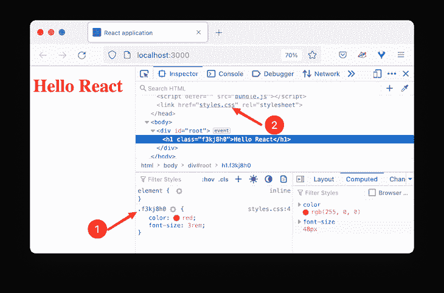
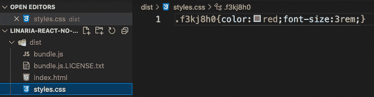
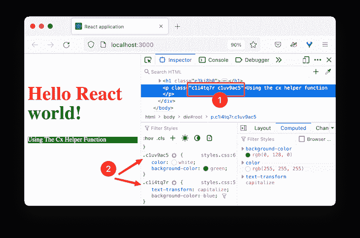
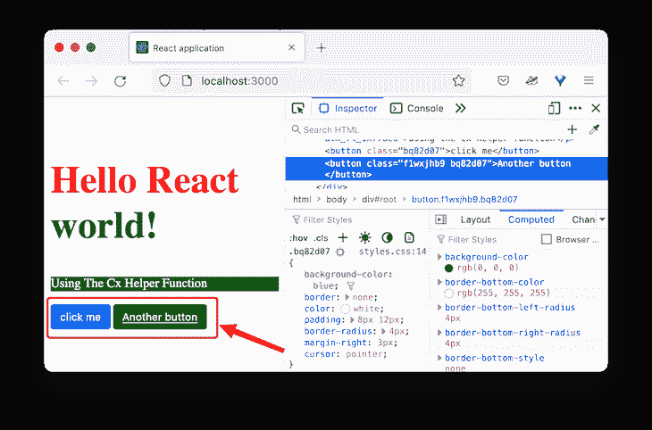
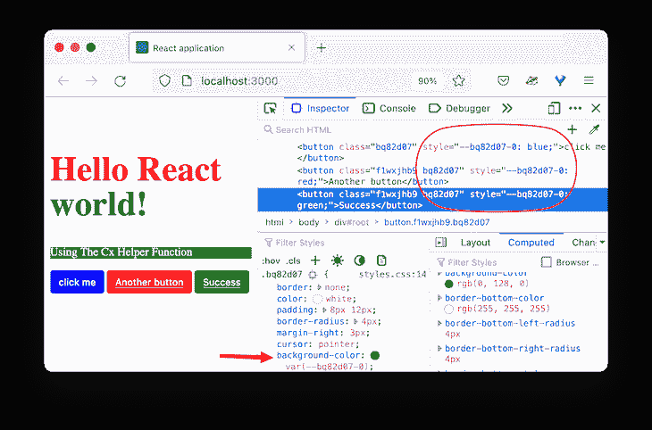
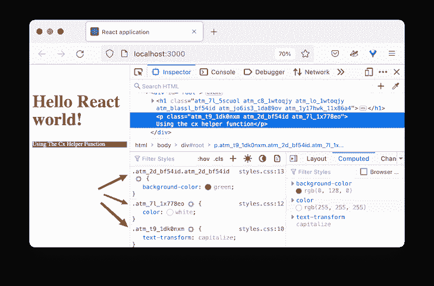
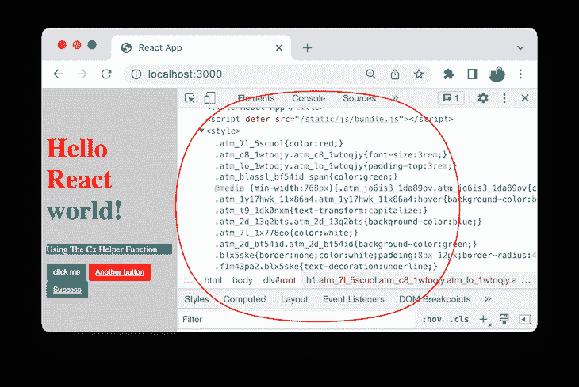
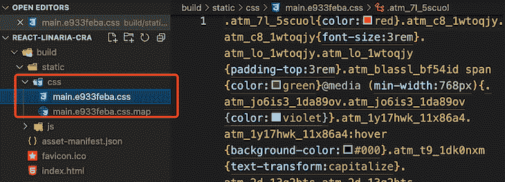

# 在 React apps 中使用 Linaria 实现更快的 CSS-in-JS

> 原文：<https://blog.logrocket.com/using-linaria-faster-css-in-js-react-apps/>

在构建像 React 这样的基于组件的应用程序时，编写 CSS-in-JS 很流行。这项技术让我们不用在组件和样式表之间导航就能构建应用程序。它还提供了一种通过利用 JavaScript 环境来增强我们应用程序的 CSS 的方法。

许多库可以用来简化我们编写 CSS-in-JS 的方式。它们提供了额外的好处，包括自动供应商前缀、熟悉的 CSS 语法、CSS 组件范围、嵌套等等。

在本文中，我们将探讨如何在 React 应用程序中使用名为 Linaria 的零运行时 CSS-in-JS 库。我们将涵盖:

要跟进，请确保您对 React 有基本的了解。

## 什么是 Linaria？

一些流行的库，叫做运行时库，包括`[styled-components](https://blog.logrocket.com/styled-components-vs-emotion-for-handling-css/)` [和](https://blog.logrocket.com/styled-components-vs-emotion-for-handling-css/)。这意味着他们将解析 CSS-in-JS，生成实际的 CSS，并在运行时将其注入到项目中——即当页面在浏览器中加载时。

这些操作引入了额外的运行时开销，因此可能会导致性能瓶颈。

Linaria 是一个构建时 CSS-in-JS 库。它让我们像前面提到的运行时库一样在 JavaScript 内部编写 CSS。但是，它没有将 CSS 与 JS 捆绑在一起——这会增加捆绑包的大小——而是在构建时将样式提取到一个静态 CSS 文件中，从而消除了运行时的额外工作量。

有了这个实现，CSS 和 JavaScript 资源可以并行加载，提供了额外的性能提升，并最终缩短了加载时间。

## 是什么让 Linaria 很难在 React 应用中设置？

在 React 中添加 Linaria 可能是一项艰巨的任务。与大多数需要最小设置的 CSS-in-JS 库不同，Linaria 要求我们[定制一个类似 webpack](https://blog.logrocket.com/versatile-webpack-configurations-react-application/) 的捆绑器。然后我们可以包含一个 webpack 加载器，在构建时从 JS 中提取 CSS。

用`[create-react-app](https://blog.logrocket.com/getting-started-with-create-react-app-d93147444a27/)`[CLI](https://blog.logrocket.com/getting-started-with-create-react-app-d93147444a27/)创建的 React 项目已经预先配置了 webpack。但是这个设置不支持开箱定制 webpack，除非我们[运行](https://blog.logrocket.com/everything-you-need-know-about-react-scripts/#eject) `[eject](https://blog.logrocket.com/everything-you-need-know-about-react-scripts/#eject)` [脚本](https://blog.logrocket.com/everything-you-need-know-about-react-scripts/#eject)，这是不可取的。

然而，我们可以使用像`[customize-cra](https://github.com/arackaf/customize-cra)`和`[react-app-rewired](https://github.com/timarney/react-app-rewired)`这样的外部库来调整 webpack 配置。

在下一节中，我们将介绍如何在没有`create-react-app` CLI 的情况下将 Linaria 添加到 React 项目中。在本课的后面，我们将介绍在创建-反应-应用程序设置中的 Linaria 集成。

## 设置 Linaria 而不创建 React 应用程序

让我们从下载一个我在没有`create-react-app` CLI 的情况下创建的 [React starter 项目](https://github.com/Ibaslogic/react-without-cra-starter)开始。下面的命令将从 GitHub 存储库中克隆项目:

```
git clone https://github.com/Ibaslogic/react-without-cra-starter 
```

像每个 React 开发环境一样，该项目包含 Babel 和 webpack 安装。我们将使用项目根目录中的 webpack 配置文件来包含 Linaria 需要的 webpack 加载器。

让我们从项目目录运行`npm install`，然后使用`npm start`命令启动项目。

### 安装 Linaria 库

运行以下命令安装 Linaria 核心库及其依赖项:

```
npm install @linaria/core @linaria/react @linaria/babel-preset @linaria/webpack-loader 
```

接下来，在项目根中找到`webpack.config.js`文件，并在`module.rules`中的`babel-loader`后添加`@linaria/webpack-loader`:

```
{
  test: /\.(js|jsx)$/,
  exclude: /node_modules/,
  use: [
    { loader: 'babel-loader' },
    {
      loader: '@linaria/webpack-loader',
      options: {
        sourceMap: process.env.NODE_ENV !== 'production',
      },
    },
  ],
}, 
```

在下面的规则中，我们告诉 webpack 使用`babel-loader`通过我们在`.babelrc` Babel 配置文件中添加的 Babel 预置来传输 JavaScript 文件:

```
{
  "presets": [
    "@babel/preset-env",
    ["@babel/preset-react", {
      "runtime" : "automatic"
    }] 
  ]
} 
```

在 webpack 配置文件中，您可能会注意到我们包含了`css-loader`和`MiniCssExtractPlugin`。Linaria 依靠它们来提取样式:

```
{
  test: /\.css$/,
  use: [MiniCssExtractPlugin.loader, 'css-loader'],
}, 
```

上面的代码相当于下面的代码:

```
{
  test: /\.css$/,
  use: [
    {
      loader: MiniCssExtractPlugin.loader,
    },
    {
      loader: 'css-loader',
    },
  ],
}, 
```

我们还可以在开发模式下启用可选的`SourceMap`，这让我们可以从浏览器的开发工具中看到类名的来源，以便进行调试:

```
{
  test: /\.css$/,
  use: [
    {
      loader: MiniCssExtractPlugin.loader,
    },
    {
      loader: 'css-loader',
      options: {
        sourceMap: process.env.NODE_ENV !== 'production',
      },
    },
  ],
}, 
```

保存所有文件。重新启动你的应用程序，并确保它仍然工作。

## Linaria 语法和用法

Linaria 提供对 API 的访问，比如`css`标记的模板文字、`styled`标记和`cx`辅助函数。所以，让我们把它们应用到我们的项目中。

### `css`标记的模板文字

标记的模板文字是一个 JavaScript 函数，包含常规 CSS 语法中的样式声明。要在我们的项目中应用它，打开`src/components/App.js`文件，从核心库中导入`css`字符串标签，并像这样使用它:

```
import React from 'react';
import { css } from '@linaria/core';

const App = () => {
  return <h1 className={eleStyle}>Hello React</h1>;
};

export default App;

const eleStyle = css`
  color: red;
  font-size: 3rem;
`; 
```

如果我们保存文件，我们的应用程序应该如下所示:



`css`字符串标签计算出一个惟一的类名，其样式规则被提取到一个`styles.css`文件中。这个文件名是在 webpack 配置中定义的。

如果我们用`npm run build`运行一个构建命令，我们将在包含生产就绪文件的项目根目录中生成一个名为`dist`的构建文件夹，其中包括静态的`styles.css`文件。



### 对象插值

Linaria 允许对象样式插值，因此我们可以使用输出基于对象样式的库。

```
const objStyle = {
  paddingTop: '3rem',
};

const eleStyle = css`
  color: red;
  font-size: 3rem;

  ${objStyle}
`; 
```

对象样式在插入样式表之前，在构建时被评估为 CSS 字符串。等价的看起来是这样的:

```
const eleStyle = css`
  color: red;
  font-size: 3rem;

  padding-top: 3rem;
`; 
```

### 嵌套

类似于 [Sass 和其他 CSS-in-JS 库](https://blog.logrocket.com/sass-react-native-guide/)，Linaria 也[支持 CSS 嵌套](https://blog.logrocket.com/native-css-nesting/):

```
const App = () => {
  return (
    <h1 className={eleStyle}>
      Hello React <span>world!</span>
    </h1>
  );
};

export default App;

const eleStyle = css`

  /* ... */

  span {
    color: green;
  }

  @media (min-width: 768px) {
    color: violet;
  }
  &:hover {
    background-color: black;
  }
`; 
```

### `cx`助手功能

`cx`助手让我们传递一个类名列表来样式化一个元素。像`css`标记的模板一样，我们也将从核心导入`cx`:

```
import { css, cx } from '@linaria/core';

const App = () => {
  return (
    <>
      {/* ... */}
      <p className={cx(class1, class2)}>
        Using the cx helper function
      </p>
    </>
  );
};

export default App;

const class1 = css`
  text-transform: capitalize;
  background-color: blue;
`;
const class2 = css`
  color: white;
  background-color: green;
`; 
```

输出现在看起来像这样:



正如您在上面的图片中所看到的，传递给`cx`助手的类列表计算出不同的类名。

### `styled`标签

该语法支持与`css`标记模板相同的特性，但是增加了基于属性的样式。`styled`标签让我们编写类似于`[styled-components](https://blog.logrocket.com/benefits-using-styled-components-react/)`[库](https://blog.logrocket.com/benefits-using-styled-components-react/)的组件样式。

让我们从`@linaria/react`模块导入`styled`标签，并像这样使用它:

```
import { styled } from '@linaria/react';

const App = () => {
  return (
    <>
      {/* ... */}

      <Button>click me</Button>
    </>
  );
};

export default App;

const Button = styled.button`
  background-color: blue;
  border: none;
  color: white;
  padding: 8px 12px;
  border-radius: 4px;
  margin-right: 3px;
  cursor: pointer;
`; 
```

在上面的代码中，我们创建了一个`Button`样式组件，使用了`styled`标签，后跟`button` HTML 标签及其样式规则。

### 在 Linaria 中覆盖或继承样式规则

我们可以扩展`styled`标签来继承样式规则。在下面的代码中，我们将呈现一个从`Button`组件继承样式规则的`FancyButton`样式组件。我们将使用`styled(...)`标签来完成这项工作:

```
const App = () => {
  return (
    <>
      {/* ... */}

      <Button>click me</Button>
      <FancyButton>Another button</FancyButton>
    </>
  );
};

export default App;

const Button = styled.button`
  /* ... */
`;

const FancyButton = styled(Button)`
  background-color: black;
  text-decoration: underline;
`; 
```

结果看起来是这样的:



正如你在上面的图片中看到的，标签为`click me`的按钮使用了默认的蓝色背景按钮样式。然而，通过扩展`styled`标签，我们也可以拥有一个标有`Another button`的奇特按钮，带有黑色背景和下划线文本。

### 基于道具的样式

标签支持动态样式，我们根据组件的属性来设计组件的样式。下面的代码呈现了使用`primary`和`success`道具的样式组件:

```
import { styled } from '@linaria/react';

const App = () => {
  return (
    <>
      {/* ... */}

      <Button primary>click me</Button>
      <FancyButton>Another button</FancyButton>
      <FancyButton success>Success</FancyButton>
    </>
  );
};

export default App;

const Button = styled.button`
  /* background-color: blue; */
  border: none;
  color: white;
  padding: 8px 12px;
  border-radius: 4px;
  margin-right: 3px;
  cursor: pointer;
  background-color: ${(props) =>
    props.primary ? 'blue' : props.success ? 'green' : 'red'};
`;

const FancyButton = styled(Button)`
  /* background-color: black; */
  text-decoration: underline;
`; 
```

我们可以访问组件的属性作为函数插值中的函数参数。使用三元运算符，我们检查接收到的属性是`primary`还是`success`或者没有，然后相应地设置样式。动态函数插值将在构建时编译成 CSS 变量。

查看结果:



如上图所示，插值函数被编译成一个 CSS 变量，并在运行时动态更新。

## 在 Linaria 中使用原子 CSS

Linaria 还支持原子样式，因此每个类选择器只能产生一个样式规则。

在上图中，我们可以看到`green`背景颜色覆盖了`blue`颜色。这是意料之中的，因为根据级联原则，最后声明的规则优先于[。](https://blog.logrocket.com/how-css-works-understanding-the-cascade-d181cd89a4d8/)

但是，我们可以告诉 Linaria 查看声明并过滤重复项，从而减小包的大小。

要添加原子 CSS 支持，让我们用下面的命令安装`@linaria/atomic`:

```
npm install @linaria/atomic

```

要使用它，我们必须确保`css`标记的模板是从原子模块而不是核心导入的:

```
// import { css, cx } from '@linaria/core';
import { cx } from '@linaria/core';
import { css } from '@linaria/atomic';

const App = () => {
  return (
    <>
      {/* ... */}

      <p className={cx(class1, class2)}>
        Using the cx helper function
      </p>
    </>
  );
};

```

如果我们保存文件，结果应该是这样的:



如上所述，每个类选择器现在只产生一个样式规则。

注意[使用](#cx-helper-function) `[cx](#cx-helper-function)` [助手函数](#cx-helper-function)——如前所述——是为了避免重复。

## 在 Linaria 中编写全局样式

到目前为止，我们已经创建了样式规则，这些规则或者使用`css`字符串限定类名的范围，或者使用`styled`标记限定特定组件的范围。

现在，让我们看看如何编写全局样式来定义像浏览器重置这样的全局规则。在`src`文件夹中，让我们创建一个`styles/global.js`文件并添加以下全局样式:

```
import { css } from '@linaria/core';

export const globals = css`
  :global() {
    html {
      box-sizing: border-box;
    }

    *,
    *:before,
    *:after {
      box-sizing: inherit;
    }

    body {
      background-color: #cecece;
    }
  }
`;

```

然后像这样导入`src/index.js`文件中的文件:

```
import './styles/globals';

```

保存并确保应用全局样式。代码中使用的`:global()`操作符声明了全局范围内的样式规则。

此时，您应该能够在一个新的 React 项目中使用 Linaria。这是我们项目的源代码。

接下来，我们将探讨如何将 Linaria 集成到 Create React App CLI 项目中。

## 使用 Linaria 和 Create React 应用程序

如果您的应用程序是用 CRA CLI 设置的[，您将需要修改`webpack.config.js`文件。](https://github.com/facebook/create-react-app)

如前所述，默认设置没有公开这个文件供我们使用。在不弹出 CRA 的情况下，我们可以安装`customize-cra`和`react-app-rewired`，它们提供了定制 CRA 和调整 webpack 配置的工具。

因此，让我们从安装这些库开始:

```
npm install --save-dev customize-cra react-app-rewired

```

之后，在根目录下创建一个`config-overrides.js`向 webpack 添加一个规则。在该文件中，添加以下代码:

```
const {
  useBabelRc,
  override,
  addWebpackModuleRule,
} = require('customize-cra');

module.exports = override(
  useBabelRc(),
  addWebpackModuleRule({
    // do stuff with webpack
  })
);

```

`override`函数让我们使用插件来修改配置对象。例如，`useBabelRc()`导致使用 Babel 配置文件。让我们在根目录下快速创建`.babelrc`文件，并添加以下预置:

```
{
  "presets": [
    "@babel/preset-env",
    ["@babel/preset-react", {
      "runtime" : "automatic"
    }] 
  ]
}

```

`addWebpackModuleRule`让我们将规则添加到 webpack 配置的`module.rules`数组中。类似于我们之前所做的，让我们更新`config-overrides.js`文件如下:

```
module.exports = override(
  useBabelRc(),
  addWebpackModuleRule({
    test: /\.(js|jsx)$/,
    exclude: /node_modules/,
    use: [
      { loader: 'babel-loader' },
      {
        loader: '@linaria/webpack-loader',
        options: {
          sourceMap: process.env.NODE_ENV !== 'production',
        },
      },
    ],
  })
);

```

注意，我们添加了一个 Linaria 加载程序。让我们将它与其他 Linaria 依赖项一起安装:

```
npm install @linaria/core @linaria/react @linaria/babel-preset @linaria/atomic @linaria/webpack-loader

```

接下来，打开`package.json`文件，更新除`eject`之外的`scripts`命令:

```
"scripts": {
  "start": "react-app-rewired start",
  "build": "react-app-rewired build",
  "test": "react-app-rewired test",
  "eject": "react-scripts eject"
},

```

保存所有文件并运行`npm start`来启动开发服务器。

### 向我们的 Create React 应用程序项目添加 Linaria 样式

让我们从上一个项目中复制`[App.js](https://github.com/Ibaslogic/linaria-react-no-cra/blob/main/src/components/App.js)` [代码来替换我们新项目中的`src/App.js`。保存并测试您的项目。应该能行！](https://github.com/Ibaslogic/linaria-react-no-cra/blob/main/src/components/App.js)

接下来，对于全局样式，在`src`目录中创建一个`styles/globals.js`。[从最后一个项目](https://github.com/Ibaslogic/linaria-react-no-cra/blob/main/src/styles/globals.js)中复制全局样式并粘贴到新创建的文件中。保存并确保在`src/index.js`文件中导入全局样式:

```
// import './index.css';
import './styles/globals';

```

保存文件并查看网页上应用的全局样式。

在开发环境中， [CRA 不使用](https://github.com/facebook/create-react-app/blob/main/packages/react-scripts/config/webpack.config.js#L665) `[MiniCSSExtractPlugin](https://github.com/facebook/create-react-app/blob/main/packages/react-scripts/config/webpack.config.js#L665)`，这允许 Linaria 将样式提取到一个静态文件中。它使用支持热编辑的样式加载器在`<style>`标签中提取样式:



然而，对于生产构建，Linaria 将利用`MiniCSSExtractPlugin`的存在将样式提取到一个文件中。

如果我们停止开发服务器，然后运行`npm run build`命令，我们将生成一个包含生产就绪文件的`build`文件夹，其中包括静态 CSS 文件:



在 [GitHub 库](https://github.com/Ibaslogic/react-linaria-cra)中找到源代码。

## 结论

Linaria 在现代开发中越来越受欢迎，因为它的运行时能力为零。这是一个有大量社区参与的健康项目。

虽然 Linaria 可能很难配置，并且在添加创建 React 应用程序项目时令人望而生畏，但使用它来设计组件就像编写具有嵌套功能的普通 CSS 一样简单。

我希望这个指南对你有所帮助。如果你有问题或贡献，请在评论区分享你的想法。

## [LogRocket](https://lp.logrocket.com/blg/react-signup-general) :全面了解您的生产 React 应用

调试 React 应用程序可能很困难，尤其是当用户遇到难以重现的问题时。如果您对监视和跟踪 Redux 状态、自动显示 JavaScript 错误以及跟踪缓慢的网络请求和组件加载时间感兴趣，

[try LogRocket](https://lp.logrocket.com/blg/react-signup-general)

.

[ ](https://lp.logrocket.com/blg/react-signup-general) [](https://lp.logrocket.com/blg/react-signup-general) 

LogRocket 结合了会话回放、产品分析和错误跟踪，使软件团队能够创建理想的 web 和移动产品体验。这对你来说意味着什么？

LogRocket 不是猜测错误发生的原因，也不是要求用户提供截图和日志转储，而是让您回放问题，就像它们发生在您自己的浏览器中一样，以快速了解哪里出错了。

不再有嘈杂的警报。智能错误跟踪允许您对问题进行分类，然后从中学习。获得有影响的用户问题的通知，而不是误报。警报越少，有用的信号越多。

LogRocket Redux 中间件包为您的用户会话增加了一层额外的可见性。LogRocket 记录 Redux 存储中的所有操作和状态。

现代化您调试 React 应用的方式— [开始免费监控](https://lp.logrocket.com/blg/react-signup-general)。